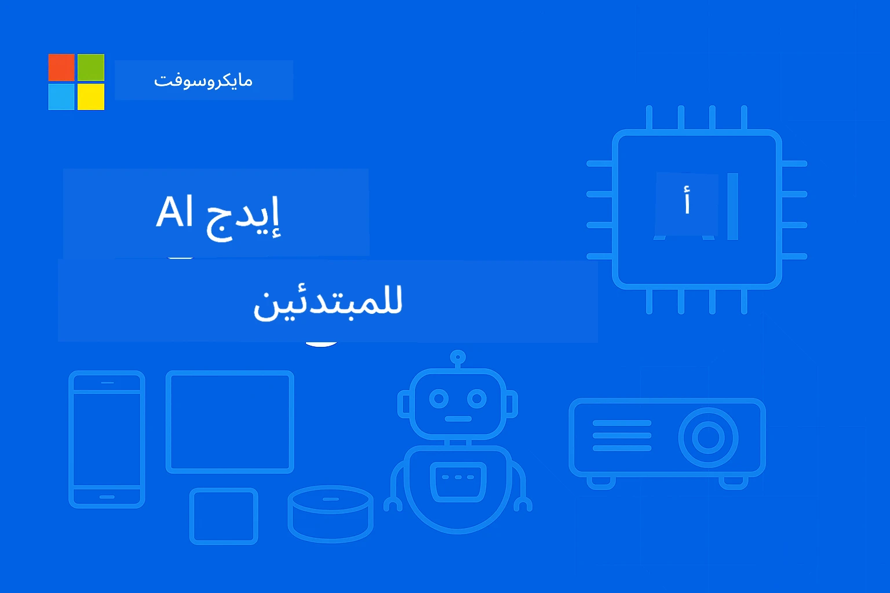

# EdgeAI للمبتدئين




[](https://GitHub.com/microsoft/edgeai-for-beginners/graphs/contributors)
[](https://GitHub.com/microsoft/edgeai-for-beginners/issues)
[](https://GitHub.com/microsoft/edgeai-for-beginners/pulls)
[](http://makeapullrequest.com)

[](https://GitHub.com/microsoft/edgeai-for-beginners/watchers)
[](https://GitHub.com/microsoft/edgeai-for-beginners/fork)
[](https://GitHub.com/microsoft/edgeai-for-beginners/stargazers)


[](https://discord.gg/nTYy5BXMWG)

اتبع هذه الخطوات للبدء باستخدام هذه الموارد:

1. **فرّع المستودع**: انقر على [](https://GitHub.com/microsoft/edgeai-for-beginners/fork)
2. **انسخ المستودع**: `git clone https://github.com/microsoft/edgeai-for-beginners.git`
3. [**انضم إلى Azure AI Foundry Discord والتق بخبراء ومطوّرين**](https://discord.com/invite/ByRwuEEgH4)


### 🌐 دعم متعدد اللغات

#### مدعوم عبر GitHub Action (آلي ومحدث دائماً)

<!-- CO-OP TRANSLATOR LANGUAGES TABLE START -->
[العربية](./README.md) | [البنغالية](../bn/README.md) | [البلغارية](../bg/README.md) | [البورمية (ميانمار)](../my/README.md) | [الصينية (المبسطة)](../zh-CN/README.md) | [الصينية (التقليدية، هونغ كونغ)](../zh-HK/README.md) | [الصينية (التقليدية، ماكاو)](../zh-MO/README.md) | [الصينية (التقليدية، تايوان)](../zh-TW/README.md) | [الكرواتية](../hr/README.md) | [التشيكية](../cs/README.md) | [الدنماركية](../da/README.md) | [الهولندية](../nl/README.md) | [الإستونية](../et/README.md) | [الفنلندية](../fi/README.md) | [الفرنسية](../fr/README.md) | [الألمانية](../de/README.md) | [اليونانية](../el/README.md) | [العبريّة](../he/README.md) | [الهندية](../hi/README.md) | [الهنغارية](../hu/README.md) | [الإندونيسية](../id/README.md) | [الإيطالية](../it/README.md) | [اليابانية](../ja/README.md) | [الكانادا](../kn/README.md) | [الكورية](../ko/README.md) | [الليتوانية](../lt/README.md) | [الماليزية](../ms/README.md) | [المالايالامية](../ml/README.md) | [الماراثية](../mr/README.md) | [النيبالية](../ne/README.md) | [البيدجين النيجيري](../pcm/README.md) | [النرويجية](../no/README.md) | [الفارسية (الفارسية)](../fa/README.md) | [البولندية](../pl/README.md) | [البرتغالية (البرازيل)](../pt-BR/README.md) | [البرتغالية (البرتغال)](../pt-PT/README.md) | [البنجابية (غورموخي)](../pa/README.md) | [الرومانية](../ro/README.md) | [الروسية](../ru/README.md) | [الصربية (السيريلية)](../sr/README.md) | [السلوفاكية](../sk/README.md) | [السلوفينية](../sl/README.md) | [الإسبانية](../es/README.md) | [السواحلية](../sw/README.md) | [السويدية](../sv/README.md) | [التاغالوغ (الفلبينية)](../tl/README.md) | [التاميلية](../ta/README.md) | [التيلوجو](../te/README.md) | [التايلاندية](../th/README.md) | [التركية](../tr/README.md) | [الأوكرانية](../uk/README.md) | [الأردية](../ur/README.md) | [الفيتنامية](../vi/README.md)

> **تفضل النسخ محلياً؟**

> هذا المستودع يتضمن أكثر من 50 ترجمة للغات مما يزيد بشكل كبير حجم التنزيل. للنسخ بدون الترجمات، استخدم السحب الانتقائي:
> ```bash
> git clone --filter=blob:none --sparse https://github.com/microsoft/edgeai-for-beginners.git
> cd edgeai-for-beginners
> git sparse-checkout set --no-cone '/*' '!translations' '!translated_images'
> ```
> هذا يمنحك كل ما تحتاج لإكمال الدورة بتحميل أسرع بكثير.
<!-- CO-OP TRANSLATOR LANGUAGES TABLE END -->

**إذا كنت ترغب في دعم المزيد من لغات الترجمة، فهي مدرجة [هنا](https://github.com/Azure/co-op-translator/blob/main/getting_started/supported-languages.md)**

## مقدمة

مرحبًا بك في **EdgeAI للمبتدئين** – رحلتك الشاملة إلى عالم الذكاء الاصطناعي عند الحافة التحولي. تجمع هذه الدورة بين قدرات الذكاء الاصطناعي القوية والتنفيذ العملي في العالم الحقيقي على أجهزة الحافة، مما يمكّنك من استغلال إمكانات الذكاء الاصطناعي مباشرةً حيث يتم توليد البيانات واتخاذ القرارات.

### ما ستتقنه

تأخذك هذه الدورة من المفاهيم الأساسية إلى التنفيذات الجاهزة للإنتاج، مع تغطية:
- **نماذج اللغة الصغيرة (SLMs)** المحسنة لنشر الحافة
- **التحسين الواعي للأجهزة** عبر منصات متنوعة
- **الاستدلال في الوقت الحقيقي** مع إمكانيات الحفاظ على الخصوصية
- **استراتيجيات النشر في الإنتاج** لتطبيقات المؤسسات

### لماذا يعتبر EdgeAI مهمًا

يمثل الذكاء الاصطناعي عند الحافة تحولاً يعالج تحديات العصر الحديثة الحرجة:
- **الخصوصية والأمان**: معالجة البيانات الحساسة محليًا دون تعرض للسحابة
- **الأداء في الوقت الحقيقي**: القضاء على تأخير الشبكة لتطبيقات حساسة للوقت
- **الكفاءة في التكلفة**: تقليل نفقات النطاق الترددي والحوسبة السحابية
- **العمليات المرنة**: الحفاظ على الوظائف أثناء انقطاعات الشبكة
- **الامتثال التنظيمي**: تلبية متطلبات سيادة البيانات

### الذكاء الاصطناعي عند الحافة

يشير الذكاء الاصطناعي عند الحافة إلى تشغيل خوارزميات الذكاء الاصطناعي ونماذج اللغة محليًا على الأجهزة، بالقرب من حيث تُنتج البيانات، دون الاعتماد على موارد السحابة عند الاستدلال. يقلل من زمن الاستجابة، يُحسّن الخصوصية، ويُمكّن من اتخاذ القرار الفوري.

### المبادئ الأساسية:
- **الاستدلال على الجهاز**: تعمل نماذج الذكاء الاصطناعي على أجهزة الحافة (الهواتف، أجهزة التوجيه، المتحكمات الدقيقة، الحواسيب الصناعية)
- **القدرة دون اتصال**: تعمل بدون اتصال إنترنت مستمر
- **زمن استجابة منخفض**: استجابات فورية مناسبة للأنظمة الحقيقية
- **سيادة البيانات**: يحتفظ بالبيانات الحساسة محليًا، مما يحسن الأمان والامتثال

### نماذج اللغة الصغيرة (SLMs)

نماذج مثل Phi-4 وMistral-7B وGemma هي نسخ محسنة من نماذج اللغة الكبيرة – تم تدريبها أو استخلاصها من أجل:
- **تقليل حجم الذاكرة**: استخدام فعال لذاكرة أجهزة الحافة المحدودة
- **انخفاض طلب الحوسبة**: محسنة لأداء وحدات المعالجة المركزية ووحدات معالجة الرسومات عند الحافة
- **أوقات بدء تشغيل أسرع**: تهيئة سريعة لتطبيقات الاستجابة

تفتح قدرات معالجة اللغة الطبيعية القوية مع تلبية القيود الخاصة بـ:
- **الأنظمة المدمجة**: أجهزة إنترنت الأشياء وأجهزة التحكم الصناعية
- **الأجهزة المحمولة**: الهواتف الذكية والأجهزة اللوحية مع إمكانيات دون اتصال
- **أجهزة إنترنت الأشياء**: الحساسات والأجهزة الذكية ذات الموارد المحدودة
- **خوادم الحافة**: وحدات المعالجة المحلية ذات موارد GPU محدودة
- **الحواسيب الشخصية**: سيناريوهات النشر على سطح المكتب واللابتوب

## وحدات الدورة والتنقل

| الوحدة | الموضوع | مجال التركيز | المحتوى الأساسي | المستوى | المدة |
|--------|---------|--------------|-----------------|----------|--------|
| [📖 00 ](./introduction.md) | [مقدمة إلى EdgeAI](./introduction.md) | الأساس والسياق | نظرة عامة على EdgeAI • تطبيقات صناعية • مقدمة إلى SLM • أهداف التعلم | مبتدئ | 1-2 ساعة |
| [📚 01](../../Module01) | [أساسيات EdgeAI](./Module01/README.md) | مقارنة بين الحوسبة السحابية وEdge AI | أساسيات EdgeAI • دراسات الحالة الواقعية • دليل التنفيذ • نشر الحافة | مبتدئ | 3-4 ساعات |
| [🧠 02](../../Module02) | [أساسيات نماذج اللغة الصغيرة](./Module02/README.md) | عائلات النماذج والبنية | عائلة Phi • عائلة Qwen • عائلة Gemma • BitNET • μModel • Phi-Silica | مبتدئ | 4-5 ساعات |
| [🚀 03](../../Module03) | [ممارسة نشر SLM](./Module03/README.md) | النشر المحلي والسحابي | التعلم المتقدم • البيئة المحلية • النشر السحابي | متوسط | 4-5 ساعات |
| [⚙️ 04](../../Module04) | [أدوات تحسين النموذج](./Module04/README.md) | تحسين عبر المنصات | مقدمة • Llama.cpp • Microsoft Olive • OpenVINO • Apple MLX • توليف سير العمل | متوسط | 5-6 ساعات |
| [🔧 05](../../Module05) | [إدارة إنتاج SLM](./Module05/README.md) | عمليات الإنتاج | مقدمة SLMOps • استخلاص النموذج • التخصيص الدقيق • نشر الإنتاج | متقدم | 5-6 ساعات |
| [🤖 06](../../Module06) | [وكلاء الذكاء الاصطناعي واستدعاء الدوال](./Module06/README.md) | أطر الوكلاء وMCP | مقدمة الوكلاء • استدعاء الدوال • بروتوكول سياق النموذج | متقدم | 4-5 ساعات |
| [💻 07](../../Module07) | [تنفيذ المنصة](../../Module07) | عينات متعددة المنصات | أدوات الذكاء الاصطناعي • Foundry المحلية • تطوير ويندوز | متقدم | 3-4 ساعات |
| [🏭 08](../../Module08) | [أدوات Foundry المحلية](../../Module08) | عينات جاهزة للإنتاج | تطبيقات نموذجية (انظر التفاصيل أدناه) | خبير | 8-10 ساعات |

### 🏭 **الوحدة 08: تطبيقات نموذجية**

- [01: بدء سريع للدردشة REST](./Module08/samples/01/README.md)
- [02: تكامل SDK الخاص بـ OpenAI](./Module08/samples/02/README.md)
- [03: اكتشاف النموذج والقياس المرجعي](./Module08/samples/03/README.md)
- [04: تطبيق Chainlit RAG](./Module08/samples/04/README.md)
- [05: تنظيم متعدد الوكلاء](./Module08/samples/05/README.md)
- [06: موجه النماذج كأدوات](./Module08/samples/06/README.md)
- [07: عميل API مباشر](./Module08/samples/07/README.md)
- [08: تطبيق الدردشة لنظام ويندوز 11](./Module08/samples/08/README.md)
- [09: نظام متعدد الوكلاء متقدم](./Module08/samples/09/README.md)
- [10: إطار أدوات Foundry](./Module08/samples/10/README.md)

### 🎓 **ورشة العمل: مسار التعلم العملي**

مواد ورشة عمل شاملة مع تنفيذات جاهزة للإنتاج:

- **[دليل ورشة العمل](./Workshop/Readme.md)** - أهداف التعلم الكاملة والنتائج والتنقل بالموارد
- **عينات بايثون** (6 جلسات) - محدثة بأفضل الممارسات، معالجة الأخطاء، والتوثيق الشامل
- **دفاتر Jupyter** (8 تفاعلية) - دروس خطوة بخطوة مع مقاييس الأداء والمراقبة
- **أدلة الجلسات** - أدلة مفصلة لكل جلسة ورشة عمل بصيغة Markdown
- **أدوات التحقق** - سكربتات للتحقق من جودة الكود وتشغيل اختبارات أولية

**ما ستبنيه:**
- تطبيقات دردشة ذكاء اصطناعي محلية مع دعم البث المباشر
- تدفقات RAG مع تقييم الجودة (RAGAS)
- أدوات المقارنة والقياس المرجعي متعددة النماذج
- نظم تنظيم متعددة الوكلاء
- التوجيه الذكي للنماذج مع اختيار مبني على المهام

### 🎙️ **ورشة عمل لـ Agentic: التعلم العملي - استوديو بودكاست الذكاء الاصطناعي**

ابنِ خط إنتاج بودكاست مدعوم بالذكاء الاصطناعي من الصفر! تعلم في هذه الورشة الغامرة كيفية إنشاء نظام متعدد الوكلاء يحول الأفكار إلى حلقات بودكاست احترافية.
**[🎬 ابدأ ورشة عمل استوديو البودكاست الذكي](./WorkshopForAgentic/README.md)**

**مهمتك**: إطلاق "Future Bytes" — بودكاست تقني مدعوم بالكامل بوكلاء ذكاء اصطناعي تقوم ببنائهم بنفسك. بدون اعتماد على السحابة، وبدون تكاليف API — كل شيء يعمل محليًا على جهازك.

**ما الذي يجعل هذا فريدًا:**
- **🤖 تنسيق حقيقي لوكلاء متعددين** - بناء وكلاء ذكاء اصطناعي متخصصين للبحث، والكتابة، وإنتاج الصوت
- **🎯 خط إنتاج كامل** - من اختيار الموضوع إلى الناتج النهائي لصوت البودكاست
- **💻 نشر محلي 100%** - يستخدم Ollama ونماذج محلية (Qwen-3-8B) للمحافظة على الخصوصية والتحكم الكامل
- **🎤 تكامل تحويل النص إلى كلام** - تحويل النصوص إلى محادثات متعددة المتحدثين تبدو طبيعية
- **✋ سير عمل بمشاركة الإنسان** - أبواب موافقة تضمن الجودة مع الحفاظ على الأتمتة

**رحلة تعلم من ثلاثة فصول:**

| الفصل | التركيز | المهارات الأساسية | المدة |
|-------|---------|--------------------|-------|
| **[الفصل 1: تعرّف على مساعدي الذكاء الاصطناعي](./WorkshopForAgentic/md/01.BuildAIAgentWithSLM.md)** | بناء أول وكيل ذكاء اصطناعي خاص بك | دمج الأدوات • بحث الويب • حل المشكلات • التفكير الوكلي | 2-3 ساعات |
| **[الفصل 2: جمع فريق الإنتاج الخاص بك](./WorkshopForAgentic/md/02.AIAgentOrchestrationAndWorkflows.md)** | تنسيق عدة وكلاء | تنسيق الفريق • سير عمل الموافقات • واجهة DevUI • إشراف بشري | 3-4 ساعات |
| **[الفصل 3: أحيِ بودكاستك إلى الحياة](./WorkshopForAgentic/md/03.Multi-SpeakerPodcastGenerationWithVibeVoice.md)** | توليد صوت البودكاست | تحويل النص إلى كلام • توليف متعدد المتحدثين • صوت طويل الأمد • أتمتة كاملة | 2-3 ساعات |

**التقنيات المستخدمة:**
- **Microsoft Agent Framework** - تنسيق وتنظيم وكلاء متعددين
- **Ollama** - وقت تشغيل نموذج الذكاء الاصطناعي محليًا (بدون حاجة للسحابة)
- **Qwen-3-8B** - نموذج لغة مفتوح المصدر محسن لمهام الوكلاء
- **واجهات برمجة تحويل النص إلى كلام** - توليف صوت طبيعي لتوليد البودكاست

**دعم العتاد:**
- ✅ **وضع وحدة المعالجة المركزية** - يعمل على أي جهاز حديث (يوصى بذاكرة 8 جيجابايت أو أكثر)
- 🚀 **تسريع وحدة معالجة الرسومات** - استدلال أسرع بكثير باستخدام وحدات NVIDIA/AMD
- ⚡ **دعم وحدة المعالجة العصبية** - تسريع بواسطة وحدة المعالجة العصبية من الجيل القادم

**مثالي لـ:**
- المطورين الذين يتعلمون أنظمة ذكاء اصطناعي متعددة الوكلاء
- أي شخص مهتم بالأتمتة الذكية وسير العمل
- منشئي المحتوى المستكشفين للإنتاج المدعوم بالذكاء الاصطناعي
- الطلاب الذين يدرسون أنماط التنسيق العملي للذكاء الاصطناعي

**ابدأ البناء**: [🎙️ ورشة عمل استوديو البودكاست الذكي →](./WorkshopForAgentic/README.md)

### 📊 **ملخص مسار التعلم**
- **المدة الإجمالية**: 36-45 ساعة
- **مسار المبتدئين**: الوحدات 01-02 (7-9 ساعات)  
- **المسار المتوسط**: الوحدات 03-04 (9-11 ساعة)
- **المسار المتقدم**: الوحدات 05-07 (12-15 ساعة)
- **مسار الخبراء**: الوحدة 08 (8-10 ساعات)

## ما ستبنيه

### 🎯 الكفاءات الأساسية
- **هندسة ذكاء اصطناعي محليّة**: تصميم أنظمة ذكاء اصطناعي تفضّل المحلي أولًا مع تكامل السحابة
- **تحسين النماذج**: التكميم والضغط للنماذج لنشرها على الأجهزة الطرفية (زيادة سرعة 85%، تقليل حجم 75%)
- **النشر متعدد المنصات**: ويندوز، هواتف، مدمج، وأنظمة هجينة بين السحابة والحافة
- **عمليات الإنتاج**: المراقبة، القياس، وصيانة الذكاء الاصطناعي الطرفي في الإنتاج

### 🏗️ مشاريع عملية
- **تطبيقات الدردشة المحلية Foundry**: تطبيق ويندوز 11 أصلي مع تبديل النماذج
- **أنظمة متعددة الوكلاء**: منسق مع وكلاء متخصصين لسير عمل معقد  
- **تطبيقات RAG**: معالجة الوثائق محليًا مع بحث متجه
- **موجهات النماذج**: اختيار ذكي بين النماذج بناءً على تحليل المهمة
- **أطر عمل API**: عملاء جاهزون للإنتاج مع بث ومراقبة صحية
- **أدوات متعددة المنصات**: أنماط دمج LangChain/Semantic Kernel

### 🏢 تطبيقات صناعية
**التصنيع** • **الرعاية الصحية** • **المركبات ذاتية القيادة** • **المدن الذكية** • **تطبيقات الهواتف المحمولة**

## بداية سريعة

**مسار تعلم موصى به** (20-30 ساعة إجمالاً):

0. **📖 مقدمة** ([Introduction.md](./introduction.md)): أساسيات EdgeAI + سياق الصناعة + إطار التعلم
1. **📚 الأساسيات** (الوحدات 01-02): مفاهيم EdgeAI + عائلات نماذج SLM
2. **⚙️ التحسين** (الوحدات 03-04): نشر + أُطُر التكميم  
3. **🚀 الإنتاج** (الوحدات 05-06): SLMOps + وكلاء الذكاء الاصطناعي + استدعاء الدوال
4. **💻 التنفيذ** (الوحدات 07-08): عينات المنصة + مجموعة أدوات Foundry Local

كل وحدة تتضمن نظرية، تمارين عملية، وأمثلة كود جاهزة للإنتاج.

## التأثير المهني

**الأدوار التقنية**: مهندس حلول EdgeAI • مهندس تعلم آلي (الطرف) • مطور AI لأجهزة IoT • مطور AI للهواتف المحمولة

**القطاعات الصناعية**: التصنيع 4.0 • تكنولوجيا الرعاية الصحية • الأنظمة الذاتية • التكنولوجيا المالية • الإلكترونيات الاستهلاكية

**مشاريع المحفظة**: أنظمة متعددة الوكلاء • تطبيقات RAG للإنتاج • النشر متعدد المنصات • تحسين الأداء

## هيكل المستودع

```
edgeai-for-beginners/
├── 📖 introduction.md  # Foundation: EdgeAI Overview & Learning Framework
├── 📚 Module01-04/     # Fundamentals → SLMs → Deployment → Optimization  
├── 🔧 Module05-06/     # SLMOps → AI Agents → Function Calling
├── 💻 Module07/        # Platform Samples (VS Code, Windows, Jetson, Mobile)
├── 🏭 Module08/        # Foundry Local Toolkit + 10 Comprehensive Samples
│   ├── samples/01-06/  # Foundation: REST, SDK, RAG, Agents, Routing
│   └── samples/07-10/  # Advanced: API Client, Windows App, Enterprise Agents, Tools
├── 🌐 translations/    # Multi-language support (8+ languages)
└── 📋 STUDY_GUIDE.md   # Structured learning paths & time allocation
```

## أبرز الدورة

✅ **التعلم التدريجي**: من النظرية → التطبيق → نشر الإنتاج  
✅ **دراسات حالة حقيقية**: مايكروسوفت، الخطوط الجوية اليابانية، تطبيقات المؤسسات  
✅ **أمثلة عملية**: أكثر من 50 مثال، و10 عروض شاملة لـ Foundry Local  
✅ **تركيز على الأداء**: تحسين سرعة 85%، تقليل الحجم 75%  
✅ **متعدد المنصات**: ويندوز، الهاتف المحمول، المدمج، هجينة السحابة والحافة  
✅ **جاهز للإنتاج**: المراقبة، القياس، الأمان، أُطُر الامتثال

📖 **[دليل الدراسة متوفر](STUDY_GUIDE.md)**: مسار تعلم منظم مدته 20 ساعة مع توجيهات تخصيص الوقت وأدوات التقييم الذاتي.

---

**EdgeAI يمثل مستقبل نشر الذكاء الاصطناعي**: محلي أولًا، يحافظ على الخصوصية، وفعال. تعلم هذه المهارات لبناء الجيل القادم من التطبيقات الذكية.

## دورات أخرى

فريقنا ينتج دورات أخرى! تحقق من:

<!-- CO-OP TRANSLATOR OTHER COURSES START -->
### LangChain
[](https://aka.ms/langchain4j-for-beginners)
[](https://aka.ms/langchainjs-for-beginners?WT.mc_id=m365-94501-dwahlin)
[](https://github.com/microsoft/langchain-for-beginners?WT.mc_id=m365-94501-dwahlin)
---

### Azure / Edge / MCP / Agents
[](https://github.com/microsoft/AZD-for-beginners?WT.mc_id=academic-105485-koreyst)
[](https://github.com/microsoft/edgeai-for-beginners?WT.mc_id=academic-105485-koreyst)
[](https://github.com/microsoft/mcp-for-beginners?WT.mc_id=academic-105485-koreyst)
[](https://github.com/microsoft/ai-agents-for-beginners?WT.mc_id=academic-105485-koreyst)

---
 
### سلسلة الذكاء الاصطناعي التوليدي
[](https://github.com/microsoft/generative-ai-for-beginners?WT.mc_id=academic-105485-koreyst)
[-9333EA?style=for-the-badge&labelColor=E5E7EB&color=9333EA)](https://github.com/microsoft/Generative-AI-for-beginners-dotnet?WT.mc_id=academic-105485-koreyst)
[-C084FC?style=for-the-badge&labelColor=E5E7EB&color=C084FC)](https://github.com/microsoft/generative-ai-for-beginners-java?WT.mc_id=academic-105485-koreyst)
[-E879F9?style=for-the-badge&labelColor=E5E7EB&color=E879F9)](https://github.com/microsoft/generative-ai-with-javascript?WT.mc_id=academic-105485-koreyst)

---
 
### التعلم الأساسي
[](https://aka.ms/ml-beginners?WT.mc_id=academic-105485-koreyst)
[](https://aka.ms/datascience-beginners?WT.mc_id=academic-105485-koreyst)
[](https://aka.ms/ai-beginners?WT.mc_id=academic-105485-koreyst)
[](https://github.com/microsoft/Security-101?WT.mc_id=academic-96948-sayoung)
[](https://aka.ms/webdev-beginners?WT.mc_id=academic-105485-koreyst)
[](https://aka.ms/iot-beginners?WT.mc_id=academic-105485-koreyst)
[](https://github.com/microsoft/xr-development-for-beginners?WT.mc_id=academic-105485-koreyst)

---
 
### سلسلة Copilot
[](https://aka.ms/GitHubCopilotAI?WT.mc_id=academic-105485-koreyst)
[](https://github.com/microsoft/mastering-github-copilot-for-dotnet-csharp-developers?WT.mc_id=academic-105485-koreyst)
[](https://github.com/microsoft/CopilotAdventures?WT.mc_id=academic-105485-koreyst)
<!-- CO-OP TRANSLATOR OTHER COURSES END -->

## الحصول على المساعدة

إذا علقت أو كان لديك أي أسئلة حول بناء تطبيقات الذكاء الاصطناعي، انضم إلى:

[](https://discord.gg/nTYy5BXMWG)

إذا كان لديك ملاحظات على المنتج أو أخطاء أثناء البناء، قم بزيارة:

[](https://aka.ms/foundry/forum)

---

<!-- CO-OP TRANSLATOR DISCLAIMER START -->
**إخلاء المسؤولية**:  
تمت ترجمة هذا المستند باستخدام خدمة الترجمة الآلية [Co-op Translator](https://github.com/Azure/co-op-translator). بينما نسعى لتحقيق الدقة، يُرجى العلم أن الترجمات الآلية قد تحتوي على أخطاء أو عدم دقة. يجب اعتبار المستند الأصلي بلغته الأصلية المصدر الموثوق به. للحصول على معلومات حرجة، يُوصى بالترجمة الاحترافية بواسطة البشر. نحن غير مسؤولين عن أي سوء فهم أو تفسيرات خاطئة تنتج عن استخدام هذه الترجمة.
<!-- CO-OP TRANSLATOR DISCLAIMER END -->