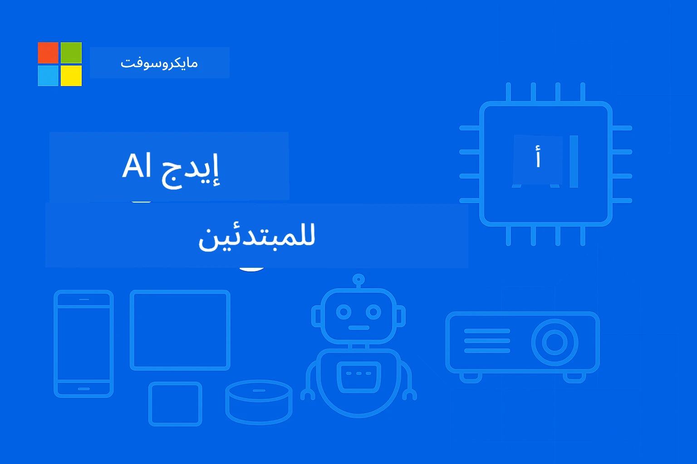

# EdgeAI للمبتدئين




[](https://GitHub.com/microsoft/edgeai-for-beginners/graphs/contributors)
[](https://GitHub.com/microsoft/edgeai-for-beginners/issues)
[](https://GitHub.com/microsoft/edgeai-for-beginners/pulls)
[](http://makeapullrequest.com)

[](https://GitHub.com/microsoft/edgeai-for-beginners/watchers)
[](https://GitHub.com/microsoft/edgeai-for-beginners/fork)
[](https://GitHub.com/microsoft/edgeai-for-beginners/stargazers)


[](https://discord.gg/nTYy5BXMWG)

اتبع هذه الخطوات للبدء باستخدام هذه الموارد:

1. **انسخ المستودع**: انقر على [](https://GitHub.com/microsoft/edgeai-for-beginners/fork)
2. **قم باستنساخ المستودع**: `git clone https://github.com/microsoft/edgeai-for-beginners.git`
3. [**انضم إلى ديسكورد Azure AI Foundry وقابل الخبراء والمطورين**](https://discord.com/invite/ByRwuEEgH4)


### 🌐 دعم متعدد اللغات

#### مدعوم عبر GitHub Action (تلقائي ومحدّث دائمًا)

<!-- CO-OP TRANSLATOR LANGUAGES TABLE START -->
[العربية](./README.md) | [البنغالية](../bn/README.md) | [البلغارية](../bg/README.md) | [البورمية (ميانمار)](../my/README.md) | [الصينية (المبسطة)](../zh-CN/README.md) | [الصينية (التقليدية، هونغ كونغ)](../zh-HK/README.md) | [الصينية (التقليدية، ماكاو)](../zh-MO/README.md) | [الصينية (التقليدية، تايوان)](../zh-TW/README.md) | [الكرواتية](../hr/README.md) | [التشيكية](../cs/README.md) | [الدانمركية](../da/README.md) | [الهولندية](../nl/README.md) | [الإستونية](../et/README.md) | [الفنلندية](../fi/README.md) | [الفرنسية](../fr/README.md) | [الألمانية](../de/README.md) | [اليونانية](../el/README.md) | [العبرية](../he/README.md) | [الهندية](../hi/README.md) | [الهنغارية](../hu/README.md) | [الإندونيسية](../id/README.md) | [الإيطالية](../it/README.md) | [اليابانية](../ja/README.md) | [الكانادا](../kn/README.md) | [الخميرية](../km/README.md) | [الكورية](../ko/README.md) | [الليتوانية](../lt/README.md) | [الملايوية](../ms/README.md) | [المالايالامية](../ml/README.md) | [الماراثي](../mr/README.md) | [النيبالية](../ne/README.md) | [النيجيرية بيدجين](../pcm/README.md) | [النرويجية](../no/README.md) | [الفارسية (اللغة)](../fa/README.md) | [البولندية](../pl/README.md) | [البرتغالية (البرازيل)](../pt-BR/README.md) | [البرتغالية (البرتغال)](../pt-PT/README.md) | [الپنجابية (جرمكي)](../pa/README.md) | [الرومانية](../ro/README.md) | [الروسية](../ru/README.md) | [الصربية (السيريلية)](../sr/README.md) | [السلوفاكية](../sk/README.md) | [السلوفينية](../sl/README.md) | [الإسبانية](../es/README.md) | [السواحيلية](../sw/README.md) | [السويدية](../sv/README.md) | [التاغالوغ (الفلبينية)](../tl/README.md) | [التاميل](../ta/README.md) | [التيلوغو](../te/README.md) | [التايلاندية](../th/README.md) | [التركية](../tr/README.md) | [الأوكرانية](../uk/README.md) | [الأردية](../ur/README.md) | [الفيتنامية](../vi/README.md)

> **تفضل الاستنساخ محليًا؟**
>
> يشمل هذا المستودع أكثر من 50 ترجمة للغات مما يزيد بشكل كبير من حجم التنزيل. لاستنساخ بدون الترجمات، استخدم السبارس تشيك آوت:
>
> **باش / macOS / Linux:**
> ```bash
> git clone --filter=blob:none --sparse https://github.com/microsoft/edgeai-for-beginners.git
> cd edgeai-for-beginners
> git sparse-checkout set --no-cone '/*' '!translations' '!translated_images'
> ```
>
> **CMD (ويندوز):**
> ```cmd
> git clone --filter=blob:none --sparse https://github.com/microsoft/edgeai-for-beginners.git
> cd edgeai-for-beginners
> git sparse-checkout set --no-cone "/*" "!translations" "!translated_images"
> ```
>
> هذا يمنحك كل ما تحتاجه لإكمال الدورة مع تنزيل أسرع بكثير.
<!-- CO-OP TRANSLATOR LANGUAGES TABLE END -->

**إذا كنت ترغب في دعم لغات ترجمة إضافية، فهي مُدرجة [هنا](https://github.com/Azure/co-op-translator/blob/main/getting_started/supported-languages.md)**
## مقدمة

مرحبًا بك في **EdgeAI للمبتدئين** – رحلتك الشاملة في عالم الذكاء الاصطناعي الحدي التحويلي. تجسر هذه الدورة الفجوة بين قدرات الذكاء الاصطناعي القوية وتطبيقه العملي في العالم الحقيقي على أجهزة الحافة، مما يمكّنك من استغلال إمكانات الذكاء الاصطناعي مباشرة حيث يتم توليد البيانات وتتخذ القرارات.

### ما ستتقنه

تأخذك هذه الدورة من المفاهيم الأساسية إلى التنفيذ الجاهز للإنتاج، وتشمل:
- **نماذج لغوية صغيرة (SLMs)** محسّنة للنشر الحدي
- **التحسين الواعي للأجهزة** عبر منصات متنوعة
- **الاستدلال في الوقت الحقيقي** مع قدرات حفظ الخصوصية
- **استراتيجيات النشر الإنتاجي** لتطبيقات المؤسسات

### لماذا يهم EdgeAI

يمثل الذكاء الاصطناعي الحدي تحولًا نموذجيًا يعالج تحديات حديثة حرجة:
- **الخصوصية والأمان**: معالجة البيانات الحساسة محليًا دون تعرض السحابة
- **الأداء في الوقت الحقيقي**: القضاء على تأخير الشبكة في التطبيقات الحساسة للوقت
- **كفاءة التكلفة**: تقليل نفقات النطاق الترددي والحوسبة السحابية
- **العمليات المقاومة**: الحفاظ على الوظائف أثناء انقطاعات الشبكة
- **الامتثال التنظيمي**: تلبية متطلبات سيادة البيانات

### الذكاء الاصطناعي الحدي

يشير الذكاء الاصطناعي الحدي إلى تشغيل خوارزميات الذكاء الاصطناعي والنماذج اللغوية محليًا على الأجهزة، بالقرب من مكان توليد البيانات دون الاعتماد على موارد السحابة للاستدلال. يقلل من الكمون، يعزز الخصوصية، ويمكّن اتخاذ قرارات في الوقت الحقيقي.

### المبادئ الأساسية:
- **الاستدلال على الجهاز**: تعمل نماذج الذكاء الاصطناعي على أجهزة الحافة (الهواتف، الموجهات، المتحكمات الدقيقة، الحواسيب الصناعية)
- **القدرة دون اتصال دائم**: يعمل بدون اتصال إنترنت مستمر
- **كمون منخفض**: استجابات فورية مناسبة للأنظمة في الوقت الحقيقي
- **سيادة البيانات**: تحافظ على البيانات الحساسة محليًا، مما يعزز الأمان والامتثال

### نماذج لغوية صغيرة (SLMs)

نماذج SLMs مثل Phi-4 وMistral-7B وGemma هي نسخ محسنة من النماذج اللغوية الكبيرة — مُدربة أو مُستخلصة بهدف:
- **تقليل حجم الذاكرة**: استخدام فعال لذاكرة أجهزة الحافة المحدودة
- **تقليل متطلبات الحوسبة**: محسنة لأداء وحدات المعالجة المركزية ووحدات معالجة الرسوميات الحديّة
- **أوقات بدء تشغيل أسرع**: تهيئة سريعة للتطبيقات الاستجابية

تفتح قدرات قوية لمعالجة اللغة الطبيعية مع تلبية قيود:
- **الأنظمة المدمجة**: أجهزة إنترنت الأشياء ووحدات التحكم الصناعية
- **الأجهزة المحمولة**: هواتف ذكية وأجهزة لوحية بقدرات عدم الاتصال
- **أجهزة إنترنت الأشياء**: حساسات وأجهزة ذكية بموارد محدودة
- **خوادم الحافة**: وحدات المعالجة المحلية ذات موارد GPU محدودة
- **الحواسيب الشخصية**: سيناريوهات النشر على أجهزة سطح المكتب واللابتوب

## وحدات الدورة والتنقل

| الوحدة | الموضوع | مجال التركيز | المحتوى الرئيسي | المستوى | المدة |
|--------|-------|------------|-------------|--------|----------|
| [📖 00 ](./introduction.md) | [مقدمة في EdgeAI](./introduction.md) | الأساس والسياق | نظرة عامة على EdgeAI • تطبيقات الصناعة • مقدمة SLM • أهداف التعلم | مبتدئ | 1-2 ساعة |
| [📚 01](../../Module01) | [أساسيات EdgeAI](./Module01/README.md) | مقارنة بين السحابة وEdge AI | أساسيات EdgeAI • دراسات حالة من العالم الحقيقي • دليل التنفيذ • نشر الحافة | مبتدئ | 3-4 ساعات |
| [🧠 02](../../Module02) | [أساسيات نموذج SLM](./Module02/README.md) | عائلات النماذج والهندسة المعمارية | عائلة Phi • عائلة Qwen • عائلة Gemma • BitNET • μModel • Phi-Silica | مبتدئ | 4-5 ساعات |
| [🚀 03](../../Module03) | [ممارسة نشر SLM](./Module03/README.md) | النشر المحلي والسحابي | تعلم متقدم • البيئة المحلية • النشر السحابي | متوسط | 4-5 ساعات |
| [⚙️ 04](../../Module04) | [أدوات تحسين النماذج](./Module04/README.md) | التحسين متعدد المنصات | مقدمة • Llama.cpp • Microsoft Olive • OpenVINO • Apple MLX • تركيب سير العمل | متوسط | 5-6 ساعات |
| [🔧 05](../../Module05) | [إنتاج SLMOps](./Module05/README.md) | العمليات الإنتاجية | مقدمة SLMOps • تقطير النماذج • التخصيص الدقيق • النشر الإنتاجي | متقدم | 5-6 ساعات |
| [🤖 06](../../Module06) | [وكلاء الذكاء الاصطناعي واستدعاء الوظائف](./Module06/README.md) | أُطُر الوكلاء وبروتوكول MCP | مقدمة الوكلاء • استدعاء الوظائف • بروتوكول سياق النموذج | متقدم | 4-5 ساعات |
| [💻 07](../../Module07) | [تنفيذ المنصة](./Module07/README.md) | عينات متعددة المنصات | أدوات الذكاء الاصطناعي • Foundry Local • تطوير ويندوز | متقدم | 3-4 ساعات |
| [🏭 08](../../Module08) | [أدوات Foundry المحلية](./Module08/README.md) | عينات جاهزة للإنتاج | تطبيقات نموذجية (انظر التفاصيل أدناه) | خبير | 8-10 ساعات |

### 🏭 **الوحدة 08: تطبيقات نموذجية**

- [01: بداية سريعة للدردشة عبر REST](./Module08/samples/01/README.md)
- [02: دمج OpenAI SDK](./Module08/samples/02/README.md)
- [03: اكتشاف النماذج والقياس المرجعي](./Module08/samples/03/README.md)
- [04: تطبيق Chainlit RAG](./Module08/samples/04/README.md)
- [05: إدارة متعددة الوكلاء](./Module08/samples/05/README.md)
- [06: موجه النماذج كأدوات](./Module08/samples/06/README.md)
- [07: عميل API مباشر](./Module08/samples/07/README.md)
- [08: تطبيق الدردشة لنظام ويندوز 11](./Module08/samples/08/README.md)
- [09: نظام متعدد الوكلاء متقدم](./Module08/samples/09/README.md)
- [10: إطار أدوات Foundry](./Module08/samples/10/README.md)

### 🎓 **ورش العمل: مسار التعلم العملي**

مواد ورشة عمل شاملة مع تنفيذات جاهزة للإنتاج:

- **[دليل ورشة العمل](./Workshop/Readme.md)** - أهداف التعلم كاملة، النتائج، والتنقل عبر الموارد
- **عينات بايثون** (6 جلسات) - محدثة بأفضل الممارسات، إدارة الأخطاء، وتوثيق شامل
- **دفاتر Jupyter** (8 تفاعلية) - دروس خطوة بخطوة مع القياسات المرجعية ومراقبة الأداء
- **أدلة الجلسات** - أدلة ماركداون مفصلة لكل جلسة ورشة عمل
- **أدوات التحقق** - سكريبتات لمراجعة جودة الكود وتشغيل اختبارات أولية

**ما ستبنيه:**
- تطبيقات دردشة AI محلية مع دعم البث
- أنابيب RAG مع تقييم الجودة (RAGAS)
- أدوات القياس المرجعي والمقارنة متعددة النماذج
- أنظمة إدارة متعددة الوكلاء
- توجيه ذكي للنماذج مع اختيار مستند إلى المهام

### 🎙️ **ورشة عمل For Agentic: Hands-On - استوديو بودكاست الذكاء الاصطناعي**
ابنِ خط إنتاج بودكاست مدعوم بالذكاء الاصطناعي من الصفر! تعلمك هذه الورشة التفاعلية كيفية إنشاء نظام متعدد الوكلاء كامل يحول الأفكار إلى حلقات بودكاست احترافية.

**[🎬 ابدأ ورشة استوديو البودكاست الذكي](./WorkshopForAgentic/README.md)**

**مهمتك**: إطلاق "Future Bytes" — بودكاست تقني مدعوم بالكامل بوكلاء ذكاء اصطناعي تبنيهم بنفسك. لا يعتمد على السحابة، ولا تكاليف API — كل شيء يعمل محليًا على جهازك.

**ما الذي يميز هذا المشروع:**
- **🤖 تنسيق متعدد الوكلاء حقيقي** - بناء وكلاء ذكاء اصطناعي متخصصين يقومون بالبحث والكتابة وإنتاج الصوت
- **🎯 خط إنتاج كامل** - من اختيار الموضوع إلى الإخراج الصوتي النهائي للبودكاست
- **💻 نشر محلي 100%** - يستخدم Ollama ونماذج محلية (Qwen-3-8B) للخصوصية والتحكم الكامل
- **🎤 تكامل تحويل النص إلى كلام** - تحويل النصوص إلى محادثات طبيعية بأصوات متعددة المتحدثين
- **✋ تدفقات عمل بمشاركة بشرية** - بوابات موافقة تضمن الجودة مع الحفاظ على الأتمتة

**رحلة تعلم من ثلاث مراحل:**

| المرحلة | التركيز | المهارات الرئيسية | المدة |
|-----|-------|------------|----------|
| **[المرحلة 1: التعرّف على مساعدي الذكاء الاصطناعي](./WorkshopForAgentic/md/01.BuildAIAgentWithSLM.md)** | بناء وكيل الذكاء الاصطناعي الأول | دمج الأدوات • البحث على الويب • حل المشكلات • الاستدلال الوكلي | ٢-٣ ساعات |
| **[المرحلة 2: تجميع فريق الإنتاج](./WorkshopForAgentic/md/02.AIAgentOrchestrationAndWorkflows.md)** | تنسيق عدة وكلاء | تنسيق الفريق • تدفقات الموافقة • واجهة DevUI • إشراف بشري | ٣-٤ ساعات |
| **[المرحلة 3: إحياء البودكاست الخاص بك](./WorkshopForAgentic/md/03.Multi-SpeakerPodcastGenerationWithVibeVoice.md)** | توليد صوت البودكاست | تحويل النص إلى كلام • توليف متعدد المتحدثين • صوت طويل المدة • أتمتة كاملة | ٢-٣ ساعات |

**التقنيات المستخدمة:**
- **إطار عمل Microsoft Agent** - تنسيق وتنسيق متعدد الوكلاء
- **Ollama** - تشغيل نموذج ذكاء اصطناعي محلي (بدون سحابة)
- **Qwen-3-8B** - نموذج لغة مفتوح المصدر محسن للمهام الوكلائية
- **واجهات تحويل النص إلى كلام** - توليف صوت طبيعي لإنتاج البودكاست

**دعم العتاد:**
- ✅ **وضع وحدة المعالجة المركزية** - يعمل على أي حاسوب حديث (ينصح بـ8 جيجابايت+ رام)
- 🚀 **تسريع بمعالج الرسوميات** - استدلال أسرع بكثير مع بطاقات NVIDIA/AMD
- ⚡ **دعم وحدة المعالجة العصبية** - تسريع بواسطة وحدة المعالجة العصبية الجيل القادم

**مثالي لـ:**
- المطورين الذين يتعلمون أنظمة الذكاء الاصطناعي متعددة الوكلاء
- كل من يهتم بأتمتة الذكاء الاصطناعي وتدفقات العمل
- منشئي المحتوى الذين يستكشفون الإنتاج المدعوم بالذكاء الاصطناعي
- الطلاب الذين يدرسون أنماط تنسيق الذكاء الاصطناعي العملية

**ابدأ البناء**: [🎙️ ورشة استوديو البودكاست الذكي →](./WorkshopForAgentic/README.md)

### 📊 **ملخص مسار التعلم**
- **المدة الكلية**: ٣٦-٤٥ ساعة
- **مسار المبتدئين**: الوحدات ٠١-٠٢ (٧-٩ ساعات)  
- **المسار المتوسط**: الوحدات ٠٣-٠٤ (٩-١١ ساعة)
- **المسار المتقدم**: الوحدات ٠٥-٠٧ (١٢-١٥ ساعة)
- **مسار الخبراء**: الوحدة ٠٨ (٨-١٠ ساعات)

## ما الذي ستبنيه

### 🎯 الكفاءات الأساسية
- **هندسة الذكاء الاصطناعي الطرفي (Edge AI)**: تصميم أنظمة ذكاء اصطناعي تركز على التشغيل المحلي مدمجة مع السحابة
- **تحسين النماذج**: تقليل الأبعاد وضغط النماذج للنشر الطرفي (تحسين سرعة ٨٥٪، تقليل حجم ٧٥٪)
- **النشر عبر منصات متعددة**: ويندوز، الجوال، المدمجات، وأنظمة هجينة سحابة-طرفية
- **عمليات الإنتاج**: مراقبة، توسيع، وصيانة أنظمة الذكاء الاصطناعي الطرفي في الإنتاج

### 🏗️ مشاريع عملية
- **تطبيقات الدردشة المحلية Foundry**: تطبيق أصلي لويندوز ١١ مع تبديل النماذج
- **أنظمة متعددة الوكلاء**: منسق مع وكلاء متخصصين لعمليات معقدة  
- **تطبيقات RAG**: معالجة مستندات محلية مع بحث متجه
- **موجهات النماذج**: اختيار ذكي بين النماذج اعتمادًا على تحليل المهمة
- **أُطُر API**: عملاء جاهزون للإنتاج مع البث والمراقبة الصحية
- **أدوات متعددة المنصات**: أنماط تكامل LangChain/Semantic Kernel

### 🏢 تطبيقات صناعية
**التصنيع** • **الرعاية الصحية** • **المركبات الذاتية** • **المدن الذكية** • **تطبيقات الجوال**

## بداية سريعة

**مسار التعلم الموصى به** (٢٠-٣٠ ساعة إجمالًا):

0. **📖 مقدمة** ([Introduction.md](./introduction.md)): أساسيات EdgeAI + سياق الصناعة + إطار التعلم
1. **📚 الأساسيات** (الوحدات ٠١-٠٢): مفاهيم EdgeAI + عائلات نماذج SLM
2. **⚙️ التحسين** (الوحدات ٠٣-٠٤): أُطُر النشر وتقليل الأبعاد  
3. **🚀 الإنتاج** (الوحدات ٠٥-٠٦): SLMOps + وكلاء AI + استدعاء الوظائف
4. **💻 التنفيذ** (الوحدات ٠٧-٠٨): عينات المنصة + مجموعة أدوات Foundry Local

كل وحدة تتضمن نظرية، تمارين عملية، وأمثلة برمجية جاهزة للإنتاج.

## تأثير على المسيرة المهنية

**الأدوار التقنية**: مهندس حلول EdgeAI • مهندس تعلم آلي (طرفي) • مطور AI لإنترنت الأشياء • مطور AI الجوال

**القطاعات الصناعية**: التصنيع 4.0 • تكنولوجيا الرعاية الصحية • الأنظمة الذاتية • التكنولوجيا المالية • الإلكترونيات الاستهلاكية

**مشاريع المحفظة**: أنظمة متعددة الوكلاء • تطبيقات إنتاج RAG • النشر عبر منصات متعددة • تحسين الأداء

## هيكل المستودع

```
edgeai-for-beginners/
├── 📖 introduction.md  # Foundation: EdgeAI Overview & Learning Framework
├── 📚 Module01-04/     # Fundamentals → SLMs → Deployment → Optimization  
├── 🔧 Module05-06/     # SLMOps → AI Agents → Function Calling
├── 💻 Module07/        # Platform Samples (VS Code, Windows, Jetson, Mobile)
├── 🏭 Module08/        # Foundry Local Toolkit + 10 Comprehensive Samples
│   ├── samples/01-06/  # Foundation: REST, SDK, RAG, Agents, Routing
│   └── samples/07-10/  # Advanced: API Client, Windows App, Enterprise Agents, Tools
├── 🌐 translations/    # Multi-language support (8+ languages)
└── 📋 STUDY_GUIDE.md   # Structured learning paths & time allocation
```

## أبرز ملامح الدورة

✅ **تعلم تصاعدي**: نظرية → ممارسة → نشر إنتاجي  
✅ **دراسات حالة حقيقية**: مايكروسوفت، خطوط طيران اليابان، تطبيقات مؤسسية  
✅ **عينات عملية**: أكثر من ٥٠ مثالًا، ١٠ عروض توضيحية شاملة لـFoundry Local  
✅ **تركيز على الأداء**: تحسينات سرعة ٨٥٪، تقليل حجم ٧٥٪  
✅ **منصات متعددة**: ويندوز، الجوال، المدمجات، هجينة سحابة-طرفية  
✅ **جاهز للإنتاج**: مراقبة، توسيع، أمان، أُطُر التوافق

📖 **[دليل الدراسة متاح](STUDY_GUIDE.md)**: مسار تعلم منظم لـ٢٠ ساعة مع إرشادات توجيه زمنية وأدوات للتقييم الذاتي.

---

**يمثل EdgeAI مستقبل نشر الذكاء الاصطناعي**: أولية محلية، تحافظ على الخصوصية وفعالة. أتقن هذه المهارات لبناء الجيل القادم من التطبيقات الذكية.

## دورات أخرى

فريقنا ينتج دورات أخرى! اطلع على:

<!-- CO-OP TRANSLATOR OTHER COURSES START -->
### LangChain
[](https://aka.ms/langchain4j-for-beginners)
[](https://aka.ms/langchainjs-for-beginners?WT.mc_id=m365-94501-dwahlin)
[](https://github.com/microsoft/langchain-for-beginners?WT.mc_id=m365-94501-dwahlin)
---

### Azure / Edge / MCP / الوكلاء
[](https://github.com/microsoft/AZD-for-beginners?WT.mc_id=academic-105485-koreyst)
[](https://github.com/microsoft/edgeai-for-beginners?WT.mc_id=academic-105485-koreyst)
[](https://github.com/microsoft/mcp-for-beginners?WT.mc_id=academic-105485-koreyst)
[](https://github.com/microsoft/ai-agents-for-beginners?WT.mc_id=academic-105485-koreyst)

---

### سلسلة الذكاء الاصطناعي التوليدي
[](https://github.com/microsoft/generative-ai-for-beginners?WT.mc_id=academic-105485-koreyst)
[-9333EA?style=for-the-badge&labelColor=E5E7EB&color=9333EA)](https://github.com/microsoft/Generative-AI-for-beginners-dotnet?WT.mc_id=academic-105485-koreyst)
[-C084FC?style=for-the-badge&labelColor=E5E7EB&color=C084FC)](https://github.com/microsoft/generative-ai-for-beginners-java?WT.mc_id=academic-105485-koreyst)
[-E879F9?style=for-the-badge&labelColor=E5E7EB&color=E879F9)](https://github.com/microsoft/generative-ai-with-javascript?WT.mc_id=academic-105485-koreyst)

---

### التعلم الأساسي
[](https://aka.ms/ml-beginners?WT.mc_id=academic-105485-koreyst)
[](https://aka.ms/datascience-beginners?WT.mc_id=academic-105485-koreyst)
[](https://aka.ms/ai-beginners?WT.mc_id=academic-105485-koreyst)
[](https://github.com/microsoft/Security-101?WT.mc_id=academic-96948-sayoung)
[](https://aka.ms/webdev-beginners?WT.mc_id=academic-105485-koreyst)
[](https://aka.ms/iot-beginners?WT.mc_id=academic-105485-koreyst)
[](https://github.com/microsoft/xr-development-for-beginners?WT.mc_id=academic-105485-koreyst)

---

### سلسلة Copilot
[](https://aka.ms/GitHubCopilotAI?WT.mc_id=academic-105485-koreyst)
[](https://github.com/microsoft/mastering-github-copilot-for-dotnet-csharp-developers?WT.mc_id=academic-105485-koreyst)
[](https://github.com/microsoft/CopilotAdventures?WT.mc_id=academic-105485-koreyst)
<!-- CO-OP TRANSLATOR OTHER COURSES END -->

## الحصول على المساعدة

إذا واجهت صعوبة أو كانت لديك أي أسئلة حول بناء تطبيقات الذكاء الاصطناعي، انضم إلى:

[](https://discord.gg/nTYy5BXMWG)

إذا كان لديك ملاحظات على المنتج أو أخطاء أثناء البناء قم بزيارة:

[](https://aka.ms/foundry/forum)

---

<!-- CO-OP TRANSLATOR DISCLAIMER START -->
**تنويه**:  
تمت ترجمة هذا المستند باستخدام خدمة الترجمة بالذكاء الاصطناعي [Co-op Translator](https://github.com/Azure/co-op-translator). بينما نسعى لتحقيق الدقة، يُرجى العلم بأن الترجمات الآلية قد تحتوي على أخطاء أو عدم دقة. يجب اعتبار المستند الأصلي بلغته الأصلية هو المصدر الموثوق به. للمعلومات الهامة، يُنصح بالاعتماد على ترجمة بشرية محترفة. نحن غير مسؤولين عن أي سوء تفاهم أو تفسير خاطئ ناتج عن استخدام هذه الترجمة.
<!-- CO-OP TRANSLATOR DISCLAIMER END -->