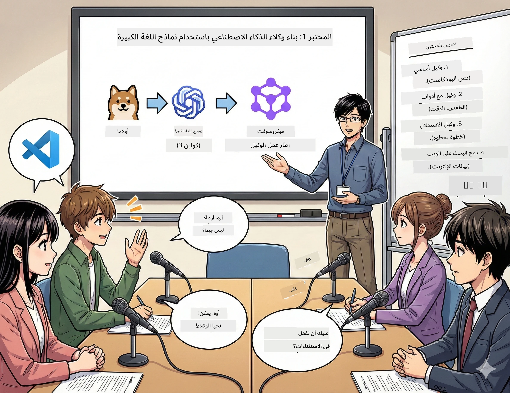

# الفعل ١: تعرّف على مساعدك البحثي في الذكاء الاصطناعي 🤖

## التحدي

أنت تطلق "بايتس المستقبل"، بودكاست التقنية الجديد الخاص بك. الحلقة 1 تدور حول أحدث الإنجازات في مجال الذكاء الاصطناعي، ولكن لديك ٢٤ ساعة لـ:
1. البحث في الموضوع
2. إيجاد مصادر موثوقة
3. كتابة نص جذاب
4. جعله يبدو طبيعياً

**منعطف القصة**: ليس عليك القيام بذلك بمفردك. أنت على وشك بناء أول مساعد ذكي يساعدك في كل هذا. دعنا نسميه أليكس — شريكك البحثي الذي لا يكل ولا ينام أبدا.

## لماذا نماذج اللغة الصغيرة؟ (تلميح: لأنها مذهلة)

فكر في نماذج اللغة الصغيرة (SLMs) باعتبارها الذكاء الاصطناعي الشخصي الذي يعيش على *حاسوبك*. لا سحابة، لا رسوم شهرية، لا مشاركة بيانات مشبوهة.

**لماذا نماذج اللغة الصغيرة رائعة 🔥:**
- **🏠 تعمل على جهازك**: لابتوب، ديسكتوب، أو حتى Raspberry Pi قوي
- **💸 بدون تكاليف مستمرة**: لا توجد رسوم API تأكل مصروفك
- **🔒 الخصوصية أولاً**: بياناتك لا تغادر جهازك
- **⚡ سريعة جداً**: لا تأخير في الانترنت، ردود فورية
- **🪦 خفيفة الوزن**: من 1 إلى 10 مليار باراميتر مقابل 100 مليار+ للنماذج الكبيرة

**نماذج SLMs الشهيرة**: Qwen 3، Phi-4، Gemma 3 (نحن نستخدم Qwen في هذه الورشة)

## أدواتك

### Ollama: مدير نموذج الذكاء الاصطناعي الخاص بك

[Ollama](https://ollama.com/) مثل ستيم لنماذج الذكاء الاصطناعي. حمّل، شغّل، وأدِر النماذج بأوامر بسيطة.

**ما يجعلها رائعة:**
- أمر واحد لتنزيل وتشغيل أي نموذج
- يعمل على Mac, Windows, Linux
- يستخدم GPU تلقائياً إذا كان لديك واحد
- كفاءة عالية في استهلاك الذاكرة

### Microsoft Agent Framework: حيث تحدث السحر

[Microsoft Agent Framework](https://github.com/microsoft/agent-framework) هو ملعبك لبناء وكلاء ذكاء اصطناعي يمكنهم:

- 💬 الدردشة وتذكر ما ناقشته معهم
- 🛠️ استخدام أدوات مخصصة (كالبحث على الويب أو التحقق من الطقس)
- 🧠 التفكير في مشاكل معقدة خطوة بخطوة
- 🤝 العمل ضمن فريق مع وكلاء آخرين
- 🔌 الاتصال بمزودي الذكاء الاصطناعي المختلفين (OpenAI, Ollama, Azure)

**مكونات البناء:**
- **الوكلاء**: مساعدوك الذكيون بمهام محددة
- **الأدوات**: قدرات خاصة تعطيها لهم
- **الذاكرة**: لكي لا ينسوا محادثتك
- **الاستدلال**: تعليمهم كيف يفكرون، لا فقط يردون

## سلسلة تدريباتك: ٤ مهمات

### المهمة ١: أنشئ وكيلك الأول

📓 [افتح المفكرة](../code/01.BasicAgent/00.BasicAgent-agent.ipynb)

**المهمة**: بناء أليكس، كاتب نصوص البودكاست الخاص بك. يحتاج أليكس لتوليد حوار بين مضيفين يناقشان موضوعات تقنية.

**ما ستتعلمه**:
- كيف توقظ وكيل ذكاء اصطناعي (أسهل من الاستيقاظ يوم الاثنين)
- منحه شخصية وتعليمات
- جعله يولد نصوص بودكاست حقيقية
- فهم ما يقوله لك

**شروط الفوز**: ينشئ أليكس نصاً لحلقة العرض الأولى من "بايتس المستقبل" عن الذكاء الاصطناعي! 🎯

### المهمة ٢: امنح أليكس قوى خارقة (الأدوات!)

📓 [افتح المفكرة](../code/01.BasicAgent/01.BasicAgent-tools.ipynb)

**المهمة**: أليكس ذكي، لكنه لا يعرف الطقس اليوم أو الوقت الحالي. دعنا نصلح ذلك بمنحه أدوات!

**ما ستتعلمه**:
- إنشاء دوال Python مخصصة كـ"أدوات"
- السماح لأليكس بتقرير *متى* يستخدم أي أداة
- مشاهدة حل المشاكل بشكل مستقل
- دمج أدوات متعددة لمهام معقدة

**شروط الفوز**: اسأل "ما هو الطقس في طوكيو؟" وأليكس يكتشف الإجابة بنفسه! ☁️

### المهمة ٣: علم أليكس كيف يفكر

📓 [افتح المفكرة](../code/01.BasicAgent/02.BasicAgent-reasoning.ipynb)

**المهمة**: اجعل أليكس يظهر طريقة تفكيره. عند حل المشكلات، تريد أن ترى *كيف* يفكر، لا الحل فقط.

**ما ستتعلمه**:
- تفعيل "وضع الاستدلال" (كأنك تعرض خطوات الحل في صف الرياضيات)
- رؤية عملية التفكير خطوة بخطوة لدى أليكس
- فهم سلسلة التفكير المنطقي
- تصحيح الأخطاء عند ارتباك أليكس

**شروط الفوز**: اطرح مسألة رياضية معقدة وشاهد أليكس يفكر في حلها! 🧠

### المهمة ٤: وصل أليكس بالإنترنت

📓 [افتح المفكرة](../code/01.BasicAgent/03.BasicAgent-websearch.ipynb)

**المهمة**: معرفة أليكس محدودة حتى تاريخ معين. دعنا نوصل أليكس بالويب لمعلومات حية!

**ما ستتعلمه**:
- بناء أداة بحث ويب مخصصة
- دمج واجهات برمجة التطبيقات الخارجية
- التعامل مع أخطاء الشبكة بأناقة
- الحصول على معلومات تتجاوز بيانات تدريب أليكس

**شروط الفوز**: اسأل عن أخبار التقنية اليوم واحصل على نتائج جديدة! 📰

## قبل أن تبدأ 🚀

**المتطلبات:**
- تثبيت Python 3.10+
- تشغيل Ollama (تحقق بـ `ollama --version`)
- VS Code مع امتداد Python
- ذاكرة RAM لا تقل عن ٨ جيجابايت (١٦ جيجابايت لأداء سلس)

## ترتيب المهام

اتبع المفكرات بالترتيب للقصة الكاملة:

1. [00.BasicAgent-agent.ipynb](../code/01.BasicAgent/00.BasicAgent-agent.ipynb) — تعرّف على أليكس (وكيلك الأول)
2. [01.BasicAgent-tools.ipynb](../code/01.BasicAgent/01.BasicAgent-tools.ipynb) — وقت التمكين!
3. [02.BasicAgent-reasoning.ipynb](../code/01.BasicAgent/02.BasicAgent-reasoning.ipynb) — علم أليكس كيف يفكر
4. [03.BasicAgent-websearch.ipynb](../code/01.BasicAgent/03.BasicAgent-websearch.ipynb) — تم فتح وصول الإنترنت!

## ما ستتقنه

بعد الفعل ١، ستتمكن من:

- ✅ تشغيل نماذج الذكاء الاصطناعي على أجهزتك الخاصة (بدون سحابة!)
- ✅ بناء وكلاء بشخصيات ومهارات مخصصة
- ✅ منح الوكلاء أدوات لحل مشاكل العالم الحقيقي
- ✅ جعل الوكلاء يعرضون عملية تفكيرهم
- ✅ ربط الوكلاء بمصادر بيانات خارجية
- ✅ تصحيح الأخطاء عندما تسوء الأمور

## عندما تتعطل الأمور (وكيف تصلحها) 🔧

### "أليكس لا يُحمّل! الذاكرة نفدت!"
**الإصلاح**: جهازك يعاني. جرب إغلاق تطبيقات أخرى، أو استخدم نموذجاً أصغر. ٨ جيجابايت RAM هو الحد الأدنى.

### "أليكس بطيء جداً"
**الإصلاح**: فعّل تسريع GPU في إعدادات Ollama. أو قلل حجم نافذة السياق. وضع صقر السرعة مفعل! 🏎️

### "الأدوات لا تعمل!"
**الإصلاح**: تحقق جيداً من تواقيع دوالك. أليكس يحتاج تلميحات نوع صحيحة لفهم وظيفة الأداة. فكر فيها كتعليمات واضحة.

## روابط مفيدة 🔗

- [وثائق Agent Framework](https://github.com/microsoft/agent-framework) — الأدلة والأمثلة الرسمية
- [مكتبة نماذج Ollama](https://ollama.com/library) — تصفح كل النماذج المتاحة
- [نموذج Qwen](https://ollama.com/library/qwen3) — تعرّف على عقل ذكائك الاصطناعي
- [أمثلة تعليمية](https://github.com/microsoft/agent-framework/tree/main/python/samples) — استلهم الأفكار من هنا

## المقبل: الفعل ٢ 🎬

لديك وكيل واحد. لكن ماذا لو كان لديك *فريق* من الوكلاء يعملون معاً؟ في الفعل ٢، ستبني طاقم إنتاج البودكاست الكامل الخاص بك:
- **وكيل البحث**: يجد أفضل المصادر
- **وكيل الكتابة**: يصنع النص المثالي  
- **المحرر (أنت!)**: يوافق أو يطلب تعديلات

لننظم بعض سحر الذكاء الاصطناعي! → [الفعل ٢: تجميع فريق الإنتاج](02.AIAgentOrchestrationAndWorkflows.md)

---

**عالق؟** اطرح أسئلتك خلال الورشة. نحن جميعاً نتعلم معاً! 🙌

---

<!-- CO-OP TRANSLATOR DISCLAIMER START -->
**تنويه**:  
تمت ترجمة هذا المستند باستخدام خدمة الترجمة الآلية [Co-op Translator](https://github.com/Azure/co-op-translator). على الرغم من سعينا للدقة، يرجى العلم أن الترجمات الآلية قد تحتوي على أخطاء أو عدم دقة. يجب اعتبار المستند الأصلي بلغته الأصلية هو المصدر المعتمد. للمعلومات الحساسة، يُنصح بالاستعانة بترجمة بشرية محترفة. نحن غير مسؤولين عن أي سوء فهم أو تفسيرات خاطئة ناتجة عن استخدام هذه الترجمة.
<!-- CO-OP TRANSLATOR DISCLAIMER END -->