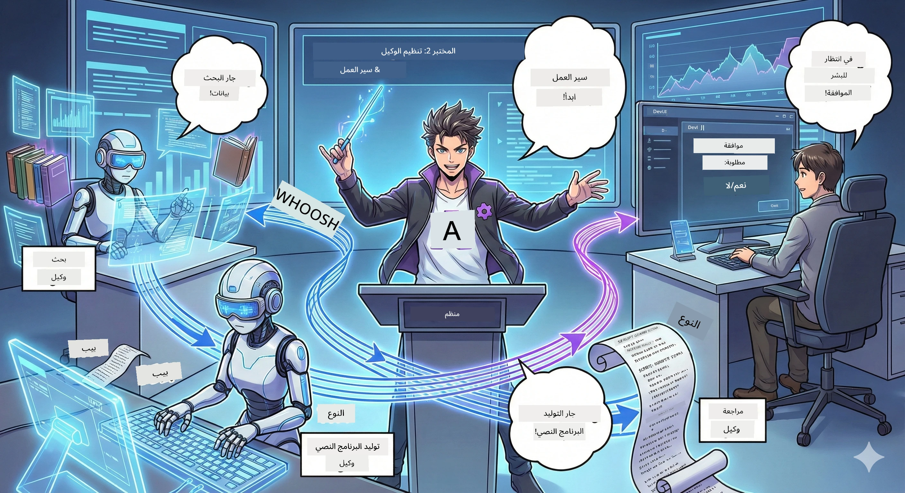

<!--
CO_OP_TRANSLATOR_METADATA:
{
  "original_hash": "2a2578dc4f813ca93ca7952d842a4b59",
  "translation_date": "2026-01-05T14:20:24+00:00",
  "source_file": "WorkshopForAgentic/translation/zh-cn/02.AIAgentOrchestrationAndWorkflows.md",
  "language_code": "ar"
}
-->
#幕 الثانية: كوّن فريق إنتاج البودكاست الخاص بك 🎬



## تصاعد الحبكة

أليكس (مساعدك الذكي في المشهد الأول) رائع، لكن وكيلًا ذكيًا واحدًا لا يمكنه تشغيل استوديو البودكاست بأكمله. أنت بحاجة إلى *فريق*:
- 🔍 **وكيل البحث**: يبحث على الإنترنت عن المعلومات الجديدة
- ✍️ **وكيل النص**: يحول البحث إلى حوار جذاب
- 👤 **أنت (المحرر)**: يوافق على النص أو يعيده لإعادة الكتابة

مرحبًا بك في **تنسيق الوكلاء الذكيين بالذكاء الاصطناعي** — أنت مخرج فريق الذكاء الاصطناعي الخاص بك. فكر في الأمر مثل فريق المنتقمون، لكنه لإنتاج البودكاست.

## ما هو تنسيق الوكلاء؟ (الإصدار المبسط)

تخيل أنك تدير مطعمًا. أنت لا تفعل كل شيء بنفسك، أليس كذلك؟ لديك:
- 🍳 طهاة مسؤولون عن الطبخ
- 👨‍🍳 مساعدين للطهي مسؤولون عن التحضير
- 👩‍🍳 النادلون مسؤولون عن التقديم

تنسيق الوكلاء هو نفس الفكرة، لكنه باستخدام الذكاء الاصطناعي. كل وكيل لديه تخصص، وأنت تنسقهم لتحقيق هدف أكبر. لا يحمل وكيل واحد عبء العمل كله، ويُنهي العمل بشكل أسرع.

### تشبيه الفرقة الموسيقية 🎸

وكلاؤك في الذكاء الاصطناعي مثل فرقة موسيقية:
- **المغني الرئيسي**: الوكيل الأساسي الذي يتعامل مع مهام العملاء
- **عازف الطبول**: يحافظ على الإيقاع ويتعامل مع الخلفية
- **عازف الباص**: يدعم الجميع ويحصل على البيانات
- **أنت (مدير الفرقة)**: تنسق الجميع!

بدون تنسيق؟ فقط ضوضاء. مع التنسيق؟ موسيقى رائعة.

### لماذا هذا مهم

وكيل ذكاء اصطناعي واحد يحاول فعل كل شيء = الإرهاق. وكلاء متخصصون يعملون معًا = كفاءة عالية!🚀

**الحقيقة الصريحة**: هل تذكر عندما حاولت البحث والكتابة والتحرير بنفسك؟ نعم، كان ذلك سيئًا. مع التنسيق، يعالج كل وكيل ما يتقنه. أنت تقوم فقط باتخاذ القرار النهائي.

**مثال من الحياة الواقعية**: روبوت دعم العملاء يعرف متى يتعامل مع الفواتير، متى مع المشكلات الفنية، ومتى يستدعي الإنسان. هذا هو التنسيق!

## الوكيل الذكي مقابل سير العمل: ما الفرق؟

فكر في الأمر هكذا:

### 🤖 وكيل الذكاء الاصطناعي = عازف الجاز
- **اتخاذ قرارات مرتجلة** بناءً على ما يسمعه
- **خلق مرتجل** باستخدام أدواته وحلوله
- **التفكير** بعقل نموذج لغة كبير
- **التكيف** مع أي شيء تلقيه عليه

### 🎵 سير العمل = أوركسترا تعزف الموسيقى الكلاسيكية
- **اتباع النوتة الموسيقية** (خطوات محددة مسبقًا)
- **مسار تنفيذ متوقع**
- **تنسيق** بين عدة وكلاء، بشر وأنظمة
- **منظم** كالوصفة

**السحر**: سير العمل *ينسق* الوكلاء! تبني سير عمل يخبر الوكلاء متى يتصرفون. الأفضل في كلا العالمين.🎭

## ثلاث طرق لتنسيق فريق الذكاء الاصطناعي الخاص بك

### 1. 🎯 مركزي (أنت المدير)

وكيل رئيسي يعطي الأوامر. فكر في الأمر كأنك تدير فريقًا — أنت تقرر من يفعل ماذا ومتى.

**الإيجابيات**:
- ✅ قيادة واضحة (لا ارتباك)
- ✅ قرارات متناسقة
- ✅ سهل التتبع

**يناسب**:
- توجيه دعم العملاء ("هل هذه فواتير أم دعم فني؟")
- سير عمل الموافقة على المحتوى ("هل تم الموافقة على النص؟")
- إنتاج البودكاست (هذا ما نبنيه!)

### 2. 🤝 لامركزي (تنظيم ذاتي بين الوكلاء)

الوكلاء يتحدثون مباشرة مع بعضهم البعض ويعملون كمجموعة. مثل مجموعة دردشة يتنسيق الجميع فيها.

**الإيجابيات**:
- ✅ سهل التوسع (أضف وكلاء وقتما تشاء)
- ✅ لا نقطة فشل واحدة
- ✅ تعاون طبيعي بين الوكلاء

**يناسب**:
- فرق البحث (كل وكيل يستكشف مصدرًا مختلفًا)
- جلسات العصف الذهني
- حل المشكلات الموزعة

### 3. 🔀 هجين (الأفضل من الاثنين)

تحدد الاتجاه العام، لكن الوكلاء أحرار في تنظيم أنفسهم في المهام. مثل الرئيس التنفيذي الذي يثق بفريقه.

**مثالي لـ**: المشاريع المعقدة التي تحتاج إلى تحكم ومرونة.

## إطار وكيل مايكروسوفت: مجموعة أدوات التنسيق الخاصة بك 🧰

حان وقت الإنشاء! هذه هي الأدوات التي ستستخدمها:

### مكونات البناء

#### 1. 🧱 المنفذون (عمالك)
- **ما هم**: وحدات معالجة مستقلة — قد تكون وكلاء أو منطق مخصص
- **ما يفعلونه**: يتلقون المدخلات، يؤدون العمل، ينتجون مخرجات
- **تخيلهم كـ**: محطات عمل على خط الإنتاج

#### 2. ➡️ الحواف (الاتصالات)
- **ما هي**: الطرق بين المنفذين
- **ما تفعل**: تتحكم في تدفق الرسائل ("بعد A، اذهب إلى B")
- **تخيلها كـ**: الأسهم على مخطط التدفق

#### 3. 🗺️ سير العمل (الخطة الشاملة)
- **ما هي**: رسم كامل من منفذين + حواف
- **ما تفعل**: تحدد العملية من البداية حتى النهاية
- **تخيلها كـ**: مخطط إنتاجك

### ميزات رائعة ستحبها

**🛡️ أمان النوع**: الرسائل بين الوكلاء تفحص نوع البيانات. لا مفاجآت "آه، نوع خطأ".

**🔀 التوجيه المرن**:
- شروط إذا-ثم ("إذا تمت الموافقة، انشر؛ وإلا، أعد الكتابة")
- المعالجة المتوازية (عدة وكلاء يعملون معًا)
- المسارات الديناميكية (سير العمل يتكيف بناءً على النتائج)

**🔌 التكامل الخارجي**:
- الاتصال بـ API
- إضافة نقاط تحقق بمراجعة بشرية (أنت توافق قبل النشر)
- بناء تدفقات طلب-استجابة

**💾 نقاط التحقق**: احفظ التقدم! إذا تعطل شيء، استأنف من حيث توقفت.

**🤝 تنسيق متعدد الوكلاء**:
- تشغيل الوكلاء بالترتيب (A → B → C)
- تشغيلهم بالتوازي (A + B + C في نفس الوقت)
- تسليم المعلومات بين الوكلاء
- التعاون في المعالجة

## أفضل الممارسات (نصائح خبراء) 🎯

### 1. حافظ على التحديد الواضح للمهام
كل وكيل يجب أن يتقن إحراز شيء واحد بشكل جيد. لا تبني "وكيل شامل" يفعل كل شيء — سوف تندم عند التصحيح.

### 2. خطط للفشل
الوكلاء يخطئون. الشبكة تتعطل. ابني معالجة أخطاء وخطط بديلة. نفسك في المستقبل ستشكرك.

### 3. راقب كل شيء
تابع ما تفعله وكلاؤك. استخدم DevUI (سنتحدث عنه!) لمشاهدة سير العمل قيد التشغيل.

### 4. حسّن حجم الرسالة
لا ترسل ملفات ضخمة بين الوكلاء. اجعل الرسائل خفيفة لزيادة السرعة.

### 5. اختر النمط الصحيح
تحتاج تحكم؟ اختر مركزيًا. تحتاج حجمًا؟ اختر لامركزيًا. لا تستطيع decidir؟ اختر الهجين!

## DevUI: مصحح سير العمل الخاص بك 🔍

### ما هو DevUI؟

DevUI كملعب لاختبار وكلائك وسير عملك. هو واجهة ويب تتيح لك:
- 👀 مشاهدة سير العمل أثناء التشغيل
- 💬 الدردشة مباشرة مع الوكلاء
- 🔍 تصحيح الأخطاء عند حدوثها
- 📊 الاطلاع على التتبع وقياسات الأداء

> **هام**: DevUI لل تطوير فقط! لا تستخدمه في الإنتاج. اعتبره بيئتك المحلية للاختبار.

### ما الذي يجعله رائعًا

- **🖥️ واجهة ويب تفاعلية**: انقر، اكتب، اختبر — بدون سطر أوامر
- **📁 جاهزية السحب والإفلات**: ارفع ملفات، اختبر بإدخالات مختلفة
- **📂 الكشف التلقائي**: اشِر إلى مجلد، وسيجد كل الوكلاء تلقائيًا
- **📋 لا إعدادات نمطية مطلوبة**: سجّل الوكلاء في الكود بدون بنية مجلدات
- **🔌 متوافق مع OpenAI**: يعمل مع OpenAI SDK (يا للروعة!)
- **👁️ تتبع مدمج**: شاهد بدقة ماذا يفعل وكلاؤك

### كيف يعمل الإدخال

DevUI ذكي مع المدخلات:

- **تختبر وكيلًا؟** تحصل على مربع نص وزر رفع ملفات
- **تختبر سير العمل؟** الواجهة تنشئ حقول الإدخال تلقائيًا وفقًا لسير عملك

كالسحر، لكنه مجرد كود جيد.✨

## مهمتك: بناء استوديو بودكاست 🎬

### المهمة 1: إنشاء وكيل منفرد باستخدام DevUI

📂 [01.AgentDevUI](../../../../../WorkshopForAgentic/code/02.Workflow/01.AgentDevUI)

**التحدي**: قبل بناء الفريق الكامل، دعنا نختبر DevUI مع وكيل واحد: خبير بحث على الشبكة.

**ما تبنيه**:
وكيل بحث قادر على استكشاف الإنترنت عن مواضيع بودكاست. ستستخدم واجهة DevUI على الويب `http://localhost:8090` للاختبار.

**ما ستتعلمه**:
- 🚀 تشغيل الوكيل في DevUI
- 🔍 اختبار الاستجابة في الوقت الحقيقي
- 🛠️ بناء أدوات مخصصة (بحث الشبكة)
- 📊 تفعيل التتبع لتصحيح الأخطاء
- 🖥️ استخدام واجهة ويب تفاعلية

**الكود**:
- `agent.py`: وكيل البحث الخاص بك بقدرات بحث الشبكة الخارقة
- استخدام OllamaChatClient للاتصال بـ Qwen
- تنفيذ دالة أداة `web_search()`
- تشغيل باستخدام `serve()` — يفتح DevUI تلقائيًا

**شروط الفوز**: اسأل وكيلك "ما هي آخر الاتجاهات في مجال الذكاء الاصطناعي؟" وشاهد كيف يبحث على الشبكة! 🎉

### المهمة 2: بناء سير عمل متعدد الوكلاء

📂 [02.WorkflowDevUI](../../../../../WorkshopForAgentic/code/02.Workflow/02.WorkflowDevUI)

**التحدي**: الآن يبدأ المرح الحقيقي! بنِ سير عمل كامل لإنتاج البودكاست:
1. 🔍 **وكيل البحث** → يدرس موضوعك
2. ✍️ **وكيل النص** → يكتب حوار بين المضيفين (بالصينية!)
3. 👤 **منفذ المراجعة** → يطلب موافقتك أو الرفض
4. 🔄 **تكرار الرفض** → يعيد الكتابة وفقًا لتعليقاتك إذا رفض

**ما ستتعلمه**:
- 🧱 إنشاء وكلاء متخصصين لمهام مختلفة
- 🔗 ربط الوكلاء باستخدام WorkflowBuilder
- 🔀 تنفيذ حلقة الموافقة (بمراجعة بشرية!)
- 🚦 توجيه شرطي (موافقة أو رفض)
- 🔧 بناء منفذين مخصصين للمنطق التجاري

**سير العمل**:
```
SearchAgent → ScriptAgent → ReviewExecutor
                             ↑          ↓ (如果被拒绝)
                             ←─────────
```

**الكود**:
- `search_agent/agent.py`: خبير البحث الخاص بك
- `generate_script_agent/agent.py`: كاتب النص الخاص بك (بالصينية!)
- `workflow/workflow.py`: سحر التنسيق هنا
- `main.py`: تشغيل كل شيء في DevUI

**شروط الفوز**: قدم موضوعًا، راجع النص، ارفض مرة لاختبار التكرار، ثم وافق! 🎉

### المهمة 3: بناء تطبيق الكونسول

📂 [03.Application](../../../../../WorkshopForAgentic/code/02.Workflow/03.Application)

**التحدي**: حوّل سير عملك من DevUI إلى تطبيق طرفي أنيق مع رسومات ملونة، مؤشر تحميل، وحفظ ملفات. هذا جاهز للإنتاج!

**ما ستتعلمه**:
- ⚡ تشغيل سير العمل برمجيًا (بدون DevUI)
- 📡 استخدام هندسة تدفق الأحداث المتدفقة
- 🎨 إنشاء واجهة طرفية جميلة (ألوان، دوارات، أشرطة تقدم)
- 💾 حفظ النص النهائي في ملف
- 🔄 معالجة سير العمل غير المتزامن باستخدام asyncio في بايثون

**ما يفعله**:
1. يسألك عن موضوع بودكاست
2. يعرض تقدمًا مباشرًا ("وكيل البحث يعمل...")
3. يعرض النص المُولد ملونًا
4. يطلب موافقتك
5. يحفظ النص الموافق عليه في `podcast.txt`

**الكود**:
- `podcast_app.py`: تطبيقك الرئيسي بمعالجة الحدث
- `workflow.py`: إعادة استخدام سير عمل المهمة 2
- معالجة الأحداث: `AgentRunUpdateEvent`، `RequestInfoEvent`، `WorkflowOutputEvent`
- استخدام ألوان ANSI لتنسيق الطرفية

**شروط النجاح**: شغّل التطبيق، أنشئ نص البودكاست، وشاهد حفظه! لقد أنشأت أداة حقيقية.🚀

## ما أتقنته حتى الآن 🏆

بعد المشهد الثاني، يمكنك:

- ✅ تنسيق عدة وكلاء ذكاء اصطناعي كالمحترفين
- ✅ بناء سير عمل يتضمن تسلسلاً ومنطقًا شرطيًا
- ✅ إضافة نقاط فحص للموافقة اليدوية
- ✅ اختبار وتصحيح سير العمل باستخدام DevUI
- ✅ إنشاء تطبيقات وحدة تحكم جاهزة للإنتاج
- ✅ التعامل مع الأخطاء بسلاسة في أنظمة معقدة
- ✅ اختيار نمط التنسيق المناسب لأي مشروع

## عند حدوث مشكلات 🔧

### "سيري العمل معقد جدًا!"
**الحل**: قسمه إلى سير عمل أصغر. ينبغي أن يقوم كل سير عمل بمهمة واحدة. إذا لزم الأمر، اربط بينها.

### "لا أستطيع تتبع ما يحدث!"
**الحل**: استخدم نقاط التحقق في سير العمل لحفظ الحالة. فعّل التتبع في DevUI لرؤية كل خطوة.

### "خطأ وكيل واحد يطيح بكل شيء!"
**الحل**: أضف حدودًا للأخطاء. يجب أن يتعامل كل وكيل مع فشله بشكل مستقل وأن يكون لديه سلوك بديل.

### "الأمر بطيء جدًا"
**الحل**: هل يمكن تشغيل وحدات الذكاء الاصطناعي بالتوازي؟ سير العمل المتسلسل سهل لكنه بطيء. ابحث عن فرص للتوازي!

## موارد مفيدة 🔗

- [وثائق سير العمل](https://learn.microsoft.com/en-us/agent-framework/user-guide/workflows/overview) —— الدليل الرسمي من مايكروسوفت
- [أنماط التنسيق](https://www.ibm.com/think/topics/ai-agent-orchestration) —— وجهة نظر آي بي إم
- [Agent Framework GitHub](https://github.com/microsoft/agent-framework) —— تصفح الشيفرة المصدرية
- [أمثلة الكود](https://github.com/microsoft/agent-framework/tree/main/python/samples) —— استلهم الأنماط من هنا

---

**هل أنت مستعد للنهاية الكبرى؟** أنت تملك النص. الآن دعنا نحوله إلى صوت حقيقي!→ [المشهد الثالث: اجعل بودكاستك ينبض بالحياة](03.Multi-SpeakerPodcastGenerationWithVibeVoice.md) 🎤

---

**عالق؟ محتار؟ متحمس؟** شارك في دردشة الورشة! نتعلم معًا.🚀

---

<!-- CO-OP TRANSLATOR DISCLAIMER START -->
**تنويه**:  
تمت ترجمة هذا المستند باستخدام خدمة الترجمة الآلية [Co-op Translator](https://github.com/Azure/co-op-translator). بينما نسعى لتحقيق الدقة، يُرجى العلم أن الترجمات الآلية قد تحتوي على أخطاء أو عدم دقة. يجب اعتبار المستند الأصلي بلغته الأصلية المصدر المعتمد. للمعلومات الحساسة، يُنصح بالاعتماد على الترجمة البشرية المهنية. نحن غير مسؤولين عن أي سوء فهم أو تفسير ناتج عن استخدام هذه الترجمة.
<!-- CO-OP TRANSLATOR DISCLAIMER END -->