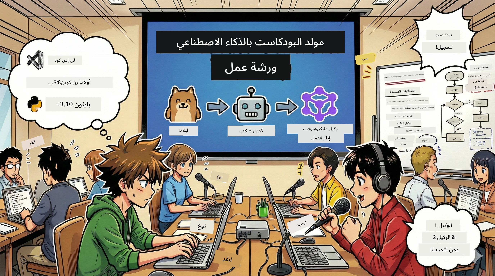

# 🎙️ ورشة عمل استوديو بودكاست الذكاء الاصطناعي



## مهمتك

مرحبًا بك في **استوديو بودكاست الذكاء الاصطناعي**! أنت على وشك إطلاق بودكاست التكنولوجيا الخاص بك "بايتس المستقبل" — لكن هناك منعطف: ستبني فريق إنتاج مدفوع بالذكاء الاصطناعي لمساعدتك في إنشائه. لم تعد بحاجة إلى البحث الذي لا ينتهي، أو كتابة السيناريوهات، أو تحرير الصوت. بدلًا من ذلك، ستصبح منشئ بودكاست يتمتع بقوى خارقة للذكاء الاصطناعي عبر البرمجة.

## خلفية القصة

تخيل: أنت وأصدقاؤك تريدون بدء بودكاست حول أحدث اتجاهات التكنولوجيا، لكن الجميع مشغول بالدراسة أو العمل أو الحياة. ماذا لو استطعت بناء فريق من الذكاء الاصطناعي للقيام بالأعمال الشاقة؟ وكيل ذكاء اصطناعي مسؤول عن البحث، آخر يكتب سيناريوهات جذابة، وثالث يحول النصوص إلى محادثات طبيعية وسلسة. تبدو كخيال علمي؟ لنحولها إلى واقع.

## ما ستتعلمه

بنهاية ورشة العمل هذه، ستعرف كيف:
- 🤖 نشر نماذج ذكاء اصطناعي محلية خاصة بك (بدون تكاليف API، بدون اعتماد على السحابة!)
- 🔧 بناء وكلاء ذكاء اصطناعي محترفين يعملون تعاونياً فعليًا
- 🎬 إنشاء عملية إنتاج بودكاست كاملة من الفكرة إلى الصوت

## رحلتك: ثلاث فصول

مثل أي قصة جيدة، لدينا ثلاث فصول. كل فصل يبني تدريجيًا استوديو البودكاست الذكي الخاص بك:

| الفصل | مهمتك | ما يحدث | المهارات المكتسبة |
|---------|-----------|--------------|----------------|
| **الفصل الأول** | [تعرف على مساعدك الذكي](01.BuildAIAgentWithSLM.md) | ستكتشف كيفية إنشاء وكلاء ذكاء اصطناعي يمكنهم الدردشة، البحث في الإنترنت، وحتى حل المشكلات. تخيلهم متدربين للبحث لا ينامون أبدًا. | 🎯 بناء وكيلك الأول<br>🛠️ منحه قوى خارقة (أدوات!)<br>🧠 تعليمه التفكير<br>🌐 الاتصال بالإنترنت |
| **الفصل الثاني** | [بناء فريق الإنتاج](02.AIAgentOrchestrationAndWorkflows.md) | الآن تصبح الأمور مثيرة! سترتب عدة وكلاء ذكاء اصطناعي للعمل بتناغم مثل فريق بودكاست حقيقي. واحد للبحث، وآخر للكتابة، وأنت للمراجعة — العمل الجماعي يحقق الأحلام. | 🎭 تنسيق عدة وكلاء<br>🔄 بناء سير عمل الموافقة<br>🖥️ اختبار باستخدام واجهة DevUI<br>✋ الحفاظ على السيطرة البشرية |
| **الفصل الثالث** | [إحياء بودكاستك](03.Multi-SpeakerPodcastGenerationWithVibeVoice.md) | النهاية الكبرى! حول نصوصك المكتوبة إلى صوت بودكاست حقيقي بصوت واقعي ومحادثات طبيعية. بودكاست "بايتس المستقبل" جاهز للنشر! | 🎤 سحر تحويل النص إلى كلام<br>👥 أصوات متعددة المتحدثين<br>⏱️ صوت طويل المدة<br>🚀 تشغيل تلقائي كامل |

كل فصل سيفتح قدرات جديدة. إذا كنت جريئًا يمكنك القفز بين الفصول، لكننا نوصي بالتعلم بالترتيب!

## متطلبات البيئة

تدعم ورشة العمل هذه بيئات أجهزة مختلفة:
- **CPU**: مناسب للاختبار والاستخدام الصغير
- **GPU**: موصى به للإنتاج، يحسن سرعة الاستنتاج بشكل ملحوظ
- **NPU**: يدعم تسريع وحدة معالجة الأعصاب من الجيل القادم

## ما تحتاجه

### قائمة البرامج ✅
- **Python 3.10+** (لغة البرمجة الخاصة بك)
- **Ollama** (مشغل نماذج الذكاء الاصطناعي على جهازك)
- **VS Code** (محرر الشيفرة الخاص بك)
- **امتداد Python** (لجعل VS Code أكثر ذكاءً)
- **Git** (لاسترجاع الشيفرة)

### فحص الأجهزة 💻
- **هل أستطيع التشغيل؟**: 8 جيجابايت ذاكرة، 10 جيجابايت مساحة متاحة (يعمل، لكن قد يكون بطيئًا بعض الشيء)
- **التكوين المثالي**: 16 جيجابايت+ ذاكرة، بطاقة GPU جيدة (تشغيل سلس!)
- **هل لديك NPU؟**: هذا أفضل! يفعل أداء الجيل القادم 🚀

## إنشاء استوديوك 🎬

### الخطوة 1: ترقية بايثون

تأكد من وجود Python 3.10 أو أحدث لديك:

```bash
python --version
# يجب عرض Python 3.10.x أو إصدار أحدث
```

لا تملك بايثون؟ احصل عليه من [python.org](https://python.org) — إنه مجاني!

### الخطوة 2: تنزيل Ollama (مشغل نماذج الذكاء الاصطناعي)

اذهب إلى [ollama.ai](https://ollama.ai) لتنزيل Ollama المناسب لنظام التشغيل الخاص بك. اعتبره محركًا لتشغيل نماذج الذكاء الاصطناعي محليًا.

تحقق مما إذا كان جاهزًا:

```bash
ollama --version
```

### الخطوة 3: تحميل دماغ الذكاء الاصطناعي الخاص بك 🧠

حان الوقت لتحميل نموذج Qwen-3-8B (مثل توظيف المساعد الذكي الأول الخاص بك):

```bash
ollama pull qwen3:8b
```

*قد يستغرق هذا بضع دقائق. وقت القهوة المثالي!☕*

### الخطوة 4: إعداد VS Code

إذا لم يكن لديك حتى الآن، احصل على [Visual Studio Code](https://code.visualstudio.com/). إنه أفضل محرر شفرة (جرب وأنكر 😄).

### الخطوة 5: إضافة امتداد Python

في VS Code:
1. اضغط `Ctrl+Shift+X` (على Mac استخدم `Cmd+Shift+X`)
2. ابحث عن "Python"
3. ثبت الامتداد الرسمي من Microsoft

### الخطوة 6: انتهيت! 🎉

بجدية، أنت جاهز الآن. دعنا نبني بعض سحر الذكاء الاصطناعي!

### الخطوة 7: تثبيت إطار عمل Microsoft Agent والحزم المرتبطة 📦

قم بتثبيت جميع الاعتمادات المطلوبة للورشة:

```bash
pip install -r ./Installations/requirements.txt -U
```

*هذا سيثبت إطار عمل Microsoft Agent وجميع الحزم اللازمة. اشرب فنجان قهوة — التثبيت الأول قد يستغرق دقائق!☕*

## تعليمات الورشة

سيتم توضيح هيكل المشروع المفصل، وخطوات الإعداد، وكيفية التشغيل تدريجيًا أثناء الورشة.

## استكشاف الأخطاء (عندما تسوء الأمور) 🔧

### "آه، تنزيل النموذج بطيء جدًا!"
**الحل**: استخدم VPN أو قم بتكوين مصدر镜像 لـ Ollama. أحيانًا الشبكة ليست جيدة.

### "جهازي على وشك التعطل! الذاكرة غير كافية!"
**الحل**: قم بالتبديل إلى نموذج أصغر أو اضبط إعداد `num_ctx` لاستخدام ذاكرة أقل. اعتبرها حمية للذكاء الاصطناعي الخاص بك.

### "هل يمكنني استخدام GPU لتسريع الأمور؟"
**الحل**: Ollama يكتشف GPU تلقائيًا! فقط تأكد من تحديث برنامج تشغيل GPU الخاص بك. تسريع مجاني! 🏎️

## موارد إضافية (للمهتمين) 📚

- [توثيق Ollama](https://github.com/ollama/ollama) — تعرف أكثر على نماذج الذكاء الاصطناعي المحلية
- [إطار عمل Microsoft Agent](https://microsoft.github.io/autogen/) — تعرف أكثر عن بناء فرق الوكلاء الأذكياء
- [معلومات نموذج Qwen](https://qwenlm.github.io/) — تعرّف على دماغ مساعد الذكاء الاصطناعي الخاص بك

## الترخيص

رخصة MIT — ابتكر أشياء رائعة، شاركها، واجعل العالم مكانًا أفضل! 🌍

## هل ترغب بالمساهمة؟

وجدت خطأ؟ لديك فكرة؟ قدّم Issue أو PR! نحن نحب جو المجتمع.✨

---

<!-- CO-OP TRANSLATOR DISCLAIMER START -->
**تنويه**:  
تمت ترجمة هذا المستند باستخدام خدمة الترجمة بالذكاء الاصطناعي [Co-op Translator](https://github.com/Azure/co-op-translator). بينما نحرص على الدقة، يرجى العلم أن الترجمات الآلية قد تحتوي على أخطاء أو بيانات غير دقيقة. يجب اعتبار المستند الأصلي بلغته الأصلية المصدر الرسمي والمعتمد. للحصول على معلومات هامة أو حرجة، يُفضل الاستعانة بترجمة بشرية محترفة. نحن غير مسؤولين عن أي سوء فهم أو تفسير خاطئ ناتج عن استخدام هذه الترجمة.
<!-- CO-OP TRANSLATOR DISCLAIMER END -->