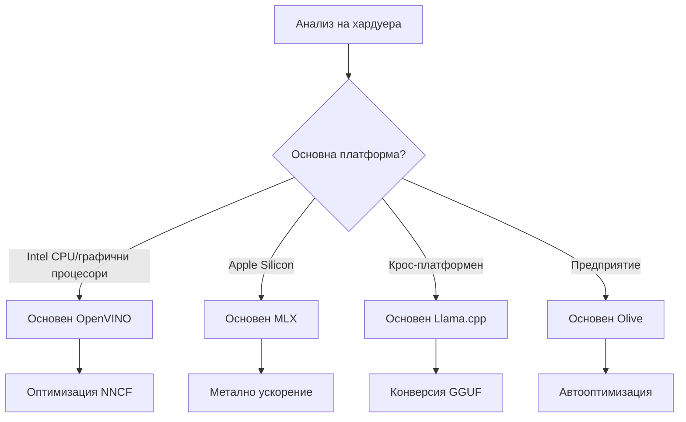
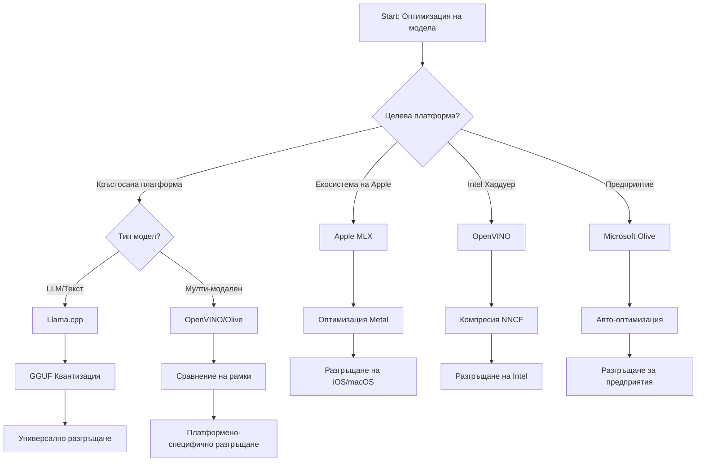
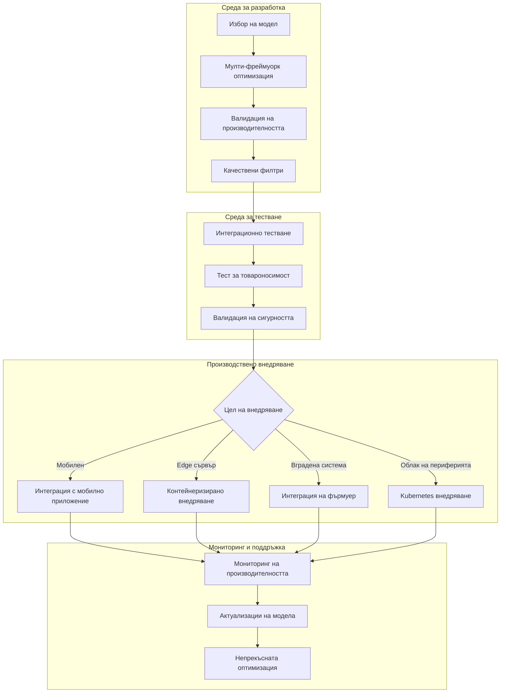

# Раздел 6: Синтез на работния процес за разработка на Edge AI

## Съдържание
1. [Въведение](#въведение)
2. [Обучителни цели](#обучителни-цели)
3. [Обзор на обединения работен процес](#обзор-на-обединения-работен-процес)
4. [Матрица за избор на рамка](#матрица-за-избор-на-рамка)
5. [Синтез на най-добрите практики](#синтез-на-най-добрите-практики)
6. [Ръководство за стратегия за внедряване](#ръководство-за-стратегия-за-внедряване)
7. [Работен процес за оптимизация на производителността](#работен-процес-за-оптимизация-на-производителността)
8. [Контролен списък за готовност за производство](#контролен-списък-за-готовност-за-производство)
9. [Отстраняване на проблеми и мониторинг](#отстраняване-на-проблеми-и-мониторинг)
10. [Осигуряване на бъдеща устойчивост на вашия Edge AI pipeline](#осигуряване-на-бъдеща-устойчивост-на-вашия-edge-ai-pipeline)

## Въведение

Разработването на Edge AI изисква разширено разбиране на няколко рамки за оптимизация, стратегии за внедряване и хардуерни особености. Този цялостен синтез обединява знанията от Llama.cpp, Microsoft Olive, OpenVINO и Apple MLX, за да създаде единен работен процес, който максимализира ефективността, запазва качеството и гарантира успешното внедряване в производство.

В хода на този курс разгледахме отделни рамки за оптимизация, всяка със свои уникални силни страни и специализирани случаи на употреба. Въпреки това, реалните проекти за Edge AI често изискват комбиниране на техники от няколко рамки или стратегически решения за това кой подход ще донесе най-добри резултати при определени ограничения и изисквания.

Този раздел синтезира колективната мъдрост от всички рамки в приложими работни процеси, дървета на вземане на решения и най-добри практики, които ви позволяват да изградите производствени Edge AI решения ефективно и успешно. Независимо дали оптимизирате за мобилни устройства, вградени системи или edge сървъри, това ръководство предоставя стратегическата рамка за информирано вземане на решения през целия ви цикъл на разработка.

## Обучителни цели

В края на този раздел ще можете да:

### Стратегическо вземане на решения
- **Оценявате и избирате** оптималната рамка за оптимизация въз основа на изискванията на проекта, хардуерните ограничения и сценарии на внедряване
- **Проектирате цялостни работни процеси**, които интегрират множество техники за оптимизация за максимална ефективност
- **Оценявате компромисите** между точността на модела, скоростта на извличане, използването на паметта и сложността на внедряване в различни рамки

### Интеграция на работния процес
- **Прилагате обединени линии на разработка**, които използват силните страни на няколко рамки за оптимизация
- **Създавате възпроизводими работни процеси** за постоянно оптимизиране и внедряване на модели в различни среди
- **Установявате контроли за качество** и процеси за валидация, за да гарантирате, че оптимизираните модели отговарят на изискванията за производство

### Оптимизация на производителността
- **Прилагате систематични стратегии за оптимизация** чрез квантизация, триминг и хардуерно-специфични техники за ускоряване
- **Наблюдавате и бенчмаркирате** производителността на модела при различни нива на оптимизация и целеви платформи за внедряване
- **Оптимизирате за конкретни хардуерни платформи**, включително CPU, GPU, NPU и специализирани edge ускорители

### Внедряване в производство
- **Проектирате мащабируеми архитектури за внедряване**, които поддържат множество формати на модели и механизми за извличане
- **Прилагате мониторинг и наблюдение** на Edge AI приложения в производствена среда
- **Установявате работни процеси за поддръжка** на обновления на модела, мониторинг на производителността и оптимизация на системата

### Отлично функциониране на множество платформи
- **Внедрявате оптимизирани модели** на разнообразни хардуерни платформи, като поддържате последователна производителност
- **Обработвате платформа-специфични оптимизации** за Windows, macOS, Linux, мобилни и вградени системи
- **Създавате абстрактни слоеве**, които позволяват безпроблемно внедряване в различни edge среди

## Обзор на обединения работен процес

### Фаза 1: Анализ на изисквания и избор на рамка

Основата за успешно внедряване на Edge AI започва с подробно анализиране на изискванията, което определя избора на рамка и стратегията за оптимизация.

#### 1.1 Оценка на хардуера


**Ключови съображения:**
- **Архитектура на CPU**: възможности x86, ARM, Apple Silicon
- **Наличност на ускорители**: GPU, NPU, VPU, специализирани AI чипове
- **Ограничения на паметта**: RAM лимити, капацитет за съхранение
- **Енергиен бюджет**: живот на батерията, термални ограничения
- **Свързаност**: изисквания за офлайн работа, ограничения на пропускателната способност

#### 1.2 Матрица с изискванията на приложението

| Изискване | Llama.cpp | Microsoft Olive | OpenVINO | Apple MLX |
|-------------|-----------|-----------------|----------|-----------|
| Много платформи | ✅ Отлично | ⚡ Добро | ⚡ Добро | ❌ Само Apple |
| Интеграция в предприятие | ⚡ Основно | ✅ Отлично | ✅ Отлично | ⚡ Ограничено |
| Мобилно внедряване | ✅ Отлично | ⚡ Добро | ⚡ Добро | ✅ iOS Отлично |
| Извличане в реално време | ✅ Отлично | ✅ Отлично | ✅ Отлично | ✅ Отлично |
| Многообразие на модели | ✅ Фокус върху LLM | ✅ Всички модели | ✅ Всички модели | ✅ Фокус върху LLM |
| Лесна употреба | ✅ Просто | ✅ Автоматизирано | ⚡ Умерено | ✅ Просто |

### Фаза 2: Подготовка и оптимизация на модела

#### 2.1 Универсален работен процес за оценка на модела

```python
# Универсална рамка за оценка на модели
class EdgeAIModelAssessment:
    def __init__(self, model_path, target_hardware):
        self.model_path = model_path
        self.target_hardware = target_hardware
        self.optimization_frameworks = []
        
    def assess_model_characteristics(self):
        """Analyze model size, architecture, and complexity"""
        return {
            'model_size': self.get_model_size(),
            'parameter_count': self.get_parameter_count(),
            'architecture_type': self.detect_architecture(),
            'quantization_compatibility': self.check_quantization_support()
        }
    
    def recommend_optimization_strategy(self):
        """Recommend optimal frameworks and techniques"""
        characteristics = self.assess_model_characteristics()
        
        if self.target_hardware.startswith('apple'):
            return self.mlx_optimization_strategy(characteristics)
        elif self.target_hardware.startswith('intel'):
            return self.openvino_optimization_strategy(characteristics)
        elif characteristics['model_size'] > 7_000_000_000:  # 7 милиарда+ параметри
            return self.enterprise_optimization_strategy(characteristics)
        else:
            return self.lightweight_optimization_strategy(characteristics)
```

#### 2.2 Многорамкова оптимизация

**Последователен подход за оптимизация:**
1. **Първоначално преобразуване**: конвертиране в междинен формат (ONNX, когато е възможно)
2. **Оптимизация специфична за рамката**: прилагане на специализирани техники
3. **Крос-валидация**: проверка на производителността на целевите платформи
4. **Финално пакетиране**: подготовка за внедряване

```bash
# Скрипт за оптимизация с няколко рамки
#!/bin/bash

MODEL_NAME="phi-3-mini"
BASE_MODEL="microsoft/Phi-3-mini-4k-instruct"

# Фаза 1: ONNX преобразуване (универсално)
python convert_to_onnx.py --model $BASE_MODEL --output models/onnx/

# Фаза 2: Оптимизация за специфична платформа
if [[ "$TARGET_PLATFORM" == "intel" ]]; then
    # Оптимизация с OpenVINO
    python optimize_openvino.py --input models/onnx/ --output models/openvino/
elif [[ "$TARGET_PLATFORM" == "apple" ]]; then
    # Оптимизация с MLX
    python optimize_mlx.py --input $BASE_MODEL --output models/mlx/
elif [[ "$TARGET_PLATFORM" == "cross" ]]; then
    # Оптимизация на Llama.cpp
    python convert_to_gguf.py --input models/onnx/ --output models/gguf/
fi

# Фаза 3: Валидация
python validate_optimization.py --original $BASE_MODEL --optimized models/$TARGET_PLATFORM/
```

### Фаза 3: Валидация и бенчмаркинг на производителността

#### 3.1 Изчерпателна рамка за бенчмаркинг

```python
class EdgeAIBenchmark:
    def __init__(self, optimized_models):
        self.models = optimized_models
        self.metrics = {
            'inference_time': [],
            'memory_usage': [],
            'accuracy_score': [],
            'throughput': [],
            'energy_consumption': []
        }
    
    def run_comprehensive_benchmark(self):
        """Execute standardized benchmarks across all optimized models"""
        test_inputs = self.generate_test_inputs()
        
        for model_framework, model_path in self.models.items():
            print(f"Benchmarking {model_framework}...")
            
            # Тест за латентност
            latency = self.measure_inference_latency(model_path, test_inputs)
            
            # Профилиране на паметта
            memory = self.profile_memory_usage(model_path)
            
            # Валидация на точността
            accuracy = self.validate_model_accuracy(model_path, test_inputs)
            
            # Анализ на пропускателната способност
            throughput = self.measure_throughput(model_path)
            
            self.record_metrics(model_framework, latency, memory, accuracy, throughput)
    
    def generate_optimization_report(self):
        """Create comprehensive comparison report"""
        report = {
            'recommendations': self.analyze_performance_trade_offs(),
            'deployment_guidance': self.generate_deployment_recommendations(),
            'monitoring_requirements': self.define_monitoring_metrics()
        }
        return report
```

## Матрица за избор на рамка

### Дърво на решения за избор на рамка



### Изчерпателни критерии за избор

#### 1. Основно съвпадение с целта на използване

**Големи езикови модели (LLM):**
- **Llama.cpp**: Най-добър за CPU-фокусирано, много платформа внедряване
- **Apple MLX**: Оптимален за Apple Silicon с обединена памет
- **OpenVINO**: Отличен за хардуер на Intel с оптимизация NNCF
- **Microsoft Olive**: Идеален за предприятие с автоматизация

**Мултимодални модели:**
- **OpenVINO**: Цялостна поддръжка за виждане, аудио и текст
- **Microsoft Olive**: Оптимизация за предприятие за сложни работни потоци
- **Llama.cpp**: Ограничен до модели базирани на текст
- **Apple MLX**: Растяща поддръжка на мултимодални приложения

#### 2. Матрица на хардуерната платформа

| Платформа | Основна рамка | Вторична опция | Специализирани функции |
|----------|------------------|------------------|---------------------|
| Intel CPU/GPU | OpenVINO | Microsoft Olive | NNCF компресия, Intel оптимизация |
| NVIDIA GPU | Microsoft Olive | OpenVINO | CUDA ускорение, корпоративни функции |
| Apple Silicon | Apple MLX | Llama.cpp | Metal шейдъри, обединена памет |
| ARM мобилен | Llama.cpp | OpenVINO | Много платформи, минимални зависимости |
| Edge TPU | OpenVINO | Microsoft Olive | Поддръжка на специализирани ускорители |
| Вградени ARM | Llama.cpp | OpenVINO | Минимален отпечатък, ефективно извличане |

#### 3. Предпочитания за работния процес на разработка

**Бърз прототипиране:**
1. **Llama.cpp**: Най-бързо настройване, незабавни резултати
2. **Apple MLX**: Прост Python API, бърза итерация
3. **Microsoft Olive**: Автоматизирана оптимизация, минимална конфигурация
4. **OpenVINO**: По-сложно настройване, цялостни функции

**Производство за предприятия:**
1. **Microsoft Olive**: функции за предприятия, интеграция с Azure
2. **OpenVINO**: Intel екосистема, цялостни инструменти
3. **Apple MLX**: приложения за предприятия, специфични за Apple
4. **Llama.cpp**: Просто внедряване, ограничени функции за предприятия

## Синтез на най-добрите практики

### Универсални принципи за оптимизация

#### 1. Прогресивна стратегия за оптимизация

```python
class ProgressiveOptimization:
    def __init__(self, base_model):
        self.base_model = base_model
        self.optimization_stages = [
            'baseline_measurement',
            'format_conversion',
            'quantization_optimization',
            'hardware_acceleration',
            'production_validation'
        ]
    
    def execute_progressive_optimization(self):
        """Apply optimization techniques incrementally"""
        
        # Етап 1: Измерване на базовото ниво
        baseline_metrics = self.measure_baseline_performance()
        
        # Етап 2: Преобразуване на формат
        converted_model = self.convert_to_optimal_format()
        conversion_metrics = self.measure_performance(converted_model)
        
        # Етап 3: Квантуване
        quantized_model = self.apply_quantization(converted_model)
        quantization_metrics = self.measure_performance(quantized_model)
        
        # Етап 4: Хардуерно ускорение
        accelerated_model = self.enable_hardware_acceleration(quantized_model)
        acceleration_metrics = self.measure_performance(accelerated_model)
        
        # Етап 5: Валидация
        production_ready = self.validate_for_production(accelerated_model)
        
        return self.compile_optimization_report(
            baseline_metrics, conversion_metrics, 
            quantization_metrics, acceleration_metrics
        )
```

#### 2. Прилагане на контроли за качество

**Врати за запазване на точността:**
- Запазване на >95% от оригиналната точност на модела
- Валидация с представителни тестови набори от данни
- Прилагане на A/B тестове за валидация в производство

**Врати за подобряване на производителността:**
- Постигане на минимум 2x ускорение
- Намаляване на използваната памет поне с 50%
- Валидация на последователността на времето за извличане

**Врати за готовност за производство:**
- Преминаване на тестове при натоварване
- Демонстриране на стабилна производителност във времето
- Валидация на изисквания за сигурност и поверителност

### Интеграция на най-добри практики специфични за рамки

#### 1. Синтез на стратегия за квантизация

```python
# Унифициран подход за квантизиране
class UnifiedQuantizationStrategy:
    def __init__(self, model, target_platform):
        self.model = model
        self.platform = target_platform
        
    def select_optimal_quantization(self):
        """Choose best quantization based on platform and requirements"""
        
        if self.platform == 'apple_silicon':
            return self.mlx_quantization_strategy()
        elif self.platform == 'intel_hardware':
            return self.openvino_quantization_strategy()
        elif self.platform == 'cross_platform':
            return self.llamacpp_quantization_strategy()
        else:
            return self.olive_quantization_strategy()
    
    def mlx_quantization_strategy(self):
        """Apple MLX-specific quantization"""
        return {
            'method': 'mlx_quantize',
            'precision': 'int4',
            'group_size': 64,
            'optimization_target': 'unified_memory'
        }
    
    def openvino_quantization_strategy(self):
        """OpenVINO NNCF quantization"""
        return {
            'method': 'nncf_quantize',
            'precision': 'int8',
            'calibration_method': 'post_training',
            'optimization_target': 'intel_hardware'
        }
```

#### 2. Оптимизация на хардуерно ускорение

**Синтез на оптимизацията за CPU:**
- **SIMD инструкции**: Използване на оптимизирани ядра през рамките
- **Пропускателна способност на паметта**: Оптимизиране на разпределение на данни за ефективност на кеша
- **Многонитово изпълнение**: Балансиране на паралелизъм с хардуерни ограничения

**Най-добри практики за ускорение на GPU:**
- **Обработка на пакети**: Максимизиране на пропускателната способност с подходящи размери на пакетите
- **Управление на паметта**: Оптимизиране на разпределението и трансферите в GPU паметта
- **Прецизност**: Използване на FP16, когато е поддържано за по-добра производителност

**Оптимизация на NPU/специализирани ускорители:**
- **Архитектура на модела**: Гарантиране на съвместимост с възможностите на ускорителя
- **Поток на данни**: Оптимизиране на входно/изходните потоци за ефективност на ускорителя
- **Стратегии за резервно изпълнение**: Прилагане на резервно CPU изпълнение за неподдържани операции

## Ръководство за стратегия за внедряване

### Универсална архитектура за внедряване



### Платформено-специфични модели за внедряване

#### 1. Стратегия за мобилно внедряване

```yaml
# Mobile Deployment Configuration
mobile_deployment:
  ios:
    framework: apple_mlx
    optimization:
      quantization: int4
      memory_mapping: true
      background_execution: limited
    packaging:
      format: mlx
      bundle_size: <50MB
      
  android:
    framework: llama_cpp
    optimization:
      quantization: q4_k_m
      threading: android_optimized
      memory_management: conservative
    packaging:
      format: gguf
      apk_size: <100MB
      
  cross_platform:
    framework: onnx_runtime
    optimization:
      quantization: int8
      execution_provider: cpu
    packaging:
      format: onnx
      shared_libraries: minimal
```

#### 2. Внедряване на edge сървър

```yaml
# Edge Server Deployment Configuration
edge_server:
  intel_based:
    framework: openvino
    optimization:
      quantization: int8
      acceleration: cpu_gpu_auto
      batch_processing: dynamic
    deployment:
      container: openvino_runtime
      orchestration: kubernetes
      scaling: horizontal
      
  nvidia_based:
    framework: microsoft_olive
    optimization:
      quantization: int4
      acceleration: cuda
      tensor_parallelism: true
    deployment:
      container: nvidia_triton
      orchestration: kubernetes
      scaling: gpu_aware
```

### Най-добри практики за контейнеризация

```dockerfile
# Multi-Framework Edge AI Container
FROM ubuntu:22.04 as base

# Install common dependencies
RUN apt-get update && apt-get install -y \
    python3 \
    python3-pip \
    build-essential \
    cmake \
    && rm -rf /var/lib/apt/lists/*

# Framework-specific stages
FROM base as openvino
RUN pip install openvino nncf optimum[intel]

FROM base as llamacpp
RUN git clone https://github.com/ggerganov/llama.cpp.git \
    && cd llama.cpp && make LLAMA_OPENBLAS=1

FROM base as olive
RUN pip install olive-ai[auto-opt] onnxruntime-genai

# Production stage with selected framework
FROM openvino as production
COPY models/ /app/models/
COPY src/ /app/src/
WORKDIR /app

EXPOSE 8080
CMD ["python3", "src/inference_server.py"]
```

## Работен процес за оптимизация на производителността

### Систематично настройване на производителността

#### 1. Работен процес за профилиране на производителността

```python
class EdgeAIPerformanceProfiler:
    def __init__(self, model_path, framework):
        self.model_path = model_path
        self.framework = framework
        self.profiling_results = {}
    
    def comprehensive_profiling(self):
        """Execute comprehensive performance analysis"""
        
        # Профилиране на процесора
        cpu_profile = self.profile_cpu_usage()
        
        # Профилиране на паметта
        memory_profile = self.profile_memory_usage()
        
        # Задържане при извеждане на изводи
        latency_profile = self.profile_inference_latency()
        
        # Анализ на пропускателната способност
        throughput_profile = self.profile_throughput()
        
        # Консумация на енергия (където е налична)
        energy_profile = self.profile_energy_consumption()
        
        return self.compile_performance_report(
            cpu_profile, memory_profile, latency_profile,
            throughput_profile, energy_profile
        )
    
    def identify_bottlenecks(self):
        """Automatically identify performance bottlenecks"""
        bottlenecks = []
        
        if self.profiling_results['cpu_utilization'] > 80:
            bottlenecks.append('cpu_bound')
        
        if self.profiling_results['memory_usage'] > 90:
            bottlenecks.append('memory_bound')
        
        if self.profiling_results['inference_variance'] > 20:
            bottlenecks.append('inconsistent_performance')
        
        return self.generate_optimization_recommendations(bottlenecks)
```

#### 2. Автоматизиран работен процес за оптимизация

```python
class AutomatedOptimizationPipeline:
    def __init__(self, base_model, target_constraints):
        self.base_model = base_model
        self.constraints = target_constraints
        self.optimization_history = []
    
    def execute_optimization_search(self):
        """Systematically search optimization space"""
        
        optimization_candidates = [
            {'quantization': 'int8', 'pruning': 0.1},
            {'quantization': 'int4', 'pruning': 0.2},
            {'quantization': 'int8', 'acceleration': 'gpu'},
            {'quantization': 'int4', 'acceleration': 'npu'}
        ]
        
        best_configuration = None
        best_score = 0
        
        for config in optimization_candidates:
            optimized_model = self.apply_optimization(config)
            score = self.evaluate_optimization(optimized_model)
            
            if score > best_score and self.meets_constraints(optimized_model):
                best_score = score
                best_configuration = config
            
            self.optimization_history.append({
                'config': config,
                'score': score,
                'model': optimized_model
            })
        
        return best_configuration, self.optimization_history
```

### Многоцелева оптимизация

#### 1. Pareto оптимизация за Edge AI

```python
class ParetoOptimization:
    def __init__(self, objectives=['speed', 'accuracy', 'memory']):
        self.objectives = objectives
        self.pareto_frontier = []
    
    def find_pareto_optimal_solutions(self, optimization_results):
        """Identify Pareto-optimal configurations"""
        
        for result in optimization_results:
            is_dominated = False
            
            for frontier_point in self.pareto_frontier:
                if self.dominates(frontier_point, result):
                    is_dominated = True
                    break
            
            if not is_dominated:
                # Премахнете доминираните точки от фронтира
                self.pareto_frontier = [
                    point for point in self.pareto_frontier 
                    if not self.dominates(result, point)
                ]
                
                self.pareto_frontier.append(result)
        
        return self.pareto_frontier
    
    def recommend_configuration(self, user_preferences):
        """Recommend configuration based on user preferences"""
        
        weighted_scores = []
        for config in self.pareto_frontier:
            score = sum(
                user_preferences[obj] * config['metrics'][obj] 
                for obj in self.objectives
            )
            weighted_scores.append((score, config))
        
        return max(weighted_scores, key=lambda x: x[0])[1]
```

## Контролен списък за готовност за производство

### Изчерпателна валидация за производство

#### 1. Осигуряване на качество на модела

```python
class ProductionReadinessValidator:
    def __init__(self, optimized_model, production_requirements):
        self.model = optimized_model
        self.requirements = production_requirements
        self.validation_results = {}
    
    def validate_model_quality(self):
        """Comprehensive model quality validation"""
        
        # Проверка на точността
        accuracy_result = self.validate_accuracy()
        
        # Проверка на производителността
        performance_result = self.validate_performance()
        
        # Тест за устойчивост
        robustness_result = self.validate_robustness()
        
        # Оценка на сигурността
        security_result = self.validate_security()
        
        # Верификация на съответствието
        compliance_result = self.validate_compliance()
        
        return self.compile_validation_report(
            accuracy_result, performance_result, robustness_result,
            security_result, compliance_result
        )
    
    def generate_certification_report(self):
        """Generate production certification report"""
        return {
            'model_signature': self.generate_model_signature(),
            'validation_timestamp': datetime.now(),
            'validation_results': self.validation_results,
            'deployment_approval': self.check_deployment_approval(),
            'monitoring_requirements': self.define_monitoring_requirements()
        }
```

#### 2. Контролен списък за производство и внедряване

**Валидация преди внедряване:**
- [ ] Точността на модела отговаря на минималните изисквания (>95% от базовото ниво)
- [ ] Цели за производителност постигнати (задържане на латентни стойности, пропускателна способност, използване на памет)
- [ ] Оценени и смекчени уязвимости в сигурността
- [ ] Проведени тестове при натоварване
- [ ] Тествани сценарии на отказ и документирани процедури за възстановяване
- [ ] Конфигурирани системи за мониторинг и оповестяване
- [ ] Тествани и документирани процедури за връщане назад

**Процес на внедряване:**
- [ ] Изпълнена стратегия за синьо-зелено внедряване
- [ ] Конфигурирано постепенно увеличаване на трафика
- [ ] Активни табла за мониторинг в реално време
- [ ] Установени базови линии за изпълнение
- [ ] Дефинирани прагове за честота на грешки
- [ ] Конфигурирани автоматични задействания на връщане назад

**Мониторинг след внедряване:**
- [ ] Активно засичане на дрейф на модела
- [ ] Конфигурирани предупреждения за деградация на производителността
- [ ] Включен мониторинг на използване на ресурси
- [ ] Наблюдение на метрики за потребителски опит
- [ ] Поддържане на версиониране и проследяване на наследствеността на модела
- [ ] Планирани редовни прегледи на производителността на модела

### Непрекъсната интеграция / Непрекъснато внедряване (CI/CD)

```yaml
# Edge AI CI/CD Pipeline Configuration
edge_ai_pipeline:
  stages:
    - model_validation
    - optimization
    - testing
    - staging_deployment
    - production_deployment
    - monitoring
  
  model_validation:
    accuracy_threshold: 0.95
    performance_baseline: required
    security_scan: enabled
    
  optimization:
    frameworks:
      - llama_cpp
      - openvino
      - microsoft_olive
    validation:
      cross_validation: enabled
      performance_comparison: required
      
  testing:
    unit_tests: comprehensive
    integration_tests: full_pipeline
    load_tests: production_scale
    security_tests: comprehensive
    
  deployment:
    strategy: blue_green
    traffic_ramping: gradual
    rollback: automatic
    monitoring: real_time
```

## Отстраняване на проблеми и мониторинг

### Универсална рамка за отстраняване на проблеми

#### 1. Чести проблеми и решения

**Проблеми с производителността:**
```python
class PerformanceTroubleshooter:
    def __init__(self, model_metrics):
        self.metrics = model_metrics
        
    def diagnose_performance_issues(self):
        """Systematic performance issue diagnosis"""
        
        issues = []
        
        # Диагностика на висока латентност
        if self.metrics['avg_latency'] > self.metrics['target_latency']:
            issues.append(self.diagnose_latency_issues())
        
        # Диагностика на използване на паметта
        if self.metrics['memory_usage'] > self.metrics['memory_limit']:
            issues.append(self.diagnose_memory_issues())
        
        # Диагностика на пропускателната способност
        if self.metrics['throughput'] < self.metrics['target_throughput']:
            issues.append(self.diagnose_throughput_issues())
        
        return self.generate_resolution_plan(issues)
    
    def diagnose_latency_issues(self):
        """Specific latency troubleshooting"""
        potential_causes = []
        
        if self.metrics['cpu_utilization'] > 80:
            potential_causes.append('cpu_bottleneck')
        
        if self.metrics['memory_bandwidth'] > 90:
            potential_causes.append('memory_bandwidth_limit')
        
        if self.metrics['model_size'] > self.metrics['optimal_size']:
            potential_causes.append('model_too_large')
        
        return {
            'issue': 'high_latency',
            'causes': potential_causes,
            'solutions': self.generate_latency_solutions(potential_causes)
        }
```

**Отстраняване на проблеми специфично за рамката:**

| Проблем | Llama.cpp | Microsoft Olive | OpenVINO | Apple MLX |
|-------|-----------|-----------------|----------|-----------|
| Проблеми с паметта | Намаляване на дължината на контекста | Намаляване на размера на пакета | Активиране на кеширане | Използване на паметно картографиране |
| Бавно извличане | Активиране на SIMD | Проверка на квантизацията | Оптимизация на многонитово изпълнение | Активиране на Metal |
| Загуба на точност | По-висока квантизация | Претренировка с QAT | Увеличаване на калибрацията | Финна настройка след квантизация |
| Съвместимост | Проверка на формата на модела | Проверка на версията на рамката | Актуализация на драйвери | Проверка на версията на macOS |

#### 2. Стратегия за мониторинг на производството

```python
class EdgeAIMonitoring:
    def __init__(self, deployment_config):
        self.config = deployment_config
        self.metrics_collectors = []
        self.alerting_rules = []
    
    def setup_comprehensive_monitoring(self):
        """Configure comprehensive monitoring for Edge AI deployment"""
        
        # Мониторинг на производителността на модела
        self.setup_model_performance_monitoring()
        
        # Мониторинг на инфраструктурата
        self.setup_infrastructure_monitoring()
        
        # Мониторинг на бизнес метриките
        self.setup_business_metrics_monitoring()
        
        # Мониторинг на сигурността
        self.setup_security_monitoring()
    
    def setup_model_performance_monitoring(self):
        """Model-specific performance monitoring"""
        metrics = [
            'inference_latency_p50',
            'inference_latency_p95',
            'inference_latency_p99',
            'model_accuracy_drift',
            'prediction_confidence_distribution',
            'error_rate',
            'throughput_requests_per_second'
        ]
        
        for metric in metrics:
            self.add_metric_collector(metric)
            self.add_alerting_rule(metric)
    
    def detect_model_drift(self):
        """Automated model drift detection"""
        drift_indicators = [
            self.statistical_drift_detection(),
            self.performance_drift_detection(),
            self.data_distribution_shift_detection()
        ]
        
        return self.aggregate_drift_signals(drift_indicators)
```

### Автоматизирано разрешаване на проблеми

```python
class AutomatedIssueResolution:
    def __init__(self, monitoring_system):
        self.monitoring = monitoring_system
        self.resolution_strategies = {}
    
    def handle_performance_degradation(self, alert):
        """Automated performance issue resolution"""
        
        if alert['type'] == 'high_latency':
            return self.resolve_latency_issue(alert)
        elif alert['type'] == 'high_memory_usage':
            return self.resolve_memory_issue(alert)
        elif alert['type'] == 'accuracy_drift':
            return self.resolve_accuracy_issue(alert)
        
    def resolve_latency_issue(self, alert):
        """Automated latency issue resolution"""
        resolution_steps = [
            'increase_cpu_allocation',
            'enable_model_caching',
            'reduce_batch_size',
            'switch_to_quantized_model'
        ]
        
        for step in resolution_steps:
            if self.apply_resolution_step(step):
                return f"Resolved latency issue with: {step}"
        
        return "Escalating to human operator"
```

## Осигуряване на бъдеща устойчивост на вашия Edge AI pipeline

### Интеграция на новопоявяващи се технологии

#### 1. Поддръжка на хардуер от ново поколение

```python
class FutureHardwareIntegration:
    def __init__(self):
        self.supported_accelerators = [
            'npu_next_gen',
            'quantum_processors',
            'neuromorphic_chips',
            'optical_processors'
        ]
    
    def design_adaptive_pipeline(self):
        """Create hardware-agnostic optimization pipeline"""
        
        pipeline = {
            'model_preparation': self.universal_model_preparation(),
            'hardware_detection': self.dynamic_hardware_detection(),
            'optimization_selection': self.adaptive_optimization_selection(),
            'performance_validation': self.hardware_agnostic_validation()
        }
        
        return pipeline
    
    def adaptive_optimization_selection(self):
        """Dynamically select optimization based on available hardware"""
        
        def optimize_for_hardware(model, available_hardware):
            if 'npu' in available_hardware:
                return self.npu_optimization(model)
            elif 'quantum' in available_hardware:
                return self.quantum_optimization(model)
            elif 'neuromorphic' in available_hardware:
                return self.neuromorphic_optimization(model)
            else:
                return self.fallback_optimization(model)
        
        return optimize_for_hardware
```

#### 2. Еволюция на архитектурата на модела

**Поддръжка на нови архитектури:**
- **Mixture of Experts (MoE)**: Редки архитектури на модели за ефективност
- **Генериране с допълнително извличане (Retrieval-Augmented Generation)**: Хибридна система с модел + база знания
- **Мултимодални модели**: Интеграция на виждане + език + аудио
- **Федеративно обучение**: Разпределено обучение и оптимизация

```python
class NextGenModelSupport:
    def __init__(self):
        self.architecture_handlers = {
            'moe': self.handle_mixture_of_experts,
            'rag': self.handle_retrieval_augmented,
            'multimodal': self.handle_multimodal,
            'federated': self.handle_federated_learning
        }
    
    def handle_mixture_of_experts(self, model):
        """Optimize Mixture of Experts models for edge deployment"""
        optimization_strategy = {
            'expert_pruning': True,
            'routing_optimization': True,
            'expert_quantization': 'per_expert',
            'load_balancing': 'dynamic'
        }
        return self.apply_moe_optimization(model, optimization_strategy)
```

### Непрекъснато обучение и адаптация

#### 1. Интеграция на онлайн обучение

```python
class EdgeOnlineLearning:
    def __init__(self, base_model, learning_rate=0.001):
        self.base_model = base_model
        self.learning_rate = learning_rate
        self.adaptation_buffer = []
    
    def continuous_adaptation(self, new_data, feedback):
        """Continuously adapt model based on edge data"""
        
        # Локална адаптация с опазване на поверителността
        local_updates = self.compute_local_gradients(new_data, feedback)
        
        # Прилагане на актуализации с ограничения
        adapted_model = self.apply_constrained_updates(
            self.base_model, local_updates
        )
        
        # Валидиране на качеството на адаптацията
        if self.validate_adaptation(adapted_model):
            self.base_model = adapted_model
            return True
        
        return False
    
    def federated_learning_participation(self):
        """Participate in federated learning while preserving privacy"""
        
        # Изчисляване на локални актуализации на модела
        local_updates = self.compute_private_updates()
        
        # Защита с диференциална поверителност
        private_updates = self.apply_differential_privacy(local_updates)
        
        # Споделяне с координиращия за федеративно обучение
        return self.share_updates(private_updates)
```

#### 2. Устойчивост и зелено AI

```python
class GreenEdgeAI:
    def __init__(self, sustainability_targets):
        self.targets = sustainability_targets
        self.energy_monitor = EnergyMonitor()
    
    def optimize_for_sustainability(self, model):
        """Optimize model for minimal environmental impact"""
        
        optimization_objectives = [
            'minimize_energy_consumption',
            'maximize_hardware_utilization',
            'reduce_model_training_cost',
            'extend_device_lifetime'
        ]
        
        return self.multi_objective_green_optimization(
            model, optimization_objectives
        )
    
    def carbon_aware_deployment(self):
        """Deploy models considering carbon footprint"""
        
        deployment_strategy = {
            'prefer_renewable_energy_regions': True,
            'optimize_for_energy_efficiency': True,
            'minimize_data_transfer': True,
            'lifecycle_carbon_accounting': True
        }
        
        return deployment_strategy
```

## Заключение

Този цялостен синтез на работния процес представлява кулминацията на знанията за оптимизация на EdgeAI, обединявайки най-добрите практики от всички основни рамки за оптимизация в единен, годен за производство подход. Следвайки тези насоки, ще можете да:

**Постигнете оптимална производителност**: Чрез систематичен избор на рамки, прогресивна оптимизация и цялостна валидация, гарантирайки максимална ефективност на вашите Edge AI приложения.

**Осигурите готовност за производство**: Със задълбочено тестване, мониторинг и контролни точки за качество, които гарантират надеждно внедряване и работа в реални среди.

**Поддържате дългосрочен успех**: Чрез непрекъснат мониторинг, автоматизирано разрешаване на проблеми и стратегии за адаптация, които запазват вашите Edge AI решения производителни и актуални.

**Осигурите бъдещето на вашата инвестиция**: Чрез проектиране на гъвкави, хардуерно-независими линии, които могат да се развиват с новите технологии и изисквания.

Ландшафтът на Edge AI продължава да се развива бързо с нови хардуерни платформи, техники за оптимизация и стратегии за внедряване, които се появяват редовно. Този синтез предоставя основата за навигация в тази сложност при изграждането на устойчиви, ефективни и поддържащи се Edge AI решения, които носят реална стойност в производствените среди.

Запомнете, че най-добрата стратегия за оптимизация е тази, която отговаря на вашите специфични изисквания, като същевременно поддържа гъвкавост да се адаптира с променящите се нужди. Използвайте това ръководство като рамка за информирано вземане на решения, но винаги валидирайте изборите си чрез емпирично тестване и реален опит в внедряването.

## ➡️ Какво следва


- [07: Подробно разглеждане на Qualcomm QNN Framework](./07.QualcommQNN.md)

---

<!-- CO-OP TRANSLATOR DISCLAIMER START -->
**Отказ от отговорност**:
Този документ е преведен с помощта на AI преводачески услуга [Co-op Translator](https://github.com/Azure/co-op-translator). Въпреки че се стремим към точност, моля имайте предвид, че автоматизираните преводи могат да съдържат грешки или неточности. Оригиналният документ на неговия роден език трябва да се счита за авторитетен източник. За критична информация се препоръчва професионален човешки превод. Ние не носим отговорност за каквито и да е недоразумения или неправилни тълкувания, произтичащи от използването на този превод.
<!-- CO-OP TRANSLATOR DISCLAIMER END -->