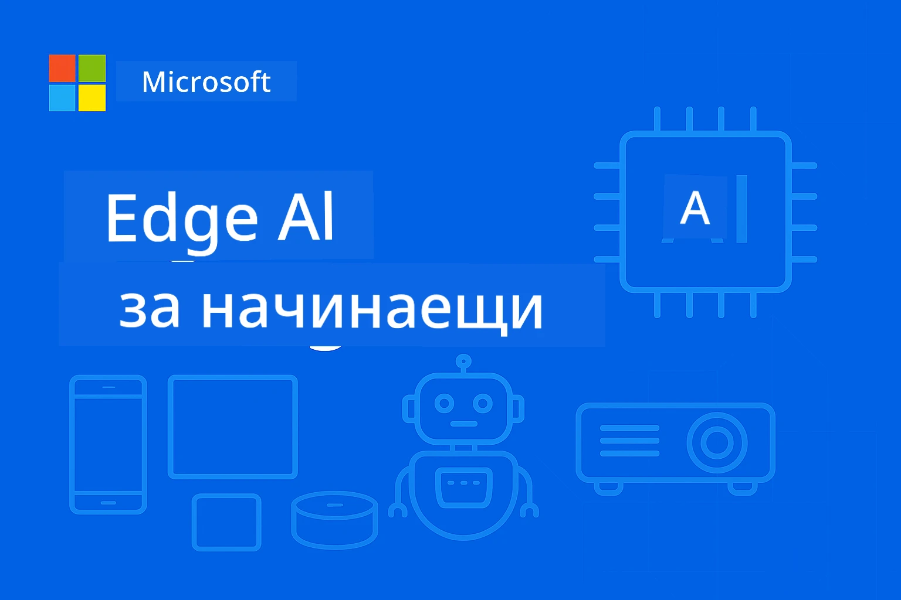

# EdgeAI за начинаещи 




[](https://GitHub.com/microsoft/edgeai-for-beginners/graphs/contributors)
[](https://GitHub.com/microsoft/edgeai-for-beginners/issues)
[](https://GitHub.com/microsoft/edgeai-for-beginners/pulls)
[](http://makeapullrequest.com)

[](https://GitHub.com/microsoft/edgeai-for-beginners/watchers)
[](https://GitHub.com/microsoft/edgeai-for-beginners/fork)
[](https://GitHub.com/microsoft/edgeai-for-beginners/stargazers)


[](https://discord.gg/nTYy5BXMWG)

Следвайте тези стъпки, за да започнете да използвате тези ресурси:

1. **Направете Форк на Репозитория**: Кликнете [](https://GitHub.com/microsoft/edgeai-for-beginners/fork)
2. **Клонирайте Репозитория**:   `git clone https://github.com/microsoft/edgeai-for-beginners.git`
3. [**Присъединете се към Azure AI Foundry Discord и се срещнете с експерти и други разработчици**](https://discord.com/invite/ByRwuEEgH4)


### 🌐 Поддръжка на много езици

#### Поддържано чрез GitHub Action (Автоматизирано и винаги актуално)

<!-- CO-OP TRANSLATOR LANGUAGES TABLE START -->
[Arabic](../ar/README.md) | [Bengali](../bn/README.md) | [Bulgarian](./README.md) | [Burmese (Myanmar)](../my/README.md) | [Chinese (Simplified)](../zh-CN/README.md) | [Chinese (Traditional, Hong Kong)](../zh-HK/README.md) | [Chinese (Traditional, Macau)](../zh-MO/README.md) | [Chinese (Traditional, Taiwan)](../zh-TW/README.md) | [Croatian](../hr/README.md) | [Czech](../cs/README.md) | [Danish](../da/README.md) | [Dutch](../nl/README.md) | [Estonian](../et/README.md) | [Finnish](../fi/README.md) | [French](../fr/README.md) | [German](../de/README.md) | [Greek](../el/README.md) | [Hebrew](../he/README.md) | [Hindi](../hi/README.md) | [Hungarian](../hu/README.md) | [Indonesian](../id/README.md) | [Italian](../it/README.md) | [Japanese](../ja/README.md) | [Kannada](../kn/README.md) | [Korean](../ko/README.md) | [Lithuanian](../lt/README.md) | [Malay](../ms/README.md) | [Malayalam](../ml/README.md) | [Marathi](../mr/README.md) | [Nepali](../ne/README.md) | [Nigerian Pidgin](../pcm/README.md) | [Norwegian](../no/README.md) | [Persian (Farsi)](../fa/README.md) | [Polish](../pl/README.md) | [Portuguese (Brazil)](../pt-BR/README.md) | [Portuguese (Portugal)](../pt-PT/README.md) | [Punjabi (Gurmukhi)](../pa/README.md) | [Romanian](../ro/README.md) | [Russian](../ru/README.md) | [Serbian (Cyrillic)](../sr/README.md) | [Slovak](../sk/README.md) | [Slovenian](../sl/README.md) | [Spanish](../es/README.md) | [Swahili](../sw/README.md) | [Swedish](../sv/README.md) | [Tagalog (Filipino)](../tl/README.md) | [Tamil](../ta/README.md) | [Telugu](../te/README.md) | [Thai](../th/README.md) | [Turkish](../tr/README.md) | [Ukrainian](../uk/README.md) | [Urdu](../ur/README.md) | [Vietnamese](../vi/README.md)

> **Предпочитате локално клониране?**

> Този репозиторий включва над 50 езикови превода, което значително увеличава размера на изтегляне. За да клонирате без преводи, използвайте sparse checkout:
> ```bash
> git clone --filter=blob:none --sparse https://github.com/microsoft/edgeai-for-beginners.git
> cd edgeai-for-beginners
> git sparse-checkout set --no-cone '/*' '!translations' '!translated_images'
> ```
> Това ви дава всичко необходимо за завършване на курса с много по-бързо изтегляне.
<!-- CO-OP TRANSLATOR LANGUAGES TABLE END -->

**Ако желаете да бъдат поддържани допълнителни езици за превод, те са изброени [тук](https://github.com/Azure/co-op-translator/blob/main/getting_started/supported-languages.md)**
## Въведение

Добре дошли в **EdgeAI за начинаещи** – вашето комплексно пътуване в трансформативния свят на Edge изкуствения интелект. Този курс преодолява пропастта между мощните AI възможности и практическото, реално внедряване на гранични устройства, като ви дава възможност да използвате потенциала на AI директно там, където се генерират данните и трябва да се вземат решения.

### Какво ще усвоите

Този курс ви превежда от основни концепции до готови за производство реализации, обхващайки:
- **Малки езикови модели (SLMs)**, оптимизирани за гранично внедряване
- **Оптимизация, осъзната от хардуера** за различни платформи
- **Инференция в реално време** с функции за запазване на поверителността
- **Стратегии за производство и внедряване** за корпоративни приложения

### Защо EdgeAI е важен

Edge AI представя парадигматична промяна, която адресира критични съвременни предизвикателства:
- **Поверителност и сигурност**: Обработка на чувствителни данни локално без облачно излагане
- **Реално време изпълнение**: Премахва латентността на мрежата при време-критични приложения
- **Икономия на разходи**: Намаляване на разходите за пропускателна способност и облачна изчислителна мощ
- **Устойчиви операции**: Поддържане на функционалност при прекъсване на мрежата
- **Съответствие с регулации**: Спазване на изисквания за суверенитет на данните

### Edge AI

Edge AI означава изпълнение на AI алгоритми и езикови модели локално върху хардуера, близо до мястото на генериране на данните, без да се разчита на облачни ресурси за инференция. Това намалява латентността, повишава поверителността и позволява вземане на решения в реално време.

### Основни принципи:
- **Инференция на устройството**: AI моделите работят на гранични устройства (телефони, рутери, микроконтролери, индустриални ПК)
- **Офлайн възможности**: Работи без постоянна интернет връзка
- **Ниска латентност**: Незабавен отговор, подходящ за системи в реално време
- **Суверенитет на данните**: Чувствителните данни остават локално, подобрявайки сигурността и съответствието

### Малки езикови модели (SLMs)

SLMs като Phi-4, Mistral-7B и Gemma са оптимизирани версии на по-големи LLM – обучени или дистилирани за:
- **Намален обем на паметта**: Ефективно използване на ограничената памет на граничните устройства
- **По-ниски изчислителни изисквания**: Оптимизирани за CPU и гранични GPU
- **По-бързо стартиране**: Бърза инициализация за отзивчиви приложения

Те отключват мощни NLP възможности, докато отговарят на ограниченията за:
- **Вградени системи**: IoT устройства и индустриални контролери
- **Мобилни устройства**: Смартфони и таблети с офлайн функционалности
- **IoT устройства**: Сензори и умни устройства с ограничени ресурси
- **Гранични сървъри**: Локални процесорни единици с ограничени GPU ресурси
- **Персонални компютри**: Настолни и преносими компютри

## Модули на курса и навигация

| Модул | Тема | Фокусна област | Основно съдържание | Ниво | Продължителност |
|--------|-------|------------|-------------|--------|----------|
| [📖 00 ](./introduction.md) | [Въведение в EdgeAI](./introduction.md) | Основи и контекст | Преглед на EdgeAI • Приложения в индустрията • Въведение в SLM • Учебни цели | Начинаещ | 1-2 ч |
| [📚 01](../../Module01) | [Основи на EdgeAI](./Module01/README.md) | Сравнение между облак и Edge AI | Основи на EdgeAI • Казуси от реалния свят • Наръчник за имплементация • Edge внедряване | Начинаещ | 3-4 ч |
| [🧠 02](../../Module02) | [Основи на SLM модели](./Module02/README.md) | Семейства и архитектура на модели | Семейство Phi • Семейство Qwen • Семейство Gemma • BitNET • μModel • Phi-Silica | Начинаещ | 4-5 ч |
| [🚀 03](../../Module03) | [Практика за внедряване на SLM](./Module03/README.md) | Локално и облачно внедряване | Разширено обучение • Локална среда • Внедряване в облака | Средно ниво | 4-5 ч |
| [⚙️ 04](../../Module04) | [Инструменти за оптимизация на модели](./Module04/README.md) | Крос-платформена оптимизация | Въведение • Llama.cpp • Microsoft Olive • OpenVINO • Apple MLX • Синтез на работен процес | Средно ниво | 5-6 ч |
| [🔧 05](../../Module05) | [SLMOps в продукция](./Module05/README.md) | Операции в продукция | Въведение в SLMOps • Дистилация на модели • Фино настройване • Внедряване в продукция | Напреднал | 5-6 ч |
| [🤖 06](../../Module06) | [AI агенти и изикване на функции](./Module06/README.md) | Фреймворци за агенти и MCP | Въведение в агенти • Изикване на функции • Протокол за контекст на модел | Напреднал | 4-5 ч |
| [💻 07](../../Module07) | [Платформена имплементация](./Module07/README.md) | Крос-платформени примери | AI инструменти • Foundry Local • Разработка за Windows | Напреднал | 3-4 ч |
| [🏭 08](../../Module08) | [Foundry Local Toolkit](./Module08/README.md) | Примери готови за продукция | Примерни приложения (виж по-долу) | Експерт | 8-10 ч |

### 🏭 **Модул 08: Примерни приложения**

- [01: Бързо стартиране на REST чат](./Module08/samples/01/README.md)
- [02: Интеграция с OpenAI SDK](./Module08/samples/02/README.md)
- [03: Откриване на модели и бенчмаркинг](./Module08/samples/03/README.md)
- [04: Chainlit RAG приложение](./Module08/samples/04/README.md)
- [05: Многоагентска оркестрация](./Module08/samples/05/README.md)
- [06: Рутер за модели като инструменти](./Module08/samples/06/README.md)
- [07: Директен API клиент](./Module08/samples/07/README.md)
- [08: Чат приложение за Windows 11](./Module08/samples/08/README.md)
- [09: Разширена многоагентска система](./Module08/samples/09/README.md)
- [10: Foundry Tools Framework](./Module08/samples/10/README.md)

### 🎓 **Работилница: Практичен учебен път**

Комплексни материали за практическа работилница с готови за продукция реализации:

- **[Ръководство за работилница](./Workshop/Readme.md)** - Пълни учебни цели, резултати и навигация на ресурси
- **Python Примери** (6 сесии) - Обновени с добри практики, обработка на грешки и изчерпателна документация
- **Jupyter тетрадки** (8 интерактивни) - Стъпка по стъпка уроци с бенчмаркове и мониторинг на производителността
- **Наръчници за сесии** - Подробни markdown ръководства за всяка сесия на работилницата
- **Инструменти за валидация** - Скриптове за проверка на качеството на кода и изпълнение на базови тестове

**Какво ще изградите:**
- Локални AI чат приложения с поддръжка на стрийминг
- RAG пайплайни с оценка на качество (RAGAS)
- Инструменти за бенчмаркинг и сравнение на множество модели
- Многоагентски оркестрационни системи
- Интелигентен маршрутизиране на модели с избор според задачата

### 🎙️ **Работилница за Agentic: Практика - AI Podcast Studio**

Изградете AI-управлявана продукционна верига за подкасти от нулата! Тази интензивна работилница ще ви научи как да създадете пълна многоагентска система, която превръща идеите в професионални подкаст епизоди.
**[🎬 Започнете Работилницата AI Podcast Studio](./WorkshopForAgentic/README.md)**

**Вашата мисия**: Стартирайте "Future Bytes" — технологичен подкаст изцяло управляван от AI агенти, които сами ще създадете. Без облачни зависимости, без разходи за API — всичко работи локално на вашия компютър.

**Какво прави това уникално:**
- **🤖 Реална мултиагентна оркестрация** - Създайте специализирани AI агенти, които изследват, пишат и произвеждат аудио
- **🎯 Пълен производствен поток** - От избор на тема до финален аудио файл на подкаста
- **💻 100% локално внедряване** - Използва Ollama и локални модели (Qwen-3-8B) за пълна поверителност и контрол
- **🎤 Интеграция с текст към говор** - Преобразува скриптове в естествени разговори с множество говорители
- **✋ Работни процеси с човешки контрол** - Процеси за одобрение, гарантиращи качество, докато автоматизацията се запазва

**Обучение в три акта:**

| Акт | Фокус | Ключови умения | Продължителност |
|-----|-------|----------------|-----------------|
| **[Акт 1: Запознайте се със своите AI асистенти](./WorkshopForAgentic/md/01.BuildAIAgentWithSLM.md)** | Създайте първия си AI агент | Интеграция на инструменти • Уеб търсене • Решаване на проблеми • Агентска логика | 2-3 ч |
| **[Акт 2: Съберете своя производствен екип](./WorkshopForAgentic/md/02.AIAgentOrchestrationAndWorkflows.md)** | Оркестрация на множество агенти | Координация на екипа • Работни процеси за одобрение • Интерфейс DevUI • Човешки надзор | 3-4 ч |
| **[Акт 3: Вдъхнете живот на своя подкаст](./WorkshopForAgentic/md/03.Multi-SpeakerPodcastGenerationWithVibeVoice.md)** | Генериране на аудио за подкаст | Текст към говор • Синтез с множество говорители • Дълго аудио • Пълна автоматизация | 2-3 ч |

**Използвани технологии:**
- **Microsoft Agent Framework** - Оркестрация и координация на многобройни агенти
- **Ollama** - Локално изпълнение на AI модели (без нужда от облак)
- **Qwen-3-8B** - Отворен модел за език, оптимизиран за агенски задачи
- **APIs за текст към говор** - Естествено синтезиране на глас за генериране на подкаст

**Хардуерна поддръжка:**
- ✅ **CPU режим** - Работи на всеки модерен компютър (препоръчително 8GB+ RAM)
- 🚀 **Ускорение чрез GPU** - Значително по-бързо обработване с NVIDIA/AMD графични карти
- ⚡ **Поддръжка на NPU** - Ускорение с невронни процесорни единици от ново поколение

**Перфектно за:**
- Разработчици, които учат мултиагентни AI системи
- Всеки, който се интересува от AI автоматизация и работни процеси
- Създатели на съдържание, изследващи AI-подпомогнато производство
- Студенти, изучаващи практически модели за AI оркестрация

**Започнете да създавате**: [🎙️ Работилница AI Podcast Studio →](./WorkshopForAgentic/README.md)

### 📊 **Резюме на обучителния път**
- **Обща продължителност**: 36-45 часа
- **Път за начинаещи**: Модули 01-02 (7-9 часа)  
- **Средно ниво**: Модули 03-04 (9-11 часа)
- **Напреднало ниво**: Модули 05-07 (12-15 часа)
- **Експертен път**: Модул 08 (8-10 часа)

## Какво ще изградите

### 🎯 Основни компетенции
- **Архитектура Edge AI**: Проектиране на AI системи, ориентирани към локална работа с облачна интеграция
- **Оптимизация на модели**: Квантизиране и компресиране на модели за ръчно внедряване (ускорение с 85%, намаление на размера с 75%)
- **Мултиплатформено внедряване**: Windows, мобилни устройства, вградени системи и хибридни облак-edge системи
- **Производствени операции**: Наблюдение, мащабиране и поддръжка на edge AI в производство

### 🏗️ Практически проекти
- **Foundry Local Chat Apps**: Windows 11 нативно приложение с превключване на модели
- **Мултиагентни системи**: Координатор със специалисти агенти за сложни работни процеси  
- **RAG приложения**: Локална обработка на документи с векторно търсене
- **Маршрутизатори на модели**: Интелигентен избор между модели на база анализ на задачи
- **API Frameworks**: Клиенти готови за продукция с потоково предаване и мониторинг на състоянието
- **Кросплатформени инструменти**: Интеграционни модели LangChain/Semantic Kernel

### 🏢 Приложения в индустрията
**Производство** • **Здравеопазване** • **Автономни превозни средства** • **Умни градове** • **Мобилни приложения**

## Бърз старт

**Препоръчителен обучителен път** (общо 20-30 часа):

0. **📖 Въведение** ([Introduction.md](./introduction.md)): Основи на EdgeAI + индустриален контекст + рамка за учене
1. **📚 Основи** (Модули 01-02): Концепции за EdgeAI + семейства SLM модели
2. **⚙️ Оптимизация** (Модули 03-04): Внедряване + рамки за квантизиране  
3. **🚀 Производство** (Модули 05-06): SLMOps + AI агенти + извикване на функции
4. **💻 Имплементация** (Модули 07-08): Примерни платформи + комплект инструменти Foundry Local

Всеки модул включва теория, практически упражнения и кодови образци готови за продукция.

## Влияние върху кариерата

**Технически роли**: Архитект решения EdgeAI • ML инженер (Edge) • Разработчик IoT AI • Мобилен AI разработчик

**Индустриални сектори**: Производство 4.0 • Технологии за здравеопазване • Автономни системи • ФинТех • Потребителска електроника

**Проекти за портфолио**: Мултиагентни системи • Производствени RAG приложения • Кросплатформено внедряване • Оптимизация на производителност

## Структура на хранилището

```
edgeai-for-beginners/
├── 📖 introduction.md  # Foundation: EdgeAI Overview & Learning Framework
├── 📚 Module01-04/     # Fundamentals → SLMs → Deployment → Optimization  
├── 🔧 Module05-06/     # SLMOps → AI Agents → Function Calling
├── 💻 Module07/        # Platform Samples (VS Code, Windows, Jetson, Mobile)
├── 🏭 Module08/        # Foundry Local Toolkit + 10 Comprehensive Samples
│   ├── samples/01-06/  # Foundation: REST, SDK, RAG, Agents, Routing
│   └── samples/07-10/  # Advanced: API Client, Windows App, Enterprise Agents, Tools
├── 🌐 translations/    # Multi-language support (8+ languages)
└── 📋 STUDY_GUIDE.md   # Structured learning paths & time allocation
```

## Акценти на курса

✅ **Постепенно обучение**: Теория → Практика → Производствено внедряване  
✅ **Реални казуси**: Microsoft, Japan Airlines, корпоративни реализации  
✅ **Практически примери**: 50+ примера, 10 изчерпателни демонстрации на Foundry Local  
✅ **Фокус върху производителността**: 85% подобрение на скоростта, 75% намаление на размера  
✅ **Мултиплатформено**: Windows, мобилни устройства, вградени системи, хибрид облак-edge  
✅ **Готов за производство**: Мониторинг, мащабиране, сигурност, рамки за съответствие

📖 **[Налично учебно пособие](STUDY_GUIDE.md)**: Структуриран 20-часов път със съвети за разпределение на времето и инструменти за самооценка.

---

**EdgeAI представлява бъдещето на внедряването на AI**: локално ориентирано, пазещо поверителността и ефективно. Овладейте тези умения, за да изградите следващото поколение интелигентни приложения.

## Други курсове

Нашият екип създава и други курсове! Вижте:

<!-- CO-OP TRANSLATOR OTHER COURSES START -->
### LangChain
[](https://aka.ms/langchain4j-for-beginners)
[](https://aka.ms/langchainjs-for-beginners?WT.mc_id=m365-94501-dwahlin)

---

### Azure / Edge / MCP / Агенти
[](https://github.com/microsoft/AZD-for-beginners?WT.mc_id=academic-105485-koreyst)
[](https://github.com/microsoft/edgeai-for-beginners?WT.mc_id=academic-105485-koreyst)
[](https://github.com/microsoft/mcp-for-beginners?WT.mc_id=academic-105485-koreyst)
[](https://github.com/microsoft/ai-agents-for-beginners?WT.mc_id=academic-105485-koreyst)

---
 
### Серия Генеративен AI
[](https://github.com/microsoft/generative-ai-for-beginners?WT.mc_id=academic-105485-koreyst)
[-9333EA?style=for-the-badge&labelColor=E5E7EB&color=9333EA)](https://github.com/microsoft/Generative-AI-for-beginners-dotnet?WT.mc_id=academic-105485-koreyst)
[-C084FC?style=for-the-badge&labelColor=E5E7EB&color=C084FC)](https://github.com/microsoft/generative-ai-for-beginners-java?WT.mc_id=academic-105485-koreyst)
[-E879F9?style=for-the-badge&labelColor=E5E7EB&color=E879F9)](https://github.com/microsoft/generative-ai-with-javascript?WT.mc_id=academic-105485-koreyst)

---
 
### Основно обучение
[](https://aka.ms/ml-beginners?WT.mc_id=academic-105485-koreyst)
[](https://aka.ms/datascience-beginners?WT.mc_id=academic-105485-koreyst)
[](https://aka.ms/ai-beginners?WT.mc_id=academic-105485-koreyst)
[](https://github.com/microsoft/Security-101?WT.mc_id=academic-96948-sayoung)
[](https://aka.ms/webdev-beginners?WT.mc_id=academic-105485-koreyst)
[](https://aka.ms/iot-beginners?WT.mc_id=academic-105485-koreyst)
[](https://github.com/microsoft/xr-development-for-beginners?WT.mc_id=academic-105485-koreyst)

---
 
### Серия Copilot
[](https://aka.ms/GitHubCopilotAI?WT.mc_id=academic-105485-koreyst)
[](https://github.com/microsoft/mastering-github-copilot-for-dotnet-csharp-developers?WT.mc_id=academic-105485-koreyst)
[](https://github.com/microsoft/CopilotAdventures?WT.mc_id=academic-105485-koreyst)
<!-- CO-OP TRANSLATOR OTHER COURSES END -->

## Получаване на помощ

Ако се затрудните или имате въпроси относно създаването на AI приложения, присъединете се към:

[](https://discord.gg/nTYy5BXMWG)

Ако имате обратна връзка за продукта или срещнете грешки по време на разработка, посетете:

[](https://aka.ms/foundry/forum)

---

<!-- CO-OP TRANSLATOR DISCLAIMER START -->
**Отказ от отговорност**:  
Този документ е преведен с помощта на AI преводаческа услуга [Co-op Translator](https://github.com/Azure/co-op-translator). Въпреки че се стремим към точност, моля, имайте предвид, че автоматизираните преводи могат да съдържат грешки или неточности. Оригиналният документ на неговия роден език трябва да се счита за авторитетен източник. За критична информация се препоръчва професионален превод от човешки специалист. Не носим отговорност за евентуални недоразумения или неправилни тълкувания, произтичащи от използването на този превод.
<!-- CO-OP TRANSLATOR DISCLAIMER END -->