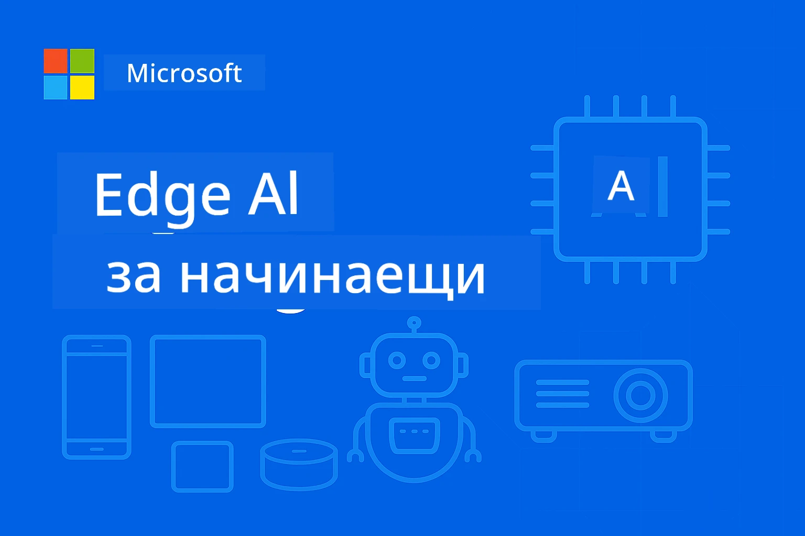

# EdgeAI за начинаещи




[](https://GitHub.com/microsoft/edgeai-for-beginners/graphs/contributors)
[](https://GitHub.com/microsoft/edgeai-for-beginners/issues)
[](https://GitHub.com/microsoft/edgeai-for-beginners/pulls)
[](http://makeapullrequest.com)

[](https://GitHub.com/microsoft/edgeai-for-beginners/watchers)
[](https://GitHub.com/microsoft/edgeai-for-beginners/fork)
[](https://GitHub.com/microsoft/edgeai-for-beginners/stargazers)


[](https://discord.gg/nTYy5BXMWG)

Следвайте тези стъпки, за да започнете с използването на тези ресурси:

1. **Форкнете хранилището**: Кликнете [](https://GitHub.com/microsoft/edgeai-for-beginners/fork)
2. **Клонирайте хранилището**: `git clone https://github.com/microsoft/edgeai-for-beginners.git`
3. [**Присъединете се към Discord на Azure AI Foundry и срещнете експерти и колеги разработчици**](https://discord.com/invite/ByRwuEEgH4)


### 🌐 Поддръжка на множество езици

#### Поддържа се чрез GitHub Action (автоматизирано и винаги актуално)

<!-- CO-OP TRANSLATOR LANGUAGES TABLE START -->
[Арабски](../ar/README.md) | [Бенгалски](../bn/README.md) | [Български](./README.md) | [Бирмански (Мианмар)](../my/README.md) | [Китайски (опростен)](../zh-CN/README.md) | [Китайски (традиционен, Хонг Конг)](../zh-HK/README.md) | [Китайски (традиционен, Макао)](../zh-MO/README.md) | [Китайски (традиционен, Тайван)](../zh-TW/README.md) | [Хърватски](../hr/README.md) | [Чешки](../cs/README.md) | [Датски](../da/README.md) | [Холандски](../nl/README.md) | [Естонски](../et/README.md) | [Фински](../fi/README.md) | [Френски](../fr/README.md) | [Немски](../de/README.md) | [Гръцки](../el/README.md) | [Еврейски](../he/README.md) | [Хинди](../hi/README.md) | [Унгарски](../hu/README.md) | [Индонезийски](../id/README.md) | [Италиански](../it/README.md) | [Японски](../ja/README.md) | [Каннада](../kn/README.md) | [Кхмерски](../km/README.md) | [Корейски](../ko/README.md) | [Литовски](../lt/README.md) | [Малайски](../ms/README.md) | [Малайалам](../ml/README.md) | [Маратхи](../mr/README.md) | [Непалски](../ne/README.md) | [Нигерийски Пиджин](../pcm/README.md) | [Норвежки](../no/README.md) | [Персийски (фарси)](../fa/README.md) | [Полски](../pl/README.md) | [Португалски (Бразилия)](../pt-BR/README.md) | [Португалски (Португалия)](../pt-PT/README.md) | [Пенджаби (Гурумухи)](../pa/README.md) | [Румънски](../ro/README.md) | [Руски](../ru/README.md) | [Сръбски (кирилица)](../sr/README.md) | [Словашки](../sk/README.md) | [Словенски](../sl/README.md) | [Испански](../es/README.md) | [Суахили](../sw/README.md) | [Шведски](../sv/README.md) | [Тагалог (филипински)](../tl/README.md) | [Тамилски](../ta/README.md) | [Телугу](../te/README.md) | [Тайски](../th/README.md) | [Турски](../tr/README.md) | [Украински](../uk/README.md) | [Урду](../ur/README.md) | [Виетнамски](../vi/README.md)

> **Предпочитате да клонирате локално?**
>
> Това хранилище включва преводи на над 50 езика, което значително увеличава размера на изтеглянето. За да клонирате без преводи, използвайте sparse checkout:
>
> **Bash / macOS / Linux:**
> ```bash
> git clone --filter=blob:none --sparse https://github.com/microsoft/edgeai-for-beginners.git
> cd edgeai-for-beginners
> git sparse-checkout set --no-cone '/*' '!translations' '!translated_images'
> ```
>
> **CMD (Windows):**
> ```cmd
> git clone --filter=blob:none --sparse https://github.com/microsoft/edgeai-for-beginners.git
> cd edgeai-for-beginners
> git sparse-checkout set --no-cone "/*" "!translations" "!translated_images"
> ```
>
> Това ви дава всичко необходимо за завършване на курса с много по-бързо изтегляне.
<!-- CO-OP TRANSLATOR LANGUAGES TABLE END -->

**Ако желаете да се добавят допълнителни поддържани езикови преводи, списъкът е [тук](https://github.com/Azure/co-op-translator/blob/main/getting_started/supported-languages.md)**
## Въведение

Добре дошли в **EdgeAI за начинаещи** – вашето цялостно пътешествие в трансформиращия свят на Edge изкуствения интелект. Този курс свързва мощните AI възможности с практическото внедряване в реалния свят на крайни устройства, давайки ви възможност да използвате потенциала на AI директно там, където се генерират данните и трябва да се вземат решения.

### Какво ще овладеете

Този курс ви води от основните концепции до реализация, готова за производство, покривайки:
- **Малки езикови модели (SLMs)**, оптимизирани за внедряване на ръба
- **Оптимизация с оглед на хардуера** на разнообразни платформи
- **Извършване на заключения в реално време** с функции за запазване на поверителността
- **Стратегии за производствено внедряване** в корпоративни приложения

### Защо EdgeAI е важен

Edge AI представлява парадигмен сдвиг, който адресира критични съвременни предизвикателства:
- **Поверителност и сигурност**: обработвайте чувствителни данни локално без излагане в облака
- **Работа в реално време**: елиминирайте забавяне в мрежата за приложения с критично време
- **Икономия на разходи**: намалете разходите за честотна лента и облачни изчисления
- **Устойчиви операции**: поддържайте функциониране при прекъсване на мрежата
- **Съответствие с регулации**: изпълнявайте изисквания за суверенитет на данни

### Edge AI

Edge AI означава изпълнение на AI алгоритми и езикови модели локално върху хардуера, близо до мястото, където се генерират данни, без да се разчита на облачни ресурси за извеждане на изводи. Това намалява забавянето, подобрява поверителността и позволява вземане на решения в реално време.

### Основни принципи:
- **Заключения на устройството**: AI моделите се изпълняват на крайни устройства (телефони, рутери, микроконтролери, индустриални ПК)
- **Възможност за работа офлайн**: функционира без постоянна интернет връзка
- **Ниско забавяне**: незабавни отговори, подходящи за системи в реално време
- **Суверенитет на данните**: държи чувствителните данни локално, подобрявайки сигурността и съответствието

### Малки езикови модели (SLMs)

SLMs като Phi-4, Mistral-7B и Gemma са оптимизирани версии на по-големи LLM модели — обучени или дистилирани за:
- **Намален обем на паметта**: ефективно използване на ограничената памет на крайно устройство
- **По-ниски изчислителни изисквания**: оптимизирани за CPU и графични процесори на ръба
- **По-бързо стартиране**: бърза инициализация за отзивчиви приложения

Те отключват мощни възможности за обработка на естествен език, докато отговарят на ограниченията на:
- **Вградени системи**: IoT устройства и индустриални контролери
- **Мобилни устройства**: смартфони и таблети с офлайн възможности
- **IoT устройства**: сензори и интелигентни устройства с ограничени ресурси
- **Edge сървъри**: локални обработващи единици с ограничени GPU ресурси
- **Персонални компютри**: сценарии на внедряване на настолни и лаптоп устройства

## Модули на курса и навигация

| Модул | Тема | Фокусна област | Ключово съдържание | Ниво | Продължителност |
|--------|-------|----------------|--------------------|--------|-----------------|
| [📖 00 ](./introduction.md) | [Въведение в EdgeAI](./introduction.md) | Основи и контекст | Общ преглед на EdgeAI • Индустриални приложения • Въведение в SLM • Обучителни цели | Начинаещ | 1-2 ч |
| [📚 01](../../Module01) | [Основи на EdgeAI](./Module01/README.md) | Сравнение облак срещу Edge AI | Основи на EdgeAI • Казуси от реалния свят • Ръководство за имплементация • Внедряване на ръба | Начинаещ | 3-4 ч |
| [🧠 02](../../Module02) | [Основи на SLM моделите](./Module02/README.md) | Семейства модели и архитектура | Phi семейство • Qwen семейство • Gemma семейство • BitNET • μModel • Phi-Silica | Начинаещ | 4-5 ч |
| [🚀 03](../../Module03) | [Практика по внедряване на SLM](./Module03/README.md) | Локално и облачно внедряване | Напреднало обучение • Локална среда • Внедряване в облака | Средно ниво | 4-5 ч |
| [⚙️ 04](../../Module04) | [Инструментарий за оптимизация на модели](./Module04/README.md) | Оптимизация на множество платформи | Въведение • Llama.cpp • Microsoft Olive • OpenVINO • Apple MLX • Синтез на работни процеси | Средно ниво | 5-6 ч |
| [🔧 05](../../Module05) | [SLMOps в производство](./Module05/README.md) | Производствени операции | Въведение в SLMOps • Дистилация на модели • Финна настройка • Производствено внедряване | Напреднало | 5-6 ч |
| [🤖 06](../../Module06) | [AI агенти и извикване на функции](./Module06/README.md) | Агенти и MCP | Въведение в агенти • Извикване на функции • Протокол за контекст на модел | Напреднало | 4-5 ч |
| [💻 07](../../Module07) | [Внедряване на платформа](./Module07/README.md) | Примери на множество платформи | AI набор инструменти • Foundry Local • Разработка за Windows | Напреднало | 3-4 ч |
| [🏭 08](../../Module08) | [Foundry Local набор инструменти](./Module08/README.md) | Производствени примери | Примерни приложения (виж по-долу детайли) | Експерт | 8-10 ч |

### 🏭 **Модул 08: Примерни приложения**

- [01: Бърз старт с REST чат](./Module08/samples/01/README.md)
- [02: Интеграция с OpenAI SDK](./Module08/samples/02/README.md)
- [03: Откриване и бенчмаркинг на модели](./Module08/samples/03/README.md)
- [04: Chainlit RAG приложение](./Module08/samples/04/README.md)
- [05: Оркестрация на множество агенти](./Module08/samples/05/README.md)
- [06: Рутер за модели като инструменти](./Module08/samples/06/README.md)
- [07: Пряк API клиент](./Module08/samples/07/README.md)
- [08: Чат приложение за Windows 11](./Module08/samples/08/README.md)
- [09: Разширена система за множество агенти](./Module08/samples/09/README.md)
- [10: Фреймуърк за Foundry инструменти](./Module08/samples/10/README.md)

### 🎓 **Работилница: Практически учебен път**

Пълноценни материали за практическа работилница с реализации, готови за производство:

- **[Ръководство за работилницата](./Workshop/Readme.md)** - пълни учебни цели, резултати и навигация на ресурси
- **Python примери** (6 сесии) - обновени с най-добри практики, обработка на грешки и подробна документация
- **Jupyter тетрадки** (8 интерактивни) - стъпка по стъпка уроци с бенчмаркове и мониторинг на производителността
- **Ръководства за сесии** - подробни markdown ръководства за всяка сесия от работилницата
- **Инструменти за валидиране** - скриптове за проверка на качеството на кода и пускане на бързи тестове

**Какво ще изградите:**
- Локални AI чат приложения с поддръжка на стрийминг
- RAG конвейери с оценка на качеството (RAGAS)
- Инструменти за бенчмаркинг и сравнение на множество модели
- Системи за оркестрация на множество агенти
- Интелигентно маршрутизиране на модели с подбор по задачи

### 🎙️ **Работилница за Agentic: Практически опит - AI подкаст студио**
Създайте AI-задвижван производствен процес за подкасти от нулата! Този интензивен уъркшоп ви учи как да създадете пълна система с множество агенти, която превръща идеи в професионални подкаст епизоди.

**[🎬 Стартирайте Уъркшопа AI Podcast Studio](./WorkshopForAgentic/README.md)**

**Вашата задача**: Стартирайте "Future Bytes" — технологичен подкаст, изцяло захранван от AI агенти, които сами ще изградите. Без облачни зависимости, без разходи за API — всичко работи локално на вашата машина.

**Какво го прави уникален:**
- **🤖 Истинска многoагентна оркестрация** - Създайте специализирани AI агенти, които изследват, пишат и произвеждат аудио  
- **🎯 Пълна производствена верига** - От избор на тема до финално аудио на подкаста  
- **💻 100% локално внедряване** - Използва Ollama и локални модели (Qwen-3-8B) за пълна поверителност и контрол  
- **🎤 Интеграция на текст към реч** - Превръща сценарии в естествено звучащи разговори с много говорещи  
- **✋ Работни процеси с човешка намеса** - Портали за одобрение гарантират качество и автоматизация  

**Обучение в три акта:**

| Акт | Фокус | Ключови умения | Продължителност |
|-----|-------|----------------|-----------------|
| **[Акт 1: Запознайте се с вашите AI помощници](./WorkshopForAgentic/md/01.BuildAIAgentWithSLM.md)** | Създайте първия си AI агент | Интеграция на инструменти • Уеб търсене • Решаване на проблеми • Агентно мислене | 2-3 ч |
| **[Акт 2: Сглобете своя производствен екип](./WorkshopForAgentic/md/02.AIAgentOrchestrationAndWorkflows.md)** | Оркестрация на множество агенти | Координация на екип • Поток на потвърждения • Интерфейс DevUI • Човешки контрол | 3-4 ч |
| **[Акт 3: Опресняване на вашия подкаст](./WorkshopForAgentic/md/03.Multi-SpeakerPodcastGenerationWithVibeVoice.md)** | Генериране на аудио за подкаст | Текст към реч • Синтез на много говорещи • Дългосрочно аудио • Пълна автоматизация | 2-3 ч |

**Използвани технологии:**
- **Microsoft Agent Framework** - Многoагентна оркестрация и координация  
- **Ollama** - Локален AI модел за изпълнение (без облак)  
- **Qwen-3-8B** - Отворен модел за задачи с агенти  
- **API за текст към реч** - Синтез на естествен глас за създаване на подкасти

**Поддръжка на хардуер:**
- ✅ **Режим CPU** - Работи на всякакъв модерен компютър (препоръчително 8GB+ RAM)  
- 🚀 **Ускорение с GPU** - Значително по-бърз извод с NVIDIA/AMD GPU  
- ⚡ **Поддръжка на NPU** - Ускорение с невронни процесори от следващо поколение

**Идеален за:**
- Разработчици, които учат многoагентни AI системи  
- Всеки, който се интересува от AI автоматизация и работни потоци  
- Съдържателни създатели, изследващи AI-подкрепено производство  
- Студенти, изучаващи практични модели на AI оркестрация

**Започнете да изграждате**: [🎙️ Уъркшоп AI Podcast Studio →](./WorkshopForAgentic/README.md)

### 📊 **Обзор на обучителния път**
- **Крайна продължителност**: 36-45 часа  
- **Начинаещи**: Модули 01-02 (7-9 часа)  
- **Средно ниво**: Модули 03-04 (9-11 часа)  
- **Напреднали**: Модули 05-07 (12-15 часа)  
- **Експерти**: Модул 08 (8-10 часа)

## Какво ще създадете

### 🎯 Основни компетенции
- **Гранична AI архитектура**: Проектиране на локални AI системи с облачна интеграция  
- **Оптимизация на модели**: Квантизиране и компресиране за гранично внедряване (85% ускорение, 75% намаление на размер)  
- **Многоплатформено внедряване**: Windows, мобилни, вградени и хибридни облак-край системи  
- **Производствени операции**: Мониторинг, мащабиране и поддръжка на граничен AI в продукция  

### 🏗️ Практически проекти
- **Foundry локални чат приложения**: Нативно приложение за Windows 11 с превключване на модели  
- **Многoагентни системи**: Координатор с експертни агенти за комплексни работни потоци  
- **RAG приложения**: Локална обработка на документи с векторно търсене  
- **Моделни рутери**: Интелигентен подбор между модели според анализ на задачи  
- **API рамки**: Клиенти за продукционна среда с поток и мониторинг на здравето  
- **Кросплатформени инструменти**: Интеграционни модели LangChain/Semantic Kernel  

### 🏢 Приложения в индустрията
**Производство** • **Здравеопазване** • **Автономни превозни средства** • **Умни градове** • **Мобилни приложения**

## Бърз старт

**Препоръчан обучителен път** (общо 20-30 часа):

0. **📖 Въведение** ([Introduction.md](./introduction.md)): Основи на EdgeAI + индустриален контекст + обучителна рамка  
1. **📚 Основи** (Модули 01-02): Концепции EdgeAI + семейства модели SLM  
2. **⚙️ Оптимизация** (Модули 03-04): Внедряване + квантизация  
3. **🚀 Производство** (Модули 05-06): SLMOps + AI агенти + извикване на функции  
4. **💻 Имплементация** (Модули 07-08): Примерни платформи + Foundry Local инструменти

Всеки модул включва теория, практически упражнения и продукционни кодови примери.

## Въздействие върху кариерата

**Технически роли**: Архитект EdgeAI решения • ML инженер (Edge) • IoT AI разработчик • Мобилен AI разработчик  

**Индустриални сектори**: Производство 4.0 • Технологии за здравеопазване • Автономни системи • ФинТек • Потребителска електроника  

**Проекти за портфолио**: Многoагентни системи • RAG приложения за производство • Кросплатформено внедряване • Оптимизация на производителността

## Структура на хранилището

```
edgeai-for-beginners/
├── 📖 introduction.md  # Foundation: EdgeAI Overview & Learning Framework
├── 📚 Module01-04/     # Fundamentals → SLMs → Deployment → Optimization  
├── 🔧 Module05-06/     # SLMOps → AI Agents → Function Calling
├── 💻 Module07/        # Platform Samples (VS Code, Windows, Jetson, Mobile)
├── 🏭 Module08/        # Foundry Local Toolkit + 10 Comprehensive Samples
│   ├── samples/01-06/  # Foundation: REST, SDK, RAG, Agents, Routing
│   └── samples/07-10/  # Advanced: API Client, Windows App, Enterprise Agents, Tools
├── 🌐 translations/    # Multi-language support (8+ languages)
└── 📋 STUDY_GUIDE.md   # Structured learning paths & time allocation
```

## Основни акценти на курса

✅ **Постепенно обучение**: Теория → Практика → Производствено внедряване  
✅ **Реални казуси**: Microsoft, Japan Airlines, корпоративни приложения  
✅ **Практически примери**: Над 50 примера, 10 обширни демота на Foundry Local  
✅ **Фокус върху производителността**: 85% ускорение, 75% намаление на размер  
✅ **Многоплатформеност**: Windows, мобилни, вградени, хибрид облак-край  
✅ **Готово за продукция**: Мониторинг, мащабиране, сигурност, съответствие

📖 **[Наличен учебен план](STUDY_GUIDE.md)**: Структуриран 20-часов обучителен път с насоки за време и самооценка.

---

**EdgeAI представлява бъдещето на внедряването на AI**: локално ориентирано, съобразено с поверителността и ефективно. Овладейте тези умения, за да създавате следващото поколение интелигентни приложения.

## Други курсове

Нашият екип създава и други курсове! Разгледайте:

<!-- CO-OP TRANSLATOR OTHER COURSES START -->
### LangChain
[](https://aka.ms/langchain4j-for-beginners)
[](https://aka.ms/langchainjs-for-beginners?WT.mc_id=m365-94501-dwahlin)
[](https://github.com/microsoft/langchain-for-beginners?WT.mc_id=m365-94501-dwahlin)
---

### Azure / Edge / MCP / Агенти
[](https://github.com/microsoft/AZD-for-beginners?WT.mc_id=academic-105485-koreyst)
[](https://github.com/microsoft/edgeai-for-beginners?WT.mc_id=academic-105485-koreyst)
[](https://github.com/microsoft/mcp-for-beginners?WT.mc_id=academic-105485-koreyst)
[](https://github.com/microsoft/ai-agents-for-beginners?WT.mc_id=academic-105485-koreyst)

---
 
### Серия за генеративен AI
[](https://github.com/microsoft/generative-ai-for-beginners?WT.mc_id=academic-105485-koreyst)
[-9333EA?style=for-the-badge&labelColor=E5E7EB&color=9333EA)](https://github.com/microsoft/Generative-AI-for-beginners-dotnet?WT.mc_id=academic-105485-koreyst)
[-C084FC?style=for-the-badge&labelColor=E5E7EB&color=C084FC)](https://github.com/microsoft/generative-ai-for-beginners-java?WT.mc_id=academic-105485-koreyst)
[-E879F9?style=for-the-badge&labelColor=E5E7EB&color=E879F9)](https://github.com/microsoft/generative-ai-with-javascript?WT.mc_id=academic-105485-koreyst)

---
 
### Основно обучение
[](https://aka.ms/ml-beginners?WT.mc_id=academic-105485-koreyst)
[](https://aka.ms/datascience-beginners?WT.mc_id=academic-105485-koreyst)
[](https://aka.ms/ai-beginners?WT.mc_id=academic-105485-koreyst)
[](https://github.com/microsoft/Security-101?WT.mc_id=academic-96948-sayoung)
[](https://aka.ms/webdev-beginners?WT.mc_id=academic-105485-koreyst)
[](https://aka.ms/iot-beginners?WT.mc_id=academic-105485-koreyst)
[](https://github.com/microsoft/xr-development-for-beginners?WT.mc_id=academic-105485-koreyst)

---
 
### Серия Copilot

[](https://aka.ms/GitHubCopilotAI?WT.mc_id=academic-105485-koreyst)
[](https://github.com/microsoft/mastering-github-copilot-for-dotnet-csharp-developers?WT.mc_id=academic-105485-koreyst)
[](https://github.com/microsoft/CopilotAdventures?WT.mc_id=academic-105485-koreyst)
<!-- CO-OP TRANSLATOR OTHER COURSES END -->

## Получаване на помощ

Ако закъсате или имате въпроси относно създаването на AI приложения, присъединете се към:

[](https://discord.gg/nTYy5BXMWG)

Ако имате обратна връзка за продукта или грешки по време на създаване, посетете:

[](https://aka.ms/foundry/forum)

---

<!-- CO-OP TRANSLATOR DISCLAIMER START -->
**Отказ от отговорност**:  
Този документ е преведен с помощта на AI преводаческа услуга [Co-op Translator](https://github.com/Azure/co-op-translator). Въпреки че се стремим към точност, моля, имайте предвид, че автоматизирани преводи могат да съдържат грешки или неточности. Оригиналният документ на неговия роден език трябва да се счита за авторитетен източник. За критична информация се препоръчва професионален човешки превод. Ние не носим отговорност за каквито и да било недоразумения или погрешни тълкувания, произтичащи от използването на този превод.
<!-- CO-OP TRANSLATOR DISCLAIMER END -->