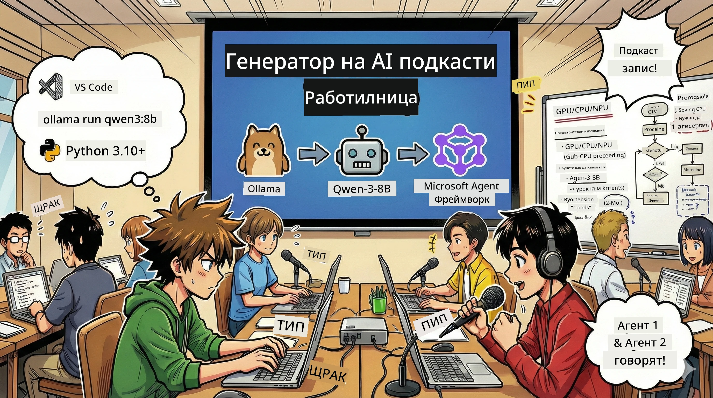
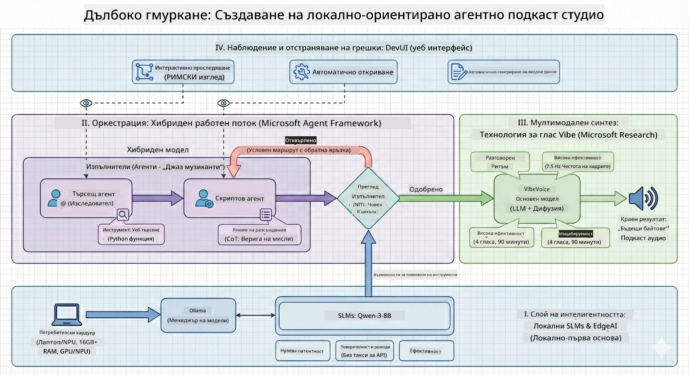

<!--
CO_OP_TRANSLATOR_METADATA:
{
  "original_hash": "f94e745264597bc5d8df967ead2eff97",
  "translation_date": "2026-01-05T10:52:43+00:00",
  "source_file": "WorkshopForAgentic/README.md",
  "language_code": "bg"
}
-->
# 🎙️ Работилница The AI Podcast Studio

> 🌏 [中文版 (Chinese Version)](translation/zh-cn/README.md)



## Вашата мисия

Добре дошли в **The AI Podcast Studio**! Вие сте на път да стартирате собствен технологичен подкаст, наречен "Future Bytes" — но ето обратът: ще изградите екип за продукция, задвижван от изкуствен интелект, който да ви помогне да го създадете. Никакви повече безкрайни часове на проучвания, писане на сценарии и аудио редактиране. Вместо това, ще кодирате своя път към това да станете продуцент на подкаст с AI суперсили.

## Историята

Представете си: Вие и вашите приятели искате да стартирате подкаст за най-готините технологични тенденции, но всички са заети с училище, работа или живота като цяло. Ами ако можете да изградите екип от AI агенти, които да свършат тежката работа? Един агент проучва темите, друг пише увлекателни сценарии, а трети превръща текста в естествено звучащи разговори. Звучи като научна фантастика? Нека го направим реалност.

## Какво ще научите

Към края на тази работилница ще знаете как да:
- 🤖 Стартирате собствен локален AI модел (без разходи за API, без зависимост от облака!)
- 🔧 Създавате специализирани AI агенти, които наистина работят заедно
- 🎬 Създавате пълен производствен процес за подкаст от идеята до аудиото

## Вашето пътешествие: Три акта



Както във всяка добра история, имаме три акта. Всеки един изгражда вашето AI подкаст студио на части:

| Епизод | Вашата задача | Какво се случва | Отключени умения |
|---------|-----------|--------------|----------------|
| **Акт 1** | [Запознайте се с вашите AI асистенти](md/01.BuildAIAgentWithSLM.md) | Откривате как да създадете AI агенти, които могат да чатят, търсят в мрежата и дори да решават проблеми. Помислете за тях като за ваши изследователски стажанти, които никога не спят. | 🎯 Създайте първия си агент<br>🛠️ Накарайте го да има суперсили (инструменти!)<br>🧠 Научете го да мисли<br>🌐 Свържете го с интернет |
| **Акт 2** | [Съберете своя производствен екип](md/02.AIAgentOrchestrationAndWorkflows.md) | Сега става интересно! Ще координирате множество AI агенти да работят заедно като истински подкаст екип. Един проучва, един пише, вие одобрявате — екипната работа прави мечтите реалност. | 🎭 Координирайте множество агенти<br>🔄 Създайте работни потоци за одобрение<br>🖥️ Тествайте с DevUI интерфейс<br>✋ Запазете човека в контрол |
| **Акт 3** | [Дайте живот на вашия подкаст](md/03.Multi-SpeakerPodcastGenerationWithVibeVoice.md) | Финалът! Превърнете текстовите сценарии в реално подкаст аудио с реалистични гласове и естествени разговори. Вашият подкаст "Future Bytes" е готов за пускане! | 🎤 Магията на текст в реч<br>👥 Множество говорещи гласове<br>⏱️ Дълъг аудио формат<br>🚀 Пълна автоматизация |

Всеки акт отключва нови умения. Пропускайте напред ако сте смели, но препоръчваме да следвате историята!

## Изисквания за средата

Тази работилница поддържа различни хардуерни среди:
- **CPU**: Подходящ за тестове и малък мащаб употреба
- **GPU**: Препоръчителен за продукционни среди, значително подобрява скоростта на изчисленията
- **NPU**: Поддържа ускорение чрез невронен процесор от следващо поколение

## Какво ще ви трябва

### Софтуерен списък ✅
- **Python 3.10+** (вашият език за програмиране)
- **Ollama** (пуска AI модели на вашия компютър)
- **VS Code** (вашият код редактор)
- **Python Extension** (прави VS Code по-умен)
- **Git** (за изтегляне на код)

### Хардуерен чеклист 💻
- **Мога ли да го пусна?**: 8GB RAM, 10GB свободно място (работи, но може да е бавно)
- **Идеална конфигурация**: 16GB+ RAM, приличен GPU (гладко плаване!)
- **Имам ли NPU?**: Още по-добре! Представяне от следващо поколение отключено 🚀

## Настройте своето студио 🎬

### Стъпка 1: Заредете Python

Уверете се, че имате Python 3.10 или по-нова версия:

```bash
python --version
# Трябва да показва Python 3.10.x или по-висока версия
```

Нямате Python? Вземете го от [python.org](https://python.org) — безплатен е!

### Стъпка 2: Вземете Ollama (вашият стартиращ AI модел)

Отидете на [ollama.ai](https://ollama.ai) и изтеглете Ollama за вашата операционна система. Помислете за него като за двигателя, който пуска вашите AI модели локално.

Проверете дали е готов:

```bash
ollama --version
```

### Стъпка 3: Изтеглете своя AI мозък 🧠

Време е да вземете модела Qwen-3-8B (като наемате първия си AI асистент):

```bash
ollama pull qwen3:8b
```

*Това може да отнеме няколко минути. Перфектно време за кафе пауза! ☕*

### Стъпка 4: Настройте VS Code

Вземете [Visual Studio Code](https://code.visualstudio.com/), ако още го нямате. Най-добрият код редактор (спорете с мен 😄).

### Стъпка 5: Python разширение

Във VS Code:
1. Натиснете `Ctrl+Shift+X` (или `Cmd+Shift+X` на Mac)
2. Потърсете "Python"
3. Инсталирайте официалното разширение на Microsoft за Python

### Стъпка 6: Готови сте! 🎉

Сериозно, готови сте за старт. Нека създадем малко AI магия!

### Стъпка 7: Инсталирайте Microsoft Agent Framework и свързаните пакети 📦

Инсталирайте всички необходими зависимости за работилницата:

```bash
pip install -r ./Installations/requirements.txt -U
```

*Това ще инсталира Microsoft Agent Framework и всички необходими пакети. Вземете си кафе — първоначалната настройка може да отнеме няколко минути! ☕*

## Инструкции за работилницата

Подробна структура на проекта, стъпки за конфигурация и начини за изпълнение ще бъдат обяснени стъпка по стъпка по време на работилницата.

## Отстраняване на проблеми (когато нещата се объркат) 🔧

### "Ох, изтеглянето на модела отнема безкрайно време!"
**Решение**: Използвайте VPN или конфигурирайте Ollama с огледален източник. Понякога интернет просто ни мрази.

### "Компютърът ми умира! Липсва памет!"
**Решение**: Превключете на по-малък модел или променете настройката `num_ctx`, за да използва по-малко памет. Мислете за това като диета за AI.

### "Мога ли да ускори това с моя GPU?"
**Решение**: Ollama автоматично открива GPU-та! Просто се уверете, че драйверите ви са актуални. Безплатно ускорение! 🏎️

## Допълнителни ресурси (за любопитните) 📚

- [Ollama Docs](https://github.com/ollama/ollama) — Дълбочинно изучаване на локални AI модели
- [Microsoft Agent Framework](https://microsoft.github.io/autogen/) — Научете повече за изграждането на агентски екипи
- [Информация за модела Qwen](https://qwenlm.github.io/) — Запознайте се с мозъка на вашия AI асистент

## Лиценз

MIT License — Създавайте готини неща, споделяйте ги, правете света по-добър! 🌍

## Искате да допринесете?

Намерихте бъг? Имaте идея? Пуснете Issue или PR! Обичаме общността. ✨

---

<!-- CO-OP TRANSLATOR DISCLAIMER START -->
**Отказ от отговорност**:
Този документ е преведен с помощта на AI преводаческа услуга [Co-op Translator](https://github.com/Azure/co-op-translator). Въпреки че се стремим към точност, моля имайте предвид, че автоматизираните преводи могат да съдържат грешки или неточности. Оригиналният документ на неговия роден език трябва да се счита за авторитетен източник. За критична информация се препоръчва професионален човешки превод. Ние не носим отговорност за каквито и да е недоразумения или погрешни тълкувания, произтичащи от използването на този превод.
<!-- CO-OP TRANSLATOR DISCLAIMER END -->