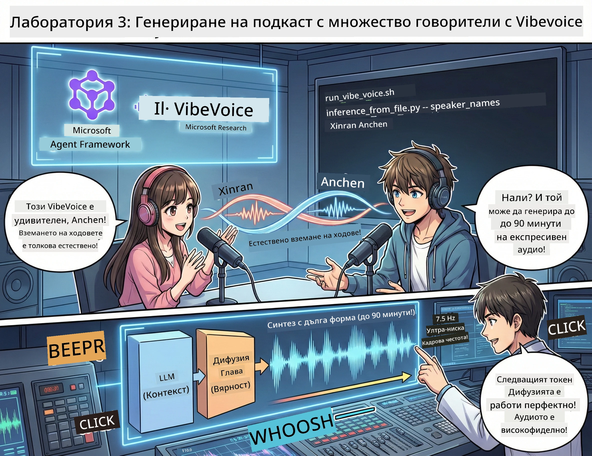

# Акт 3: Оживете подкаста си 🎤



## Гранд Финалът

Изследвали сте теми. Написали сте сценарии. Сега върхът на сладоледа: превръщане на текста в реално аудио за подкаст с реалистични гласове!

Запознайте се с **VibeVoice** — отвореният TTS (текст в реч) проект на Microsoft Research, който създава:
- 🎭 Естествено звучащи разговори
- 👥 Множество говорители (до 4!)
- ⏱️ Дълги аудиозаписи (до 90 минути!)
- 🎵 Изразително представяне (не роботски гласове!)

Това е технологията зад синтетичните подкасти. Хайде да създадем вашия!

## Какво е VibeVoice? (Готиното)

VibeVoice е подаръкът на Microsoft Research за света. Специално проектиран за аудио с подкаст-стил разговори.

### Защо е готино 🔥

* **⏱️ Маратонски сесии**: Генерира до 90 минути непрекъсната реч (пълен епизод на подкаст!)
* **👥 Магия с много говорители**: До 4 различни гласа с постоянни личности
* **⚡ Ужасно ефективен**: Използва ултра-ниска честота на кадрите от 7.5 Hz, за да пести изчислителна мощ
* **🧠 Умен звук**: Комбинира LLM (разбира контекста) с дифузионен модел (създава реалистично аудио)
* **🎭 Естествен поток**: Автоматично управлява редуване, паузи и ритъм на разговора

**Превод**: VibeVoice не просто чете вашия сценарий — той *изпълнява* го като истински хора, които разговарят.

---

## Преди да започнете 🚀

**Какво ви е нужно**:

* 🐍 **Python 3.10+** (вече го имате от Акт 1 & 2)
* 🚀 **uv** (бърз Python package manager — ще го инсталираме)
* 📝 **Вашият сценарий**: Файлът `podcast.txt` от Акт 2 (в `../03.Application/`)

**Полезен съвет**: Тази стъпка изисква добра интернет връзка за изтегляне на предварително обучен модел. Вземете си кафе! ☕

---

## Да започваме! Лесният начин 🎬

Направихме го много прост. Един shell скрипт прави всичко.

### Процесът

1. **Направете го изпълним**:
```bash
chmod +x run_vibe_voice.sh
```

2. **Изпълнете го**:
```bash
./run_vibe_voice.sh
```

3. **Изчакайте магията** (може да отнеме няколко минути при първото изпълнение)

### Какво се случва зад кулисите 🎭

Скриптът е всъщност вашият автоматизиран звуков инженер:

1. **📥 Изтегля VibeVoice**: Клонира официалното репо от GitHub
2. **📦 Инсталира зависимости**: Използва `uv pip` за светкавично бързо инсталиране на пакети
3. **🎬 Генерира аудио**: Стартира скрипта за инференция с:
   * `--model_path`: Предварително обучен модел VibeVoice-7B
   * `--txt_path`: Вашия сценарий `podcast.txt`
   * `--speaker_names`: Определя гласове (по подразбиране Xinran & Anchen)

**Резултат**: Вашият сценарий става истински епизод от подкаст! 🎉

---

## Вашата мисия 🎯

Нека го направим интересно:

### Задача 1: Създайте съдържание
Редактирайте `../03.Application/podcast.txt` с разговор между двама души. Нека е за технологии, хобита, каквото искате! Просто да е разговорно.

**Примерен формат**:
```
Speaker 1: Hey! Did you hear about the new AI model?
Speaker 2: No way! Tell me more!
Speaker 1: It's called...
```

### Задача 2: Генерирайте аудио
Стартирайте скрипта и гледайте как става магията. Първото изпълнение ще отнеме повече (изтегляне на модела).

### Задача 3: Слушайте и анализирайте
- Звучи ли естествено?
- Имат ли говорителите различими гласове?
- Плавно ли е редуването?
- Има ли роботски моменти?

### Задача 4: Експериментирайте (за смелите)
Редактирайте `run_vibe_voice.sh` и променете `--speaker_names`, за да пробвате различни комбинации от гласове. VibeVoice има много предварително обучени гласове!

**Бонус предизвикателство**: Опитайте разговор с 3 говорители! 🎆

---

## Научете повече 📚

* **🏠 Официална страница на проекта**: [VibeVoice Official Site](https://microsoft.github.io/VibeVoice/)
* **🤗 Предварително обучен модел**: [Hugging Face - VibeVoice-7B](https://huggingface.co/vibevoice/VibeVoice-7B)
* **📖 Научна статия**: Потопете се в технологиите (ако ви е интересно)

> **⚠️ Напомняне за отговорно използване на AI**: VibeVoice е мощен инструмент. Използвайте го етично! Не създавайте дипфейкове или подвеждащо съдържание. Създавайте готини неща, които помагат на хората. 🙏

---

## 🏆 Поздравления! Успяхте!

Току-що завършихте целия процес:
1. ✅ **Акт 1**: Създадохте AI агенти с персонализирани инструменти
2. ✅ **Акт 2**: Оркестрирахте мултиагентен работен поток
3. ✅ **Акт 3**: Генерирахте реално аудио за подкаст

**Вече имате**:
- Работещ AI изследователски асистент
- Пълен работен процес за създаване на подкаст
- Истински аудиофайл, който може да споделяте

### Какво следва? 🚀

**Стартирайте своя подкаст!**
- Качете го в подкаст платформи
- Споделете в социалните мрежи
- Итерайте и подобрявайте

**Продължавайте да създавате!**
- Пробвайте различни теми
- Експериментирайте с повече говорители
- Добавете фонова музика
- Създайте уеб интерфейс
- Автоматизирайте целия процес

**Споделете творенията си!**
Тагнете ни! Покажете на света какво създадохте. Революцията в AI подкастите започва с вас. 🎙️

---

**Въпроси? Идеи? Истории за успех?** Споделете ги в чата на работилницата!

**Добре дошли в бъдещето на създаването на съдържание.** 🌟

---

<!-- CO-OP TRANSLATOR DISCLAIMER START -->
**Отказ от отговорност**:
Този документ е преведен с помощта на AI преводаческа услуга [Co-op Translator](https://github.com/Azure/co-op-translator). Въпреки че се стремим към точност, моля, имайте предвид, че автоматизираните преводи могат да съдържат грешки или неточности. Оригиналният документ на неговия роден език трябва да се счита за авторитетен източник. За критична информация се препоръчва професионален човешки превод. Ние не носим отговорност за каквито и да е недоразумения или погрешни интерпретации, произтичащи от използването на този превод.
<!-- CO-OP TRANSLATOR DISCLAIMER END -->