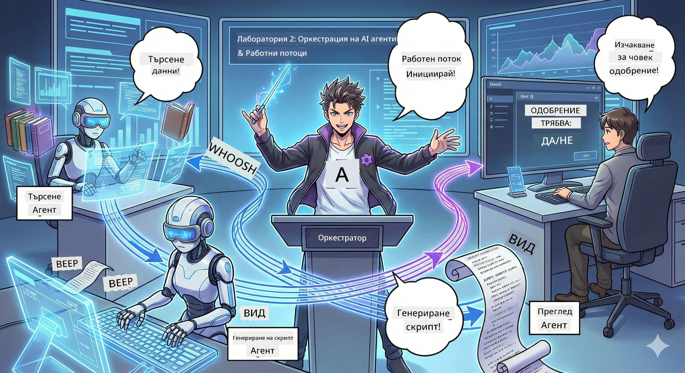

<!--
CO_OP_TRANSLATOR_METADATA:
{
  "original_hash": "2a2578dc4f813ca93ca7952d842a4b59",
  "translation_date": "2026-01-05T15:18:58+00:00",
  "source_file": "WorkshopForAgentic/translation/zh-cn/02.AIAgentOrchestrationAndWorkflows.md",
  "language_code": "bg"
}
-->
# Втора сцена: Сформи своя екип за създаване на подкаст 🎬



## Засилване на сюжета

Алекс (твой AI помощник от първата сцена) е страхотен, но един агент не може да управлява цялото подкаст студио. Ти имаш нужда от *екип*:
- 🔍 **Изследователски агент**: търси в мрежата за свежа информация
- ✍️ **Агент за сценарии**: превръща изследванията в увлекателен диалог
- 👤 **Ти (редакторът)**: одобряваш сценария или го връщаш за пренаписване

Добре дошъл в **Оркестрация на AI агенти** — ти си режисьорът на собствения ти AI екип. Представи си Отмъстителите, но за подкаст продукция.

## Какво е оркестрация на агенти? (опростен вариант)

Представи си, че управляваш ресторант. Ти няма да правиш всичко сам, нали? Имаш:
- 🍳 Готвач, който готви
- 👨‍🍳 Съ-готвач, който подготвя
- 👩‍🍳 Сервитьор, който сервира храната

Оркестрацията на агенти е същата идея, но с AI. Всеки агент е експерт в нещо, ти ги координираш за постигане на голяма цел. Няма един агент, който да е претоварен, а работата се свършва по-бързо.

### Аналогия с банда 🎸

Твоите AI агенти са като банда:
- **Вокалист**: основният агент, който се занимава с клиентските задачи
- **Барабанист**: поддържа ритъма и се грижи за бекенд процесите
- **Басист**: подкрепя всички и осигурява данните
- **Ти (мениджърът на бандата)**: координираш всички!

Без координация? Само шум. С оркестрация? Прекрасна музика.

### Защо това е важно

Един AI агент, който се опитва да върши всичко = прегаряне. Специализирани агенти, които работят заедно = отключена ефективност! 🚀

**Честно казано**: Помниш ли опитите си да изследваш, пишеш и редактираш подкаста сам? Да, беше ужасно. С оркестрацията всеки агент се занимава с това, в което е най-добър. Ти само вземаш окончателното решение.

**Пример от реалния свят**: Ботовете за обслужване на клиенти знаят кога да решават фактурни въпроси, кога технически и кога да викат човек. Това е оркестрация!

## Агенти срещу работни потоци: каква е разликата?

Виж го така:

### 🤖 AI агент = джаз музикант
- **Импровизация** базирана на това, което чува
- **Свободно творчество** с наличните инструменти
- **Мислене** с LLM мозък
- **Адаптиране** към всичко, което му подадеш

### 🎵 Работен поток = класически оркестър
- **Следва партитурата** (предварително дефинирани стъпки)
- **Предвидим** път на изпълнение
- **Координира** множество агенти, хора и системи
- **Структуриран** като рецепта

**Магията**: работните потоци *оркестрират* агентите! Ти създаваш работен поток, който казва на агентите кога да играят. Най-доброто от двата свята. 🎭

## Три начина за координация на твоя AI екип

### 1. 🎯 Централизирано (ти си шефът)

Един главен агент дава команди. Помисли си за това като да управляваш един екип — ти решаваш кой какво и кога да прави.

**Предимства**:
- ✅ Ясно ръководство (без объркване)
- ✅ Последователни решения
- ✅ Лесно за отстраняване на проблеми

**Подходящо за**:
- Рутинг в обслужване на клиенти („Това е запитване за фактури или техническа поддръжка?“)
- Работни потоци за преглед на съдържание („Този сценарий одобрен ли е?“)
- Подкаст продукция (точно това, което изграждаме!)

### 2. 🤝 Децентрализирано (самоорганизация на агентите)

Агентите говорят директно помежду си и решават проблемите заедно като група. Все едно всякакси в един чат, координирани всички.

**Предимства**:
- ✅ Лесна мащабируемост (лесно се добавят още агенти)
- ✅ Без единична точка на отказ
- ✅ Естествено сътрудничество между агенти

**Подходящо за**:
- Изследователски екипи (всеки агент проучва различни източници)
- Брейнсторминг сесии
- Разпределено решаване на проблеми

### 3. 🔀 Хибридно (най-доброто от двата свята)

Ти задаваш общата посока, но агентите имат свобода в организационната работа по задачи. Все едно CEO, който се доверява на своя екип.

**Идеално за**: сложни проекти, които изискват контрол и гъвкавост.

## Microsoft Agent Framework: твоя комплект за оркестрация 🧰

Време е за изграждане! Това ще използваш:

### Строителни блокове

#### 1. 🧱 Изпълнители (твоите работници)
- **Какво са те**: отделни работни единици — могат да бъдат агенти или персонализирана логика
- **Какво правят**: приемат вход, вършат работа, произвеждат изход
- **Мисли за тях като**: работни станции на производствена линия

#### 2. ➡️ Ръбове (връзки)
- **Какво са те**: пътища между изпълнителите
- **Какво правят**: контролират потока на съобщенията („след A следва B“)
- **Мисли за тях като**: стрелки в диаграма на потока

#### 3. 🗺️ Работни потоци (цялостен план)
- **Какво са те**: пълна схема на изпълнители + ръбове
- **Какво правят**: дефинират целия процес от начало до край
- **Мисли за тях като**: твоя производствен план

### Хубави функции, които ще харесаш

**🛡️ Типова сигурност**: съобщенията между агентите се проверяват по типове. Никакви изненади с "Опа, грешен тип данни".

**🔀 Гъвкав маршрут**:
- Условни if-then („ако е одобрен, публикувай; иначе пренапиши“)
- Паралелна обработка (няколко агента работят едновременно)
- Динамично разклоняване (работният поток се адаптира според резултатите)

**🔌 Външни интеграции**:
- Свързване с API-та
- Добавяне на човешки контролни точки (ти одобряваш преди публикуване)
- Изграждане на заявка/отговор поток

**💾 Контролни точки**: запазваш напредъка! Ако нещо се скапе, продължаваш от там, където си спрял.

**🤝 Координация между множество агенти**:
- Изпълнение на агенти поред („A → B → C“)
- Паралелно изпълнение (A + B + C едновременно)
- Предаване между агенти
- Съвместна работа

## Най-добри практики (професионални съвети) 🎯

### 1. Запази модулността
Всеки агент трябва наистина да върши една работа добре. Не прави „супер агент“, който прави всичко — ще съжаляваш при отстраняването на проблеми.

### 2. Планирай за неуспехи
Агентите могат да се объркат. Мрежата може да падне. Изгради обработка на грешки и резервни планове. Бъдещото ти Аз ще ти благодари.

### 3. Наблюдавай всичко
Следи какво правят агентите ти. Използвай DevUI (ще го представим!) за да следиш работните потоци в реално време.

### 4. Оптимизирай размера на съобщенията
Не изпращай огромни файлове между агентите. Поддържай съобщенията леки за по-бърза работа.

### 5. Избери правилния модел
Искаш контрол? Избери централизиран. Искаш мащаб? Избери децентрализиран. Не можеш да решиш? Избери хибриден!

## DevUI: твоя работен отладчик 🔍

### Какво е DevUI?

DevUI е площадката за тестване на твоите агенти и работни потоци. Това е уеб интерфейс, където можеш:
- 👀 Да наблюдаваш изпълнението на работния поток
- 💬 Да чатиш директно с агентите
- 🔍 Да дебъгваш, когато нещо се обърка
- 📊 Да виждаш проследяване и метрики на производителността

> **Важно**: DevUI е само за разработка! Не го ползвай в продукция. Мисли за него като за твоята локална тестова среда.

### Какво го прави страхотен

- **🖥️ Интерактивен уеб UI**: кликай, въвеждай, тествай — няма нужда от команден ред
- **📁 Плъзгане и пускане**: качвай файлове, тествай с различни входове
- **📂 Автоматично откриване**: посочваш папка, той намира всички агенти автоматично
- **📋 Не се нуждае от конфигурационни шаблони**: регистрираш агенти в кода без нужда от папкова структура
- **🔌 Съвместим с OpenAI**: работи с OpenAI SDK (гаранция за съвместимост!)
- **👁️ Вградено проследяване**: виж точно какво правят агентите ти

### Как работи входа

DevUI е интелигентен за входните данни:

- **Тестваш агент?** Ползваш текстово поле и бутон за качване на файл
- **Тестваш работен поток?** UI автоматично генерира полета според очаквания вход на потока

Изглежда като магия, но е просто добър код. ✨

## Твоята задача: изграждане на подкаст студио 🎬

### Задача 1: Създай един агент с DevUI

📂 [01.AgentDevUI](../../../../../WorkshopForAgentic/code/02.Workflow/01.AgentDevUI)

**Предизвикателство**: преди да изградим цял екип, нека тестваме DevUI с един агент: експерт по търсене в мрежата.

**Какво изграждаш**:  
Изследователски агент, който търси в интернет теми за подкаст. Ще тествате през уеб интерфейса на DevUI `http://localhost:8090`.

**Какво ще научиш**:
- 🚀 Как да стартираш агент в DevUI
- 🔍 Тест в реално време на отговорите на агента
- 🛠️ Създаване на персонализирани инструменти (уеб търсене)
- 📊 Включване на проследяване за дебъгване
- 🖥️ Използване на интерактивен уеб UI

**Код**:  
- `agent.py`: твоят SearchAgent с суперсила за уеб търсене  
- Използване на OllamaChatClient за връзка с Qwen  
- Имплементиране на помощната функция `web_search()`  
- Стартиране с `serve()` — отваря DevUI автоматично

**Критерий за успех**:  
Попитай агента си „Какви са горещите теми в AI сферата?” и го гледай как търси в мрежата! 🎉

### Задача 2: Изгради многоагентен работен поток

📂 [02.WorkflowDevUI](../../../../../WorkshopForAgentic/code/02.Workflow/02.WorkflowDevUI)

**Предизвикателство**: сега започва истинското забавление! Изградете цял подкаст производствен работен поток:  
1. 🔍 **Агент за търсене** → изследва твоята тема  
2. ✍️ **Агент за сценарии** → създава диалог между двама водещи (на китайски!)  
3. 👤 **Изпълнител за преглед** → иска твоето одобрение или отхвърляне  
4. 🔄 **Цикъл за повторение** → ако бъде отхвърлено, пренаписва според твоите коментари

**Какво ще научиш**:
- 🧱 Създаване на специализирани агенти за различни задачи  
- 🔗 Свързване на агенти с WorkflowBuilder  
- 🔀 Имплементиране на цикъл за одобрение (човек в цикъла!)  
- 🚦 Условно маршрутизиране (одобрено срещу отхвърлено)  
- 🔧 Персонализирани изпълнители за бизнес логика

**Работен поток**:  
```
SearchAgent → ScriptAgent → ReviewExecutor
                             ↑          ↓ (如果被拒绝)
                             ←─────────
```
  
**Код**:  
- `search_agent/agent.py`: твоят изследователски експерт  
- `generate_script_agent/agent.py`: твоят сценарист (писане на китайски!)  
- `workflow/workflow.py`: магията на оркестрацията тук  
- `main.py`: стартира всичко в DevUI

**Критерий за успех**:  
Въведи тема, прегледай сценария, отхвърли веднъж, за да тестваш цикъла, после одобри! 🎉

### Задача 3: Създай конзолно приложение

📂 [03.Application](../../../../../WorkshopForAgentic/code/02.Workflow/03.Application)

**Предизвикателство**: превърни работния си поток от DevUI в стилно терминално приложение с цветен изход, индикатор за зареждане и запазване на файлове. Това е продукционно готово!

**Какво ще научиш**:  
- ⚡ Как програмистки да стартираш работен поток (без DevUI)  
- 📡 Използване на event-driven архитектура с поточна обработка  
- 🎨 Създаване на красив терминален UI (цветове, въртящи се indikatorи, ленти за прогрес)  
- 💾 Записване на финалния сценарий във файл  
- 🔄 Асинхронна обработка на работни потоци с Python asyncio

**Какво прави**:  
1. Пита те за тема на подкаста  
2. Показва прогрес в реално време („Търсещ агент работи...“)  
3. Цветно показва генерирания сценарий  
4. Иска твоето одобрение  
5. Записва одобрения сценарий във `podcast.txt`

**Код**:  
- `podcast_app.py`: твоето основно приложение с управление на събития  
- `workflow.py`: преизползване на работния поток от задача 2
- Обработка на събития: `AgentRunUpdateEvent`, `RequestInfoEvent`, `WorkflowOutputEvent`
- Използване на ANSI цветове за стил на терминала

**Условия за успех**: Стартирайте приложението, създайте скрипт за подкаст и вижте как се запазва! Вие вече сте изградили истински инструмент. 🚀

## Това, което вече владеете 🏆

След втората сцена, можете:

- ✅ Да оркестрирате множество AI агентa като шеф
- ✅ Да изграждате работни потоци с последователна и условна логика
- ✅ Да добавяте ръчно одобрени контролни точки
- ✅ Да тествате и отстранявате грешки в работни потоци чрез DevUI
- ✅ Да създавате конзолни приложения, готови за производство
- ✅ Да боравите елегантно с грешки в сложни системи
- ✅ Да избирате правилния модел на оркестрация за всеки проект

## Когато нещата се объркат 🔧

### „Работният ми поток е твърде сложен!“
**Решение**: Разделете го на по-малки подпотокове. Всеки поток трябва да върши по една работа. Ако е необходимо, свържете ги заедно.

### „Не мога да следя какво се случва!“
**Решение**: Използвайте контролни точки на работния поток, за да запазите състоянието. Включете проследяване в DevUI, за да видите всяка стъпка.

### „Грешка в един агент срива всичко!“
**Решение**: Добавете граници за грешки. Всеки агент трябва да обработва собствените си провали и да има резервни действия.

### „Твърде бавно е“
**Решение**: Може ли да изпълнявате агенти паралелно? Последователните работни потоци са лесни, но бавни. Потърсете възможности за паралелизация!

## Полезни ресурси 🔗

- [Документация за работни потоци](https://learn.microsoft.com/en-us/agent-framework/user-guide/workflows/overview) — Официално ръководство от Microsoft  
- [Модели на оркестрация](https://www.ibm.com/think/topics/ai-agent-orchestration) — Виждания от IBM  
- [Agent Framework в GitHub](https://github.com/microsoft/agent-framework) — Разгледайте сорс кода  
- [Примери с код](https://github.com/microsoft/agent-framework/tree/main/python/samples) — Крадете модели оттук

---

**Готови ли сте за големия финал?** Вече имате скрипт. Сега да го превърнем в истинско аудио! → [Трета сцена: Закарайте подкаста си към живот](03.Multi-SpeakerPodcastGenerationWithVibeVoice.md) 🎤

---

**Заключили ли сте се? Объркани сте? Вълнувате се?** Споделете в чата на работилницата! Учим заедно. 🚀

---

<!-- CO-OP TRANSLATOR DISCLAIMER START -->
**Отказ от отговорност**:  
Този документ е преведен с помощта на AI преводаческа услуга [Co-op Translator](https://github.com/Azure/co-op-translator). Въпреки че се стремим към точност, моля обърнете внимание, че автоматизираните преводи могат да съдържат грешки или неточности. Оригиналният документ на неговия изходен език трябва да се счита за авторитетен източник. За критична информация се препоръчва професионален човешки превод. Ние не носим отговорност за никакви недоразумения или неправилни тълкувания, произтичащи от използването на този превод.
<!-- CO-OP TRANSLATOR DISCLAIMER END -->