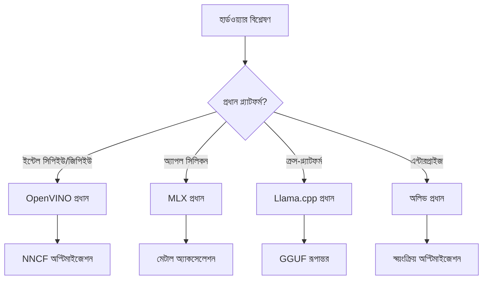
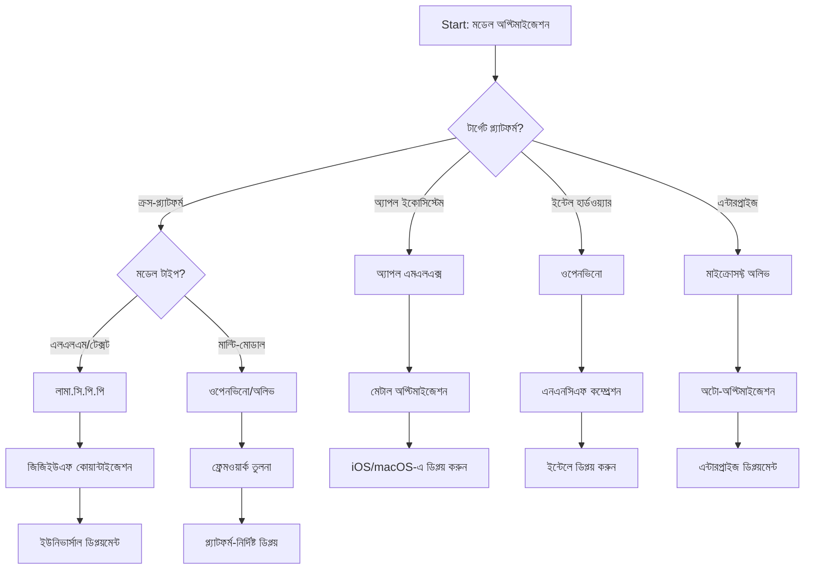
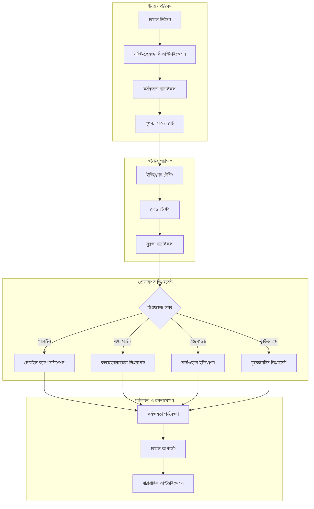

# বিভাগ ৬: এজ এআই উন্নয়ন কর্মপ্রবাহ সংশ্লেষ

## বিষয়বস্তু সূচি
১। [পরিচিতি](#পরিচিতি)
২। [শিক্ষার লক্ষ্য](#শিক্ষার-লক্ষ্য)
৩। [সমন্বিত কর্মপ্রবাহ পর্যালোচনা](#সমন্বিত-কর্মপ্রবাহ-পর্যালোচনা)
৪। [ফ্রেমওয়ার্ক নির্বাচন ম্যাট্রিক্স](#ফ্রেমওয়ার্ক-নির্বাচন-ম্যাট্রিক্স)
৫। [সেরা অনুশীলন সংমিশ্রণ](#সেরা-অনুশীলন-সংমিশ্রণ)
৬। [প্রতিষ্ঠাপন কৌশল নির্দেশিকা](#প্রতিস্থাপনের-কৌশল-নির্দেশিকা)
৭। [কার্যক্ষমতা অপ্টিমাইজেশন কর্মপ্রবাহ](#কার্যক্ষমতা-অপ্টিমাইজেশন-কর্মপ্রবাহ)
৮। [প্রোডাকশন প্রস্তুতি চেকলিস্ট](#প্রোডাকশন-প্রস্তুতি-চেকলিস্ট)
৯। [সমস্যা সমাধান এবং পর্যবেক্ষণ](#সমস্যা-সমাধান-এবং-পর্যবেক্ষণ)
১০। [আপনার এজ এআই পাইপলাইনের ভবিষ্যৎ-রক্ষার ব্যবস্থা](#আপনার-এজ-এআই-পাইপলাইন-ভবিষ্যত-রক্ষা)

## পরিচিতি

এজ এআই উন্নয়নের জন্য একাধিক অপ্টিমাইজেশন ফ্রেমওয়ার্ক, প্রতিষ্ঠাপন কৌশল এবং হার্ডওয়্যার বিবেচনার বিষয়ে এক গভীর দক্ষতা প্রয়োজন। এই বিস্তৃত সংমিশ্রণ লামা.সি.পি.পি, মাইক্রোসফট অলিভ, ওপেনভিআইএনও এবং অ্যাপল এমএলএক্স থেকে জ্ঞান নিয়ে একটি সমন্বিত কর্মপ্রবাহ তৈরি করেছে যা দক্ষতা সর্বাধিক করে, গুণগতমান বজায় রাখে এবং সফল প্রোডাকশন প্রতিষ্ঠাপনের নিশ্চয়তা দেয়।

পুরো এই কোর্সে, আমরা প্রতিটি অপ্টিমাইজেশন ফ্রেমওয়ার্ক আলাদাভাবে পরীক্ষা করেছি, যেগুলোর নিজস্ব শক্তি এবং বিশেষায়িত ব্যবহার ক্ষেত্র রয়েছে। তবে বাস্তব জীবনের এজ এআই প্রকল্পগুলো প্রায়ই একটি ফ্রেমওয়ার্কের বিভিন্ন কৌশল একত্রিত করা বা নির্দিষ্ট সীমাবদ্ধতা ও প্রয়োজনের জন্য সর্বোত্তম ফলাফল আনার কৌশলগত সিদ্ধান্ত নেওয়ার প্রয়োজন হয়।

এই বিভাগটি সমস্ত ফ্রেমওয়ার্ক থেকে সম্মিলিত জ্ঞানকে ব্যবহারযোগ্য কর্মপ্রবাহ, সিদ্ধান্ত নেয়ার গাছ এবং সেরা অনুশীলনে পরিণত করে, যা আপনাকে দক্ষতা এবং কার্যকারিতার মাধ্যমে উৎপাদন-সক্ষম এজ এআই সমাধান তৈরিতে সহায়তা করবে। আপনি যেই হার্ডওয়্যার প্ল্যাটফর্মে অপ্টিমাইজ করছেন, তা মোবাইল ডিভাইস, এমবেডেড সিস্টেম বা এজ সার্ভার হোক, এই নির্দেশিকা পুরো উন্নয়ন জীবনচক্র জুড়ে তথ্যপূর্ণ সিদ্ধান্ত নিতে কৌশলগত কাঠামো প্রদান করে।

## শিক্ষার লক্ষ্য

এই বিভাগ শেষ করার পর আপনি সক্ষম হবেন:

### কৌশলগত সিদ্ধান্ত গ্রহণ
- **প্রকল্পের প্রয়োজনীয়তা, হার্ডওয়্যার সীমাবদ্ধতা ও প্রতিষ্ঠাপন পরিস্থিতির ওপর ভিত্তি করে** সর্বোত্তম অপ্টিমাইজেশন ফ্রেমওয়ার্ক মূল্যায়ন ও নির্বাচন করা
- **বহু অপ্টিমাইজেশন কৌশল সমন্বিত সম্পূর্ণ কর্মপ্রবাহ ডিজাইন করা** সর্বোচ্চ দক্ষতার জন্য
- **মডেলের সঠিকতা, ইনফারেন্স গতি, মেমরি ব্যবহার এবং প্রতিষ্ঠাপন জটিলতার মধ্যে** লেনদেন-পর্যালোচনা করা বিভিন্ন ফ্রেমওয়ার্কে

### কর্মপ্রবাহ একীকরণ
- **বহু অপ্টিমাইজেশন ফ্রেমওয়ার্কের শক্তি কাজে লাগিয়ে** সমন্বিত উন্নয়ন পাইপলাইন বাস্তবায়ন করা
- **বিভিন্ন পরিবেশে অবিচ্ছিন্ন মডেল অপ্টিমাইজেশন ও প্রতিষ্ঠাপনের জন্য** পুনরুৎপাদনযোগ্য কর্মপ্রবাহ তৈরি করা
- **গুণগতমান রক্ষা ও যাচাইকরণ প্রক্রিয়া প্রতিষ্ঠা করা** নিশ্চিত করার জন্য অপ্টিমাইজড মডেলগুলি প্রোডাকশন প্রয়োজনীয়তা পূরণ করে

### কার্যক্ষমতা অপ্টিমাইজেশন
- **পরিমিত অপ্টিমাইজেশন কৌশল প্রয়োগ করা** কোয়ান্টাইজেশন, প্রুনিং এবং হার্ডওয়্যার-নির্দিষ্ট গতি বাড়ানোর প্রযুক্তি ব্যবহার করে
- **বিভিন্ন অপ্টিমাইজেশন স্তর এবং প্রতিষ্ঠাপন লক্ষ্যে** মডেল পারফরম্যান্স পর্যবেক্ষণ এবং বেঞ্চমার্ক করা
- **সিপিইউ, জিপিইউ, এনপিইউ এবং বিশেষায়িত এজ অ্যাক্সেলেটর সহ নির্দিষ্ট হার্ডওয়্যার প্ল্যাটফর্মের জন্য** অপ্টিমাইজ করা

### প্রোডাকশন প্রতিষ্ঠাপন
- **বহু মডেল ফরম্যাট এবং ইনফারেন্স ইঞ্জিন সমর্থনকারী স্কেলযোগ্য প্রতিষ্ঠান আর্কিটেকচার ডিজাইন করা**
- **প্রোডাকশন পরিবেশে এজ এআই অ্যাপ্লিকেশনগুলোর জন্য পর্যবেক্ষণ এবং দৃশ্যমানতা বাস্তবায়ন করা**
- **মডেল আপডেট, পারফরমেন্স মনিটরিং এবং সিস্টেম অপ্টিমাইজেশনের জন্য রক্ষণাবেক্ষণ কর্মপ্রবাহ প্রতিষ্ঠা করা**

### ক্রস-প্ল্যাটফর্ম উৎকর্ষতা
- **বিভিন্ন হার্ডওয়্যার প্ল্যাটফর্মে অপ্টিমাইজড মডেল স্থাপন করা** অবিচ্ছিন্ন কার্যক্ষমতা বজায় রেখে
- **উইন্ডোজ, ম্যাকওএস, লিনাক্স, মোবাইল এবং এমবেডেড সিস্টেমের জন্য প্ল্যাটফর্ম-নির্দিষ্ট অপ্টিমাইজেশন পরিচালনা করা**
- **বিভিন্ন এজ পরিবেশে নির্বিঘ্ন প্রতিষ্ঠাপনের জন্য অবজেক্টিভ স্তর তৈরি করা**

## সমন্বিত কর্মপ্রবাহ পর্যালোচনা

### ধাপ ১: প্রয়োজনীয়তা বিশ্লেষণ এবং ফ্রেমওয়ার্ক নির্বাচন

সফল এজ এআই প্রতিষ্ঠাপনের ভিত্তি শুরু হয় পূর্ণাঙ্গ প্রয়োজনীয়তা বিশ্লেষণ থেকে যা ফ্রেমওয়ার্ক নির্বাচন ও অপ্টিমাইজেশন কৌশল নির্ধারণ করে।

#### ১.১ হার্ডওয়্যার মূল্যায়ন


**প্রধান বিবেচ্য বিষয়:**
- **সিপিইউ স্থাপত্য**: x86, এআরএম, অ্যাপল সিলিকন সক্ষমতা
- **অ্যাক্সেলেটর উপলব্ধতা**: জিপিইউ, এনপিইউ, ভিপিইউ, বিশেষায়িত এআই চিপ
- **মেমরি সীমাবদ্ধতা**: র্যাম সীমা, স্টোরেজ ক্ষমতা
- **পাওয়ার বাজেট**: ব্যাটারি জীবন, তাপীয় সীমাবদ্ধতা
- **কানেক্টিভিটি**: অফলাইন প্রয়োজন, ব্যান্ডউইথ সীমাবদ্ধতা

#### ১.২ অ্যাপ্লিকেশন প্রয়োজনীয়তা ম্যাট্রিক্স

| প্রয়োজনীয়তা | Llama.cpp | মাইক্রোসফট অলিভ | ওপেনভিআইএনও | অ্যাপল এমএলএক্স |
|-------------|-----------|-----------------|----------|-----------|
| ক্রস-প্ল্যাটফর্ম | ✅ চমৎকার | ⚡ ভালো | ⚡ ভালো | ❌ শুধুমাত্র অ্যাপল |
| エন্টারপ্রাইজ ইন্টিগ্রেশন | ⚡ বেসিক | ✅ চমৎকার | ✅ চমৎকার | ⚡ সীমিত |
| মোবাইল প্রতিষ্ঠাপন | ✅ চমৎকার | ⚡ ভালো | ⚡ ভালো | ✅ আইওএস চমৎকার |
| বাস্তব-সময় ইনফারেন্স | ✅ চমৎকার | ✅ চমৎকার | ✅ চমৎকার | ✅ চমৎকার |
| মডেল বৈচিত্র্য | ✅ এলএলএম ফোকাস | ✅ সব মডেল | ✅ সব মডেল | ✅ এলএলএম ফোকাস |
| ব্যবহার সহজতা | ✅ সরল | ✅ স্বয়ংক্রিয় | ⚡ মাঝারি | ✅ সরল |

### ধাপ ২: মডেল প্রস্তুতি ও অপ্টিমাইজেশন

#### ২.১ সার্বজনীন মডেল মূল্যায়ন পাইপলাইন

```python
# ইউনিভার্সাল মডেল মূল্যায়ন কাঠামো
class EdgeAIModelAssessment:
    def __init__(self, model_path, target_hardware):
        self.model_path = model_path
        self.target_hardware = target_hardware
        self.optimization_frameworks = []
        
    def assess_model_characteristics(self):
        """Analyze model size, architecture, and complexity"""
        return {
            'model_size': self.get_model_size(),
            'parameter_count': self.get_parameter_count(),
            'architecture_type': self.detect_architecture(),
            'quantization_compatibility': self.check_quantization_support()
        }
    
    def recommend_optimization_strategy(self):
        """Recommend optimal frameworks and techniques"""
        characteristics = self.assess_model_characteristics()
        
        if self.target_hardware.startswith('apple'):
            return self.mlx_optimization_strategy(characteristics)
        elif self.target_hardware.startswith('intel'):
            return self.openvino_optimization_strategy(characteristics)
        elif characteristics['model_size'] > 7_000_000_000:  # ৭বি+ প্যারামিটারসমূহ
            return self.enterprise_optimization_strategy(characteristics)
        else:
            return self.lightweight_optimization_strategy(characteristics)
```

#### ২.২ বহুফ্রেমওয়ার্ক অপ্টিমাইজেশন পাইপলাইন

**ক্রমিক অপ্টিমাইজেশন পদ্ধতি:**
১। **প্রাথমিক রূপান্তর**: মধ্যবর্তী ফরম্যাটে রূপান্তর (সম্ভব হলে ONNX)
২। **ফ্রেমওয়ার্ক-নির্দিষ্ট অপ্টিমাইজেশন**: বিশেষায়িত কৌশল প্রয়োগ
৩। **ক্রস-ভ্যালিডেশন**: লক্ষ্য প্ল্যাটফর্মে কার্যক্ষমতা যাচাই
৪। **চূড়ান্ত প্যাকেজিং**: প্রতিষ্ঠাপনের জন্য প্রস্তুতি

```bash
# মাল্টি-ফ্রেমওয়ার্ক অপ্টিমাইজেশন স্ক্রিপ্ট
#!/bin/bash

MODEL_NAME="phi-3-mini"
BASE_MODEL="microsoft/Phi-3-mini-4k-instruct"

# ধাপ ১: ONNX রূপান্তর (সর্বজনীন)
python convert_to_onnx.py --model $BASE_MODEL --output models/onnx/

# ধাপ ২: প্ল্যাটফর্ম-নির্দিষ্ট অপ্টিমাইজেশন
if [[ "$TARGET_PLATFORM" == "intel" ]]; then
    # OpenVINO অপ্টিমাইজেশন
    python optimize_openvino.py --input models/onnx/ --output models/openvino/
elif [[ "$TARGET_PLATFORM" == "apple" ]]; then
    # MLX অপ্টিমাইজেশন
    python optimize_mlx.py --input $BASE_MODEL --output models/mlx/
elif [[ "$TARGET_PLATFORM" == "cross" ]]; then
    # Llama.cpp অপ্টিমাইজেশন
    python convert_to_gguf.py --input models/onnx/ --output models/gguf/
fi

# ধাপ ৩: যাচাই
python validate_optimization.py --original $BASE_MODEL --optimized models/$TARGET_PLATFORM/
```

### ধাপ ৩: কার্যক্ষমতা যাচাইকরণ ও বেঞ্চমার্কিং

#### ৩.১ ব্যাপক বেঞ্চমার্কিং ফ্রেমওয়ার্ক

```python
class EdgeAIBenchmark:
    def __init__(self, optimized_models):
        self.models = optimized_models
        self.metrics = {
            'inference_time': [],
            'memory_usage': [],
            'accuracy_score': [],
            'throughput': [],
            'energy_consumption': []
        }
    
    def run_comprehensive_benchmark(self):
        """Execute standardized benchmarks across all optimized models"""
        test_inputs = self.generate_test_inputs()
        
        for model_framework, model_path in self.models.items():
            print(f"Benchmarking {model_framework}...")
            
            # লেটেন্সি পরীক্ষা
            latency = self.measure_inference_latency(model_path, test_inputs)
            
            # মেমরি প্রোফাইলিং
            memory = self.profile_memory_usage(model_path)
            
            # নির্ভুলতা যাচাই
            accuracy = self.validate_model_accuracy(model_path, test_inputs)
            
            # থ্রুপুট বিশ্লেষণ
            throughput = self.measure_throughput(model_path)
            
            self.record_metrics(model_framework, latency, memory, accuracy, throughput)
    
    def generate_optimization_report(self):
        """Create comprehensive comparison report"""
        report = {
            'recommendations': self.analyze_performance_trade_offs(),
            'deployment_guidance': self.generate_deployment_recommendations(),
            'monitoring_requirements': self.define_monitoring_metrics()
        }
        return report
```

## ফ্রেমওয়ার্ক নির্বাচন ম্যাট্রিক্স

### ফ্রেমওয়ার্ক নির্বাচন জন্য সিদ্ধান্ত গাছ



### ব্যাপক নির্বাচন মানদণ্ড

#### ১. প্রধান ব্যবহার কেসের সাথে সঙ্গতি

**বৃহৎ ভাষা মডেল (LLMs):**
- **Llama.cpp**: সিপিইউ-কেন্দ্রিক, ক্রস-প্ল্যাটফর্ম প্রতিষ্ঠাপনের জন্য সেরা
- **Apple MLX**: অ্যাপল সিলিকনের জন্য সর্বোত্তম, ঐক্যবদ্ধ মেমরি সহ
- **OpenVINO**: ইন্টেল হার্ডওয়্যারের জন্য চমৎকার, এনএনসিএফ অপ্টিমাইজেশন সহ
- **Microsoft Olive**: স্বয়ংক্রিয়করণ সহ এন্টারপ্রাইজ ওয়ার্কফ্লোর জন্য আদর্শ

**বহুমাধ্যমিক মডেল:**
- **OpenVINO**: ভিশন, অডিও এবং টেক্সটের জন্য ব্যাপক সমর্থন
- **Microsoft Olive**: জটিল পাইপলাইনের জন্য এন্টারপ্রাইজ-গ্রেড অপ্টিমাইজেশন
- **Llama.cpp**: শুধুমাত্র টেক্সট-ভিত্তিক মডেল পর্যন্ত সীমাবদ্ধ
- **Apple MLX**: বহুমাধ্যমিক অ্যাপ্লিকেশনগুলোর জন্য বৃদ্ধি পাচ্ছে সমর্থন

#### ২. হার্ডওয়্যার প্ল্যাটফর্ম ম্যাট্রিক্স

| প্ল্যাটফর্ম | মূল ফ্রেমওয়ার্ক | দ্বিতীয় বিকল্প | বিশেষায়িত বৈশিষ্ট্য |
|----------|------------------|------------------|---------------------|
| ইন্টেল সিপিইউ/জিপিইউ | OpenVINO | Microsoft Olive | এনএনসিএফ কম্প্রেশন, ইন্টেল অপ্টিমাইজেশন |
| এনভিডিয়া জিপিইউ | Microsoft Olive | OpenVINO | CUDA গতি বৃদ্ধি, এন্টারপ্রাইজ ফিচার |
| অ্যাপল সিলিকন | Apple MLX | Llama.cpp | মেটাল শেডার্স, ঐক্যবদ্ধ মেমরি |
| এআরএম মোবাইল | Llama.cpp | OpenVINO | ক্রস-প্ল্যাটফর্ম, ন্যুনতম নির্ভরশীলতা |
| এজ টিপিইউ | OpenVINO | Microsoft Olive | বিশেষায়িত অ্যাক্সেলেটর সমর্থন |
| এম্বেডেড এআরএম | Llama.cpp | OpenVINO | ন্যূনতম ফুঁটপ্রিন্ট, কার্যকর ইনফারেন্স |

#### ৩. উন্নয়ন কর্মপ্রবাহের পছন্দ

**দ্রুত প্রোটোটাইপিং:**
১। **Llama.cpp**: দ্রুততম সেটআপ, তাৎক্ষণিক ফলাফল
২। **Apple MLX**: সরল পাইথন এপিআই, দ্রুত পুনরাবৃত্তি
৩। **Microsoft Olive**: স্বয়ংক্রিয় অপ্টিমাইজেশন, ন্যূনতম কনফিগারেশন
৪। **OpenVINO**: বেশি জটিল সেটআপ, ব্যাপক বৈশিষ্ট্য

**এন্টারপ্রাইজ প্রোডাকশন:**
১। **Microsoft Olive**: এন্টারপ্রাইজ বৈশিষ্ট্য, আজুর ইন্টিগ্রেশন
২। **OpenVINO**: ইন্টেল ইকোসিস্টেম, ব্যাপক টুলস
৩। **Apple MLX**: অ্যাপল-নির্দিষ্ট এন্টারপ্রাইজ অ্যাপ্লিকেশন
৪। **Llama.cpp**: সরল প্রতিষ্ঠাপন, সীমিত এন্টারপ্রাইজ বৈশিষ্ট্য

## সেরা অনুশীলন সংমিশ্রণ

### সার্বজনীন অপ্টিমাইজেশন নীতি

#### ১. প্রগ্রেসিভ অপ্টিমাইজেশন কৌশল

```python
class ProgressiveOptimization:
    def __init__(self, base_model):
        self.base_model = base_model
        self.optimization_stages = [
            'baseline_measurement',
            'format_conversion',
            'quantization_optimization',
            'hardware_acceleration',
            'production_validation'
        ]
    
    def execute_progressive_optimization(self):
        """Apply optimization techniques incrementally"""
        
        # স্টেজ ১: বেসলাইন পরিমাপ
        baseline_metrics = self.measure_baseline_performance()
        
        # স্টেজ ২: ফরম্যাট রূপান্তর
        converted_model = self.convert_to_optimal_format()
        conversion_metrics = self.measure_performance(converted_model)
        
        # স্টেজ ৩: কোয়ান্টাইজেশন
        quantized_model = self.apply_quantization(converted_model)
        quantization_metrics = self.measure_performance(quantized_model)
        
        # স্টেজ ৪: হার্ডওয়্যার ত্বরান্বিতকরণ
        accelerated_model = self.enable_hardware_acceleration(quantized_model)
        acceleration_metrics = self.measure_performance(accelerated_model)
        
        # স্টেজ ৫: যাচাই
        production_ready = self.validate_for_production(accelerated_model)
        
        return self.compile_optimization_report(
            baseline_metrics, conversion_metrics, 
            quantization_metrics, acceleration_metrics
        )
```

#### ২. গুণগতমানের গেট বাস্তবায়ন

**সঠিকতা রক্ষণাবেক্ষণ গেট:**
- আসল মডেল সঠিকতার >৯৫% বজায় রাখা
- প্রতিনিধিত্বমূলক টেস্ট ডেটাসেটের বিরুদ্ধে যাচাইকরণ
- প্রোডাকশন যাচাইকরণের জন্য এ/বি টেস্টিং বাস্তবায়ন

**কার্যক্ষমতা উন্নতি গেট:**
- ন্যূনতম ২ গুণ গতি বৃদ্ধি অর্জন
- মেমরি ফুঁটপ্রিন্ট কমানো অন্তত ৫০%
- ইনফারেন্স সময়ের সামঞ্জস্য যাচাই

**প্রোডাকশন প্রস্তুতি গেট:**
- লোডের অধীনে স্ট্রেস টেস্টে উত্তীর্ণ হওয়া
- স্থিতিশীল কর্মক্ষমতা প্রদর্শন সময়ের ওপর
- নিরাপত্তা এবং গোপনীয়তা প্রয়োজনীয়তা যাচাই

### ফ্রেমওয়ার্ক-নির্দিষ্ট সেরা অনুশীলন সংমিশ্রণ

#### ১. কোয়ান্টাইজেশন কৌশল সংমিশ্রণ

```python
# একীভূত পরিমাপ পদ্ধতি
class UnifiedQuantizationStrategy:
    def __init__(self, model, target_platform):
        self.model = model
        self.platform = target_platform
        
    def select_optimal_quantization(self):
        """Choose best quantization based on platform and requirements"""
        
        if self.platform == 'apple_silicon':
            return self.mlx_quantization_strategy()
        elif self.platform == 'intel_hardware':
            return self.openvino_quantization_strategy()
        elif self.platform == 'cross_platform':
            return self.llamacpp_quantization_strategy()
        else:
            return self.olive_quantization_strategy()
    
    def mlx_quantization_strategy(self):
        """Apple MLX-specific quantization"""
        return {
            'method': 'mlx_quantize',
            'precision': 'int4',
            'group_size': 64,
            'optimization_target': 'unified_memory'
        }
    
    def openvino_quantization_strategy(self):
        """OpenVINO NNCF quantization"""
        return {
            'method': 'nncf_quantize',
            'precision': 'int8',
            'calibration_method': 'post_training',
            'optimization_target': 'intel_hardware'
        }
```

#### ২. হার্ডওয়্যার অ্যাক্সেলারেশন অপ্টিমাইজেশন

**সিপিইউ অপ্টিমাইজেশন সংমিশ্রণ:**
- **SIMD নির্দেশাবলী**: ফ্রেমওয়ার্ক জুড়ে অপ্টিমাইজড কার্নেল ব্যবহার
- **মেমরি ব্যান্ডউইথ**: ক্যাশ কার্যকারিতার জন্য ডেটা বিন্যাস অপ্টিমাইজেশন
- **থ্রেডিং**: সম্পদের সীমাবদ্ধতার সঙ্গে সমান্তরালতা সমন্বয়

**জিপিইউ অ্যাক্সেলারেশন সেরা অনুশীলন:**
- **ব্যাচ প্রক্রিয়াকরণ**: যথাযথ ব্যাচ সাইজ দিয়ে থ্রুপুট সর্বাধিক করা
- **মেমরি ব্যবস্থাপনা**: জিপিইউ মেমরি বরাদ্দ এবং স্থানান্তর অপ্টিমাইজ করা
- **প্রিসিশন**: উন্নত কর্মক্ষমতার জন্য FP16 ব্যবহার যেখানে সম্ভব

**এনপিইউ/বিশেষায়িত অ্যাক্সেলারেটর অপ্টিমাইজেশন:**
- **মডেল আর্কিটেকচার**: অ্যাক্সেলারের সক্ষমতার সঙ্গে সামঞ্জস্য নিশ্চিত করা
- **ডেটা ফ্লো**: ইনপুট/আউটপুট পাইপলাইনগুলো অ্যাক্সেলারেটরের জন্য অপ্টিমাইজ করা
- **ব্যাকআপ কৌশল**: অপারেশনসমূহের জন্য সিপিইউ ব্যাকআপ বাস্তবায়ন করা যা সমর্থন না করে

## প্রতিস্থাপনের কৌশল নির্দেশিকা

### সার্বজনীন প্রতিষ্ঠাপন আর্কিটেকচার



### প্ল্যাটফর্ম-নির্দিষ্ট প্রতিষ্ঠাপন রূপরেখা

#### ১. মোবাইল প্রতিষ্ঠাপন কৌশল

```yaml
# Mobile Deployment Configuration
mobile_deployment:
  ios:
    framework: apple_mlx
    optimization:
      quantization: int4
      memory_mapping: true
      background_execution: limited
    packaging:
      format: mlx
      bundle_size: <50MB
      
  android:
    framework: llama_cpp
    optimization:
      quantization: q4_k_m
      threading: android_optimized
      memory_management: conservative
    packaging:
      format: gguf
      apk_size: <100MB
      
  cross_platform:
    framework: onnx_runtime
    optimization:
      quantization: int8
      execution_provider: cpu
    packaging:
      format: onnx
      shared_libraries: minimal
```

#### ২. এজ সার্ভার প্রতিষ্ঠাপন

```yaml
# Edge Server Deployment Configuration
edge_server:
  intel_based:
    framework: openvino
    optimization:
      quantization: int8
      acceleration: cpu_gpu_auto
      batch_processing: dynamic
    deployment:
      container: openvino_runtime
      orchestration: kubernetes
      scaling: horizontal
      
  nvidia_based:
    framework: microsoft_olive
    optimization:
      quantization: int4
      acceleration: cuda
      tensor_parallelism: true
    deployment:
      container: nvidia_triton
      orchestration: kubernetes
      scaling: gpu_aware
```

### কনটেইনারাইজেশন সেরা অনুশীলন

```dockerfile
# Multi-Framework Edge AI Container
FROM ubuntu:22.04 as base

# Install common dependencies
RUN apt-get update && apt-get install -y \
    python3 \
    python3-pip \
    build-essential \
    cmake \
    && rm -rf /var/lib/apt/lists/*

# Framework-specific stages
FROM base as openvino
RUN pip install openvino nncf optimum[intel]

FROM base as llamacpp
RUN git clone https://github.com/ggerganov/llama.cpp.git \
    && cd llama.cpp && make LLAMA_OPENBLAS=1

FROM base as olive
RUN pip install olive-ai[auto-opt] onnxruntime-genai

# Production stage with selected framework
FROM openvino as production
COPY models/ /app/models/
COPY src/ /app/src/
WORKDIR /app

EXPOSE 8080
CMD ["python3", "src/inference_server.py"]
```

## কার্যক্ষমতা অপ্টিমাইজেশন কর্মপ্রবাহ

### পদ্ধতিগত কার্যক্ষমতা টিউনিং

#### ১. কার্যক্ষমতা প্রোফাইলিং পাইপলাইন

```python
class EdgeAIPerformanceProfiler:
    def __init__(self, model_path, framework):
        self.model_path = model_path
        self.framework = framework
        self.profiling_results = {}
    
    def comprehensive_profiling(self):
        """Execute comprehensive performance analysis"""
        
        # CPU প্রোফাইলিং
        cpu_profile = self.profile_cpu_usage()
        
        # মেমরি প্রোফাইলিং
        memory_profile = self.profile_memory_usage()
        
        # ইনফারেন্স লেটেন্সি
        latency_profile = self.profile_inference_latency()
        
        # থ্রুপুট বিশ্লেষণ
        throughput_profile = self.profile_throughput()
        
        # শক্তি খরচ (যেখানেই উপলব্ধ)
        energy_profile = self.profile_energy_consumption()
        
        return self.compile_performance_report(
            cpu_profile, memory_profile, latency_profile,
            throughput_profile, energy_profile
        )
    
    def identify_bottlenecks(self):
        """Automatically identify performance bottlenecks"""
        bottlenecks = []
        
        if self.profiling_results['cpu_utilization'] > 80:
            bottlenecks.append('cpu_bound')
        
        if self.profiling_results['memory_usage'] > 90:
            bottlenecks.append('memory_bound')
        
        if self.profiling_results['inference_variance'] > 20:
            bottlenecks.append('inconsistent_performance')
        
        return self.generate_optimization_recommendations(bottlenecks)
```

#### ২. স্বয়ংক্রিয় অপ্টিমাইজেশন পাইপলাইন

```python
class AutomatedOptimizationPipeline:
    def __init__(self, base_model, target_constraints):
        self.base_model = base_model
        self.constraints = target_constraints
        self.optimization_history = []
    
    def execute_optimization_search(self):
        """Systematically search optimization space"""
        
        optimization_candidates = [
            {'quantization': 'int8', 'pruning': 0.1},
            {'quantization': 'int4', 'pruning': 0.2},
            {'quantization': 'int8', 'acceleration': 'gpu'},
            {'quantization': 'int4', 'acceleration': 'npu'}
        ]
        
        best_configuration = None
        best_score = 0
        
        for config in optimization_candidates:
            optimized_model = self.apply_optimization(config)
            score = self.evaluate_optimization(optimized_model)
            
            if score > best_score and self.meets_constraints(optimized_model):
                best_score = score
                best_configuration = config
            
            self.optimization_history.append({
                'config': config,
                'score': score,
                'model': optimized_model
            })
        
        return best_configuration, self.optimization_history
```

### বহু-লক্ষ্য অপ্টিমাইজেশন

#### ১. এজ এআই-এর জন্য পারেটো অপ্টিমাইজেশন

```python
class ParetoOptimization:
    def __init__(self, objectives=['speed', 'accuracy', 'memory']):
        self.objectives = objectives
        self.pareto_frontier = []
    
    def find_pareto_optimal_solutions(self, optimization_results):
        """Identify Pareto-optimal configurations"""
        
        for result in optimization_results:
            is_dominated = False
            
            for frontier_point in self.pareto_frontier:
                if self.dominates(frontier_point, result):
                    is_dominated = True
                    break
            
            if not is_dominated:
                # সীমান্ত থেকে আধিপত্যশীল পয়েন্টগুলি সরিয়ে ফেলুন
                self.pareto_frontier = [
                    point for point in self.pareto_frontier 
                    if not self.dominates(result, point)
                ]
                
                self.pareto_frontier.append(result)
        
        return self.pareto_frontier
    
    def recommend_configuration(self, user_preferences):
        """Recommend configuration based on user preferences"""
        
        weighted_scores = []
        for config in self.pareto_frontier:
            score = sum(
                user_preferences[obj] * config['metrics'][obj] 
                for obj in self.objectives
            )
            weighted_scores.append((score, config))
        
        return max(weighted_scores, key=lambda x: x[0])[1]
```

## প্রোডাকশন প্রস্তুতি চেকলিস্ট

### ব্যাপক প্রোডাকশন যাচাইকরণ

#### ১. মডেল গুণগতমান নিশ্চিতকরণ

```python
class ProductionReadinessValidator:
    def __init__(self, optimized_model, production_requirements):
        self.model = optimized_model
        self.requirements = production_requirements
        self.validation_results = {}
    
    def validate_model_quality(self):
        """Comprehensive model quality validation"""
        
        # নির্ভুলতা যাচাই
        accuracy_result = self.validate_accuracy()
        
        # কার্যকারিতা যাচাই
        performance_result = self.validate_performance()
        
        # দৃঢ়তা পরীক্ষা
        robustness_result = self.validate_robustness()
        
        # নিরাপত্তা মূল্যায়ন
        security_result = self.validate_security()
        
        # মানসম্মত যাচাইকরণ
        compliance_result = self.validate_compliance()
        
        return self.compile_validation_report(
            accuracy_result, performance_result, robustness_result,
            security_result, compliance_result
        )
    
    def generate_certification_report(self):
        """Generate production certification report"""
        return {
            'model_signature': self.generate_model_signature(),
            'validation_timestamp': datetime.now(),
            'validation_results': self.validation_results,
            'deployment_approval': self.check_deployment_approval(),
            'monitoring_requirements': self.define_monitoring_requirements()
        }
```

#### ২. প্রোডাকশন প্রতিষ্ঠাপন চেকলিস্ট

**প্রতিষ্ঠাপনের পূর্ব যাচাইকরণ:**
- [ ] মডেল সঠিকতা ন্যূনতম প্রয়োজনীয়তা পূরণ করে (>৯৫% বেসলাইন)
- [ ] কার্যক্ষমতার লক্ষ্য অর্জিত (লেটেন্সি, থ্রুপুট, মেমরি)
- [ ] নিরাপত্তার দুর্বলতা মূল্যায়ন এবং নিবারণ
- [ ] প্রত্যাশিত লোডে স্ট্রেস টেস্টিং সম্পন্ন
- [ ] ব্যর্থতা পরিস্থিতি পরীক্ষা এবং পুনরুদ্ধার প্রক্রিয়া যাচাই
- [ ] পর্যবেক্ষণ এবং সতর্কীকরণ ব্যবস্থা কনফিগার করা
- [ ] রোলব্যাক প্রক্রিয়া পরীক্ষা এবং ডকুমেন্টেড

**প্রতিষ্ঠাপন প্রক্রিয়া:**
- [ ] ব্লু-গ্রিন প্রতিষ্ঠাপন কৌশল বাস্তবায়ন
- [ ] ধাপে ধাপে ট্র্যাফিক বৃদ্ধি নির্ধারণ
- [ ] বাস্তব-সময় পর্যবেক্ষণ ড্যাশবোর্ড সক্রিয়
- [ ] পারফরমেন্স বেসলাইন স্থাপন
- [ ] ত্রুটি হার সীমা নির্ধারণ
- [ ] স্বয়ংক্রিয় রোলব্যাক ট্রিগার কনফিগার করা

**প্রতিষ্ঠাপনের পর পর্যবেক্ষণ:**
- [ ] মডেল ড্রিফট সনাক্তকরণ সক্রিয়
- [ ] কর্মক্ষমতা হ্রাস সতর্কতা কনফিগার করা
- [ ] সম্পদ ব্যবহারের পর্যবেক্ষণ সক্ষম
- [ ] ব্যবহারকারীর অভিজ্ঞতা পরিমাপগুলি ট্র্যাক করা
- [ ] মডেল সংস্করণ এবং উৎস বজায় রাখা
- [ ] নিয়মিত মডেল পারফরম্যান্স পর্যালোচনা নির্ধারিত

### ক্রমাগত ইন্টিগ্রেশন/ক্রমাগত প্রতিষ্ঠাপন (CI/CD)

```yaml
# Edge AI CI/CD Pipeline Configuration
edge_ai_pipeline:
  stages:
    - model_validation
    - optimization
    - testing
    - staging_deployment
    - production_deployment
    - monitoring
  
  model_validation:
    accuracy_threshold: 0.95
    performance_baseline: required
    security_scan: enabled
    
  optimization:
    frameworks:
      - llama_cpp
      - openvino
      - microsoft_olive
    validation:
      cross_validation: enabled
      performance_comparison: required
      
  testing:
    unit_tests: comprehensive
    integration_tests: full_pipeline
    load_tests: production_scale
    security_tests: comprehensive
    
  deployment:
    strategy: blue_green
    traffic_ramping: gradual
    rollback: automatic
    monitoring: real_time
```

## সমস্যা সমাধান এবং পর্যবেক্ষণ

### সার্বজনীন সমস্যার সমাধান ফ্রেমওয়ার্ক

#### ১. সাধারণ সমস্যা ও সমাধান

**কার্যক্ষমতা সমস্যা:**
```python
class PerformanceTroubleshooter:
    def __init__(self, model_metrics):
        self.metrics = model_metrics
        
    def diagnose_performance_issues(self):
        """Systematic performance issue diagnosis"""
        
        issues = []
        
        # উচ্চ দ্রব্যমান নির্ণয়
        if self.metrics['avg_latency'] > self.metrics['target_latency']:
            issues.append(self.diagnose_latency_issues())
        
        # মেমরি ব্যবহারের নির্ণয়
        if self.metrics['memory_usage'] > self.metrics['memory_limit']:
            issues.append(self.diagnose_memory_issues())
        
        # থ্রুপুট নির্ণয়
        if self.metrics['throughput'] < self.metrics['target_throughput']:
            issues.append(self.diagnose_throughput_issues())
        
        return self.generate_resolution_plan(issues)
    
    def diagnose_latency_issues(self):
        """Specific latency troubleshooting"""
        potential_causes = []
        
        if self.metrics['cpu_utilization'] > 80:
            potential_causes.append('cpu_bottleneck')
        
        if self.metrics['memory_bandwidth'] > 90:
            potential_causes.append('memory_bandwidth_limit')
        
        if self.metrics['model_size'] > self.metrics['optimal_size']:
            potential_causes.append('model_too_large')
        
        return {
            'issue': 'high_latency',
            'causes': potential_causes,
            'solutions': self.generate_latency_solutions(potential_causes)
        }
```

**ফ্রেমওয়ার্ক-নির্দিষ্ট সমস্যা সমাধান:**

| সমস্যা | Llama.cpp | মাইক্রোসফট অলিভ | ওপেনভিআইএনও | অ্যাপল এমএলএক্স |
|-------|-----------|-----------------|----------|-----------|
| মেমরি সমস্যা | প্রসঙ্গ দৈর্ঘ্য হ্রাস | ব্যাচ সাইজ কমানো | ক্যাশিং সক্রিয় | মেমরি ম্যাপিং ব্যবহার |
| ধীর ইনফারেন্স | SIMD সক্রিয় | কোয়ান্টাইজেশন পরীক্ষা | থ্রেডিং অপ্টিমাইজ | মেটাল সক্রিয় |
| সঠিকতা হ্রাস | উচ্চতর কোয়ান্টাইজেশন | কিউএট দিয়ে পুনঃপ্রশিক্ষণ | ক্যালিব্রেশন বৃদ্ধি | পোস্ট-কোয়ান্ট ফাইন-টিউন |
| সামঞ্জস্য | মডেল ফরম্যাট পরীক্ষা | ফ্রেমওয়ার্ক ভার্সন যাচাই | ড্রাইভার আপডেট | ম্যাকওএস ভার্সন পরীক্ষা |

#### ২. প্রোডাকশন পর্যবেক্ষণ কৌশল

```python
class EdgeAIMonitoring:
    def __init__(self, deployment_config):
        self.config = deployment_config
        self.metrics_collectors = []
        self.alerting_rules = []
    
    def setup_comprehensive_monitoring(self):
        """Configure comprehensive monitoring for Edge AI deployment"""
        
        # মডেল কর্মক্ষমতা নিরীক্ষণ
        self.setup_model_performance_monitoring()
        
        # অবকাঠামো নিরীক্ষণ
        self.setup_infrastructure_monitoring()
        
        # ব্যবসায়িক মেট্রিক্স নিরীক্ষণ
        self.setup_business_metrics_monitoring()
        
        # নিরাপত্তা নিরীক্ষণ
        self.setup_security_monitoring()
    
    def setup_model_performance_monitoring(self):
        """Model-specific performance monitoring"""
        metrics = [
            'inference_latency_p50',
            'inference_latency_p95',
            'inference_latency_p99',
            'model_accuracy_drift',
            'prediction_confidence_distribution',
            'error_rate',
            'throughput_requests_per_second'
        ]
        
        for metric in metrics:
            self.add_metric_collector(metric)
            self.add_alerting_rule(metric)
    
    def detect_model_drift(self):
        """Automated model drift detection"""
        drift_indicators = [
            self.statistical_drift_detection(),
            self.performance_drift_detection(),
            self.data_distribution_shift_detection()
        ]
        
        return self.aggregate_drift_signals(drift_indicators)
```

### স্বয়ংক্রিয় সমস্যা সমাধান

```python
class AutomatedIssueResolution:
    def __init__(self, monitoring_system):
        self.monitoring = monitoring_system
        self.resolution_strategies = {}
    
    def handle_performance_degradation(self, alert):
        """Automated performance issue resolution"""
        
        if alert['type'] == 'high_latency':
            return self.resolve_latency_issue(alert)
        elif alert['type'] == 'high_memory_usage':
            return self.resolve_memory_issue(alert)
        elif alert['type'] == 'accuracy_drift':
            return self.resolve_accuracy_issue(alert)
        
    def resolve_latency_issue(self, alert):
        """Automated latency issue resolution"""
        resolution_steps = [
            'increase_cpu_allocation',
            'enable_model_caching',
            'reduce_batch_size',
            'switch_to_quantized_model'
        ]
        
        for step in resolution_steps:
            if self.apply_resolution_step(step):
                return f"Resolved latency issue with: {step}"
        
        return "Escalating to human operator"
```

## আপনার এজ এআই পাইপলাইন ভবিষ্যত-রক্ষা

### উদীয়মান প্রযুক্তির সংমিশ্রণ

#### ১. পরবর্তী-জেনারেশন হার্ডওয়্যার সমর্থন

```python
class FutureHardwareIntegration:
    def __init__(self):
        self.supported_accelerators = [
            'npu_next_gen',
            'quantum_processors',
            'neuromorphic_chips',
            'optical_processors'
        ]
    
    def design_adaptive_pipeline(self):
        """Create hardware-agnostic optimization pipeline"""
        
        pipeline = {
            'model_preparation': self.universal_model_preparation(),
            'hardware_detection': self.dynamic_hardware_detection(),
            'optimization_selection': self.adaptive_optimization_selection(),
            'performance_validation': self.hardware_agnostic_validation()
        }
        
        return pipeline
    
    def adaptive_optimization_selection(self):
        """Dynamically select optimization based on available hardware"""
        
        def optimize_for_hardware(model, available_hardware):
            if 'npu' in available_hardware:
                return self.npu_optimization(model)
            elif 'quantum' in available_hardware:
                return self.quantum_optimization(model)
            elif 'neuromorphic' in available_hardware:
                return self.neuromorphic_optimization(model)
            else:
                return self.fallback_optimization(model)
        
        return optimize_for_hardware
```

#### ২. মডেল আর্কিটেকচার বিবর্তন

**উদীয়মান আর্কিটেকচারের জন্য সমর্থন:**
- **মিশ্রণ বিশেষজ্ঞ (MoE)**: কার্যক্ষমতার জন্য বিরল মডেল আর্কিটেকচার
- **রিকভারী-অগমেন্টেড জেনারেশন**: হাইব্রিড মডেল + জ্ঞানভিত্তিক সিস্টেম
- **বহুমাধ্যমিক মডেল**: ভিশন + ভাষা + অডিও সংমিশ্রণ
- **সংঘবদ্ধ শিক্ষণ**: বিতরণকৃত প্রশিক্ষণ এবং অপ্টিমাইজেশন

```python
class NextGenModelSupport:
    def __init__(self):
        self.architecture_handlers = {
            'moe': self.handle_mixture_of_experts,
            'rag': self.handle_retrieval_augmented,
            'multimodal': self.handle_multimodal,
            'federated': self.handle_federated_learning
        }
    
    def handle_mixture_of_experts(self, model):
        """Optimize Mixture of Experts models for edge deployment"""
        optimization_strategy = {
            'expert_pruning': True,
            'routing_optimization': True,
            'expert_quantization': 'per_expert',
            'load_balancing': 'dynamic'
        }
        return self.apply_moe_optimization(model, optimization_strategy)
```

### ক্রমাগত শিক্ষণ এবং অভিযোজন

#### ১. অনলাইন শিক্ষণ সংমিশ্রণ

```python
class EdgeOnlineLearning:
    def __init__(self, base_model, learning_rate=0.001):
        self.base_model = base_model
        self.learning_rate = learning_rate
        self.adaptation_buffer = []
    
    def continuous_adaptation(self, new_data, feedback):
        """Continuously adapt model based on edge data"""
        
        # গোপনীয়তা সংরক্ষণ করে স্থানীয় অভিযোজন
        local_updates = self.compute_local_gradients(new_data, feedback)
        
        # সীমাবদ্ধতা সহ আপডেট প্রয়োগ করুন
        adapted_model = self.apply_constrained_updates(
            self.base_model, local_updates
        )
        
        # অভিযোজনের গুণগত মান যাচাই করুন
        if self.validate_adaptation(adapted_model):
            self.base_model = adapted_model
            return True
        
        return False
    
    def federated_learning_participation(self):
        """Participate in federated learning while preserving privacy"""
        
        # স্থানীয় মডেল আপডেট গণনা করুন
        local_updates = self.compute_private_updates()
        
        # ডিফারেনশিয়াল গোপনীয়তা সুরক্ষা
        private_updates = self.apply_differential_privacy(local_updates)
        
        # ফেডারেটেড লার্নিং সমন্বয়কারীর সাথে ভাগ করুন
        return self.share_updates(private_updates)
```

#### ২. টেকসইতা এবং সবুজ এআই

```python
class GreenEdgeAI:
    def __init__(self, sustainability_targets):
        self.targets = sustainability_targets
        self.energy_monitor = EnergyMonitor()
    
    def optimize_for_sustainability(self, model):
        """Optimize model for minimal environmental impact"""
        
        optimization_objectives = [
            'minimize_energy_consumption',
            'maximize_hardware_utilization',
            'reduce_model_training_cost',
            'extend_device_lifetime'
        ]
        
        return self.multi_objective_green_optimization(
            model, optimization_objectives
        )
    
    def carbon_aware_deployment(self):
        """Deploy models considering carbon footprint"""
        
        deployment_strategy = {
            'prefer_renewable_energy_regions': True,
            'optimize_for_energy_efficiency': True,
            'minimize_data_transfer': True,
            'lifecycle_carbon_accounting': True
        }
        
        return deployment_strategy
```

## উপসংহার

এই ব্যাপক কর্মপ্রবাহ সংশ্লেষ এজএআই অপ্টিমাইজেশন জ্ঞানের শিখর উপস্থাপন করে, সমস্ত প্রধান অপ্টিমাইজেশন ফ্রেমওয়ার্ক থেকে সেরা অনুশীলনগুলোকে একত্রে এনে একটি সমন্বিত, প্রোডাকশন-সক্ষম পদ্ধতি তৈরি করেছে। এই নির্দেশিকা অনুসরণ করে আপনি সক্ষম হবেন:

**সর্বোত্তম কার্যক্ষমতা অর্জন**: সুনির্দিষ্ট ফ্রেমওয়ার্ক নির্বাচন, প্রগ্রেসিভ অপ্টিমাইজেশন এবং ব্যাপক যাচাইকরণের মাধ্যমে, নিশ্চিত করতে আপনার এজ এআই অ্যাপ্লিকেশন সর্বোচ্চ দক্ষতা প্রদান করে।

**প্রোডাকশন প্রস্তুতি নিশ্চিত করা**: পূর্ণাঙ্গ পরীক্ষা, পর্যবেক্ষণ এবং গুণগতমান দরজা দ্বারা যা বাস্তবে বিশ্বাসযোগ্য প্রতিষ্ঠান ও অপারেশন নিশ্চিত করে।

**দীর্ঘমেয়াদী সফলতা বজায় রাখা**: ক্রমাগত পর্যবেক্ষণ, স্বয়ংক্রিয় সমস্যা সমাধান এবং অভিযোজন কৌশল পরিচালনা করে যা আপনার এজ এআই সমাধানগুলো কার্যকরী ও প্রাসঙ্গিক রাখবে।

**আপনার বিনিয়োগ ভবিষ্যত-রক্ষা করা**: নমনীয়, হার্ডওয়্যার-নিরপেক্ষ পাইপলাইন ডিজাইন করে যা উদীয়মান প্রযুক্তি ও প্রয়োজন অনুসারে পরিবর্তনশীল হতে পারে।

এজ এআই ক্ষেত্র দ্রুত বিকাশ লাভ করছে, নতুন হার্ডওয়্যার প্ল্যাটফর্ম, অপ্টিমাইজেশন কৌশল এবং প্রতিষ্ঠাপন পন্থা নিয়মিত আবির্ভূত হচ্ছে। এই সংশ্লেষ এই জটিলতা মোকাবেলা ও শক্তিশালী, কার্যকর এবং রক্ষণাবেক্ষণযোগ্য এজ এআই সমাধান নির্মাণের মূল ভিত্তি প্রদান করে যা প্রোডাকশন পরিবেশে প্রকৃত মূল্য প্রদান করে।

মনে রাখবেন সেরা অপ্টিমাইজেশন কৌশলটি হলো যা আপনার নির্দিষ্ট প্রয়োজন পূরণ করে এবং সেইসাথে একে অভিযোজিত করার নমনীয়তা ধরে রাখে যখন প্রয়োজনীয়তাগুলো বিকশিত হয়। এই নির্দেশিকাকে তথ্যসমৃদ্ধ সিদ্ধান্ত গ্রহণের কাঠামো হিসেবে ব্যবহার করুন, তবে সর্বদা আপনার পছন্দগুলো নন-সিদ্ধান্তমূলক পরীক্ষণ ও বাস্তব জীবনের প্রতিষ্ঠাপন অভিজ্ঞতার মাধ্যমে যাচাই করুন।

## ➡️ পরবর্তী ধাপ কী


- [07: কোয়ালকম QNN ফ্রেমওয়ার্ক গভীর বিশ্লেষণ](./07.QualcommQNN.md)

---

<!-- CO-OP TRANSLATOR DISCLAIMER START -->
**অস্বীকৃতি**:
এই নথিটি AI অনুবাদ পরিষেবা [Co-op Translator](https://github.com/Azure/co-op-translator) ব্যবহার করে অনূদিত হয়েছে। যদিও আমরা শুদ্ধতার জন্য চেষ্টা করি, অনুগ্রহ করে মনে রাখবেন যে স্বয়ংক্রিয় অনুবাদে ত্রুটি বা অসঙ্গতি থাকতে পারে। মূল নথিটি তার স্বভাষায় কর্তৃত্বপূর্ণ উৎস হিসেবে বিবেচিত হওয়া উচিত। গুরুত্বপূর্ণ তথ্যের জন্য পেশাদার মানব অনুবাদ সুপারিশ করা হয়। এই অনুবাদের ব্যবহারে প্রয়োজনীয় ভুল বোঝাবুঝি বা ভুল ব্যাখ্যার জন্য আমরা দায়বদ্ধ নই।
<!-- CO-OP TRANSLATOR DISCLAIMER END -->