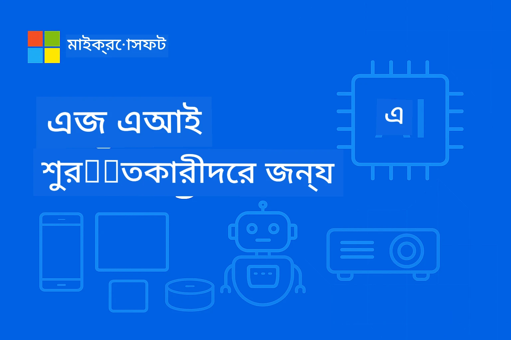

# আৰম্ভণি বাবে EdgeAI




[](https://GitHub.com/microsoft/edgeai-for-beginners/graphs/contributors)
[](https://GitHub.com/microsoft/edgeai-for-beginners/issues)
[](https://GitHub.com/microsoft/edgeai-for-beginners/pulls)
[](http://makeapullrequest.com)

[](https://GitHub.com/microsoft/edgeai-for-beginners/watchers)
[](https://GitHub.com/microsoft/edgeai-for-beginners/fork)
[](https://GitHub.com/microsoft/edgeai-for-beginners/stargazers)


[](https://discord.gg/nTYy5BXMWG)

এই সম্পদ ব্যৱহাৰ আৰম্ভ কৰিবলৈ এই খোজবোৰ অনুসৰণ কৰক:

1. **ৰিপ'জিটৰী ফর্ক কৰক**: ক্লিক কৰক [](https://GitHub.com/microsoft/edgeai-for-beginners/fork)
2. **ৰিপ'জিটৰী ক্লোন কৰক**:   `git clone https://github.com/microsoft/edgeai-for-beginners.git`
3. [**Azure AI Foundry Discord যোগদান কৰক আৰু বিশেষজ্ঞ আৰু অন্যান্য বিকাশকাৰীৰ সৈতে সাক্ষাৎ কৰক**](https://discord.com/invite/ByRwuEEgH4)


### 🌐 বহু-ভাষা সমৰ্থন

#### GitHub Actionৰ মাধ্যমে সমৰ্থিত (স্বয়ংক্রিয় আৰু সদায় আপ-টু- дату)

<!-- CO-OP TRANSLATOR LANGUAGES TABLE START -->
[Arabic](../ar/README.md) | [Bengali](./README.md) | [Bulgarian](../bg/README.md) | [Burmese (Myanmar)](../my/README.md) | [Chinese (Simplified)](../zh-CN/README.md) | [Chinese (Traditional, Hong Kong)](../zh-HK/README.md) | [Chinese (Traditional, Macau)](../zh-MO/README.md) | [Chinese (Traditional, Taiwan)](../zh-TW/README.md) | [Croatian](../hr/README.md) | [Czech](../cs/README.md) | [Danish](../da/README.md) | [Dutch](../nl/README.md) | [Estonian](../et/README.md) | [Finnish](../fi/README.md) | [French](../fr/README.md) | [German](../de/README.md) | [Greek](../el/README.md) | [Hebrew](../he/README.md) | [Hindi](../hi/README.md) | [Hungarian](../hu/README.md) | [Indonesian](../id/README.md) | [Italian](../it/README.md) | [Japanese](../ja/README.md) | [Kannada](../kn/README.md) | [Korean](../ko/README.md) | [Lithuanian](../lt/README.md) | [Malay](../ms/README.md) | [Malayalam](../ml/README.md) | [Marathi](../mr/README.md) | [Nepali](../ne/README.md) | [Nigerian Pidgin](../pcm/README.md) | [Norwegian](../no/README.md) | [Persian (Farsi)](../fa/README.md) | [Polish](../pl/README.md) | [Portuguese (Brazil)](../pt-BR/README.md) | [Portuguese (Portugal)](../pt-PT/README.md) | [Punjabi (Gurmukhi)](../pa/README.md) | [Romanian](../ro/README.md) | [Russian](../ru/README.md) | [Serbian (Cyrillic)](../sr/README.md) | [Slovak](../sk/README.md) | [Slovenian](../sl/README.md) | [Spanish](../es/README.md) | [Swahili](../sw/README.md) | [Swedish](../sv/README.md) | [Tagalog (Filipino)](../tl/README.md) | [Tamil](../ta/README.md) | [Telugu](../te/README.md) | [Thai](../th/README.md) | [Turkish](../tr/README.md) | [Ukrainian](../uk/README.md) | [Urdu](../ur/README.md) | [Vietnamese](../vi/README.md)

> **স্থানীয়ভাৱে ক্লোন কৰিব বিচাৰে?**

> এই ৰিপ'জিটৰীত ৫০+ ভাষাৰ অনুবাদ আছে, যাৰ ফলত ডাউনল'ড সাইজ বিশেষকৈ বৃদ্ধি পায়। অনুবাদসমূহৰ অবিহনে ক্লোন কৰিবলৈ sparse checkout ব্যৱহাৰ কৰক:
> ```bash
> git clone --filter=blob:none --sparse https://github.com/microsoft/edgeai-for-beginners.git
> cd edgeai-for-beginners
> git sparse-checkout set --no-cone '/*' '!translations' '!translated_images'
> ```
> এইটো আপোনাক সম্পূৰ্ণ কোর্সটো সম্পাদন কৰিবলৈ সকলো কিছু দিছে, কিন্তু বহুত বেছি দ্রুত ডাউনল'ডৰ সৈতে।
<!-- CO-OP TRANSLATOR LANGUAGES TABLE END -->

**আপুনি যদি অধিক অনুবাদ ভাষা সমৰ্থন কৰিব বিচাৰে, তেন্তে এই ঠিকনাত পোৱা যাব [এখানে](https://github.com/Azure/co-op-translator/blob/main/getting_started/supported-languages.md)**
## পৰিচয়

**EdgeAI for Beginners** ত আপোনাক স্বাগতম – এডজ কৃত্ৰিম বুদ্ধিমত্তাৰ পৰিৱৰ্তনশীল দুনিয়ালৈ আপোনাৰ ব্যাপক যাত্ৰা। এই পাঠ্যক্ৰমে শক্তিশালী AI সক্ষমতাৰ সাঙুৰি উঠিছে আৰু প্ৰাণবন্ত, বাস্তৱ জগতত এডজ ডিভাইচসমূহত প্ৰয়োগ কৰিবলৈ সুবিধা দিয়ে, যাৰ দ্বাৰা আপুনি AIৰ সম্ভাৱনাক সেই ঠাইতে সঁপিয়াব পাৰে য'ত তথ্য উৎপন্ন হয় আৰু সিদ্ধান্ত লোৱাৰ প্ৰয়োজন হয়।

### আপুনি কি শিকিব

এই পাঠ্যক্ৰমে মৌলিক ধাৰণাৰ পৰা উৎপাদন-প্ৰস্তুত কাৰ্যাৰম্ভলৈ আপোনাক লৈ যাইছে, যিটো আৱৰণ কৰে:
- **সৰু ভাষা মডেল (SLMs)** যি এডজত ব্যৱহাৰ উপযোগী
- **হাৰ্ডৱেৰ-সচেতন অপ্টিমাইজেশ্বন** বিভিন্ন প্লেটফৰ্মৰ মাজত
- **ৰিয়েল-টাইম ইन्फাৰেন্স** গোপনীয়তা সংৰক্ষণৰ সৈতে
- **উৎপাদন প্ৰয়োজনীয় নীতি** উদ্যোগ আবেদনসমূহৰ বাবে

### কিয় EdgeAI গুৰুত্বপূর্ণ

Edge AI হৈছে এটা ধাৰণাৰ পৰিবৰ্তন যিয়ে আধুনিক সমস্্যাবোৰ সমাধান কৰে:
- **গোপনীয়তা আৰু সুৰক্ষা**: সংবেদনশীল তথ্য স্থানীয়তে প্ৰক্ৰিয়া কৰক ক্লাউড এক্সপোজাৰৰ অবিহনে
- **ৰিয়েল-টাইম প্ৰদৰ্শন**: সময়-সংবেদনশীল আবেদনৰ বাবে নেটৱৰ্ক বিলম্বতা আঁতৰাওক
- **ব্যয় হ্ৰাস**: বেণ্ডউইদথ আৰু ক্লাউড কম্পিউটিংৰ খৰচ কমাওক
- **স্থিৰ অপাৰেশন**: নেটৱৰ্ক বন্ধৰ সময়তো কাৰ্যক্ষমতা সজাগ ৰাখক
- **বিধানগত অনুসৰণ**: তথ্যৰ সত্বাধীকাৰৰ আৱশ্যকতা পূৰণ কৰক

### Edge AI

Edge AI বুজায় AI এলগৰিদম আৰু ভাষা মডেলসমূহ স্থানীয়ভাৱে হাৰ্ডৱেৰত চলোৱা, য'ত ডাটা উৎপন্ন হয়ৰ কাষত ক্লাউড সম্পদৰ ওপৰত নির্ভৰ নকৰাকৈ ইन्फাৰেন্স কৰা হয়। এইয়ে বিলম্বতা কমাই, গোপনীয়তা বৃদ্ধি কৰে আৰু ৰিয়েল-টাইম সিদ্ধান্তগ্ৰহণ সক্ৰিয় কৰে।

### মূল নীতি:
- **অলগা ডিভাইচত ইन्फাৰেন্স**: AI মডেলসমূহ এডজ ডিভাইচসমূহ (ফোন, ৰাউটাৰ, মাইক্ৰোকন্ট্ৰোলাৰ, উদ্যোগিক পি চি)ত চলে
- **অফলাইন সক্ষমতা**: অৱিচ্ছিন্ন ইণ্টাৰনেট সংযোগৰ অবিহনে কাম কৰে
- **সৰু বিলম্বতা**: ৰিয়েল-টাইম প্ৰণালীৰ বাবে ক্ষণস্থায়ী প্ৰতিক্ৰিয়া
- **ডাটা সত্বাধীকাৰ**: সংবেদনশীল ডাটা স্থানীয়তে ৰাখি সুৰক্ষা আৰু অনুসৰণ বঢ়ায়

### সৰু ভাষা মডেলসমূহ (SLMs)

Phi-4, Mistral-7B, আৰু Gemma যেনে SLMs হৈছে ডাঙৰ LLMৰ সৰ্বাপেক্ষা সূক্ষ্ম সংস্কৰণ — যিবোৰ প্ৰশিক্ষিত বা বিশ্লেষিত হৈছে:
- **কম মেম'ৰি খৰচ**: সীমিত এডজ ডিভাইচ মেম'ৰিৰ সদ্ব্যৱহাৰ
- **কম কম্পিউটাৰ চাহিদা**: CPU আৰু এডজ GPU-ৰ বাবে অপ্টিমাইজড
- **দ্ৰুত আৰম্ভণি সময়**: প্ৰতিসম্বিধান মাত্ৰাত তৎপৰতাৰ সৈতে

সেয়া শক্তিশালী NLP ক্ষমতাৰ দৰজা খুলে আৰু এইবোৰ বাধা পূৰণ কৰে:
- **এম্বেডেড প্ৰণালীসমূহ**: IoT ডিভাইচ আৰু উদ্যোগিক নিয়ন্ত্ৰক
- **ম'বাইল ডিভাইচ**: অফলাইন সক্ষমতা থকা স্মাৰ্টফোন আৰু টেবলেট
- **IoT ডিভাইচসমূহ**: সীমিত সম্পদসহ ছেন্সৰ আৰু স্মাৰ্ট ডিভাইচ
- **এডজ ছাৰ্ভাৰসমূহ**: সীমিত GPU সম্পদৰ সৈতে স্থানীয় প্ৰস্‌চলন একক
- **ব্যক্তিগত কম্পিউটাৰ**: ডেস্কটপ আৰু লেপটপ বিতৰণ দৃশ্য

## পাঠ্যক্ৰম মডিউল আৰু নেভিগেশ্বন

| মডিউল | বিষয় | মনোনিবেশ ক্ষেত্র | মূল বিষয়বস্তু | স্তৰ | সময় |
|--------|-------|-----------------|--------------|-------|--------|
| [📖 00 ](./introduction.md) | [EdgeAI পৰিচয়](./introduction.md) | আধাৰ আৰু পৰিপ্ৰেক্ষিত | EdgeAI সমীক্ষা • উদ্যোগ আবেদনসমূহ • SLM পৰিচয় • শিক্ষণ লক্ষ্যসমূহ | আৰম্ভণি | ১-২ ঘণ্টা |
| [📚 01](../../Module01) | [EdgeAI মৌলিক তথ্য](./Module01/README.md) | ক্লাউড বনাম এডজ AI তুলনা | EdgeAI মৌলিক • বাস্তৱ কেছ ষ্টাডী • কাৰ্যকৰী নিৰ্দেশিকা • এডজ বিতৰণ | আৰম্ভণি | ৩-৪ ঘণ্টা |
| [🧠 02](../../Module02) | [SLM মডেল আধাৰ](./Module02/README.md) | মডেল পৰিয়াল আৰু স্থাপত্য | Phi পৰিয়াল • Qwen পৰিয়াল • Gemma পৰিয়াল • BitNET • μModel • Phi-Silica | আৰম্ভণি | ৪-৫ ঘণ্টা |
| [🚀 03](../../Module03) | [SLM বিতৰণ অনুশীলন](./Module03/README.md) | স্থানীয় আৰু ক্লাউড বিতৰণ | উন্নত শিক্ষণ • স্থানীয় পৰিৱেশ • ক্লাউড বিতৰণ | মধ্যম | ৪-৫ ঘণ্টা |
| [⚙️ 04](../../Module04) | [মডেল অপ্টিমাইজেশ্বন টুলকিট](./Module04/README.md) | বহুপ্লেটফৰ্ম অপ্টিমাইজেশ্বন | পৰিচয় • Llama.cpp • Microsoft Olive • OpenVINO • Apple MLX • ৱৰ্কফ্লো সংশ্লেষণ | মধ্যম | ৫-৬ ঘণ্টা |
| [🔧 05](../../Module05) | [SLMOps উৎপাদন](./Module05/README.md) | উৎপাদন অপাৰেশন | SLMOps পৰিচয় • মডেল বিশ্লেষণ • সূক্ষ্ম-টিউনিং • উৎপাদন বিতৰণ | উন্নত | ৫-৬ ঘণ্টা |
| [🤖 06](../../Module06) | [AI এজেণ্ট আৰু ফাংচন কলিং](./Module06/README.md) | এজেণ্ট ফ্ৰেমৱৰ্ক আৰু MCP | এজেণ্ট পৰিচয় • ফাংচন কলিং • মডেল পৰিপ্ৰেক্ষিত প্ৰটকল | উন্নত | ৪-৫ ঘণ্টা |
| [💻 07](../../Module07) | [প্লেটফৰ্ম কাৰ্যকৰী ৰূপ](./Module07/README.md) | বহুপ্লেটফৰ্ম উদাহৰণ | AI টুলকিট • Foundry স্থানীয় • Windows উন্নয়ন | উন্নত | ৩-৪ ঘণ্টা |
| [🏭 08](../../Module08) | [Foundry স্থানীয় টুলকিট](./Module08/README.md) | উৎপাদন-প্ৰস্তুত উদাহৰণ | নমুনা আবেদনসমূহ (তলত বিবৰণ চাওক) | বুৰঞ্জী | ৮-১০ ঘণ্টা |

### 🏭 **মডিউল ০৮: নমুনা আবেদনসমূহ**

- [০১: REST চেট তৎপৰ আৰম্ভণি](./Module08/samples/01/README.md)
- [০২: OpenAI SDK সংহতি](./Module08/samples/02/README.md)
- [০৩: মডেল সন্ধান আৰু বেঞ্চমাৰ্কিং](./Module08/samples/03/README.md)
- [০৪: Chainlit RAG আবেদন](./Module08/samples/04/README.md)
- [০৫: বহু-এজেণ্ট পৰিচালনা](./Module08/samples/05/README.md)
- [০৬: মডেল-হিসাপে-টুল চেইন ৰাউটাৰ](./Module08/samples/06/README.md)
- [০৭: ডাইৰেক্ট API ক্লায়েন্ট](./Module08/samples/07/README.md)
- [০৮: Windows 11 চেট এপ্লিকেচন](./Module08/samples/08/README.md)
- [০৯: উন্নত বহু-এজেণ্ট প্ৰণালী](./Module08/samples/09/README.md)
- [১০: Foundry টুল ফ্ৰেমৱৰ্ক](./Module08/samples/10/README.md)

### 🎓 **কর্মশালা: হাত-কলমৰ শিক্ষাৰ পথ**

উৎপাদন-প্ৰস্তুত কাৰ্যাবলীসহ বিস্তৃত হাত-কলমৰ কৰ্মশালা সামগ্ৰীসমূহ:

- **[কর্মশালা নিৰ্দেশিকা](./Workshop/Readme.md)** - সম্পূৰ্ণ শিক্ষণ লক্ষ্য, ফলাফল আৰু সম্পদ নেভিগেশ্বন
- **Python নমুনা** (৬ ছেছন) - উত্তম প্ৰক্ৰিয়া, ত্ৰুটি সুৰক্ষণা আৰু বিস্তৃত ৰূপত আপডেট
- **Jupyter নোটবুক** (৮টা ইন্টাৰেকটিভ) - ধাপ-ধাপ টিউটোৰিয়ল সুচীপত্ৰ আৰু কাৰ্যক্ষমতা নজৰদাৰীসহ
- **ছেছন নিৰ্দেশিকা** - প্ৰতিটো কৰ্মশালা ছেছনৰ বাবে বিস্তৃত মার্কডাউন গাইড
- **প্ৰমাণীকৰণ টুল** - কোড গুণগত মান পৰীক্ষা আৰু স্মোক পৰীক্ষা চলাবলৈ স্ক্ৰিপ্টসমূহ

**আপুনি কি নিৰ্মাণ কৰিব:**
- স্থানীয় AI চেট এপ্লিকেচনসমূহ ছ্ট্রীমিং সমৰ্থনসহ
- গুণগত মূল্যাংকনসহ RAG পাইপলাইনসমূহ (RAGAS)
- বহু-মডেল বেঞ্চমাৰ্কিং আৰু তুলনামূলক টুল
- বহু-এজেণ্ট পৰিচালনা প্ৰণালী
- কাৰ্য-ভিত্তিক নিৰ্বাচনৰ সৈতে বুদ্ধিমান মডেল ৰাউটিং

### 🎙️ **এজেণ্টিকৰ কৰ্মশালা: হাত-কলম - AI পডকাষ্ট ষ্টুডিঅ'**

শূন্য পৰ্যায়ৰ পৰা AI-চালিত পডকাষ্ট প্ৰস্তুতি পাইপলাইন নিৰ্মাণ কৰক! এই ডাঙৰ আৰু গভীৰ কৰ্মশালাটো আপোনাক সম্পূৰ্ণ বহু-এজেণ্ট প্ৰণালী সৃষ্টি কৰাৰ দিহা দিয়ে, যিয়ে ধাৰণাবোৰক ব্যৱসায়িক পডকাষ্ট সংস্কৰণত ৰূপান্তৰ কৰে।
**[🎬 এআই পডকাস্ট স্টুডিও ওয়ার্কশপ শুরু করুন](./WorkshopForAgentic/README.md)**

**আপনার মিশন**: "Future Bytes" লঞ্চ করুন — একটি টেক পডকাস্ট যা সম্পূর্ণরূপে আপনি নিজে তৈরি করা AI এজেন্ট দ্বারা চালিত। কোনো ক্লাউড নির্ভরতা নেই, কোনো API খরচ নেই — সবকিছু আপনার স্থানীয় মেশিনে চলে।

**এটিকে অনন্য করে যা:**
- **🤖 বাস্তব মাল্টি-এজেন্ট অর্কেস্ট্রেশন** - বিশেষায়িত AI এজেন্ট তৈরি করুন যারা গবেষণা করে, লেখে এবং অডিও প্রযোজনা করে
- **🎯 সম্পূর্ণ প্রোডাকশন পাইপলাইন** - বিষয় নির্বাচন থেকে চূড়ান্ত পডকাস্ট অডিও আউটপুট পর্যন্ত
- **💻 ১০০% স্থানীয় ডিপ্লয়মেন্ট** - সম্পূর্ণ গোপনীয়তা এবং নিয়ন্ত্রণের জন্য Ollama এবং স্থানীয় মডেল (Qwen-3-8B) ব্যবহার করে
- **🎤 টেক্সট-টু-স্পিচ ইন্টিগ্রেশন** - স্ক্রিপ্টকে প্রাকৃতিক শোনাতে একাধিক বক্তার কথোপকথনে রূপান্তর করুন
- **✋ হিউম্যান-ইন-দ্য-লুপ ওয়ার্কফ্লো** - অনুমোদন গেটগুলি গুণমান নিশ্চিত করতে স্বয়ংক্রিয়তা রক্ষা করে

**তিন-অ্যাক্ট শেখার যাত্রা:**

|অ্যাক্ট|ফোকাস|মূল দক্ষতা|সময়কাল|
|-----|-------|------------|----------|
|**[অ্যাক্ট ১: আপনার AI সহকারীদের সঙ্গে পরিচিত হন](./WorkshopForAgentic/md/01.BuildAIAgentWithSLM.md)**|আপনার প্রথম AI এজেন্ট তৈরি করুন|টুল ইন্টিগ্রেশন • ওয়েব সার্চ • সমস্যা সমাধান • এজেন্টিক যুক্তি|২-৩ ঘণ্টা|
|**[অ্যাক্ট ২: আপনার প্রোডাকশন দল গঠন করুন](./WorkshopForAgentic/md/02.AIAgentOrchestrationAndWorkflows.md)**|একাধিক এজেন্টের সমন্বয়|টিম সমন্বয় • অনুমোদন ওয়ার্কফ্লো • DevUI ইন্টারফেস • মানব তত্ত্বাবধান|৩-৪ ঘণ্টা|
|**[অ্যাক্ট ৩: আপনার পডকাস্ট জীবন্ত করুন](./WorkshopForAgentic/md/03.Multi-SpeakerPodcastGenerationWithVibeVoice.md)**|পডকাস্ট অডিও তৈরি করুন|টেক্সট-টু-স্পিচ • মাল্টি-স্পিকার সংশ্লেষণ • দীর্ঘ সময়ের অডিও • সম্পূর্ণ স্বয়ংক্রিয়তা|২-৩ ঘণ্টা|

**ব্যবহৃত প্রযুক্তি:**
- **মাইক্রোসফট এজেন্ট ফ্রেমওয়ার্ক** - মাল্টি-এজেন্ট অর্কেস্ট্রেশন এবং সমন্বয়
- **Ollama** - স্থানীয় AI মডেল রানটাইম (কোনো ক্লাউডের প্রয়োজন নেই)
- **Qwen-3-8B** - এজেন্টিক কাজের জন্য অপ্টিমাইজড ওপেন-সোর্স ভাষা মডেল
- **টেক্সট-টু-স্পিচ API গুলো** - পডকাস্ট তৈরির জন্য প্রাকৃতিক ভয়েস সংশ্লেষণ

**হার্ডওয়্যার সাপোর্ট:**
- ✅ **CPU মোড** - যেকোন আধুনিক কম্পিউটারে কাজ করে (৮জিবি+ র‍্যাম সুপারিশকৃত)
- 🚀 **GPU অ্যাক্সিলারেশন** - NVIDIA/AMD GPU এর সাথে উল্লেখযোগ্য দ্রুত ইনফারেন্স
- ⚡ **NPU সাপোর্ট** - পরবর্তী প্রজন্মের নিউরাল প্রসেসিং ইউনিট ত্বরান্বিতকরণ

**সেরা উপযোগী:**
- মাল্টি-এজেন্ট AI সিস্টেম শেখাচ্ছেন এমন ডেভেলপারদের জন্য
- AI স্বয়ংক্রিয়তা এবং ওয়ার্কফ্লো নিয়ে আগ্রহীদের জন্য
- AI-সহায়তাকৃত প্রোডাকশন পরীক্ষা করছেন এমন কন্টেন্ট নির্মাতাদের জন্য
- ব্যবহারিক AI অর্কেস্ট্রেশন প্যাটার্ন পড়া ছাত্রদের জন্য

**তৈরি শুরু করুন**: [🎙️ এআই পডকাস্ট স্টুডিও ওয়ার্কশপ →](./WorkshopForAgentic/README.md)

### 📊 **শেখার পথ সারাংশ**
- **মোট সময়কাল**: ৩৬-৪৫ ঘন্টা
- **শুরু স্তর পথ**: মডিউল ০১-০২ (৭-৯ ঘন্টা)  
- **মধ্যবর্তী স্তর পথ**: মডিউল ০৩-০৪ (৯-১১ ঘন্টা)
- **উন্নত স্তর পথ**: মডিউল ০৫-০৭ (১২-১৫ ঘন্টা)
- **বিশেষজ্ঞ স্তর পথ**: মডিউল ০৮ (৮-১০ ঘন্টা)

## আপনি যা তৈরী করবেন

### 🎯 মূল দক্ষতা
- **এজ AI স্থাপত্য**: ক্লাউড ইন্টিগ্রেশন সহ স্থানীয় প্রথম AI সিস্টেম ডিজাইন করুন
- **মডেল অপ্টিমাইজেশন**: এজ ডিপ্লয়মেন্টের জন্য মডেল কোয়ান্টাইজ এবং কম্প্রেস করুন (৮৫% গতি বৃদ্ধি, ৭৫% সাইজ হ্রাস)
- **মাল্টি-প্ল্যাটফর্ম ডিপ্লয়মেন্ট**: উইন্ডোজ, মোবাইল, এমবেডেড, এবং ক্লাউড-এজ হাইব্রিড সিস্টেম
- **প্রোডাকশন অপারেশনস**: এজ AI মনিটরিং, স্কেলিং এবং রক্ষণাবেক্ষণ

### 🏗️ ব্যবহারিক প্রকল্পসমূহ
- **Foundry Local চ্যাট অ্যাপস**: মডেল সুইচিং সহ উইন্ডোজ ১১ নেটিভ অ্যাপ
- **মাল্টি-এজেন্ট সিস্টেম**: জটিল ওয়ার্কফ্লোর জন্য সমন্বয়কারী ও বিশেষজ্ঞ এজেন্ট  
- **RAG অ্যাপ্লিকেশনস**: স্থানীয় ডকুমেন্ট প্রসেসিং এবং ভেক্টর সার্চ
- **মডেল রাউটারস**: টাস্ক বিশ্লেষণের উপর ভিত্তি করে মডেল বুদ্ধিমান নির্বাচন
- **API ফ্রেমওয়ার্কস**: স্ট্রিমিং ও হেল্থ মনিটরিংসহ প্রোডাকশন-রেডি ক্লায়েন্ট
- **ক্রস-প্ল্যাটফর্ম টুলস**: LangChain/Semantic Kernel ইন্টিগ্রেশন প্যাটার্ন

### 🏢 শিল্প প্রয়োগ
**উত্পাদন** • **হেলথকেয়ার** • **স্বয়ংক্রিয় যানবাহন** • **স্মার্ট সিটি** • **মোবাইল অ্যাপস**

## দ্রুত শুরু করবেন কিভাবে

**প্রস্তাবিত শেখার পথ** (২০-৩০ ঘন্টার মোট):

0. **📖 পরিচিতি** ([Introduction.md](./introduction.md)): EdgeAI ভিত্তি + শিল্প প্রেক্ষাপট + শেখার ফ্রেমওয়ার্ক
1. **📚 ভিত্তি** (মডিউল ০১-০২): EdgeAI ধারণা + SLM মডেল পরিবার
2. **⚙️ অপ্টিমাইজেশন** (মডিউল ০৩-০৪): ডিপ্লয়মেন্ট + কোয়ান্টাইজেশন ফ্রেমওয়ার্ক  
3. **🚀 প্রোডাকশন** (মডিউল ০৫-০৬): SLMOps + AI এজেন্ট + ফাংশন কলিং
4. **💻 বাস্তবায়ন** (মডিউল ০৭-০৮): প্ল্যাটফর্ম স্যাম্পলস + Foundry Local টুলকিট

প্রत्यেক মডিউলে তত্ত্ব, হাতে কলমের অনুশীলন এবং প্রোডাকশন-রেডি কোড নমুনা অন্তর্ভুক্ত।

## ক্যারিয়ার প্রভাব

**প্রযুক্তিগত ভূমিকা**: EdgeAI সলিউশন আর্কিটেক্ট • ML ইঞ্জিনিয়ার (এজ) • IoT AI ডেভেলপার • মোবাইল AI ডেভেলপার

**শিল্প সেক্টর**: ম্যানুফ্যাকচারিং ৪.০ • হেলথকেয়ার টেক • স্বয়ংসম্পূর্ণ সিস্টেম • ফিনটেক • কনজুমার ইলেকট্রনিক্স

**পোর্টফোলিও প্রকল্প**: মাল্টি-এজেন্ট সিস্টেম • প্রোডাকশন RAG অ্যাপ • ক্রস-প্ল্যাটফর্ম ডিপ্লয়মেন্ট • পারফরমেন্স অপ্টিমাইজেশন

## রেপোসিটরি কাঠামো

```
edgeai-for-beginners/
├── 📖 introduction.md  # Foundation: EdgeAI Overview & Learning Framework
├── 📚 Module01-04/     # Fundamentals → SLMs → Deployment → Optimization  
├── 🔧 Module05-06/     # SLMOps → AI Agents → Function Calling
├── 💻 Module07/        # Platform Samples (VS Code, Windows, Jetson, Mobile)
├── 🏭 Module08/        # Foundry Local Toolkit + 10 Comprehensive Samples
│   ├── samples/01-06/  # Foundation: REST, SDK, RAG, Agents, Routing
│   └── samples/07-10/  # Advanced: API Client, Windows App, Enterprise Agents, Tools
├── 🌐 translations/    # Multi-language support (8+ languages)
└── 📋 STUDY_GUIDE.md   # Structured learning paths & time allocation
```


## কোর্সের প্রধান বৈশিষ্ট্য

✅ **ক্রমবর্ধমান শেখা**: তত্ত্ব → অনুশীলন → প্রোডাকশন ডিপ্লয়মেন্ট  
✅ **বাস্তব কেস স্টাডিজ**: মাইক্রোসফট, জাপান এয়ারলাইন্স, এন্টারপ্রাইজ ইমপ্লিমেন্টেশন  
✅ **হাতেকলমে নমুনা**: ৫০+ উদাহরণ, ১০টি ব্যাপক Foundry Local ডেমো  
✅ **পারফরমেন্স ফোকাস**: ৮৫% গতি উন্নতি, ৭৫% সাইজ হ্রাস  
✅ **মাল্টি-প্ল্যাটফর্ম**: উইন্ডোজ, মোবাইল, এমবেডেড, ক্লাউড-এজ হাইব্রিড  
✅ **প্রোডাকশন প্রস্তুত**: মনিটরিং, স্কেলিং, সিকিউরিটি, কমপ্লায়েন্স ফ্রেমওয়ার্ক

📖 **[অধ্যয়ন গাইড উপলব্ধ](STUDY_GUIDE.md)**: সময় বরাদ্দ নির্দেশিকা এবং স্ব-মূল্যায়ন টুল সহ কাঠামোবদ্ধ ২০-ঘণ্টার শেখার পথ।

---

**EdgeAI ভবিষ্যতের AI ডিপ্লয়মেন্টের প্রতিনিধিত্ব করে**: স্থানীয়-প্রথম, গোপনীয়তা সংরক্ষণকারী এবং কার্যকর। এই দক্ষতাগুলো আয়ত্ত করুন পরবর্তী প্রজন্মের বুদ্ধিমান অ্যাপ্লিকেশন তৈরির জন্য।

## অন্যান্য কোর্স

আমাদের দল অন্যান্য কোর্স তৈরি করে! দেখুন:

<!-- CO-OP TRANSLATOR OTHER COURSES START -->
### LangChain
[](https://aka.ms/langchain4j-for-beginners)
[](https://aka.ms/langchainjs-for-beginners?WT.mc_id=m365-94501-dwahlin)
[](https://github.com/microsoft/langchain-for-beginners?WT.mc_id=m365-94501-dwahlin)
---

### Azure / Edge / MCP / Agents
[](https://github.com/microsoft/AZD-for-beginners?WT.mc_id=academic-105485-koreyst)
[](https://github.com/microsoft/edgeai-for-beginners?WT.mc_id=academic-105485-koreyst)
[](https://github.com/microsoft/mcp-for-beginners?WT.mc_id=academic-105485-koreyst)
[](https://github.com/microsoft/ai-agents-for-beginners?WT.mc_id=academic-105485-koreyst)

---
 
### জেনারেটিভ AI সিরিজ
[](https://github.com/microsoft/generative-ai-for-beginners?WT.mc_id=academic-105485-koreyst)
[-9333EA?style=for-the-badge&labelColor=E5E7EB&color=9333EA)](https://github.com/microsoft/Generative-AI-for-beginners-dotnet?WT.mc_id=academic-105485-koreyst)
[-C084FC?style=for-the-badge&labelColor=E5E7EB&color=C084FC)](https://github.com/microsoft/generative-ai-for-beginners-java?WT.mc_id=academic-105485-koreyst)
[-E879F9?style=for-the-badge&labelColor=E5E7EB&color=E879F9)](https://github.com/microsoft/generative-ai-with-javascript?WT.mc_id=academic-105485-koreyst)

---
 
### মূল শেখা
[](https://aka.ms/ml-beginners?WT.mc_id=academic-105485-koreyst)
[](https://aka.ms/datascience-beginners?WT.mc_id=academic-105485-koreyst)
[](https://aka.ms/ai-beginners?WT.mc_id=academic-105485-koreyst)
[](https://github.com/microsoft/Security-101?WT.mc_id=academic-96948-sayoung)
[](https://aka.ms/webdev-beginners?WT.mc_id=academic-105485-koreyst)
[](https://aka.ms/iot-beginners?WT.mc_id=academic-105485-koreyst)
[](https://github.com/microsoft/xr-development-for-beginners?WT.mc_id=academic-105485-koreyst)

---
 
### কোপাইলট সিরিজ

[](https://aka.ms/GitHubCopilotAI?WT.mc_id=academic-105485-koreyst)
[](https://github.com/microsoft/mastering-github-copilot-for-dotnet-csharp-developers?WT.mc_id=academic-105485-koreyst)
[](https://github.com/microsoft/CopilotAdventures?WT.mc_id=academic-105485-koreyst)
<!-- CO-OP TRANSLATOR OTHER COURSES END -->

## সাহায্য পাওয়া

আপনি যদি আটকে যান বা AI অ্যাপ তৈরি করার বিষয়ে কোন প্রশ্ন থাকে, যোগ দিন:

[](https://discord.gg/nTYy5BXMWG)

আপনার যদি পণ্য প্রতিক্রিয়া বা ত্রুটি থাকে, তখন গিয়ে দেখুন:

[](https://aka.ms/foundry/forum)

---

<!-- CO-OP TRANSLATOR DISCLAIMER START -->
**অস্বীকারোক্তি**:  
এই দলিলটি AI অনুবাদ সেবা [Co-op Translator](https://github.com/Azure/co-op-translator) ব্যবহার করে অনূদিত হয়েছে। আমরা যথাসম্ভব সঠিকতার চেষ্টা করি, তবে স্বয়ংক্রিয় অনুবাদে ত্রুটি বা অসঙ্গতি থাকতে পারে। মূল ভাষায় প্রদত্ত দলিলটিকেই কর্তৃত্বপূর্ণ উৎস হিসাবে গণ্য করা উচিত। গুরুত্বপূর্ণ তথ্যের জন্য পেশাদার মানব অনুবাদের পরামর্শ দেওয়া হয়। এই অনুবাদের ব্যবহারে কোনো ভুল বোঝাবুঝি বা ভুল ব্যাখ্যার জন্য আমরা দায়ী নই।
<!-- CO-OP TRANSLATOR DISCLAIMER END -->