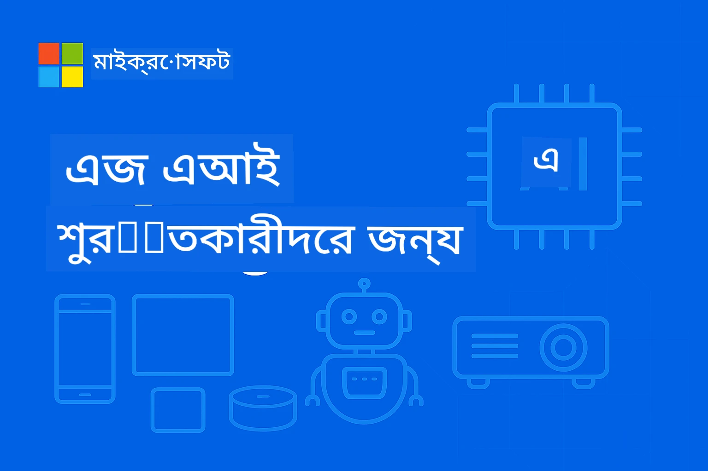

# শুরুদের জন্য EdgeAI




[](https://GitHub.com/microsoft/edgeai-for-beginners/graphs/contributors)
[](https://GitHub.com/microsoft/edgeai-for-beginners/issues)
[](https://GitHub.com/microsoft/edgeai-for-beginners/pulls)
[](http://makeapullrequest.com)

[](https://GitHub.com/microsoft/edgeai-for-beginners/watchers)
[](https://GitHub.com/microsoft/edgeai-for-beginners/fork)
[](https://GitHub.com/microsoft/edgeai-for-beginners/stargazers)


[](https://discord.gg/nTYy5BXMWG)

এই সম্পদগুলি ব্যবহার শুরু করতে নিম্নলিখিত পদক্ষেপগুলো অনুসরণ করুন:

1. **রিপোজিটোরি ফর্ক করুন**: ক্লিক করুন [](https://GitHub.com/microsoft/edgeai-for-beginners/fork)
2. **রিপোজিটোরি ক্লোন করুন**:   `git clone https://github.com/microsoft/edgeai-for-beginners.git`
3. [**Azure AI Foundry Discord এ যোগ দিন এবং বিশেষজ্ঞ ও অন্যান্য ডেভেলপারদের সাথে পরিচিত হন**](https://discord.com/invite/ByRwuEEgH4)


### 🌐 বহু-ভাষা সমর্থন

#### GitHub অ্যাকশনের মাধ্যমে সমর্থিত (স্বয়ংক্রিয় এবং সর্বদা আপ-টু-ডেট)

<!-- CO-OP TRANSLATOR LANGUAGES TABLE START -->
[Arabic](../ar/README.md) | [Bengali](./README.md) | [Bulgarian](../bg/README.md) | [Burmese (Myanmar)](../my/README.md) | [Chinese (Simplified)](../zh-CN/README.md) | [Chinese (Traditional, Hong Kong)](../zh-HK/README.md) | [Chinese (Traditional, Macau)](../zh-MO/README.md) | [Chinese (Traditional, Taiwan)](../zh-TW/README.md) | [Croatian](../hr/README.md) | [Czech](../cs/README.md) | [Danish](../da/README.md) | [Dutch](../nl/README.md) | [Estonian](../et/README.md) | [Finnish](../fi/README.md) | [French](../fr/README.md) | [German](../de/README.md) | [Greek](../el/README.md) | [Hebrew](../he/README.md) | [Hindi](../hi/README.md) | [Hungarian](../hu/README.md) | [Indonesian](../id/README.md) | [Italian](../it/README.md) | [Japanese](../ja/README.md) | [Kannada](../kn/README.md) | [Khmer](../km/README.md) | [Korean](../ko/README.md) | [Lithuanian](../lt/README.md) | [Malay](../ms/README.md) | [Malayalam](../ml/README.md) | [Marathi](../mr/README.md) | [Nepali](../ne/README.md) | [Nigerian Pidgin](../pcm/README.md) | [Norwegian](../no/README.md) | [Persian (Farsi)](../fa/README.md) | [Polish](../pl/README.md) | [Portuguese (Brazil)](../pt-BR/README.md) | [Portuguese (Portugal)](../pt-PT/README.md) | [Punjabi (Gurmukhi)](../pa/README.md) | [Romanian](../ro/README.md) | [Russian](../ru/README.md) | [Serbian (Cyrillic)](../sr/README.md) | [Slovak](../sk/README.md) | [Slovenian](../sl/README.md) | [Spanish](../es/README.md) | [Swahili](../sw/README.md) | [Swedish](../sv/README.md) | [Tagalog (Filipino)](../tl/README.md) | [Tamil](../ta/README.md) | [Telugu](../te/README.md) | [Thai](../th/README.md) | [Turkish](../tr/README.md) | [Ukrainian](../uk/README.md) | [Urdu](../ur/README.md) | [Vietnamese](../vi/README.md)

> **স্থানীয়ভাবে ক্লোন করতে চান?**
>
> এই রিপোজিটোরিতে ৫০টিরও বেশি ভাষার অনুবাদ অন্তর্ভুক্ত রয়েছে যা ডাউনলোডের সাইজ উল্লেখযোগ্যভাবে বৃদ্ধি করে। অনুবাদ ছাড়া ক্লোন করতে sparse checkout ব্যবহার করুন:
>
> **বাশ / ম্যাকওএস / লিনাক্স:**
> ```bash
> git clone --filter=blob:none --sparse https://github.com/microsoft/edgeai-for-beginners.git
> cd edgeai-for-beginners
> git sparse-checkout set --no-cone '/*' '!translations' '!translated_images'
> ```
>
> **CMD (উইন্ডোজ):**
> ```cmd
> git clone --filter=blob:none --sparse https://github.com/microsoft/edgeai-for-beginners.git
> cd edgeai-for-beginners
> git sparse-checkout set --no-cone "/*" "!translations" "!translated_images"
> ```
>
> এটি আপনাকে কোর্সটি সম্পন্ন করার জন্য প্রয়োজনীয় সমস্ত কিছু দেয় অনেক দ্রুত ডাউনলোডের সঙ্গে।
<!-- CO-OP TRANSLATOR LANGUAGES TABLE END -->

**আপনি যদি অতিরিক্ত অনুবাদ ভাষাগুলি চান, তাহলে সেগুলি এখানে তালিকাভুক্ত রয়েছে [এখানে](https://github.com/Azure/co-op-translator/blob/main/getting_started/supported-languages.md)**
## পরিচিতি

স্বাগতম **শুরুদের জন্য EdgeAI** – আপনার সর্বাঙ্গীন যাত্রা এজ আর্টিফিশিয়াল ইন্টেলিজেন্সের রূপান্তরমূলক জগতে। এই কোর্স শক্তিশালী AI ক্ষমতা এবং এজ ডিভাইসে বাস্তব জগতে প্রয়োগের মধ্যে ফাঁক পূরণ করে, আপনাকে ক্ষমতায়িত করে AI এর সম্ভাবনাকে সরাসরি যেখানে ডেটা উৎপন্ন হয় এবং সিদ্ধান্ত নিতে হয় সেখানে কাজে লাগানোর জন্য।

### আপনি কী শিখবেন

এই কোর্সটি আপনাকে মৌলিক ধারণা থেকে শুরু করে উৎপাদন পর্যায়ের বাস্তবায়নে নিয়ে যাবে, যার মধ্যে রয়েছে:
- এজ ডিপ্লয়মেন্টের জন্য **ছোট ভাষা মডেল (SLMs)**
- বিভিন্ন প্ল্যাটফর্মের জন্য **হার্ডওয়্যার সচেতন অপ্টিমাইজেশন**
- **গোপনীয়তা সংরক্ষণ সহ রিয়েল-টাইম ইনফারেন্স**
- এন্টারপ্রাইজ অ্যাপ্লিকেশনের জন্য **প্রোডাকশন ডিপ্লয়মেন্ট কৌশল**

### কেন EdgeAI গুরুত্বপূর্ণ

Edge AI একটি নতুন ধারা যা সমসাময়িক প্রধান চ্যালেঞ্জগুলো মোকাবেলা করে:
- **গোপনীয়তা ও নিরাপত্তা**: সংবেদনশীল ডেটা লোকালিতে প্রক্রিয়া করুন, ক্লাউড এক্সপোজার ছাড়া
- **রিয়েল-টাইম পারফরম্যান্স**: সময়-সমালোচনামূলক অ্যাপ্লিকেশনে নেটওয়ার্ক লেটেন্সি দূর করুন
- **খরচ সাশ্রয়**: ব্যান্ডউইথ এবং ক্লাউড কম্পিউটিং খরচ কমান
- **স্থিতিশীল অপারেশন**: নেটওয়ার্ক ডাউন থাকা অবস্থায়ও কার্যকারিতা বজায় রাখুন
- **নিয়ন্ত্রক মান্যতা**: ডেটা সার্বভৌমত্বের প্রয়োজনীয়তা পূরণ করুন

### Edge AI

Edge AI হল AI অ্যালগরিদম এবং ভাষা মডেলগুলো লোকালি হার্ডওয়্যার ডিভাইসে চালানো, যেখানে ডেটা তৈরি হয় সেখানে, ক্লাউড রিসোর্সে নির্ভর না করে ইনফারেন্সের জন্য। এটি লেটেন্সি কমায়, গোপনীয়তা বৃদ্ধি করে এবং রিয়েল-টাইম সিদ্ধান্ত গ্রহণ সক্ষম করে।

### মূল নীতিসমূহ:
- **অন-ডিভাইস ইনফারেন্স**: এজ ডিভাইস (ফোন, রাউটার, মাইক্রোকন্ট্রোলার, ইন্ডাস্ট্রিয়াল পিসি) এ AI মডেল চালানো
- **অফলাইন সক্ষমতা**: অবিচ্ছিন্ন ইন্টারনেট সংযোগ ছাড়াও কাজ করা
- **কম লেটেন্সি**: রিয়েল-টাইম সিস্টেমের জন্য তাৎক্ষণিক প্রতিক্রিয়া
- **ডেটা সার্বভৌমত্ব**: সংবেদনশীল ডেটা স্থানীয় রেখে নিরাপত্তা ও নিয়মাবলীর উন্নতি

### ছোট ভাষা মডেল (SLMs)

SLMs যেমন Phi-4, Mistral-7B, এবং Gemma বৃহৎ LLMs এর অপ্টিমাইজড সংস্করণ—যা ট্রেন বা ডিস্টিল করা হয়েছে:
- **মেমোরি ফুটপ্রিন্ট কমানো**: সীমিত এজ ডিভাইস মেমোরির কার্যকর ব্যবহার
- **কম কম্পিউট চাহিদা**: CPU এবং এজ GPU পারফরম্যান্সের জন্য অপ্টিমাইজ করা
- **দ্রুত স্টার্টআপ সময়**: সাড়া দেওয়ার জন্য দ্রুত ইনিশিয়ালাইজেশন

এগুলি শক্তিশালী NLP ক্ষমতা প্রদান করে যখন নিম্নলিখিত সীমাবদ্ধতাগুলোর সঙ্গে সামঞ্জস্যপূর্ণ:
- **এম্বেডেড সিস্টেম**: IoT ডিভাইস এবং ইন্ডাস্ট্রিয়াল কন্ট্রোলার
- **মোবাইল ডিভাইস**: স্মার্টফোন এবং ট্যাবলেট যেগুলোতে অফলাইন সক্ষমতা থাকে
- **IoT ডিভাইস**: সীমিত সম্পদের সেন্সর এবং স্মার্ট ডিভাইস
- **এজ সার্ভার**: সীমিত GPU সম্পদ সহ স্থানীয় প্রক্রিয়াকরণ ইউনিট
- **ব্যক্তিগত কম্পিউটার**: ডেস্কটপ ও ল্যাপটপ ডিপ্লয়মেন্ট পরিস্থিতি

## কোর্স মডিউল ও নেভিগেশন

| মডিউল | বিষয় | ফোকাস এলাকা | প্রধান বিষয়বস্তু | স্তর | স্থায়ীত্ব |
|--------|-------|------------|-------------|--------|----------|
| [📖 00 ](./introduction.md) | [EdgeAI পরিচিতি](./introduction.md) | ভিত্তি ও প্রেক্ষাপট | EdgeAI ওভারভিউ • শিল্প অ্যাপ্লিকেশন • SLM পরিচিতি • শেখার উদ্দেশ্য | শিক্ষানবিস | ১-২ ঘন্টা |
| [📚 01](../../Module01) | [EdgeAI মৌলিক বিষয়াবলী](./Module01/README.md) | ক্লাউড বনাম এজ AI তুলনা | EdgeAI মৌলিক • বাস্তব জীবন উদাহরণ • বাস্তবায়ন গাইড • এজ ডিপ্লয়মেন্ট | শিক্ষানবিস | ৩-৪ ঘন্টা |
| [🧠 02](../../Module02) | [SLM মডেল ভিত্তি](./Module02/README.md) | মডেল পরিবার ও আর্কিটেকচার | Phi পরিবার • Qwen পরিবার • Gemma পরিবার • BitNET • μModel • Phi-Silica | শিক্ষানবিস | ৪-৫ ঘন্টা |
| [🚀 03](../../Module03) | [SLM ডিপ্লয়মেন্ট অনুশীলন](./Module03/README.md) | স্থানীয় ও ক্লাউড ডিপ্লয়মেন্ট | উন্নত শেখা • স্থানীয় পরিবেশ • ক্লাউড ডিপ্লয়মেন্ট | মধ্যবর্তী | ৪-৫ ঘন্টা |
| [⚙️ 04](../../Module04) | [মডেল অপ্টিমাইজেশন টুলকিট](./Module04/README.md) | ক্রস-প্ল্যাটফর্ম অপ্টিমাইজেশন | পরিচিতি • Llama.cpp • Microsoft Olive • OpenVINO • Apple MLX • ওয়ার্কফ্লো সিন্থেসিস | মধ্যবর্তী | ৫-৬ ঘন্টা |
| [🔧 05](../../Module05) | [SLMOps প্রোডাকশন](./Module05/README.md) | প্রোডাকশন অপারেশনস | SLMOps পরিচিতি • মডেল ডিস্টিলেশন • ফাইন-টিউনিং • প্রোডাকশন ডিপ্লয়মেন্ট | উন্নত | ৫-৬ ঘন্টা |
| [🤖 06](../../Module06) | [AI এজেন্ট ও ফাংশন কলিং](./Module06/README.md) | এজেন্ট ফ্রেমওয়ার্ক ও MCP | এজেন্ট পরিচিতি • ফাংশন কলিং • মডেল কনটেক্সট প্রোটোকল | উন্নত | ৪-৫ ঘন্টা |
| [💻 07](../../Module07) | [প্ল্যাটফর্ম বাস্তবায়ন](./Module07/README.md) | ক্রস-প্ল্যাটফর্ম নমুনা | AI টুলকিট • Foundry Local • উইন্ডোজ ডেভেলপমেন্ট | উন্নত | ৩-৪ ঘন্টা |
| [🏭 08](../../Module08) | [Foundry Local টুলকিট](./Module08/README.md) | প্রোডাকশন-রেডি নমুনা | নমুনা অ্যাপ্লিকেশনসমূহ (নীচে বিস্তারিত দেখুন) | বিশেষজ্ঞ | ৮-১০ ঘন্টা |

### 🏭 **মডিউল ০৮: নমুনা অ্যাপ্লিকেশনসমূহ**

- [০১: REST Chat দ্রুত শুরু](./Module08/samples/01/README.md)
- [০২: OpenAI SDK ইন্টিগ্রেশন](./Module08/samples/02/README.md)
- [০৩: মডেল ডিসকভারি ও বেন্চমার্কিং](./Module08/samples/03/README.md)
- [০৪: Chainlit RAG অ্যাপ্লিকেশন](./Module08/samples/04/README.md)
- [০৫: মাল্টি-এজেন্ট অর্কেস্ট্রেশন](./Module08/samples/05/README.md)
- [০৬: মডেল-অ্যাস-টুলস রাউটার](./Module08/samples/06/README.md)
- [০৭: ডিরেক্ট API ক্লায়েন্ট](./Module08/samples/07/README.md)
- [০৮: উইন্ডোজ ১১ চ্যাট অ্যাপ](./Module08/samples/08/README.md)
- [০৯: উন্নত মাল্টি-এজেন্ট সিস্টেম](./Module08/samples/09/README.md)
- [১০: Foundry টুলস ফ্রেমওয়ার্ক](./Module08/samples/10/README.md)

### 🎓 **ওয়ার্কশপ: হাতে-কলমে শেখার পথ**

সম্পূর্ণ হাতে-কলমে ওয়ার্কশপ কন্টেন্ট প্রোডাকশন-রেডি বাস্তবায়নের সঙ্গে:

- **[ওয়ার্কশপ গাইড](./Workshop/Readme.md)** - সম্পূর্ণ শেখার উদ্দেশ্য, ফলাফল ও রিসোর্স নেভিগেশন
- **পাইথন নমুনা** (৬ সেশন) - সর্বোত্তম অনুশীলন, এরর হ্যান্ডলিং এবং বিস্তৃত ডকুমেন্টেশন সহ আপডেটেড
- **জুপিটার নোটবুক** (৮টি ইন্টারেক্টিভ) - ধাপে ধাপে টিউটোরিয়াল, বেন্চমার্ক এবং পারফরম্যান্স মনিটরিং সহ
- **সেশন গাইড** - প্রত্যেক ওয়ার্কশপ সেশনের জন্য বিস্তারিত মার্কডাউন গাইড
- **ভ্যালিডেশন টুল** - কোডের গুণগত মান যাচাই এবং স্মোক টেস্ট রান করার স্ক্রিপ্ট

**আপনি কী তৈরি করবেন:**
- স্ট্রিমিং সাপোর্ট সহ স্থানীয় AI চ্যাট অ্যাপ্লিকেশন
- গুণগত মূল্যায়ন সহ RAG পাইপলাইন (RAGAS)
- মাল্টি-মডেল বেন্চমার্কিং এবং তুলনা টুল
- মাল্টি-এজেন্ট অর্কেস্ট্রেশন সিস্টেম
- টাস্ক-ভিত্তিক নির্বাচনসহ বুদ্ধিমান মডেল রাউটিং

### 🎙️ **এজেন্টিকের জন্য ওয়ার্কশপ: হাতে-কলমে - AI পডকাস্ট স্টুডিও**
শূন্য থেকে একটি AI-চালিত পডকাস্ট প্রোডাকশন পাইপলাইন তৈরি করুন! এই অভিজ্ঞতামূলক ওয়ার্কশপ আপনাকে একটি সম্পূর্ণ মাল্টি-এজেন্ট সিস্টেম তৈরি করতে শিখায় যা আইডিয়াগুলোকে পেশাদার পডকাস্ট এপিসোডে রূপান্তর করে।

**[🎬 দ্যা AI পডকাস্ট স্টুডিও ওয়ার্কশপ শুরু করুন](./WorkshopForAgentic/README.md)**

**আপনার মিশন**: "ফিউচার বাইটস" চালু করুন — একটি টেক পডকাস্ট যা সম্পূর্ণরূপে AI এজেন্টদের দ্বারা চালিত হবে যাদের আপনি নিজেই তৈরি করবেন। কোনো ক্লাউড নির্ভরতা নেই, কোনো API খরচ নেই — সবকিছু আপনার নিজের মেশিনে লোকালি চলবে।

**এটি যা বিশেষ করে তোলে:**
- **🤖 বাস্তব মাল্টি-এজেন্ট অর্কেস্ট্রেশন** - বিশেষায়িত AI এজেন্ট তৈরি করুন যারা গবেষণা করে, লিখে এবং অডিও প্রোডিউস করে
- **🎯 সম্পূর্ণ প্রোডাকশন পাইপলাইন** - বিষয় নির্বাচন থেকে চূড়ান্ত পডকাস্ট অডিও আউটপুট পর্যন্ত
- **💻 ১০০% লোকাল ডিপ্লয়মেন্ট** - সম্পূর্ণ গোপনীয়তা এবং নিয়ন্ত্রণের জন্য Ollama এবং লোকাল মডেল (Qwen-3-8B) ব্যবহার করে
- **🎤 টেক্সট-টু-স্পিচ ইন্টিগ্রেশন** - স্ক্রিপ্টগুলোকে প্রাকৃতিকশব্দযুক্ত মাল্টি-স্পিকার কথোপকথনে রূপান্তর করুন
- **✋ হিউম্যান-ইন-দ্য-লুপ ওয়ার্কফ্লো** - অনুমোদন গেটস গুণগত মান নিশ্চিত করে স্বয়ংক্রিয়তা বজায় রাখে

**তিন-পর্বের শিখন যাত্রা:**

| পর্ব | ফোকাস | মূল দক্ষতা | সময়কাল |
|-----|-------|------------|----------|
| **[পর্ব ১: আপনার AI সহকারীদের সাথে পরিচিত হন](./WorkshopForAgentic/md/01.BuildAIAgentWithSLM.md)** | আপনার প্রথম AI এজেন্ট তৈরি করুন | টুল ইন্টিগ্রেশন • ওয়েব সার্চ • সমস্যা সমাধান • এজেন্টিক চিন্তাভাবনা | ২-৩ ঘন্টা |
| **[পর্ব ২: আপনার প্রোডাকশন টিম গঠন করুন](./WorkshopForAgentic/md/02.AIAgentOrchestrationAndWorkflows.md)** | একাধিক এজেন্টের অর্কেস্ট্রেশন | টিম সমন্বয় • অনুমোদন ওয়ার্কফ্লো • DevUI ইন্টারফেস • মানব তত্ত্বাবধান | ৩-৪ ঘন্টা |
| **[পর্ব ৩: আপনার পডকাস্ট জীবন্ত করুন](./WorkshopForAgentic/md/03.Multi-SpeakerPodcastGenerationWithVibeVoice.md)** | পডকাস্ট অডিও তৈরি করা | টেক্সট-টু-স্পিচ • মাল্টি-স্পিকার সংশ্লেষণ • দীর্ঘ আকারের অডিও • সম্পূর্ণ স্বয়ংক্রিয়তা | ২-৩ ঘন্টা |

**ব্যবহৃত প্রযুক্তি:**
- **Microsoft Agent Framework** - মাল্টি-এজেন্ট অর্কেস্ট্রেশন ও সমন্বয়
- **Ollama** - লোকাল AI মডেল রানটাইম (ক্লাউড প্রয়োজন নেই)
- **Qwen-3-8B** - এজেন্টিক কাজের জন্য অপ্টিমাইজড ওপেন-সোর্স ভাষা মডেল
- **টেক্সট-টু-স্পিচ API** - পডকাস্ট তৈরির জন্য স্বাভাবিক ভয়েস সংশ্লেষণ

**হার্ডওয়্যার সাপোর্ট:**
- ✅ **CPU মোড** - যে কোনও আধুনিক কম্পিউটারে চলে (৮GB+ RAM সুপারিশকৃত)
- 🚀 **GPU অ্যাক্সেলারেশন** - NVIDIA/AMD GPUs দিয়ে দ্রুততর ইনফারেন্স
- ⚡ **NPU সাপোর্ট** - পরবর্তী প্রজন্মের নিউরাল প্রসেসিং ইউনিট অ্যাক্সেলারেশন

**সর্বোত্তম উপযোগী:**
- মাল্টি-এজেন্ট AI সিস্টেম শেখাচ্ছে এমন ডেভেলপারদের জন্য
- AI স্বয়ংক্রিয়তা এবং ওয়ার্কফ্লোতে আগ্রহী যে কেউ
- AI-সহায়ক প্রোডাকশন অন্বেষণকারী কন্টেন্ট নির্মাতাদের জন্য
- ব্যবহারিক AI অর্কেস্ট্রেশন প্যাটার্ন শিখছে এমন ছাত্রদের জন্য

**শুরু করুন**: [🎙️ দ্যা AI পডকাস্ট স্টুডিও ওয়ার্কশপ →](./WorkshopForAgentic/README.md)

### 📊 **শিখন পথ সংক্ষিপ্তসার**
- **মোট সময়কাল**: ৩৬-৪৫ ঘন্টা
- **শুরুতি পথ**: মডিউল ০১-০২ (৭-৯ ঘন্টা)  
- **মধ্যবর্তী পথ**: মডিউল ০৩-০৪ (৯-১১ ঘন্টা)
- **উন্নত পথ**: মডিউল ০৫-০৭ (১২-১৫ ঘন্টা)
- **বিশেষজ্ঞ পথ**: মডিউল ০৮ (৮-১০ ঘন্টা)

## আপনি যা তৈরি করবেন

### 🎯 মূল দক্ষতা
- **এজ AI আর্কিটেকচার**: ক্লাউড একত্রিত লোকাল-প্রথম AI সিস্টেম ডিজাইন করা
- **মডেল অপ্টিমাইজেশন**: এজ ডিপ্লয়মেন্টের জন্য মডেলগুলো কোয়ান্টাইজ ও কম্প্রেস (৮৫% গতি বৃদ্ধি, ৭৫% আকার হ্রাস)
- **মাল্টি-প্ল্যাটফর্ম ডিপ্লয়মেন্ট**: উইন্ডোজ, মোবাইল, এমবেডেড এবং ক্লাউড-এজ হাইব্রিড সিস্টেম
- **প্রোডাকশন অপারেশনস**: এজ AI মনিটরিং, স্কেলিং এবং রক্ষণাবেক্ষণ

### 🏗️ ব্যবহারিক প্রকল্পসমূহ
- **Foundry লোকাল চ্যাট অ্যাপস**: উইন্ডোজ ১১ নেটিভ অ্যাপ্লিকেশন, মডেল স্যুইচিং সহ
- **মাল্টি-এজেন্ট সিস্টেমস**: জটিল ওয়ার্কফ্লোর জন্য বিশেষজ্ঞ এজেন্টসহ সমন্বয়কারী  
- **RAG অ্যাপ্লিকেশনস**: ভেক্টর সার্চ সহ লোকাল ডকুমেন্ট প্রসেসিং
- **মডেল রাউটারস**: টাস্ক বিশ্লেষণের ভিত্তিতে মডেল নির্বাচন
- **API ফ্রেমওয়ার্কস**: স্ট্রিমিং ও স্বাস্থ্য মনিটরিং সহ প্রোডাকশন-রেডি ক্লায়েন্ট
- **ক্রস-প্ল্যাটফর্ম টুলস**: LangChain/Semantic Kernel ইন্টিগ্রেশন প্যাটার্ন

### 🏢 শিল্পিক ব্যবহার
**উৎপাদনশীলতা** • **স্বাস্থ্য সেবা** • **স্বয়ংক্রিয় যানবাহন** • **স্মার্ট সিটি** • **মোবাইল অ্যাপ্লিকেশন**

## দ্রুত শুরু

**সুপারিশকৃত শিখন পথ** (মোট ২০-৩০ ঘন্টা):

০. **📖 পরিচিতি** ([Introduction.md](./introduction.md)): EdgeAI ভিত্তি + শিল্প প্রেক্ষাপট + শেখার ফ্রেমওয়ার্ক  
১. **📚 ভিত্তি** (মডিউল ০১-০২): EdgeAI ধারণা + SLM মডেল পরিবার  
২. **⚙️ অপ্টিমাইজেশন** (মডিউল ০৩-০৪): ডিপ্লয়মেন্ট + কোয়ান্টাইজেশন ফ্রেমওয়ার্ক  
৩. **🚀 প্রোডাকশন** (মডিউল ০৫-০৬): SLMOps + AI এজেন্ট + ফাংশন কলিং  
৪. **💻 বাস্তবায়ন** (মডিউল ০৭-০৮): প্ল্যাটফর্ম নমুনা + Foundry লোকাল টুলকিট

প্রতিটি মডিউলে তত্ত্ব, বাস্তব অনুশীলন এবং প্রোডাকশন-রেডি কোড স্যাম্পল অন্তর্ভুক্ত।

## ক্যারিয়ার প্রভাব

**প্রযুক্তিগত ভূমিকা**: EdgeAI সলিউশন্স আর্কিটেক্ট • ML ইঞ্জিনিয়ার (Edge) • IoT AI ডেভেলপার • মোবাইল AI ডেভেলপার

**শিল্প সেক্টর**: ম্যানুফ্যাকচারিং ৪.০ • স্বাস্থ্য সেবা প্রযুক্তি • স্বয়ংক্রিয় সিস্টেম • ফিনটেক • কনজিউমার ইলেকট্রনিক্স

**পোর্টফোলিও প্রকল্পসমূহ**: মাল্টি-এজেন্ট সিস্টেম • প্রোডাকশন RAG অ্যাপস • ক্রস-প্ল্যাটফর্ম ডিপ্লয়মেন্ট • কর্মক্ষমতা অপ্টিমাইজেশন

## রেপোজিটরি স্ট্রাকচার

```
edgeai-for-beginners/
├── 📖 introduction.md  # Foundation: EdgeAI Overview & Learning Framework
├── 📚 Module01-04/     # Fundamentals → SLMs → Deployment → Optimization  
├── 🔧 Module05-06/     # SLMOps → AI Agents → Function Calling
├── 💻 Module07/        # Platform Samples (VS Code, Windows, Jetson, Mobile)
├── 🏭 Module08/        # Foundry Local Toolkit + 10 Comprehensive Samples
│   ├── samples/01-06/  # Foundation: REST, SDK, RAG, Agents, Routing
│   └── samples/07-10/  # Advanced: API Client, Windows App, Enterprise Agents, Tools
├── 🌐 translations/    # Multi-language support (8+ languages)
└── 📋 STUDY_GUIDE.md   # Structured learning paths & time allocation
```

## কোর্স হাইলাইটস

✅ **ক্রমাগত শেখা**: তত্ত্ব → অনুশীলন → প্রোডাকশন ডিপ্লয়মেন্ট  
✅ **বাস্তব কেস স্টাডিজ**: মাইক্রোসফট, জাপান এয়ারলাইনস, এন্টারপ্রাইজ বাস্তবায়ন  
✅ **হ্যান্ডস-অন স্যাম্পলস**: ৫০+ উদাহরণ, ১০টি ব্যাপক Foundry Local ডেমো  
✅ **পারফরমেন্স ফোকাস**: ৮৫% গতি উন্নতি, ৭৫% আকার হ্রাস  
✅ **মাল্টি-প্ল্যাটফর্ম**: উইন্ডোজ, মোবাইল, এমবেডেড, ক্লাউড-এজ হাইব্রিড  
✅ **প্রোডাকশন রেডি**: মনিটরিং, স্কেলিং, সিকিউরিটি, কমপ্লায়েন্স ফ্রেমওয়ার্ক

📖 **[স্টাডি গাইড পাওয়া যাবে](STUDY_GUIDE.md)**: সময় বরাদ্দ নির্দেশিকা এবং স্ব-মূল্যায়ন সরঞ্জামসহ কাঠামোবদ্ধ ২০ ঘণ্টার শেখার পথ।

---

**EdgeAI হল AI ডিপ্লয়মেন্টের ভবিষ্যত**: লোকাল-প্রথম, গোপনীয়তা সংরক্ষণকারী, এবং দক্ষ। আপনার পরবর্তী প্রজন্মের বুদ্ধিমান অ্যাপ্লিকেশন তৈরি করতে এই দক্ষতাগুলো আয়ত্ত করুন।

## অন্যান্য কোর্স

আমাদের টিম অন্যান্য কোর্সও তৈরি করে! দেখুন:

<!-- CO-OP TRANSLATOR OTHER COURSES START -->
### LangChain
[](https://aka.ms/langchain4j-for-beginners)
[](https://aka.ms/langchainjs-for-beginners?WT.mc_id=m365-94501-dwahlin)
[](https://github.com/microsoft/langchain-for-beginners?WT.mc_id=m365-94501-dwahlin)
---

### Azure / Edge / MCP / Agents
[](https://github.com/microsoft/AZD-for-beginners?WT.mc_id=academic-105485-koreyst)
[](https://github.com/microsoft/edgeai-for-beginners?WT.mc_id=academic-105485-koreyst)
[](https://github.com/microsoft/mcp-for-beginners?WT.mc_id=academic-105485-koreyst)
[](https://github.com/microsoft/ai-agents-for-beginners?WT.mc_id=academic-105485-koreyst)

---
 
### Generative AI Series
[](https://github.com/microsoft/generative-ai-for-beginners?WT.mc_id=academic-105485-koreyst)
[-9333EA?style=for-the-badge&labelColor=E5E7EB&color=9333EA)](https://github.com/microsoft/Generative-AI-for-beginners-dotnet?WT.mc_id=academic-105485-koreyst)
[-C084FC?style=for-the-badge&labelColor=E5E7EB&color=C084FC)](https://github.com/microsoft/generative-ai-for-beginners-java?WT.mc_id=academic-105485-koreyst)
[-E879F9?style=for-the-badge&labelColor=E5E7EB&color=E879F9)](https://github.com/microsoft/generative-ai-with-javascript?WT.mc_id=academic-105485-koreyst)

---
 
### Core Learning
[](https://aka.ms/ml-beginners?WT.mc_id=academic-105485-koreyst)
[](https://aka.ms/datascience-beginners?WT.mc_id=academic-105485-koreyst)
[](https://aka.ms/ai-beginners?WT.mc_id=academic-105485-koreyst)
[](https://github.com/microsoft/Security-101?WT.mc_id=academic-96948-sayoung)
[](https://aka.ms/webdev-beginners?WT.mc_id=academic-105485-koreyst)
[](https://aka.ms/iot-beginners?WT.mc_id=academic-105485-koreyst)
[](https://github.com/microsoft/xr-development-for-beginners?WT.mc_id=academic-105485-koreyst)

---
 
### Copilot Series
[](https://aka.ms/GitHubCopilotAI?WT.mc_id=academic-105485-koreyst)
[](https://github.com/microsoft/mastering-github-copilot-for-dotnet-csharp-developers?WT.mc_id=academic-105485-koreyst)
[](https://github.com/microsoft/CopilotAdventures?WT.mc_id=academic-105485-koreyst)
<!-- CO-OP TRANSLATOR OTHER COURSES END -->

## সাহায্য নেওয়া

যদি আপনি আটকে যান বা AI অ্যাপ তৈরি করার বিষয়ে কোনো প্রশ্ন থাকে, যোগ দিন:

[](https://discord.gg/nTYy5BXMWG)

যদি আপনার পণ্য প্রতিক্রিয়া থাকে বা তৈরি করার সময় কোনো ত্রুটি হয় তাহলে দেখুন:

[](https://aka.ms/foundry/forum)

---

<!-- CO-OP TRANSLATOR DISCLAIMER START -->
**অস্বীকৃতি**:  
এই নথিটি AI অনুবাদ পরিষেবা [Co-op Translator](https://github.com/Azure/co-op-translator) ব্যবহার করে অনুবাদ করা হয়েছে। যদিও আমরা সঠিকতার জন্য চেষ্টা করি, দয়া করে লক্ষ্য করুন যে স্বয়ংক্রিয় অনুবাদে ত্রুটি বা ভুল থাকতে পারে। মূল নথিটি তার প্রকৃতি ভাষায় প্রামাণিক উৎস হিসাবে বিবেচিত হওয়া উচিত। গুরুত্বপূর্ণ তথ্যের জন্য পেশাদার মানব অনুবাদ প্রস্তাবিত। এই অনুবাদের ব্যবহারে সৃষ্ট কোনো ভুল বোঝাবুঝি বা ভুল ব্যাখ্যার জন্য আমরা দায়ী নই।
<!-- CO-OP TRANSLATOR DISCLAIMER END -->