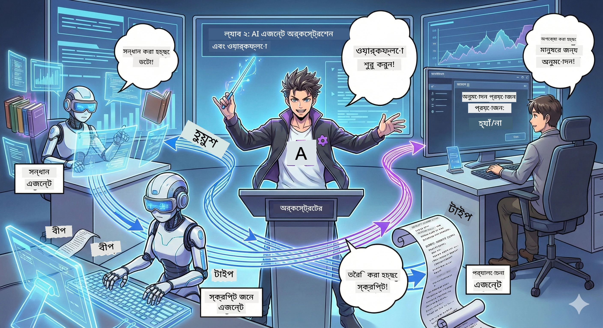

<!--
CO_OP_TRANSLATOR_METADATA:
{
  "original_hash": "2a2578dc4f813ca93ca7952d842a4b59",
  "translation_date": "2026-01-05T14:37:24+00:00",
  "source_file": "WorkshopForAgentic/translation/zh-cn/02.AIAgentOrchestrationAndWorkflows.md",
  "language_code": "bn"
}
-->
# দ্বিতীয় অঙ্ক: আপনার পডকাস্ট প্রোডাকশন টিম গঠন করা 🎬



## কাহিনী উত্তেজিত হওয়া

Alex(যিনি আপনি প্রথম অঙ্কে AI সহকারী ছিলেন) খুব ভালো, কিন্তু একাই একটি এজেন্ট পুরো পডকাস্ট স্টুডিও পরিচালনা করতে পারবেন না। আপনার একটি *টিম* দরকার:
- 🔍 **গবেষণা এজেন্ট**: নতুন তথ্যের জন্য ওয়েব অনুসন্ধান
- ✍️ **স্ক্রিপ্ট এজেন্ট**: গবেষণাকে আকর্ষণীয় সংলাপে রূপান্তর করা
- 👤 **আপনি(সম্পাদনা)**: স্ক্রিপ্ট অনুমোদন বা পুনঃলিখনের জন্য ফেরত পাঠানো

স্বাগতম **AI এজেন্ট অর্কেস্ট্রেশন**-এ —— আপনি হয়ে উঠবেন আপনার নিজস্ব AI দলের পরিচালক। ভাবুন Avengers এর মতো, কিন্তু পডকাস্ট প্রোডাকশনের জন্য।

## এজেন্ট অর্কেস্ট্রেশন কী? (সহজ সংস্করণ)

ভাবুন আপনি একটি রেস্তোরাঁ চালাচ্ছেন। আপনি নিজে সবকিছু করবেন না, তাই না? আপনার আছে:
- 🍳 রাঁধুনি রান্নার দায়িত্বে
- 👨‍🍳 সহকারী শেফ প্রস্তুতির দায়িত্বে
- 👩‍🍳 ওয়েটার খাবার পরিবেশনের দায়িত্বে

এজেন্ট অর্কেস্ট্রেশন একই ধারণা, কিন্তু AI ব্যবহার করে। প্রত্যেক এজেন্টের নিজের দক্ষতা আছে, আপনি তাদের সমন্বয় করেন বড় একটি লক্ষ্যে পৌঁছানোর জন্য। কোনো একক এজেন্ট অতিমাত্রায় চাপের মুখে পড়ে না, কাজ দ্রুত সম্পন্ন হয়।

### ব্যাণ্ডের তুলনা 🎸

আপনার AI এজেন্ট একটি ব্যাণ্ডের মতো:
- **সিঙ্গার**: ক্লায়েন্টের সামনে কাজ করার মূল এজেন্ট
- **ড্রামার**: তাল বজায় রাখে, ব্যাকএন্ড পরিচালনা করে
- **বেসিস্ট**: সবাইকে সহায়তা করে, তথ্য সংগ্রহ করে
- **আপনি (ব্যাণ্ড ম্যানেজার)**: সব সমন্বয় করেন!

সমন্বয় না থাকলে? শুধু শব্দকোলাহল। অর্কেস্ট্রেশন থাকলে? সুন্দর সুর।

### কেন এটা গুরুত্বপূর্ণ

একজন AI এজেন্ট সবকিছু করতে চেষ্টা করলে = ক্লান্তি। পেশাদার এজেন্টরা একসাথে কাজ করলে = দক্ষতা মুক্তিপ্রাপ্ত!🚀

**সত্য কথা**: মনে আছে কি একাকী গবেষণা, লেখা এবং সম্পাদনা করার চেষ্টা করেছিলে? হ্যাঁ, সেটা খারাপ ছিল। অর্কেস্ট্রেশনের মাধ্যমে, প্রতিটি এজেন্ট তাদের সবচেয়ে ভালো কাজটাই করে। আপনি শুধু চূড়ান্ত সিদ্ধান্ত নেন।

**বাস্তব জীবনের উদাহরণ**: কাস্টমার সাপোর্ট চ্যাটবট জানে কখন বিলিং, কখন টেকনিক্যাল সাহায্য দেওয়া উচিত এবং কখন মানুষকে কল করা দরকার। সেটাই অর্কেস্ট্রেশন!

## এজেন্ট বনাম ওয়ার্কফ্লো: পার্থক্য কী?

এভাবে ভাবুন:

### 🤖 AI এজেন্ট = জ্যাজ গায়ক
- **তৎক্ষণাৎ সিদ্ধান্ত** সে যা শুনে তার উপর ভিত্তি করে
- **তৎক্ষণাৎ সৃজন** তার টুল ব্যবহার করে সমস্যার সমাধান
- **চিন্তা করা** LLM মস্তিষ্ক ব্যবহারে
- **অভিযোজন** আপনি যা দেন তাতে মানিয়ে নেওয়া

### 🎵 ওয়ার্কফ্লো = অর্কেস্ট্রা ক্লাসিক্যাল সঙ্গীত বাজাচ্ছে
- **নিয়ম অনুসরণ** (আগেই নির্ধারিত ধাপ)
- **পূর্বানুমানযোগ্য** নির্দিষ্ট প্রক্রিয়া
- **সমন্বয়** একাধিক এজেন্ট, মানুষ, এবং সিস্টেম
- **গঠিত** রেসিপির মতো

**জাদু**: ওয়ার্কফ্লো *অর্কেস্ট্রেশন* করে এজেন্টদের! আপনি একটি ওয়ার্কফ্লো তৈরি করেন যা এজেন্টদের কখন কাজ করতে হবে বলে। যাতে উভয়ের সুবিধা মেলে।🎭

## আপনার AI টিম সমন্বয়ের তিনটি উপায়

### 1. 🎯 কেন্দ্রীভূত (আপনি বস)

একটি প্রধান এজেন্ট নির্দেশ দেয়। ভাবুন আপনি একটি টিম পরিচালনা করছেন —— আপনি সিদ্ধান্ত নেন কে কী করবে এবং কখন করবে।

**সুবিধা**:
- ✅ স্পষ্ট নেতৃত্ব (কোনো গরমিল নেই)
- ✅ ধারাবাহিক সিদ্ধান্ত
- ✅ সহজে ডিবাগ করা যায়

**প্রয়োগযোগ্য**:
- কাস্টমার সাপোর্ট রুটিং (“এটা বিলিং না টেকনো?”)
- কন্টেন্ট অনুমোদন ওয়ার্কফ্লো (“স্ক্রিপ্ট পাস হলে কী হবে?”)
- পডকাস্ট প্রোডাকশন (যেটা আমরা তৈরি করছি!)

### 2. 🤝 বিকেন্দ্রীকৃত (এজেন্ট স্ব-সংগঠিত)

এজেন্টরা সরাসরি একে অপরের সাথে কথা বলে এবং একটি গ্রুপ হিসাবে সমস্যা সমাধান করে। পুরো দলের মধ্যে সমন্বয় হচ্ছে।

**সুবিধা**:
- ✅ সহজে সম্প্রসারণযোগ্য (যত চান এজেন্ট যোগ করুন)
- ✅ একক ব্যর্থতা পয়েন্ট নেই
- ✅ এজেন্টরা স্বাভাবিকভাবেই সহযোগিতা করে

**প্রয়োগযোগ্য**:
- গবেষণা টিম (প্রতিটি এজেন্ট ভিন্ন উৎস অনুসন্ধান করে)
- আইডিয়া আলোচনা মিটিং
- বিতরণকৃত সমস্যা সমাধান

### 3. 🔀 হাইব্রিড (সবচেয়ে ভালো মিল)

আপনি সামগ্রিক দিকনির্দেশনা দেন, কিন্তু এজেন্টরা কাজের ওপর স্ব-সংগঠিত হতে পারে। একটি বিশ্বাসযোগ্য টিমের CEO এর মতো।

**উত্তম প্রয়োগ**: কঠিন প্রকল্প যেখানে নিয়ন্ত্রণ ও নমনীয়তা উভয়ের প্রয়োজন।

## Microsoft Agent Framework: আপনার অর্কেস্ট্রেশন কিট 🧰

গড়ে তোলার সময় এসেছে! আপনি যা ব্যবহার করবেন:

### নির্মাণের ব্লক

#### 1. 🧱 এক্সিকিউটর (আপনার কর্মী)
- **কি তারা**: পৃথক প্রক্রিয়াকরণ ইউনিট — হয় এজেন্ট অথবা কাস্টম লজিক
- **কি করে**: ইনপুট নেয়, কাজ করে, আউটপুট দেয়
- **ভাবুন**: পণ্য লাইনের স্টেশন

#### 2. ➡️ এজ (সংযোগ)
- **কি তারা**: এক্সিকিউটরদের মধ্যে পথ
- **কি করে**: মেসেজ ফ্লো নিয়ন্ত্রণ ( "A এর পর B এ যাও")
- **ভাবুন**: ফ্লো চার্টের তীর

#### 3. 🗺️ ওয়ার্কফ্লো (সামগ্রিক পরিকল্পনা)
- **কি তারা**: এক্সিকিউটর + এজ নিয়ে পূর্ণ চার্ট
- **কি করে**: শুরু থেকে শেষ পর্যন্ত পুরো প্রক্রিয়া সংজ্ঞায়িত করে
- **ভাবুন**: আপনার প্রোডাকশন ফ্লো ব্লুপ্রিন্ট

### আপনি যা পছন্দ করবেন কুল ফিচারসমূহ

**🛡️ টাইপ সেফটি**: এজেন্টদের মধ্যে মেসেজগুলি টাইপ পরীক্ষা করা হয়। কোন "উফ, ভুল ডেটা টাইপ" যেন হয় না।

**🔀 নমনীয় রুটিং**:
- ইফ-থেন শর্ত ("যদি অনুমোদন হয়, প্রকাশ; অন্যথায় পুনঃলিখন")
- প্যারালাল প্রসেসিং (একাধিক এজেন্ট একসাথে কাজ করে)
- ডায়নামিক রুট (ওয়ার্কফ্লো ফলাফলের ওপর পরিবর্তিত হয়)

**🔌 এক্সটার্নাল ইন্টিগ্রেশন**:
- API-তে সংযোগ
- ম্যানুয়াল ইন দ্য লুপ পয়েন্টস (আপনি প্রকাশের আগে অনুমোদন করবেন)
- অনুরোধ/প্রতিক্রিয়া ফ্লো গঠন

**💾 চেকপয়েন্ট**: অগ্রগতি সংরক্ষণ করুন! কিছু ভুল হলে আপনি যেখানে ছেড়ে দিয়েছেন সেখান থেকে চালিয়ে যান।

**🤝 মাল্টি-এজেন্ট সমন্বয়**:
- এজেন্টদের সিকোয়েন্সে চালান (A → B → C)
- সেগুলো একসাথে চালান (A + B + C সমান্তরাল)
- এজেন্টদের মধ্যে হস্তান্তর
- সহযোগিতামূলক কাজ

## সেরা অভ্যাস (প্রফেশনাল টিপস) 🎯

### 1. মডুলার থাকুন
প্রত্যেক এজেন্টকে একটাই কাজ ভালোভাবে করতে হবে। সবকিছু করা "সুপার এজেন্ট" তৈরি করবেন না — ডিবাগ করতে গেলে পস্তাবেন।

### 2. ব্যর্থতার জন্য পরিকল্পনা
এজেন্ট ভুল করতে পারে। নেটওয়ার্ক ফেল করতে পারে। এরর হ্যান্ডলিং এবং ব্যাকআপ প্ল্যান তৈরি করুন। ভবিষ্যতে আপনি ধন্যবাদ দিবেন।

### 3. সবকিছু মনিটর করুন
আপনার এজেন্ট কী করছে তা ট্র্যাক করুন। DevUI ব্যবহার করুন (আমরা শীঘ্রই দেখাব!) চলমান ওয়ার্কফ্লো দেখা জন্য।

### 4. মেসেজ সাইজ অপ্টিমাইজ করুন
এজেন্টদের মধ্যে বড় বড় ফাইল পাঠাবেন না। দ্রুততার জন্য মেসেজ ছোট রাখুন।

### 5. সঠিক প্যাটার্ন নির্বাচন করুন
নিয়ন্ত্রণ দরকার? কেন্দ্রীভূত বাছুন। স্কেল দরকার? বিকেন্দ্রীকৃত বাছুন। নিশ্চিত না? হাইব্রিড বাছুন!

## DevUI: আপনার ওয়ার্কফ্লো ডিবাগার 🔍

### DevUI কী?

DevUI হলো একটি খেলধুলার মাঠ যেখানে আপনি আপনার এজেন্ট এবং ওয়ার্কফ্লো পরীক্ষা করবেন। এটি একটি ওয়েব ইন্টারফেস, যেখানে আপনি পারেন:
- 👀 আপনার ওয়ার্কফ্লো চালু থাকা দেখুন
- 💬 সরাসরি এজেন্টদের সঙ্গে কথা বলুন
- 🔍 সমস্যা হলে ডিবাগ করুন
- 📊 ট্রেস এবং পারফরমেন্স মেট্রিক্স দেখুন

> **গুরুত্বপূর্ণ**: DevUI শুধু ডেভেলপমেন্টের জন্য! প্রোডাকশনে ব্যবহার করবেন না। এটি একটি লোকাল টেস্ট এনভায়রনমেন্টের মতো।

### কেন এটা চমৎকার

- **🖥️ ইন্টারেক্টিভ ওয়েব UI**: ক্লিক, টাইপ, টেস্ট — কোনো কমান্ডলাইন দরকার নেই
- **📁 ড্র্যাগ-এন্ড-ড্রপ প্রস্তুত**: ফাইল আপলোড করে বিভিন্ন ইনপুট দিয়ে পরীক্ষা করতে পারবেন
- **📂 অটোমেটিক ডিসকোভারি**: একটি ফোল্ডার পয়েন্ট করুন, সব এজেন্ট নিজে পেয়ে নেবে
- **📋 সেটআপ-লেস রেজিষ্ট্রেশন**: কোডে এজেন্ট রেজিষ্টার করুন, ফোল্ডার স্ট্রাকচার দরকার নেই
- **🔌 OpenAI কম্প্যাটিবল**: OpenAI SDK এর সাথে সামঞ্জস্যপূর্ণ (কম্প্যাটিবিলিটি জয়!)
- **👁️ বিল্ট-ইন ট্রেসিং**: আপনার এজেন্ট কী করছে একদম সঠিকভাবে দেখুন

### ইনপুট কিভাবে কাজ করে

DevUI ইনপুট সম্পর্কে খুব বুদ্ধিমান:

- **এজেন্ট পরীক্ষা করছেন?** আপনি পাবেন টেক্সট বক্স এবং ফাইল আপলোড বোতাম
- **ওয়ার্কফ্লো পরীক্ষা করছেন?** UI আপনার ওয়ার্কফ্লোর প্রয়োজন অনুযায়ী ইনপুট ফিল্ড নিজেই তৈরি করবে

এটা যেন জাদু, কিন্তু এটা শুধু ভালো কোডিং।✨

## আপনার টাস্ক: একটি পডকাস্ট স্টুডিও গঠন 🎬

### টাস্ক ১: DevUI ব্যবহার করে একক এজেন্ট তৈরি করুন

📂 [01.AgentDevUI](../../../../../WorkshopForAgentic/code/02.Workflow/01.AgentDevUI)

**চ্যালেঞ্জ**: পুরো টিম গঠনের আগে, একটি এজেন্ট নিয়ে DevUI পরীক্ষা করি: ওয়েব অনুসন্ধান বিশেষজ্ঞ।

**আপনি যা তৈরি করবেন**:
একটি এজেন্ট যা ইন্টারনেটে পডকাস্ট বিষয় অনুসন্ধান করতে পারবে। আপনি DevUI ওয়েব ইন্টারফেস `http://localhost:8090` ব্যবহার করে পরীক্ষা করবেন।

**আপনি কী শিখবেন**:
- 🚀 DevUI-তে এজেন্ট চালু করা
- 🔍 রিয়েল-টাইম এজেন্ট প্রতিক্রিয়া পরীক্ষা
- 🛠️ কাস্টম টুল তৈরির (ওয়েব সার্চ)
- 📊 সমস্যা ডিবাগ করতে ট্রেসিং চালু করা
- 🖥️ ইন্টারেক্টিভ ওয়েব UI ব্যবহার

**কোড**:
- `agent.py`: আপনার SearchAgent যার আছে ওয়েব সার্চ ক্ষমতা
- Qwen এর সাথে OllamaChatClient ব্যবহার করে সংযোগ করা
- `web_search()` টুল ফাংশন বাস্তবায়ন করা
- `serve()` দিয়ে শুরু করা —— DevUI স্বয়ংক্রিয়ভাবে খুলবে

**জয়লাভের শর্ত**: আপনার এজেন্টকে জিজ্ঞাসা করুন "AI ক্ষেত্রের হট টপিক কী?" দেখুন এটি কিভাবে ওয়েব অনুসন্ধান করে! 🎉

### টাস্ক ২: মাল্টি-এজেন্ট ওয়ার্কফ্লো তৈরি

📂 [02.WorkflowDevUI](../../../../../WorkshopForAgentic/code/02.Workflow/02.WorkflowDevUI)

**চ্যালেঞ্জ**: এখন আসল মজা শুরু! একটি পূর্ণাঙ্গ পডকাস্ট প্রোডাকশন ওয়ার্কফ্লো তৈরি করুন:
1. 🔍 **সার্চ এজেন্ট** → আপনার বিষয় অনুসন্ধান
2. ✍️ **স্ক্রিপ্ট এজেন্ট** → দুই হোস্টের কথোপকথনের স্ক্রিপ্ট তৈরি (চীনা ভাষায়!)
3. 👤 **রিভিউ এক্সিকিউটর** → আপনার অনুমোদন বা প্রত্যাখ্যান চায়
4. 🔄 **পুনরায় লিখুন** → প্রত্যাখ্যান হলে আপনার মতামতের ভিত্তিতে পুনঃলিখন হয়

**আপনি যা শিখবেন**:
- 🧱 বিভিন্ন কাজের জন্য বিশেষায়িত এজেন্ট তৈরি করা
- 🔗 WorkflowBuilder দিয়ে এজেন্ট যুক্ত করা
- 🔀 অনুমোদন লুপ (ম্যানুয়াল ইন দ্য লুপ)
- 🚦 শর্তসাপেক্ষ রুটিং (অনুমতি বনাম প্রত্যাখ্যান)
- 🔧 কাস্টম এক্সিকিউটর তৈরি ব্যবসার লজিকের জন্য

**ওয়ার্কফ্লো**:
```
SearchAgent → ScriptAgent → ReviewExecutor
                             ↑          ↓ (如果被拒绝)
                             ←─────────
```

**কোড**:
- `search_agent/agent.py`: আপনার গবেষণা বিশেষজ্ঞ
- `generate_script_agent/agent.py`: আপনার স্ক্রিপ্ট লেখক (চীনা ভাষায়!)
- `workflow/workflow.py`: এখানে ঘটে অর্কেস্ট্রেশন ম্যাজিক
- `main.py`: DevUI তে সব শুরু করে

**জয়লাভের শর্ত**: একটি বিষয় দিন, স্ক্রিপ্টটি রিভিউ করুন, একটি বার প্রত্যাখ্যান করে লুপ পরীক্ষা করুন, তারপর অনুমোদন! 🎉

### টাস্ক ৩: কনসোল অ্যাপ তৈরি করুন

📂 [03.Application](../../../../../WorkshopForAgentic/code/02.Workflow/03.Application)

**চ্যালেঞ্জ**: আপনার ওয়ার্কফ্লোকে DevUI থেকে একটি ফ্যান্সি টার্মিনাল অ্যাপ এ রূপান্তর করুন যার রয়েছে রঙিন আউটপুট, লোডিং স্পিনার এবং ফাইল সংরক্ষণ। এটি প্রোডাকশন-রেডি!

**আপনি যা শিখবেন**:
- ⚡ প্রোগ্রাম্যাটিকভাবে ওয়ার্কফ্লো চালানো (DevUI ছাড়া)
- 📡 ইভেন্ট-ড্রিভেন, স্ট্রিমিং প্রসেসিং ব্যবহার
- 🎨 সুন্দর টার্মিনাল UI তৈরি (রং, স্পিনার, প্রগ্রেস বার)
- 💾 চূড়ান্ত স্ক্রিপ্ট ফাইলে সংরক্ষণ করা
- 🔄 Python এর asyncio দিয়ে অ্যাসিঙ্ক্রোনাস ওয়ার্কফ্লো পরিচালনা করা

**এটি কী করে**:
1. আপনাকে আপনার পডকাস্ট থিম সম্পর্কে জিজ্ঞাসা করে
2. রিয়েল-টাইম প্রগতি দেখায় ("সার্চ এজেন্ট কাজ করছে...")
3. রঙিন আউটপুটে স্ক্রিপ্ট প্রদর্শন করে
4. আপনার অনুমতি চাই
5. অনুমোদিত স্ক্রিপ্ট `podcast.txt` এ সংরক্ষণ করে

**কোড**:
- `podcast_app.py`: ইভেন্ট হ্যান্ডলিং সহ প্রধান অ্যাপ
- `workflow.py`: টাস্ক ২-এর ওয়ার্কফ্লো পুনর্ব্যবহার করেছেন
- ইভেন্ট প্রক্রিয়া করা: `AgentRunUpdateEvent`, `RequestInfoEvent`, `WorkflowOutputEvent`
- টার্মিনাল শৈলীর জন্য ANSI রঙ ব্যবহার করা হয়েছে

**জয় শর্ত**: অ্যাপ চালান, পডকাস্ট স্ক্রিপ্ট তৈরি করুন, দেখুন এটি সংরক্ষিত হয়েছে! আপনি একটি প্রকৃত টুল তৈরি করেছেন।🚀

## আপনি যা শিখেছেন 🏆

দ্বিতীয় দৃপর পর, আপনি করতে পারেন:

- ✅ মাল্টিপল AI এজেন্টগুলি মতো বসের মতো অর্কেস্ট্রেশন করা
- ✅ ক্রম এবং শর্তযুক্ত লজিক সহ ওয়ার্কফ্লো তৈরি করা
- ✅ মানব অনুমোদন চেকপয়েন্ট যোগ করা
- ✅ DevUI ব্যবহার করে ওয়ার্কফ্লো পরীক্ষা এবং ডিবাগ করা
- ✅ প্রোডাকশন-রেডি কনসোল অ্যাপ্লিকেশন তৈরি করা
- ✅ জটিল সিস্টেমে দৃষ্টিনন্দনভাবে ত্রুটি পরিচালনা করা
- ✅ যেকোন প্রকল্পের জন্য সঠিক অর্কেস্ট্রেশন প্যাটার্ন নির্বাচন করা

## যখন কিছু ভুল হয় 🔧

### "আমার ওয়ার্কফ্লো খুব জটিল!"
**সমাধান**: এটিকে ছোট উপ-ওয়ার্কফ্লোতে ভাগ করুন। প্রতিটি ওয়ার্কফ্লো একটি কাজ ভালভাবে সম্পন্ন করা উচিত। প্রয়োজনে সেগুলোকে সংযুক্ত করুন।

### "আমি যা ঘটছে তা অনুসরণ করতে পারছি না!"
**সমাধান**: ওয়ার্কফ্লো চেকপয়েন্ট ব্যবহার করে স্টেট সংরক্ষণ করুন। প্রতিটি পদক্ষেপ দেখার জন্য DevUI-তে ট্রেসিং সক্রিয় করুন।

### "একটি এজেন্টের ত্রুটি সবকিছু ভেঙে ফেলে!"
**সমাধান**: ত্রুটি সীমানা যোগ করুন। প্রতিটি এজেন্ট তার নিজস্ব ব্যর্থতা পরিচালনা করা উচিত এবং ব্যাকআপ আচরণ থাকা উচিত।

### "এটি খুব ধীর"
**সমাধান**: কোন এজেন্ট সমান্তরালে চালানো সম্ভব? ক্রমানুসারে ওয়ার্কফ্লো সহজ তবে ধীর। সমান্তরাল সুযোগ খুঁজুন!

## দরকারী সম্পদ 🔗

- [ওয়ার্কফ্লো ডকুমেন্টেশন](https://learn.microsoft.com/en-us/agent-framework/user-guide/workflows/overview) —— অফিসিয়াল Microsoft গাইড
- [অর্কেস্ট্রেশন প্যাটার্ন](https://www.ibm.com/think/topics/ai-agent-orchestration) —— IBM এর দৃষ্টিভঙ্গি
- [Agent Framework GitHub](https://github.com/microsoft/agent-framework) —— সোর্স কোড ব্রাউজ করুন
- [কোড উদাহরণ](https://github.com/microsoft/agent-framework/tree/main/python/samples) —— এখানে থেকে প্যাটার্ন নিন

---

**ফাইনাল অ্যাক্টের জন্য প্রস্তুত?** আপনার কাছে স্ক্রিপ্ট আছে। এখন আসুন এটি বাস্তব অডিওতে রূপান্তর করি!→ [তৃতীয় দৃপর: আপনার পডকাস্টকে জীবিত করুন](03.Multi-SpeakerPodcastGenerationWithVibeVoice.md) 🎤

---

**অ্যাপের মধ্যে আটকা পড়েছেন? বিভ্রান্ত? উত্তেজিত?** ওয়ার্কশপ চ্যাটে শেয়ার করুন! আমরা একসাথে শিখব।🚀

---

<!-- CO-OP TRANSLATOR DISCLAIMER START -->
**বক্তব্যঃ**  
এই নথিটি AI অনুবাদ সেবা [Co-op Translator](https://github.com/Azure/co-op-translator) ব্যবহার করে অনূদিত হয়েছে। আমরা যথাসাধ্য সঠিকতা অর্জনের চেষ্টা করি, তবে স্বয়ংক্রিয় অনুবাদে ত্রুটি বা অসঙ্গতি থাকতে পারে। মূল নথিটি তার নিজ ভাষায় সর্বোচ্চ কর্তৃত্বপ্রাপ্ত উৎস হিসেবে বিবেচিত হওয়া উচিত। গুরুত্বপূর্ণ তথ্যের জন্য পেশাদার মানব অনুবাদ সুপারিশ করা হয়। এই অনুবাদের ব্যবহারের ফলে উদ্ভূত যেকোনো ভুল বোঝাবুঝি বা ভুল ব্যাখ্যার জন্য আমরা দায়ী নই।
<!-- CO-OP TRANSLATOR DISCLAIMER END -->