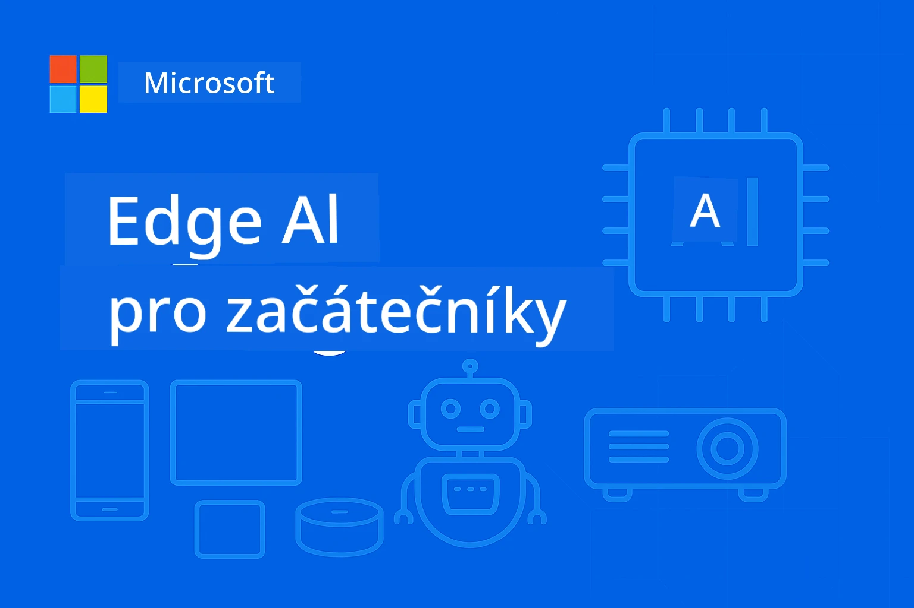

# EdgeAI pro začátečníky 




[](https://GitHub.com/microsoft/edgeai-for-beginners/graphs/contributors)
[](https://GitHub.com/microsoft/edgeai-for-beginners/issues)
[](https://GitHub.com/microsoft/edgeai-for-beginners/pulls)
[](http://makeapullrequest.com)

[](https://GitHub.com/microsoft/edgeai-for-beginners/watchers)
[](https://GitHub.com/microsoft/edgeai-for-beginners/fork)
[](https://GitHub.com/microsoft/edgeai-for-beginners/stargazers)


[](https://discord.gg/nTYy5BXMWG)

Postupujte podle těchto kroků, abyste začali používat tyto zdroje:

1. **Rozvětvěte (fork) repozitář**: Klikněte na [](https://GitHub.com/microsoft/edgeai-for-beginners/fork)
2. **Naklonujte repozitář**:   `git clone https://github.com/microsoft/edgeai-for-beginners.git`
3. [**Připojte se k Azure AI Foundry Discord a setkejte se s odborníky a dalšími vývojáři**](https://discord.com/invite/ByRwuEEgH4)


### 🌐 Vícejazyčná podpora

#### Podporováno přes GitHub Action (automatizovaně a vždy aktuální)

<!-- CO-OP TRANSLATOR LANGUAGES TABLE START -->
[Arabština](../ar/README.md) | [Bengálština](../bn/README.md) | [Bulharština](../bg/README.md) | [Barmština (Myanmar)](../my/README.md) | [Čínština (zjednodušená)](../zh-CN/README.md) | [Čínština (tradiční, Hongkong)](../zh-HK/README.md) | [Čínština (tradiční, Macao)](../zh-MO/README.md) | [Čínština (tradiční, Tchaj-wan)](../zh-TW/README.md) | [Chorvatština](../hr/README.md) | [Čeština](./README.md) | [Dánština](../da/README.md) | [Nizozemština](../nl/README.md) | [Estonština](../et/README.md) | [Finština](../fi/README.md) | [Francouzština](../fr/README.md) | [Němčina](../de/README.md) | [Řečtina](../el/README.md) | [Hebrejština](../he/README.md) | [Hindština](../hi/README.md) | [Maďarština](../hu/README.md) | [Indonéština](../id/README.md) | [Italština](../it/README.md) | [Japonština](../ja/README.md) | [Kannadština](../kn/README.md) | [Korejština](../ko/README.md) | [Litevština](../lt/README.md) | [Malajština](../ms/README.md) | [Malajálam](../ml/README.md) | [Maráthština](../mr/README.md) | [Nepálština](../ne/README.md) | [Nigerijský pidžin](../pcm/README.md) | [Norština](../no/README.md) | [Perština (Fársí)](../fa/README.md) | [Polština](../pl/README.md) | [Portugalština (Brazílie)](../pt-BR/README.md) | [Portugalština (Portugalsko)](../pt-PT/README.md) | [Paňdžábština (Gurmuchí)](../pa/README.md) | [Rumunština](../ro/README.md) | [Ruština](../ru/README.md) | [Srbština (cyrilice)](../sr/README.md) | [Slovenština](../sk/README.md) | [Slovinština](../sl/README.md) | [Španělština](../es/README.md) | [Svahilština](../sw/README.md) | [Švédština](../sv/README.md) | [Tagalog (filipínština)](../tl/README.md) | [Tamil](../ta/README.md) | [Telugština](../te/README.md) | [Thajština](../th/README.md) | [Turečtina](../tr/README.md) | [Ukrajinština](../uk/README.md) | [Urdu](../ur/README.md) | [Vietnamština](../vi/README.md)

> **Preferujete klonovat lokálně?**

> Tento repozitář obsahuje více než 50 jazykových překladů, což výrazně zvyšuje velikost stahování. Pro klonování bez překladů použijte sparse checkout:
> ```bash
> git clone --filter=blob:none --sparse https://github.com/microsoft/edgeai-for-beginners.git
> cd edgeai-for-beginners
> git sparse-checkout set --no-cone '/*' '!translations' '!translated_images'
> ```
> Tím získáte vše potřebné ke kompletnímu absolvování kurzu s mnohem rychlejším stažením.
<!-- CO-OP TRANSLATOR LANGUAGES TABLE END -->

**Pokud chcete, aby byly podporovány další jazyky překladů, naleznete je [zde](https://github.com/Azure/co-op-translator/blob/main/getting_started/supported-languages.md)**
## Úvod

Vítejte v **EdgeAI pro začátečníky** – vaší komplexní cestě do transformativního světa okrajové umělé inteligence. Tento kurz překlenuje propast mezi výkonnými schopnostmi AI a praktickým nasazením v reálném světě na okrajových zařízeních a umožňuje vám využít potenciál AI přímo tam, kde se data generují a kde je třeba činit rozhodnutí.

### Co zvládnete

Tento kurz vás provede od základních konceptů až po implementace připravené pro výrobu a zahrnuje:
- **Malé jazykové modely (SLM)** optimalizované pro nasazení na okraji
- **Optimalizace s ohledem na hardware** napříč různými platformami
- **Inferenci v reálném čase** s ochranou soukromí
- **Strategie nasazení ve výrobě** pro podnikové aplikace

### Proč je EdgeAI důležité

Edge AI představuje posun paradigmatu, který řeší klíčové moderní výzvy:
- **Soukromí a bezpečnost**: Zpracování citlivých dat lokálně bez vystavení v cloudu
- **Výkon v reálném čase**: Eliminace latence sítí pro časově kritické aplikace
- **Nákladová efektivita**: Snížení nákladů na šířku pásma a cloudové výpočty
- **Odolný provoz**: Zachování funkčnosti během výpadků sítě
- **Soulad s předpisy**: Splnění požadavků na suverenitu dat

### Edge AI

Edge AI znamená spuštění AI algoritmů a jazykových modelů lokálně na hardwaru blízko k místu vzniku dat bez závislosti na cloudových prostředcích pro inferenci. Snižuje to latenci, zvyšuje soukromí a umožňuje rozhodování v reálném čase.

### Základní principy:
- **Inferenci na zařízení**: AI modely běží na okrajových zařízeních (telefony, routery, mikrokontroléry, průmyslové PC)
- **Offline schopnosti**: Funguje bez trvalého připojení k internetu
- **Nízká latence**: Okamžité reakce vhodné pro systémy v reálném čase
- **Suverenita dat**: Citlivá data zůstávají lokálně, což zlepšuje bezpečnost a dodržování předpisů

### Malé jazykové modely (SLM)

SLM jako Phi-4, Mistral-7B a Gemma jsou optimalizované verze větších LLM—trénované nebo destilované pro:
- **Sníženou paměťovou náročnost**: Efektivní využití omezené paměti okrajových zařízení
- **Nižší nároky na výpočetní výkon**: Optimalizované pro výkon CPU a okrajových GPU
- **Rychlejší inicializaci**: Rychlý start pro responzivní aplikace

Odemknou výkonné NLP schopnosti při splnění omezení:
- **Vestavěné systémy**: IoT zařízení a průmyslové kontroléry
- **Mobilní zařízení**: Smartphony a tablety s offline schopnostmi
- **IoT zařízení**: Senzory a chytrá zařízení s omezenými zdroji
- **Okrajové servery**: Lokální výpočetní jednotky s omezenými GPU zdroji
- **Osobní počítače**: Nasazení na desktop a laptop

## Moduly kurzu a navigace

| Modul | Téma | Oblast zaměření | Klíčový obsah | Úroveň | Délka |
|--------|-------|------------|-------------|--------|----------|
| [📖 00 ](./introduction.md) | [Úvod do EdgeAI](./introduction.md) | Základy a kontext | Přehled EdgeAI • Průmyslové aplikace • Úvod do SLM • Výukové cíle | Začátečník | 1-2 hod |
| [📚 01](../../Module01) | [Základy EdgeAI](./Module01/README.md) | Porovnání cloud vs edge AI | Základy EdgeAI • Případové studie z praxe • Průvodce implementací • Nasazení na okraji | Začátečník | 3-4 hod |
| [🧠 02](../../Module02) | [Základy modelů SLM](./Module02/README.md) | Rodiny modelů a architektura | Rodina Phi • Rodina Qwen • Rodina Gemma • BitNET • μModel • Phi-Silica | Začátečník | 4-5 hod |
| [🚀 03](../../Module03) | [Praxe nasazení SLM](./Module03/README.md) | Lokální a cloudové nasazení | Pokročilé učení • Lokální prostředí • Nasazení v cloudu | Středně pokročilý | 4-5 hod |
| [⚙️ 04](../../Module04) | [Nástroje pro optimalizaci modelů](./Module04/README.md) | Optimalizace napříč platformami | Úvod • Llama.cpp • Microsoft Olive • OpenVINO • Apple MLX • Syntéza workflow | Středně pokročilý | 5-6 hod |
| [🔧 05](../../Module05) | [SLMOps ve výrobě](./Module05/README.md) | Provoz ve výrobě | Úvod do SLMOps • Destilace modelů • Doladění • Nasazení ve výrobě | Pokročilý | 5-6 hod |
| [🤖 06](../../Module06) | [AI agenti a volání funkcí](./Module06/README.md) | Rámce agentů a MCP | Úvod do agentů • Volání funkcí • Protokol kontextu modelu | Pokročilý | 4-5 hod |
| [💻 07](../../Module07) | [Implementace platformy](./Module07/README.md) | Ukázky napříč platformami | AI Toolkit • Foundry Local • Vývoj pro Windows | Pokročilý | 3-4 hod |
| [🏭 08](../../Module08) | [Foundry Local Toolkit](./Module08/README.md) | Ukázky připravené pro výrobu | Ukázkové aplikace (detailně níže) | Expert | 8-10 hod |

### 🏭 **Modul 08: Ukázkové aplikace**

- [01: Rychlý start REST chatu](./Module08/samples/01/README.md)
- [02: Integrace OpenAI SDK](./Module08/samples/02/README.md)
- [03: Objevování modelů & benchmark](./Module08/samples/03/README.md)
- [04: Chainlit RAG aplikace](./Module08/samples/04/README.md)
- [05: Orchestrace multi-agentů](./Module08/samples/05/README.md)
- [06: Router modelů jako nástrojů](./Module08/samples/06/README.md)
- [07: Přímý API klient](./Module08/samples/07/README.md)
- [08: Chat aplikace Windows 11](./Module08/samples/08/README.md)
- [09: Pokročilý multi-agentní systém](./Module08/samples/09/README.md)
- [10: Framework Foundry nástrojů](./Module08/samples/10/README.md)

### 🎓 **Workshop: Praktická cesta učení**

Komplexní materiály pro praktický workshop s implementacemi připravenými pro výrobu:

- **[Průvodce workshopem](./Workshop/Readme.md)** - Kompletní výukové cíle, výsledky a navigace zdrojů
- **Python Ukázky** (6 sezení) - Aktualizované podle nejlepších praktik, s ošetřením chyb a dokumentací
- **Jupyter Notebooky** (8 interaktivních) - Krok za krokem tutoriály s benchmarky a sledováním výkonu
- **Průvodci sezeními** - Podrobné markdown průvodce pro každé sezení workshopu
- **Nástroje ověřování** - Skripty pro kontrolu kvality kódu a spuštění smoke testů

**Co vybudujete:**
- Lokální AI chatovací aplikace s podporou streamování
- RAG pipeline s vyhodnocením kvality (RAGAS)
- Benchmarking a porovnání více modelů
- Orchestrace multi-agentních systémů
- Inteligentní směrování modelů s výběrem podle úkolu

### 🎙️ **Workshop pro Agentic: Hands-On - AI Podcast Studio**

Vytvořte produkční pipeline pro podcast poháněnou AI od základů! Tento intenzivní workshop vás naučí vytvořit kompletní multi-agentní systém, který promění nápady do profesionálních epizod podcastu.
**[🎬 Začněte s workshopem AI Podcast Studia](./WorkshopForAgentic/README.md)**

**Vaše mise**: Spusťte "Future Bytes" — technologický podcast, který je zcela řízen AI agenty, které si sami vytvoříte. Žádné závislosti na cloudu, žádné náklady na API — vše běží lokálně na vašem počítači.

**Co dělá tento projekt jedinečným:**
- **🤖 Skutečná multi-agentní orchestrací** - Vytvořte specializované AI agenty, kteří zkoumají, píší a vytvářejí audio
- **🎯 Kompletní produkční pipeline** - Od výběru tématu až po finální zvukový výstup podcastu
- **💻 100% lokální nasazení** - Používá Ollama a lokální modely (Qwen-3-8B) pro úplné soukromí a kontrolu
- **🎤 Integrace text-na-řeč** - Přeměňte scénáře na přirozeně znějící konverzace vícero mluvčích
- **✋ Pracovní postupy s lidským zásahem** - Schvalovací brány zabezpečí kvalitu při zachování automatizace

**Tříaktová učební cesta:**

| Akt | Zaměření | Klíčové dovednosti | Doba trvání |
|-----|----------|--------------------|-------------|
| **[Akt 1: Seznamte se se svými AI asistenty](./WorkshopForAgentic/md/01.BuildAIAgentWithSLM.md)** | Vytvořte svého prvního AI agenta | Integrace nástrojů • Webové vyhledávání • Řešení problémů • Agentní uvažování | 2-3 hod |
| **[Akt 2: Sestavte svůj produkční tým](./WorkshopForAgentic/md/02.AIAgentOrchestrationAndWorkflows.md)** | Orchestrace více agentů | Koordinace týmu • Schvalovací pracovní postupy • Rozhraní DevUI • Lidský dohled | 3-4 hod |
| **[Akt 3: Oživte svůj podcast](./WorkshopForAgentic/md/03.Multi-SpeakerPodcastGenerationWithVibeVoice.md)** | Generování zvuku podcastu | Text-na-řeč • Syntéza více mluvčích • Dlouhé audio • Plná automatizace | 2-3 hod |

**Použité technologie:**
- **Microsoft Agent Framework** - Orchestrace a koordinace více agentů
- **Ollama** - Lokální runtime AI modelů (bez potřeby cloudu)
- **Qwen-3-8B** - Open-source jazykový model optimalizovaný pro agentní úkoly
- **Text-to-Speech API** - Přirozená syntéza hlasu pro tvorbu podcastů

**Podpora hardwaru:**
- ✅ **Režim CPU** - Funguje na každém moderním počítači (doporučeno 8GB+ RAM)
- 🚀 **GPU akcelerace** - Výrazné zrychlení inference s NVIDIA/AMD GPU
- ⚡ **Podpora NPU** - Akcelerace nově generovaných neuronových procesorů

**Ideální pro:**
- Vývojáře učící se multi-agentní AI systémy
- Každého, koho zajímá AI automatizace a pracovní postupy
- Tvůrce obsahu zkoumající AI asistovanou produkci
- Studentů studujících praktické vzory AI orchestrací

**Začněte stavět**: [🎙️ Workshop AI Podcast Studia →](./WorkshopForAgentic/README.md)

### 📊 **Souhrn učební cesty**
- **Celková doba**: 36-45 hodin
- **Cesta pro začátečníky**: Moduly 01-02 (7-9 hodin)  
- **Středně pokročilá cesta**: Moduly 03-04 (9-11 hodin)
- **Pokročilá cesta**: Moduly 05-07 (12-15 hodin)
- **Cesta experta**: Modul 08 (8-10 hodin)

## Co vytvoříte

### 🎯 Základní dovednosti
- **Edge AI Architektura**: Navrhování systémů AI upřednostňujících lokální běh s integrací cloudu
- **Optimalizace modelů**: Kvantizace a komprese modelů pro deployment na okraji sítě (85% zrychlení, 75% zmenšení velikosti)
- **Multi-platformní nasazení**: Windows, mobilní zařízení, embedded a hybridní cloud-edge systémy
- **Produkční operace**: Monitorování, škálování a údržba Edge AI v produkci

### 🏗️ Praktické projekty
- **Foundry Local Chat aplikace**: Nativní aplikace Windows 11 s přepínáním modelů
- **Multi-agentní systémy**: Koordinátor se specialisty pro složité pracovní postupy  
- **RAG aplikace**: Lokální zpracování dokumentů s vyhledáváním ve vektorech
- **Model Routers**: Inteligentní výběr modelů na základě analýzy úkolu
- **API Frameworky**: Produkčně připravení klienti se streamováním a monitorováním zdraví
- **Nástroje cross-platform**: Integrační vzory LangChain/Semantic Kernel

### 🏢 Aplikace v průmyslu
**Výroba** • **Zdravotnictví** • **Autonomní vozidla** • **Chytrá města** • **Mobilní aplikace**

## Rychlý start

**Doporučená učební cesta** (20-30 hodin celkem):

0. **📖 Úvod** ([Introduction.md](./introduction.md)): Základy EdgeAI + průmyslový kontext + učební rámec
1. **📚 Základy** (Moduly 01-02): Koncepty EdgeAI + rodiny modelů SLM
2. **⚙️ Optimalizace** (Moduly 03-04): Deployment + kvantizační rámce  
3. **🚀 Produkce** (Moduly 05-06): SLMOps + AI agenti + volání funkcí
4. **💻 Implementace** (Moduly 07-08): Ukázky platforem + nástroje Foundry Local

Každý modul obsahuje teorii, praktická cvičení a produkčně připravené ukázky kódu.

## Kariérní dopad

**Technické role**: Architekt řešení EdgeAI • ML inženýr (Edge) • IoT AI vývojář • Mobilní AI vývojář

**Průmyslová odvětví**: Výroba 4.0 • Zdravotnické technologie • Autonomní systémy • FinTech • Spotřební elektronika

**Portfolio projektů**: Multi-agentní systémy • Produkční RAG aplikace • Cross-platform nasazení • Optimalizace výkonu

## Struktura repozitáře

```
edgeai-for-beginners/
├── 📖 introduction.md  # Foundation: EdgeAI Overview & Learning Framework
├── 📚 Module01-04/     # Fundamentals → SLMs → Deployment → Optimization  
├── 🔧 Module05-06/     # SLMOps → AI Agents → Function Calling
├── 💻 Module07/        # Platform Samples (VS Code, Windows, Jetson, Mobile)
├── 🏭 Module08/        # Foundry Local Toolkit + 10 Comprehensive Samples
│   ├── samples/01-06/  # Foundation: REST, SDK, RAG, Agents, Routing
│   └── samples/07-10/  # Advanced: API Client, Windows App, Enterprise Agents, Tools
├── 🌐 translations/    # Multi-language support (8+ languages)
└── 📋 STUDY_GUIDE.md   # Structured learning paths & time allocation
```

## Hlavní body kurzu

✅ **Postupné učení**: Teorie → Praxe → Produkční nasazení  
✅ **Skutečné případové studie**: Microsoft, Japan Airlines, podnikové implementace  
✅ **Praktické ukázky**: 50+ příkladů, 10 komplexních demonstračních projektů Foundry Local  
✅ **Zaměření na výkon**: 85% zlepšení rychlosti, 75% snížení velikosti  
✅ **Multi-platformní**: Windows, mobil, embedded, cloud-edge hybrid  
✅ **Připraveno pro produkci**: Monitorování, škálování, bezpečnost, rámce souladu

📖 **[Studijní průvodce k dispozici](STUDY_GUIDE.md)**: Strukturovaná 20hodinová učební cesta s doporučením časového rozvržení a nástroji pro sebehodnocení.

---

**EdgeAI představuje budoucnost nasazení AI**: prioritně lokální, zachovávající soukromí a efektivní. Ovládněte tyto dovednosti k vytvoření další generace inteligentních aplikací.

## Další kurzy

Náš tým vytváří i další kurzy! Podívejte se na:

<!-- CO-OP TRANSLATOR OTHER COURSES START -->
### LangChain
[](https://aka.ms/langchain4j-for-beginners)
[](https://aka.ms/langchainjs-for-beginners?WT.mc_id=m365-94501-dwahlin)
[](https://github.com/microsoft/langchain-for-beginners?WT.mc_id=m365-94501-dwahlin)
---

### Azure / Edge / MCP / Agents
[](https://github.com/microsoft/AZD-for-beginners?WT.mc_id=academic-105485-koreyst)
[](https://github.com/microsoft/edgeai-for-beginners?WT.mc_id=academic-105485-koreyst)
[](https://github.com/microsoft/mcp-for-beginners?WT.mc_id=academic-105485-koreyst)
[](https://github.com/microsoft/ai-agents-for-beginners?WT.mc_id=academic-105485-koreyst)

---
 
### Generativní AI série
[](https://github.com/microsoft/generative-ai-for-beginners?WT.mc_id=academic-105485-koreyst)
[-9333EA?style=for-the-badge&labelColor=E5E7EB&color=9333EA)](https://github.com/microsoft/Generative-AI-for-beginners-dotnet?WT.mc_id=academic-105485-koreyst)
[-C084FC?style=for-the-badge&labelColor=E5E7EB&color=C084FC)](https://github.com/microsoft/generative-ai-for-beginners-java?WT.mc_id=academic-105485-koreyst)
[-E879F9?style=for-the-badge&labelColor=E5E7EB&color=E879F9)](https://github.com/microsoft/generative-ai-with-javascript?WT.mc_id=academic-105485-koreyst)

---
 
### Základní vzdělání
[](https://aka.ms/ml-beginners?WT.mc_id=academic-105485-koreyst)
[](https://aka.ms/datascience-beginners?WT.mc_id=academic-105485-koreyst)
[](https://aka.ms/ai-beginners?WT.mc_id=academic-105485-koreyst)
[](https://github.com/microsoft/Security-101?WT.mc_id=academic-96948-sayoung)
[](https://aka.ms/webdev-beginners?WT.mc_id=academic-105485-koreyst)
[](https://aka.ms/iot-beginners?WT.mc_id=academic-105485-koreyst)
[](https://github.com/microsoft/xr-development-for-beginners?WT.mc_id=academic-105485-koreyst)

---
 
### Copilot série
[](https://aka.ms/GitHubCopilotAI?WT.mc_id=academic-105485-koreyst)
[](https://github.com/microsoft/mastering-github-copilot-for-dotnet-csharp-developers?WT.mc_id=academic-105485-koreyst)
[](https://github.com/microsoft/CopilotAdventures?WT.mc_id=academic-105485-koreyst)
<!-- CO-OP TRANSLATOR OTHER COURSES END -->

## Získání pomoci

Pokud se zaseknete nebo máte nějaké otázky ohledně vytváření AI aplikací, přidejte se:

[](https://discord.gg/nTYy5BXMWG)

Pokud máte zpětnou vazbu k produktu nebo narazíte na chyby během vývoje navštivte:

[](https://aka.ms/foundry/forum)

---

<!-- CO-OP TRANSLATOR DISCLAIMER START -->
**Prohlášení o vyloučení odpovědnosti**:  
Tento dokument byl přeložen pomocí AI překladatelské služby [Co-op Translator](https://github.com/Azure/co-op-translator). I když usilujeme o přesnost, mějte prosím na paměti, že automatické překlady mohou obsahovat chyby nebo nepřesnosti. Původní dokument v jeho mateřském jazyce by měl být považován za autoritativní zdroj. Pro důležité informace se doporučuje profesionální lidský překlad. Nepřebíráme odpovědnost za jakákoliv nepochopení nebo mylné výklady vyplývající z použití tohoto překladu.
<!-- CO-OP TRANSLATOR DISCLAIMER END -->