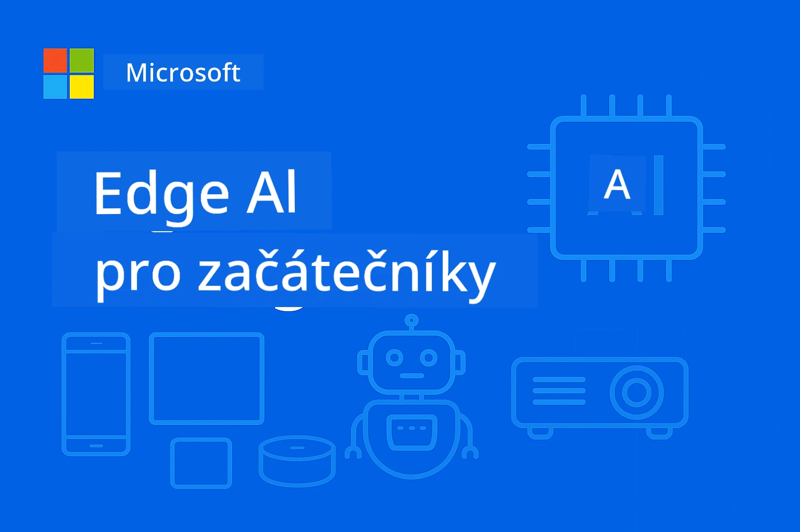

# EdgeAI pro začátečníky




[](https://GitHub.com/microsoft/edgeai-for-beginners/graphs/contributors)
[](https://GitHub.com/microsoft/edgeai-for-beginners/issues)
[](https://GitHub.com/microsoft/edgeai-for-beginners/pulls)
[](http://makeapullrequest.com)

[](https://GitHub.com/microsoft/edgeai-for-beginners/watchers)
[](https://GitHub.com/microsoft/edgeai-for-beginners/fork)
[](https://GitHub.com/microsoft/edgeai-for-beginners/stargazers)


[](https://discord.gg/nTYy5BXMWG)

Postupujte podle těchto kroků, abyste mohli začít používat tyto zdroje:

1. **Rozvětvěte úložiště**: Klikněte na [](https://GitHub.com/microsoft/edgeai-for-beginners/fork)
2. **Naklonujte úložiště**:   `git clone https://github.com/microsoft/edgeai-for-beginners.git`
3. [**Přidejte se na Azure AI Foundry Discord a setkejte se s odborníky a dalšími vývojáři**](https://discord.com/invite/ByRwuEEgH4)


### 🌐 Podpora více jazyků

#### Podporováno pomocí GitHub Action (automatické a vždy aktuální)

<!-- CO-OP TRANSLATOR LANGUAGES TABLE START -->
[Arabština](../ar/README.md) | [Bengálština](../bn/README.md) | [Bulharština](../bg/README.md) | [Barmština (Myanmar)](../my/README.md) | [Čínština (zjednodušená)](../zh-CN/README.md) | [Čínština (tradiční, Hong Kong)](../zh-HK/README.md) | [Čínština (tradiční, Macao)](../zh-MO/README.md) | [Čínština (tradiční, Tchaj-wan)](../zh-TW/README.md) | [Chorvatština](../hr/README.md) | [Čeština](./README.md) | [Dánština](../da/README.md) | [Nizozemština](../nl/README.md) | [Estonština](../et/README.md) | [Finština](../fi/README.md) | [Francouzština](../fr/README.md) | [Němčina](../de/README.md) | [Řečtina](../el/README.md) | [Hebrejština](../he/README.md) | [Hindština](../hi/README.md) | [Maďarština](../hu/README.md) | [Indonéština](../id/README.md) | [Italština](../it/README.md) | [Japonština](../ja/README.md) | [Kannadština](../kn/README.md) | [Khmerština](../km/README.md) | [Korejština](../ko/README.md) | [Litevština](../lt/README.md) | [Malajština](../ms/README.md) | [Malajálam](../ml/README.md) | [Maráthština](../mr/README.md) | [Nepálština](../ne/README.md) | [Nigérijská pidžinština](../pcm/README.md) | [Norština](../no/README.md) | [Perština (Farsí)](../fa/README.md) | [Polština](../pl/README.md) | [Portugalština (Brazílie)](../pt-BR/README.md) | [Portugalština (Portugalsko)](../pt-PT/README.md) | [Paňdžábština (Gurmukhí)](../pa/README.md) | [Rumunština](../ro/README.md) | [Ruština](../ru/README.md) | [Srbština (cyrilice)](../sr/README.md) | [Slovenština](../sk/README.md) | [Slovinština](../sl/README.md) | [Španělština](../es/README.md) | [Svahilština](../sw/README.md) | [Švédština](../sv/README.md) | [Tagalog (filipínština)](../tl/README.md) | [Tamilština](../ta/README.md) | [Telugština](../te/README.md) | [Thajština](../th/README.md) | [Turečtina](../tr/README.md) | [Ukrajinština](../uk/README.md) | [Urdu](../ur/README.md) | [Vietnamština](../vi/README.md)

> **Preferujete lokální klonování?**
>
> Toto úložiště obsahuje více než 50 překladů jazyků, což výrazně zvětšuje velikost stahování. Pro klonování bez překladů použijte sparse checkout:
>
> **Bash / macOS / Linux:**
> ```bash
> git clone --filter=blob:none --sparse https://github.com/microsoft/edgeai-for-beginners.git
> cd edgeai-for-beginners
> git sparse-checkout set --no-cone '/*' '!translations' '!translated_images'
> ```
>
> **CMD (Windows):**
> ```cmd
> git clone --filter=blob:none --sparse https://github.com/microsoft/edgeai-for-beginners.git
> cd edgeai-for-beginners
> git sparse-checkout set --no-cone "/*" "!translations" "!translated_images"
> ```
>
> Toto vám poskytne vše potřebné ke zdárnému dokončení kurzu s výrazně rychlejším stahováním.
<!-- CO-OP TRANSLATOR LANGUAGES TABLE END -->

**Pokud si přejete mít podporu dalších jazyků překladů, jsou uvedeny [zde](https://github.com/Azure/co-op-translator/blob/main/getting_started/supported-languages.md)**
## Úvod

Vítejte v **EdgeAI pro začátečníky** – vaší komplexní cestě do transformačního světa Edge umělé inteligence. Tento kurz přemosťuje propast mezi výkonnými AI schopnostmi a praktickým, reálným nasazením na edge zařízeních, čímž vám umožňuje využívat potenciál AI přímo tam, kde jsou generována data a je třeba činit rozhodnutí.

### Co zvládnete

Tento kurz vás provede od základních pojmů až po implementace vhodné pro produkci, zahrnující:
- **Malé jazykové modely (SLM)** optimalizované pro edge nasazení
- **Optimalizaci s ohledem na hardware** na různých platformách
- **Inferenci v reálném čase** s funkcemi ochrany soukromí
- **Strategie produkčního nasazení** pro podnikové aplikace

### Proč je EdgeAI důležitý

Edge AI představuje paradigmatický posun, který řeší zásadní současné výzvy:
- **Soukromí a bezpečnost**: Zpracování citlivých dat lokálně bez vystavení cloudu
- **Výkon v reálném čase**: Odstranění latence sítě pro aplikace kritické na čas
- **Nákladová efektivita**: Snížení nákladů na šířku pásma a cloudové výpočty
- **Odolný provoz**: Udržení funkčnosti během výpadků sítě
- **Soulad s předpisy**: Splnění požadavků na suverenitu dat

### Edge AI

Edge AI znamená provoz AI algoritmů a jazykových modelů lokálně na hardwaru, blízko místa generování dat, bez závislosti na cloudových zdrojích pro inferenční výpočty. Snižuje latenci, zvyšuje soukromí a umožňuje rozhodování v reálném čase.

### Základní principy:
- **Inferenci na zařízení**: AI modely běží na edge zařízeních (telefony, routery, mikrokontroléry, průmyslové PC)
- **Offline schopnost**: Funguje bez trvalého připojení k internetu
- **Nízka latence**: Okamžité reakce vhodné pro systémy v reálném čase
- **Suverenita dat**: Udržuje citlivá data lokálně, zlepšuje bezpečnost a soulad s předpisy

### Malé jazykové modely (SLM)

SLM jako Phi-4, Mistral-7B a Gemma jsou optimalizované verze větších LLM—trénované nebo destilované pro:
- **Sníženou paměťovou náročnost**: Efektivní využití omezené paměti edge zařízení
- **Nižší požadavky na výpočetní výkon**: Optimalizované pro CPU a edge GPU výkon
- **Rychlejší spuštění**: Rychlá inicializace pro citlivé aplikace

Odemykají výkonné schopnosti NLP a zároveň splňují omezení:
- **Vestavěné systémy**: IoT zařízení a průmyslové kontroléry
- **Mobilní zařízení**: Smartphony a tablety s offline možnostmi
- **IoT zařízení**: Senzory a chytrá zařízení s omezenými zdroji
- **Edge servery**: Lokální výpočetní jednotky s omezenými GPU zdroji
- **Osobní počítače**: Scénáře nasazení na desktopu a notebooku

## Moduly kurzu a navigace

| Modul | Téma | Oblast zaměření | Klíčový obsah | Úroveň | Délka |
|--------|-------|-----------------|---------------|--------|--------|
| [📖 00 ](./introduction.md) | [Úvod do EdgeAI](./introduction.md) | Základy a kontext | Přehled EdgeAI • Průmyslové aplikace • Úvod do SLM • Výukové cíle | Začátečník | 1-2 hodiny |
| [📚 01](../../Module01) | [Základy EdgeAI](./Module01/README.md) | Porovnání cloud vs Edge AI | Základy EdgeAI • Případové studie z praxe • Průvodce implementací • Edge nasazení | Začátečník | 3-4 hodiny |
| [🧠 02](../../Module02) | [Základy modelů SLM](./Module02/README.md) | Rodiny modelů a architektura | Rodina Phi • Rodina Qwen • Rodina Gemma • BitNET • μModel • Phi-Silica | Začátečník | 4-5 hodin |
| [🚀 03](../../Module03) | [Praxe nasazení SLM](./Module03/README.md) | Lokální a cloudové nasazení | Pokročilé učení • Lokální prostředí • Cloudové nasazení | Středně pokročilý | 4-5 hodin |
| [⚙️ 04](../../Module04) | [Nástroje optimalizace modelů](./Module04/README.md) | Optimalizace napříč platformami | Úvod • Llama.cpp • Microsoft Olive • OpenVINO • Apple MLX • Syntéza pracovních postupů | Středně pokročilý | 5-6 hodin |
| [🔧 05](../../Module05) | [SLMOps produkce](./Module05/README.md) | Produkční provoz | Úvod do SLMOps • Destilace modelů • Doladění • Produkční nasazení | Pokročilý | 5-6 hodin |
| [🤖 06](../../Module06) | [AI agenti a volání funkcí](./Module06/README.md) | Agentní rámce a MCP | Úvod do agentů • Volání funkcí • Protokol kontextu modelu | Pokročilý | 4-5 hodin |
| [💻 07](../../Module07) | [Implementace platformy](./Module07/README.md) | Ukázky napříč platformami | AI nástroje • Foundry Local • Vývoj pro Windows | Pokročilý | 3-4 hodiny |
| [🏭 08](../../Module08) | [Foundry Local Toolkit](./Module08/README.md) | Produkčně připravené ukázky | Ukázkové aplikace (viz níže) | Expert | 8-10 hodin |

### 🏭 **Modul 08: Ukázkové aplikace**

- [01: Rychlý start REST chatu](./Module08/samples/01/README.md)
- [02: Integrace OpenAI SDK](./Module08/samples/02/README.md)
- [03: Objevování modelů a benchmarky](./Module08/samples/03/README.md)
- [04: Aplikace Chainlit RAG](./Module08/samples/04/README.md)
- [05: Orchestrace vícero agentů](./Module08/samples/05/README.md)
- [06: Směrovač Modely-jako-nástroje](./Module08/samples/06/README.md)
- [07: Přímý API klient](./Module08/samples/07/README.md)
- [08: Chat aplikace pro Windows 11](./Module08/samples/08/README.md)
- [09: Pokročilý systém vícero agentů](./Module08/samples/09/README.md)
- [10: Framework Foundry Tools](./Module08/samples/10/README.md)

### 🎓 **Workshop: Praktická cesta učením**

Komplexní materiály pro praktický workshop s produkčně připravenými implementacemi:

- **[Průvodce workshopem](./Workshop/Readme.md)** - Kompletní učební cíle, výsledky a navigace zdrojů
- **Pythonové ukázky** (6 lekcí) - Aktualizovány o nejlepší postupy, ošetření chyb a podrobnou dokumentaci
- **Jupyter Notebooky** (8 interaktivních) - Krok za krokem tutoriály s benchmarky a monitorováním výkonu
- **Průvodci lekcí** - Podrobné markdown návody pro každou lekci workshopu
- **Nástroje pro validaci** - Skripty pro ověření kvality kódu a spuštění smoke testů

**Co vytvoříte:**
- Lokální AI chatovací aplikace s podporou streamování
- RAG pipeline s hodnocením kvality (RAGAS)
- Nástroje pro benchmarkování a porovnávání vícero modelů
- Orchestrace vícero agentů
- Inteligentní směrování modelů s výběrem na základě úkolů

### 🎙️ **Workshop For Agentic: Hands-On - The AI Podcast Studio**
Vybudujte produkční pipeline podcastu poháněného AI od základů! Tento intenzivní workshop vás naučí vytvořit kompletní multiagentní systém, který promění nápady do profesionálních podcastových epizod.

**[🎬 Začněte Workshop AI Podcast Studio](./WorkshopForAgentic/README.md)**

**Vaše mise**: Spusťte "Future Bytes" — technologický podcast plně poháněný AI agenty, které si sami vytvoříte. Žádné závislosti na cloudu, žádné náklady na API — vše běží lokálně na vašem počítači.

**Co dělá tento projekt jedinečným:**
- **🤖 Skutečná multiagentní orchestrací** – Vytvořte specializované AI agenty, kteří zkoumají, píší a produkují audio
- **🎯 Kompletní produkční pipeline** – Od výběru tématu až po finální podcastový audio výstup
- **💻 100 % lokální nasazení** – Používá Ollama a lokální modely (Qwen-3-8B) pro plnou ochranu soukromí a kontrolu
- **🎤 Integrace text-řeč** – Převádí scénáře do přirozeně znějících rozhovorů s více mluvčími
- **✋ Pracovní postupy s lidským dohledem** – Schvalovací brány zajišťují kvalitu a zároveň udržují automatizaci

**Výuková cesta ve třech aktech:**

| Akt | Zaměření | Klíčové dovednosti | Délka |
|-----|----------|--------------------|-------|
| **[Akt 1: Seznamte se se svými AI asistenty](./WorkshopForAgentic/md/01.BuildAIAgentWithSLM.md)** | Vytvořte svého prvního AI agenta | Integrace nástrojů • Webové vyhledávání • Řešení problémů • Agentiální uvažování | 2-3 hodiny |
| **[Akt 2: Sestavte svůj produkční tým](./WorkshopForAgentic/md/02.AIAgentOrchestrationAndWorkflows.md)** | Orchestrace více agentů | Koordinace týmu • Schvalovací workflow • Uživatelské rozhraní DevUI • Lidský dohled | 3-4 hodiny |
| **[Akt 3: Oživte svůj podcast](./WorkshopForAgentic/md/03.Multi-SpeakerPodcastGenerationWithVibeVoice.md)** | Generování audio podcastu | Text-řeč • Vícehlasá syntéza • Dlouhé formáty audia • Plná automatizace | 2-3 hodiny |

**Použité technologie:**
- **Microsoft Agent Framework** – Orchestrace a koordinace multiagentního systému
- **Ollama** – Lokální runtime AI modelů (není potřeba cloud)
- **Qwen-3-8B** – Open-source jazykový model optimalizovaný pro agentní úkoly
- **API pro text-řeč** – Přirozená syntéza hlasu pro generování podcastů

**Podpora hardwaru:**
- ✅ **Režim CPU** – Funguje na jakémkoli moderním počítači (doporučeno 8 GB+ RAM)
- 🚀 **Akcelerace GPU** – Výrazně rychlejší inference s NVIDIA/AMD GPU
- ⚡ **Podpora NPU** – Akcelerace na generaci neuronových procesorů

**Ideální pro:**
- Vývojáře učící se multiagentní AI systémy
- Zájemce o AI automatizaci a workflow
- Tvůrce obsahu zkoumající AI asistovanou produkci
- Studentky a studenty studující praktické vzory AI orchestrací

**Začněte stavět**: [🎙️ Workshop AI Podcast Studio →](./WorkshopForAgentic/README.md)

### 📊 **Souhrn výukové cesty**
- **Celková doba**: 36–45 hodin
- **Cesta pro začátečníky**: Moduly 01-02 (7–9 hodin)  
- **Středně pokročilá cesta**: Moduly 03-04 (9–11 hodin)  
- **Pokročilá cesta**: Moduly 05-07 (12–15 hodin)  
- **Cesta experta**: Modul 08 (8–10 hodin)  

## Co vytvoříte

### 🎯 Klíčové kompetence
- **Edge AI architektura**: Navrhuje lokálně první AI systémy s integrací cloudu
- **Optimalizace modelů**: Kvantizace a komprese modelů pro edge nasazení (85% zrychlení, 75% zmenšení velikosti)
- **Víceplatformní nasazení**: Windows, mobil, vestavěné systémy a hybrid cloud-edge
- **Produkční provoz**: Monitoring, škálování a údržba edge AI v produkci

### 🏗️ Praktické projekty
- **Foundry lokální chat aplikace**: Nativní aplikace Windows 11 s přepínáním modelů
- **Multiagentní systémy**: Koordinátor se specialistickými agenty pro komplexní workflow  
- **RAG aplikace**: Lokální zpracování dokumentů s vektorovým vyhledáváním
- **Modelové routery**: Inteligentní volba modelů podle analýzy úkolu
- **API frameworky**: Produkčně připravené klienty se streamováním a monitoringem zdraví
- **Cross-platform nástroje**: Vzory integrace LangChain/Semantic Kernel

### 🏢 Průmyslové využití
**Výroba** • **Zdravotnictví** • **Autonomní vozidla** • **Chytrá města** • **Mobilní aplikace**

## Rychlý start

**Doporučená výuková cesta** (celkem 20–30 hodin):

0. **📖 Úvod** ([Introduction.md](./introduction.md)): Základy EdgeAI + průmyslový kontext + vzdělávací rámec  
1. **📚 Základy** (Moduly 01-02): Koncepty EdgeAI + rodiny modelů SLM  
2. **⚙️ Optimalizace** (Moduly 03-04): Nasazení + kvantizační frameworky  
3. **🚀 Produkce** (Moduly 05-06): SLMOps + AI agenti + volání funkcí  
4. **💻 Implementace** (Moduly 07-08): Ukázky platformy + Foundry Local toolkit

Každý modul obsahuje teorii, praktická cvičení a produkčně připravené ukázky kódu.

## Kariérní dopad

**Technické role**: Architekt řešení EdgeAI • ML inženýr (Edge) • Vývojář IoT AI • Mobilní AI vývojář

**Průmyslová odvětví**: Výroba 4.0 • Zdravotnická technologie • Autonomní systémy • FinTech • Spotřební elektronika

**Portfolio projektů**: Multiagentní systémy • Produkční RAG aplikace • Cross-platform nasazení • Optimalizace výkonu

## Struktura repozitáře

```
edgeai-for-beginners/
├── 📖 introduction.md  # Foundation: EdgeAI Overview & Learning Framework
├── 📚 Module01-04/     # Fundamentals → SLMs → Deployment → Optimization  
├── 🔧 Module05-06/     # SLMOps → AI Agents → Function Calling
├── 💻 Module07/        # Platform Samples (VS Code, Windows, Jetson, Mobile)
├── 🏭 Module08/        # Foundry Local Toolkit + 10 Comprehensive Samples
│   ├── samples/01-06/  # Foundation: REST, SDK, RAG, Agents, Routing
│   └── samples/07-10/  # Advanced: API Client, Windows App, Enterprise Agents, Tools
├── 🌐 translations/    # Multi-language support (8+ languages)
└── 📋 STUDY_GUIDE.md   # Structured learning paths & time allocation
```

## Klíčové vlastnosti kurzu

✅ **Progresivní učení**: Teorie → praxe → produkční nasazení  
✅ **Reálné případové studie**: Microsoft, Japan Airlines, enterprise implementace  
✅ **Praktické ukázky**: 50+ příkladů, 10 komplexních demonstrací Foundry Local  
✅ **Zaměření na výkon**: 85% zrychlení, 75% zmenšení velikosti  
✅ **Víceplatfromní**: Windows, mobil, embedded, hybrid cloud-edge  
✅ **Produkčně připravený**: Monitoring, škálování, bezpečnost, dodržování pravidel

📖 **[Studijní průvodce k dispozici](STUDY_GUIDE.md)**: Strukturovaná 20hodinová výuková cesta s doporučením časového rozvržení a nástroji pro sebehodnocení.

---

**EdgeAI představuje budoucnost nasazení AI**: lokálně prve, s ochranou soukromí a efektivně. Ovládněte tyto dovednosti a vytvořte další generaci inteligentních aplikací.

## Další kurzy

Náš tým vytváří i další kurzy! Podívejte se na:

<!-- CO-OP TRANSLATOR OTHER COURSES START -->
### LangChain
[](https://aka.ms/langchain4j-for-beginners)
[](https://aka.ms/langchainjs-for-beginners?WT.mc_id=m365-94501-dwahlin)
[](https://github.com/microsoft/langchain-for-beginners?WT.mc_id=m365-94501-dwahlin)
---

### Azure / Edge / MCP / Agents
[](https://github.com/microsoft/AZD-for-beginners?WT.mc_id=academic-105485-koreyst)
[](https://github.com/microsoft/edgeai-for-beginners?WT.mc_id=academic-105485-koreyst)
[](https://github.com/microsoft/mcp-for-beginners?WT.mc_id=academic-105485-koreyst)
[](https://github.com/microsoft/ai-agents-for-beginners?WT.mc_id=academic-105485-koreyst)

---
 
### Generativní AI série
[](https://github.com/microsoft/generative-ai-for-beginners?WT.mc_id=academic-105485-koreyst)
[-9333EA?style=for-the-badge&labelColor=E5E7EB&color=9333EA)](https://github.com/microsoft/Generative-AI-for-beginners-dotnet?WT.mc_id=academic-105485-koreyst)
[-C084FC?style=for-the-badge&labelColor=E5E7EB&color=C084FC)](https://github.com/microsoft/generative-ai-for-beginners-java?WT.mc_id=academic-105485-koreyst)
[-E879F9?style=for-the-badge&labelColor=E5E7EB&color=E879F9)](https://github.com/microsoft/generative-ai-with-javascript?WT.mc_id=academic-105485-koreyst)

---
 
### Základní vzdělání
[](https://aka.ms/ml-beginners?WT.mc_id=academic-105485-koreyst)
[](https://aka.ms/datascience-beginners?WT.mc_id=academic-105485-koreyst)
[](https://aka.ms/ai-beginners?WT.mc_id=academic-105485-koreyst)
[](https://github.com/microsoft/Security-101?WT.mc_id=academic-96948-sayoung)
[](https://aka.ms/webdev-beginners?WT.mc_id=academic-105485-koreyst)
[](https://aka.ms/iot-beginners?WT.mc_id=academic-105485-koreyst)
[](https://github.com/microsoft/xr-development-for-beginners?WT.mc_id=academic-105485-koreyst)

---
 
### Copilot série
[](https://aka.ms/GitHubCopilotAI?WT.mc_id=academic-105485-koreyst)
[](https://github.com/microsoft/mastering-github-copilot-for-dotnet-csharp-developers?WT.mc_id=academic-105485-koreyst)
[](https://github.com/microsoft/CopilotAdventures?WT.mc_id=academic-105485-koreyst)
<!-- CO-OP TRANSLATOR OTHER COURSES END -->

## Získání pomoci

Pokud narazíte na problém nebo máte otázky týkající se vytváření AI aplikací, připojte se:

[](https://discord.gg/nTYy5BXMWG)

Pokud máte zpětnou vazbu k produktu nebo chyby při vývoji, navštivte:

[](https://aka.ms/foundry/forum)

---

<!-- CO-OP TRANSLATOR DISCLAIMER START -->
**Upozornění**:  
Tento dokument byl přeložen pomocí AI překladatelské služby [Co-op Translator](https://github.com/Azure/co-op-translator). I když usilujeme o přesnost, mějte prosím na paměti, že automatizované překlady mohou obsahovat chyby nebo nepřesnosti. Původní dokument v jeho mateřském jazyce by měl být považován za autoritativní zdroj. Pro zásadní informace je doporučeno využít profesionální lidský překlad. Nejsme odpovědni za jakékoli nedorozumění nebo špatné výklady vyplývající z použití tohoto překladu.
<!-- CO-OP TRANSLATOR DISCLAIMER END -->