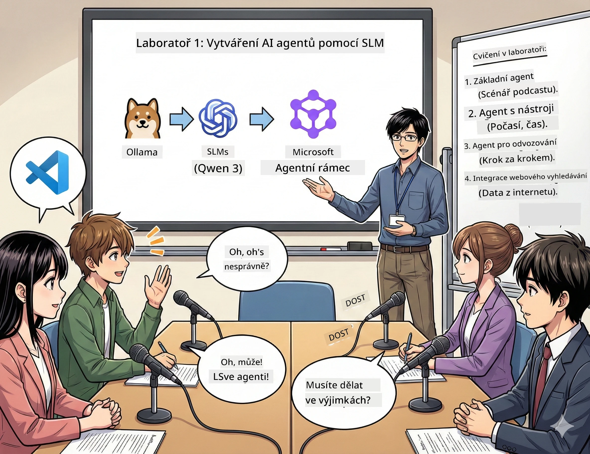

# První akt: Poznej svého AI výzkumného asistenta 🤖

## Výzva

Spouštíš „Budoucí bajty“, svůj nový technologický podcast. První epizoda bude o nejnovějších průlomech v AI, ale máš jen 24 hodin na to:
1. Prozkoumat téma
2. Najít důvěryhodné zdroje
3. Napsat poutavý scénář
4. Udělat, aby to znělo přirozeně

**Zvrat**: Nemusíš to zvládnout sám. Právě budeš budovat svého prvního AI asistenta, který ti může s tím vším pomoci. Nazvěme ho Alex — tvůj nikdy neunavený výzkumný partner, který nikdy nepotřebuje spát.

## Proč zvolit malé jazykové modely? (návnada: jsou super)

Představ si malé jazykové modely (SLM) jako osobní AI běžící *na tvém* počítači. Žádný cloud, žádné měsíční poplatky, žádné podezřelé sdílení dat.

**Proč jsou SLM tak 🔥:**
- **🏠 Běží na tvém stroji**: notebook, desktop nebo dokonce výkonný Raspberry Pi
- **💸 Žádné průběžné náklady**: žádné API poplatky, které by žraly tvůj kapesné
- **🔒 Priorita soukromí**: tvá data nikdy neopustí tvé zařízení
- **⚡ Bleskurychlé**: žádné síťové zpoždění, okamžitá odezva
- **🪦 Lehký váha**: 1-10 miliard parametrů oproti 100 miliardám a více u velkých modelů

**Populární SLM**: Qwen 3, Phi-4, Gemma 3 (v tomto workshopu používáme Qwen)

## Tvůj nástrojový balíček

### Ollama: tvůj správce AI modelů

[Ollama](https://ollama.com/) je jako Steam pro AI modely. Pomocí jednoduchých příkazů stahuj, spouštěj a spravuj modely.

**Co je na tom skvělé:**
- Stačí jeden příkaz ke stažení a spuštění jakéhokoliv modelu
- Funguje na Macu, Windows i Linuxu
- Pokud máš GPU, automaticky ho využije
- Extrémně úsporné na paměť

### Microsoft Agent Framework: místo, kde se děje kouzlo

[Microsoft Agent Framework](https://github.com/microsoft/agent-framework) je tvůj hřiště pro stavbu AI agentů, kteří:

- 💬 Povídají si a pamatují si, o čem mluvíte
- 🛠️ Používají vlastní nástroje (např. hledání na webu nebo kontrola počasí)
- 🧠 Postupně řeší složité problémy
- 🤝 Spolupracují jako tým s dalšími agenty
- 🔌 Připojují se k různým poskytovatelům AI (OpenAI, Ollama, Azure)

**Stavěcí bloky:**
- **Agenti**: AI asistenti s konkrétními úkoly
- **Nástroje**: speciální schopnosti, které jim dáš
- **Paměť**: aby nezapomněli váš rozhovor
- **Uvažování**: naučit je přemýšlet, nejen reagovat

## Tvůj tréninkový montáž: 4 úkoly

### Úkol 1: Vytvoř svého prvního agenta

📓 [Otevři notebook](../../code/01.BasicAgent/00.BasicAgent-agent.ipynb)

**Úkol**: Postav Alexa, svého AI pro psaní podcastových scénářů. Alex musí vygenerovat dialog dvou moderátorů diskutujících o technologických tématech.

**Naučíš se:**
- Jak probudit AI agenta (snazší, než vstát v pondělí)
- Dát mu osobnost a instrukce
- Nechat ho generovat autentický podcastový scénář
- Porozumět tomu, co ti odpovídá

**Výhra**: Alex vytvoří scénář pro pilotní díl tvého „Budoucího bajtu“ o AI! 🎯

### Úkol 2: Dej Alexovi super schopnosti (nástroje!)

📓 [Otevři notebook](../../code/01.BasicAgent/01.BasicAgent-tools.ipynb)

**Úkol**: Alex je chytrý, ale neví, jaké je dnes počasí nebo kolik je hodin. Vyřešíme to tím, že mu dáme nástroje!

**Naučíš se:**
- Vytvořit vlastní Python funkce jako „nástroje“
- Nechat Alexa rozhodnout, *kdy* který nástroj použít
- Pozorovat, jak samostatně řeší problémy
- Kombinovat více nástrojů k dokončení složitých úkolů

**Výhra**: Zeptáš se „Jaké je počasí v Tokiu?“ a Alex sám najde odpověď! ☁️

### Úkol 3: Nauč Alexa přemýšlet

📓 [Otevři notebook](../../code/01.BasicAgent/02.BasicAgent-reasoning.ipynb)

**Úkol**: Nech Alexa ukázat svůj pracovní postup. Když řeší problém, chceš vidět, *jak* přemýšlí, ne jen odpověď.

**Naučíš se:**
- Aktivovat „režim uvažování“ (jako když na matice ukazuješ postup)
- Vidět postupné myšlenkové kroky Alexa
- Pochopit prompt pro řetězec uvažování
- Ladit, když je Alex zmatený

**Výhra**: Zeptej se na složitý matematický problém a sleduj, jak nad ním Alex přemýšlí! 🧠

### Úkol 4: Připoj Alexa k internetu

📓 [Otevři notebook](../../code/01.BasicAgent/03.BasicAgent-websearch.ipynb)

**Úkol**: Alexa znalosti mají datum expirace. Připoj ho k internetu pro aktuální informace!

**Naučíš se:**
- Stavět vlastní nástroj pro webové vyhledávání
- Integrovat externí API
- Elegantně řešit chyby na síti
- Získat info přesahující tréninková data Alexa

**Výhra**: Zeptej se na dnešní technologické novinky a získej aktuální výsledky! 📰

## Než začneš 🚀

**Povinná výbava**:
- Nainstalovaný Python 3.10+
- Ollama běží (zkontroluj `ollama --version`)
- VS Code s Python rozšířením
- Minimálně 8 GB RAM (pro plynulost raději 16 GB)

## Pořadí úkolů

Dělej notebooky postupně pro plný zážitek:

1. [00.BasicAgent-agent.ipynb](../../code/01.BasicAgent/00.BasicAgent-agent.ipynb) —— Seznam se s Alexem (tvůj první agent)
2. [01.BasicAgent-tools.ipynb](../../code/01.BasicAgent/01.BasicAgent-tools.ipynb) —— Čas na upgrady!
3. [02.BasicAgent-reasoning.ipynb](../../code/01.BasicAgent/02.BasicAgent-reasoning.ipynb) —— Nauč Alexa přemýšlet
4. [03.BasicAgent-websearch.ipynb](../../code/01.BasicAgent/03.BasicAgent-websearch.ipynb) —— Odemkni přístup k internetu!

## Co zvládneš

Po prvním aktu budeš umět:

- ✅ Spustit AI model na vlastním hardware (žádný cloud!)
- ✅ Stavět agenty s vlastní osobností a schopnostmi
- ✅ Dát agentům nástroje k řešení reálných problémů
- ✅ Nechat agenty ukázat svůj proces uvažování
- ✅ Připojit agenty k externím zdrojům dat
- ✅ Ladit, když něco nejde

## Když věci nefungují (a jak je opravit) 🔧

### „Alex se nenačítá! Nestačí paměti!“
**Řešení**: Tvůj počítač má problémy. Zkus zavřít jiné aplikace nebo přepnout na menší model. 8GB RAM je minimum.

### „Alex je moc pomalý“
**Řešení**: Zapni GPU akceleraci v nastavení Ollama. Nebo zmenši velikost kontextového okna. Rychlostní ďábel je tady! 🏎️

### „Nástroje nefungují!“
**Řešení**: Pečlivě zkontroluj signaturu své funkce. Alex potřebuje správné typové nápovědy, aby pochopil, co nástroj dělá. Představ si to jako dát přesné instrukce.

## Užitečné odkazy 🔗

- [Dokumentace Agent Frameworku](https://github.com/microsoft/agent-framework) —— Oficiální průvodce a příklady
- [Knihovna modelů Ollama](https://ollama.com/library) —— Prohlížej všechny dostupné modely
- [Qwen model](https://ollama.com/library/qwen3) —— Poznej mozek svého AI asistenta
- [Ukázky kódu](https://github.com/microsoft/agent-framework/tree/main/python/samples) —— Čerpej inspiraci odsud

## Co dál: Druhý akt 🎬

Máš jednoho agenta. Ale co kdybys měl *tým* agentů pracujících společně? Ve druhém aktu vybuduješ celý produkční tým podcastu:
- **Výzkumný agent**: najde ty nejlepší zdroje
- **Scénáristický agent**: vytvoří perfektní scénář
- **Editor (ty!)**: schválí nebo požádá o úpravy

Pojďme uspořádat trochu AI kouzel!→ [Druhý akt: Sestav svůj produkční tým](02.AIAgentOrchestrationAndWorkflows.md)

---

**Zasekl ses?** Ptej se během workshopu. Učíme se společně! 🙌

---

<!-- CO-OP TRANSLATOR DISCLAIMER START -->
**Prohlášení o vyloučení odpovědnosti**:  
Tento dokument byl přeložen pomocí AI překladatelské služby [Co-op Translator](https://github.com/Azure/co-op-translator). Přestože usilujeme o přesnost, mějte, prosím, na paměti, že automatické překlady mohou obsahovat chyby nebo nepřesnosti. Původní dokument v jeho mateřském jazyce by měl být považován za autoritativní zdroj. Pro důležité informace se doporučuje profesionální lidský překlad. Nepřebíráme odpovědnost za jakákoliv nedorozumění či chybné výklady vzniklé v důsledku použití tohoto překladu.
<!-- CO-OP TRANSLATOR DISCLAIMER END -->