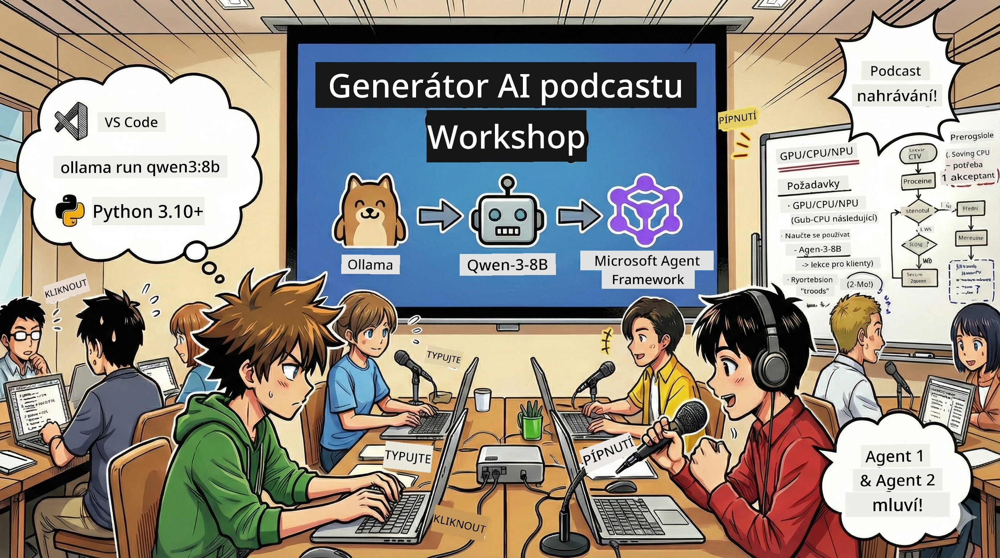

# 🎙️ AI Podcast Studio Workshop



## Tvůj úkol

Vítej v **AI Podcast Studii**! Právě teď spouštíš svůj vlastní technologický podcast „Budoucí Byty“ — ale je tu háček: postavíš tým poháněný AI, který ti pomůže ho vytvořit. Už žádné nekonečné studování, psaní scénářů a úprava audia. Místo toho se díky programování staneš producentem podcastů s AI superschopnostmi.

## Příběhové pozadí

Představ si: ty a kamarádi chcete začít podcast o nejzajímavějších technologických trendech, ale všichni jsou zaneprázdnění učením, prací nebo životem. Co kdybys mohl postavit tým AI inteligencí, které odvedou tu těžkou práci? Jeden inteligent pro výzkum tématu, druhý pro psaní poutavých scénářů, třetí promění text do přirozeného a plynulého rozhovoru. Zní to jako sci-fi? Pojďme z toho udělat realitu.

## Co se naučíš

Na konci tohoto workshopu budeš vědět, jak:
- 🤖 Nasadit vlastní lokální AI model (žádné poplatky za API, žádná závislost na cloudu!)
- 🔧 Vybudovat skutečné, profesionální AI inteligence pracující v týmu
- 🎬 Vytvořit kompletní produkční proces podcastu od nápadu po audio

## Tvá cesta: Tři akty

Stejně jako každý dobrý příběh, máme tři akty. Každý akt postupně buduje tvou AI podcastovou studii:

| Kapitola | Tvůj úkol | Co se stane | Odemknuté dovednosti |
|---------|-----------|--------------|----------------|
| **První akt** | [Poznej své AI asistenty](01.BuildAIAgentWithSLM.md) | Objevíš, jak vytvořit AI inteligence, které mohou chatovat, vyhledávat na internetu, dokonce i řešit problémy. Představ si je jako věčné výzkumné stážisty bez potřeby spánku. | 🎯 Vytvoření tvého prvního agenta<br>🛠️ Dát mu superschopnosti (nástroje!)<br>🧠 Naučit ho myslet<br>🌐 Připojit ho k internetu |
| **Druhý akt** | [Sestav svůj produkční tým](02.AIAgentOrchestrationAndWorkflows.md) | Teď to začne být zajímavé! Budeš orchestrálně koordinovat několik AI inteligencí tak, aby pracovaly jako skutečný podcastový tým. Jeden dělá výzkum, druhý píše, ty kontroluješ – týmová práce plní sny. | 🎭 Koordinace více agentů<br>🔄 Vytváření workflow pro schvalování<br>🖥️ Testování s rozhraním DevUI<br>✋ Udržení lidské kontroly |
| **Třetí akt** | [Oživ svůj podcast](03.Multi-SpeakerPodcastGenerationWithVibeVoice.md) | Finále! Převádíš své textové scénáře do skutečného podcastového audia s realistickými hlasy a přirozenou konverzací. Tvůj podcast „Budoucí Byty“ je připraven publikovat! | 🎤 Kouzlo převodu textu na řeč<br>👥 Hlasy více mluvčích<br>⏱️ Dlouhá formátová audio nahrávka<br>🚀 Plně automatizované |

Každý akt ti otevře nové schopnosti. Pokud máš odvahu, můžeš je projít i mimo pořadí, ale doporučujeme se učit po řadě!

## Požadavky na prostředí

Tento workshop podporuje různá hardwarová prostředí:
- **CPU**: vhodné pro testování a menší použití
- **GPU**: doporučené pro produkční prostředí, výrazné zrychlení inferování
- **NPU**: podpora akcelerace příští generace neuronových procesorů

## Co potřebuješ

### Software ✅
- **Python 3.10+** (tvůj programovací jazyk)
- **Ollama** (běh AI modelů na tvém zařízení)
- **VS Code** (tvůj editor kódu)
- **Rozšíření Python** (dělá VS Code chytřejším)
- **Git** (pro získání kódu)

### Kontrola hardwaru 💻
- **Můžu to spustit?**: 8GB RAM, 10GB volného místa (jde to, ale může být pomalejší)
- **Ideální konfigurace**: 16GB+ RAM a dobrá GPU (plynulý chod!)
- **Máš NPU?**: To je ještě lepší! Odemkni výkon příští generace 🚀

## Vytvoření tvé studia 🎬

### Krok 1: Aktualizuj Python

Ujisti se, že máš Python 3.10 nebo novější:

```bash
python --version
# Měla by být zobrazena verze Python 3.10.x nebo vyšší
```

Nemáš Python? Získej ho na [python.org](https://python.org) — je zdarma!

### Krok 2: Získej Ollamu (tvůj AI model runner)

Navštiv [ollama.ai](https://ollama.ai) a stáhni Ollamu pro svůj operační systém. Představ si ji jako motor, který lokálně spouští AI modely.

Ověř, zda je vše připraveno:

```bash
ollama --version
```

### Krok 3: Stáhni si svůj AI mozek 🧠

Je čas získat model Qwen-3-8B (jako kdybys najímal svého prvního AI asistenta):

```bash
ollama pull qwen3:8b
```

*To může trvat pár minut. Ideální čas na kávu! ☕*

### Krok 4: Nastav VS Code

Pokud ho ještě nemáš, stáhni si [Visual Studio Code](https://code.visualstudio.com/). Je to nejlepší editor kódu (bez debat 😄).

### Krok 5: Rozšíření Python

Ve VS Code:
1. Stiskni `Ctrl+Shift+X` (na Macu `Cmd+Shift+X`)
2. Vyhledej "Python"
3. Nainstaluj oficiální rozšíření od Microsoftu

### Krok 6: Hotovo! 🎉

Opravdu, jsi připraven. Pojďme kouzlit s AI!

### Krok 7: Instalace Microsoft Agent Framework a potřebných balíčků 📦

Nainstaluj všechny závislosti potřebné pro workshop:

```bash
pip install -r ./Installations/requirements.txt -U
```

*To nainstaluje Microsoft Agent Framework a všechny potřebné balíčky. Dej si kávu — první instalace může chvíli trvat! ☕*

## Instrukce workshopu

Podrobná struktura projektu, kroky nastavení a spuštění budou probíhat postupně během workshopu.

## Řešení problémů (když něco nefunguje) 🔧

### „Hej, stahování modelu je příliš pomalé!“
**Řešení**: Použij VPN nebo nakonfiguruj zrcadlo Ollama. Někdy prostě síť není stabilní.

### „Můj počítač to nezvládá! Málo paměti!“
**Řešení**: Přepni na menší model nebo nastav `num_ctx` pro nižší využití paměti. Je to jako dát AI dietu.

### „Můžu to zrychlit na GPU?“
**Řešení**: Ollama automaticky detekuje GPU! Stačí mít aktuální ovladače. Zdarma zrychlení! 🏎️

## Další zdroje (pro zvědavé) 📚

- [Dokumentace Ollama](https://github.com/ollama/ollama) — podrobnosti o lokálních AI modelech
- [Microsoft Agent Framework](https://microsoft.github.io/autogen/) — více o budování týmů inteligencí
- [Info o modelu Qwen](https://qwenlm.github.io/) — poznej mozek svého AI asistenta

## Licence

Licence MIT — stav to, sdílej, zlepšuj svět! 🌍

## Chceš přispět?

Našel jsi chybu? Máš nápad? Otevři Issue nebo PR! Rádi máme komunitní atmosféru. ✨

---

<!-- CO-OP TRANSLATOR DISCLAIMER START -->
**Upozornění**:
Tento dokument byl přeložen pomocí AI překladatelské služby [Co-op Translator](https://github.com/Azure/co-op-translator). Přestože usilujeme o přesnost, mějte prosím na paměti, že automatické překlady mohou obsahovat chyby nebo nepřesnosti. Originální dokument v jeho původním jazyce by měl být považován za autoritativní zdroj. Pro důležité informace se doporučuje profesionální lidský překlad. Nejsme odpovědni za jakékoli nedorozumění nebo chybné výklady vzniklé používáním tohoto překladu.
<!-- CO-OP TRANSLATOR DISCLAIMER END -->