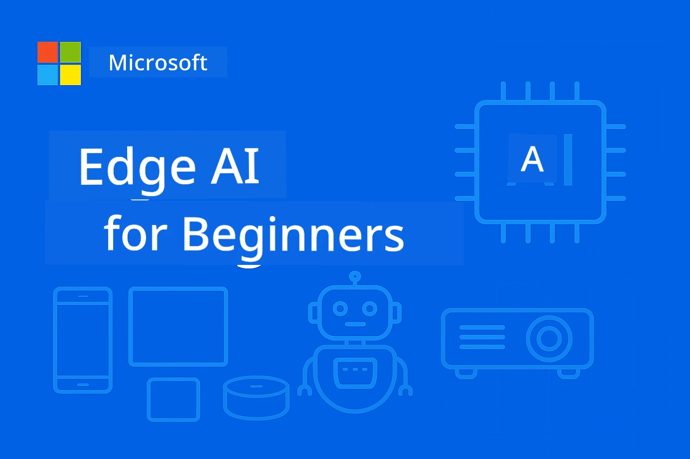

<!--
CO_OP_TRANSLATOR_METADATA:
{
  "original_hash": "ac31463ae3ed21a0ce83b0a351c23dd4",
  "translation_date": "2026-01-05T09:31:16+00:00",
  "source_file": "README.md",
  "language_code": "da"
}
-->
# EdgeAI for Begyndere 




[](https://GitHub.com/microsoft/edgeai-for-beginners/graphs/contributors)
[](https://GitHub.com/microsoft/edgeai-for-beginners/issues)
[](https://GitHub.com/microsoft/edgeai-for-beginners/pulls)
[](http://makeapullrequest.com)

[](https://GitHub.com/microsoft/edgeai-for-beginners/watchers)
[](https://GitHub.com/microsoft/edgeai-for-beginners/fork)
[](https://GitHub.com/microsoft/edgeai-for-beginners/stargazers)


[](https://discord.gg/nTYy5BXMWG)

Følg disse trin for at komme i gang med at bruge disse ressourcer:

1. **Forgren Repositoryet**: Klik [](https://GitHub.com/microsoft/edgeai-for-beginners/fork)
2. **Klon Repositoryet**:   `git clone https://github.com/microsoft/edgeai-for-beginners.git`
3. [**Deltag i Azure AI Foundry Discord og mød eksperter og medudviklere**](https://discord.com/invite/ByRwuEEgH4)


### 🌐 Sprogunderstøttelse

#### Understøttet via GitHub Action (Automatiseret & Altid Opdateret)

<!-- CO-OP TRANSLATOR LANGUAGES TABLE START -->
[Arabic](../ar/README.md) | [Bengali](../bn/README.md) | [Bulgarian](../bg/README.md) | [Burmese (Myanmar)](../my/README.md) | [Chinese (Simplified)](../zh/README.md) | [Chinese (Traditional, Hong Kong)](../hk/README.md) | [Chinese (Traditional, Macau)](../mo/README.md) | [Chinese (Traditional, Taiwan)](../tw/README.md) | [Croatian](../hr/README.md) | [Czech](../cs/README.md) | [Danish](./README.md) | [Dutch](../nl/README.md) | [Estonian](../et/README.md) | [Finnish](../fi/README.md) | [French](../fr/README.md) | [German](../de/README.md) | [Greek](../el/README.md) | [Hebrew](../he/README.md) | [Hindi](../hi/README.md) | [Hungarian](../hu/README.md) | [Indonesian](../id/README.md) | [Italian](../it/README.md) | [Japanese](../ja/README.md) | [Kannada](../kn/README.md) | [Korean](../ko/README.md) | [Lithuanian](../lt/README.md) | [Malay](../ms/README.md) | [Malayalam](../ml/README.md) | [Marathi](../mr/README.md) | [Nepali](../ne/README.md) | [Nigerian Pidgin](../pcm/README.md) | [Norwegian](../no/README.md) | [Persian (Farsi)](../fa/README.md) | [Polish](../pl/README.md) | [Portuguese (Brazil)](../br/README.md) | [Portuguese (Portugal)](../pt/README.md) | [Punjabi (Gurmukhi)](../pa/README.md) | [Romanian](../ro/README.md) | [Russian](../ru/README.md) | [Serbian (Cyrillic)](../sr/README.md) | [Slovak](../sk/README.md) | [Slovenian](../sl/README.md) | [Spanish](../es/README.md) | [Swahili](../sw/README.md) | [Swedish](../sv/README.md) | [Tagalog (Filipino)](../tl/README.md) | [Tamil](../ta/README.md) | [Telugu](../te/README.md) | [Thai](../th/README.md) | [Turkish](../tr/README.md) | [Ukrainian](../uk/README.md) | [Urdu](../ur/README.md) | [Vietnamese](../vi/README.md)

> **Foretrækker du at klone lokalt?**

> Dette repository inkluderer 50+ sprogoversættelser, som betydeligt øger downloadstørrelsen. For at klone uden oversættelser, brug sparse checkout:
> ```bash
> git clone --filter=blob:none --sparse https://github.com/microsoft/edgeai-for-beginners.git
> cd edgeai-for-beginners
> git sparse-checkout set --no-cone '/*' '!translations' '!translated_images'
> ```
> Dette giver dig alt, hvad du behøver for at gennemføre kurset med en meget hurtigere download.
<!-- CO-OP TRANSLATOR LANGUAGES TABLE END -->

**Hvis du ønsker yderligere oversatte sprog understøttes de listet [her](https://github.com/Azure/co-op-translator/blob/main/getting_started/supported-languages.md)**
## Introduktion

Velkommen til **EdgeAI for Begyndere** – din omfattende rejse ind i den transformerende verden af Edge Kunstig Intelligens. Dette kursus bygger bro mellem kraftfulde AI-muligheder og praktisk, virkelighedsnær implementering på edge-enheder, og giver dig mulighed for at udnytte AI's potentiale direkte, hvor data genereres, og beslutninger skal træffes.

### Hvad du vil mestre

Dette kursus tager dig fra grundlæggende koncepter til produktionsklare implementeringer og dækker:
- **Små sprogmodeller (SLMs)** optimeret til edge-udrulning
- **Hardware-bevidst optimering** på tværs af forskellige platforme
- **Real-time inferens** med privatlivsbeskyttende funktioner
- **Produktionsudrulningsstrategier** til virksomhedsapplikationer

### Hvorfor EdgeAI er vigtigt

Edge AI repræsenterer et paradigmeskifte, som adresserer kritiske moderne udfordringer:
- **Privatliv & sikkerhed**: Behandl følsomme data lokalt uden eksponering via skyen
- **Real-time ydeevne**: Eliminér netværkslatens for tidskritiske applikationer
- **Omkostningseffektivitet**: Reducer udgifter til båndbredde og cloud computing
- **Robuste operationer**: Oprethold funktionalitet under netværksnedbrud
- **Overholdelse af regulativer**: Opfyld krav til datasuverænitet

### Edge AI

Edge AI refererer til at køre AI-algoritmer og sprogmodeller lokalt på hardware tæt på, hvor data genereres, uden at stole på cloud-ressourcer til inferens. Det reducerer latenstid, øger privatliv og muliggør real-time beslutningstagning.

### Grundprincipper:
- **Inference på enheden**: AI-modeller kører på edge-enheder (telefoner, routere, mikrocontrollere, industrielle PC'er)
- **Offline kapabilitet**: Fungerer uden vedvarende internetforbindelse
- **Lav latenstid**: Øjeblikkelige svar egnet til real-time systemer
- **Datasuverænitet**: Holder følsomme data lokalt, hvilket forbedrer sikkerhed og overholdelse

### Små sprogmodeller (SLMs)

SLMs som Phi-4, Mistral-7B og Gemma er optimerede versioner af større LLM'er—trænet eller destilleret for:
- **Reduceret hukommelsesfodaftryk**: Effektiv udnyttelse af begrænset hukommelse på edge-enheder
- **Lavere beregningskrav**: Optimeret for CPU og edge GPU-ydeevne
- **Hurtigere opstartstider**: Hurtig initialisering for responsive applikationer

De åbner op for kraftfulde NLP-muligheder samtidig med at de opfylder begrænsningerne ved:
- **Indlejrede systemer**: IoT-enheder og industrielle controllere
- **Mobile enheder**: Smartphones og tablets med offline-kapabilitet
- **IoT-enheder**: Sensorer og smarte apparater med begrænsede ressourcer
- **Edge-servere**: Lokale behandlingsenheder med begrænsede GPU-ressourcer
- **Personlige computere**: Desktop- og bærbar-udrulningsscenarier

## Kursusmoduler & Navigation

| Modul | Emne | Fokusområde | Nøgleindhold | Niveau | Varighed |
|--------|-------|------------|-------------|--------|----------|
| [📖 00 ](./introduction.md) | [Introduktion til EdgeAI](./introduction.md) | Grundlag & kontekst | EdgeAI Oversigt • Industribrug • SLM Introduktion • Læringsmål | Begynder | 1-2 timer |
| [📚 01](../../Module01) | [EdgeAI Grundlæggende](./Module01/README.md) | Sky vs Edge AI sammenligning | EdgeAI Grundlæggende • Virkelige Case Studies • Implementeringsguide • Edge-udrulning | Begynder | 3-4 timer |
| [🧠 02](../../Module02) | [SLM Model Fundamenter](./Module02/README.md) | Modelfamilier & arkitektur | Phi Family • Qwen Family • Gemma Family • BitNET • μModel • Phi-Silica | Begynder | 4-5 timer |
| [🚀 03](../../Module03) | [SLM Udrulningspraksis](./Module03/README.md) | Lokal & sky-udrulning | Avanceret læring • Lokalt miljø • Sky-udrulning | Mellem | 4-5 timer |
| [⚙️ 04](../../Module04) | [Modeloptimeringsværktøj](./Module04/README.md) | Tværplatform optimering | Introduktion • Llama.cpp • Microsoft Olive • OpenVINO • Apple MLX • Workflow Syntese | Mellem | 5-6 timer |
| [🔧 05](../../Module05) | [SLMOps Produktion](./Module05/README.md) | Produktionsdrift | SLMOps Introduktion • Model Destillering • Finjustering • Produktionsudrulning | Avanceret | 5-6 timer |
| [🤖 06](../../Module06) | [AI Agenter & Funktionskald](./Module06/README.md) | Agentrammer & MCP | Agent Introduktion • Funktionskald • Model Kontekst Protokol | Avanceret | 4-5 timer |
| [💻 07](../../Module07) | [Platform Implementering](./Module07/README.md) | Tværplatform eksempler | AI Værktøjssæt • Foundry Lokalt • Windows Udvikling | Avanceret | 3-4 timer |
| [🏭 08](../../Module08) | [Foundry Lokalt Værktøjssæt](./Module08/README.md) | Produktionsklare eksempler | Eksempelapplikationer (se detaljer nedenfor) | Ekspert | 8-10 timer |

### 🏭 **Modul 08: Eksempelapplikationer**

- [01: REST Chat Quickstart](./Module08/samples/01/README.md)
- [02: OpenAI SDK Integration](./Module08/samples/02/README.md)
- [03: Model Opdagelse & Benchmarking](./Module08/samples/03/README.md)
- [04: Chainlit RAG Applikation](./Module08/samples/04/README.md)
- [05: Multi-Agent Orkestrering](./Module08/samples/05/README.md)
- [06: Modeller-som-Værktøjer Router](./Module08/samples/06/README.md)
- [07: Direkte API Klient](./Module08/samples/07/README.md)
- [08: Windows 11 Chat App](./Module08/samples/08/README.md)
- [09: Avanceret Multi-Agent System](./Module08/samples/09/README.md)
- [10: Foundry Værktøjsramme](./Module08/samples/10/README.md)

### 🎓 **Workshop: Praktisk læringsforløb**

Omfattende praktisk workshop-materiale med produktionsklare implementeringer:

- **[Workshop Guide](./Workshop/Readme.md)** - Fuldstændige læringsmål, resultater og ressource-navigation
- **Python Eksempler** (6 sessioner) - Opdateret med bedste praksis, fejlhåndtering og omfattende dokumentation
- **Jupyter Notebooks** (8 interaktive) - Trin-for-trin vejledninger med benchmarks og ydeevneovervågning
- **Session Guides** - Detaljerede markdown-guides til hver workshopsession
- **Valideringsværktøjer** - Skripter til at verifikere kodekvalitet og køre røgtests

**Hvad du vil bygge:**
- Lokale AI-chatapplikationer med streaming-understøttelse
- RAG-pipelines med kvalitetsevaluering (RAGAS)
- Multi-model benchmarking og sammenligningsværktøjer
- Multi-agent orkestreringssystemer
- Intelligent model-routing med opgavebaseret valg

### 🎙️ **Workshop For Agentic: Hands-On - AI Podcast Studio**

Byg en AI-drevet podcast produktionspipeline fra bunden! Denne immersive workshop lærer dig at skabe et komplet multi-agent system, der forvandler ideer til professionelle podcast-episoder.
**[🎬 Start AI Podcast Studio Workshoppen](./WorkshopForAgentic/README.md)**

**Din Mission**: Lancér "Future Bytes" — en tech-podcast drevet udelukkende af AI-agenter, som du bygger selv. Ingen cloud-afhængigheder, ingen API-omkostninger — alt kører lokalt på din maskine.

**Hvad Gør Dette Unikt:**
- **🤖 Ægte Multi-Agent Orkestrering** - Byg specialiserede AI-agenter, der forsker, skriver og producerer lyd
- **🎯 Komplett Produktionspipeline** - Fra emnevalg til endeligt podcastlydoutput
- **💻 100% Lokal Udrulning** - Bruger Ollama og lokale modeller (Qwen-3-8B) for fuld privatliv og kontrol
- **🎤 Tekst-til-Tale Integration** - Omform manuskripter til naturligt klingende flerspeaker-samtaler
- **✋ Menneske-i-Loop Arbejdsgange** - Godkendelsesporte sikrer kvalitet samtidig med automatisering

**Tre-Akt Læringsrejse:**

| Akt | Fokus | Nøglefærdigheder | Varighed |
|-----|-------|------------|----------|
| **[Akt 1: Mød Dine AI Assistenter](./WorkshopForAgentic/md/01.BuildAIAgentWithSLM.md)** | Byg din første AI-agent | Værktøjsintegration • Websøgning • Problemløsning • Agentisk ræsonnering | 2-3 timer |
| **[Akt 2: Saml Dit Produktionsteam](./WorkshopForAgentic/md/02.AIAgentOrchestrationAndWorkflows.md)** | Orkestrer flere agenter | Teamkoordinering • Godkendelsesarbejdsgange • DevUI-interface • Menneskelig overvågning | 3-4 timer |
| **[Akt 3: Bring Din Podcast Til Livs](./WorkshopForAgentic/md/03.Multi-SpeakerPodcastGenerationWithVibeVoice.md)** | Generér podcastlyd | Tekst-til-tale • Flerspeaker-syntese • Langformat lyd • Fuld automatisering | 2-3 timer |

**Teknologier Brugte:**
- **Microsoft Agent Framework** - Multi-agent orkestrering og koordinering
- **Ollama** - Lokal AI model runtime (ingen cloud nødvendig)
- **Qwen-3-8B** - Open-source sprogmodel optimeret til agentiske opgaver
- **Tekst-til-Tale API’er** - Naturlig stemmesyntese til podcastgenerering

**Hardwareunderstøttelse:**
- ✅ **CPU-tilstand** - Virker på enhver moderne computer (8GB+ RAM anbefales)
- 🚀 **GPU-Acceleration** - Betydeligt hurtigere inferens med NVIDIA/AMD GPU'er
- ⚡ **NPU-understøttelse** - Næste generations neural processor acceleration

**Perfekt Til:**
- Udviklere, der lærer multi-agent AI-systemer
- Alle interesserede i AI-automatisering og arbejdsgange
- Indholdsskabere, der udforsker AI-assisteret produktion
- Studerende, der studerer praktiske AI-orkestreringsmønstre

**Begynd at Bygge**: [🎙️ The AI Podcast Studio Workshop →](./WorkshopForAgentic/README.md)

### 📊 **Læringsvej Oversigt**
- **Total Varighed**: 36-45 timer
- **Begyndervej**: Moduler 01-02 (7-9 timer)  
- **Mellemniveauvej**: Moduler 03-04 (9-11 timer)
- **Avanceret Vej**: Moduler 05-07 (12-15 timer)
- **Ekspert Vej**: Modul 08 (8-10 timer)

## Hvad Du Vil Bygge

### 🎯 Kernekompetencer
- **Edge AI Arkitektur**: Design af lokal-første AI-systemer med cloud-integration
- **Modeloptimering**: Kvantisering og komprimering af modeller til edge-udrulning (85% hastighedsforbedring, 75% størrelsesreduktion)
- **Multi-Platform Udrulning**: Windows, mobil, embedded og cloud-edge hybride systemer
- **Produktionsoperationer**: Overvågning, skalering og vedligeholdelse af edge AI i produktion

### 🏗️ Praktiske Projekter
- **Foundry Local Chat Apps**: Windows 11 native applikation med modelskift
- **Multi-Agent Systemer**: Koordinator med specialistagenter til komplekse arbejdsgange  
- **RAG Applikationer**: Lokal dokumentbehandling med vektorsøgning
- **Model Routers**: Intelligent valg mellem modeller baseret på opgaveanalyse
- **API Frameworks**: Produktionsklare klienter med streaming og sundhedsovervågning
- **Cross-Platform Værktøjer**: LangChain/Semantic Kernel integrationsmønstre

### 🏢 Industribrug
**Fremstilling** • **Sundhedsvæsen** • **Autonome Køretøjer** • **Smartere Byer** • **Mobilapps**

## Hurtig Start

**Anbefalet Læringsvej** (20-30 timer i alt):

0. **📖 Introduktion** ([Introduction.md](./introduction.md)): EdgeAI fundament + branchekontekst + læringsramme
1. **📚 Fundament** (Moduler 01-02): EdgeAI begreber + SLM modelfamilier
2. **⚙️ Optimering** (Moduler 03-04): Udrulning + kvantiseringsframeworks  
3. **🚀 Produktion** (Moduler 05-06): SLMOps + AI-agenter + funktionskald
4. **💻 Implementering** (Moduler 07-08): Platformsamples + Foundry Local værktøjskasse

Hvert modul inkluderer teori, hands-on øvelser og produktionsklare kodeeksempler.

## Karrierepåvirkning

**Tekniske Roller**: EdgeAI Solutions Architect • ML Engineer (Edge) • IoT AI Developer • Mobile AI Developer

**Industrier**: Manufacturing 4.0 • Healthcare Tech • Autonomous Systems • FinTech • Forbrugerelektronik

**Porteføljeprojekter**: Multi-agent systemer • Produktions RAG apps • Cross-platform udrulning • Ydeevneoptimering

## Repositorie Struktur

```
edgeai-for-beginners/
├── 📖 introduction.md  # Foundation: EdgeAI Overview & Learning Framework
├── 📚 Module01-04/     # Fundamentals → SLMs → Deployment → Optimization  
├── 🔧 Module05-06/     # SLMOps → AI Agents → Function Calling
├── 💻 Module07/        # Platform Samples (VS Code, Windows, Jetson, Mobile)
├── 🏭 Module08/        # Foundry Local Toolkit + 10 Comprehensive Samples
│   ├── samples/01-06/  # Foundation: REST, SDK, RAG, Agents, Routing
│   └── samples/07-10/  # Advanced: API Client, Windows App, Enterprise Agents, Tools
├── 🌐 translations/    # Multi-language support (8+ languages)
└── 📋 STUDY_GUIDE.md   # Structured learning paths & time allocation
```

## Kursushøjdepunkter

✅ **Progressiv Læring**: Teori → Praksis → Produktionsudrulning  
✅ **Ægte Cases**: Microsoft, Japan Airlines, virksomhedimplementeringer  
✅ **Hands-on Eksempler**: 50+ eksempler, 10 omfattende Foundry Local demos  
✅ **Ydeevnefokus**: 85% hastighedsforbedringer, 75% størrelsesreduktioner  
✅ **Multi-Platform**: Windows, mobil, embedded, cloud-edge hybrid  
✅ **Produktionsklar**: Overvågning, skalering, sikkerhed, compliance frameworks

📖 **[Studieguide Tilgængelig](STUDY_GUIDE.md)**: Struktureret 20-timers læringsvej med tidsallokeringsvejledning og selvvurderingsværktøjer.

---

**EdgeAI repræsenterer fremtiden for AI-udrulning**: lokal-først, privatlivsbevarende og effektivt. Mestre disse færdigheder for at bygge næste generation af intelligente applikationer.

## Andre Kurser

Vores team producerer andre kurser! Se:

<!-- CO-OP TRANSLATOR OTHER COURSES START -->
### LangChain
[](https://aka.ms/langchain4j-for-beginners)
[](https://aka.ms/langchainjs-for-beginners?WT.mc_id=m365-94501-dwahlin)

---

### Azure / Edge / MCP / Agenter
[](https://github.com/microsoft/AZD-for-beginners?WT.mc_id=academic-105485-koreyst)
[](https://github.com/microsoft/edgeai-for-beginners?WT.mc_id=academic-105485-koreyst)
[](https://github.com/microsoft/mcp-for-beginners?WT.mc_id=academic-105485-koreyst)
[](https://github.com/microsoft/ai-agents-for-beginners?WT.mc_id=academic-105485-koreyst)

---
 
### Generativ AI Serie
[](https://github.com/microsoft/generative-ai-for-beginners?WT.mc_id=academic-105485-koreyst)
[-9333EA?style=for-the-badge&labelColor=E5E7EB&color=9333EA)](https://github.com/microsoft/Generative-AI-for-beginners-dotnet?WT.mc_id=academic-105485-koreyst)
[-C084FC?style=for-the-badge&labelColor=E5E7EB&color=C084FC)](https://github.com/microsoft/generative-ai-for-beginners-java?WT.mc_id=academic-105485-koreyst)
[-E879F9?style=for-the-badge&labelColor=E5E7EB&color=E879F9)](https://github.com/microsoft/generative-ai-with-javascript?WT.mc_id=academic-105485-koreyst)

---
 
### Kerne Læring
[](https://aka.ms/ml-beginners?WT.mc_id=academic-105485-koreyst)
[](https://aka.ms/datascience-beginners?WT.mc_id=academic-105485-koreyst)
[](https://aka.ms/ai-beginners?WT.mc_id=academic-105485-koreyst)
[](https://github.com/microsoft/Security-101?WT.mc_id=academic-96948-sayoung)
[](https://aka.ms/webdev-beginners?WT.mc_id=academic-105485-koreyst)
[](https://aka.ms/iot-beginners?WT.mc_id=academic-105485-koreyst)
[](https://github.com/microsoft/xr-development-for-beginners?WT.mc_id=academic-105485-koreyst)

---
 
### Copilot Serie
[](https://aka.ms/GitHubCopilotAI?WT.mc_id=academic-105485-koreyst)
[](https://github.com/microsoft/mastering-github-copilot-for-dotnet-csharp-developers?WT.mc_id=academic-105485-koreyst)
[](https://github.com/microsoft/CopilotAdventures?WT.mc_id=academic-105485-koreyst)
<!-- CO-OP TRANSLATOR OTHER COURSES END -->

## Få hjælp

Hvis du sidder fast eller har spørgsmål om at bygge AI-apps, deltag i:

[](https://discord.gg/nTYy5BXMWG)

Hvis du har produktfeedback eller fejl under udviklingen, besøg:

[](https://aka.ms/foundry/forum)

---

<!-- CO-OP TRANSLATOR DISCLAIMER START -->
**Ansvarsfraskrivelse**:
Dette dokument er blevet oversat ved hjælp af AI-oversættelsestjenesten [Co-op Translator](https://github.com/Azure/co-op-translator). Selvom vi bestræber os på nøjagtighed, skal du være opmærksom på, at automatiske oversættelser kan indeholde fejl eller unøjagtigheder. Det oprindelige dokument på dets modersmål bør betragtes som den autoritative kilde. For kritiske oplysninger anbefales professionel menneskelig oversættelse. Vi påtager os intet ansvar for misforståelser eller fejltolkninger, der opstår som følge af brugen af denne oversættelse.
<!-- CO-OP TRANSLATOR DISCLAIMER END -->