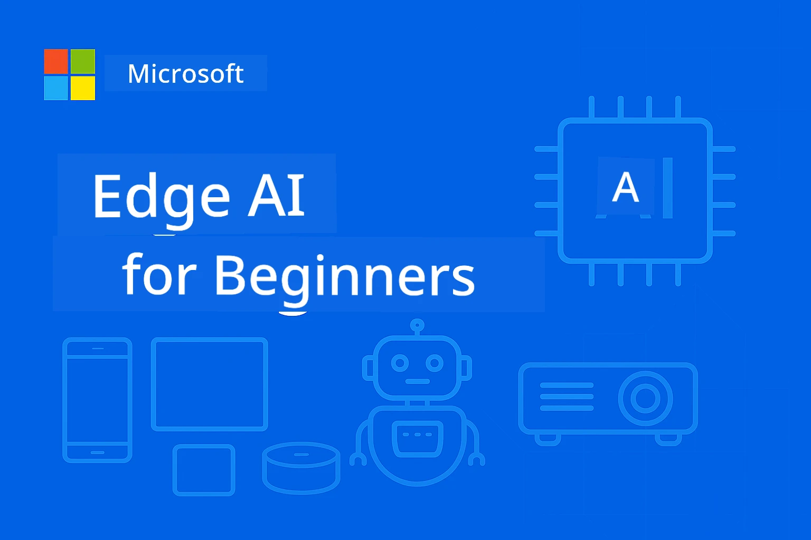

# EdgeAI for Begyndere 




[](https://GitHub.com/microsoft/edgeai-for-beginners/graphs/contributors)
[](https://GitHub.com/microsoft/edgeai-for-beginners/issues)
[](https://GitHub.com/microsoft/edgeai-for-beginners/pulls)
[](http://makeapullrequest.com)

[](https://GitHub.com/microsoft/edgeai-for-beginners/watchers)
[](https://GitHub.com/microsoft/edgeai-for-beginners/fork)
[](https://GitHub.com/microsoft/edgeai-for-beginners/stargazers)


[](https://discord.gg/nTYy5BXMWG)

Følg disse trin for at komme i gang med at bruge disse ressourcer:

1. **Fork Repositoryet**: Klik [](https://GitHub.com/microsoft/edgeai-for-beginners/fork)
2. **Klon Repositoryet**:   `git clone https://github.com/microsoft/edgeai-for-beginners.git`
3. [**Deltag i Azure AI Foundry Discord og mød eksperter og medudviklere**](https://discord.com/invite/ByRwuEEgH4)


### 🌐 Fler-sproget Support

#### Understøttet via GitHub Action (Automatiseret & Altid Opdateret)

<!-- CO-OP TRANSLATOR LANGUAGES TABLE START -->
[Arabic](../ar/README.md) | [Bengali](../bn/README.md) | [Bulgarian](../bg/README.md) | [Burmese (Myanmar)](../my/README.md) | [Chinese (Simplified)](../zh-CN/README.md) | [Chinese (Traditional, Hong Kong)](../zh-HK/README.md) | [Chinese (Traditional, Macau)](../zh-MO/README.md) | [Chinese (Traditional, Taiwan)](../zh-TW/README.md) | [Croatian](../hr/README.md) | [Czech](../cs/README.md) | [Danish](./README.md) | [Dutch](../nl/README.md) | [Estonian](../et/README.md) | [Finnish](../fi/README.md) | [French](../fr/README.md) | [German](../de/README.md) | [Greek](../el/README.md) | [Hebrew](../he/README.md) | [Hindi](../hi/README.md) | [Hungarian](../hu/README.md) | [Indonesian](../id/README.md) | [Italian](../it/README.md) | [Japanese](../ja/README.md) | [Kannada](../kn/README.md) | [Khmer](../km/README.md) | [Korean](../ko/README.md) | [Lithuanian](../lt/README.md) | [Malay](../ms/README.md) | [Malayalam](../ml/README.md) | [Marathi](../mr/README.md) | [Nepali](../ne/README.md) | [Nigerian Pidgin](../pcm/README.md) | [Norwegian](../no/README.md) | [Persian (Farsi)](../fa/README.md) | [Polish](../pl/README.md) | [Portuguese (Brazil)](../pt-BR/README.md) | [Portuguese (Portugal)](../pt-PT/README.md) | [Punjabi (Gurmukhi)](../pa/README.md) | [Romanian](../ro/README.md) | [Russian](../ru/README.md) | [Serbian (Cyrillic)](../sr/README.md) | [Slovak](../sk/README.md) | [Slovenian](../sl/README.md) | [Spanish](../es/README.md) | [Swahili](../sw/README.md) | [Swedish](../sv/README.md) | [Tagalog (Filipino)](../tl/README.md) | [Tamil](../ta/README.md) | [Telugu](../te/README.md) | [Thai](../th/README.md) | [Turkish](../tr/README.md) | [Ukrainian](../uk/README.md) | [Urdu](../ur/README.md) | [Vietnamese](../vi/README.md)

> **Foretrækker du at klone lokalt?**
>
> Dette repository inkluderer 50+ sprogoversættelser, som væsentligt øger download-størrelsen. For at klone uden oversættelser, brug spars checkout:
>
> **Bash / macOS / Linux:**
> ```bash
> git clone --filter=blob:none --sparse https://github.com/microsoft/edgeai-for-beginners.git
> cd edgeai-for-beginners
> git sparse-checkout set --no-cone '/*' '!translations' '!translated_images'
> ```
>
> **CMD (Windows):**
> ```cmd
> git clone --filter=blob:none --sparse https://github.com/microsoft/edgeai-for-beginners.git
> cd edgeai-for-beginners
> git sparse-checkout set --no-cone "/*" "!translations" "!translated_images"
> ```
>
> Dette giver dig alt, hvad du behøver for at fuldføre kurset med en meget hurtigere download.
<!-- CO-OP TRANSLATOR LANGUAGES TABLE END -->

**Hvis du ønsker at få flere oversættelsessprog understøttet, findes de [her](https://github.com/Azure/co-op-translator/blob/main/getting_started/supported-languages.md)**
## Introduktion

Velkommen til **EdgeAI for Begyndere** – din omfattende rejse ind i den transformerende verden af Edge Kunstig Intelligens. Dette kursus bygger bro mellem kraftfulde AI-funktioner og praktisk, virkelighedsnær implementering på edge-enheder og giver dig mulighed for at udnytte AI's potentiale direkte, hvor data genereres og beslutninger skal træffes.

### Hvad du vil mestre

Dette kursus tager dig fra grundlæggende koncepter til produktionsklare implementeringer og dækker:
- **Små sprogmodeller (SLMs)** optimeret til edge-udrulning
- **Hardware-bevidst optimering** på tværs af forskellige platforme
- **Real-time inferens** med privatlivsbeskyttende funktioner
- **Produktionsudrulningsstrategier** til erhvervsapplikationer

### Hvorfor EdgeAI betyder noget

Edge AI repræsenterer et paradigmeskift, der håndterer kritiske moderne udfordringer:
- **Privatliv & Sikkerhed**: Behandl følsomme data lokalt uden eksponering til skyen
- **Real-time ydeevne**: Eliminér netværksforsinkelse for tidskritiske applikationer
- **Omkostningseffektivitet**: Reducer båndbredde- og sky-computing-udgifter
- **Robuste operationer**: Oprethold funktionalitet under netværksnedbrud
- **Regulatorisk overholdelse**: Overhold krav til datasuverænitet

### Edge AI

Edge AI refererer til at køre AI-algoritmer og sprogmodeller lokalt på hardware tæt på, hvor data genereres uden at afhænge af skyressourcer til inferens. Det reducerer latenstid, forbedrer privatliv og muliggør realtidsbeslutninger.

### Kerneprincipper:
- **Inferens på enheden**: AI-modeller kører på edge-enheder (telefoner, routere, microcontrollere, industrielle PC'er)
- **Offline kapabilitet**: Fungerer uden vedvarende internetforbindelse
- **Lav latenstid**: Øjeblikkelige svar egnet til realtidssystemer
- **Datasuverænitet**: Holder følsomme data lokalt, forbedrer sikkerhed og overholdelse

### Små sprogmodeller (SLMs)

SLMs som Phi-4, Mistral-7B og Gemma er optimerede versioner af større LLM'er – trænet eller destilleret for:
- **Reduceret hukommelsesaftryk**: Effektiv brug af begrænset hukommelse på edge-enheder
- **Lavere beregningskrav**: Optimeret til CPU- og edge GPU-ydeevne
- **Hurtigere opstartstider**: Hurtig initialisering for responsive applikationer

De åbner for kraftfulde NLP-funktioner, samtidig med at de lever op til begrænsningerne i:
- **Indlejrede systemer**: IoT-enheder og industrielle controllere
- **Mobilenheder**: Smartphones og tablets med offline funktionalitet
- **IoT-enheder**: Sensorer og smarte enheder med begrænsede ressourcer
- **Edge-servere**: Lokale behandlingsenheder med begrænsede GPU-ressourcer
- **Personlige computere**: Desktop- og bærbar implementeringsscenarier

## Kursusmoduler & Navigation

| Modul | Emne | Fokusområde | Nøgleindhold | Niveau | Varighed |
|--------|-------|------------|-------------|--------|----------|
| [📖 00 ](./introduction.md) | [Introduktion til EdgeAI](./introduction.md) | Fundament & Kontekst | EdgeAI Oversigt • Brancheapplikationer • SLM Introduktion • Læringsmål | Begynder | 1-2 timer |
| [📚 01](../../Module01) | [EdgeAI Grundlæggende](./Module01/README.md) | Cloud vs Edge AI sammenligning | EdgeAI Grundlæggende • Virkelige case-studier • Implementeringsvejledning • Edge Udrulning | Begynder | 3-4 timer |
| [🧠 02](../../Module02) | [SLM Model Fundamenter](./Module02/README.md) | Modelfamilier & arkitektur | Phi Familie • Qwen Familie • Gemma Familie • BitNET • μModel • Phi-Silica | Begynder | 4-5 timer |
| [🚀 03](../../Module03) | [SLM Udrulningspraksis](./Module03/README.md) | Lokal & cloud udrulning | Avanceret læring • Lokalt miljø • Cloud udrulning | Mellem | 4-5 timer |
| [⚙️ 04](../../Module04) | [Model Optimerings Toolkit](./Module04/README.md) | Krydsplatform optimering | Introduktion • Llama.cpp • Microsoft Olive • OpenVINO • Apple MLX • Workflow syntese | Mellem | 5-6 timer |
| [🔧 05](../../Module05) | [SLMOps Produktion](./Module05/README.md) | Produktionsdrift | SLMOps Introduktion • Model Destillation • Finjustering • Produktionsudrulning | Avanceret | 5-6 timer |
| [🤖 06](../../Module06) | [AI Agenter & Funktionskald](./Module06/README.md) | Agentrammer & MCP | Agent Introduktion • Funktionskald • Model Context Protocol | Avanceret | 4-5 timer |
| [💻 07](../../Module07) | [Platform Implementering](./Module07/README.md) | Krydsplatform eksempler | AI Toolkit • Foundry Local • Windows Udvikling | Avanceret | 3-4 timer |
| [🏭 08](../../Module08) | [Foundry Local Toolkit](./Module08/README.md) | Produktionsklare eksempler | Eksempelkørsler (se detaljer nedenfor) | Ekspert | 8-10 timer |

### 🏭 **Modul 08: Eksempelkørsler**

- [01: REST Chat Hurtigstart](./Module08/samples/01/README.md)
- [02: OpenAI SDK Integration](./Module08/samples/02/README.md)
- [03: Model Discovery & Benchmarking](./Module08/samples/03/README.md)
- [04: Chainlit RAG Applikation](./Module08/samples/04/README.md)
- [05: Multi-Agent Orkestrering](./Module08/samples/05/README.md)
- [06: Models-as-Tools Router](./Module08/samples/06/README.md)
- [07: Direkte API Klient](./Module08/samples/07/README.md)
- [08: Windows 11 Chat App](./Module08/samples/08/README.md)
- [09: Avanceret Multi-Agent System](./Module08/samples/09/README.md)
- [10: Foundry Tools Framework](./Module08/samples/10/README.md)

### 🎓 **Workshop: Praktisk Læringsvej**

Omfattende praktisk workshop materiale med produktionsklare implementeringer:

- **[Workshop Guide](./Workshop/Readme.md)** - Fuldstændige læringsmål, resultater og ressource-navigation
- **Python Eksempler** (6 sessions) - Opdateret med bedste praksis, fejlhåndtering og omfattende dokumentation
- **Jupyter Notebooks** (8 interaktive) - Trin-for-trin tutorials med benchmarks og præstationsovervågning
- **Sessionsvejledninger** - Detaljerede markdown guider til hver workshop session
- **Valideringsværktøjer** - Scripts til verificering af kodekvalitet og kørsel af smogtests

**Hvad du vil bygge:**
- Lokale AI chatapplikationer med streaming support
- RAG pipelines med kvalitetsvurdering (RAGAS)
- Multi-model benchmarking og sammenligning værktøjer
- Multi-agent orkestreringssystemer
- Intelligent model-routing med opgavebaseret udvælgelse

### 🎙️ **Workshop For Agentic: Hands-On - The AI Podcast Studio**
Byg en AI-drevet podcastproduktionspipeline fra bunden! Denne immersive workshop lærer dig at skabe et komplet multi-agent system, der forvandler ideer til professionelle podcastepisoder.

**[🎬 Start AI Podcast Studio Workshoppen](./WorkshopForAgentic/README.md)**

**Din mission**: Lancér "Future Bytes" — en tech podcast drevet udelukkende af AI-agenter, som du bygger selv. Ingen afhængighed af cloud, ingen API-omkostninger — alt kører lokalt på din maskine.

**Hvad gør denne unik:**
- **🤖 Ægte multi-agent orkestrering** - Byg specialiserede AI-agenter, der forsker, skriver og producerer lyd
- **🎯 Komplett produktionspipeline** - Fra emnevalg til endelig podcast-lydfil
- **💻 100% lokal implementering** - Bruger Ollama og lokale modeller (Qwen-3-8B) for fuldt privatliv og kontrol
- **🎤 Tekst-til-tale integration** - Forvandl manuskripter til naturligt klingende samtaler med flere talere
- **✋ Human-in-the-Loop workflows** - Godkendelsesporte sikrer kvalitet samtidigt med automatisering

**Tre-akter læringsrejse:**

| Akt | Fokus | Nøglekompetencer | Varighed |
|-----|-------|------------------|----------|
| **[Akt 1: Mød dine AI-assistenter](./WorkshopForAgentic/md/01.BuildAIAgentWithSLM.md)** | Byg din første AI-agent | Værktøjsintegration • Websøgning • Problemløsning • Agentisk ræsonnering | 2-3 timer |
| **[Akt 2: Sammensæt dit produktionsteam](./WorkshopForAgentic/md/02.AIAgentOrchestrationAndWorkflows.md)** | Orkestrér flere agenter | Teamkoordination • Godkendelsesworkflows • DevUI interface • Menneskelig overvågning | 3-4 timer |
| **[Akt 3: Bring din podcast til live](./WorkshopForAgentic/md/03.Multi-SpeakerPodcastGenerationWithVibeVoice.md)** | Generer podcastlyd | Tekst-til-tale • Multi-taler syntese • Langformet lyd • Fuld automatisering | 2-3 timer |

**Teknologier brugt:**
- **Microsoft Agent Framework** - Multi-agent orkestrering og koordinering
- **Ollama** - Lokalt AI-model runtime (ingen cloud nødvendigt)
- **Qwen-3-8B** - Open source sprogmodel optimeret til agentiske opgaver
- **Tekst-til-Tale API’er** - Naturlig voicesyntese til podcastproduktion

**Hardware-understøttelse:**
- ✅ **CPU-tilstand** - Virker på enhver moderne computer (8GB+ RAM anbefales)
- 🚀 **GPU-acceleration** - Markant hurtigere inferens med NVIDIA/AMD GPU’er
- ⚡ **NPU-understøttelse** - Næste generations neural processing unit acceleration

**Perfekt til:**
- Udviklere, der vil lære multi-agent AI-systemer
- Alle interesserede i AI-automatisering og workflows
- Indholdsskabere der udforsker AI-assisteret produktion
- Studerende i praktiske AI-orkestreringsmønstre

**Begynd at bygge**: [🎙️ AI Podcast Studio Workshoppen →](./WorkshopForAgentic/README.md)

### 📊 **Læringsvej sammenfatning**
- **Total varighed**: 36-45 timer
- **Begyndervej**: Moduler 01-02 (7-9 timer)  
- **Mellemniveauvej**: Moduler 03-04 (9-11 timer)
- **Avanceret vej**: Moduler 05-07 (12-15 timer)
- **Ekspertvej**: Modul 08 (8-10 timer)

## Hvad du bygger

### 🎯 Kernekompetencer
- **Edge AI-arkitektur**: Design lokale AI-systemer med cloud-integration som prioritet
- **Modeloptimering**: Kvantisér og komprimer modeller til edge-implementering (85% hastighedsforøgelse, 75% størrelsesreduktion)
- **Multi-platform implementering**: Windows, mobil, embedded og cloud-edge hybride systemer
- **Produktionsdrift**: Overvågning, skalering og vedligehold af edge AI i produktion

### 🏗️ Praktiske projekter
- **Foundry Local Chat Apps**: Windows 11 native applikation med modelskift
- **Multi-Agent Systemer**: Koordinator med specialistagenter til komplekse workflows  
- **RAG-applikationer**: Lokal dokumentbehandling med vektorsøgning
- **Model-rutere**: Intelligent valg mellem modeller baseret på opgaveanalyse
- **API-rammer**: Produktionsklare klienter med streaming og sundhedsovervågning
- **Cross-platform værktøjer**: LangChain/Semantic Kernel integrationsmønstre

### 🏢 Brancheanvendelser
**Produktion** • **Sundhedssektor** • **Autonome køretøjer** • **Smart Cities** • **Mobilapps**

## Kom godt i gang

**Anbefalet læringsvej** (20-30 timer samlet):

0. **📖 Introduktion** ([Introduction.md](./introduction.md)): EdgeAI fundament + branchekontekst + læringsframework
1. **📚 Fundament** (Moduler 01-02): EdgeAI koncepter + SLM model-familier
2. **⚙️ Optimering** (Moduler 03-04): Implementering + kvantiseringsrammer  
3. **🚀 Produktion** (Moduler 05-06): SLMOps + AI-agenter + funktionskald
4. **💻 Implementering** (Moduler 07-08): Platformsamples + Foundry Local toolkit

Hvert modul inkluderer teori, hands-on øvelser og produktionsklare kodeeksempler.

## Karriereeffekt

**Tekniske roller**: EdgeAI Solutions Architect • ML Engineer (Edge) • IoT AI Developer • Mobile AI Developer

**Branchesektorer**: Produktion 4.0 • Sundhedsteknologi • Autonome systemer • FinTech • Forbrugerelektronik

**Porteføljeprojekter**: Multi-agent systemer • Produktions RAG-applikationer • Cross-platform implementering • Performanceoptimering

## Repositorie-struktur

```
edgeai-for-beginners/
├── 📖 introduction.md  # Foundation: EdgeAI Overview & Learning Framework
├── 📚 Module01-04/     # Fundamentals → SLMs → Deployment → Optimization  
├── 🔧 Module05-06/     # SLMOps → AI Agents → Function Calling
├── 💻 Module07/        # Platform Samples (VS Code, Windows, Jetson, Mobile)
├── 🏭 Module08/        # Foundry Local Toolkit + 10 Comprehensive Samples
│   ├── samples/01-06/  # Foundation: REST, SDK, RAG, Agents, Routing
│   └── samples/07-10/  # Advanced: API Client, Windows App, Enterprise Agents, Tools
├── 🌐 translations/    # Multi-language support (8+ languages)
└── 📋 STUDY_GUIDE.md   # Structured learning paths & time allocation
```

## Kursus-højdepunkter

✅ **Progressiv læring**: Teori → Praksis → Produktionsimplementering  
✅ **Virkelige cases**: Microsoft, Japan Airlines, virksomhedsimpementeringer  
✅ **Hands-on eksempler**: 50+ eksempler, 10 omfattende Foundry Local demos  
✅ **Performance fokus**: 85% hurtigere, 75% mindre i størrelse  
✅ **Multi-platform**: Windows, mobil, embedded, cloud-edge hybrid  
✅ **Produktionsklar**: Overvågning, skalering, sikkerhed, compliance-rammer

📖 **[Studieguide tilgængelig](STUDY_GUIDE.md)**: Struktureret 20-timers læreplan med tidsallokeringsvejledning og selvevalueringsværktøjer.

---

**EdgeAI repræsenterer fremtidens AI-implementering**: local-first, privatlivsbevarende og effektivt. Mestre disse færdigheder for at bygge næste generation af intelligente applikationer.

## Andre kurser

Vores team producerer flere kurser! Se:

<!-- CO-OP TRANSLATOR OTHER COURSES START -->
### LangChain
[](https://aka.ms/langchain4j-for-beginners)
[](https://aka.ms/langchainjs-for-beginners?WT.mc_id=m365-94501-dwahlin)
[](https://github.com/microsoft/langchain-for-beginners?WT.mc_id=m365-94501-dwahlin)
---

### Azure / Edge / MCP / Agents
[](https://github.com/microsoft/AZD-for-beginners?WT.mc_id=academic-105485-koreyst)
[](https://github.com/microsoft/edgeai-for-beginners?WT.mc_id=academic-105485-koreyst)
[](https://github.com/microsoft/mcp-for-beginners?WT.mc_id=academic-105485-koreyst)
[](https://github.com/microsoft/ai-agents-for-beginners?WT.mc_id=academic-105485-koreyst)

---
 
### Generativ AI-serie
[](https://github.com/microsoft/generative-ai-for-beginners?WT.mc_id=academic-105485-koreyst)
[-9333EA?style=for-the-badge&labelColor=E5E7EB&color=9333EA)](https://github.com/microsoft/Generative-AI-for-beginners-dotnet?WT.mc_id=academic-105485-koreyst)
[-C084FC?style=for-the-badge&labelColor=E5E7EB&color=C084FC)](https://github.com/microsoft/generative-ai-for-beginners-java?WT.mc_id=academic-105485-koreyst)
[-E879F9?style=for-the-badge&labelColor=E5E7EB&color=E879F9)](https://github.com/microsoft/generative-ai-with-javascript?WT.mc_id=academic-105485-koreyst)

---
 
### Kerne-læring
[](https://aka.ms/ml-beginners?WT.mc_id=academic-105485-koreyst)
[](https://aka.ms/datascience-beginners?WT.mc_id=academic-105485-koreyst)
[](https://aka.ms/ai-beginners?WT.mc_id=academic-105485-koreyst)
[](https://github.com/microsoft/Security-101?WT.mc_id=academic-96948-sayoung)
[](https://aka.ms/webdev-beginners?WT.mc_id=academic-105485-koreyst)
[](https://aka.ms/iot-beginners?WT.mc_id=academic-105485-koreyst)
[](https://github.com/microsoft/xr-development-for-beginners?WT.mc_id=academic-105485-koreyst)

---
 
### Copilot-serie
[](https://aka.ms/GitHubCopilotAI?WT.mc_id=academic-105485-koreyst)
[](https://github.com/microsoft/mastering-github-copilot-for-dotnet-csharp-developers?WT.mc_id=academic-105485-koreyst)
[](https://github.com/microsoft/CopilotAdventures?WT.mc_id=academic-105485-koreyst)
<!-- CO-OP TRANSLATOR OTHER COURSES END -->

## Få hjælp

Hvis du sidder fast eller har spørgsmål om at bygge AI-apps, så deltag i:

[](https://discord.gg/nTYy5BXMWG)

Hvis du har produktfeedback eller oplever fejl under udvikling, besøg:

[](https://aka.ms/foundry/forum)

---

<!-- CO-OP TRANSLATOR DISCLAIMER START -->
**Ansvarsfraskrivelse**:  
Dette dokument er oversat ved hjælp af AI-oversættelsestjenesten [Co-op Translator](https://github.com/Azure/co-op-translator). Selvom vi bestræber os på nøjagtighed, bedes du være opmærksom på, at automatiserede oversættelser kan indeholde fejl eller unøjagtigheder. Det oprindelige dokument på dets modersmål bør betragtes som den autoritative kilde. For kritisk information anbefales professionel menneskelig oversættelse. Vi påtager os intet ansvar for eventuelle misforståelser eller fejltolkninger som følge af brugen af denne oversættelse.
<!-- CO-OP TRANSLATOR DISCLAIMER END -->