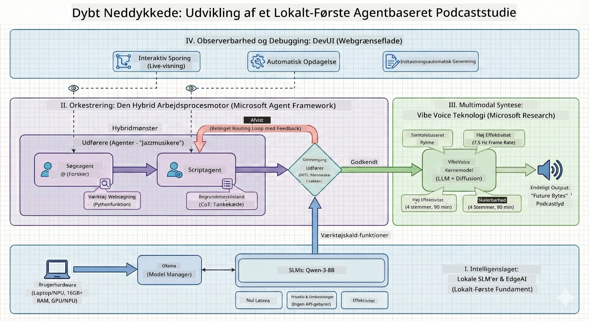

<!--
CO_OP_TRANSLATOR_METADATA:
{
  "original_hash": "f94e745264597bc5d8df967ead2eff97",
  "translation_date": "2026-01-05T10:40:41+00:00",
  "source_file": "WorkshopForAgentic/README.md",
  "language_code": "da"
}
-->
# 🎙️ The AI Podcast Studio Workshop

> 🌏 [中文版 (Chinese Version)](translation/zh-cn/README.md)


## Din Mission

Velkommen til **The AI Podcast Studio**! Du er ved at starte din egen tech-podcast kaldet "Future Bytes" — men her er twistet: du vil bygge et AI-drevet produktionsteam til at hjælpe dig med at skabe den. Ikke mere uendelige timer med research, manuskriptskrivning og lydredigering. I stedet vil du kode dig til at blive en podcastproducer med AI-superkræfter.

## Historien

Forestil dig dette: Du og dine venner vil starte en podcast om de sejeste teknologitendenser, men alle er optaget af skole, arbejde eller bare livet. Hvad nu hvis du kunne bygge et hold af AI-agenter til at tage det tunge arbejde? En agent forsker i emner, en anden skriver engagerende manuskripter, og en tredje omdanner tekst til naturligt lydende samtaler. Lyder det som sci-fi? Lad os gøre det til virkelighed.

## Hvad Du Vil Lære

Ved slutningen af denne workshop vil du kunne:
- 🤖 Udrulle din egen lokale AI-model (ingen API-omkostninger, ingen afhængighed af sky!)
- 🔧 Bygge specialiserede AI-agenter, der faktisk arbejder sammen
- 🎬 Skabe en komplet podcastproduktionsrørledning fra idé til lyd

## Din Rejse: Tre Akter



Som en god historie har vi tre akter. Hver bygger dit AI-podcaststudio stykke for stykke:

| Episode | Din Mission | Hvad Der Sker | Opnåede Kompetencer |
|---------|-------------|---------------|---------------------|
| **Akt 1** | [Mød Dine AI-Assistent](md/01.BuildAIAgentWithSLM.md) | Du opdager, hvordan man laver AI-agenter, der kan chatte, søge på nettet og endda løse problemer. Tænk på dem som dine forskningspraktikanter, der aldrig sover. | 🎯 Byg din første agent<br>🛠️ Giv den superkræfter (værktøjer!)<br>🧠 Lær den at tænke<br>🌐 Forbind den til internettet |
| **Akt 2** | [Saml Dit Produktionsteam](md/02.AIAgentOrchestrationAndWorkflows.md) | Nu bliver det interessant! Du vil orkestrere flere AI-agenter til at arbejde sammen som et rigtigt podcastteam. En forsker, en skriver, du godkender — teamwork får drømmen til at gå i opfyldelse. | 🎭 Koordiner flere agenter<br>🔄 Byg godkendelses-workflows<br>🖥️ Test med DevUI interface<br>✋ Hold mennesker i kontrol |
| **Akt 3** | [Bring Din Podcast Til Live](md/03.Multi-SpeakerPodcastGenerationWithVibeVoice.md) | Finalen! Forvandl dine tekstmanuskripter til reel podcastlyd med realistiske stemmer og naturlige samtaler. Din "Future Bytes" podcast er klar til at blive sendt! | 🎤 Tekst-til-tale magi<br>👥 Flere talerstemmer<br>⏱️ Langformet lyd<br>🚀 Fuld automatisering |

Hver akt låser op for nye evner. Spring frem, hvis du er modig, men vi anbefaler at følge historien!

## Miljøkrav

Denne workshop understøtter forskellige hardwaremiljøer:
- **CPU**: Egnet til test og små skala brug
- **GPU**: Anbefales til produktionsmiljøer, forbedrer signifikant inferenshastigheden
- **NPU**: Understøtter næste generations neurale processor-acceleration

## Hvad Du Skal Bruge

### Software Tjekliste ✅
- **Python 3.10+** (Dit programmeringssprog)
- **Ollama** (Kører AI-modeller på din maskine)
- **VS Code** (Din kodeeditor)
- **Python Extension** (Gør VS Code klogere)
- **Git** (Til at hente kode)

### Hardware Tjek 💻
- **Kan jeg køre dette?**: 8GB RAM, 10GB ledig plads (virker, men kan være langsomt)
- **Ideelt setup**: 16GB+ RAM, et ordentligt GPU (glat sejlads!)
- **Har du en NPU?**: Endnu bedre! Næste generations ydeevne låst op 🚀

## Sæt Dit Studio Op 🎬

### Trin 1: Python Power-Up

Sørg for, at du har Python 3.10 eller nyere:

```bash
python --version
# Skal vise Python 3.10.x eller højere
```

Ingen Python? Hent det fra [python.org](https://python.org) — det er gratis!

### Trin 2: Få Ollama (Din AI-Model Kører)

Gå til [ollama.ai](https://ollama.ai) og hent Ollama til dit OS. Tænk på det som motoren, der kører dine AI-modeller lokalt.

Tjek om det er klart:

```bash
ollama --version
```

### Trin 3: Download Din AI-Hjerne 🧠

Tid til at hente Qwen-3-8B modellen (det er som at ansætte din første AI-assistent):

```bash
ollama pull qwen3:8b
```

*Dette kan tage et par minutter. Perfekt tid til en kaffepause! ☕*

### Trin 4: Sæt VS Code Op

Hent [Visual Studio Code](https://code.visualstudio.com/) hvis du ikke har det. Det er den bedste kodeeditor der findes (prøv at modsige mig 😄).

### Trin 5: Python Extension

I VS Code:
1. Tryk `Ctrl+Shift+X` (eller `Cmd+Shift+X` på Mac)
2. Søg "Python"
3. Installer den officielle Microsoft Python extension

### Trin 6: Du er Klar! 🎉

Seriøst, du er klar til at rocke. Lad os bygge noget AI-magik!

### Trin 7: Installer Microsoft Agent Framework og Relaterede Pakker 📦

Installer alle nødvendige afhængigheder til workshoppen:

```bash
pip install -r ./Installations/requirements.txt -U
```

*Dette installerer Microsoft Agent Framework og alle nødvendige pakker. Tag en kop kaffe — første opsætning kan tage et par minutter! ☕*

## Workshop Instruktioner

Detaljeret projektstruktur, konfigurationssteg og udførelsesmetoder vil blive forklaret trin for trin under workshoppen.

## Fejlfinding (Når Ting Går Galt) 🔧

### "Øv, model-downloaden tager evigheder!"
**Løsning**: Brug en VPN eller konfigurer Ollama med en spejlkilde. Nogle gange hader internettet bare os.

### "Min computer dør! Ud af hukommelse!"
**Løsning**: Skift til en mindre model eller juster `num_ctx` indstillingen for at bruge mindre hukommelse. Tænk på det som at putte din AI på slankekur.

### "Kan jeg gøre det hurtigere med min GPU?"
**Løsning**: Ollama opdager automatisk GPU'er! Sørg bare for, at dine GPU-driver er opdaterede. Gratis hastighedsboost! 🏎️

## Ekstra Ressourcer (Til den Nysgerrige) 📚

- [Ollama Docs](https://github.com/ollama/ollama) — Dyk ned i lokale AI-modeller
- [Microsoft Agent Framework](https://microsoft.github.io/autogen/) — Lær mere om at bygge agentteams
- [Qwen Model Info](https://qwenlm.github.io/) — Mød din AI-assistents hjerne

## Licens

MIT License — Byg seje ting, del dem, gør verden bedre! 🌍

## Vil Du Bidrage?

Fandt du en fejl? Har du en idé? Smid en Issue eller PR! Vi elsker fællesskabsstemningen. ✨

---

<!-- CO-OP TRANSLATOR DISCLAIMER START -->
**Ansvarsfraskrivelse**:  
Dette dokument er blevet oversat ved hjælp af AI-oversættelsestjenesten [Co-op Translator](https://github.com/Azure/co-op-translator). Selvom vi bestræber os på nøjagtighed, skal du være opmærksom på, at automatiske oversættelser kan indeholde fejl eller unøjagtigheder. Det oprindelige dokument på dets modersmål bør betragtes som den autoritative kilde. For kritisk information anbefales professionel menneskelig oversættelse. Vi påtager os intet ansvar for misforståelser eller fejltolkninger, der måtte opstå som følge af brugen af denne oversættelse.
<!-- CO-OP TRANSLATOR DISCLAIMER END -->