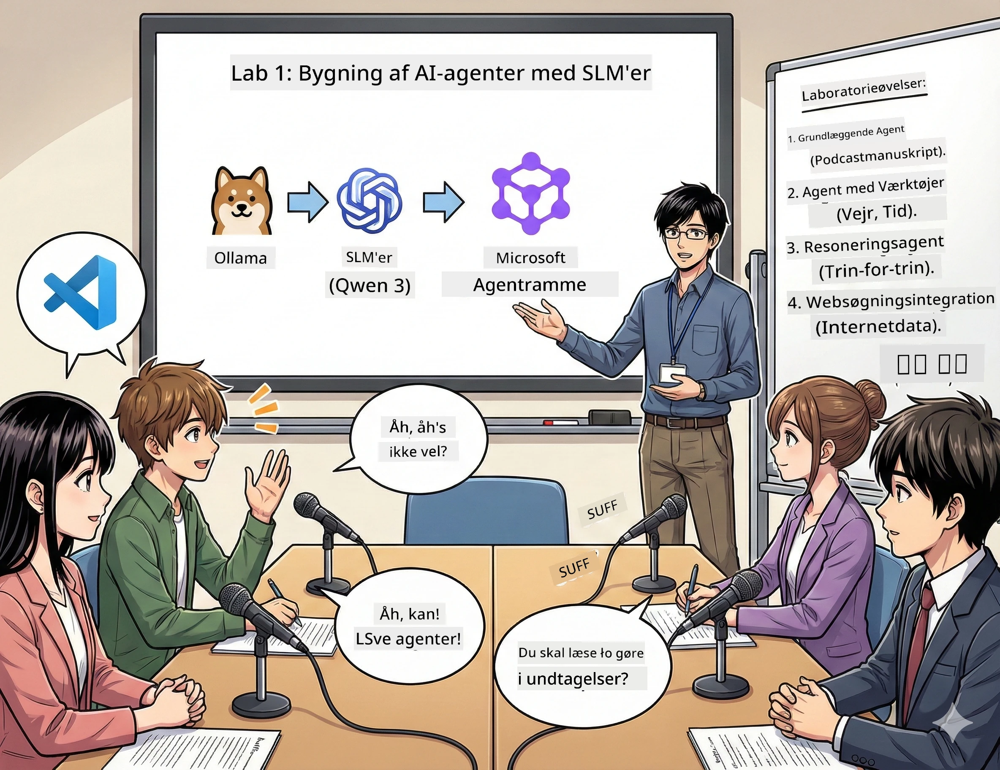

<!--
CO_OP_TRANSLATOR_METADATA:
{
  "original_hash": "7868fa418386aa7167bea3ff5ba8390b",
  "translation_date": "2026-01-05T13:04:40+00:00",
  "source_file": "WorkshopForAgentic/md/01.BuildAIAgentWithSLM.md",
  "language_code": "da"
}
-->
# Akt 1: Mød Din AI Forskningsassistent 🤖

## Udfordringen

Du lancerer "Future Bytes," din nye tech-podcast. Episode 1 handler om de seneste AI-gennembrud, men du har 24 timer til at:
1. Forske i emnet
2. Find troværdige kilder
3. Skriv et overbevisende manuskript
4. Få det til at lyde naturligt

**Plot twist**: Du behøver ikke gøre det alene. Du er ved at bygge din første AI-assistent, der kan hjælpe med det hele. Lad os kalde den Alex — din utrættelige forskningspartner, der aldrig behøver sove.

## Hvorfor Små Sproglige Modeller? (Spoiler: De er Fantastiske)

Tænk på Små Sproglige Modeller (SLM'er) som din personlige AI, der bor på *din* computer. Ingen cloud, ingen månedlige gebyrer, ingen tvivlsom datadeling.

**Hvorfor SLM'er er 🔥:**
- **🏠 Kører på Din Maskine**: Laptop, desktop, endda en kraftig Raspberry Pi
- **💸 Ingen Løbende Omkostninger**: Ingen API-gebyrer, der spiser dine frokostpenge
- **🔒 Privatliv Først**: Dine data forlader aldrig din enhed
- **⚡ Lynhurtig**: Ingen internetforsinkelse, øjeblikkelige svar
- **🪦 Letvægt**: 1B-10B parametre vs. 100B+ for de store modeller

**Populære SLM'er**: Qwen 3, Phi-4, Gemma 3 (vi bruger Qwen til denne workshop)

## Dit Værktøjssæt

### Ollama: Din AI Model Manager

[Ollama](https://ollama.com/) er som Steam for AI-modeller. Download, kør, og administrer modeller med simple kommandoer.

**Det, der gør det fedt:**
- Én kommando til at downloade og køre enhver model
- Fungerer på Mac, Windows, Linux
- Bruger automatisk din GPU, hvis du har en
- Super hukommelseseffektiv

### Microsoft Agent Framework: Hvor Magien Sker

[Microsoft Agent Framework](https://github.com/microsoft/agent-framework) er din legeplads til at bygge AI-agenter, der kan:

- 💬 Chatte og huske, hvad I talte om
- 🛠️ Bruge specialværktøjer (som at søge på nettet eller tjekke vejr)
- 🧠 Tænke igennem komplekse problemer trin for trin
- 🤝 Arbejde sammen med andre agenter som et team
- 🔌 Forbinde til forskellige AI-udbydere (OpenAI, Ollama, Azure)

**Byggestenene:**
- **Agenter**: Dine AI-assistenter med specifikke opgaver
- **Værktøjer**: Særlige evner, du giver dem
- **Hukommelse**: Så de ikke glemmer din samtale
- **Ræsonnement**: At lære dem at tænke, ikke bare svare

## Dit Træningsmontage: 4 Missioner

### Mission 1: Skab Din Første Agent

📓 [Åbn Notebook](../code/01.BasicAgent/00.BasicAgent-agent.ipynb)

**Opgaven**: Byg Alex, din podcast-manuskriptforfatter AI. Alex skal generere dialog mellem to værter, der diskuterer tech-emner.

**Det lærer du**:
- Hvordan du vækker en AI-agent (det er nemmere end at vågne om mandagen)
- Give den personlighed og instruktioner
- Få den til at generere egentlige podcast-manuskripter
- Forstå, hvad den siger tilbage til dig

**Sejrsbetingelse**: Alex laver et manuskript til din "Future Bytes" pilot-episode om AI! 🎯

### Mission 2: Giv Alex Superkræfter (Værktøjer!)

📓 [Åbn Notebook](../code/01.BasicAgent/01.BasicAgent-tools.ipynb)

**Opgaven**: Alex er klog, men ved ikke, hvordan vejret er i dag, eller hvad klokken er. Lad os fikse det ved at give den værktøjer!

**Det lærer du**:
- Oprette brugerdefinerede Python-funktioner som "værktøjer"
- Lade Alex beslutte *hvornår* den skal bruge hvilket værktøj
- Se den løse problemer selvstændigt
- Kombinere flere værktøjer til komplekse opgaver

**Sejrsbetingelse**: Spørg "Hvordan er vejret i Tokyo?" og Alex finder det selv ud af! ☁️

### Mission 3: Lær Alex at Tænke

📓 [Åbn Notebook](../code/01.BasicAgent/02.BasicAgent-reasoning.ipynb)

**Opgaven**: Få Alex til at vise sit arbejde. Når den løser problemer, vil du se *hvordan* den tænker, ikke bare svaret.

**Det lærer du**:
- Aktivere "ræsonnementstilstand" (det er som at vise sit regnestykke i matematik)
- Se Alex' trin-for-trin tankegang
- Forstå ræsonnementskæde-prompting
- Fejlsøge når Alex bliver forvirret

**Sejrsbetingelse**: Stil et tricky matematikspørgsmål og se Alex tænke det igennem! 🧠

### Mission 4: Forbind Alex til Internettet

📓 [Åbn Notebook](../code/01.BasicAgent/03.BasicAgent-websearch.ipynb)

**Opgaven**: Alex' viden har en cut-off dato. Lad os forbinde den til nettet for realtidsinfo!

**Det lærer du**:
- Byg et brugerdefineret websøgningsværktøj
- Integrer eksterne API'er
- Håndter netværksfejl elegant
- Få info udover Alex' træningsdata

**Sejrsbetingelse**: Spørg om dagens tech-nyheder og få friske resultater! 📰

## Før Du Starter 🚀

**Nødvendigt udstyr**:
- Python 3.10+ installeret
- Ollama kørende (tjek med `ollama --version`)
- VS Code med Python-udvidelse
- Mindst 8GB RAM (16GB hvis du vil have glidende oplevelse)

## Missionernes Rækkefølge

Følg notebooks i rækkefølge for hele historien:

1. [00.BasicAgent-agent.ipynb](../code/01.BasicAgent/00.BasicAgent-agent.ipynb) — Mød Alex (din første agent)
2. [01.BasicAgent-tools.ipynb](../code/01.BasicAgent/01.BasicAgent-tools.ipynb) — Power-up tid!
3. [02.BasicAgent-reasoning.ipynb](../code/01.BasicAgent/02.BasicAgent-reasoning.ipynb) — Lær Alex at tænke
4. [03.BasicAgent-websearch.ipynb](../code/01.BasicAgent/03.BasicAgent-websearch.ipynb) — Internetadgang åbnet!

## Hvad Du Vil Mestre

Efter Akt 1 vil du kunne:

- ✅ Køre AI-modeller på din egen hardware (ingen cloud nødvendig!)
- ✅ Bygge agenter med brugerdefinerede personligheder og færdigheder
- ✅ Give agenter værktøjer til at løse virkelige problemer
- ✅ Få agenter til at vise deres ræsonnementsproces
- ✅ Forbinde agenter til eksterne datakilder
- ✅ Fejlsøge, når ting går galt

## Når Ting Går I Stykker (Og Hvordan Du Fikser Dem) 🔧

### "Alex loader ikke! Hukommelsen er fyldt!"
**Løsningen**: Din computer kæmper. Prøv at lukke andre apps, eller skift til en mindre model. 8GB RAM er det absolutte minimum.

### "Alex er såååå langsom"
**Løsningen**: Aktiver GPU-acceleration i Ollama-indstillingerne. Eller reducer størrelsen på kontekstvinduet. Speed demon-tilstand aktiveret! 🏎️

### "Værktøjerne virker ikke!"
**Løsningen**: Tjek dine funktionssignaturer grundigt. Alex har brug for korrekte typeangivelser for at forstå, hvad værktøjet gør. Tænk på det som klare instruktioner.

## Hjælpsomme Links 🔗

- [Agent Framework Docs](https://github.com/microsoft/agent-framework) — Officielle guides og eksempler
- [Ollama Model Library](https://ollama.com/library) — Gennemse alle tilgængelige modeller
- [Qwen Model](https://ollama.com/library/qwen3) — Mød din AI's hjerne
- [Kodeeksempler](https://github.com/microsoft/agent-framework/tree/main/python/samples) — Stjæl idéer herfra

## Næste Skridt: Akt 2 🎬

Du har én agent. Men hvad hvis du havde et *team* af agenter, der arbejdede sammen? I Akt 2 bygger du dit komplette podcast-produktionshold:
- **Researcher Agent**: Finder de bedste kilder
- **Writer Agent**: Skaber det perfekte manuskript  
- **Editor (Dig!)**: Godkender eller beder om ændringer

Lad os orkestrere noget AI-magik! → [Akt 2: Sæt Dit Produktionsteam Sammen](02.AIAgentOrchestrationAndWorkflows.md)

---

**Sidder du fast?** Stil spørgsmål under workshoppen. Vi lærer sammen! 🙌

---

<!-- CO-OP TRANSLATOR DISCLAIMER START -->
**Ansvarsfraskrivelse**:
Dette dokument er blevet oversat ved hjælp af AI-oversættelsestjenesten [Co-op Translator](https://github.com/Azure/co-op-translator). Selvom vi bestræber os på nøjagtighed, bedes du være opmærksom på, at automatiserede oversættelser kan indeholde fejl eller unøjagtigheder. Det oprindelige dokument på originalsproget bør betragtes som den autoritative kilde. For kritisk information anbefales professionel menneskelig oversættelse. Vi påtager os intet ansvar for eventuelle misforståelser eller fejltolkninger, der måtte opstå som følge af brugen af denne oversættelse.
<!-- CO-OP TRANSLATOR DISCLAIMER END -->