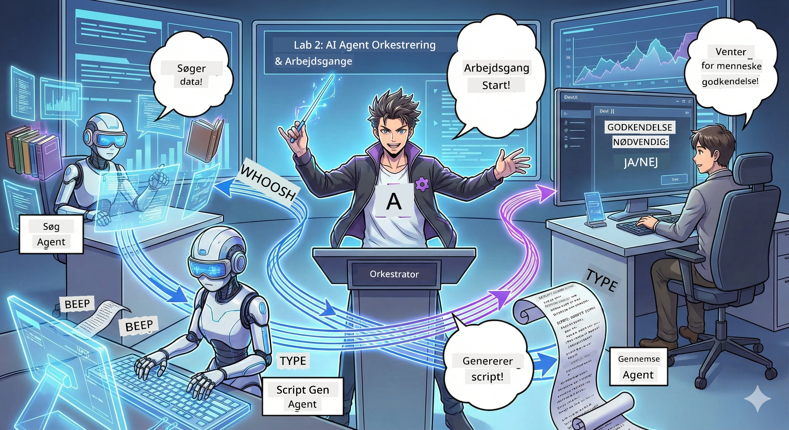

<!--
CO_OP_TRANSLATOR_METADATA:
{
  "original_hash": "2a2578dc4f813ca93ca7952d842a4b59",
  "translation_date": "2026-01-05T14:56:41+00:00",
  "source_file": "WorkshopForAgentic/translation/zh-cn/02.AIAgentOrchestrationAndWorkflows.md",
  "language_code": "da"
}
-->
# Akt 2: Opbyg dit podcast-produktionshold 🎬



## Øget spænding

Alex (din AI-assistent fra akt 1) er fantastisk, men en enkelt agent kan ikke drive et helt podcast-studie. Du har brug for et *hold*:
- 🔍 **Forskningsagent**: søger nettet efter frisk information
- ✍️ **Manuskriptagent**: omsætter forskning til fængende dialog
- 👤 **Dig (redaktøren)**: godkender manuskriptet eller sender det til omskrivning

Velkommen til **AI-agentorkestrering** — du bliver instruktøren af dit eget AI-hold. Tænk på Avengers, men til podcast-produktion.

## Hvad er agentorkestrering? (den korte version)

Forestil dig, at du driver en restaurant. Du laver ikke alting selv, vel? Du har:
- 🍳 Kokken til at lave mad
- 👨‍🍳 Souschefen til at forberede
- 👩‍🍳 Tjeneren til at levere maden

Agentorkestrering er det samme koncept, men med AI. Hver agent har en ekspertise, og du koordinerer dem for at nå et større mål. Ingen enkelt agent bliver overbelastet, og arbejdet bliver udført hurtigere.

### Band-analogi 🎸

Dine AI-agenter er som et band:
- **Forsanger**: håndterer kundeprægede opgaver som hovedagent
- **Trommeslager**: holder rytmen med back-end opgaver
- **Bassist**: støtter alle, henter data
- **Dig (bandmanageren)**: koordinerer det hele!

Ingen koordinering? Bare støj. Orkestrering? Fantastisk musik.

### Hvorfor det betyder noget

En enkelt AI-agent, der prøver at gøre alt = udbrændthed. Specialiserede agenter, der arbejder sammen = effektivitet låst op! 🚀

**Ærligt talt**: Kan du huske, da du forsøgte at forske, skrive og redigere din podcast alene? Ja, det var et rod. Med orkestrering håndterer hver agent det, de er bedst til. Du tager bare den endelige beslutning.

**Virkelige eksempler**: Kundesupport-robotter ved, hvornår de skal håndtere fakturering versus tekniske spørgsmål versus hvornår de skal tilkalde en menneskelig medarbejder. Det er orkestrering!

## Agent vs. workflow: Hvad er forskellen?

Tænk sådan her:

### 🤖 AI-agent = jazzmusiker
- **Improviserer** baseret på, hvad den hører
- **Improviserer** med sine værktøjer for at løse problemer
- **Tænker** med en LLM-hjerne
- **Tilpasser sig** alt, du kaster efter den

### 🎵 Workflow = symfoniorkester, der spiller klassisk musik
- **Følger partituret** (foruddefinerede trin)
- **Forudsigelig** udførelsessti
- **Koordinerer** flere agenter, mennesker og systemer
- **Struktureret** som en opskrift

**Magien**: workflow *orkestrerer* agenter! Du bygger en workflow, der fortæller agenterne, hvornår de skal træde til. Det bedste fra to verdener. 🎭

## Tre måder at koordinere dit AI-hold på

### 1. 🎯 Centraliseret (du er chefen)

En hovedagent udsteder kommandoer. Tænk på det som at du leder et hold – du bestemmer, hvem der gør hvad og hvornår.

**Fordele**:
- ✅ Klar ledelse (ingen forvirring)
- ✅ Konsistente beslutninger
- ✅ Let at fejlfinde

**Bruges til**:
- Kundeservicerouting (“Er det fakturering eller teknisk support?”)
- Indholds-godkendelsesworkflow (“Består dette manuskript?”)
- Podcast-produktion (præcis det, vi bygger!)

### 2. 🤝 Decentraliseret (agent-selvorganisering)

Agenter taler direkte sammen og løser problemer som et kollektiv. Som en chatgruppe, hvor alle koordinerer.

**Fordele**:
- ✅ Let at skalere (tilføj flere agenter når som helst)
- ✅ Ingen enkelt fejlkilde
- ✅ Naturligt samarbejde mellem agenter

**Bruges til**:
- Forskningshold (hver agent udforsker forskellige kilder)
- Brainstorm-møder
- Distribueret problemløsning

### 3. 🔀 Hybrid (det bedste af begge verdener)

Du sætter den overordnede retning, men agenterne har frihed til selvorganisering i opgaver. Som en CEO, der stoler på sit team.

**Perfekt til**: Kompleks projekter, der kræver både kontrol og fleksibilitet.

## Microsoft Agent Framework: dit orkestreringsværktøj 🧰

Det er tid til at bygge! Her er hvad du skal bruge:

### Bygningselementer

#### 1. 🧱 Executor (dine arbejdere)
- **Hvad er de?**: Separate behandlingsenheder – kan være agenter eller brugerdefineret logik
- **Hvad gør de?**: Modtager input, udfører arbejde, genererer output
- **Tænk på dem som**: arbejdsstationer på en samlebånd

#### 2. ➡️ Kanter (forbindelser)
- **Hvad er de?**: Stier mellem executors
- **Hvad gør de?**: Kontrollerer besked-flow (“Efter A, gå til B”)
- **Tænk på dem som**: pile i et flowdiagram

#### 3. 🗺️ Workflow (overall plan)
- **Hvad er de?**: Det komplette diagram af executors + kanter
- **Hvad gør de?**: Definerer den fulde proces fra start til slut
- **Tænk på dem som**: din produktionsproces blåtryk

### Seje funktioner, du vil elske

**🛡️ Typesikkerhed**: Beskeder mellem agenter er type-tjekket. Ingen “Ups, forkert datatype”-overraskelser.

**🔀 Fleksibel routing**:
- If-then betingelser (“Hvis godkendt, udgiv; ellers omskriv”)
- Parallel behandling (flere agenter arbejder samtidig)
- Dynamiske stier (workflow tilpasser sig resultater)

**🔌 Ekstern integration**:
- Tilslut til API’er
- Tilføj menneskelige i loop checkpoints (du godkender før udgivelse)
- Byg request/response flows

**💾 Checkpoints**: Gem fremdriften! Hvis noget går ned, fortsæt hvor du slap.

**🤝 Multi-agent koordinering**:
- Kør agenter sekventielt (A → B → C)
- Kør dem parallelt (A + B + C på samme tid)
- Overlevering mellem agenter
- Samarbejdende behandling

## Best Practices (pro tips) 🎯

### 1. Hold det modulært
Hver agent skal virkelig være god til én ting. Lav ikke en “superagent”, der prøver at gøre alt – du vil fortryde det under fejlfinding.

### 2. Planlæg for fejl
Agenter fejler. Netværk dropper. Byg fejlbehandling og backup-planer. Din fremtidige jeg vil takke dig.

### 3. Overvåg alt
Hold øje med, hvad dine agenter laver. Brug DevUI (kommer snart!) til at se workflows i aktion.

### 4. Optimer beskedstørrelse
Send ikke store filer mellem agenter. Hold beskeder små for hastighed.

### 5. Vælg det rette mønster
Brug centraliseret for kontrol. Decentraliseret for skalering. Kan’t vælge? Tag hybrid!

## DevUI: Din workflow-debugger 🔍

### Hvad er DevUI?

DevUI er som en legeplads til at teste dine agenter og workflows. Det er en webgrænseflade, hvor du kan:
- 👀 Se dine workflows køre
- 💬 Chat direkte med agenter
- 🔍 Debugge når noget går galt
- 📊 Se sporing og performance-metrikker

> **Vigtigt**: DevUI er kun til udvikling! Brug ikke i produktion. Tænk på det som dit lokale testmiljø.

### Hvorfor det er fedt

- **🖥️ Interaktiv web-UI**: Klik, skriv, test – ingen kommandolinje nødvendig
- **📁 Drag & drop**: Upload filer, test med forskellige input
- **📂 Auto-opdagelse**: Peg på en mappe, den finder automatisk alle agenter
- **📋 Ingen mappeopsætning**: Registrer agenter i kode, ikke i mappestruktur
- **🔌 OpenAI kompatibel**: Fungerer sammen med OpenAI SDK (kompatibilitet FTW!)
- **👁️ Indbygget sporing**: Se præcis, hvad dine agenter laver

### Sådan fungerer input

DevUI er smart med input:

- **Tester en agent?** Du får tekstboks og filupload-knap
- **Tester en workflow?** UI genererer automatisk inputfelter baseret på workflowens forventninger

Det føles som magi, men det er bare god kode. ✨

## Din opgave: Byg podcast-studiet 🎬

### Opgave 1: Byg en enkelt agent med DevUI

📂 [01.AgentDevUI](../../../../../WorkshopForAgentic/code/02.Workflow/01.AgentDevUI)

**Udfordring**: Før du bygger et helt hold, lad os teste DevUI med en enkelt agent: ekspert i netværkssøgning.

**Hvad du bygger**:
En forskningsagent, der kan søge internettet efter podcast-emner. Du tester i DevUI’s webinterface på `http://localhost:8090`.

**Færdigheder, du lærer**:
- 🚀 Starte en agent i DevUI
- 🔍 Teste agentens respons live
- 🛠️ Bygge tilpassede værktøjer (web-søgning)
- 📊 Aktivere sporing for fejlfinding
- 🖥️ Bruge interaktiv web-UI

**Kode**:
- `agent.py`: din SearchAgent med superkræfter til net-søgning
- Brug OllamaChatClient til at forbinde til Qwen
- Implementer værktøjsfunktionen `web_search()`
- Start med `serve()` — åbner DevUI automatisk

**Succes**: Spørg din agent “Hvad er hot i AI-feltet?” og se den søge nettet! 🎉

### Opgave 2: Byg multi-agent workflow

📂 [02.WorkflowDevUI](../../../../../WorkshopForAgentic/code/02.Workflow/02.WorkflowDevUI)

**Udfordring**: Nu starter det rigtige sjove! Byg en fuld podcast-produktionsworkflow:
1. 🔍 **Søgeagent** → undersøg dit emne
2. ✍️ **Manuskriptagent** → skriv dialog mellem to værter (på kinesisk!)
3. 👤 **Godkendelses-executor** → bed om din godkendelse eller afvisning
4. 🔄 **Loop tilbage** → skriv om baseret på feedback, hvis afvist

**Færdigheder du lærer**:
- 🧱 Opret specialiserede agenter til forskelligt arbejde
- 🔗 Brug WorkflowBuilder til at forbinde agenter
- 🔀 Implementer godkendelsesloop (menneske i loop!)
- 🚦 Betinget routing (godkend vs afvis)
- 🔧 Byg brugerdefinerede executors til forretningslogik

**Workflow**:
```
SearchAgent → ScriptAgent → ReviewExecutor
                             ↑          ↓ (如果被拒绝)
                             ←─────────
```

**Kode**:
- `search_agent/agent.py`: din forskningsekspert
- `generate_script_agent/agent.py`: din manuskriptforfatter (skriver på kinesisk!)
- `workflow/workflow.py`: orkestreringsmagien sker her
- `main.py`: starter det hele i DevUI

**Succes**: Giv et emne, gennemgå manuskript, afvis én gang for at teste loopet, og godkend til sidst! 🎉

### Opgave 3: Byg en konsolapplikation

📂 [03.Application](../../../../../WorkshopForAgentic/code/02.Workflow/03.Application)

**Udfordring**: Forvandl din workflow fra DevUI til en smart terminal-app med farvet output, loadingspiraler og filgemning. Klar til produktion!

**Færdigheder du lærer**:
- ⚡ Kør workflows programmatisk (uden DevUI)
- 📡 Event-drevet arkitektur med streaming
- 🎨 Byg flot terminal-UI (farver, spinner, progress bar)
- 💾 Gem det endelige manuskript til fil
- 🔄 Brug Pythons asyncio til asynkrone workflows

**Hvad den gør**:
1. Spørger efter podcast-emnet
2. Viser realtidsstatus (“Søgeagent arbejder...”)
3. Viser genereret manuskript med farver
4. Beder om din godkendelse
5. Gemmer det godkendte manuskript i `podcast.txt`

**Kode**:
- `podcast_app.py`: din hovedapp med eventhåndtering
- `workflow.py`: genbrug workflowen fra opgave 2
- Håndter begivenheder: `AgentRunUpdateEvent`, `RequestInfoEvent`, `WorkflowOutputEvent`
- Brug ANSI farver til terminalstil

**Succesbetingelse**: Kør applikationen, opret en podcastmanuskript, og se det blive gemt! Du har bygget et ægte værktøj.🚀

## Det, du allerede mestrer 🏆

Efter akt 2 kan du:

- ✅ Orkestrere flere AI-agenter som en chef
- ✅ Bygge workflows med sekventiel og betinget logik
- ✅ Tilføje manuelle godkendelsespunkter
- ✅ Teste og fejlfinde workflows med DevUI
- ✅ Oprette produktionsklare konsolprogrammer
- ✅ Håndtere fejl yndefuldt i komplekse systemer
- ✅ Vælge den rigtige orkestreringsmodel til ethvert projekt

## Når ting går galt 🔧

### "Mit workflow er for komplekst!"
**Løsning**: Opdel det i mindre underworkflows. Hvert workflow skal gøre én ting godt. Link dem sammen, hvis nødvendigt.

### "Jeg kan ikke følge med i, hvad der sker!"
**Løsning**: Brug workflowskontrolpunkter til at gemme tilstande. Aktivér sporing i DevUI for at se hver trin.

### "En agents fejl styrter hele systemet!"
**Løsning**: Tilføj fejlgraenser. Hver agent bør håndtere sine egne fejl og have fallback-adfærd.

### "Det går for langsomt"
**Løsning**: Kan agenter køre parallelt? Sekventielle workflows er nemme, men langsomme. Søg efter parallelliseringsmuligheder!

## Nyttige ressourcer 🔗

- [Workflow-dokumentation](https://learn.microsoft.com/en-us/agent-framework/user-guide/workflows/overview) —— Microsofts officielle guide
- [Orkestreringsmønstre](https://www.ibm.com/think/topics/ai-agent-orchestration) —— IBMs perspektiv
- [Agent Framework GitHub](https://github.com/microsoft/agent-framework) —— Gennemse kildekoden
- [Kodeeksempler](https://github.com/microsoft/agent-framework/tree/main/python/samples) —— Stjæl mønstre herfra

---

**Klar til finalen?** Du har manuskriptet. Lad os nu gøre det til ægte lyd!→ [Akt 3: Få din podcast til at leve](03.Multi-SpeakerPodcastGenerationWithVibeVoice.md) 🎤

---

**Sidder du fast? Forvirret? Begejstret?** Del det i workshop-chatten! Vi lærer sammen.🚀

---

<!-- CO-OP TRANSLATOR DISCLAIMER START -->
**Ansvarsfraskrivelse**:
Dette dokument er blevet oversat ved hjælp af AI-oversættelsestjenesten [Co-op Translator](https://github.com/Azure/co-op-translator). Selvom vi bestræber os på nøjagtighed, skal du være opmærksom på, at automatiserede oversættelser kan indeholde fejl eller unøjagtigheder. Det oprindelige dokument på dets originalsprog bør betragtes som den autoritative kilde. For kritisk information anbefales professionel menneskelig oversættelse. Vi påtager os intet ansvar for misforståelser eller fejltolkninger, der opstår som følge af brugen af denne oversættelse.
<!-- CO-OP TRANSLATOR DISCLAIMER END -->