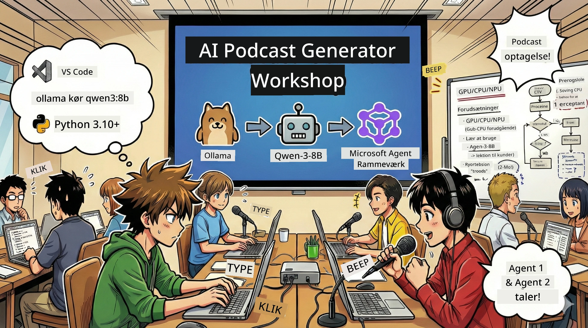

# 🎙️ AI Podcast Studio Workshop



## Din opgave

Velkommen til **AI Podcast Studio**! Du er ved at lancere din egen tech-podcast "Future Bytes" – men her er et twist: Du vil bygge et AI-drevet produktionsteam til at hjælpe dig med at skabe den. Ingen mere endeløs research, manuskriptskrivning og lydredigering. I stedet bliver du en podcaster med AI-superkræfter gennem programmering.

## Baggrundshistorie

Forestil dig: Du og dine venner vil starte en podcast om de fedeste techtrends, men alle er optaget af studier, arbejde eller livets kræfter. Hvad nu hvis du kunne bygge et team af AI-agenter til at klare det tunge arbejde? Én agent forsker i emner, en anden skriver engagerende manuskripter, en tredje omsætter tekst til naturlig flydende dialog. Lyder det som science fiction? Lad os gøre det til virkelighed.

## Hvad du vil lære

Når workshoppen er færdig, vil du vide, hvordan du:
- 🤖 Udruller din egen lokale AI-model (ingen API-udgifter, ingen cloud-afhængighed!)
- 🔧 Bygger professionelle AI-agenter, der arbejder sammen i praksis
- 🎬 Skaber en komplet podcast-produktion fra idé til lyd

## Din rejse: Tre akter

Som en god fortælling har vi tre akter. Hver akt opbygger gradvist dit AI Podcast Studio:

| Kapitel | Din opgave | Hvad sker der | Låste færdigheder op |
|---------|------------|---------------|---------------------|
| **Akt 1** | [Lær din AI-assistent at kende](01.BuildAIAgentWithSLM.md) | Du vil opdage, hvordan du skaber AI-agenter, der kan chatte, søge på nettet og endda løse problemer. Tænk på dem som forskningspraktikanter, der aldrig sover. | 🎯 Byg din første agent<br>🛠️ Giv den superkræfter (værktøjer!)<br>🧠 Lær den at tænke<br>🌐 Forbind til internettet |
| **Akt 2** | [Saml dit produktionsteam](02.AIAgentOrchestrationAndWorkflows.md) | Nu bliver det sjovt! Du vil orkestrere flere AI-agenter til at arbejde sammen som et reelt podcast-team. Én forsker, én skriver, du godkender – teamwork gør drømmen til virkelighed. | 🎭 Koordiner flere agenter<br>🔄 Byg godkendelses-workflows<br>🖥️ Test via DevUI-interface<br>✋ Hold menneskelig kontrol |
| **Akt 3** | [Få din podcast til at leve](03.Multi-SpeakerPodcastGenerationWithVibeVoice.md) | Grand finale! Konverter dine tekstmanuskripter til ægte podcast-lyd med realistiske stemmer og naturlig dialog. Din "Future Bytes" podcast er klar til udgivelse! | 🎤 Tekst-til-tale-magi<br>👥 Flere talerstemmer<br>⏱️ Langformat lyd<br>🚀 Fuld automatisering |

Hver akt låser nye færdigheder op. Du kan springe frem, hvis du er modig, men vi anbefaler at følge rækkefølgen!

## Miljøkrav

Denne workshop understøtter flere hardwaremiljøer:
- **CPU**: Velegnet til test og små brugsscenarier
- **GPU**: Anbefalet til produktion, giver betydeligt hurtigere inferens
- **NPU**: Understøtter næste generations neurale processoraccelerator

## Hvad du skal bruge

### Softwareliste ✅
- **Python 3.10+** (dit programmeringssprog)
- **Ollama** (din AI-modelkørsel på maskinen)
- **VS Code** (din kodeeditor)
- **Python-udvidelse** (gør VS Code smartere)
- **Git** (til at hente kode)

### Hardware-tjek 💻
- **Kan jeg køre det?**: 8GB RAM, 10GB ledig plads (kan bruges, men måske lidt langsomt)
- **Ideel opsætning**: 16GB+ RAM, et godt GPU (glat kørsel!)
- **Har du NPU?**: Så bliver det endnu bedre! Lås op for næste generations performance 🚀

## Byg dit studio 🎬

### Trin 1: Opdater Python

Sørg for, at du har Python 3.10 eller nyere:

```bash
python --version
# Bør vise Python 3.10.x eller højere version
```

Ingen Python? Få det fra [python.org](https://python.org) – det er gratis!

### Trin 2: Få Ollama (din AI-modelkører)

Gå til [ollama.ai](https://ollama.ai) og hent Ollama til dit operativsystem. Tænk på det som motoren, der kører AI-modeller lokalt.

Tjek om det er klar:

```bash
ollama --version
```

### Trin 3: Download din AI-hjerne 🧠

Det er tid til at hente Qwen-3-8B-modellen (som at ansætte din første AI-assistent):

```bash
ollama pull qwen3:8b
```

*Det kan tage et par minutter. Perfekt tid til en kop kaffe! ☕*

### Trin 4: Sæt VS Code op

Hvis du ikke allerede har det, hent [Visual Studio Code](https://code.visualstudio.com/). Det er den bedste kodeeditor (bare prøv det 😄).

### Trin 5: Python-udvidelsen

I VS Code:
1. Tryk `Ctrl+Shift+X` (på Mac `Cmd+Shift+X`)
2. Søg efter "Python"
3. Installer den officielle Microsoft Python-udvidelse

### Trin 6: Du er klar! 🎉

Alvorligt, du er klar. Lad os bygge noget AI-magi!

### Trin 7: Installer Microsoft Agent Framework og nødvendige pakker 📦

Installer alle afhængigheder for workshoppen:

```bash
pip install -r ./Installations/requirements.txt -U
```

*Dette installerer Microsoft Agent Framework og alle nødvendige pakker. Tag en kop kaffe – første installation kan tage et par minutter! ☕*

## Workshopinstruktioner

Detaljeret projektstruktur, konfigurationssteps og udførelsesmetode vil blive udførligt forklaret under workshoppen.

## Fejlfinding (når ting går galt) 🔧

### "Åh nej, modellen downloader for langsomt!"
**Løsning**: Brug en VPN eller konfigurer Ollama mirror-source. Nogle gange er netværket bare langsomt.

### "Min computer går ned! Ikke nok RAM!"
**Løsning**: Skift til en mindre model eller juster `num_ctx` for at bruge mindre hukommelse. Tænk på det som en diæt til din AI.

### "Kan jeg få det til at køre hurtigere med GPU?"
**Løsning**: Ollama opdager automatisk GPU! Sørg bare for, at dine GPU-drivere er opdaterede. Gratis hastighedsboost! 🏎️

## Ekstra ressourcer (til den nysgerrige) 📚

- [Ollama dokumentation](https://github.com/ollama/ollama) – Lær mere om lokale AI-modeller
- [Microsoft Agent Framework](https://microsoft.github.io/autogen/) – Lær om at bygge agentteams
- [Qwen model info](https://qwenlm.github.io/) – Mød hjernen bag din AI-assistent

## Licens

MIT-licens – byg fede ting, del dem, og gør verden bedre! 🌍

## Vil du bidrage?

Fandt du en fejl? Har du idéer? Indsend en Issue eller PR! Vi elsker fællesskabet. ✨

---

<!-- CO-OP TRANSLATOR DISCLAIMER START -->
**Ansvarsfraskrivelse**:
Dette dokument er oversat ved hjælp af AI-oversættelsestjenesten [Co-op Translator](https://github.com/Azure/co-op-translator). Selvom vi bestræber os på nøjagtighed, bedes du være opmærksom på, at automatiserede oversættelser kan indeholde fejl eller unøjagtigheder. Det oprindelige dokument på dets modersmål skal betragtes som den autoritative kilde. For kritisk information anbefales professionel menneskelig oversættelse. Vi påtager os intet ansvar for misforståelser eller fejltolkninger, der opstår som følge af brugen af denne oversættelse.
<!-- CO-OP TRANSLATOR DISCLAIMER END -->