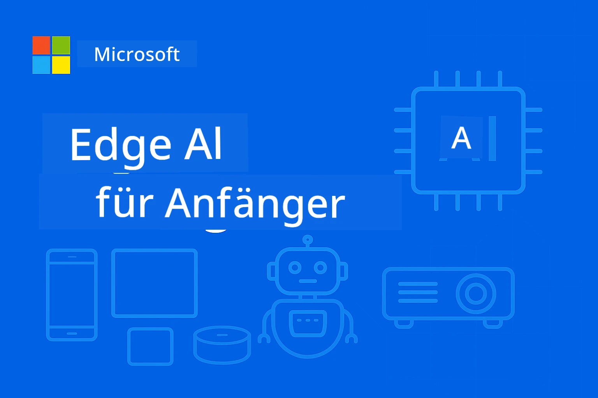

# EdgeAI für Einsteiger




[](https://GitHub.com/microsoft/edgeai-for-beginners/graphs/contributors)
[](https://GitHub.com/microsoft/edgeai-for-beginners/issues)
[](https://GitHub.com/microsoft/edgeai-for-beginners/pulls)
[](http://makeapullrequest.com)

[](https://GitHub.com/microsoft/edgeai-for-beginners/watchers)
[](https://GitHub.com/microsoft/edgeai-for-beginners/fork)
[](https://GitHub.com/microsoft/edgeai-for-beginners/stargazers)


[](https://discord.gg/nTYy5BXMWG)

Folgen Sie diesen Schritten, um mit der Nutzung dieser Ressourcen zu beginnen:

1. **Forken Sie das Repository**: Klicken Sie auf [](https://GitHub.com/microsoft/edgeai-for-beginners/fork)
2. **Klonen Sie das Repository**:   `git clone https://github.com/microsoft/edgeai-for-beginners.git`
3. [**Treten Sie dem Azure AI Foundry Discord bei und treffen Sie Experten und Entwicklerkollegen**](https://discord.com/invite/ByRwuEEgH4)


### 🌐 Mehrsprachige Unterstützung

#### Unterstützt via GitHub Action (Automatisiert & Immer aktuell)

<!-- CO-OP TRANSLATOR LANGUAGES TABLE START -->
[Arabisch](../ar/README.md) | [Bengalisch](../bn/README.md) | [Bulgarisch](../bg/README.md) | [Birmanisch (Myanmar)](../my/README.md) | [Chinesisch (Vereinfacht)](../zh-CN/README.md) | [Chinesisch (Traditionell, Hong Kong)](../zh-HK/README.md) | [Chinesisch (Traditionell, Macau)](../zh-MO/README.md) | [Chinesisch (Traditionell, Taiwan)](../zh-TW/README.md) | [Kroatisch](../hr/README.md) | [Tschechisch](../cs/README.md) | [Dänisch](../da/README.md) | [Niederländisch](../nl/README.md) | [Estnisch](../et/README.md) | [Finnisch](../fi/README.md) | [Französisch](../fr/README.md) | [Deutsch](./README.md) | [Griechisch](../el/README.md) | [Hebräisch](../he/README.md) | [Hindi](../hi/README.md) | [Ungarisch](../hu/README.md) | [Indonesisch](../id/README.md) | [Italienisch](../it/README.md) | [Japanisch](../ja/README.md) | [Kannada](../kn/README.md) | [Koreanisch](../ko/README.md) | [Litauisch](../lt/README.md) | [Malaiisch](../ms/README.md) | [Malayalam](../ml/README.md) | [Marathi](../mr/README.md) | [Nepalesisch](../ne/README.md) | [Nigerianisches Pidgin](../pcm/README.md) | [Norwegisch](../no/README.md) | [Persisch (Farsi)](../fa/README.md) | [Polnisch](../pl/README.md) | [Portugiesisch (Brasilien)](../pt-BR/README.md) | [Portugiesisch (Portugal)](../pt-PT/README.md) | [Punjabi (Gurmukhi)](../pa/README.md) | [Rumänisch](../ro/README.md) | [Russisch](../ru/README.md) | [Serbisch (Kyrillisch)](../sr/README.md) | [Slowakisch](../sk/README.md) | [Slowenisch](../sl/README.md) | [Spanisch](../es/README.md) | [Swahili](../sw/README.md) | [Schwedisch](../sv/README.md) | [Tagalog (Filipino)](../tl/README.md) | [Tamil](../ta/README.md) | [Telugu](../te/README.md) | [Thailändisch](../th/README.md) | [Türkisch](../tr/README.md) | [Ukrainisch](../uk/README.md) | [Urdu](../ur/README.md) | [Vietnamesisch](../vi/README.md)

> **Möchten Sie lieber lokal klonen?**

> Dieses Repository enthält über 50 Sprachübersetzungen, die die Downloadgröße erheblich erhöhen. Um ohne Übersetzungen zu klonen, verwenden Sie Sparse Checkout:
> ```bash
> git clone --filter=blob:none --sparse https://github.com/microsoft/edgeai-for-beginners.git
> cd edgeai-for-beginners
> git sparse-checkout set --no-cone '/*' '!translations' '!translated_images'
> ```
> Damit erhalten Sie alles, was Sie für den Kurs benötigen, bei einem deutlich schnelleren Download.
<!-- CO-OP TRANSLATOR LANGUAGES TABLE END -->

**Wenn Sie zusätzliche Übersetzungen wünschen, sind unterstützte Sprachen [hier](https://github.com/Azure/co-op-translator/blob/main/getting_started/supported-languages.md) aufgelistet**
## Einführung

Willkommen zu **EdgeAI für Einsteiger** – Ihre umfassende Reise in die transformative Welt der Edge-Künstlichen Intelligenz. Dieser Kurs überbrückt die Kluft zwischen leistungsstarken KI-Fähigkeiten und deren praktischer, realer Implementierung auf Edge-Geräten und befähigt Sie, das Potenzial der KI direkt dort zu nutzen, wo Daten erzeugt werden und Entscheidungen getroffen werden müssen.

### Was Sie meistern werden

Dieser Kurs führt Sie von grundlegenden Konzepten zu produktionsbereiten Implementierungen und behandelt:
- **Kleine Sprachmodelle (SLMs)**, optimiert für den Einsatz am Edge
- **Hardwarebewusste Optimierung** für diverse Plattformen
- **Echtzeit-Inferenz** mit Datenschutzfunktionen
- **Produktionsstrategien** für Unternehmenseinsätze

### Warum EdgeAI wichtig ist

Edge AI stellt einen Paradigmenwechsel dar, der kritische moderne Herausforderungen adressiert:
- **Datenschutz & Sicherheit**: Verarbeitung sensibler Daten lokal ohne Cloud-Exposition
- **Echtzeit-Leistung**: Eliminierung der Netzwerkverzögerung bei zeitkritischen Anwendungen
- **Kostenersparnis**: Reduzierung von Bandbreite und Cloud-Computing-Kosten
- **Resiliente Abläufe**: Aufrechterhaltung der Funktionalität bei Netzausfällen
- **Regulatorische Compliance**: Erfüllung von Anforderungen zur Datenhoheit

### Edge AI

Edge AI bezeichnet das Ausführen von KI-Algorithmen und Sprachmodellen lokal auf Hardware, nahe am Ort der Datenerzeugung, ohne auf Cloud-Ressourcen für die Inferenz angewiesen zu sein. Es reduziert Latenzen, erhöht den Datenschutz und ermöglicht Echtzeit-Entscheidungen.

### Kernprinzipien:
- **On-Device Inferenz**: KI-Modelle laufen auf Edge-Geräten (Handys, Router, Mikrocontroller, Industrie-PCs)
- **Offline-Fähigkeit**: Funktioniert ohne permanente Internetverbindung
- **Niedrige Latenz**: Sofortige Reaktionen, geeignet für Echtzeitsysteme
- **Datenhoheit**: Behält sensible Daten lokal, verbessert Sicherheit und Compliance

### Kleine Sprachmodelle (SLMs)

SLMs wie Phi-4, Mistral-7B und Gemma sind optimierte Versionen größerer LLMs – trainiert oder destilliert für:
- **Reduzierten Speicherbedarf**: Effiziente Nutzung begrenzten Speichers auf Edge-Geräten
- **Geringeren Rechenbedarf**: Optimiert für CPU und Edge-GPU-Leistung
- **Schneller Start**: Rasche Initialisierung für reaktionsfähige Anwendungen

Sie eröffnen leistungsstarke NLP-Fähigkeiten und erfüllen gleichzeitig die Anforderungen von:
- **Eingebetteten Systemen**: IoT-Geräte und industrielle Steuerungen
- **Mobilgeräten**: Smartphones und Tablets mit Offline-Funktionalität
- **IoT-Geräten**: Sensoren und smarte Geräte mit begrenzten Ressourcen
- **Edge-Servern**: Lokale Verarbeitungseinheiten mit begrenzten GPU-Ressourcen
- **Personal Computern**: Einsatzszenarien auf Desktop und Laptop

## Kursmodule & Navigation

| Modul | Thema | Schwerpunkt | Hauptinhalt | Niveau | Dauer |
|--------|-------|------------|-------------|--------|----------|
| [📖 00 ](./introduction.md) | [Einführung in EdgeAI](./introduction.md) | Grundlagen & Kontext | EdgeAI Überblick • Branchenanwendungen • SLM Einführung • Lernziele | Anfänger | 1-2 Std. |
| [📚 01](../../Module01) | [EdgeAI Grundlagen](./Module01/README.md) | Vergleich Cloud vs. Edge AI | EdgeAI Grundlagen • Fallstudien aus der Praxis • Implementierungsleitfaden • Edge Deployment | Anfänger | 3-4 Std. |
| [🧠 02](../../Module02) | [Grundlagen zu SLM-Modellen](./Module02/README.md) | Modellfamilien & Architektur | Phi Familie • Qwen Familie • Gemma Familie • BitNET • μModel • Phi-Silica | Anfänger | 4-5 Std. |
| [🚀 03](../../Module03) | [SLM Deployment Praxis](./Module03/README.md) | Lokale & Cloud-Deployment | Fortgeschrittenes Lernen • Lokale Umgebung • Cloud Deployment | Mittelstufe | 4-5 Std. |
| [⚙️ 04](../../Module04) | [Modelloptimierungs-Toolkit](./Module04/README.md) | Plattformübergreifende Optimierung | Einführung • Llama.cpp • Microsoft Olive • OpenVINO • Apple MLX • Workflow-Synthese | Mittelstufe | 5-6 Std. |
| [🔧 05](../../Module05) | [SLMOps Produktion](./Module05/README.md) | Produktionsbetrieb | SLMOps Einführung • Modell-Destillation • Feinabstimmung • Produktions-Deployment | Fortgeschritten | 5-6 Std. |
| [🤖 06](../../Module06) | [KI-Agenten & Function Calling](./Module06/README.md) | Agenten-Frameworks & MCP | Agenten Einführung • Funktionsaufrufe • Modell-Kontext-Protokoll | Fortgeschritten | 4-5 Std. |
| [💻 07](../../Module07) | [Plattformimplementierung](./Module07/README.md) | Plattformübergreifende Beispiele | AI Toolkit • Foundry Local • Windows-Entwicklung | Fortgeschritten | 3-4 Std. |
| [🏭 08](../../Module08) | [Foundry Local Toolkit](./Module08/README.md) | Produktionsreife Beispiele | Beispielanwendungen (siehe unten) | Experte | 8-10 Std. |

### 🏭 **Modul 08: Beispielanwendungen**

- [01: REST Chat Quickstart](./Module08/samples/01/README.md)
- [02: OpenAI SDK Integration](./Module08/samples/02/README.md)
- [03: Model Discovery & Benchmarking](./Module08/samples/03/README.md)
- [04: Chainlit RAG Anwendung](./Module08/samples/04/README.md)
- [05: Multi-Agent Orchestrierung](./Module08/samples/05/README.md)
- [06: Models-as-Tools Router](./Module08/samples/06/README.md)
- [07: Direkter API-Client](./Module08/samples/07/README.md)
- [08: Windows 11 Chat App](./Module08/samples/08/README.md)
- [09: Fortgeschrittenes Multi-Agent System](./Module08/samples/09/README.md)
- [10: Foundry Tools Framework](./Module08/samples/10/README.md)

### 🎓 **Workshop: Praktischer Lernpfad**

Umfassende Workshop-Materialien mit produktionsreifen Implementierungen:

- **[Workshop-Anleitung](./Workshop/Readme.md)** – Vollständige Lernziele, Ergebnisse und Ressourcen-Navigation
- **Python-Beispiele** (6 Sessions) – Aktualisiert mit Best Practices, Fehlerbehandlung und umfassender Dokumentation
- **Jupyter Notebooks** (8 interaktive) – Schritt-für-Schritt-Anleitungen mit Benchmarks und Leistungsüberwachung
- **Session-Anleitungen** – Ausführliche Markdown-Leitfäden für jede Workshopsitzung
- **Validierungstools** – Skripte zur Qualitätsprüfung und Durchführung von Schnelltests

**Was Sie bauen werden:**
- Lokale KI-Chat-Anwendungen mit Streaming-Unterstützung
- RAG-Pipelines mit Qualitätsevaluation (RAGAS)
- Multi-Modell-Benchmarking- und Vergleichstools
- Multi-Agent-Orchestrierungssysteme
- Intelligente Modell-Routing mit aufgabenbasierter Auswahl

### 🎙️ **Workshop für Agentic: Hands-On - Das AI Podcast Studio**

Bauen Sie eine KI-gestützte Podcast-Produktionspipeline von Grund auf! Dieser immersive Workshop lehrt Sie, ein komplettes Multi-Agent-System zu erstellen, das Ideen in professionelle Podcast-Episoden verwandelt.
**[🎬 Starte den AI Podcast Studio Workshop](./WorkshopForAgentic/README.md)**

**Deine Mission**: Starte „Future Bytes“ — ein Tech-Podcast, der vollständig von KI-Agenten betrieben wird, die du selbst entwickelst. Keine Cloud-Abhängigkeiten, keine API-Kosten — alles läuft lokal auf deinem Rechner.

**Was das Einzigartig macht:**
- **🤖 Echte Multi-Agent Orchestrierung** – Baue spezialisierte KI-Agenten, die recherchieren, schreiben und Audio produzieren
- **🎯 Komplett-Pipeline für die Produktion** – Von der Themenauswahl bis zum finalen Podcast-Audio
- **💻 100 % lokale Bereitstellung** – Nutzt Ollama und lokale Modelle (Qwen-3-8B) für volle Privatsphäre und Kontrolle
- **🎤 Text-zu-Sprache Integration** – Verwandle Skripte in natürlich klingende Multi-Sprecher-Gespräche
- **✋ Menschliche Kontrollschleifen** – Freigabestufen stellen Qualität sicher und bewahren die Automatisierung

**Lernreise in drei Akten:**

| Akt | Schwerpunkt | Schlüsselkompetenzen | Dauer |
|-----|-------------|---------------------|--------|
| **[Akt 1: Lerne deine KI-Assistenten kennen](./WorkshopForAgentic/md/01.BuildAIAgentWithSLM.md)** | Baue deinen ersten KI-Agenten | Tool-Integration • Websuche • Problemlösung • Agentisches Denken | 2-3 Std. |
| **[Akt 2: Stelle dein Produktionsteam zusammen](./WorkshopForAgentic/md/02.AIAgentOrchestrationAndWorkflows.md)** | Orchestrierung mehrerer Agenten | Teamkoordination • Freigabe-Workflows • DevUI-Oberfläche • Menschliche Aufsicht | 3-4 Std. |
| **[Akt 3: Erwecke deinen Podcast zum Leben](./WorkshopForAgentic/md/03.Multi-SpeakerPodcastGenerationWithVibeVoice.md)** | Erzeuge Podcast-Audio | Text-zu-Sprache • Multi-Sprecher-Synthese • Langformat-Audio • Volle Automatisierung | 2-3 Std. |

**Verwendete Technologien:**
- **Microsoft Agent Framework** – Multi-Agent-Orchestrierung und Koordination
- **Ollama** – Lokale KI-Modell-Laufzeit (keine Cloud erforderlich)
- **Qwen-3-8B** – Open-Source-Sprachmodell, optimiert für agentische Aufgaben
- **Text-zu-Sprache-APIs** – Natürliche Sprachsynthese für Podcast-Erstellung

**Hardware-Unterstützung:**
- ✅ **CPU-Modus** – Funktioniert auf jedem modernen Computer (8 GB+ RAM empfohlen)
- 🚀 **GPU-Beschleunigung** – Deutlich schnellere Inferenz mit NVIDIA/AMD-GPUs
- ⚡ **NPU-Unterstützung** – Beschleunigung durch nächste Generation von neuronalen Verarbeitungseinheiten

**Perfekt für:**
- Entwickler, die Multi-Agent KI-Systeme lernen wollen
- Alle, die an KI-Automatisierung und Workflows interessiert sind
- Content-Ersteller, die KI-unterstützte Produktion erkunden
- Studierende, die praktische KI-Orchestrierungsmuster studieren

**Starte jetzt**: [🎙️ Der AI Podcast Studio Workshop →](./WorkshopForAgentic/README.md)

### 📊 **Zusammenfassung des Lernpfads**
- **Gesamtdauer**: 36-45 Stunden
- **Anfängerpfad**: Module 01-02 (7-9 Stunden)  
- **Fortgeschrittenenpfad**: Module 03-04 (9-11 Stunden)
- **Professioneller Pfad**: Module 05-07 (12-15 Stunden)
- **Expertenpfad**: Modul 08 (8-10 Stunden)

## Was du bauen wirst

### 🎯 Kernkompetenzen
- **Edge KI-Architektur**: Entwerfe lokal-fokussierte KI-Systeme mit Cloud-Integration
- **Modelloptimierung**: Quantisiere und komprimiere Modelle für Edge-Bereitstellung (85 % Geschwindigkeitssteigerung, 75 % Größenreduktion)
- **Multi-Plattform-Bereitstellung**: Windows, mobil, eingebettet und Cloud-Edge-Hybridsysteme
- **Produktionsbetrieb**: Überwachung, Skalierung und Wartung von Edge KI im Produktionseinsatz

### 🏗️ Praxisprojekte
- **Foundry Local Chat Apps**: Windows 11 native Anwendung mit Modellwechsel
- **Multi-Agentensysteme**: Koordinator mit Spezialagenten für komplexe Workflows  
- **RAG-Anwendungen**: Lokale Dokumentenverarbeitung mit Vektorsuche
- **Modell-Router**: Intelligente Auswahl zwischen Modellen basierend auf Aufgabenanalyse
- **API-Frameworks**: Produktionsfertige Clients mit Streaming und Gesundheitsüberwachung
- **Cross-Plattform-Tools**: LangChain/Semantic Kernel Integration Patterns

### 🏢 Branchenanwendungen
**Fertigung** • **Gesundheitswesen** • **Autonome Fahrzeuge** • **Smart Cities** • **Mobile Apps**

## Schnellstart

**Empfohlener Lernpfad** (insgesamt 20-30 Stunden):

0. **📖 Einführung** ([Introduction.md](./introduction.md)): EdgeAI Grundlagen + Branchenkontext + Lernrahmen
1. **📚 Grundlagen** (Module 01-02): EdgeAI-Konzepte + SLM Modellfamilien
2. **⚙️ Optimierung** (Module 03-04): Bereitstellung + Quantisierungs-Frameworks  
3. **🚀 Produktion** (Module 05-06): SLMOps + KI-Agenten + Funktionsaufrufe
4. **💻 Implementierung** (Module 07-08): Plattformbeispiele + Foundry Local Toolkit

Jedes Modul enthält Theorie, praktische Übungen und produktionsfertige Codebeispiele.

## Karriereauswirkung

**Technische Rollen**: EdgeAI Solutions Architect • ML Engineer (Edge) • IoT KI-Entwickler • Mobile KI-Entwickler

**Branchenbereiche**: Fertigung 4.0 • Medizintechnik • Autonome Systeme • FinTech • Unterhaltungselektronik

**Portfolio-Projekte**: Multi-Agent-Systeme • Produktions-RAG-Apps • Cross-Plattform-Bereitstellung • Leistungsoptimierung

## Repository-Struktur

```
edgeai-for-beginners/
├── 📖 introduction.md  # Foundation: EdgeAI Overview & Learning Framework
├── 📚 Module01-04/     # Fundamentals → SLMs → Deployment → Optimization  
├── 🔧 Module05-06/     # SLMOps → AI Agents → Function Calling
├── 💻 Module07/        # Platform Samples (VS Code, Windows, Jetson, Mobile)
├── 🏭 Module08/        # Foundry Local Toolkit + 10 Comprehensive Samples
│   ├── samples/01-06/  # Foundation: REST, SDK, RAG, Agents, Routing
│   └── samples/07-10/  # Advanced: API Client, Windows App, Enterprise Agents, Tools
├── 🌐 translations/    # Multi-language support (8+ languages)
└── 📋 STUDY_GUIDE.md   # Structured learning paths & time allocation
```

## Kurs-Highlights

✅ **Fortschreitendes Lernen**: Theorie → Praxis → Produktionsbereitstellung  
✅ **Echte Fallstudien**: Microsoft, Japan Airlines, Unternehmensimplementierungen  
✅ **Praxisbeispiele**: 50+ Beispiele, 10 umfassende Foundry Local Demos  
✅ **Leistungsfokus**: 85 % Geschwindigkeitssteigerungen, 75 % Größenreduzierungen  
✅ **Multi-Plattform**: Windows, mobil, eingebettet, Cloud-Edge-Hybrid  
✅ **Produktionsbereit**: Überwachung, Skalierung, Sicherheit, Compliance-Frameworks

📖 **[Studienleitfaden verfügbar](STUDY_GUIDE.md)**: Strukturierter 20-Stunden-Lernpfad mit Zeitplanung und Selbstbewertungstools.

---

**EdgeAI repräsentiert die Zukunft der KI-Bereitstellung**: lokal-fokussiert, datenschutzbewahrend und effizient. Meistere diese Fähigkeiten, um die nächste Generation intelligenter Anwendungen zu entwickeln.

## Weitere Kurse

Unser Team bietet weitere Kurse an! Schau dir an:

<!-- CO-OP TRANSLATOR OTHER COURSES START -->
### LangChain
[](https://aka.ms/langchain4j-for-beginners)
[](https://aka.ms/langchainjs-for-beginners?WT.mc_id=m365-94501-dwahlin)
[](https://github.com/microsoft/langchain-for-beginners?WT.mc_id=m365-94501-dwahlin)
---

### Azure / Edge / MCP / Agents
[](https://github.com/microsoft/AZD-for-beginners?WT.mc_id=academic-105485-koreyst)
[](https://github.com/microsoft/edgeai-for-beginners?WT.mc_id=academic-105485-koreyst)
[](https://github.com/microsoft/mcp-for-beginners?WT.mc_id=academic-105485-koreyst)
[](https://github.com/microsoft/ai-agents-for-beginners?WT.mc_id=academic-105485-koreyst)

---

### Generative KI Serie
[](https://github.com/microsoft/generative-ai-for-beginners?WT.mc_id=academic-105485-koreyst)
[-9333EA?style=for-the-badge&labelColor=E5E7EB&color=9333EA)](https://github.com/microsoft/Generative-AI-for-beginners-dotnet?WT.mc_id=academic-105485-koreyst)
[-C084FC?style=for-the-badge&labelColor=E5E7EB&color=C084FC)](https://github.com/microsoft/generative-ai-for-beginners-java?WT.mc_id=academic-105485-koreyst)
[-E879F9?style=for-the-badge&labelColor=E5E7EB&color=E879F9)](https://github.com/microsoft/generative-ai-with-javascript?WT.mc_id=academic-105485-koreyst)

---

### Kernlernen
[](https://aka.ms/ml-beginners?WT.mc_id=academic-105485-koreyst)
[](https://aka.ms/datascience-beginners?WT.mc_id=academic-105485-koreyst)
[](https://aka.ms/ai-beginners?WT.mc_id=academic-105485-koreyst)
[](https://github.com/microsoft/Security-101?WT.mc_id=academic-96948-sayoung)
[](https://aka.ms/webdev-beginners?WT.mc_id=academic-105485-koreyst)
[](https://aka.ms/iot-beginners?WT.mc_id=academic-105485-koreyst)
[](https://github.com/microsoft/xr-development-for-beginners?WT.mc_id=academic-105485-koreyst)

---

### Copilot-Serie
[](https://aka.ms/GitHubCopilotAI?WT.mc_id=academic-105485-koreyst)
[](https://github.com/microsoft/mastering-github-copilot-for-dotnet-csharp-developers?WT.mc_id=academic-105485-koreyst)
[](https://github.com/microsoft/CopilotAdventures?WT.mc_id=academic-105485-koreyst)
<!-- CO-OP TRANSLATOR OTHER COURSES END -->

## Hilfe erhalten

Wenn Sie nicht weiterkommen oder Fragen zum Erstellen von KI-Anwendungen haben, treten Sie bei:

[](https://discord.gg/nTYy5BXMWG)

Wenn Sie Produktfeedback oder Fehler beim Erstellen haben, besuchen Sie:

[](https://aka.ms/foundry/forum)

---

<!-- CO-OP TRANSLATOR DISCLAIMER START -->
**Haftungsausschluss**:  
Dieses Dokument wurde mit dem KI-Übersetzungsdienst [Co-op Translator](https://github.com/Azure/co-op-translator) übersetzt. Obwohl wir um Genauigkeit bemüht sind, weisen wir darauf hin, dass automatisierte Übersetzungen Fehler oder Ungenauigkeiten enthalten können. Das ursprüngliche Dokument in seiner Ursprungssprache ist als maßgebliche Quelle zu betrachten. Für wichtige Informationen wird eine professionelle menschliche Übersetzung empfohlen. Wir übernehmen keine Haftung für Missverständnisse oder Fehlinterpretationen, die sich aus der Nutzung dieser Übersetzung ergeben.
<!-- CO-OP TRANSLATOR DISCLAIMER END -->