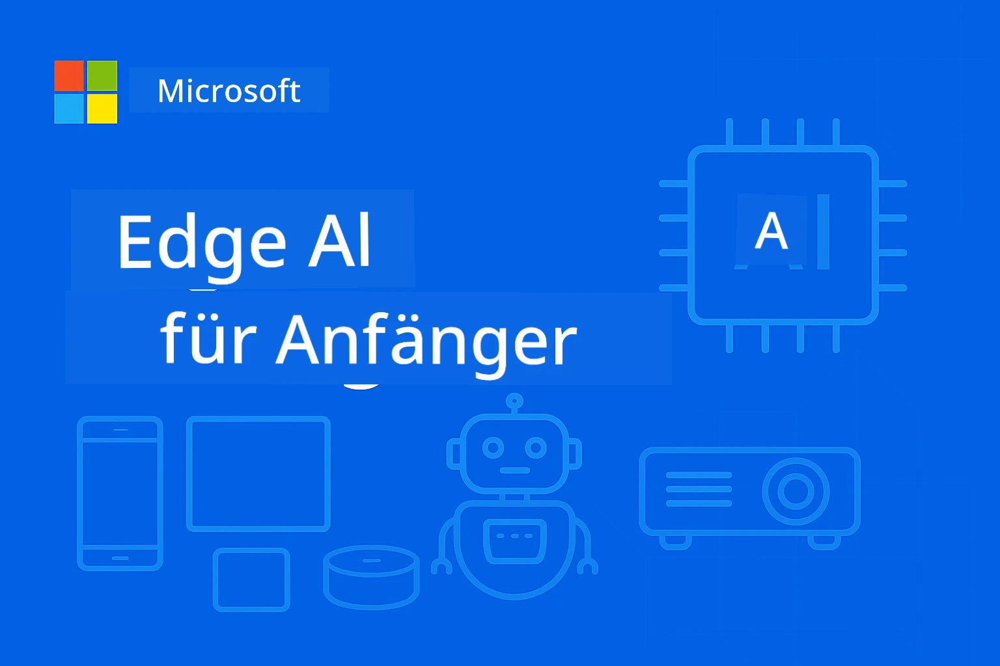

# EdgeAI für Einsteiger




[](https://GitHub.com/microsoft/edgeai-for-beginners/graphs/contributors)
[](https://GitHub.com/microsoft/edgeai-for-beginners/issues)
[](https://GitHub.com/microsoft/edgeai-for-beginners/pulls)
[](http://makeapullrequest.com)

[](https://GitHub.com/microsoft/edgeai-for-beginners/watchers)
[](https://GitHub.com/microsoft/edgeai-for-beginners/fork)
[](https://GitHub.com/microsoft/edgeai-for-beginners/stargazers)


[](https://discord.gg/nTYy5BXMWG)

Folgen Sie diesen Schritten, um mit der Nutzung dieser Ressourcen zu beginnen:

1. **Forken Sie das Repository**: Klicken Sie auf [](https://GitHub.com/microsoft/edgeai-for-beginners/fork)
2. **Klonen Sie das Repository**: `git clone https://github.com/microsoft/edgeai-for-beginners.git`
3. [**Treten Sie dem Azure AI Foundry Discord bei und treffen Sie Experten und Entwicklerkollegen**](https://discord.com/invite/ByRwuEEgH4)


### 🌐 Mehrsprachige Unterstützung

#### Unterstützt über GitHub Action (Automatisch & Immer aktuell)

<!-- CO-OP TRANSLATOR LANGUAGES TABLE START -->
[Arabisch](../ar/README.md) | [Bengalisch](../bn/README.md) | [Bulgarisch](../bg/README.md) | [Burmesisch (Myanmar)](../my/README.md) | [Chinesisch (Vereinfacht)](../zh-CN/README.md) | [Chinesisch (Traditionell, Hongkong)](../zh-HK/README.md) | [Chinesisch (Traditionell, Macau)](../zh-MO/README.md) | [Chinesisch (Traditionell, Taiwan)](../zh-TW/README.md) | [Kroatisch](../hr/README.md) | [Tschechisch](../cs/README.md) | [Dänisch](../da/README.md) | [Niederländisch](../nl/README.md) | [Estnisch](../et/README.md) | [Finnisch](../fi/README.md) | [Französisch](../fr/README.md) | [Deutsch](./README.md) | [Griechisch](../el/README.md) | [Hebräisch](../he/README.md) | [Hindi](../hi/README.md) | [Ungarisch](../hu/README.md) | [Indonesisch](../id/README.md) | [Italienisch](../it/README.md) | [Japanisch](../ja/README.md) | [Kannada](../kn/README.md) | [Khmer](../km/README.md) | [Koreanisch](../ko/README.md) | [Litauisch](../lt/README.md) | [Malaysisch](../ms/README.md) | [Malayalam](../ml/README.md) | [Marathi](../mr/README.md) | [Nepalesisch](../ne/README.md) | [Nigerianisches Pidgin](../pcm/README.md) | [Norwegisch](../no/README.md) | [Persisch (Farsi)](../fa/README.md) | [Polnisch](../pl/README.md) | [Portugiesisch (Brasilien)](../pt-BR/README.md) | [Portugiesisch (Portugal)](../pt-PT/README.md) | [Punjabi (Gurmukhi)](../pa/README.md) | [Rumänisch](../ro/README.md) | [Russisch](../ru/README.md) | [Serbisch (Kyrillisch)](../sr/README.md) | [Slowakisch](../sk/README.md) | [Slowenisch](../sl/README.md) | [Spanisch](../es/README.md) | [Suaheli](../sw/README.md) | [Schwedisch](../sv/README.md) | [Tagalog (Filipino)](../tl/README.md) | [Tamil](../ta/README.md) | [Telugu](../te/README.md) | [Thailändisch](../th/README.md) | [Türkisch](../tr/README.md) | [Ukrainisch](../uk/README.md) | [Urdu](../ur/README.md) | [Vietnamesisch](../vi/README.md)

> **Möchten Sie lieber lokal klonen?**
>
> Dieses Repository enthält über 50 Sprachübersetzungen, was die Downloadgröße deutlich erhöht. Um ohne Übersetzungen zu klonen, verwenden Sie Sparse Checkout:
>
> **Bash / macOS / Linux:**
> ```bash
> git clone --filter=blob:none --sparse https://github.com/microsoft/edgeai-for-beginners.git
> cd edgeai-for-beginners
> git sparse-checkout set --no-cone '/*' '!translations' '!translated_images'
> ```
>
> **CMD (Windows):**
> ```cmd
> git clone --filter=blob:none --sparse https://github.com/microsoft/edgeai-for-beginners.git
> cd edgeai-for-beginners
> git sparse-checkout set --no-cone "/*" "!translations" "!translated_images"
> ```
>
> So erhalten Sie alles, was Sie brauchen, um den Kurs abzuschließen, mit wesentlich schnellerem Download.
<!-- CO-OP TRANSLATOR LANGUAGES TABLE END -->

**Wenn Sie zusätzliche Übersetzungen wünschen, werden unterstützte Sprachen [hier](https://github.com/Azure/co-op-translator/blob/main/getting_started/supported-languages.md) aufgeführt.**
## Einführung

Willkommen bei **EdgeAI für Einsteiger** – Ihre umfassende Reise in die transformative Welt der Edge-Künstlichen Intelligenz. Dieser Kurs überbrückt die Lücke zwischen leistungsstarken KI-Fähigkeiten und praktischer, realer Bereitstellung auf Edge-Geräten und ermöglicht es Ihnen, das Potenzial von KI direkt dort zu nutzen, wo Daten erzeugt werden und Entscheidungen getroffen werden müssen.

### Was Sie meistern werden

Dieser Kurs führt Sie von grundliegenden Konzepten bis hin zu produktionsreifen Implementierungen und behandelt:
- **Kleine Sprachmodelle (SLMs)**, optimiert für den Einsatz am Edge
- **Hardwarebewusste Optimierung** über verschiedene Plattformen hinweg
- **Echtzeit-Inferenz** mit datenschutzwahrenden Funktionen
- **Produktionsbereitstellung** Strategien für Unternehmensanwendungen

### Warum EdgeAI wichtig ist

Edge AI stellt einen Paradigmenwechsel dar, der kritische moderne Herausforderungen angeht:
- **Datenschutz & Sicherheit**: Verarbeitung sensibler Daten lokal ohne Cloud-Exposition
- **Echtzeit-Leistung**: Eliminierung von Netzwerklatenz für zeitkritische Anwendungen
- **Kosteneffizienz**: Reduzierung von Bandbreite und Cloud-Computing-Kosten
- **Robuste Abläufe**: Aufrechterhaltung der Funktionalität bei Netzwerkausfällen
- **Einhaltung gesetzlicher Vorgaben**: Erfüllung von Anforderungen an Datensouveränität

### Edge AI

Edge AI bezeichnet das Ausführen von KI-Algorithmen und Sprachmodellen lokal auf Hardware, nahe am Ort der Datenerzeugung, ohne Cloud-Ressourcen für die Inferenz zu nutzen. Dies reduziert Latenz, verbessert den Datenschutz und ermöglicht Echtzeitentscheidungen.

### Grundprinzipien:
- **Inference auf dem Gerät**: KI-Modelle laufen auf Edge-Geräten (Telefone, Router, Mikrocontroller, Industrie-PCs)
- **Offline-Fähigkeit**: Funktioniert ohne permanente Internetverbindung
- **Niedrige Latenz**: Sofortige Antworten, geeignet für Echtzeitsysteme
- **Datensouveränität**: Hält sensible Daten lokal, verbessert Sicherheit und Compliance

### Kleine Sprachmodelle (SLMs)

SLMs wie Phi-4, Mistral-7B und Gemma sind optimierte Versionen größerer LLMs – trainiert oder destilliert für:
- **Reduzierten Speicherbedarf**: Effiziente Nutzung des begrenzten Speichers von Edge-Geräten
- **Geringeren Rechenaufwand**: Optimiert für CPU- und Edge-GPU-Leistung
- **Schnellere Startzeiten**: Schnelle Initialisierung für reaktive Anwendungen

Sie erschließen leistungsstarke NLP-Fähigkeiten und erfüllen gleichzeitig die Anforderungen von:
- **Eingebetteten Systemen**: IoT-Geräte und Industriecontroller
- **Mobilgeräten**: Smartphones und Tablets mit Offline-Fähigkeiten
- **IoT-Geräten**: Sensoren und intelligente Geräte mit begrenzten Ressourcen
- **Edge-Servern**: Lokale Verarbeitungseinheiten mit begrenzten GPU-Ressourcen
- **Personal Computern**: Desktop- und Laptop-Einsatzszenarien

## Kursmodule & Navigation

| Modul | Thema | Fokusbereich | Hauptinhalte | Niveau | Dauer |
|--------|-------|--------------|--------------|--------|-------|
| [📖 00 ](./introduction.md) | [Einführung in EdgeAI](./introduction.md) | Grundlagen & Kontext | EdgeAI Überblick • Industrieanwendungen • Einführung SLM • Lernziele | Anfänger | 1-2 Std. |
| [📚 01](../../Module01) | [EdgeAI Grundlagen](./Module01/README.md) | Vergleich Cloud vs Edge AI | EdgeAI Grundlagen • Praxisbeispiele • Implementierungsleitfaden • Edge-Bereitstellung | Anfänger | 3-4 Std. |
| [🧠 02](../../Module02) | [SLM Modellgrundlagen](./Module02/README.md) | Modellfamilien & Architektur | Phi Familie • Qwen Familie • Gemma Familie • BitNET • μModel • Phi-Silica | Anfänger | 4-5 Std. |
| [🚀 03](../../Module03) | [SLM Bereitstellungspraxis](./Module03/README.md) | Lokale & Cloud-Bereitstellung | Fortgeschrittenes Lernen • Lokale Umgebung • Cloud-Bereitstellung | Mittel | 4-5 Std. |
| [⚙️ 04](../../Module04) | [Modelloptimierungs-Toolkit](./Module04/README.md) | Plattformübergreifende Optimierung | Einführung • Llama.cpp • Microsoft Olive • OpenVINO • Apple MLX • Workflow-Synthese | Mittel | 5-6 Std. |
| [🔧 05](../../Module05) | [SLMOps Produktion](./Module05/README.md) | Produktionsbetrieb | SLMOps Einführung • Modelldestillation • Feinabstimmung • Produktionsbereitstellung | Fortgeschritten | 5-6 Std. |
| [🤖 06](../../Module06) | [KI-Agenten & Funktionsaufruf](./Module06/README.md) | Agentenframeworks & MCP | Agenten Einführung • Funktionsaufruf • Model Context Protocol | Fortgeschritten | 4-5 Std. |
| [💻 07](../../Module07) | [Plattformimplementation](./Module07/README.md) | Plattformübergreifende Beispiele | KI-Toolkit • Foundry Local • Windows-Entwicklung | Fortgeschritten | 3-4 Std. |
| [🏭 08](../../Module08) | [Foundry Local Toolkit](./Module08/README.md) | Produktionsreife Beispiele | Beispielanwendungen (siehe Details unten) | Experte | 8-10 Std. |

### 🏭 **Modul 08: Beispielanwendungen**

- [01: REST Chat Schnellstart](./Module08/samples/01/README.md)
- [02: OpenAI SDK Integration](./Module08/samples/02/README.md)
- [03: Modellerkennung & Benchmarking](./Module08/samples/03/README.md)
- [04: Chainlit RAG Anwendung](./Module08/samples/04/README.md)
- [05: Multi-Agent Orchestrierung](./Module08/samples/05/README.md)
- [06: Models-as-Tools Router](./Module08/samples/06/README.md)
- [07: Direkt-API-Client](./Module08/samples/07/README.md)
- [08: Windows 11 Chat-App](./Module08/samples/08/README.md)
- [09: Fortgeschrittenes Multi-Agenten-System](./Module08/samples/09/README.md)
- [10: Foundry Tools Framework](./Module08/samples/10/README.md)

### 🎓 **Workshop: Praxisorientierter Lernpfad**

Umfassende Workshop-Materialien mit produktionsreifen Implementierungen:

- **[Workshop-Leitfaden](./Workshop/Readme.md)** - Vollständige Lernziele, Ergebnisse und Ressourcen-Navigation
- **Python-Beispiele** (6 Sitzungen) - Aktualisiert mit Best Practices, Fehlerbehandlung und umfassender Dokumentation
- **Jupyter Notebooks** (8 interaktive) - Schritt-für-Schritt Tutorials mit Benchmarking und Performance-Überwachung
- **Sitzungs-Leitfäden** - Detaillierte Markdown-Anleitungen für jede Workshopsitzung
- **Validierungstools** - Skripte zur Überprüfung der Codequalität und für Smoketests

**Was Sie bauen werden:**
- Lokale KI-Chat-Anwendungen mit Streaming-Unterstützung
- RAG-Pipelines mit Qualitätsbewertung (RAGAS)
- Multi-Modell-Benchmarking- und Vergleichswerkzeuge
- Multi-Agenten-Orchestrierungssysteme
- Intelligente Modellweiterleitung mit aufgabenbasierter Auswahl

### 🎙️ **Workshop für Agentic: Praxis - Das AI Podcast Studio**
Erstelle eine KI-gestützte Podcast-Produktionspipeline von Grund auf! Dieser intensive Workshop lehrt dich, ein komplettes Multi-Agenten-System zu erstellen, das Ideen in professionelle Podcast-Episoden verwandelt.

**[🎬 Starte den AI Podcast Studio Workshop](./WorkshopForAgentic/README.md)**

**Deine Mission**: Starte „Future Bytes“ – einen Tech-Podcast, der vollständig von KI-Agenten betrieben wird, die du selbst baust. Keine Cloud-Abhängigkeiten, keine API-Kosten – alles läuft lokal auf deinem Rechner.

**Was das Einzigartig macht:**
- **🤖 Echte Multi-Agenten-Orchestrierung** – Baue spezialisierte KI-Agenten, die recherchieren, schreiben und Audio produzieren
- **🎯 Komplette Produktionspipeline** – Von der Themenauswahl bis zur finalen Podcast-Audiodatei
- **💻 100 % Lokale Bereitstellung** – Nutzt Ollama und lokale Modelle (Qwen-3-8B) für volle Privatsphäre und Kontrolle
- **🎤 Text-zu-Sprache-Integration** – Verwandle Skripte in natürlich klingende Mehrsprecher-Gespräche
- **✋ Mensch-im-Loop-Workflows** – Freigabestufen sichern Qualität bei voller Automatisierung

**Drei-Akt-Lernreise:**

| Akt | Fokus | Kernkompetenzen | Dauer |
|-----|-------|-----------------|--------|
| **[Akt 1: Lerne deine KI-Assistenten kennen](./WorkshopForAgentic/md/01.BuildAIAgentWithSLM.md)** | Baue deinen ersten KI-Agenten | Tool-Integration • Websuche • Problemlösung • Agentenlogik | 2-3 Std. |
| **[Akt 2: Stelle dein Produktionsteam zusammen](./WorkshopForAgentic/md/02.AIAgentOrchestrationAndWorkflows.md)** | Orchestriere mehrere Agenten | Teamkoordination • Freigabe-Workflows • DevUI-Schnittstelle • Menschliche Überwachung | 3-4 Std. |
| **[Akt 3: Erwecke deinen Podcast zum Leben](./WorkshopForAgentic/md/03.Multi-SpeakerPodcastGenerationWithVibeVoice.md)** | Erzeuge Podcast-Audio | Text-zu-Sprache • Mehrsprecher-Synthese • Langform-Audio • Volle Automatisierung | 2-3 Std. |

**Verwendete Technologien:**
- **Microsoft Agent Framework** – Multi-Agenten-Orchestrierung und Koordination
- **Ollama** – Lokale KI-Modell-Laufzeit (keine Cloud erforderlich)
- **Qwen-3-8B** – Open-Source-Sprachmodell, optimiert für agentenbasierte Aufgaben
- **Text-zu-Sprache-APIs** – Natürliche Sprachsynthese für Podcast-Erstellung

**Hardware-Unterstützung:**
- ✅ **CPU-Modus** – Läuft auf jedem modernen Computer (8GB+ RAM empfohlen)
- 🚀 **GPU-Beschleunigung** – Signifikant schnellere Inferenz mit NVIDIA/AMD-GPUs
- ⚡ **NPU-Unterstützung** – Beschleunigung durch Neural Processing Units der nächsten Generation

**Ideal für:**
- Entwickler, die Multi-Agenten-KI-Systeme lernen möchten
- Alle, die sich für KI-Automatisierung und Workflows interessieren
- Content-Ersteller, die KI-gestützte Produktion erkunden
- Studierende, die praktische KI-Orchestrierungsmuster studieren

**Starte den Bau**: [🎙️ Der AI Podcast Studio Workshop →](./WorkshopForAgentic/README.md)

### 📊 **Lernpfad-Zusammenfassung**
- **Gesamtdauer**: 36-45 Stunden
- **Einsteigerpfad**: Module 01-02 (7-9 Stunden)  
- **Fortgeschrittenenpfad**: Module 03-04 (9-11 Stunden)
- **Expertenpfad**: Module 05-07 (12-15 Stunden)
- **Profi-Pfad**: Modul 08 (8-10 Stunden)

## Was du bauen wirst

### 🎯 Kernkompetenzen
- **Edge KI-Architektur**: Entwerfe lokal-fokussierte KI-Systeme mit Cloud-Integration
- **Modelloptimierung**: Quantisierung und Komprimierung für Edge-Bereitstellung (85 % schnellere Ausführung, 75 % kleinere Modelle)
- **Multi-Plattform-Bereitstellung**: Windows, Mobilgeräte, Embedded und Cloud-Edge-Hybride
- **Produktionsbetrieb**: Monitoring, Skalierung und Wartung von Edge AI im Einsatz

### 🏗️ Praktische Projekte
- **Foundry Local Chat Apps**: Windows 11 native Anwendung mit Modell-Auswahl
- **Multi-Agenten-Systeme**: Koordinator mit Spezialistenagenten für komplexe Workflows  
- **RAG-Anwendungen**: Lokale Dokumentenbearbeitung mit Vektorsuche
- **Modell-Router**: Intelligente Auswahl zwischen Modellen basierend auf Aufgabenanalyse
- **API-Frameworks**: Produktionsfertige Clients mit Streaming und Gesundheitsüberwachung
- **Cross-Plattform-Tools**: Integrationsmuster für LangChain/Semantic Kernel

### 🏢 Branchenanwendungen
**Fertigung** • **Gesundheitswesen** • **Autonome Fahrzeuge** • **Smart Cities** • **Mobile Apps**

## Schnellstart

**Empfohlener Lernpfad** (insgesamt 20-30 Stunden):

0. **📖 Einführung** ([Introduction.md](./introduction.md)): EdgeAI Grundlagen + Branchenkontext + Lernframework
1. **📚 Grundlagen** (Module 01-02): EdgeAI Konzepte + SLM Modellfamilien
2. **⚙️ Optimierung** (Module 03-04): Deployment- und Quantisierungs-Frameworks  
3. **🚀 Produktion** (Module 05-06): SLMOps + KI-Agenten + Funktionsaufrufe
4. **💻 Umsetzung** (Module 07-08): Plattformbeispiele + Foundry Local Toolkit

Jedes Modul beinhaltet Theorie, praktische Übungen und produktionsbereite Codebeispiele.

## Karriereauswirkung

**Technische Rollen**: EdgeAI Lösungsarchitekt • ML-Ingenieur (Edge) • IoT KI-Entwickler • Mobile KI-Entwickler

**Branchenbereiche**: Fertigung 4.0 • Gesundheitstechnologie • Autonome Systeme • FinTech • Unterhaltungselektronik

**Portfolio-Projekte**: Multi-Agenten-Systeme • Produktionsreife RAG-Apps • Cross-Plattform-Bereitstellung • Performance-Optimierung

## Repository-Struktur

```
edgeai-for-beginners/
├── 📖 introduction.md  # Foundation: EdgeAI Overview & Learning Framework
├── 📚 Module01-04/     # Fundamentals → SLMs → Deployment → Optimization  
├── 🔧 Module05-06/     # SLMOps → AI Agents → Function Calling
├── 💻 Module07/        # Platform Samples (VS Code, Windows, Jetson, Mobile)
├── 🏭 Module08/        # Foundry Local Toolkit + 10 Comprehensive Samples
│   ├── samples/01-06/  # Foundation: REST, SDK, RAG, Agents, Routing
│   └── samples/07-10/  # Advanced: API Client, Windows App, Enterprise Agents, Tools
├── 🌐 translations/    # Multi-language support (8+ languages)
└── 📋 STUDY_GUIDE.md   # Structured learning paths & time allocation
```

## Kurs-Highlights

✅ **Progressives Lernen**: Theorie → Praxis → Produktion  
✅ **Echte Fallstudien**: Microsoft, Japan Airlines, Unternehmensimplementierungen  
✅ **Handlungsorientierte Beispiele**: 50+ Beispiele, 10 umfassende Foundry Local Demos  
✅ **Performance-Fokus**: 85 % schnellere Ausführung, 75 % kleinere Modelle  
✅ **Multi-Plattform**: Windows, Mobilgeräte, Embedded, Cloud-Edge-Hybrid  
✅ **Produktionsbereit**: Monitoring, Skalierung, Sicherheit, Compliance-Frameworks

📖 **[Studienführer verfügbar](STUDY_GUIDE.md)**: Strukturierter 20-Stunden-Lernpfad mit Zeitangaben und Selbstbewertungstools.

---

**EdgeAI repräsentiert die Zukunft der KI-Bereitstellung**: lokal-first, datenschutzbewusst und effizient. Meistere diese Fähigkeiten, um die nächste Generation intelligenter Anwendungen zu bauen.

## Weitere Kurse

Unser Team produziert weitere Kurse! Schau dir an:

<!-- CO-OP TRANSLATOR OTHER COURSES START -->
### LangChain
[](https://aka.ms/langchain4j-for-beginners)
[](https://aka.ms/langchainjs-for-beginners?WT.mc_id=m365-94501-dwahlin)
[](https://github.com/microsoft/langchain-for-beginners?WT.mc_id=m365-94501-dwahlin)
---

### Azure / Edge / MCP / Agents
[](https://github.com/microsoft/AZD-for-beginners?WT.mc_id=academic-105485-koreyst)
[](https://github.com/microsoft/edgeai-for-beginners?WT.mc_id=academic-105485-koreyst)
[](https://github.com/microsoft/mcp-for-beginners?WT.mc_id=academic-105485-koreyst)
[](https://github.com/microsoft/ai-agents-for-beginners?WT.mc_id=academic-105485-koreyst)

---
 
### Generative KI-Serie
[](https://github.com/microsoft/generative-ai-for-beginners?WT.mc_id=academic-105485-koreyst)
[-9333EA?style=for-the-badge&labelColor=E5E7EB&color=9333EA)](https://github.com/microsoft/Generative-AI-for-beginners-dotnet?WT.mc_id=academic-105485-koreyst)
[-C084FC?style=for-the-badge&labelColor=E5E7EB&color=C084FC)](https://github.com/microsoft/generative-ai-for-beginners-java?WT.mc_id=academic-105485-koreyst)
[-E879F9?style=for-the-badge&labelColor=E5E7EB&color=E879F9)](https://github.com/microsoft/generative-ai-with-javascript?WT.mc_id=academic-105485-koreyst)

---
 
### Kernkompetenzen
[](https://aka.ms/ml-beginners?WT.mc_id=academic-105485-koreyst)
[](https://aka.ms/datascience-beginners?WT.mc_id=academic-105485-koreyst)
[](https://aka.ms/ai-beginners?WT.mc_id=academic-105485-koreyst)
[](https://github.com/microsoft/Security-101?WT.mc_id=academic-96948-sayoung)
[](https://aka.ms/webdev-beginners?WT.mc_id=academic-105485-koreyst)
[](https://aka.ms/iot-beginners?WT.mc_id=academic-105485-koreyst)
[](https://github.com/microsoft/xr-development-for-beginners?WT.mc_id=academic-105485-koreyst)

---
 
### Copilot-Serie
[](https://aka.ms/GitHubCopilotAI?WT.mc_id=academic-105485-koreyst)
[](https://github.com/microsoft/mastering-github-copilot-for-dotnet-csharp-developers?WT.mc_id=academic-105485-koreyst)
[](https://github.com/microsoft/CopilotAdventures?WT.mc_id=academic-105485-koreyst)
<!-- CO-OP TRANSLATOR OTHER COURSES END -->

## Hilfe erhalten

Wenn Sie nicht weiterkommen oder Fragen zum Erstellen von KI-Anwendungen haben, treten Sie bei:

[](https://discord.gg/nTYy5BXMWG)

Wenn Sie Produktfeedback oder Fehler beim Erstellen haben, besuchen Sie:

[](https://aka.ms/foundry/forum)

---

<!-- CO-OP TRANSLATOR DISCLAIMER START -->
**Haftungsausschluss**:  
Dieses Dokument wurde mit dem KI-Übersetzungsdienst [Co-op Translator](https://github.com/Azure/co-op-translator) übersetzt. Obwohl wir uns um Genauigkeit bemühen, bitten wir zu beachten, dass automatisierte Übersetzungen Fehler oder Ungenauigkeiten enthalten können. Das Originaldokument in seiner Ursprungssprache gilt als die maßgebliche Quelle. Für wichtige Informationen wird eine professionelle menschliche Übersetzung empfohlen. Wir übernehmen keine Haftung für Missverständnisse oder Fehlinterpretationen, die sich aus der Nutzung dieser Übersetzung ergeben.
<!-- CO-OP TRANSLATOR DISCLAIMER END -->