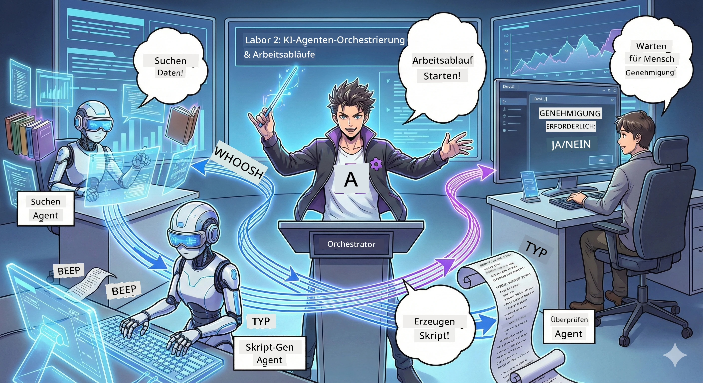

<!--
CO_OP_TRANSLATOR_METADATA:
{
  "original_hash": "93f84b804ced67c5cd017c3c4bb476ff",
  "translation_date": "2026-01-05T11:12:08+00:00",
  "source_file": "WorkshopForAgentic/md/02.AIAgentOrchestrationAndWorkflows.md",
  "language_code": "de"
}
-->
# Akt 2: Stelle dein Podcast-Produktionsteam zusammen 🎬



## Die Handlung verdichtet sich

Alex (dein KI-Assistent aus Akt 1) ist großartig, aber ein einzelner Agent kann kein ganzes Podcast-Studio betreiben. Du brauchst ein *Team*:
- 🔍 **Recherche-Agent**: Durchforstet das Internet nach frischen Infos
- ✍️ **Skript-Agent**: Verwandelt Recherche in spannende Dialoge
- 👤 **Du (Der Redakteur)**: Genehmigst Skripte oder schickst sie zur Überarbeitung zurück

Willkommen bei **KI-Agenten-Orchestrierung** — hier wirst du zum Regisseur deiner eigenen KI-Crew. Stell dir das vor wie die Avengers, aber für die Podcast-Produktion.

## Was ist Agenten-Orchestrierung? (Die einfache Version)

Stell dir vor, du leitest ein Restaurant. Du machst nicht alles selbst, oder? Du hast:
- 🍳 Einen Koch, der kocht
- 👨‍🍳 Einen Souschef, der vorbereitet
- 👩‍🍳 Einen Kellner, der serviert

Agentenorchestrierung ist dasselbe Prinzip, nur mit KI. Jeder Agent hat eine Spezialität, und du koordinierst sie, um größere Ziele zu erreichen. Kein Agent wird überfordert, und die Arbeit geht schneller voran.

### Die Band-Analogie 🎸

Deine KI-Agenten sind wie eine Band:
- **Lead-Sänger**: Der Hauptagent, der kundenorientierte Aufgaben übernimmt
- **Schlagzeuger**: Hält den Rhythmus, erledigt Hintergrundprozesse  
- **Bassspieler**: Unterstützt alle, holt Daten
- **Du (Bandmanager)**: Koordinierst alles!

Ohne Koordination? Nur Lärm. Mit Orchestrierung? Wunderschöne Musik.

### Warum das wichtig ist

Ein einzelner KI-Agent, der alles versucht = Burnout. Spezialisierte Agenten, die zusammenarbeiten = Effizienz freigeschaltet! 🚀

**Ehrlich gesagt**: Erinnerst du dich, wie du versucht hast, allein zu recherchieren, zu schreiben UND zu editieren? Ja, das ist anstrengend. Mit Orchestrierung kümmert sich jeder Agent um das, was er am besten kann. Du triffst nur die Endentscheidungen.

**Beispiel aus der Praxis**: Kundensupport-Bots, die wissen, wann sie Abrechnungsfragen, technische Probleme oder wann sie einen Menschen einschalten müssen, bearbeiten. Das ist Orchestrierung!

## Agent vs. Workflow: Was ist der Unterschied?

Denke daran:

### 🤖 KI-Agent = Jazz-Musiker
- **Trifft Entscheidungen spontan** basierend auf dem, was er hört
- **Improvisiert** Lösungen mit seinen Werkzeugen
- **Denkt** mit einem LLM-Gehirn
- **Passt sich an** alles an, was du ihm gibst

### 🎵 Workflow = Orchester spielt klassische Musik  
- **Folgt einer Partitur** (vordefinierte Schritte)
- **Vorhersehbarer** Ablauf
- **Koordiniert** mehrere Agenten, Menschen, Systeme
- **Strukturiert** wie ein Rezept

**Das Zauberhafte**: Workflows *orchestrieren* Agenten! Du baust einen Workflow, der den Agenten sagt, wann sie ihren Part spielen. Das Beste aus beiden Welten. 🎭

## Drei Wege, deine KI-Crew zu koordinieren

### 1. 🎯 Zentralisiert (Du bist der Boss)

Ein Hauptagent gibt den Ton an. Stell dir vor, du leitest ein Team — du entscheidest, wer was und wann macht.

**Vorteile**:
- ✅ Klare Führung (keine Verwirrung)
- ✅ Konsistente Entscheidungen
- ✅ Einfach zu debuggen

**Verwende es für**:
- Kundendienstweiterleitungen („Ist das eine Abrechnungs- oder eine technische Anfrage?“)
- Freigabeprozesse für Inhalte („Besteht dieses Skript?“)
- Podcast-Produktion (genau das, was wir bauen!)

### 2. 🤝 Dezentralisiert (Agenten organisieren sich selbst)

Agenten kommunizieren direkt miteinander und lösen Aufgaben gemeinsam. Wie eine Gruppenchat, in dem sich alle abstimmen.

**Vorteile**:
- ✅ Skaliert leicht (jederzeit weitere Agenten hinzufügen)
- ✅ Kein einzelner Ausfallpunkt
- ✅ Agenten arbeiten natürlich zusammen

**Verwende es für**:
- Recherche-Teams (jeder Agent recherchiert unterschiedliche Quellen)
- Brainstorming
- Verteilte Problemlösung

### 3. 🔀 Hybrid (Das Beste aus beiden Welten)

Du gibst die Richtung vor, aber Agenten haben Freiheit, Aufgaben selbst zu organisieren. Wie ein CEO, der seinem Team vertraut.

**Ideal für**: Komplexe Projekte, die sowohl Kontrolle als auch Flexibilität erfordern.

## Microsoft Agent Framework: Dein Orchestrierungs-Werkzeugkasten 🧰

Zeit zum Bauen! Das wirst du verwenden:

### Die Bausteine

#### 1. 🧱 Executor (Deine Arbeiter)
- **Was sie sind**: Einzelne Verarbeitungseinheiten — können Agenten oder eigene Logik sein
- **Was sie tun**: Nehmen Eingaben, erledigen Arbeit, liefern Ausgaben
- **Denk an sie wie**: Stationen in einer Produktionslinie

#### 2. ➡️ Edges (Die Verbindungen)
- **Was sie sind**: Pfade zwischen Executoren
- **Was sie tun**: Steuern den Nachrichtenfluss („Nach A geht’s zu B“)
- **Denk an sie wie**: Pfeile in einem Flussdiagramm

#### 3. 🗺️ Workflows (Der Masterplan)
- **Was sie sind**: Gesamtes Netzwerk von Executoren + Edges
- **Was sie tun**: Definieren den gesamten Prozess von Anfang bis Ende
- **Denk an sie wie**: Den Bauplan deiner Produktionspipeline

### Coole Features, die du lieben wirst

**🛡️ Typsicherheit**: Nachrichten zwischen Agenten werden typgeprüft. Keine „Ups, falscher Datentyp“-Überraschungen.

**🔀 Flexible Weiterleitung**: 
- Wenn-dann-Bedingungen („Wenn genehmigt, veröffentliche; sonst, überarbeite neu“)
- Parallele Verarbeitung (mehrere Agenten arbeiten gleichzeitig)
- Dynamische Pfade (Workflow passt sich Ergebnissen an)

**🔌 Externe Integration**:
- Verbindung zu APIs
- Mensch-in-der-Schleife-Checkpunkte (du genehmigst vor Veröffentlichung)
- Aufbau von Anfrage-/Antwortfluss

**💾 Checkpointing**: Fortschritt speichern! Wenn etwas abstürzt, an der letzten Stelle weitermachen.

**🤝 Multi-Agent-Koordination**:
- Agenten nacheinander ausführen (A → B → C)
- Parallel ausführen (A + B + C gleichzeitig)
- Übergabe zwischen Agenten
- Gemeinsame Verarbeitung

## Best Practices (Profi-Tipps) 🎯

### 1. Halte es modular
Jeder Agent sollte EINE Sache richtig gut machen. Baue keinen „Super-Agenten“, der alles macht — das bereust du beim Debuggen.

### 2. Plane Fehlerfälle ein
Agenten machen Fehler. Netze gehen down. Baue Fehlerbehandlung und Backup-Pläne ein. Dein zukünftiges Ich wird es dir danken.

### 3. Überwache alles
Verfolge, was deine Agenten tun. Nutze DevUI (das behandeln wir noch!), um Workflows live zu sehen.

### 4. Optimiere Nachrichtengröße
Schicke keine riesigen Dateien zwischen Agenten. Halte Nachrichten schlank und schnell.

### 5. Wähle das richtige Muster
Brauchst du Kontrolle? Zentralisiert wählen. Brauchst du Skalierung? Dezentralisiert. Unsicher? Hybrid!

## DevUI: Dein Workflow-Debugger 🔍

### Was ist DevUI?

DevUI ist wie ein Spielplatz, um deine Agenten und Workflows zu testen. Es ist eine Weboberfläche, mit der du:
- 👀 Deinen Workflow live beobachten kannst
- 💬 Direkt mit Agenten chatten kannst
- 🔍 Debuggen kannst, wenn was schiefgeht
- 📊 Spuren und Leistungsmetriken sehen kannst

> **Wichtig**: DevUI ist nur für Entwicklung! Nicht in der Produktion verwenden. Denk daran als deine lokale Testumgebung.

### Was macht es großartig

- **🖥️ Interaktive Web-UI**: Klicken, tippen, testen — keine Kommandozeile nötig
- **📁 Drag-and-Drop-Ready**: Dateien hochladen, mit verschiedenen Eingaben testen
- **📂 Auto-Discovery**: Zeig auf einen Ordner, es findet automatisch alle Agenten
- **📋 Kein Setup-Modus**: Registriere Agenten im Code, kein Ordnerstruktur nötig
- **🔌 OpenAI-kompatibel**: Funktioniert mit OpenAI SDK (Kompatibilität FTW!)
- **👁️ Tracing integriert**: Sieh genau, was deine Agenten tun

### Wie die Eingabe funktioniert

DevUI ist clever bei Eingaben:

- **Agenten testen?** Du bekommst Textfelder und Datei-Upload-Buttons
- **Workflows testen?** UI generiert Eingabefelder automatisch basierend auf Workflow-Erwartungen

Das ist wie Magie, aber eigentlich einfach nur guter Code. ✨

## Deine Missionen: Bau ein Podcast-Studio 🎬

### Mission 1: Erstelle einen einzelnen Agenten mit DevUI

📂 [01.AgentDevUI](../../../../WorkshopForAgentic/code/02.Workflow/01.AgentDevUI)

**Die Herausforderung**: Bevor du ein ganzes Team baust, teste DevUI mit einem Agenten: ein Web-Such-Spezialist.

**Was du baust**:
Ein Recherche-Agent, der im Internet nach Podcast-Themen suchen kann. Du testest ihn in DevUIs Weboberfläche unter `http://localhost:8090`.

**Fähigkeiten, die du lernst**:
- 🚀 Agenten in DevUI starten
- 🔍 Agenten-Antworten in Echtzeit testen
- 🛠️ Eigene Tools bauen (Web-Suche)
- 📊 Tracing aktivieren, um Fehler zu debuggen
- 🖥️ Interaktive Web-UI verwenden

**Der Code**:
- `agent.py`: Dein SearchAgent mit Web-Suche-Superkräften
- Verwendet OllamaChatClient zur Verbindung mit Qwen
- Implementiert die Werkzeugfunktion `web_search()`
- Startet mit `serve()` — öffnet DevUI automatisch

**Erfolgsbedingung**: Frag deinen Agenten: „Was ist im Bereich KI gerade angesagt?“ und schau zu, wie er durchs Web sucht! 🎉

### Mission 2: Baue einen Multi-Agenten-Workflow

📂 [02.WorkflowDevUI](../../../../WorkshopForAgentic/code/02.Workflow/02.WorkflowDevUI)

**Die Herausforderung**: Jetzt wird’s richtig spannend! Baue einen kompletten Podcast-Produktions-Workflow mit:
1. 🔍 **Such-Agent** → Recherchiert dein Thema
2. ✍️ **Skript-Agent** → Schreibt einen Dialog zwischen zwei Hosts (auf Chinesisch!)
3. 👤 **Review-Executor** → Fragt DICH nach Genehmigung oder Ablehnung
4. 🔄 **Schleife** → Bei Ablehnung neu schreiben basierend auf deinem Feedback

**Fähigkeiten, die du lernst**:
- 🧱 Spezialisierte Agenten für verschiedene Aufgaben erstellen
- 🔗 Agenten mit WorkflowBuilder verbinden
- 🔀 Genehmigungsschleifen (Mensch-in-der-Schleife!) implementieren
- 🚦 Bedingte Weiterleitung (genehmigt vs. abgelehnt)
- 🔧 Eigene Executor für Geschäftslogik bauen

**Der Workflow**:
```
SearchAgent → ScriptAgent → ReviewExecutor
                             ↑          ↓ (if rejected)
                             ←─────────
```

**Der Code**:
- `search_agent/agent.py`: Dein Forschungsspezialist
- `generate_script_agent/agent.py`: Dein Drehbuchautor (schreibt auf Chinesisch!)
- `workflow/workflow.py`: Hier geschieht die Orchestrierungsmagie
- `main.py`: Startet alles in DevUI

**Erfolgsbedingung**: Gib ein Thema vor, prüfe das Skript, lehne es einmal ab, um die Schleife zu testen, dann genehmige! 🎉

### Mission 3: Baue eine Konsolen-App

📂 [03.Application](../../../../WorkshopForAgentic/code/02.Workflow/03.Application)

**Die Herausforderung**: Nimm deinen Workflow aus DevUI und verwandle ihn in eine schicke Terminal-App mit farbiger Ausgabe, Ladeanimationen und Dateispeicherung. Das ist produktionstauglich!

**Fähigkeiten, die du lernst**:
- ⚡ Workflows programmatisch ausführen (ohne DevUI)
- 📡 Event-getriebene Architektur mit Streaming
- 🎨 Schöne Terminal-UI bauen (Farben, Spinner, Fortschrittsbalken)
- 💾 Finale Skripte in Dateien speichern
- 🔄 Asynchrone Workflows mit Pythons asyncio handhaben

**So funktioniert es**:
1. Fragt nach einem Podcast-Thema
2. Zeigt Fortschritt in Echtzeit („Such-Agent arbeitet...“)
3. Zeigt generiertes Skript farbig an
4. Fragt nach Genehmigung
5. Speichert genehmigtes Skript in `podcast.txt`

**Der Code**:
- `podcast_app.py`: Deine Haupt-App mit Event-Handling
- `workflow.py`: Nutzt den Workflow aus Mission 2 wieder
- Handhabt Events: `AgentRunUpdateEvent`, `RequestInfoEvent`, `WorkflowOutputEvent`
- Verwendet ANSI-Farben fürs Terminal-Styling

**Erfolgsbedingung**: Starte die App, erstelle ein Podcast-Skript und sieh es gespeichert! Du hast ein echtes Tool gebaut. 🚀

## Was du gemeistert hast 🏆

Nach Akt 2 kannst du:

- ✅ Mehrere KI-Agenten wie ein Profi orchestrieren
- ✅ Workflows mit sequentieller UND bedingter Logik bauen
- ✅ Menschliche Genehmigungs-Checkpoints hinzufügen
- ✅ DevUI zum Testen und Debuggen von Workflows nutzen
- ✅ Produktionstaugliche Konsolen-Anwendungen erstellen
- ✅ Fehler in komplexen Systemen elegant handhaben
- ✅ Für jedes Projekt das richtige Orchestrierungsmuster wählen

## Wenn Dinge schiefgehen 🔧

### „Mein Workflow ist zu kompliziert!“
**Die Lösung**: Zerlege ihn in kleinere Teil-Workflows. Jeder Workflow sollte EINE Sache gut machen. Verknüpfe sie bei Bedarf.

### „Ich kann nicht nachverfolgen, was passiert!“
**Die Lösung**: Nutze Workflow-Checkpointing, um den Zustand zu speichern. Aktiviere Tracing in DevUI, um jeden Schritt zu sehen.

### „Der Fehler eines Agenten bringt alles zum Absturz!“
**Die Lösung**: Füge Fehlergrenzen hinzu. Jeder Agent sollte seine eigenen Fehler abfangen und Fallback-Verhalten haben.

### „Das ist sooo langsam“
**Die Lösung**: Können Agenten parallel laufen? Sequentielle Workflows sind einfach, aber langsam. Suche nach Möglichkeiten zur Parallelisierung!

## Nützliche Ressourcen 🔗

- [Workflow-Dokumentation](https://learn.microsoft.com/en-us/agent-framework/user-guide/workflows/overview) — Offizielle Microsoft-Anleitungen
- [Orchestrierungsmuster](https://www.ibm.com/think/topics/ai-agent-orchestration) — IBMs Sicht dazu
- [Agent Framework GitHub](https://github.com/microsoft/agent-framework) — Quellcode ansehen
- [Code Examples](https://github.com/microsoft/agent-framework/tree/main/python/samples) — Muster hier klauen

---

**Bereit für das Finale?** Du hast dein Skript. Jetzt verwandeln wir es in echten Ton! → [Akt 3: Erwecke deinen Podcast zum Leben](03.Multi-SpeakerPodcastGenerationWithVibeVoice.md) 🎤

---

**Festgefahren? Verwirrt? Aufgeregt?** Teile es im Workshop-Chat! Wir lernen alle zusammen. 🚀

---

<!-- CO-OP TRANSLATOR DISCLAIMER START -->
**Haftungsausschluss**:  
Dieses Dokument wurde mithilfe des KI-Übersetzungsdienstes [Co-op Translator](https://github.com/Azure/co-op-translator) übersetzt. Obwohl wir auf Genauigkeit achten, können automatisierte Übersetzungen Fehler oder Ungenauigkeiten enthalten. Das ursprüngliche Dokument in seiner Originalsprache gilt als maßgebliche Quelle. Für kritische Informationen wird eine professionelle menschliche Übersetzung empfohlen. Wir übernehmen keine Haftung für Missverständnisse oder Fehlinterpretationen, die durch die Verwendung dieser Übersetzung entstehen.
<!-- CO-OP TRANSLATOR DISCLAIMER END -->