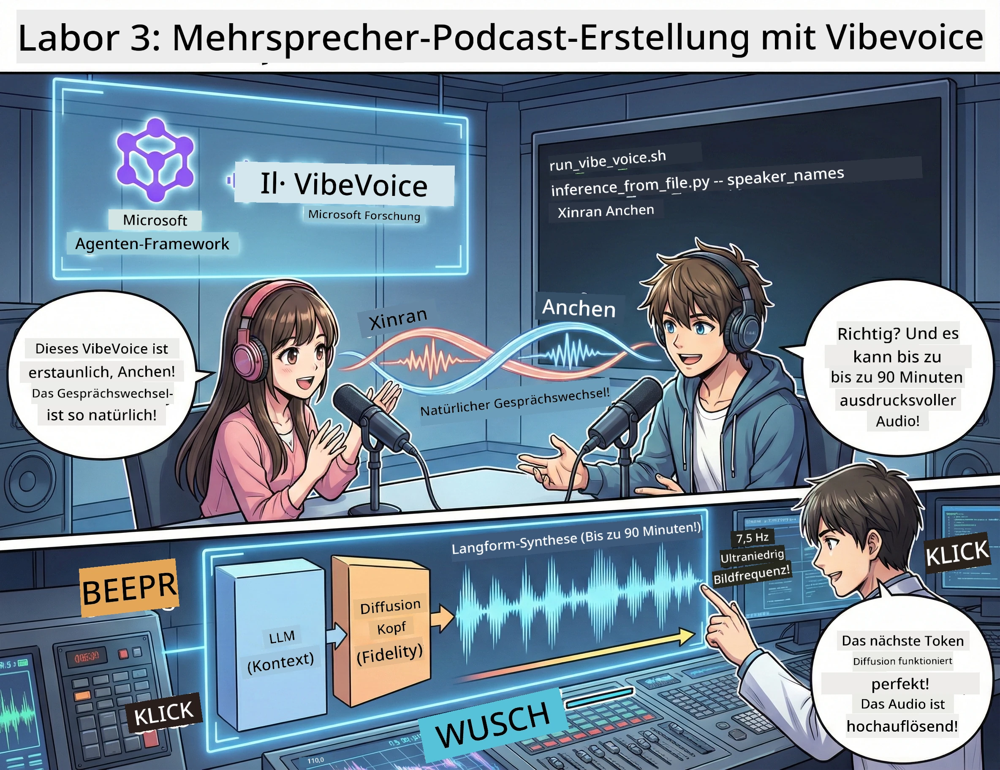

<!--
CO_OP_TRANSLATOR_METADATA:
{
  "original_hash": "bb2a3cf5ebd0ec8211af960a004fc23d",
  "translation_date": "2026-01-05T12:00:54+00:00",
  "source_file": "WorkshopForAgentic/md/03.Multi-SpeakerPodcastGenerationWithVibeVoice.md",
  "language_code": "de"
}
-->
# Akt 3: Erwecke deinen Podcast zum Leben 🎤



## Das große Finale

Du hast Themen recherchiert. Du hast Skripte geschrieben. Jetzt kommt das Sahnehäubchen: Deinen Text in echte Podcast-Audio mit realistischen Stimmen verwandeln!

Hier kommt **VibeVoice** ins Spiel — Microsoft Researchs Open-Source-TTS (Text-to-Speech)-Magie, die erstellt:
- 🎭 Natürlich klingende Gespräche
- 👥 Mehrere Sprecher (bis zu 4!)
- ⏱️ Langform-Audio (bis zu 90 Minuten!)
- 🎵 Ausdrucksstarke Darbietung (keine Roboterstimmen!)

Das ist die Technik hinter synthetischen Podcasts. Lass uns deinen erstellen!

## Was ist VibeVoice? (Das coole Zeug)

VibeVoice ist Microsoft Researchs Geschenk an die Welt. Es ist speziell für podcast-artiges Gesprächsaudio entwickelt.

### Warum es genial ist 🔥

* **⏱️ Marathon-Sessions**: Generiert bis zu 90 Minuten durchgehende Sprache (das ist eine komplette Podcast-Folge!)
* **👥 Multi-Sprecher-Magie**: Bis zu 4 verschiedene Stimmen mit konsistenten Persönlichkeiten
* **⚡ Unglaublich effizient**: Verwendet ultra-niedrige 7,5 Hz Frame-Rate, um Rechenleistung zu sparen
* **🧠 Intelligentes Audio**: Kombiniert ein LLM (versteht Kontext) mit einem Diffusionsmodell (erstellt realistische Audios)
* **🎭 Natürlicher Fluss**: Handhabt Sprecherwechsel, Pausen und Gesprächsrhythmus automatisch

**Übersetzung**: VibeVoice liest dein Skript nicht nur vor — es *spielt* es wie echte Menschen, die sprechen.

---

## Bevor du startest 🚀

**Was du brauchst**:

* 🐍 **Python 3.10+** (das hast du bereits aus Akt 1 & 2)
* 🚀 **uv** (ein schnelles Python-Paketverwaltungs-Tool — wir installieren es)
* 📝 **Dein Skript**: Die Datei `podcast.txt` aus Akt 2 (in `../03.Application/`)

**Profi-Tipp**: Dieser Schritt erfordert eine gute Internetverbindung, um das vortrainierte Modell herunterzuladen. Schnapp dir einen Kaffee! ☕

---

## Los geht's! Der einfache Weg 🎬

Wir haben das super einfach gemacht. Ein Shell-Skript erledigt alles.

### Der Ablauf

1. **Mach es ausführbar**:
```bash
chmod +x run_vibe_voice.sh
```

2. **Führe es aus**:
```bash
./run_vibe_voice.sh
```

3. **Warte auf die Magie** (das kann beim ersten Mal ein paar Minuten dauern)

### Was im Hintergrund passiert 🎭

Das Skript ist im Grunde dein automatischer Tontechniker:

1. **📥 Lädt VibeVoice herunter**: Klont das offizielle Repo von GitHub
2. **📦 Installiert Abhängigkeiten**: Nutzt `uv pip` für ultraschnelle Paketinstallation
3. **🎬 Erzeugt Audio**: Führt das Inferenz-Skript aus mit:
   * `--model_path`: Dem vortrainierten VibeVoice-7B Modell
   * `--txt_path`: Deinem `podcast.txt` Skript
   * `--speaker_names`: Weist Stimmen zu (standardmäßig Xinran & Anchen)

**Ergebnis**: Dein Skript wird zu einer echten Podcast-Folge! 🎉

---

## Deine Mission 🎯

Machen wir es interessant:

### Aufgabe 1: Inhalt erstellen
Bearbeite `../03.Application/podcast.txt` mit einem Gespräch zwischen zwei Personen. Mach es über Technik, Hobbys, was auch immer! Hauptsache, es klingt wie ein echtes Gespräch.

**Formatbeispiel**:
```
Speaker 1: Hey! Did you hear about the new AI model?
Speaker 2: No way! Tell me more!
Speaker 1: It's called...
```

### Aufgabe 2: Audio generieren
Führe das Skript aus und sieh der Magie zu. Das erste Mal dauert es länger (Modell wird heruntergeladen).

### Aufgabe 3: Anhören & Analysieren
- Klingt es natürlich?
- Haben die Sprecher unterschiedliche Stimmen?
- Läuft der Sprecherwechsel flüssig?
- Gibt es robotische Momente?

### Aufgabe 4: Experimentieren (für Mutige)
Bearbeite `run_vibe_voice.sh` und ändere `--speaker_names`, um verschiedene Stimmbesetzungen zu testen. VibeVoice hat mehrere vortrainierte Stimmen!

**Bonus-Herausforderung**: Versuche ein 3-Sprecher-Gespräch! 🎆

---

## Mehr erfahren 📚

* **🏠 Projekt-Homepage**: [VibeVoice Offizielle Seite](https://microsoft.github.io/VibeVoice/)
* **🤗 Vortrainiertes Modell**: [Hugging Face - VibeVoice-7B](https://huggingface.co/vibevoice/VibeVoice-7B)
* **📖 Forschungspapier**: Tauche tief in die Technik ein (wenn du das magst)

> **⚠️ Erinnerung zu verantwortungsvollem KI-Einsatz**: VibeVoice ist mächtig. Nutze es ethisch! Erstelle keine Deepfakes oder irreführenden Inhalte. Erschaffe coole Sachen, die Menschen helfen. 🙏

---

## 🏆 Glückwunsch! Du hast es geschafft!

Du hast die komplette Pipeline durchlaufen:
1. ✅ **Akt 1**: KI-Agenten mit benutzerdefinierten Tools gebaut
2. ✅ **Akt 2**: Einen Multi-Agent-Workflow orchestriert
3. ✅ **Akt 3**: Echt klingendes Podcast-Audio erzeugt

**Du hast jetzt**:
- Einen funktionierenden KI-Forschungsassistenten
- Einen vollständigen Podcast-Produktionsworkflow
- Eine echte Audiodatei, die du teilen kannst

### Was kommt als Nächstes? 🚀

**Starte deinen Podcast!**
- Lade ihn auf Podcast-Plattformen hoch
- Teile ihn in sozialen Medien
- Iteriere und verbessere ihn

**Baue weiter!**
- Probiere andere Themen aus
- Experimentiere mit mehr Sprechern
- Füge Hintergrundmusik hinzu
- Erstelle eine Weboberfläche
- Automatisiere den ganzen Ablauf

**Teile deine Arbeit!**
Markiere uns! Zeig der Welt, was du gebaut hast. Die KI-Podcast-Revolution beginnt mit dir. 🎙️

---

**Fragen? Ideen? Erfolgsgeschichten?** Schreib sie in den Workshop-Chat!

**Willkommen in der Zukunft der Inhaltserstellung.** 🌟

---

<!-- CO-OP TRANSLATOR DISCLAIMER START -->
**Haftungsausschluss**:  
Dieses Dokument wurde mit dem KI-Übersetzungsdienst [Co-op Translator](https://github.com/Azure/co-op-translator) übersetzt. Obwohl wir uns um Genauigkeit bemühen, können automatisierte Übersetzungen Fehler oder Ungenauigkeiten enthalten. Das Originaldokument in der jeweiligen Ausgangssprache ist als maßgebliche Quelle anzusehen. Für wichtige Informationen wird eine professionelle menschliche Übersetzung empfohlen. Wir übernehmen keine Haftung für Missverständnisse oder Fehlinterpretationen, die aus der Nutzung dieser Übersetzung entstehen.
<!-- CO-OP TRANSLATOR DISCLAIMER END -->