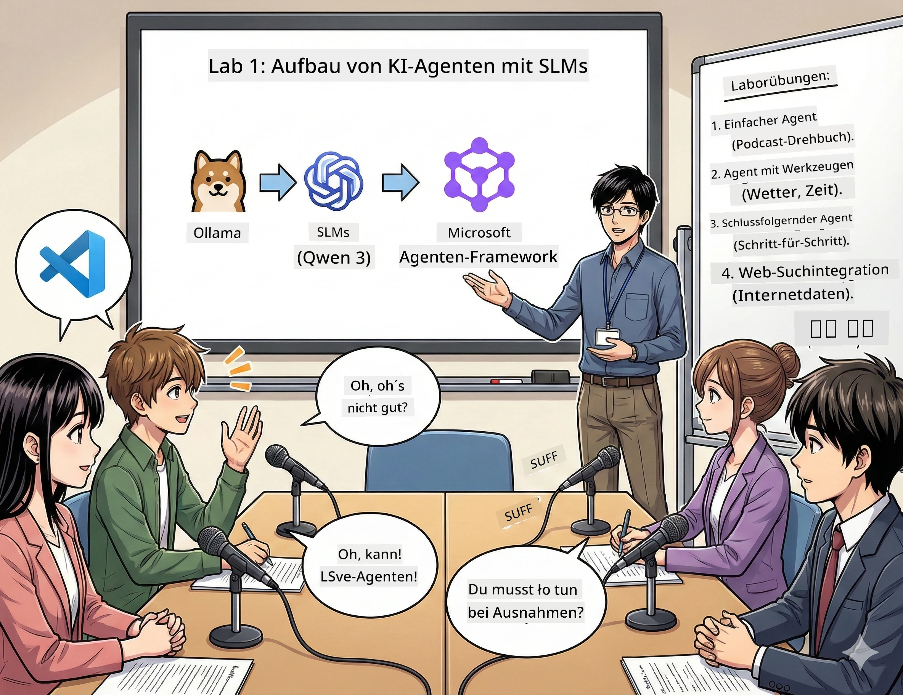

<!--
CO_OP_TRANSLATOR_METADATA:
{
  "original_hash": "21779ce57b388adecb26881a35d9cbcf",
  "translation_date": "2026-01-05T16:27:46+00:00",
  "source_file": "WorkshopForAgentic/translation/zh-cn/01.BuildAIAgentWithSLM.md",
  "language_code": "de"
}
-->
# Akt 1: Lerne deinen KI-Forschungsassistenten kennen 🤖

## Herausforderung

Du startest „Future Bytes“, deinen neuen Tech-Podcast. Die erste Folge handelt von den neuesten KI-Durchbrüchen, aber du hast nur 24 Stunden, um:
1. das Thema zu recherchieren
2. vertrauenswürdige Quellen zu finden
3. ein fesselndes Skript zu schreiben
4. es natürlich klingen zu lassen

**Plot Twist**: Du musst das nicht allein machen. Du bist dabei, deinen ersten KI-Assistenten zu bauen, der dir bei all dem hilft. Nennen wir ihn Alex – dein unermüdlicher Forschungspartner, der nie Schlaf braucht.

## Warum kleine Sprachmodelle? (Spoiler: Sie sind großartig)

Stell dir kleine Sprachmodelle (SLM) als persönliche KI vor, die auf *deinem* Computer läuft. Kein Cloud, keine Monatsgebühren, kein fragwürdiger Datenaustausch.

**Warum SLM so 🔥 sind:**
- **🏠 Läuft auf deinem Gerät**: Laptop, Desktop, sogar leistungsstarke Raspberry Pi
- **💸 Null laufende Kosten**: Keine API-Gebühren, die dein Taschengeld auffressen
- **🔒 Datenschutz-Garantie**: Deine Daten verlassen niemals dein Gerät
- **⚡ Blitzschnell**: Keine Netzwerklatenz, sofortige Antworten
- **🪦 Leichtgewichtig**: 1 bis 10 Milliarden Parameter gegenüber 100 Milliarden+ bei großen Modellen

**Beliebte SLMs**: Qwen 3, Phi-4, Gemma 3 (In diesem Workshop verwenden wir Qwen)

## Dein Toolkit

### Ollama: Dein KI-Modell-Manager

[Ollama](https://ollama.com/) ist wie der Steam für KI-Modelle. Mit einfachen Befehlen kannst du Modelle herunterladen, ausführen und verwalten.

**Warum es so cool ist:**
- Ein Befehl, um jedes Modell herunterzuladen und auszuführen
- Unterstützt Mac, Windows, Linux
- Nutzt automatisch GPU, wenn vorhanden
- Spart enorm viel Speicher

### Microsoft Agent Framework: Der Ort, an dem Magie passiert

[Microsoft Agent Framework](https://github.com/microsoft/agent-framework) ist dein Spielplatz zum Bau von KI-Agenten, die:

- 💬 chatten und sich an frühere Gespräche erinnern
- 🛠️ benutzerdefinierte Werkzeuge verwenden (z.B. Websuche oder Wetter checken)
- 🧠 komplexe Probleme Schritt für Schritt durchdenken
- 🤝 als Team mit anderen Agenten zusammenarbeiten
- 🔌 An verschiedene KI-Anbieter anschließen (OpenAI, Ollama, Azure)

**Bausteine:**
- **Agenten**: KI-Assistenten mit spezifischen Aufgaben
- **Werkzeuge**: Spezielle Fähigkeiten, die du ihnen gibst
- **Gedächtnis**: Damit sie deine Gespräche nicht vergessen
- **Logik**: Sie lernen denken, nicht nur antworten

## Dein Trainings-Montage: 4 Aufgaben

### Aufgabe 1: Erstelle deinen ersten Agenten

📓 [Notebook öffnen](../../code/01.BasicAgent/00.BasicAgent-agent.ipynb)

**Aufgabe**: Baue Alex, deine KI für Podcast-Skripte. Alex soll Dialoge zwischen zwei Moderatoren zu Tech-Themen generieren.

**Du lernst:**
- Wie man seinen KI-Agenten „weckt“ (leichter als montags aufzustehen)
- Gib ihm Persönlichkeit und Anweisungen
- Lasse ihn echte Podcast-Skripte erzeugen
- Verstehe, was er dir zurückgibt

**Erfolgskriterium**: Alex erstellt das Skript für eine Pilotfolge „Future Bytes“ über KI! 🎯

### Aufgabe 2: Gib Alex Superkräfte (Werkzeuge!)

📓 [Notebook öffnen](../../code/01.BasicAgent/01.BasicAgent-tools.ipynb)

**Aufgabe**: Alex ist schlau, kennt aber nicht das aktuelle Wetter oder die Uhrzeit. Lass uns das mit Werkzeugen beheben!

**Du lernst:**
- Benutzerdefinierte Python-Funktionen als „Werkzeuge“ erstellen
- Alex selbst entscheiden lassen, *wann* er welches Werkzeug nutzt
- Beobachte, wie er eigenständig Probleme löst
- Mehrere Werkzeuge kombinieren für komplexe Aufgaben

**Erfolgskriterium**: Frag „Wie ist das Wetter in Tokio?“ – Alex ermittelt die Antwort selbst! ☁️

### Aufgabe 3: Bring Alex bei zu denken

📓 [Notebook öffnen](../../code/01.BasicAgent/02.BasicAgent-reasoning.ipynb)

**Aufgabe**: Lass Alex seinen Arbeitsprozess zeigen. Du möchtest beim Lösen von Problemen sehen, *wie* er denkt, nicht nur die Antwort.

**Du lernst:**
- Aktiviere den „Denkmodus“ (wie bei der Rechnung in Mathe)
- Sieh Alex Schritt-für-Schritt-Denken
- Verstehe Chain-of-Thought-Prompts
- Debugge, wenn Alex verwirrt ist

**Erfolgskriterium**: Stelle eine knifflige Mathefrage und beobachte, wie Alex sie denkt! 🧠

### Aufgabe 4: Verbinde Alex mit dem Internet

📓 [Notebook öffnen](../../code/01.BasicAgent/03.BasicAgent-websearch.ipynb)

**Aufgabe**: Alex‘ Wissen hat ein Ablaufdatum. Verbinde ihn mit dem Web für Echtzeit-Informationen!

**Du lernst:**
- Benutzerdefinierte Web-Suchwerkzeuge bauen
- Externe APIs integrieren
- Netzwerkausfälle elegant behandeln
- Infos bekommen, die über Alex‘ Trainingsdaten hinausgehen

**Erfolgskriterium**: Frage nach den heutigen Tech-News und erhalte die neuesten Ergebnisse! 📰

## Vor dem Start 🚀

**Erforderliche Ausrüstung**:
- Python 3.10+ installiert
- Ollama läuft (prüfe mit `ollama --version`)
- VS Code mit Python-Erweiterung
- Mindestens 8GB RAM (für flüssige Nutzung 16GB empfohlen)

## Reihenfolge der Aufgaben

Bearbeite die Notebooks der Reihe nach für die beste Erfahrung:

1. [00.BasicAgent-agent.ipynb](../../code/01.BasicAgent/00.BasicAgent-agent.ipynb) — Lerne Alex kennen (deinen ersten Agenten)
2. [01.BasicAgent-tools.ipynb](../../code/01.BasicAgent/01.BasicAgent-tools.ipynb) — Zeit fürs Upgrade!
3. [02.BasicAgent-reasoning.ipynb](../../code/01.BasicAgent/02.BasicAgent-reasoning.ipynb) — Bring Alex Denken bei
4. [03.BasicAgent-websearch.ipynb](../../code/01.BasicAgent/03.BasicAgent-websearch.ipynb) — Internetzugang freischalten!

## Was du meistern wirst

Nach Akt 1 kannst du:

- ✅ KI-Modelle auf eigener Hardware ausführen (kein Cloud nötig!)
- ✅ Agenten mit benutzerdefinierter Persönlichkeit und Fähigkeiten bauen
- ✅ Agenten Werkzeuge geben, um reale Probleme zu lösen
- ✅ Agenten ihre Denkprozesse zeigen lassen
- ✅ Agenten mit externen Datenquellen verbinden
- ✅ Fehler beheben, wenn etwas schiefläuft

## Wenn etwas schiefgeht (und wie du es reparierst) 🔧

### „Alex lädt nicht! Nicht genug Speicher!“
**Lösung**: Dein Computer kämpft. Schließe andere Apps oder wechsle auf ein kleineres Modell. 8GB RAM sind Minimum.

### „Alex ist zu langsam“
**Lösung**: Aktiviere GPU-Beschleunigung in Ollama. Oder verringere die Kontextfenstergröße. Geschwindigkeitsmodus aktiviert! 🏎️

### „Werkzeuge funktionieren nicht!“
**Lösung**: Überprüfe deine Funktionssignatur genau. Alex braucht korrekte Typangaben, um die Werkzeuge zu verstehen. Denk daran, klare Anweisungen zu geben.

## Nützliche Links 🔗

- [Agent Framework Dokumentation](https://github.com/microsoft/agent-framework) — Offizielle Anleitung und Beispiele
- [Ollama Modellbibliothek](https://ollama.com/library) — Alle verfügbaren Modelle durchsuchen
- [Qwen Modell](https://ollama.com/library/qwen3) — Lerne das Gehirn deines KI-Assistenten kennen
- [Codebeispiele](https://github.com/microsoft/agent-framework/tree/main/python/samples) — Lass dich inspirieren

## Nächster Schritt: Akt 2 🎬

Du hast einen Agenten. Aber was, wenn du ein *Team* von Agenten zusammenarbeiten lässt? Im zweiten Akt baust du ein komplettes Podcast-Produktionsteam:
- **Research-Agenten**: Finden die besten Quellen
- **Schreib-Agenten**: Erstellen das perfekte Skript
- **Editor (du!)**: Genehmigen oder Änderungen anfordern

Lass uns etwas KI-Magie orchestrieren! → [Akt 2: Baue dein Produktionsteam](02.AIAgentOrchestrationAndWorkflows.md)

---

**Festgefahren?** Frag während des Workshops. Wir lernen zusammen! 🙌

---

<!-- CO-OP TRANSLATOR DISCLAIMER START -->
**Haftungsausschluss**:  
Dieses Dokument wurde mit dem KI-Übersetzungsdienst [Co-op Translator](https://github.com/Azure/co-op-translator) übersetzt. Obwohl wir auf Genauigkeit achten, kann es sein, dass automatisierte Übersetzungen Fehler oder Ungenauigkeiten enthalten. Das Originaldokument in seiner Originalsprache ist als verbindliche Quelle zu betrachten. Für wichtige Informationen wird eine professionelle menschliche Übersetzung empfohlen. Wir übernehmen keine Haftung für Missverständnisse oder Fehlinterpretationen, die aus der Verwendung dieser Übersetzung entstehen.
<!-- CO-OP TRANSLATOR DISCLAIMER END -->