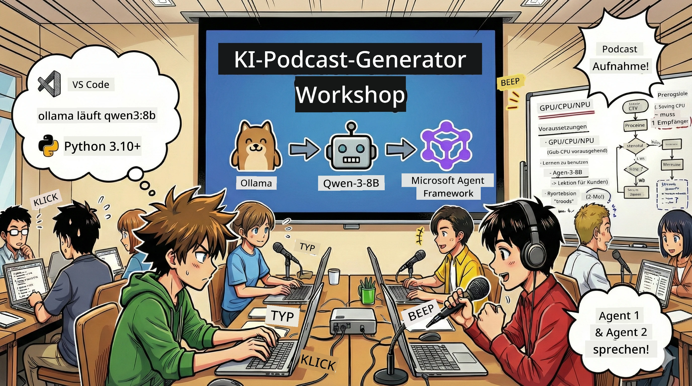

<!--
CO_OP_TRANSLATOR_METADATA:
{
  "original_hash": "aa775a734bda4590ecbe3a94a3b62197",
  "translation_date": "2026-01-05T17:22:37+00:00",
  "source_file": "WorkshopForAgentic/translation/zh-cn/README.md",
  "language_code": "de"
}
-->
# 🎙️ KI-Podcast-Studio Workshop



## Deine Aufgabe

Willkommen im **KI-Podcast-Studio**! Du wirst deinen eigenen Tech-Podcast „Future Bytes“ starten – aber hier kommt die Wendung: Du baust ein KI-gesteuertes Produktionsteam auf, das dir bei der Erstellung hilft. Kein endloses Recherchieren, Skripte schreiben und Audio bearbeiten mehr. Stattdessen wirst du zum Podcaster mit KI-Superkräften durch Programmierung.

## Hintergrundgeschichte

Stell dir vor: Du und deine Freunde wollt einen Podcast über die coolsten Technologietrends starten, aber jeder ist mit Studium, Arbeit oder Alltag beschäftigt. Was, wenn du ein Team von KI-Agenten aufbauen könntest, die die schwere Arbeit erledigen? Ein Agent recherchiert das Thema, ein anderer schreibt spannende Skripte, ein dritter wandelt Text in einen natürlich klingenden Dialog um. Klingt wie Science-Fiction? Lass uns das zur Realität machen.

## Was du lernen wirst

Am Ende dieses Workshops wirst du wissen, wie du:
- 🤖 Dein eigenes lokales KI-Modell bereitstellst (keine API-Kosten, keine Cloud-Abhängigkeit!)
- 🔧 Professionelle, kollaborierende KI-Agenten baust
- 🎬 Einen kompletten Podcast-Produktionsablauf von der Idee bis zum Audio erstellst

## Deine Reise: Drei Akte

Wie jede gute Geschichte haben wir drei Akte. Jeder Akt baut schrittweise dein KI-Podcast-Studio auf:

| Kapitel | Deine Aufgabe | Was passiert | Fähigkeiten, die du freischaltest |
|---------|---------------|--------------|-------------------------------|
| **Akt 1** | [Lerne deine KI-Assistenten kennen](01.BuildAIAgentWithSLM.md) | Du entdeckst, wie du KI-Agenten baust, die chatten, im Web suchen und Probleme lösen können. Stell sie dir als nie schlafende Recherche-Praktikanten vor. | 🎯 Deinen ersten Agenten bauen<br>🛠️ Superkräfte verleihen (Tools!)<br>🧠 Lehren zu denken<br>🌐 Mit dem Internet verbinden |
| **Akt 2** | [Baue dein Produktionsteam auf](02.AIAgentOrchestrationAndWorkflows.md) | Jetzt wird es spannend! Du orchestrierst mehrere KI-Agenten, die wie ein echtes Podcast-Team zusammenarbeiten. Einer recherchiert, einer schreibt, du gibst das Okay – Teamwork macht’s möglich. | 🎭 Mehrere Agenten koordinieren<br>🔄 Genehmigungs-Workflows bauen<br>🖥️ DevUI-Oberfläche zum Testen nutzen<br>✋ Menschliche Kontrolle bewahren |
| **Akt 3** | [Bring deinen Podcast zum Leben](03.Multi-SpeakerPodcastGenerationWithVibeVoice.md) | Das Finale! Wandle dein Textskript in echten Podcast-Content mit realistischen Stimmen und natürlichem Dialog um. Dein „Future Bytes“-Podcast ist bereit zur Veröffentlichung! | 🎤 Text-zu-Sprache-Magie<br>👥 Multi-Sprecher-Stimmen<br>⏱️ Langformat-Audio<br>🚀 Vollautomatisiert |

Jeder Akt schaltet neue Fähigkeiten frei. Wenn du mutig bist, kannst du überspringen, aber wir empfehlen die Reihenfolge!

## Systemanforderungen

Dieser Workshop unterstützt verschiedene Hardwareumgebungen:
- **CPU**: Für Tests und kleine Einsätze geeignet
- **GPU**: Empfohlen für Produktion, deutlich schnellere Inferenz
- **NPU**: Unterstützung für next-gen neuronale Prozessorbeschleunigung

## Was du brauchst

### Softwareliste ✅
- **Python 3.10+** (deine Programmiersprache)
- **Ollama** (KI-Modell-Runner auf deinem Gerät)
- **VS Code** (dein Code-Editor)
- **Python-Erweiterung** (macht VS Code smarter)
- **Git** (zum Code holen)

### Hardware-Check 💻
- **Läuft es bei mir?**: 8 GB RAM, 10 GB freier Speicher (geht, könnte aber langsam sein)
- **Ideale Ausstattung**: 16 GB+ RAM, eine gute GPU (läuft flüssig!)
- **NPU vorhanden?**: Umso besser! Next-Gen Performance 🚀

## Baue dein Studio auf 🎬

### Schritt 1: Python aktualisieren

Stelle sicher, dass du Python 3.10 oder neuer hast:

```bash
python --version
# Python 3.10.x oder höher sollte angezeigt werden
```

Kein Python? Hol’s dir von [python.org](https://python.org) – es ist kostenlos!

### Schritt 2: Ollama herunterladen (dein KI-Modell-Runner)

Gehe zu [ollama.ai](https://ollama.ai) und lade Ollama passend zu deinem Betriebssystem herunter. Stell es dir als die Engine vor, die KI-Modelle lokal ausführt.

Prüfe, ob alles bereit ist:

```bash
ollama --version
```

### Schritt 3: Lade dein KI-Hirn herunter 🧠

Zeit, das Qwen-3-8B Modell zu holen (wie deinen ersten KI-Assistenten anstellen):

```bash
ollama pull qwen3:8b
```

*Das kann ein paar Minuten dauern. Perfekte Zeit für einen Kaffee! ☕*

### Schritt 4: VS Code einrichten

Falls noch nicht installiert, besorge dir [Visual Studio Code](https://code.visualstudio.com/). Der beste Code-Editor (Überzeug dich selbst 😄).

### Schritt 5: Python-Erweiterung

In VS Code:
1. Drücke `Ctrl+Shift+X` (auf Mac `Cmd+Shift+X`)
2. Suche nach "Python"
3. Installiere die offizielle Python-Erweiterung von Microsoft

### Schritt 6: Fertig! 🎉

Ehrlich, du bist startklar. Lass uns KI-Magie bauen!

### Schritt 7: Microsoft Agent Framework und weitere Pakete installieren 📦

Installiere alle benötigten Abhängigkeiten für den Workshop:

```bash
pip install -r ./Installations/requirements.txt -U
```

*Das installiert das Microsoft Agent Framework und alle notwendigen Pakete. Genieße einen Kaffee – die erste Installation kann ein paar Minuten dauern! ☕*

## Workshop-Hinweise

Detaillierte Projektstruktur, Setup-Schritte und Ausführung werden im Workshop schrittweise erklärt.

## Fehlerbehebung (wenn etwas schiefgeht) 🔧

### „Oh nein, der Modell-Download ist zu langsam!“
**Lösung**: VPN nutzen oder Ollama Mirror konfigurieren. Manchmal hakt das Netz einfach.

### „Mein Rechner hängt! Nicht genug Speicher!“
**Lösung**: Kleinere Modelle nutzen oder `num_ctx` so anpassen, dass weniger RAM verwendet wird. Stell dir vor, deine KI macht Diät.

### „Kann ich GPU nutzen, um es schneller zu machen?“
**Lösung**: Ollama erkennt GPUs automatisch! Achte nur darauf, dass deine GPU-Treiber aktuell sind. Kostenloser Geschwindigkeitsschub! 🏎️

## Extra Ressourcen (für die Neugierigen) 📚

- [Ollama Dokumentation](https://github.com/ollama/ollama) – tiefere Einblicke in lokale KI-Modelle
- [Microsoft Agent Framework](https://microsoft.github.io/autogen/) – mehr zum Aufbau von Agententeams
- [Qwen Modell Info](https://qwenlm.github.io/) – lerne das Hirn deiner KI-Assistenten kennen

## Lizenz

MIT-Lizenz – baue coole Sachen, teile sie und mach die Welt besser! 🌍

## Willst du mitmachen?

Bug gefunden? Idee? Öffne ein Issue oder Pull Request! Wir lieben die Community. ✨

---

<!-- CO-OP TRANSLATOR DISCLAIMER START -->
**Haftungsausschluss**:  
Dieses Dokument wurde mit dem KI-Übersetzungsdienst [Co-op Translator](https://github.com/Azure/co-op-translator) übersetzt. Obwohl wir auf Genauigkeit achten, können automatisierte Übersetzungen Fehler oder Ungenauigkeiten enthalten. Das Originaldokument in seiner Ursprungssprache gilt als maßgebliche Quelle. Für kritische Informationen wird eine professionelle menschliche Übersetzung empfohlen. Wir übernehmen keine Haftung für Missverständnisse oder Fehlinterpretationen, die sich aus der Nutzung dieser Übersetzung ergeben.
<!-- CO-OP TRANSLATOR DISCLAIMER END -->