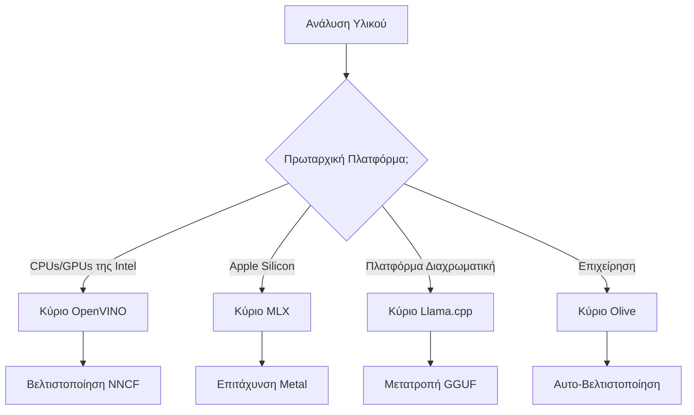
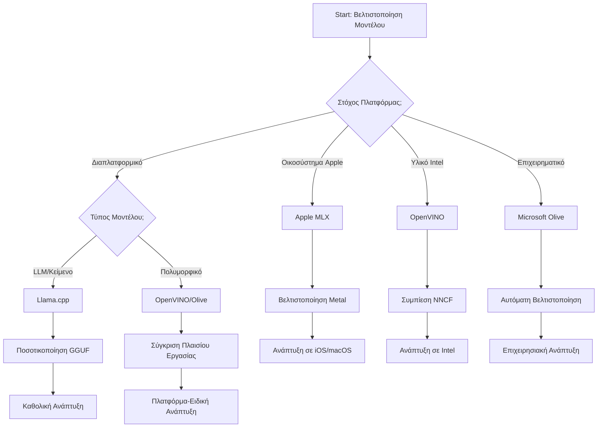
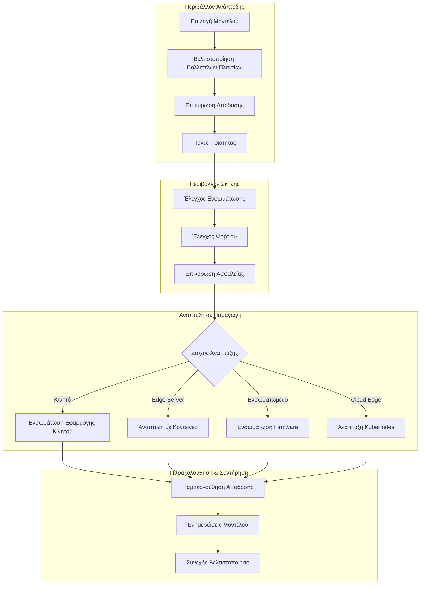

# Ενότητα 6: Σύνθεση Ροής Εργασίας Ανάπτυξης Edge AI

## Πίνακας Περιεχομένων
1. [Εισαγωγή](#εισαγωγή)
2. [Μαθησιακοί Στόχοι](#μαθησιακοί-στόχοι)
3. [Επισκόπηση Ενοποιημένης Ροής Εργασίας](#επισκόπηση-ενοποιημένης-ροής-εργασίας)
4. [Πίνακας Επιλογής Πλαισίων](#πίνακας-επιλογής-πλαισίων)
5. [Σύνθεση Βέλτιστων Πρακτικών](#σύνθεση-βέλτιστων-πρακτικών)
6. [Οδηγός Στρατηγικής Ανάπτυξης](#οδηγός-στρατηγικής-ανάπτυξης)
7. [Ροή Εργασίας Βελτιστοποίησης Απόδοσης](#ροή-εργασίας-βελτιστοποίησης-απόδοσης)
8. [Κατάλογος Ελέγχου Ετοιμότητας Παραγωγής](#κατάλογος-ελέγχου-ετοιμότητας-παραγωγής)
9. [Αντιμετώπιση Προβλημάτων και Παρακολούθηση](#αντιμετώπιση-προβλημάτων-και-παρακολούθηση)
10. [Προστασία της Ανάπτυξης Edge AI για το Μέλλον](#προστασία-της-ανάπτυξης-edge-ai-για-το-μέλλον)

## Εισαγωγή

Η ανάπτυξη Edge AI απαιτεί εξειδικευμένη κατανόηση πολλαπλών πλαισίων βελτιστοποίησης, στρατηγικών ανάπτυξης και παραμέτρων υλικού. Αυτή η ολοκληρωμένη σύνθεση συγκεντρώνει τη γνώση από τα Llama.cpp, Microsoft Olive, OpenVINO και Apple MLX για να δημιουργήσει μια ενοποιημένη ροή εργασίας που μεγιστοποιεί την αποδοτικότητα, διατηρεί την ποιότητα και εξασφαλίζει επιτυχή παραγωγική ανάπτυξη.

Καθ’ όλη τη διάρκεια αυτού του μαθήματος, εξερευνήσαμε μεμονωμένα πλαίσια βελτιστοποίησης, το καθένα με μοναδικά πλεονεκτήματα και εξειδικευμένα πεδία χρήσης. Ωστόσο, τα πραγματικά έργα Edge AI συχνά απαιτούν συνδυασμό τεχνικών από πολλαπλά πλαίσια ή τη λήψη στρατηγικών αποφάσεων σχετικά με το ποια προσέγγιση θα αποδώσει τα καλύτερα αποτελέσματα για συγκεκριμένους περιορισμούς και απαιτήσεις.

Αυτή η ενότητα συνθέτει τη συλλογική σοφία από όλα τα πλαίσια σε εφαρμόσιμες ροές εργασίας, δέντρα αποφάσεων και βέλτιστες πρακτικές που σας επιτρέπουν να δημιουργείτε αποδοτικές και αποτελεσματικές λύσεις Edge AI έτοιμες για παραγωγή. Είτε βελτιστοποιείτε για κινητές συσκευές, ενσωματωμένα συστήματα ή edge servers, αυτός ο οδηγός παρέχει το στρατηγικό πλαίσιο για τη λήψη ενημερωμένων αποφάσεων καθ’ όλη τη διάρκεια του κύκλου ανάπτυξής σας.

## Μαθησιακοί Στόχοι

Μέχρι το τέλος αυτής της ενότητας, θα είστε σε θέση να:

### Στρατηγική Λήψη Αποφάσεων
- **Αξιολογείτε και επιλέγετε** το βέλτιστο πλαίσιο βελτιστοποίησης με βάση τις απαιτήσεις του έργου, τους περιορισμούς υλικού και τα σενάρια ανάπτυξης
- **Σχεδιάζετε ολοκληρωμένες ροές εργασίας** που ενσωματώνουν πολλαπλές τεχνικές βελτιστοποίησης για μέγιστη αποδοτικότητα
- **Αξιολογείτε τα ανταλλάγματα** μεταξύ ακρίβειας μοντέλου, ταχύτητας απόδοσης, χρήσης μνήμης και πολυπλοκότητας ανάπτυξης μεταξύ των διαφόρων πλαισίων

### Ενσωμάτωση Ροής Εργασίας
- **Εφαρμόζετε ενοποιημένες γραμμές ανάπτυξης** που αξιοποιούν τα πλεονεκτήματα πολλαπλών πλαισίων βελτιστοποίησης
- **Δημιουργείτε αναπαραγώγιμες ροές εργασίας** για συνεπή βελτιστοποίηση και ανάπτυξη μοντέλων σε διαφορετικά περιβάλλοντα
- **Καθιερώνετε πύλες ποιότητας** και διαδικασίες επικύρωσης για να διασφαλίσετε ότι τα βελτιστοποιημένα μοντέλα ικανοποιούν τις απαιτήσεις παραγωγής

### Βελτιστοποίηση Απόδοσης
- **Εφαρμόζετε συστηματικές στρατηγικές βελτιστοποίησης** χρησιμοποιώντας κβαντισμό, περικοπές και τεχνικές επιτάχυνσης ειδικές για υλικό
- **Παρακολουθείτε και μετράτε** την απόδοση του μοντέλου σε διάφορα επίπεδα βελτιστοποίησης και στόχους ανάπτυξης
- **Βελτιστοποιείτε για συγκεκριμένες πλατφόρμες υλικού** που περιλαμβάνουν CPU, GPU, NPU και εξειδικευμένους επιταχυντές edge

### Παραγωγική Ανάπτυξη
- **Σχεδιάζετε κλιμακούμενες αρχιτεκτονικές ανάπτυξης** που υποστηρίζουν πολλαπλές μορφές μοντέλων και μηχανές συμπεράσματος
- **Εφαρμόζετε παρακολούθηση και ορατότητα** για εφαρμογές Edge AI σε παραγωγικά περιβάλλοντα
- **Καθιερώνετε ροές συντήρησης** για ενημερώσεις μοντέλων, παρακολούθηση απόδοσης και βελτιστοποίηση συστήματος

### Αριστεία Διαπλατφόρμας
- **Αναπτύσσετε βελτιστοποιημένα μοντέλα** σε διάφορες πλατφόρμες υλικού διατηρώντας συνεπή απόδοση
- **Διαχειρίζεστε βελτιστοποιήσεις ειδικές για πλατφόρμες** σε Windows, macOS, Linux, κινητά και ενσωματωμένα συστήματα
- **Δημιουργείτε στρώματα αφαίρεσης** που επιτρέπουν ομαλή ανάπτυξη σε διαφορετικά περιβάλλοντα edge

## Επισκόπηση Ενοποιημένης Ροής Εργασίας

### Φάση 1: Ανάλυση Απαιτήσεων και Επιλογή Πλαισίου

Το θεμέλιο για επιτυχημένη ανάπτυξη Edge AI ξεκινά με ενδελεχή ανάλυση απαιτήσεων που καθοδηγεί την επιλογή πλαισίου και τη στρατηγική βελτιστοποίησης.

#### 1.1 Αξιολόγηση Υλικού


**Κύρια Θέματα για Εξέταση:**
- **Αρχιτεκτονική CPU**: x86, ARM, δυνατότητες Apple Silicon
- **Διαθεσιμότητα Επιταχυντών**: GPU, NPU, VPU, ειδικά τσιπ AI
- **Περιορισμοί Μνήμης**: Περιορισμοί RAM, χωρητικότητα αποθήκευσης
- **Ενεργειακός Προϋπολογισμός**: Διάρκεια μπαταρίας, θερμικοί περιορισμοί
- **Συνδεσιμότητα**: Απαιτήσεις λειτουργίας εκτός σύνδεσης, περιορισμοί εύρους ζώνης

#### 1.2 Πίνακας Απαιτήσεων Εφαρμογής

| Απαίτηση | Llama.cpp | Microsoft Olive | OpenVINO | Apple MLX |
|-------------|-----------|-----------------|----------|-----------|
| Διαπλατφορμική | ✅ Εξαιρετική | ⚡ Καλή | ⚡ Καλή | ❌ Μόνο Apple |
| Ενσωμάτωση Επιχείρησης | ⚡ Βασική | ✅ Εξαιρετική | ✅ Εξαιρετική | ⚡ Περιορισμένη |
| Κινητή Ανάπτυξη | ✅ Εξαιρετική | ⚡ Καλή | ⚡ Καλή | ✅ iOS Εξαιρετική |
| Πραγματικός χρόνος απόδοσης | ✅ Εξαιρετική | ✅ Εξαιρετική | ✅ Εξαιρετική | ✅ Εξαιρετική |
| Ποικιλία Μοντέλων | ✅ Εστίαση σε LLM | ✅ Όλα τα Μοντέλα | ✅ Όλα τα Μοντέλα | ✅ Εστίαση σε LLM |
| Ευκολία Χρήσης | ✅ Απλή | ✅ Αυτοματοποιημένη | ⚡ Μέτρια | ✅ Απλή |

### Φάση 2: Προετοιμασία και Βελτιστοποίηση Μοντέλου

#### 2.1 Καθολική Γραμμή Αξιολόγησης Μοντέλου

```python
# Καθολικό Πλαίσιο Αξιολόγησης Μοντέλων
class EdgeAIModelAssessment:
    def __init__(self, model_path, target_hardware):
        self.model_path = model_path
        self.target_hardware = target_hardware
        self.optimization_frameworks = []
        
    def assess_model_characteristics(self):
        """Analyze model size, architecture, and complexity"""
        return {
            'model_size': self.get_model_size(),
            'parameter_count': self.get_parameter_count(),
            'architecture_type': self.detect_architecture(),
            'quantization_compatibility': self.check_quantization_support()
        }
    
    def recommend_optimization_strategy(self):
        """Recommend optimal frameworks and techniques"""
        characteristics = self.assess_model_characteristics()
        
        if self.target_hardware.startswith('apple'):
            return self.mlx_optimization_strategy(characteristics)
        elif self.target_hardware.startswith('intel'):
            return self.openvino_optimization_strategy(characteristics)
        elif characteristics['model_size'] > 7_000_000_000:  # 7B+ παράμετροι
            return self.enterprise_optimization_strategy(characteristics)
        else:
            return self.lightweight_optimization_strategy(characteristics)
```

#### 2.2 Γραμμή Βελτιστοποίησης Πολλαπλών Πλαισίων

**Διαδοχική Προσέγγιση Βελτιστοποίησης:**
1. **Αρχική Μετατροπή**: Μετατροπή σε ενδιάμεση μορφή (όπως ONNX όπου είναι δυνατόν)
2. **Βελτιστοποίηση Ειδική για Πλαίσιο**: Εφαρμογή εξειδικευμένων τεχνικών
3. **Διασταυρούμενη Επικύρωση**: Επιβεβαίωση απόδοσης σε διάφορες πλατφόρμες στόχους
4. **Τελική Συσκευασία**: Προετοιμασία για ανάπτυξη

```bash
# Σενάριο Βελτιστοποίησης Πολλαπλών Πλαισίων
#!/bin/bash

MODEL_NAME="phi-3-mini"
BASE_MODEL="microsoft/Phi-3-mini-4k-instruct"

# Φάση 1: Μετατροπή ONNX (Καθολική)
python convert_to_onnx.py --model $BASE_MODEL --output models/onnx/

# Φάση 2: Βελτιστοποίηση Ειδική για Πλατφόρμα
if [[ "$TARGET_PLATFORM" == "intel" ]]; then
    # Βελτιστοποίηση OpenVINO
    python optimize_openvino.py --input models/onnx/ --output models/openvino/
elif [[ "$TARGET_PLATFORM" == "apple" ]]; then
    # Βελτιστοποίηση MLX
    python optimize_mlx.py --input $BASE_MODEL --output models/mlx/
elif [[ "$TARGET_PLATFORM" == "cross" ]]; then
    # Βελτιστοποίηση Llama.cpp
    python convert_to_gguf.py --input models/onnx/ --output models/gguf/
fi

# Φάση 3: Επικύρωση
python validate_optimization.py --original $BASE_MODEL --optimized models/$TARGET_PLATFORM/
```

### Φάση 3: Επικύρωση Απόδοσης και Δοκιμές Αναφοράς

#### 3.1 Ολοκληρωμένο Πλαίσιο Δοκιμών Αναφοράς

```python
class EdgeAIBenchmark:
    def __init__(self, optimized_models):
        self.models = optimized_models
        self.metrics = {
            'inference_time': [],
            'memory_usage': [],
            'accuracy_score': [],
            'throughput': [],
            'energy_consumption': []
        }
    
    def run_comprehensive_benchmark(self):
        """Execute standardized benchmarks across all optimized models"""
        test_inputs = self.generate_test_inputs()
        
        for model_framework, model_path in self.models.items():
            print(f"Benchmarking {model_framework}...")
            
            # Δοκιμή Καθυστέρησης
            latency = self.measure_inference_latency(model_path, test_inputs)
            
            # Καταγραφή Μνήμης
            memory = self.profile_memory_usage(model_path)
            
            # Επαλήθευση Ακρίβειας
            accuracy = self.validate_model_accuracy(model_path, test_inputs)
            
            # Ανάλυση Ροής δεδομένων
            throughput = self.measure_throughput(model_path)
            
            self.record_metrics(model_framework, latency, memory, accuracy, throughput)
    
    def generate_optimization_report(self):
        """Create comprehensive comparison report"""
        report = {
            'recommendations': self.analyze_performance_trade_offs(),
            'deployment_guidance': self.generate_deployment_recommendations(),
            'monitoring_requirements': self.define_monitoring_metrics()
        }
        return report
```

## Πίνακας Επιλογής Πλαισίων

### Δέντρο Αποφάσεων για Επιλογή Πλαισίου



### Ολοκληρωμένα Κριτήρια Επιλογής

#### 1. Αντιστοίχιση Κύριας Περίπτωσης Χρήσης

**Μεγάλα Γλωσσικά Μοντέλα (LLMs):**
- **Llama.cpp**: Ιδανικό για ανάπτυξη επικεντρωμένη σε CPU και διαπλατφορμική
- **Apple MLX**: Βέλτιστο για Apple Silicon με ενοποιημένη μνήμη
- **OpenVINO**: Εξαιρετικό για hardware Intel με βελτιστοποίηση NNCF
- **Microsoft Olive**: Ιδανικό για ροές εργασίας επιχειρήσεων με αυτοματοποίηση

**Πολυμορφικά Μοντέλα:**
- **OpenVINO**: Ολοκληρωμένη υποστήριξη για όραση, ήχο και κείμενο
- **Microsoft Olive**: Βελτιστοποίηση επιπέδου επιχειρήσεων για πολύπλοκες ροές
- **Llama.cpp**: Περιορισμένο σε μοντέλα βασισμένα σε κείμενο
- **Apple MLX**: Αναπτυσσόμενη υποστήριξη για πολυμορφικές εφαρμογές

#### 2. Πίνακας Πλατφορμών Υλικού

| Πλατφόρμα | Πρωτεύον Πλαίσιο | Δευτερεύουσα Επιλογή | Εξειδικευμένα Χαρακτηριστικά |
|----------|------------------|------------------|---------------------|
| CPU/GPU Intel | OpenVINO | Microsoft Olive | Συμπίεση NNCF, βελτιστοποίηση Intel |
| GPU NVIDIA | Microsoft Olive | OpenVINO | Επιτάχυνση CUDA, χαρακτηριστικά επιχειρήσεων |
| Apple Silicon | Apple MLX | Llama.cpp | Metal shaders, ενοποιημένη μνήμη |
| ARM Mobile | Llama.cpp | OpenVINO | Διαπλατφορμική, ελάχιστες εξαρτήσεις |
| Edge TPU | OpenVINO | Microsoft Olive | Υποστήριξη εξειδικευμένων επιταχυντών |
| Ενσωματωμένο ARM | Llama.cpp | OpenVINO | Ελάχιστο αποτύπωμα, αποδοτική απόδοση |

#### 3. Προτιμήσεις Ροής Ανάπτυξης

**Γρήγορο Πρωτότυπο:**
1. **Llama.cpp**: Ταχύτερη εγκατάσταση, άμεσα αποτελέσματα
2. **Apple MLX**: Απλό Python API, γρήγορη επανάληψη
3. **Microsoft Olive**: Αυτοματοποιημένη βελτιστοποίηση, ελάχιστη ρύθμιση
4. **OpenVINO**: Πιο σύνθετη εγκατάσταση, ολοκληρωμένα χαρακτηριστικά

**Παραγωγή Επιχείρησης:**
1. **Microsoft Olive**: Χαρακτηριστικά επιχειρήσεων, ενσωμάτωση Azure
2. **OpenVINO**: Οικοσύστημα Intel, ολοκληρωμένα εργαλεία
3. **Apple MLX**: Εφαρμογές ειδικές για Apple επιχειρήσεις
4. **Llama.cpp**: Απλή ανάπτυξη, περιορισμένα χαρακτηριστικά επιχειρήσεων

## Σύνθεση Βέλτιστων Πρακτικών

### Καθολικές Αρχές Βελτιστοποίησης

#### 1. Προοδευτική Στρατηγική Βελτιστοποίησης

```python
class ProgressiveOptimization:
    def __init__(self, base_model):
        self.base_model = base_model
        self.optimization_stages = [
            'baseline_measurement',
            'format_conversion',
            'quantization_optimization',
            'hardware_acceleration',
            'production_validation'
        ]
    
    def execute_progressive_optimization(self):
        """Apply optimization techniques incrementally"""
        
        # Στάδιο 1: Βασική Μέτρηση
        baseline_metrics = self.measure_baseline_performance()
        
        # Στάδιο 2: Μετατροπή Μορφής
        converted_model = self.convert_to_optimal_format()
        conversion_metrics = self.measure_performance(converted_model)
        
        # Στάδιο 3: Ποσοτικοποίηση
        quantized_model = self.apply_quantization(converted_model)
        quantization_metrics = self.measure_performance(quantized_model)
        
        # Στάδιο 4: Επιτάχυνση Υλικού
        accelerated_model = self.enable_hardware_acceleration(quantized_model)
        acceleration_metrics = self.measure_performance(accelerated_model)
        
        # Στάδιο 5: Επικύρωση
        production_ready = self.validate_for_production(accelerated_model)
        
        return self.compile_optimization_report(
            baseline_metrics, conversion_metrics, 
            quantization_metrics, acceleration_metrics
        )
```

#### 2. Εφαρμογή Πυλών Ποιότητας

**Πύλες Διατήρησης Ακρίβειας:**
- Διατηρήστε >95% της αρχικής ακρίβειας μοντέλου
- Επαληθεύστε με αντιπροσωπευτικά σύνολα δοκιμών
- Εφαρμόστε δοκιμές A/B για επικύρωση παραγωγής

**Πύλες Βελτίωσης Απόδοσης:**
- Επιτύχετε τουλάχιστον διπλάσια αύξηση ταχύτητας
- Μειώστε το αποτύπωμα μνήμης κατά τουλάχιστον 50%
- Επαληθεύστε συνέπεια στον χρόνο απόδοσης

**Πύλες Ετοιμότητας Παραγωγής:**
- Περάστε δοκιμές αντοχής υπό φορτίο
- Επιδείξτε σταθερή απόδοση με την πάροδο του χρόνου
- Επαληθεύστε απαιτήσεις ασφαλείας και απορρήτου

### Ενσωμάτωση Βέλτιστων Πρακτικών Ειδικών για Πλαίσια

#### 1. Σύνθεση Στρατηγικής Κβαντισμού

```python
# Ενοποιημένη Προσέγγιση Κβαντοποίησης
class UnifiedQuantizationStrategy:
    def __init__(self, model, target_platform):
        self.model = model
        self.platform = target_platform
        
    def select_optimal_quantization(self):
        """Choose best quantization based on platform and requirements"""
        
        if self.platform == 'apple_silicon':
            return self.mlx_quantization_strategy()
        elif self.platform == 'intel_hardware':
            return self.openvino_quantization_strategy()
        elif self.platform == 'cross_platform':
            return self.llamacpp_quantization_strategy()
        else:
            return self.olive_quantization_strategy()
    
    def mlx_quantization_strategy(self):
        """Apple MLX-specific quantization"""
        return {
            'method': 'mlx_quantize',
            'precision': 'int4',
            'group_size': 64,
            'optimization_target': 'unified_memory'
        }
    
    def openvino_quantization_strategy(self):
        """OpenVINO NNCF quantization"""
        return {
            'method': 'nncf_quantize',
            'precision': 'int8',
            'calibration_method': 'post_training',
            'optimization_target': 'intel_hardware'
        }
```

#### 2. Βελτιστοποίηση Επιτάχυνσης Υλικού

**Σύνθεση Βελτιστοποίησης CPU:**
- **Εντολές SIMD**: Αξιοποιήστε βελτιστοποιημένους πυρήνες μεταξύ των πλαισίων
- **Εύρος Ζώνης Μνήμης**: Βελτιστοποιήστε τη διάταξη δεδομένων για αποδοτικότητα cache
- **Νήματα**: Ισορροπήστε τον παράλληλο υπολογισμό με τους περιορισμούς πόρων

**Βέλτιστες Πρακτικές Επιτάχυνσης GPU:**
- **Επεξεργασία Παρτίδων**: Μεγιστοποιήστε τη ροή με κατάλληλα μεγέθη παρτίδων
- **Διαχείριση Μνήμης**: Βελτιστοποιήστε την κατανομή και μεταφορές μνήμης GPU
- **Ακρίβεια**: Χρησιμοποιήστε FP16 όπου υποστηρίζεται για καλύτερη απόδοση

**Βελτιστοποίηση NPU/Εξειδικευμένων Επιταχυντών:**
- **Αρχιτεκτονική Μοντέλου**: Διασφαλίστε συμβατότητα με τις δυνατότητες επιταχυντή
- **Ροή Δεδομένων**: Βελτιστοποιήστε τις εισόδους/εξόδους για αποδοτικότητα επιταχυντή
- **Στρατηγικές Επανάκλησης**: Εφαρμόστε fallback σε CPU για μη υποστηριζόμενες λειτουργίες

## Οδηγός Στρατηγικής Ανάπτυξης

### Καθολική Αρχιτεκτονική Ανάπτυξης



### Πρότυπα Ανάπτυξης Ειδικά για Πλατφόρμες

#### 1. Στρατηγική Ανάπτυξης για Κινητά

```yaml
# Mobile Deployment Configuration
mobile_deployment:
  ios:
    framework: apple_mlx
    optimization:
      quantization: int4
      memory_mapping: true
      background_execution: limited
    packaging:
      format: mlx
      bundle_size: <50MB
      
  android:
    framework: llama_cpp
    optimization:
      quantization: q4_k_m
      threading: android_optimized
      memory_management: conservative
    packaging:
      format: gguf
      apk_size: <100MB
      
  cross_platform:
    framework: onnx_runtime
    optimization:
      quantization: int8
      execution_provider: cpu
    packaging:
      format: onnx
      shared_libraries: minimal
```

#### 2. Ανάπτυξη Edge Server

```yaml
# Edge Server Deployment Configuration
edge_server:
  intel_based:
    framework: openvino
    optimization:
      quantization: int8
      acceleration: cpu_gpu_auto
      batch_processing: dynamic
    deployment:
      container: openvino_runtime
      orchestration: kubernetes
      scaling: horizontal
      
  nvidia_based:
    framework: microsoft_olive
    optimization:
      quantization: int4
      acceleration: cuda
      tensor_parallelism: true
    deployment:
      container: nvidia_triton
      orchestration: kubernetes
      scaling: gpu_aware
```

### Βέλτιστες Πρακτικές Εξατομίκευσης

```dockerfile
# Multi-Framework Edge AI Container
FROM ubuntu:22.04 as base

# Install common dependencies
RUN apt-get update && apt-get install -y \
    python3 \
    python3-pip \
    build-essential \
    cmake \
    && rm -rf /var/lib/apt/lists/*

# Framework-specific stages
FROM base as openvino
RUN pip install openvino nncf optimum[intel]

FROM base as llamacpp
RUN git clone https://github.com/ggerganov/llama.cpp.git \
    && cd llama.cpp && make LLAMA_OPENBLAS=1

FROM base as olive
RUN pip install olive-ai[auto-opt] onnxruntime-genai

# Production stage with selected framework
FROM openvino as production
COPY models/ /app/models/
COPY src/ /app/src/
WORKDIR /app

EXPOSE 8080
CMD ["python3", "src/inference_server.py"]
```

## Ροή Εργασίας Βελτιστοποίησης Απόδοσης

### Συστηματική Βελτιστοποίηση Απόδοσης

#### 1. Γραμμή Προφίλ Απόδοσης

```python
class EdgeAIPerformanceProfiler:
    def __init__(self, model_path, framework):
        self.model_path = model_path
        self.framework = framework
        self.profiling_results = {}
    
    def comprehensive_profiling(self):
        """Execute comprehensive performance analysis"""
        
        # Προφίλ CPU
        cpu_profile = self.profile_cpu_usage()
        
        # Προφίλ Μνήμης
        memory_profile = self.profile_memory_usage()
        
        # Καθυστέρηση Συμπερασματολογίας
        latency_profile = self.profile_inference_latency()
        
        # Ανάλυση Ροής
        throughput_profile = self.profile_throughput()
        
        # Κατανάλωση Ενέργειας (όπου διατίθεται)
        energy_profile = self.profile_energy_consumption()
        
        return self.compile_performance_report(
            cpu_profile, memory_profile, latency_profile,
            throughput_profile, energy_profile
        )
    
    def identify_bottlenecks(self):
        """Automatically identify performance bottlenecks"""
        bottlenecks = []
        
        if self.profiling_results['cpu_utilization'] > 80:
            bottlenecks.append('cpu_bound')
        
        if self.profiling_results['memory_usage'] > 90:
            bottlenecks.append('memory_bound')
        
        if self.profiling_results['inference_variance'] > 20:
            bottlenecks.append('inconsistent_performance')
        
        return self.generate_optimization_recommendations(bottlenecks)
```

#### 2. Αυτοματοποιημένη Γραμμή Βελτιστοποίησης

```python
class AutomatedOptimizationPipeline:
    def __init__(self, base_model, target_constraints):
        self.base_model = base_model
        self.constraints = target_constraints
        self.optimization_history = []
    
    def execute_optimization_search(self):
        """Systematically search optimization space"""
        
        optimization_candidates = [
            {'quantization': 'int8', 'pruning': 0.1},
            {'quantization': 'int4', 'pruning': 0.2},
            {'quantization': 'int8', 'acceleration': 'gpu'},
            {'quantization': 'int4', 'acceleration': 'npu'}
        ]
        
        best_configuration = None
        best_score = 0
        
        for config in optimization_candidates:
            optimized_model = self.apply_optimization(config)
            score = self.evaluate_optimization(optimized_model)
            
            if score > best_score and self.meets_constraints(optimized_model):
                best_score = score
                best_configuration = config
            
            self.optimization_history.append({
                'config': config,
                'score': score,
                'model': optimized_model
            })
        
        return best_configuration, self.optimization_history
```

### Πολυ-αντικειμεντική Βελτιστοποίηση

#### 1. Βελτιστοποίηση Pareto για Edge AI

```python
class ParetoOptimization:
    def __init__(self, objectives=['speed', 'accuracy', 'memory']):
        self.objectives = objectives
        self.pareto_frontier = []
    
    def find_pareto_optimal_solutions(self, optimization_results):
        """Identify Pareto-optimal configurations"""
        
        for result in optimization_results:
            is_dominated = False
            
            for frontier_point in self.pareto_frontier:
                if self.dominates(frontier_point, result):
                    is_dominated = True
                    break
            
            if not is_dominated:
                # Αφαιρέστε τα κυριαρχούμενα σημεία από το όριο
                self.pareto_frontier = [
                    point for point in self.pareto_frontier 
                    if not self.dominates(result, point)
                ]
                
                self.pareto_frontier.append(result)
        
        return self.pareto_frontier
    
    def recommend_configuration(self, user_preferences):
        """Recommend configuration based on user preferences"""
        
        weighted_scores = []
        for config in self.pareto_frontier:
            score = sum(
                user_preferences[obj] * config['metrics'][obj] 
                for obj in self.objectives
            )
            weighted_scores.append((score, config))
        
        return max(weighted_scores, key=lambda x: x[0])[1]
```

## Κατάλογος Ελέγχου Ετοιμότητας Παραγωγής

### Ολοκληρωμένη Επικύρωση Παραγωγής

#### 1. Διασφάλιση Ποιότητας Μοντέλου

```python
class ProductionReadinessValidator:
    def __init__(self, optimized_model, production_requirements):
        self.model = optimized_model
        self.requirements = production_requirements
        self.validation_results = {}
    
    def validate_model_quality(self):
        """Comprehensive model quality validation"""
        
        # Επαλήθευση Ακρίβειας
        accuracy_result = self.validate_accuracy()
        
        # Επαλήθευση Απόδοσης
        performance_result = self.validate_performance()
        
        # Δοκιμή Ανθεκτικότητας
        robustness_result = self.validate_robustness()
        
        # Αξιολόγηση Ασφάλειας
        security_result = self.validate_security()
        
        # Επαλήθευση Συμμόρφωσης
        compliance_result = self.validate_compliance()
        
        return self.compile_validation_report(
            accuracy_result, performance_result, robustness_result,
            security_result, compliance_result
        )
    
    def generate_certification_report(self):
        """Generate production certification report"""
        return {
            'model_signature': self.generate_model_signature(),
            'validation_timestamp': datetime.now(),
            'validation_results': self.validation_results,
            'deployment_approval': self.check_deployment_approval(),
            'monitoring_requirements': self.define_monitoring_requirements()
        }
```

#### 2. Κατάλογος Ελέγχου Ανάπτυξης Παραγωγής

**Επικύρωση πριν την Ανάπτυξη:**
- [ ] Η ακρίβεια μοντέλου ικανοποιεί τις ελάχιστες απαιτήσεις (>95% της βάσης)
- [ ] Οι στόχοι απόδοσης επιτεύχθηκαν (καθυστέρηση, διαμπερότητα, μνήμη)
- [ ] Η ευπάθεια ασφαλείας αξιολογήθηκε και αντιμετωπίστηκε
- [ ] Οι δοκιμές αντοχής ολοκληρώθηκαν υπό το αναμενόμενο φορτίο
- [ ] Τα σενάρια αποτυχίας δοκιμάστηκαν και οι διαδικασίες ανάκτησης επικυρώθηκαν
- [ ] Τα συστήματα παρακολούθησης και ειδοποιήσεων ρυθμίστηκαν
- [ ] Οι διαδικασίες επαναφοράς δοκιμάστηκαν και τεκμηριώθηκαν

**Διαδικασία Ανάπτυξης:**
- [ ] Εφαρμογή στρατηγικής ανάπτυξης μπλε-πράσινου
- [ ] Ρύθμιση σταδιακής αύξησης κυκλοφορίας
- [ ] Λειτουργία σε πραγματικό χρόνο των πινάκων παρακολούθησης
- [ ] Καθιέρωση βασικών επιδόσεων
- [ ] Καθορισμός ορίων σφαλμάτων
- [ ] Ρύθμιση αυτόματων ενεργοποιήσεων επαναφοράς

**Μετα-ανάπτυξη Παρακολούθηση:**
- [ ] Ενεργοποίηση ανίχνευσης εκτροπής μοντέλου
- [ ] Ρυθμίσεις ειδοποιήσεων υποβάθμισης απόδοσης
- [ ] Ενεργοποίηση παρακολούθησης χρήσης πόρων
- [ ] Παρακολούθηση μετρικών εμπειρίας χρήστη
- [ ] Διαχείριση εκδόσεων και προέλευσης μοντέλου
- [ ] Προγραμματισμένες τακτικές ανασκοπήσεις απόδοσης μοντέλου

### Συνεχής Ενσωμάτωση/Συνεχής Ανάπτυξη (CI/CD)

```yaml
# Edge AI CI/CD Pipeline Configuration
edge_ai_pipeline:
  stages:
    - model_validation
    - optimization
    - testing
    - staging_deployment
    - production_deployment
    - monitoring
  
  model_validation:
    accuracy_threshold: 0.95
    performance_baseline: required
    security_scan: enabled
    
  optimization:
    frameworks:
      - llama_cpp
      - openvino
      - microsoft_olive
    validation:
      cross_validation: enabled
      performance_comparison: required
      
  testing:
    unit_tests: comprehensive
    integration_tests: full_pipeline
    load_tests: production_scale
    security_tests: comprehensive
    
  deployment:
    strategy: blue_green
    traffic_ramping: gradual
    rollback: automatic
    monitoring: real_time
```

## Αντιμετώπιση Προβλημάτων και Παρακολούθηση

### Καθολικό Πλαίσιο Αντιμετώπισης Προβλημάτων

#### 1. Συνηθισμένα Προβλήματα και Λύσεις

**Προβλήματα απόδοσης:**
```python
class PerformanceTroubleshooter:
    def __init__(self, model_metrics):
        self.metrics = model_metrics
        
    def diagnose_performance_issues(self):
        """Systematic performance issue diagnosis"""
        
        issues = []
        
        # Διάγνωση υψηλής καθυστέρησης
        if self.metrics['avg_latency'] > self.metrics['target_latency']:
            issues.append(self.diagnose_latency_issues())
        
        # Διάγνωση χρήσης μνήμης
        if self.metrics['memory_usage'] > self.metrics['memory_limit']:
            issues.append(self.diagnose_memory_issues())
        
        # Διάγνωση διαμετακόμισης
        if self.metrics['throughput'] < self.metrics['target_throughput']:
            issues.append(self.diagnose_throughput_issues())
        
        return self.generate_resolution_plan(issues)
    
    def diagnose_latency_issues(self):
        """Specific latency troubleshooting"""
        potential_causes = []
        
        if self.metrics['cpu_utilization'] > 80:
            potential_causes.append('cpu_bottleneck')
        
        if self.metrics['memory_bandwidth'] > 90:
            potential_causes.append('memory_bandwidth_limit')
        
        if self.metrics['model_size'] > self.metrics['optimal_size']:
            potential_causes.append('model_too_large')
        
        return {
            'issue': 'high_latency',
            'causes': potential_causes,
            'solutions': self.generate_latency_solutions(potential_causes)
        }
```

**Αντιμετώπιση Προβλημάτων Ειδική για Πλαίσιο:**

| Πρόβλημα | Llama.cpp | Microsoft Olive | OpenVINO | Apple MLX |
|-------|-----------|-----------------|----------|-----------|
| Προβλήματα Μνήμης | Μείωση μήκους context | Μείωση μεγέθους παρτίδας | Ενεργοποίηση caching | Χρήση memory mapping |
| Αργό Συμπέρασμα | Ενεργοποίηση SIMD | Έλεγχος κβαντισμού | Βελτιστοποίηση νημάτων | Ενεργοποίηση Metal |
| Απώλεια Ακρίβειας | Υψηλότερος κβαντισμός | Επανακατάρτιση με QAT | Αύξηση βαθμονόμησης | Λεπτομερής ρύθμιση μετά κβαντισμού |
| Συμβατότητα | Έλεγχος μορφής μοντέλου | Επαλήθευση έκδοσης πλαισίου | Ενημέρωση драйβερ | Έλεγχος έκδοσης macOS |

#### 2. Στρατηγική Παρακολούθησης Παραγωγής

```python
class EdgeAIMonitoring:
    def __init__(self, deployment_config):
        self.config = deployment_config
        self.metrics_collectors = []
        self.alerting_rules = []
    
    def setup_comprehensive_monitoring(self):
        """Configure comprehensive monitoring for Edge AI deployment"""
        
        # Παρακολούθηση Απόδοσης Μοντέλου
        self.setup_model_performance_monitoring()
        
        # Παρακολούθηση Υποδομής
        self.setup_infrastructure_monitoring()
        
        # Παρακολούθηση Επιχειρηματικών Μετρήσεων
        self.setup_business_metrics_monitoring()
        
        # Παρακολούθηση Ασφάλειας
        self.setup_security_monitoring()
    
    def setup_model_performance_monitoring(self):
        """Model-specific performance monitoring"""
        metrics = [
            'inference_latency_p50',
            'inference_latency_p95',
            'inference_latency_p99',
            'model_accuracy_drift',
            'prediction_confidence_distribution',
            'error_rate',
            'throughput_requests_per_second'
        ]
        
        for metric in metrics:
            self.add_metric_collector(metric)
            self.add_alerting_rule(metric)
    
    def detect_model_drift(self):
        """Automated model drift detection"""
        drift_indicators = [
            self.statistical_drift_detection(),
            self.performance_drift_detection(),
            self.data_distribution_shift_detection()
        ]
        
        return self.aggregate_drift_signals(drift_indicators)
```

### Αυτοματοποιημένη Επίλυση Προβλημάτων

```python
class AutomatedIssueResolution:
    def __init__(self, monitoring_system):
        self.monitoring = monitoring_system
        self.resolution_strategies = {}
    
    def handle_performance_degradation(self, alert):
        """Automated performance issue resolution"""
        
        if alert['type'] == 'high_latency':
            return self.resolve_latency_issue(alert)
        elif alert['type'] == 'high_memory_usage':
            return self.resolve_memory_issue(alert)
        elif alert['type'] == 'accuracy_drift':
            return self.resolve_accuracy_issue(alert)
        
    def resolve_latency_issue(self, alert):
        """Automated latency issue resolution"""
        resolution_steps = [
            'increase_cpu_allocation',
            'enable_model_caching',
            'reduce_batch_size',
            'switch_to_quantized_model'
        ]
        
        for step in resolution_steps:
            if self.apply_resolution_step(step):
                return f"Resolved latency issue with: {step}"
        
        return "Escalating to human operator"
```

## Προστασία της Ανάπτυξης Edge AI για το Μέλλον

### Ενσωμάτωση Αναδυόμενων Τεχνολογιών

#### 1. Υποστήριξη Υλικού Επόμενης Γενιάς

```python
class FutureHardwareIntegration:
    def __init__(self):
        self.supported_accelerators = [
            'npu_next_gen',
            'quantum_processors',
            'neuromorphic_chips',
            'optical_processors'
        ]
    
    def design_adaptive_pipeline(self):
        """Create hardware-agnostic optimization pipeline"""
        
        pipeline = {
            'model_preparation': self.universal_model_preparation(),
            'hardware_detection': self.dynamic_hardware_detection(),
            'optimization_selection': self.adaptive_optimization_selection(),
            'performance_validation': self.hardware_agnostic_validation()
        }
        
        return pipeline
    
    def adaptive_optimization_selection(self):
        """Dynamically select optimization based on available hardware"""
        
        def optimize_for_hardware(model, available_hardware):
            if 'npu' in available_hardware:
                return self.npu_optimization(model)
            elif 'quantum' in available_hardware:
                return self.quantum_optimization(model)
            elif 'neuromorphic' in available_hardware:
                return self.neuromorphic_optimization(model)
            else:
                return self.fallback_optimization(model)
        
        return optimize_for_hardware
```

#### 2. Εξέλιξη Αρχιτεκτονικής Μοντέλου

**Υποστήριξη για Αναδυόμενες Αρχιτεκτονικές:**
- **Mixture of Experts (MoE)**: Αραιά αρχιτεκτονική μοντέλων για αποδοτικότητα
- **Retrieval-Augmented Generation**: Υβριδικά μοντέλα + συστήματα βάσης γνώσης
- **Πολυμορφικά Μοντέλα**: Οπτική + Γλώσσα + Ήχος ενσωμάτωση
- **Federated Learning**: Κατανεμημένη εκπαίδευση και βελτιστοποίηση

```python
class NextGenModelSupport:
    def __init__(self):
        self.architecture_handlers = {
            'moe': self.handle_mixture_of_experts,
            'rag': self.handle_retrieval_augmented,
            'multimodal': self.handle_multimodal,
            'federated': self.handle_federated_learning
        }
    
    def handle_mixture_of_experts(self, model):
        """Optimize Mixture of Experts models for edge deployment"""
        optimization_strategy = {
            'expert_pruning': True,
            'routing_optimization': True,
            'expert_quantization': 'per_expert',
            'load_balancing': 'dynamic'
        }
        return self.apply_moe_optimization(model, optimization_strategy)
```

### Συνεχής Μάθηση και Προσαρμογή

#### 1. Ενσωμάτωση Online Learning

```python
class EdgeOnlineLearning:
    def __init__(self, base_model, learning_rate=0.001):
        self.base_model = base_model
        self.learning_rate = learning_rate
        self.adaptation_buffer = []
    
    def continuous_adaptation(self, new_data, feedback):
        """Continuously adapt model based on edge data"""
        
        # Προσαρμογή στην τοπική προστασία απορρήτου
        local_updates = self.compute_local_gradients(new_data, feedback)
        
        # Εφαρμογή ενημερώσεων με περιορισμούς
        adapted_model = self.apply_constrained_updates(
            self.base_model, local_updates
        )
        
        # Επικύρωση ποιότητας προσαρμογής
        if self.validate_adaptation(adapted_model):
            self.base_model = adapted_model
            return True
        
        return False
    
    def federated_learning_participation(self):
        """Participate in federated learning while preserving privacy"""
        
        # Υπολογισμός τοπικών ενημερώσεων μοντέλου
        local_updates = self.compute_private_updates()
        
        # Προστασία με διαφορική ιδιωτικότητα
        private_updates = self.apply_differential_privacy(local_updates)
        
        # Κοινή χρήση με τον συντονιστή ομοσπονδιακής μάθησης
        return self.share_updates(private_updates)
```

#### 2. Βιωσιμότητα και Green AI

```python
class GreenEdgeAI:
    def __init__(self, sustainability_targets):
        self.targets = sustainability_targets
        self.energy_monitor = EnergyMonitor()
    
    def optimize_for_sustainability(self, model):
        """Optimize model for minimal environmental impact"""
        
        optimization_objectives = [
            'minimize_energy_consumption',
            'maximize_hardware_utilization',
            'reduce_model_training_cost',
            'extend_device_lifetime'
        ]
        
        return self.multi_objective_green_optimization(
            model, optimization_objectives
        )
    
    def carbon_aware_deployment(self):
        """Deploy models considering carbon footprint"""
        
        deployment_strategy = {
            'prefer_renewable_energy_regions': True,
            'optimize_for_energy_efficiency': True,
            'minimize_data_transfer': True,
            'lifecycle_carbon_accounting': True
        }
        
        return deployment_strategy
```

## Συμπέρασμα

Αυτή η ολοκληρωμένη σύνθεση ροής εργασίας αντιπροσωπεύει την κορύφωση της γνώσης βελτιστοποίησης EdgeAI, συγκεντρώνοντας τις βέλτιστες πρακτικές από όλα τα μεγάλα πλαίσια βελτιστοποίησης σε μια ενιαία, έτοιμη για παραγωγή προσέγγιση. Ακολουθώντας αυτές τις οδηγίες, θα μπορείτε να:

**Επιτυγχάνετε Βέλτιστη Απόδοση**: Μέσω συστηματικής επιλογής πλαισίου, προοδευτικής βελτιστοποίησης και ολοκληρωμένης επικύρωσης, διασφαλίζοντας ότι οι εφαρμογές Edge AI παρέχουν μέγιστη αποδοτικότητα.

**Εξασφαλίζετε Ετοιμότητα Παραγωγής**: Με ενδελεχή δοκιμές, παρακολούθηση και πύλες ποιότητας που εγγυώνται αξιόπιστη ανάπτυξη και λειτουργία σε πραγματικά περιβάλλοντα.

**Διατηρείτε Μακροπρόθεσμη Επιτυχία**: Μέσω συνεχούς παρακολούθησης, αυτοματοποιημένης επίλυσης προβλημάτων και στρατηγικών προσαρμογής που κρατούν τις λύσεις Edge AI αποδοτικές και σχετικές.

**Προστατεύετε την Επένδυσή σας για το Μέλλον**: Σχεδιάζοντας ευέλικτες, ανεξάρτητες από υλικό γραμμές εργασίας που μπορούν να εξελιχθούν μαζί με τις αναδυόμενες τεχνολογίες και απαιτήσεις.

Το τοπίο του edge AI συνεχίζει να εξελίσσεται γρήγορα, με νέες πλατφόρμες υλικού, τεχνικές βελτιστοποίησης και στρατηγικές ανάπτυξης να εμφανίζονται τακτικά. Αυτή η σύνθεση παρέχει το θεμέλιο για την πλοήγηση σε αυτή την πολυπλοκότητα ενώ δημιουργεί στιβαρές, αποδοτικές και εύκολα συντηρήσιμες λύσεις Edge AI που προσφέρουν πραγματική αξία σε παραγωγικά περιβάλλοντα.

Να θυμάστε ότι η καλύτερη στρατηγική βελτιστοποίησης είναι αυτή που ικανοποιεί τις συγκεκριμένες απαιτήσεις σας ενώ διατηρεί τη ευελιξία να προσαρμοστεί καθώς αυτές οι απαιτήσεις εξελίσσονται. Χρησιμοποιήστε αυτόν τον οδηγό ως πλαίσιο για τη λήψη ενημερωμένων αποφάσεων, αλλά πάντα να επικυρώνετε τις επιλογές σας μέσω εμπειρικών δοκιμών και πραγματικής ανάπτυξης.

## ➡️ Τι ακολουθεί


- [07: Εμβάθυνση στο Qualcomm QNN Framework](./07.QualcommQNN.md)

---

<!-- CO-OP TRANSLATOR DISCLAIMER START -->
**Αποποίηση ευθυνών**:
Αυτό το έγγραφο έχει μεταφραστεί χρησιμοποιώντας την υπηρεσία μετάφρασης με τεχνητή νοημοσύνη [Co-op Translator](https://github.com/Azure/co-op-translator). Ενώ επιδιώκουμε την ακρίβεια, παρακαλούμε να έχετε υπόψη ότι οι αυτοματοποιημένες μεταφράσεις ενδέχεται να περιέχουν λάθη ή ανακρίβειες. Το πρωτότυπο έγγραφο στη μητρική του γλώσσα πρέπει να θεωρείται η αυθεντική πηγή. Για κρίσιμες πληροφορίες, συνιστάται επαγγελματική ανθρώπινη μετάφραση. Δεν φέρουμε ευθύνη για τυχόν παρεξηγήσεις ή λανθασμένες ερμηνείες που προκύπτουν από τη χρήση αυτής της μετάφρασης.
<!-- CO-OP TRANSLATOR DISCLAIMER END -->