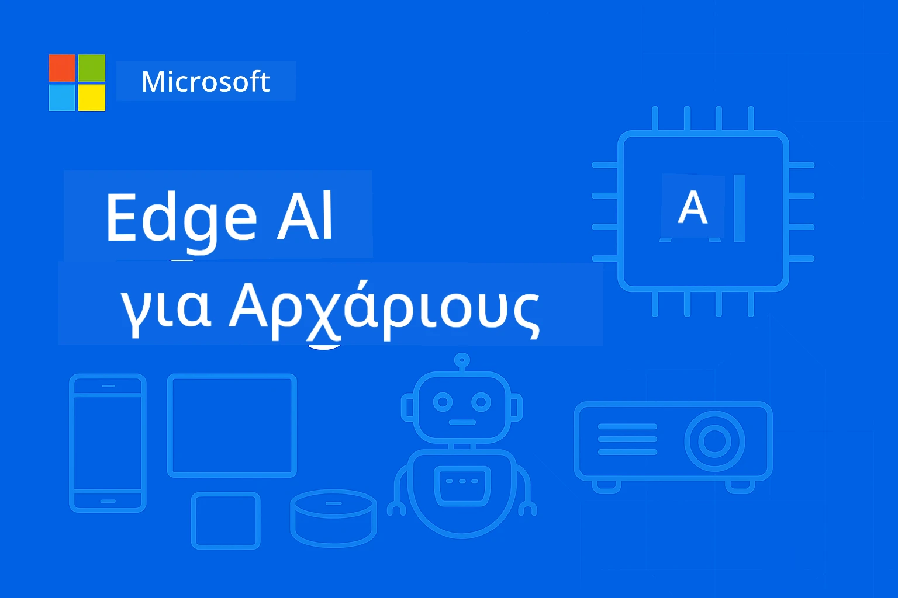

# EdgeAI για Αρχάριους




[](https://GitHub.com/microsoft/edgeai-for-beginners/graphs/contributors)
[](https://GitHub.com/microsoft/edgeai-for-beginners/issues)
[](https://GitHub.com/microsoft/edgeai-for-beginners/pulls)
[](http://makeapullrequest.com)

[](https://GitHub.com/microsoft/edgeai-for-beginners/watchers)
[](https://GitHub.com/microsoft/edgeai-for-beginners/fork)
[](https://GitHub.com/microsoft/edgeai-for-beginners/stargazers)


[](https://discord.gg/nTYy5BXMWG)

Ακολουθήστε αυτά τα βήματα για να ξεκινήσετε με αυτούς τους πόρους:

1. **Fork το Αποθετήριο**: Κάντε κλικ [](https://GitHub.com/microsoft/edgeai-for-beginners/fork)
2. **Κλωνοποιήστε το Αποθετήριο**:   `git clone https://github.com/microsoft/edgeai-for-beginners.git`
3. [**Γίνετε μέλος στο Discord της Azure AI Foundry και γνωρίστε ειδικούς και συναδέλφους προγραμματιστές**](https://discord.com/invite/ByRwuEEgH4)


### 🌐 Υποστήριξη Πολλών Γλωσσών

#### Υποστηρίζεται μέσω GitHub Action (Αυτοματοποιημένο & Πάντα Ενημερωμένο)

<!-- CO-OP TRANSLATOR LANGUAGES TABLE START -->
[Αραβικά](../ar/README.md) | [Μπενγκάλι](../bn/README.md) | [Βουλγαρικά](../bg/README.md) | [Βιρμανικά (Μιανμάρ)](../my/README.md) | [Κινέζικα (Απλοποιημένα)](../zh-CN/README.md) | [Κινέζικα (Παραδοσιακά, Χονγκ Κονγκ)](../zh-HK/README.md) | [Κινέζικα (Παραδοσιακά, Μακάο)](../zh-MO/README.md) | [Κινέζικα (Παραδοσιακά, Ταϊβάν)](../zh-TW/README.md) | [Κροατικά](../hr/README.md) | [Τσέχικα](../cs/README.md) | [Δανέζικα](../da/README.md) | [Ολλανδικά](../nl/README.md) | [Εσθονικά](../et/README.md) | [Φινλανδικά](../fi/README.md) | [Γαλλικά](../fr/README.md) | [Γερμανικά](../de/README.md) | [Ελληνικά](./README.md) | [Εβραϊκά](../he/README.md) | [Χίντι](../hi/README.md) | [Ουγγρικά](../hu/README.md) | [Ινδονησιακά](../id/README.md) | [Ιταλικά](../it/README.md) | [Ιαπωνικά](../ja/README.md) | [Κανάντα](../kn/README.md) | [Χμερ](../km/README.md) | [Κορεάτικα](../ko/README.md) | [Λιθουανικά](../lt/README.md) | [Μαλαισιανά](../ms/README.md) | [Μαλαγιαλάμ](../ml/README.md) | [Μαράθι](../mr/README.md) | [Νεπαλικά](../ne/README.md) | [Νιγηριανό Πίνγκιν](../pcm/README.md) | [Νορβηγικά](../no/README.md) | [Περσικά (Φαρσί)](../fa/README.md) | [Πολωνικά](../pl/README.md) | [Πορτογαλικά (Βραζιλία)](../pt-BR/README.md) | [Πορτογαλικά (Πορτογαλία)](../pt-PT/README.md) | [Πουντζάμπι (Γκουρμούκι)](../pa/README.md) | [Ρουμανικά](../ro/README.md) | [Ρωσικά](../ru/README.md) | [Σερβικά (Κυριλλικά)](../sr/README.md) | [Σλοβακικά](../sk/README.md) | [Σλοβενικά](../sl/README.md) | [Ισπανικά](../es/README.md) | [Σουαχίλι](../sw/README.md) | [Σουηδικά](../sv/README.md) | [Ταγκάλογκ (Φιλιππινέζικα)](../tl/README.md) | [Ταμίλ](../ta/README.md) | [Τελούγκου](../te/README.md) | [Ταϊλανδικά](../th/README.md) | [Τουρκικά](../tr/README.md) | [Ουκρανικά](../uk/README.md) | [Ουρντού](../ur/README.md) | [Βιετναμέζικα](../vi/README.md)

> **Προτιμάτε να κλωνοποιήσετε τοπικά;**
>
> Αυτό το αποθετήριο περιλαμβάνει περισσότερες από 50 μεταφράσεις γλωσσών που αυξάνουν σημαντικά το μέγεθος λήψης. Για κλωνοποίηση χωρίς μεταφράσεις, χρησιμοποιήστε το sparse checkout:
>
> **Bash / macOS / Linux:**
> ```bash
> git clone --filter=blob:none --sparse https://github.com/microsoft/edgeai-for-beginners.git
> cd edgeai-for-beginners
> git sparse-checkout set --no-cone '/*' '!translations' '!translated_images'
> ```
>
> **CMD (Windows):**
> ```cmd
> git clone --filter=blob:none --sparse https://github.com/microsoft/edgeai-for-beginners.git
> cd edgeai-for-beginners
> git sparse-checkout set --no-cone "/*" "!translations" "!translated_images"
> ```
>
> Αυτό σας παρέχει όλα όσα χρειάζεστε για να ολοκληρώσετε το μάθημα με πολύ πιο γρήγορη λήψη.
<!-- CO-OP TRANSLATOR LANGUAGES TABLE END -->

**Εάν επιθυμείτε να υποστηριχθούν επιπλέον γλώσσες μεταφράσεων, αυτές αναφέρονται [εδώ](https://github.com/Azure/co-op-translator/blob/main/getting_started/supported-languages.md)**
## Εισαγωγή

Καλώς ήρθατε στο **EdgeAI για Αρχάριους** – το πλήρες ταξίδι σας στον μετασχηματιστικό κόσμο της Τεχνητής Νοημοσύνης στην Άκρη (Edge AI). Αυτό το μάθημα γεφυρώνει το κενό ανάμεσα στις ισχυρές δυνατότητες ΤΝ και την πρακτική, πραγματική εφαρμογή σε συσκευές άκρης, δίνοντάς σας τη δυνατότητα να αξιοποιήσετε το δυναμικό της ΤΝ απευθείας όπου παράγονται τα δεδομένα και πρέπει να λαμβάνονται αποφάσεις.

### Τι Θα Κατακτήσετε

Αυτό το μάθημα σας οδηγεί από βασικές έννοιες σε υλοποιήσεις έτοιμες για παραγωγή, καλύπτοντας:
- **Μικρά Μοντέλα Γλώσσας (SLMs)** βελτιστοποιημένα για ανάπτυξη στην άκρη
- **Βελτιστοποίηση ευαισθητοποιημένη στο υλικό** σε διάφορες πλατφόρμες
- **Εκτίμηση σε πραγματικό χρόνο** με δυνατότητες προστασίας απορρήτου
- **Στρατηγικές ανάπτυξης στην παραγωγή** για επιχειρηματικές εφαρμογές

### Γιατί έχει Σημασία η EdgeAI

Η Edge AI αντιπροσωπεύει μια αλλαγή παραδείγματος που αντιμετωπίζει κρίσιμες σύγχρονες προκλήσεις:
- **Απόρρητο & Ασφάλεια**: Επεξεργασία ευαίσθητων δεδομένων τοπικά χωρίς έκθεση στο cloud
- **Επιδόσεις σε πραγματικό χρόνο**: Εξάλειψη της καθυστέρησης δικτύου για κρίσιμες εφαρμογές χρόνου
- **Οικονομική Αποδοτικότητα**: Μείωση κόστους εύρους ζώνης και υπολογιστικών ενεργειών στο cloud
- **Ανθεκτικές Λειτουργίες**: Διατήρηση της λειτουργικότητας κατά τη διάρκεια πτώσης δικτύου
- **Κανονιστική Συμμόρφωση**: Ικανοποίηση απαιτήσεων κυριαρχίας δεδομένων

### Edge AI

Η Edge AI αναφέρεται σε εκτέλεση αλγορίθμων ΤΝ και μοντέλων γλώσσας τοπικά στο υλικό, κοντά στο σημείο παραγωγής των δεδομένων χωρίς να βασίζεται σε πόρους cloud για την εκτίμηση. Μειώνει την καθυστέρηση, ενισχύει το απόρρητο και επιτρέπει τη λήψη αποφάσεων σε πραγματικό χρόνο.

### Βασικές Αρχές:
- **Εκτίμηση στη συσκευή**: Τα μοντέλα ΤΝ τρέχουν σε συσκευές άκρης (τηλέφωνα, δρομολογητές, μικροελεγκτές, βιομηχανικοί υπολογιστές)
- **Δυνατότητα εκτός σύνδεσης**: Λειτουργεί χωρίς συνεχή σύνδεση στο Internet
- **Χαμηλή καθυστέρηση**: Άμεσες απαντήσεις κατάλληλες για συστήματα πραγματικού χρόνου
- **Κυριαρχία δεδομένων**: Κρατά ευαίσθητα δεδομένα τοπικά, βελτιώνοντας ασφάλεια και συμμόρφωση

### Μικρά Μοντέλα Γλώσσας (SLMs)

Τα SLMs όπως τα Phi-4, Mistral-7B, και Gemma είναι βελτιστοποιημένες εκδόσεις των μεγαλύτερων LLMs — εκπαιδευμένα ή αποσταγμένα για:
- **Μειωμένο αποτύπωμα μνήμης**: Αποτελεσματική χρήση της περιορισμένης μνήμης των συσκευών άκρης
- **Χαμηλότερες απαιτήσεις υπολογισμού**: Βελτιστοποιημένα για επιδόσεις CPU και edge GPU
- **Πιο γρήγορες χρόνοι εκκίνησης**: Γρήγορη εκκίνηση για εφαρμογές με άμεση απόκριση

Ξεκλειδώνουν ισχυρές δυνατότητες Επεξεργασίας Φυσικής Γλώσσας καλύπτοντας τους περιορισμούς:
- **Ενσωματωμένα συστήματα**: Συσκευές IoT και βιομηχανικοί ελεγκτές
- **Κινητές συσκευές**: Smartphones και tablets με δυνατότητες εκτός σύνδεσης
- **Συσκευές IoT**: Αισθητήρες και έξυπνες συσκευές με περιορισμένους πόρους
- **Edge servers**: Τοπικές μονάδες επεξεργασίας με περιορισμένους πόρους GPU
- **Προσωπικοί Υπολογιστές**: Σενάρια ανάπτυξης σε desktop και laptop

## Ενότητες Μαθήματος & Πλοήγηση

| Ενότητα | Θέμα | Περιοχή Εστίασης | Κύριο Περιεχόμενο | Επίπεδο | Διάρκεια |
|--------|-------|------------|-------------|--------|----------|
| [📖 00 ](./introduction.md) | [Εισαγωγή στην EdgeAI](./introduction.md) | Βάσεις & Πλαίσιο | Επισκόπηση EdgeAI • Εφαρμογές στη βιομηχανία • Εισαγωγή στα SLM • Μαθησιακοί στόχοι | Αρχάριος | 1-2 ώρες |
| [📚 01](../../Module01) | [Θεμελιώδη EdgeAI](./Module01/README.md) | Σύγκριση Cloud vs Edge AI | Θεμελιώδη EdgeAI • Μελέτες περίπτωσης πραγματικού κόσμου • Οδηγός υλοποίησης • Ανάπτυξη στην άκρη | Αρχάριος | 3-4 ώρες |
| [🧠 02](../../Module02) | [Βάσεις Μοντέλων SLM](./Module02/README.md) | Οικογένειες μοντέλων & αρχιτεκτονική | Οικογένεια Phi • Οικογένεια Qwen • Οικογένεια Gemma • BitNET • μModel • Phi-Silica | Αρχάριος | 4-5 ώρες |
| [🚀 03](../../Module03) | [Πρακτική Ανάπτυξης SLM](./Module03/README.md) | Τοπική & cloud ανάπτυξη | Προχωρημένη μάθηση • Τοπικό περιβάλλον • Cloud ανάπτυξη | Ενδιάμεσο | 4-5 ώρες |
| [⚙️ 04](../../Module04) | [Εργαλειοθήκη Βελτιστοποίησης Μοντέλου](./Module04/README.md) | Βελτιστοποίηση δια πλατφορμών | Εισαγωγή • Llama.cpp • Microsoft Olive • OpenVINO • Apple MLX • Σύνθεση ροής εργασίας | Ενδιάμεσο | 5-6 ώρες |
| [🔧 05](../../Module05) | [SLMOps Παραγωγής](./Module05/README.md) | Λειτουργίες παραγωγής | Εισαγωγή SLMOps • Απόσταξη μοντέλου • Εκπαίδευση με προσαρμογή • Ανάπτυξη παραγωγής | Προχωρημένο | 5-6 ώρες |
| [🤖 06](../../Module06) | [Πράκτορες ΤΝ & Κλήση Συνάρτησης](./Module06/README.md) | Πλαίσια πρακτόρων & MCP | Εισαγωγή πράκτορα • Κλήση συνάρτησης • Πρωτόκολλο συμφραζομένων μοντέλου | Προχωρημένο | 4-5 ώρες |
| [💻 07](../../Module07) | [Υλοποίηση Πλατφόρμας](./Module07/README.md) | Δείγματα δια πλατφορμών | Εργαλειοθήκη ΤΝ • Τοπικό Foundry • Ανάπτυξη σε Windows | Προχωρημένο | 3-4 ώρες |
| [🏭 08](../../Module08) | [Εργαλειοθήκη Foundry Local](./Module08/README.md) | Δείγματα έτοιμα για παραγωγή | Εφαρμογές δείγματος (δείτε λεπτομέρειες παρακάτω) | Ειδικός | 8-10 ώρες |

### 🏭 **Ενότητα 08: Εφαρμογές Δείγματα**

- [01: REST Chat Γρήγορη Εκκίνηση](./Module08/samples/01/README.md)
- [02: Ενσωμάτωση OpenAI SDK](./Module08/samples/02/README.md)
- [03: Ανακάλυψη & Benchmarking Μοντέλων](./Module08/samples/03/README.md)
- [04: Εφαρμογή Chainlit RAG](./Module08/samples/04/README.md)
- [05: Ορχήστρωση Πολλαπλών Πρακτόρων](./Module08/samples/05/README.md)
- [06: Router Μοντέλων ως Εργαλεία](./Module08/samples/06/README.md)
- [07: Άμεσος Πελάτης API](./Module08/samples/07/README.md)
- [08: Εφαρμογή Chat στα Windows 11](./Module08/samples/08/README.md)
- [09: Προχωρημένο Σύστημα Πολλαπλών Πρακτόρων](./Module08/samples/09/README.md)
- [10: Πλαίσιο Εργαλείων Foundry](./Module08/samples/10/README.md)

### 🎓 **Εργαστήριο: Πρακτική Μάθηση**

Πλήρες υλικό εργαστηρίου με υλοποιήσεις έτοιμες για παραγωγή:

- **[Οδηγός Εργαστηρίου](./Workshop/Readme.md)** - Πλήρεις μαθησιακοί στόχοι, αποτελέσματα και πλοήγηση πόρων
- **Δείγματα Python** (6 συνεδρίες) - Ενημερωμένα με βέλτιστες πρακτικές, χειρισμό σφαλμάτων και πλήρη τεκμηρίωση
- **Jupyter Notebooks** (8 διαδραστικά) - Οδηγίες βήμα προς βήμα με benchmarks και παρακολούθηση απόδοσης
- **Οδηγοί Συνεδριών** - Λεπτομερείς οδηγοί markdown για κάθε συνεδρία εργαστηρίου
- **Εργαλεία Επικύρωσης** - Σενάρια για επαλήθευση ποιότητας κώδικα και δοκιμές smoke

**Τι Θα Δημιουργήσετε:**
- Τοπικές εφαρμογές συνομιλίας ΤΝ με υποστήριξη streaming
- Αγωγοί RAG με αξιολόγηση ποιότητας (RAGAS)
- Εργαλεία αξιολόγησης και σύγκρισης πολλαπλών μοντέλων
- Συστήματα ορχήστρωσης πολλαπλών πρακτόρων
- Έξυπνη δρομολόγηση μοντέλων με επιλογή βάσει εργασίας

### 🎙️ **Εργαστήριο για τον Agentic: Πρακτική - Το Στούντιο Podcast ΤΝ**
Δημιουργήστε μια ροή παραγωγής podcast με τεχνολογία AI από το μηδέν! Αυτό το εντατικό εργαστήριο σας μαθαίνει πώς να δημιουργήσετε ένα ολοκληρωμένο σύστημα με πολλούς πράκτορες που μετατρέπει τις ιδέες σε επαγγελματικά επεισόδια podcast.

**[🎬 Ξεκινήστε το εργαστήριο AI Podcast Studio](./WorkshopForAgentic/README.md)**

**Η αποστολή σας**: Εκκινήστε το "Future Bytes" — ένα τεχνολογικό podcast που λειτουργεί εξ ολοκλήρου με πράκτορες AI που θα δημιουργήσετε μόνοι σας. Χωρίς εξαρτήσεις από το cloud, χωρίς κόστος API — όλα τρέχουν τοπικά στον υπολογιστή σας.

**Τι το κάνει μοναδικό:**
- **🤖 Πραγματική Ορχήστρωση Πολλών Πρακτόρων** - Δημιουργήστε εξειδικευμένους πράκτορες AI που ερευνούν, γράφουν και παράγουν ήχο
- **🎯 Ολοκληρωμένη Ροή Παραγωγής** - Από την επιλογή θέματος μέχρι το τελικό ηχητικό αρχείο του podcast
- **💻 100% Τοπική Ανάπτυξη** - Χρήση Ollama και τοπικών μοντέλων (Qwen-3-8B) για πλήρη ιδιωτικότητα και έλεγχο
- **🎤 Ενσωμάτωση Κείμενο-σε-Ομιλία** - Μετατρέψτε τα σενάρια σε φυσικούς διαλόγους πολλαπλών ομιλητών
- **✋ Ροές Εργασίας με Εμπλοκή Ανθρώπου** - Πύλες έγκρισης για διασφάλιση ποιότητας χωρίς να θυσιάζεται η αυτοματοποίηση

**Μάθηση σε τρία μέρη:**

| Μέρος | Εστίαση | Κύριες Δεξιότητες | Διάρκεια |
|-----|-------|------------|----------|
| **[Μέρος 1: Γνωρίστε τους Βοηθούς AI](./WorkshopForAgentic/md/01.BuildAIAgentWithSLM.md)** | Δημιουργήστε τον πρώτο σας πράκτορα AI | Ενσωμάτωση εργαλείων • Αναζήτηση στο διαδίκτυο • Επίλυση προβλημάτων • Λογική πρακτόρων | 2-3 ώρες |
| **[Μέρος 2: Σχηματίστε την Ομάδα Παραγωγής σας](./WorkshopForAgentic/md/02.AIAgentOrchestrationAndWorkflows.md)** | Ορχηστρώστε πολλούς πράκτορες | Συντονισμός ομάδας • Ροές εργασίας έγκρισης • Διεπαφή DevUI • Ανθρώπινος έλεγχος | 3-4 ώρες |
| **[Μέρος 3: Ζωντανέψτε το Podcast σας](./WorkshopForAgentic/md/03.Multi-SpeakerPodcastGenerationWithVibeVoice.md)** | Δημιουργία ηχητικού podcast | Κείμενο-σε-ομιλία • Σύνθεση πολλών ομιλητών • Ηχητικό μακράς μορφής • Πλήρης αυτοματοποίηση | 2-3 ώρες |

**Χρησιμοποιούμενες τεχνολογίες:**
- **Microsoft Agent Framework** - Ορχήστρωση και συντονισμός πολλαπλών πρακτόρων
- **Ollama** - Τοπική εκτέλεση μοντέλων AI (χωρίς ανάγκη cloud)
- **Qwen-3-8B** - Ανοιχτού κώδικα γλωσσικό μοντέλο βελτιστοποιημένο για εργασίες πρακτόρων
- **API Κείμενο-σε-Ομιλία** - Φυσικός συνθετικός ήχος για παραγόμενα podcast

**Υποστήριξη Υλικού:**
- ✅ **Λειτουργία CPU** - Λειτουργεί σε οποιονδήποτε σύγχρονο υπολογιστή (προτείνεται 8GB+ RAM)
- 🚀 **Επιτάχυνση GPU** - Ταχύτερη επεξεργασία με GPUs NVIDIA/AMD
- ⚡ **Υποστήριξη NPU** - Επιτάχυνση με νευρωνικές μονάδες επεξεργασίας επόμενης γενιάς

**Είναι ιδανικό για:**
- Προγραμματιστές που μαθαίνουν συστήματα πολλών πρακτόρων AI
- Όσους ενδιαφέρονται για αυτοματοποίηση AI και ροές εργασίας
- Δημιουργούς περιεχομένου που εξερευνούν την παραγωγή με τη βοήθεια AI
- Φοιτητές που μελετούν πρακτικά πρότυπα ορχήστρωσης AI

**Ξεκινήστε την κατασκευή**: [🎙️ Το εργαστήριο AI Podcast Studio →](./WorkshopForAgentic/README.md)

### 📊 **Περίληψη Μαθησιακού Μονοπατιού**
- **Συνολική Διάρκεια**: 36-45 ώρες
- **Μονοπάτι Αρχαρίων**: Μονάδες 01-02 (7-9 ώρες)  
- **Μονοπάτι Ενδιάμεσου**: Μονάδες 03-04 (9-11 ώρες)
- **Μονοπάτι Προχωρημένου**: Μονάδες 05-07 (12-15 ώρες)
- **Μονοπάτι Ειδικού**: Μονάδα 08 (8-10 ώρες)

## Τι θα Δημιουργήσετε

### 🎯 Βασικές Ικανότητες
- **Αρχιτεκτονική Edge AI**: Σχεδιασμός συστημάτων local-first με ενσωμάτωση cloud
- **Βελτιστοποίηση Μοντέλων**: Ποσοτικοποίηση και συμπίεση μοντέλων για ανάπτυξη edge (επιτάχυνση 85%, μείωση μεγέθους 75%)
- **Πολυπλατφόρμα Ανάπτυξη**: Windows, κινητά, ενσωματωμένα και υβριδικά cloud-edge συστήματα
- **Λειτουργίες Παραγωγής**: Παρακολούθηση, κλιμάκωση και διαχείριση edge AI στην παραγωγή

### 🏗️ Πρακτικά Έργα
- **Foundry Local Chat Apps**: Αυθεντική εφαρμογή Windows 11 με εναλλαγή μοντέλων
- **Συστήματα Πολλών Πρακτόρων**: Συντονιστής με ειδικούς πράκτορες για πολύπλοκες ροές εργασίας  
- **RAG Εφαρμογές**: Τοπική επεξεργασία εγγράφων με αναζήτηση σε διανύσματα
- **Δρομολογητές Μοντέλων**: Έξυπνη επιλογή μεταξύ μοντέλων με βάση ανάλυση εργασιών
- **API Frameworks**: Παραγωγίμως έτοιμοι πελάτες με ροή και παρακολούθηση υγείας
- **Διαπλατφορμικά Εργαλεία**: Πρότυπα ενσωμάτωσης LangChain/Semantic Kernel

### 🏢 Εφαρμογές στη Βιομηχανία
**Βιομηχανία** • **Υγεία** • **Αυτόνομα Οχήματα** • **Έξυπνες Πόλεις** • **Κινητές Εφαρμογές**

## Γρήγορη Έναρξη

**Προτεινόμενο Μονοπάτι Μάθησης** (20-30 ώρες συνολικά):

0. **📖 Εισαγωγή** ([Introduction.md](./introduction.md)): Βάσεις EdgeAI + βιομηχανικό πλαίσιο + εκπαιδευτικό πλαίσιο  
1. **📚 Θεμέλια** (Μονάδες 01-02): Έννοιες EdgeAI + οικογένειες μοντέλων SLM  
2. **⚙️ Βελτιστοποίηση** (Μονάδες 03-04): Ανάπτυξη + πλαίσια ποσοτικοποίησης  
3. **🚀 Παραγωγή** (Μονάδες 05-06): SLMOps + πράκτορες AI + κλήσεις συναρτήσεων  
4. **💻 Υλοποίηση** (Μονάδες 07-08): Δείγματα πλατφόρμας + εργαλεία Foundry Local

Κάθε μονάδα περιλαμβάνει θεωρία, πρακτικές ασκήσεις και παραδείγματα κώδικα έτοιμα για παραγωγή.

## Επαγγελματική Επίδραση

**Τεχνικοί Ρόλοι**: Αρχιτέκτονας λύσεων EdgeAI • ML Engineer (Edge) • IoT AI Developer • Mobile AI Developer

**Βιομηχανικοί Τομείς**: Manufacturing 4.0 • Healthcare Tech • Autonomous Systems • FinTech • Consumer Electronics

**Portfolio Projects**: Συστήματα πολλών πρακτόρων • Παραγωγικές RAG εφαρμογές • Διαπλατφορμική ανάπτυξη • Βελτιστοποίηση επιδόσεων

## Δομή Αποθετηρίου

```
edgeai-for-beginners/
├── 📖 introduction.md  # Foundation: EdgeAI Overview & Learning Framework
├── 📚 Module01-04/     # Fundamentals → SLMs → Deployment → Optimization  
├── 🔧 Module05-06/     # SLMOps → AI Agents → Function Calling
├── 💻 Module07/        # Platform Samples (VS Code, Windows, Jetson, Mobile)
├── 🏭 Module08/        # Foundry Local Toolkit + 10 Comprehensive Samples
│   ├── samples/01-06/  # Foundation: REST, SDK, RAG, Agents, Routing
│   └── samples/07-10/  # Advanced: API Client, Windows App, Enterprise Agents, Tools
├── 🌐 translations/    # Multi-language support (8+ languages)
└── 📋 STUDY_GUIDE.md   # Structured learning paths & time allocation
```

## Επισημάνσεις Μαθήματος

✅ **Προοδευτική Μάθηση**: Θεωρία → Πράξη → Παραγωγική Ανάπτυξη  
✅ **Πραγματικές Μελέτες Περίπτωσης**: Microsoft, Japan Airlines, υλοποιήσεις σε επιχειρήσεις  
✅ **Πρακτικά Παραδείγματα**: 50+ παραδείγματα, 10 εκτενείς παρουσιάσεις Foundry Local  
✅ **Εστίαση στην Απόδοση**: 85% βελτίωση ταχύτητας, 75% μείωση μεγέθους  
✅ **Πολυπλατφορμικά**: Windows, κινητά, ενσωματωμένα, υβριδικά cloud-edge  
✅ **Έτοιμο για Παραγωγή**: Παρακολούθηση, κλιμάκωση, ασφάλεια και πλαισίωση συμμόρφωσης

📖 **[Διαθέσιμος Οδηγός Μελέτης](STUDY_GUIDE.md)**: Δομημένο μονοπάτι 20 ωρών με καθοδήγηση κατανομής χρόνου και εργαλεία αυτοαξιολόγησης.

---

**Το EdgeAI αντιπροσωπεύει το μέλλον της ανάπτυξης AI**: προτεραιότητα στην τοπική εκτέλεση, προστασία απορρήτου και αποτελεσματικότητα. Κατακτήστε αυτές τις δεξιότητες για να δημιουργήσετε την επόμενη γενιά έξυπνων εφαρμογών.

## Άλλα Μαθήματα

Η ομάδα μας παράγει κι άλλα μαθήματα! Δείτε:

<!-- CO-OP TRANSLATOR OTHER COURSES START -->
### LangChain
[](https://aka.ms/langchain4j-for-beginners)
[](https://aka.ms/langchainjs-for-beginners?WT.mc_id=m365-94501-dwahlin)
[](https://github.com/microsoft/langchain-for-beginners?WT.mc_id=m365-94501-dwahlin)
---

### Azure / Edge / MCP / Agents
[](https://github.com/microsoft/AZD-for-beginners?WT.mc_id=academic-105485-koreyst)
[](https://github.com/microsoft/edgeai-for-beginners?WT.mc_id=academic-105485-koreyst)
[](https://github.com/microsoft/mcp-for-beginners?WT.mc_id=academic-105485-koreyst)
[](https://github.com/microsoft/ai-agents-for-beginners?WT.mc_id=academic-105485-koreyst)

---
 
### Σειρά Generative AI
[](https://github.com/microsoft/generative-ai-for-beginners?WT.mc_id=academic-105485-koreyst)
[-9333EA?style=for-the-badge&labelColor=E5E7EB&color=9333EA)](https://github.com/microsoft/Generative-AI-for-beginners-dotnet?WT.mc_id=academic-105485-koreyst)
[-C084FC?style=for-the-badge&labelColor=E5E7EB&color=C084FC)](https://github.com/microsoft/generative-ai-for-beginners-java?WT.mc_id=academic-105485-koreyst)
[-E879F9?style=for-the-badge&labelColor=E5E7EB&color=E879F9)](https://github.com/microsoft/generative-ai-with-javascript?WT.mc_id=academic-105485-koreyst)

---
 
### Βασική Μάθηση
[](https://aka.ms/ml-beginners?WT.mc_id=academic-105485-koreyst)
[](https://aka.ms/datascience-beginners?WT.mc_id=academic-105485-koreyst)
[](https://aka.ms/ai-beginners?WT.mc_id=academic-105485-koreyst)
[](https://github.com/microsoft/Security-101?WT.mc_id=academic-96948-sayoung)
[](https://aka.ms/webdev-beginners?WT.mc_id=academic-105485-koreyst)
[](https://aka.ms/iot-beginners?WT.mc_id=academic-105485-koreyst)
[](https://github.com/microsoft/xr-development-for-beginners?WT.mc_id=academic-105485-koreyst)

---
 
### Σειρά Copilot
[](https://aka.ms/GitHubCopilotAI?WT.mc_id=academic-105485-koreyst)
[](https://github.com/microsoft/mastering-github-copilot-for-dotnet-csharp-developers?WT.mc_id=academic-105485-koreyst)
[](https://github.com/microsoft/CopilotAdventures?WT.mc_id=academic-105485-koreyst)
<!-- CO-OP TRANSLATOR OTHER COURSES END -->

## Λήψη Βοήθειας

Αν κολλήσετε ή έχετε οποιεσδήποτε ερωτήσεις σχετικά με την κατασκευή εφαρμογών ΤΝ, συμμετέχετε:

[](https://discord.gg/nTYy5BXMWG)

Αν έχετε σχόλια για το προϊόν ή σφάλματα κατά την κατασκευή, επισκεφθείτε:

[](https://aka.ms/foundry/forum)

---

<!-- CO-OP TRANSLATOR DISCLAIMER START -->
**Αποποίηση ευθυνών**:  
Αυτό το έγγραφο έχει μεταφραστεί χρησιμοποιώντας την υπηρεσία αυτόματης μετάφρασης AI [Co-op Translator](https://github.com/Azure/co-op-translator). Ενώ καταβάλλουμε προσπάθεια για ακρίβεια, παρακαλώ λάβετε υπόψη ότι οι αυτοματοποιημένες μεταφράσεις μπορεί να περιέχουν λάθη ή ανακρίβειες. Το αρχικό έγγραφο στη μητρική του γλώσσα πρέπει να θεωρείται η αυθεντική πηγή. Για κρίσιμες πληροφορίες, συνιστάται επαγγελματική ανθρώπινη μετάφραση. Δεν φέρουμε ευθύνη για οποιεσδήποτε παρεξηγήσεις ή λανθασμένες ερμηνείες που προκύπτουν από τη χρήση αυτής της μετάφρασης.
<!-- CO-OP TRANSLATOR DISCLAIMER END -->