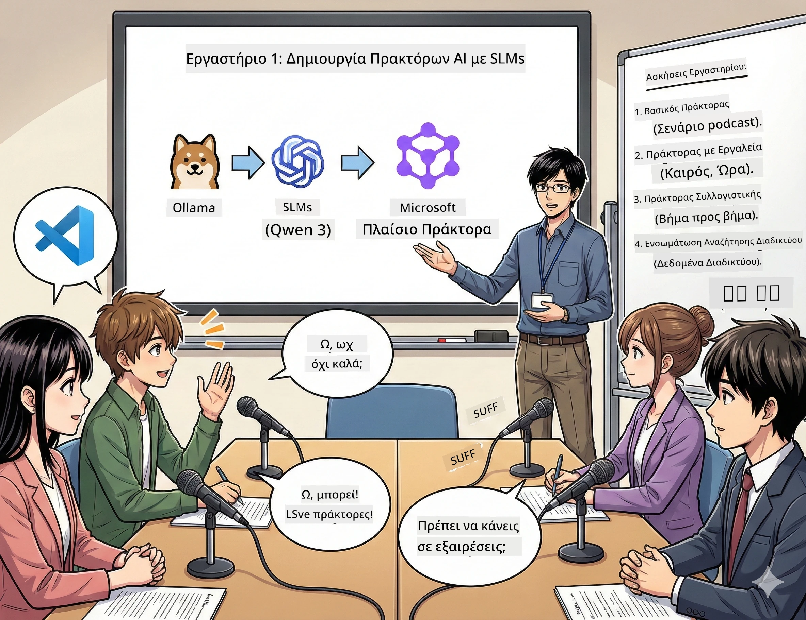

# Πράξη 1: Γνωρίστε τον Βοηθό Έρευνας AI σας 🤖

## Η Πρόκληση

Ξεκινάτε το "Future Bytes," το νέο σας τεχνολογικό podcast. Το Επεισόδιο 1 αφορά τις πιο πρόσφατες εξελίξεις στην AI, αλλά έχετε 24 ώρες για να:
1. Ερευνήσετε το θέμα
2. Βρείτε αξιόπιστες πηγές
3. Γράψετε ένα συναρπαστικό σενάριο
4. Το κάνετε να ακούγεται φυσικό

**Ανατροπή πλοκής**: Δεν χρειάζεται να το κάνετε μόνοι σας. Ετοιμάζεστε να φτιάξετε τον πρώτο σας βοηθό AI που μπορεί να βοηθήσει σε όλα αυτά. Ας τον ονομάσουμε Alex — ο ακούραστος συνεργάτης έρευνας που δεν χρειάζεται ύπνο ποτέ.

## Γιατί Μικρά Μοντέλα Γλώσσας; (Υπόδειξη: Είναι Τέλεια)

Σκεφτείτε τα Μικρά Μοντέλα Γλώσσας (SLMs) ως την προσωπική σας AI που ζει στον *υπολογιστή σας*. Χωρίς σύννεφο, χωρίς μηνιαίους λογαριασμούς, χωρίς αμφίβολη κοινή χρήση δεδομένων.

**Γιατί τα SLMs είναι 🔥:**
- **🏠 Τρέχουν στη Συσκευή σας**: Laptop, desktop, ακόμα και ένα ισχυρό Raspberry Pi
- **💸 Μηδενικό Κόστος**: Χωρίς τέλη API να σας τρώνε τα χρήματα
- **🔒 Ιδιωτικότητα Πρώτα**: Τα δεδομένα σας δεν φεύγουν ποτέ από τη συσκευή σας
- **⚡ Αστραπιαία Ταχύτητα**: Δεν υπάρχει καθυστέρηση ίντερνετ, άμεσες απαντήσεις
- **🪦 Ελαφριά**: 1B-10B παραμέτρους αντί για 100B+ των μεγάλων

**Δημοφιλή SLMs**: Qwen 3, Phi-4, Gemma 3 (χρησιμοποιούμε Qwen για αυτό το εργαστήριο)

## Το Σετ Εργαλείων σας

### Ollama: Ο Διαχειριστής Μοντέλων AI σας

[Ollama](https://ollama.com/) είναι σαν το Steam για μοντέλα AI. Κατεβάστε, τρέξτε και διαχειριστείτε μοντέλα με απλές εντολές.

**Τι το κάνει δροσερό:**
- Μία εντολή για να κατεβάσετε και να τρέξετε οποιοδήποτε μοντέλο
- Λειτουργεί σε Mac, Windows, Linux
- Χρησιμοποιεί αυτόματα την GPU σας αν έχετε
- Πολύ αποδοτική στη μνήμη

### Microsoft Agent Framework: Εκεί που γίνεται η Μαγεία

[Microsoft Agent Framework](https://github.com/microsoft/agent-framework) είναι ο χώρος σας για να χτίσετε AI πράκτορες που μπορούν:

- 💬 Να συνομιλούν και να θυμούνται τι είπατε
- 🛠️ Να χρησιμοποιούν προσαρμοσμένα εργαλεία (όπως αναζήτηση στο web ή έλεγχο καιρού)
- 🧠 Να σκέφτονται βήμα-βήμα σύνθετα προβλήματα
- 🤝 Να συνεργάζονται με άλλους πράκτορες ως ομάδα
- 🔌 Να συνδέονται με διάφορους παρόχους AI (OpenAI, Ollama, Azure)

**Τα Δομικά Στοιχεία:**
- **Πράκτορες**: Οι βοηθοί AI με συγκεκριμένες δουλειές
- **Εργαλεία**: Ειδικές ικανότητες που τους δίνετε
- **Μνήμη**: Για να μην ξεχνούν τη συνομιλία σας
- **Λογική**: Να τους μαθαίνετε να σκέφτονται, όχι μόνο να απαντούν

## Το Πρόγραμμα Εκπαίδευσής σας: 4 Αποστολές

### Αποστολή 1: Δημιουργήστε τον Πρώτο σας Πράκτορα

📓 [Άνοιγμα Τετράδιου](../code/01.BasicAgent/00.BasicAgent-agent.ipynb)

**Η Αποστολή**: Φτιάξτε τον Alex, τον σεναριογράφο AI του podcast σας. Ο Alex πρέπει να δημιουργεί διάλογο μεταξύ δύο παρουσιαστών που συζητούν τεχνολογικά θέματα.

**Τι θα μάθετε**:
- Πώς να ξυπνάτε έναν πράκτορα AI (είναι πιο εύκολο από το να ξυπνήσετε Δευτέρα)
- Πώς να του δίνετε προσωπικότητα και οδηγίες
- Πώς να δημιουργεί πραγματικά σενάρια podcast
- Να καταλαβαίνετε τι σας απαντά

**Συνθήκη Νίκης**: Ο Alex δημιουργεί σενάριο για το πιλοτικό επεισόδιο του "Future Bytes" για την AI! 🎯

### Αποστολή 2: Δώστε στον Alex Υπερδυνάμεις (Εργαλεία!)

📓 [Άνοιγμα Τετράδιου](../code/01.BasicAgent/01.BasicAgent-tools.ipynb)

**Η Αποστολή**: Ο Alex είναι έξυπνος, αλλά δεν ξέρει τον σημερινό καιρό ή την ώρα. Ας το διορθώσουμε δίνοντάς του εργαλεία!

**Τι θα μάθετε**:
- Δημιουργία προσαρμοσμένων συναρτήσεων Python ως "εργαλεία"
- Να αφήνετε τον Alex να αποφασίζει *πότε* θα χρησιμοποιήσει ποιο εργαλείο
- Να τον βλέπετε να λύνει προβλήματα αυτόνομα
- Να συνδυάζετε πολλά εργαλεία για σύνθετες εργασίες

**Συνθήκη Νίκης**: Ρωτήστε "Ποιος είναι ο καιρός στο Τόκιο;" και ο Alex το βρίσκει μόνος του! ☁️

### Αποστολή 3: Διδάξτε στον Alex να Σκέφτεται

📓 [Άνοιγμα Τετράδιου](../code/01.BasicAgent/02.BasicAgent-reasoning.ipynb)

**Η Αποστολή**: Κάντε τον Alex να δείχνει τη δουλειά του. Όταν λύνει προβλήματα, θέλετε να βλέπετε *πώς* σκέφτεται, όχι μόνο την απάντηση.

**Τι θα μάθετε**:
- Ενεργοποίηση "λειτουργίας λογικής" (σαν να δείχνετε τα βήματα στα μαθηματικά)
- Να βλέπετε τη διαδικασία σκέψης του Alex βήμα-βήμα
- Να καταλαβαίνετε το chain-of-thought prompting
- Να διορθώνετε όταν ο Alex μπερδεύεται

**Συνθήκη Νίκης**: Ρωτήστε ένα δύσκολο μαθηματικό πρόβλημα και δείτε τον Alex να το σκέφτεται! 🧠

### Αποστολή 4: Συνδέστε τον Alex στο Διαδίκτυο

📓 [Άνοιγμα Τετράδιου](../code/01.BasicAgent/03.BasicAgent-websearch.ipynb)

**Η Αποστολή**: Η γνώση του Alex έχει ημερομηνία λήξης. Ας τον συνδέσουμε στο web για πληροφορίες σε πραγματικό χρόνο!

**Τι θα μάθετε**:
- Να φτιάχνετε ένα προσαρμοσμένο εργαλείο αναζήτησης web
- Να ενσωματώνετε εξωτερικά APIs
- Να χειρίζεστε σφάλματα δικτύου με χάρη
- Να παίρνετε πληροφορίες πέραν των δεδομένων εκπαίδευσης του Alex

**Συνθήκη Νίκης**: Ρωτήστε για τα σημερινά τεχνολογικά νέα και λάβετε φρέσκα αποτελέσματα! 📰

## Πριν Ξεκινήσετε 🚀

**Απαιτούμενος Εξοπλισμός**:
- Εγκατεστημένο Python 3.10+
- Ollama σε λειτουργία (ελέγξτε με `ollama --version`)
- VS Code με επέκταση Python
- Τουλάχιστον 8GB RAM (16GB αν θέλετε ομαλή εμπειρία)

## Σειρά των Αποστολών

Ακολουθήστε τα τετράδια με τη σειρά για την πλήρη ιστορία:

1. [00.BasicAgent-agent.ipynb](../code/01.BasicAgent/00.BasicAgent-agent.ipynb) — Γνωρίστε τον Alex (τον πρώτο σας πράκτορα)
2. [01.BasicAgent-tools.ipynb](../code/01.BasicAgent/01.BasicAgent-tools.ipynb) — Ώρα ενίσχυσης!
3. [02.BasicAgent-reasoning.ipynb](../code/01.BasicAgent/02.BasicAgent-reasoning.ipynb) — Διδάξτε τον Alex να σκέφτεται
4. [03.BasicAgent-websearch.ipynb](../code/01.BasicAgent/03.BasicAgent-websearch.ipynb) — Αναβάθμιση με πρόσβαση στο Internet!

## Τι Θα Κυριαρχήσετε

Μετά την Πράξη 1, θα μπορείτε να:

- ✅ Τρέχετε μοντέλα AI στον δικό σας εξοπλισμό (χωρίς σύννεφο!)
- ✅ Φτιάχνετε πράκτορες με προσαρμοσμένες προσωπικότητες και δεξιότητες
- ✅ Δίνετε στους πράκτορες εργαλεία για να λύσουν πραγματικά προβλήματα
- ✅ Κάνετε τους πράκτορες να δείχνουν τη λογική τους
- ✅ Συνδέετε τους πράκτορες με εξωτερικές πηγές δεδομένων
- ✅ Διορθώνετε όταν κάτι πάει στραβά

## Όταν Τίποτα Δεν Πηγαίνει Καλά (Και Πώς να το Διορθώσετε) 🔧

### "Ο Alex δεν φορτώνει! Δεν φτάνει η μνήμη!"
**Η Λύση**: Ο υπολογιστής σας αγχώνεται. Δοκιμάστε να κλείσετε άλλες εφαρμογές ή αλλάξτε σε μικρότερο μοντέλο. 8GB RAM είναι το απολύτως ελάχιστο.

### "Ο Alex είναι πολυ-αργός"
**Η Λύση**: Ενεργοποιήστε την επιτάχυνση GPU στις ρυθμίσεις Ollama. Ή μειώστε το μέγεθος του παραθύρου συμφραζομένων. Τώρα μπαίνουμε σε λειτουργία ταχύτητας! 🏎️

### "Τα Εργαλεία δεν λειτουργούν!"
**Η Λύση**: Επαληθεύστε τις υπογραφές των συναρτήσεων σας. Ο Alex χρειάζεται σωστές ενδείξεις τύπων για να καταλάβει τι κάνει το εργαλείο. Σκεφτείτε το σαν να δίνετε σαφείς οδηγίες.

## Χρήσιμοι Σύνδεσμοι 🔗

- [Agent Framework Docs](https://github.com/microsoft/agent-framework) — Επίσημοι οδηγοί και παραδείγματα  
- [Ollama Model Library](https://ollama.com/library) — Περιηγηθείτε σε όλα τα διαθέσιμα μοντέλα  
- [Qwen Model](https://ollama.com/library/qwen3) — Γνωρίστε τον εγκέφαλο της AI σας  
- [Code Examples](https://github.com/microsoft/agent-framework/tree/main/python/samples) — Κλέψτε ιδέες από εδώ

## Επόμενο: Πράξη 2 🎬

Έχετε έναν πράκτορα. Αλλά τι γίνεται αν είχατε μια *ομάδα* πρακτόρων που δουλεύουν μαζί; Στην Πράξη 2, θα φτιάξετε την πλήρη ομάδα παραγωγής του podcast σας:
- **Πράκτορας Έρευνας**: Βρίσκει τις καλύτερες πηγές
- **Πράκτορας Συγγραφής**: Δημιουργεί το τέλειο σενάριο  
- **Επεξεργαστής (Εσείς!)**: Εγκρίνει ή ζητά αλλαγές

Ας δημιουργήσουμε λίγη μαγεία AI! → [Πράξη 2: Σχηματίστε την Ομάδα Παραγωγής σας](02.AIAgentOrchestrationAndWorkflows.md)

---

**Μπλοκαρισμένοι;** Κάντε ερωτήσεις κατά τη διάρκεια του εργαστηρίου. Μαθαίνουμε όλοι μαζί! 🙌

---

<!-- CO-OP TRANSLATOR DISCLAIMER START -->
**Αποποίηση ευθύνης**:  
Αυτό το έγγραφο έχει μεταφραστεί χρησιμοποιώντας την υπηρεσία μετάφρασης AI [Co-op Translator](https://github.com/Azure/co-op-translator). Ενώ καταβάλουμε προσπάθεια για ακρίβεια, παρακαλούμε λάβετε υπόψη ότι οι αυτοματοποιημένες μεταφράσεις ενδέχεται να περιέχουν λάθη ή ανακρίβειες. Το πρωτότυπο έγγραφο στη μητρική του γλώσσα πρέπει να θεωρείται η επίσημη πηγή. Για κρίσιμες πληροφορίες, συνιστάται επαγγελματική ανθρώπινη μετάφραση. Δεν φέρουμε καμία ευθύνη για τυχόν παρεξηγήσεις ή λανθασμένες ερμηνείες που προκύπτουν από τη χρήση αυτής της μετάφρασης.
<!-- CO-OP TRANSLATOR DISCLAIMER END -->