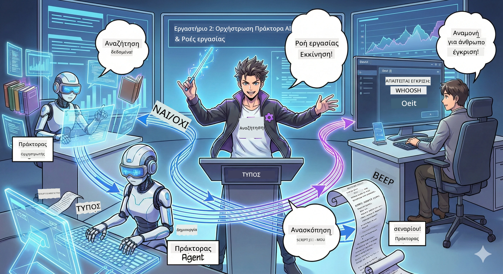

<!--
CO_OP_TRANSLATOR_METADATA:
{
  "original_hash": "93f84b804ced67c5cd017c3c4bb476ff",
  "translation_date": "2026-01-05T11:29:05+00:00",
  "source_file": "WorkshopForAgentic/md/02.AIAgentOrchestrationAndWorkflows.md",
  "language_code": "el"
}
-->
# Πράξη 2: Σχηματίστε την Ομάδα Παραγωγής του Podcast σας 🎬



## Η Υπόθεση Πυκνώνει

Ο Alex (ο βοηθός AI σας από την Πράξη 1) είναι καταπληκτικός, αλλά ένας μόνο πράκτορας δεν μπορεί να τρέξει ολόκληρο στούντιο podcast. Χρειάζεστε μια *ομάδα*:
- 🔍 **Πράκτορας Έρευνας**: Ψάχνει στο ίντερνετ για νέες πληροφορίες
- ✍️ **Πράκτορας Σεναρίου**: Μετατρέπει την έρευνα σε ελκυστικό διάλογο
- 👤 **Εσείς (Ο Επιμελητής)**: Εγκρίνετε τα σενάρια ή τα στέλνετε πίσω για διορθώσεις

Καλώς ήρθατε στη **Διαχείριση Πρακτόρων AI** — όπου γίνεστε ο σκηνοθέτης της δικής σας ομάδας AI. Σκεφτείτε τους Εκδικητές, αλλά για την παραγωγή podcast.

## Τι Είναι η Διαχείριση Πρακτόρων; (Η Απλή Έκδοση)

Φανταστείτε ότι διευθύνετε ένα εστιατόριο. Δεν κάνετε τα πάντα μόνος, έτσι δεν είναι; Έχετε:
- 🍳 Έναν σεφ που μαγειρεύει
- 👨‍🍳 Έναν βοηθό σεφ που προετοιμάζει
- 👩‍🍳 Μία σερβιτόρα που σερβίρει

Η διαχείριση πρακτόρων είναι η ίδια ιδέα, αλλά με AI. Κάθε πράκτορας έχει ειδικότητα και εσείς τους συντονίζετε για να πετύχετε μεγαλύτερους στόχους. Κανένας πράκτορας δεν καταπονείται και η δουλειά γίνεται πιο γρήγορα.

### Η Αναλογία της Μπάντας 🎸

Οι πράκτορες AI σας είναι σαν μια μπάντα:
- **Κύριος τραγουδιστής**: Ο βασικός πράκτορας που χειρίζεται εργασίες πελατών
- **Ντράμερ**: Κρατάει το ρυθμό, χειρίζεται την επεξεργασία στο παρασκήνιο  
- **Μπάσο**: Υποστηρίζει όλους, φέρνει δεδομένα
- **Εσείς (Διευθυντής της μπάντας)**: Τα συντονίζετε όλα!

Χωρίς συντονισμό; Απλώς θόρυβος. Με διαχείριση; Όμορφη μουσική.

### Γιατί Είναι Σημαντικό

Ένας πράκτορας AI που προσπαθεί να κάνει τα πάντα = εξουθένωση. Εξειδικευμένοι πράκτορες που δουλεύουν μαζί = ξεκλείδωμα αποδοτικότητας! 🚀

**Ειλικρινής Συζήτηση**: Θυμάστε όταν προσπαθούσατε να κάνετε έρευνα, να γράψετε και να επεξεργαστείτε το podcast σας μόνοι; Ναι, αυτό είναι δύσκολο. Με τη διαχείριση, κάθε πράκτορας αναλαμβάνει το καλύτερο που ξέρει. Εσείς παίρνετε μόνο τις τελικές αποφάσεις.

**Παραδείγματα στον Πραγματικό Κόσμο**: Bots υποστήριξης πελατών που ξέρουν πότε να χειριστούν τιμολόγηση, πότε τεχνικά θέματα και πότε να καλέσουν άνθρωπο. Αυτό είναι διαχείριση!

## Πράκτορας vs Ροή Εργασίας: Ποια η Διαφορά;

Σκεφτείτε το έτσι:

### 🤖 Πράκτορας AI = Μουσικός Τζαζ
- **Παίρνει αποφάσεις επιτόπου** με βάση αυτά που ακούει
- **Αυτοσχεδιάζει** λύσεις χρησιμοποιώντας τα εργαλεία του
- **Σκέφτεται** με εγκέφαλο LLM
- **Προσαρμόζεται** σε ό,τι του ρίξετε

### 🎵 Ροή Εργασίας = Ορχήστρα που Παίζει Κλασική Μουσική  
- **Ακολουθεί παρτιτούρα** (προκαθορισμένα βήματα)
- **Προβλέψιμη** εκτέλεση
- **Συντονίζει** πολλούς πράκτορες, ανθρώπους, συστήματα
- **Δομημένη** σαν συνταγή

**Το Μαγικό**: Οι ροές εργασίας *συντονίζουν* πράκτορες! Δημιουργείτε μια ροή που λέει στους πράκτορες πότε να παίξουν το ρόλο τους. Το καλύτερο και από τα δύο! 🎭

## Τρεις Τρόποι για να Συντονίσετε την Ομάδα AI σας

### 1. 🎯 Κεντρικοποιημένη (Εσείς είστε το Αφεντικό)

Ένας κύριος πράκτορας δίνει όλες τις εντολές. Σκεφτείτε το σαν να διαχειρίζεστε μια ομάδα — εσείς αποφασίζετε ποιος κάνει τι και πότε.

**Πλεονεκτήματα**:
- ✅ Σαφής ηγεσία (χωρίς σύγχυση)
- ✅ Συνεπείς αποφάσεις
- ✅ Εύκολο debugging

**Χρησιμοποιήστε το για**:
- Δρομολόγηση εξυπηρέτησης πελατών ("Είναι αυτό τιμολόγηση ή τεχνική υποστήριξη;")
- Ροές έγκρισης περιεχομένου ("Περνάει το σενάριο;")
- Παραγωγή podcast (ακριβώς αυτό που φτιάχνουμε!)

### 2. 🤝 Αποκεντρωμένη (Οι Πράκτορες Αυτο-οργανώνονται)

Οι πράκτορες μιλάνε μεταξύ τους απευθείας και τα καταφέρνουν σαν ομάδα. Σαν κουβέντα σε γκρουπ όπου συντονίζονται όλοι.

**Πλεονεκτήματα**:
- ✅ Εύκολη κλιμάκωση (προσθέστε πράκτορες όποτε θέλετε)
- ✅ Χωρίς μοναδικό σημείο αποτυχίας
- ✅ Φυσική συνεργασία πρακτόρων

**Χρησιμοποιήστε το για**:
- Ομάδες έρευνας (κάθε πράκτορας εξερευνά διαφορετικές πηγές)
- Συνεδρίες καταιγισμού ιδεών
- Κατανεμημένη επίλυση προβλημάτων

### 3. 🔀 Υβριδικό (Το Καλύτερο από Δύο Κόσμους)

Εσείς δίνετε τη συνολική κατεύθυνση, αλλά οι πράκτορες έχουν ελευθερία αυτο-οργάνωσης στις εργασίες. Σαν CEO που εμπιστεύεται την ομάδα του.

**Ιδανικό για**: Πολύπλοκα έργα που χρειάζονται έλεγχο και ευελιξία.

## Microsoft Agent Framework: Το Σύνθετο Εργαλείο Ορχήστρωσης σας 🧰

Ώρα για κατασκευή! Να τι θα χρησιμοποιήσετε:

### Τα Οικοδομικά Τεμάχια

#### 1. 🧱 Εκτελεστές (Οι Εργάτες σας)
- **Τι είναι**: Ατομικές μονάδες επεξεργασίας — μπορεί να είναι πράκτορες ή προσαρμοσμένη λογική
- **Τι κάνουν**: Λαμβάνουν είσοδο, κάνουν δουλειά, παράγουν έξοδο
- **Σκεφτείτε τους σαν**: Σταθμούς σε γραμμή παραγωγής

#### 2. ➡️ Ακμές (Οι Συνδέσεις)
- **Τι είναι**: Διαδρομές μεταξύ εκτελεστών
- **Τι κάνουν**: Ελέγχουν τη ροή των μηνυμάτων ("Μετά το Α, πήγαινε στο Β")
- **Σκεφτείτε τις σαν**: Βέλη σε διάγραμμα ροής

#### 3. 🗺️ Ροές Εργασίας (Το Κυρίως Σχέδιο)
- **Τι είναι**: Ολόκληρο το γράφημα εκτελεστών + ακμών
- **Τι κάνουν**: Ορίζουν τη συνολική διαδικασία από την αρχή έως το τέλος
- **Σκεφτείτε τις σαν**: Το σχέδιο σωλήνωσης παραγωγής σας

### Κουλ Λειτουργίες που θα Λατρέψετε

**🛡️ Ασφάλεια Τύπων**: Τα μηνύματα μεταξύ πρακτόρων ελέγχονται ως προς τον τύπο. Καμία έκπληξη "Ουπς, λάθος τύπος δεδομένων".

**🔀 Ευέλικτη Δρομολόγηση**: 
- Συνθήκες αν-τότε ("Αν εγκριθεί, δημοσίευσε· αλλιώς, ξαναγράψε")
- Παραλληλοποίηση (πολλοί πράκτορες δουλεύουν ταυτόχρονα)
- Δυναμικές διαδρομές (η ροή προσαρμόζεται βάση αποτελεσμάτων)

**🔌 Εξωτερική Ενσωμάτωση**:
- Σύνδεση με API
- Προσθήκη ελέγχων ανθρώπου στη διαδικασία (εσείς εγκρίνετε πριν τη δημοσίευση)
- Δημιουργία ροών αίτησης/απάντησης

**💾 Αποθήκευση Προόδου**: Αποθηκεύστε την πρόοδο! Αν κάτι πέσει, συνεχίστε από εκεί που σταματήσατε.

**🤝 Συνεργασία Πολλών Πρακτόρων**:
- Εκτέλεση πρακτόρων διαδοχικά (Α → Β → Γ)
- Εκτέλεση παράλληλα (Α + Β + Γ ταυτόχρονα)
- Μεταβίβαση εργασιών μεταξύ πρακτόρων
- Συνεργατική επεξεργασία

## Καλύτερες Πρακτικές (Pro Tips) 🎯

### 1. Κρατήστε το Μοντέρνο
Κάθε πράκτορας να κάνει ΜΙΑ δουλειά πολύ καλά. Μην φτιάχνετε "σούπερ πράκτορα" που κάνει τα πάντα — θα το μετανιώσετε στο debugging.

### 2. Προβλέψτε Αποτυχίες
Οι πράκτορες κάνουν λάθη. Δίκτυα πέφτουν. Φτιάξτε χειρισμό σφαλμάτων και εναλλακτικά σχέδια. Το μελλοντικό σας εγώ θα σας ευγνωμονεί.

### 3. Παρακολουθείτε τα Πάντα
Καταγράψτε τι κάνουν οι πράκτορές σας. Χρησιμοποιήστε DevUI (θα το δούμε!) για να δείτε τις ροές εργασίας σε δράση.

### 4. Βελτιστοποιήστε το Μέγεθος Μηνυμάτων
Μην περνάτε τεράστια αρχεία μεταξύ πρακτόρων. Κρατήστε τα μηνύματα ελαφριά και γρήγορα.

### 5. Επιλέξτε το Σωστό Πρότυπο
Χρειάζεστε έλεγχο; Πηγαίνετε κεντρικοποιημένο. Χρειάζεστε κλιμάκωση; Πηγαίνετε αποκεντρωμένο. Δεν ξέρετε; Πηγαίνετε υβριδικό!

## DevUI: Ο Αποσφαλματωτής Ροής Εργασίας σας 🔍

### Τι Είναι το DevUI;

Το DevUI είναι σαν μια παιδική χαρά για δοκιμές πρακτόρων και ροών. Είναι μια διεπαφή ιστού όπου μπορείτε να:
- 👀 Παρακολουθήσετε τη ροή εργασίας σε δράση
- 💬 Συνομιλήσετε απευθείας με τους πράκτορες
- 🔍 Αποσφαλματώσετε όταν κάτι πάει στραβά
- 📊 Δείτε ίχνη και μετρήσεις απόδοσης

> **Σημαντικό**: Το DevUI είναι για ανάπτυξη μόνο! Μην το χρησιμοποιείτε στη παραγωγή. Σκεφτείτε το σαν το τοπικό σας περιβάλλον δοκιμών.

### Τι το Κάνει Καταπληκτικό

- **🖥️ Διαδραστική Διεπαφή Ιστού**: Κλικάρετε, πληκτρολογείτε, δοκιμάζετε — χωρίς γραμμή εντολών
- **📁 Έτοιμο για Drag-and-Drop**: Ανεβάστε αρχεία, δοκιμάστε με διάφορες εισόδους
- **📂 Αυτόματη Εντοπισμός**: Δώστε ένα φάκελο, βρίσκει τους πράκτορες αυτόματα
- **📋 Χωρίς Ρύθμιση**: Εγγράψτε πράκτορες στον κώδικα, χωρίς δομή φακέλου
- **🔌 Συμβατό με OpenAI**: Δουλεύει με το OpenAI SDK (συμβατότητα FTW!)
- **👁️ Ένσωματη Παρακολούθηση**: Δείτε ακριβώς τι κάνουν οι πράκτορές σας

### Πώς Λειτουργούν οι Είσοδοι

Το DevUI είναι έξυπνο με τις εισόδους:

- **Δοκιμάζετε Πράκτορες;** Λαμβάνετε πεδία κειμένου και κουμπιά για ανέβασμα αρχείων
- **Δοκιμάζετε Ροές Εργασίας;** Το UI δημιουργεί αυτόματα πεδία εισόδου με βάση τις ανάγκες της ροής

Είναι σαν μαγεία, αλλά απλά είναι καλός κώδικας. ✨

## Οι Αποστολές σας: Φτιάξτε ένα Στούντιο Podcast 🎬

### Αποστολή 1: Δημιουργήστε Έναν Μόνο Πράκτορα με το DevUI

📂 [01.AgentDevUI](../../../../WorkshopForAgentic/code/02.Workflow/01.AgentDevUI)

**Η Πρόκληση**: Πριν φτιάξουμε ολόκληρη ομάδα, ας δοκιμάσουμε το DevUI με έναν πράκτορα: έναν ειδικό στην αναζήτηση στο διαδίκτυο.

**Τι Φτιάχνετε**:  
Έναν πράκτορα έρευνας που μπορεί να ψάξει στο διαδίκτυο για θέματα podcast. Θα τον δοκιμάσετε μέσω της διεπαφής DevUI στη διεύθυνση `http://localhost:8090`.

**Δεξιότητες που Θα Μάθετε**:  
- 🚀 Εκκίνηση πρακτόρων στο DevUI  
- 🔍 Δοκιμή απαντήσεων πρακτόρων σε πραγματικό χρόνο  
- 🛠️ Κατασκευή προσαρμοσμένων εργαλείων (αναζήτηση στο διαδίκτυο)  
- 📊 Ενεργοποίηση ιχνών για debugging  
- 🖥️ Χρήση της διαδραστικής διεπαφής ιστού

**Ο Κώδικας**:  
- `agent.py`: Ο SearchAgent σας με υπερωρίες αναζήτησης στο διαδίκτυο  
- Χρησιμοποιεί OllamaChatClient για σύνδεση με Qwen  
- Υλοποιεί τη λειτουργία `web_search()`  
- Ξεκινά με `serve()` — ανοίγει το DevUI αυτόματα

**Συνθήκη Νίκης**: Ρωτήστε τον πράκτορά σας "Τι γίνεται με τις τάσεις στο AI;" και δείτε τον να ψάχνει στο διαδίκτυο! 🎉

### Αποστολή 2: Δημιουργήστε Ροή Εργασίας Πολλαπλών Πρακτόρων

📂 [02.WorkflowDevUI](../../../../WorkshopForAgentic/code/02.Workflow/02.WorkflowDevUI)

**Η Πρόκληση**: Τώρα αρχίζει το πραγματικό παιχνίδι! Φτιάξτε ολόκληρη ροή παραγωγής podcast με:  
1. 🔍 **Πράκτορας Αναζήτησης** → Ερευνά το θέμα σας  
2. ✍️ **Πράκτορας Σεναρίου** → Γράφει διάλογο μεταξύ δύο παρουσιαστών (στα κινέζικα!)  
3. 👤 **Εκτελεστής Επισκόπησης** → Ζητά από ΕΣΑΣ να εγκρίνετε ή να απορρίψετε  
4. 🔄 **Επανάληψη** → Αν απορριφθεί, ξαναγράφει με βάση τα σχόλιά σας

**Δεξιότητες που Θα Μάθετε**:  
- 🧱 Δημιουργία εξειδικευμένων πρακτόρων για διαφορετικές εργασίες  
- 🔗 Σύνδεση πρακτόρων με WorkflowBuilder  
- 🔀 Υλοποίηση βρόχων έγκρισης (άνθρωπος στη διαδικασία!)  
- 🚦 Προαιρετική δρομολόγηση (αν εγκριθεί έναντι απόρριψης)  
- 🔧 Κατασκευή προσαρμοσμένων εκτελεστών για επιχειρησιακή λογική

**Η Ροή Εργασίας**:  
```
SearchAgent → ScriptAgent → ReviewExecutor
                             ↑          ↓ (if rejected)
                             ←─────────
```
  
**Ο Κώδικας**:  
- `search_agent/agent.py`: Ο ειδικός σας στην έρευνα  
- `generate_script_agent/agent.py`: Ο συγγραφέας σεναρίων σας (γράφει στα κινέζικα!)  
- `workflow/workflow.py`: Εδώ γίνεται η μαγεία της ορχήστρωσης  
- `main.py`: Εκκινεί τα πάντα στο DevUI

**Συνθήκη Νίκης**: Δώστε ένα θέμα, επιθεωρήστε το σενάριο, απορρίψτε το μια φορά για να δοκιμάσετε τον βρόχο, και μετά εγκρίνετε! 🎉

### Αποστολή 3: Δημιουργήστε μια Εφαρμογή Κονσόλας

📂 [03.Application](../../../../WorkshopForAgentic/code/02.Workflow/03.Application)

**Η Πρόκληση**: Πάρτε τη ροή εργασίας από το DevUI και μετατρέψτε την σε μια κομψή εφαρμογή τερματικού με έγχρωμη έξοδο, στρογγυλές φόρμες φόρτωσης, και αποθήκευση αρχείων. Αυτό είναι έτοιμο για παραγωγή!

**Δεξιότητες που Θα Μάθετε**:  
- ⚡ Εκτέλεση ροών εργασίας προγραμματιστικά (χωρίς DevUI)  
- 📡 Αρχιτεκτονική βασισμένη σε γεγονότα με streaming  
- 🎨 Δημιουργία όμορφων διεπαφών τερματικού (χρώματα, στροφείς, μπάρες προόδου)  
- 💾 Αποθήκευση τελικών σεναρίων σε αρχεία  
- 🔄 Διαχείριση ασύγχρονων ροών με Python asyncio

**Τι Κάνει**:  
1. Σας ζητά θέμα podcast  
2. Δείχνει την πρόοδο σε πραγματικό χρόνο ("Ο Πράκτορας Αναζήτησης δουλεύει...")  
3. Εμφανίζει το παραχθέν σενάριο με χρώματα  
4. Ζητά την έγκρισή σας  
5. Αποθηκεύει το εγκεκριμένο σενάριο στο `podcast.txt`

**Ο Κώδικας**:  
- `podcast_app.py`: Η κύρια εφαρμογή με διαχείριση γεγονότων  
- `workflow.py`: Επαναχρησιμοποιεί τη ροή από την Αποστολή 2  
- Διαχειρίζεται τα γεγονότα: `AgentRunUpdateEvent`, `RequestInfoEvent`, `WorkflowOutputEvent`  
- Χρησιμοποιεί ANSI χρώματα για στυλ τερματικού

**Συνθήκη Νίκης**: Τρέξτε την εφαρμογή, δημιουργήστε σενάριο podcast, και δείτε το αποθηκευμένο! Φτιάξατε ένα πραγματικό εργαλείο. 🚀

## Τι Έχετε Κατακτήσει 🏆

Μετά την Πράξη 2, μπορείτε:

- ✅ Να οργανώνετε πολλούς πράκτορες AI σαν αφεντικό  
- ✅ Να φτιάχνετε ροές εργασίας με διαδοχική ΚΑΙ προαιρετική λογική  
- ✅ Να προσθέτετε σημεία ελέγχου έγκρισης από άνθρωπο  
- ✅ Να χρησιμοποιείτε το DevUI για δοκιμές και debugging ροών  
- ✅ Να δημιουργείτε εφαρμογές κονσόλας έτοιμες για παραγωγή  
- ✅ Να διαχειρίζεστε σφάλματα ομαλά σε πολύπλοκα συστήματα  
- ✅ Να επιλέγετε το σωστό πρότυπο ορχήστρωσης για κάθε έργο

## Όταν Σπάζουν Πράγματα 🔧

### "Η ροή εργασίας είναι πολύπλοκη!"
**Η Λύση**: Χωρίστε την σε μικρότερες υπο-ροές. Κάθε ροή πρέπει να κάνει ΜΙΑ δουλειά καλά. Συνδέστε τις μεταξύ τους αν χρειάζεται.

### "Δεν μπορώ να παρακολουθήσω τι γίνεται!"
**Η Λύση**: Χρησιμοποιήστε σημείο αποθήκευσης κατάστασης. Ενεργοποιήστε τα ίχνη στο DevUI για να βλέπετε κάθε βήμα.

### "Το λάθος ενός πράκτορα σπάει τα πάντα!"
**Η Λύση**: Προσθέστε όρια σφαλμάτων. Κάθε πράκτορας να χειρίζεται τα δικά του λάθη και να έχει εναλλακτική συμπεριφορά.

### "Αυτό είναι τόσο αργό"
**Η Λύση**: Μπορούν κάποιοι πράκτορες να τρέχουν παράλληλα; Οι διαδοχικές ροές είναι εύκολες αλλά αργές. Ψάξτε για ευκαιρίες παραλληλοποίησης!

## Χρήσιμοι Πόροι 🔗

- [Workflow Docs](https://learn.microsoft.com/en-us/agent-framework/user-guide/workflows/overview) — Επίσημοι οδηγοί Microsoft  
- [Orchestration Patterns](https://www.ibm.com/think/topics/ai-agent-orchestration) — Η προσέγγιση της IBM  
- [Agent Framework GitHub](https://github.com/microsoft/agent-framework) — Δείτε τον πηγαίο κώδικα
- [Παραδείγματα Κώδικα](https://github.com/microsoft/agent-framework/tree/main/python/samples) — Κλέψε πρότυπα από εδώ

---

**Έτοιμος για το φινάλε;** Έχεις το σενάριό σου. Τώρα ας το μετατρέψουμε σε πραγματικό ήχο! → [Πράξη 3: Φέρε το podcast σου στη ζωή](03.Multi-SpeakerPodcastGenerationWithVibeVoice.md) 🎤

---

**Κόλλησες; Μπερδεύτηκες; Ενθουσιασμένος;** Μοιράσου το στο chat του εργαστηρίου! Μαθαίνουμε όλοι μαζί. 🚀

---

<!-- CO-OP TRANSLATOR DISCLAIMER START -->
**Αποποίηση ευθυνών**:  
Αυτό το έγγραφο έχει μεταφραστεί χρησιμοποιώντας την υπηρεσία αυτόματης μετάφρασης AI [Co-op Translator](https://github.com/Azure/co-op-translator). Ενώ κάνουμε προσπάθειες για την ακρίβεια, παρακαλούμε να γνωρίζετε ότι οι αυτοματοποιημένες μεταφράσεις μπορεί να περιέχουν λάθη ή ανακρίβειες. Το πρωτότυπο έγγραφο στην μητρική του γλώσσα πρέπει να θεωρείται η αυθεντική πηγή. Για κρίσιμες πληροφορίες, συνιστάται η επαγγελματική ανθρώπινη μετάφραση. Δεν φέρουμε ευθύνη για τυχόν παρεξηγήσεις ή λανθασμένες ερμηνείες που προκύπτουν από τη χρήση αυτής της μετάφρασης.
<!-- CO-OP TRANSLATOR DISCLAIMER END -->