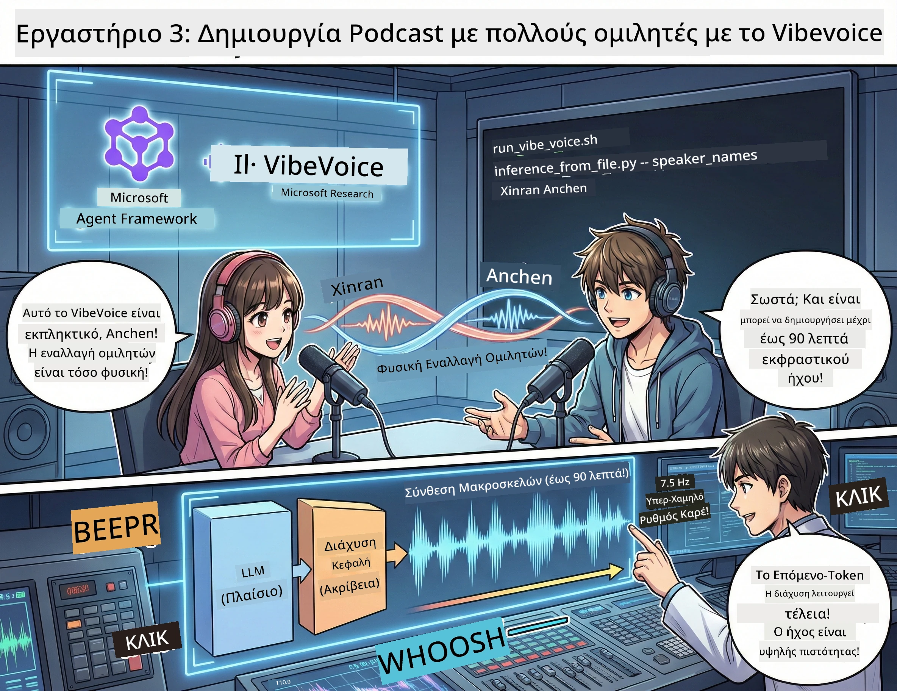

<!--
CO_OP_TRANSLATOR_METADATA:
{
  "original_hash": "bb2a3cf5ebd0ec8211af960a004fc23d",
  "translation_date": "2026-01-05T12:15:10+00:00",
  "source_file": "WorkshopForAgentic/md/03.Multi-SpeakerPodcastGenerationWithVibeVoice.md",
  "language_code": "el"
}
-->
# Πράξη 3: Ζωντανέψτε το Podcast σας 🎤



## Το Μεγάλο Φινάλε

Έχετε ερευνήσει θέματα. Έχετε γράψει σενάρια. Τώρα για την κερασάδα στην τούρτα: μετατρέποντας το κείμενό σας σε πραγματικό ηχητικό podcast με ρεαλιστικές φωνές!

Γνωρίστε το **VibeVoice** — την ανοιχτού κώδικα μαγεία TTS (κείμενο σε ομιλία) της Microsoft Research που δημιουργεί:
- 🎭 Φυσικούς διαλόγους
- 👥 Πολλούς ομιλητές (μέχρι 4!)
- ⏱️ Μακροσκελή ήχο (μέχρι 90 λεπτά!)
- 🎵 Εκφραστική παράδοση (όχι ρομποτικές φωνές!)

Αυτή είναι η τεχνολογία πίσω από τα συνθετικά podcasts. Ας φτιάξουμε το δικό σας!

## Τι είναι το VibeVoice; (Τα Κουλ Πραγματάκια)

Το VibeVoice είναι το δώρο της Microsoft Research στον κόσμο. Είναι ειδικά σχεδιασμένο για ηχητικά podcasts σε μορφή συζήτησης.

### Γιατί Είναι Εξαιρετικό 🔥

* **⏱️ Μαραθώνιες Συνεδρίες**: Παράγει μέχρι 90 λεπτά συνεχόμενης ομιλίας (δηλαδή ένα ολόκληρο επεισόδιο podcast!)
* **👥 Μαγεία με Πολλούς Ομιλητές**: Μέχρι και 4 διαφορετικές φωνές με συνεπείς προσωπικότητες
* **⚡ Τρελή Αποδοτικότητα**: Χρησιμοποιεί εξαιρετικά χαμηλό ρυθμό καρέ 7,5 Hz για εξοικονόμηση υπολογιστικής ισχύος
* **🧠 Έξυπνος Ήχος**: Συνδυάζει ένα LLM (κατανοεί το πλαίσιο) με μοντέλο διάχυσης (δημιουργεί ρεαλιστικό ήχο)
* **🎭 Φυσική Ροή**: Διαχειρίζεται αυτόματα τη διαδοχή ομιλίας, τις παύσεις και το ρυθμό της συνομιλίας

**Μετάφραση**: Το VibeVoice δεν απλώς διαβάζει το σενάριό σας — το *παίζει* σαν πραγματικοί άνθρωποι που μιλάνε.

---

## Πριν Ξεκινήσετε 🚀

**Τι Χρειάζεστε**:

* 🐍 **Python 3.10+** (το έχετε ήδη από τις Πράξεις 1 & 2)
* 🚀 **uv** (ένας γρήγορος διαχειριστής πακέτων Python — θα τον εγκαταστήσουμε)
* 📝 **Το Σενάριό σας**: Το αρχείο `podcast.txt` από την Πράξη 2 (στο `../03.Application/`)

**Συμβουλή Pro**: Αυτό το βήμα απαιτεί καλή σύνδεση στο διαδίκτυο για τη λήψη του προεκπαιδευμένου μοντέλου. Πιάστε έναν καφέ! ☕

---

## Πάμε! Ο Εύκολος Τρόπος 🎬

Το κάναμε εξαιρετικά απλό. Ένα shell script κάνει τα πάντα.

### Η Διαδικασία

1. **Κάντε το εκτελέσιμο**:
```bash
chmod +x run_vibe_voice.sh
```

2. **Τρέξτε το**:
```bash
./run_vibe_voice.sh
```

3. **Περιμένετε τη μαγεία** (μπορεί να πάρει λίγα λεπτά την πρώτη φορά)

### Τι Συμβαίνει Πίσω από τις Κουίντες 🎭

Το script είναι βασικά ο αυτοματοποιημένος μηχανικός ήχου σας:

1. **📥 Κατεβάζει το VibeVoice**: Κλωνοποιεί το επίσημο αποθετήριο από το GitHub
2. **📦 Εγκαθιστά Εξαρτήσεις**: Χρησιμοποιεί το `uv pip` για αστραπιαία εγκατάσταση πακέτων
3. **🎬 Δημιουργεί Ήχο**: Τρέχει το script inference με:
   * `--model_path`: Το προεκπαιδευμένο μοντέλο VibeVoice-7B
   * `--txt_path`: Το σενάριό σας `podcast.txt`
   * `--speaker_names`: Αναθέτει φωνές (Xinran & Anchen ως προεπιλογή)

**Αποτέλεσμα**: Το σενάριό σας γίνεται πραγματικό επεισόδιο podcast! 🎉

---

## Η Αποστολή Σας 🎯

Ας γίνει πιο ενδιαφέρον:

### Εργασία 1: Δημιουργήστε Περιεχόμενο
Επεξεργαστείτε το `../03.Application/podcast.txt` με μια συνομιλία δύο ατόμων. Αφήστε το να είναι για τεχνολογία, χόμπι, ό,τι θέλετε! Απλά φροντίστε να είναι συνομιλιακό.

**Παράδειγμα Μορφής**:
```
Speaker 1: Hey! Did you hear about the new AI model?
Speaker 2: No way! Tell me more!
Speaker 1: It's called...
```

### Εργασία 2: Δημιουργήστε Ήχο
Τρέξτε το script και παρακολουθήστε τη μαγεία να συμβαίνει. Την πρώτη φορά θα πάρει περισσότερο (λήψη μοντέλου).

### Εργασία 3: Ακούστε & Αναλύστε
- Ακούγεται φυσικό;
- Έχουν οι ομιλητές διακριτές φωνές;
- Είναι ομαλή η εναλλαγή της ομιλίας;
- Υπάρχουν ρομποτικές στιγμές;

### Εργασία 4: Πειραματιστείτε (Για τους Τολμηρούς)
Επεξεργαστείτε το `run_vibe_voice.sh` και αλλάξτε το `--speaker_names` για να δοκιμάσετε διαφορετικούς συνδυασμούς φωνών. Το VibeVoice διαθέτει πολλές προεκπαιδευμένες φωνές!

**Πρόκληση Extra**: Δοκιμάστε συνομιλία με 3 ομιλητές! 🎆

---

## Μάθετε Περισσότερα 📚

* **🏠 Αρχική Σελίδα Έργου**: [VibeVoice Επίσημη Σελίδα](https://microsoft.github.io/VibeVoice/)
* **🤗 Προεκπαιδευμένο Μοντέλο**: [Hugging Face - VibeVoice-7B](https://huggingface.co/vibevoice/VibeVoice-7B)
* **📖 Ερευνητικό Άρθρο**: Δείτε την τεχνολογία σε βάθος (αν σας ενδιαφέρει)

> **⚠️ Υπενθύμιση Υπεύθυνης AI**: Το VibeVoice είναι ισχυρό. Χρησιμοποιήστε το με ηθικό τρόπο! Μην δημιουργείτε deepfakes ή παραπλανητικό περιεχόμενο. Δημιουργήστε ωραία πράγματα που βοηθούν τους ανθρώπους. 🙏

---

## 🏆 Συγχαρητήρια! Τα Καταφέρατε!

Μόλις ολοκληρώσατε ολόκληρη τη ροή:
1. ✅ **Πράξη 1**: Δημιουργήσατε AI agents με προσαρμοσμένα εργαλεία
2. ✅ **Πράξη 2**: Οργανώσατε ροή εργασίας με πολλούς agents
3. ✅ **Πράξη 3**: Δημιουργήσατε πραγματικό ηχητικό podcast

**Τώρα έχετε**:
- Έναν λειτουργικό βοηθό AI έρευνας
- Πλήρη ροή παραγωγής podcast
- Ένα πραγματικό αρχείο ήχου που μπορείτε να μοιραστείτε

### Τι Ακολουθεί; 🚀

**Ξεκινήστε το podcast σας!**
- Φορτώστε το σε πλατφόρμες podcast
- Μοιραστείτε στα κοινωνικά δίκτυα
- Βελτιώστε το συνεχώς

**Συνεχίστε να χτίζετε!**
- Δοκιμάστε άλλα θέματα
- Πειραματιστείτε με περισσότερους ομιλητές
- Προσθέστε μουσική υπόκρουση
- Δημιουργήστε web interface
- Αυτοματοποιήστε τα πάντα

**Μοιραστείτε τη δουλειά σας!**
Ετικετοποιήστε μας! Δείξτε στον κόσμο τι φτιάξατε. Η επανάσταση του AI podcast ξεκινά με εσάς. 🎙️

---

**Ερωτήσεις; Ιδέες; Ιστορίες επιτυχίας;** Αφήστε τις στην κουβέντα του εργαστηρίου!

**Καλώς ήρθατε στο μέλλον της δημιουργίας περιεχομένου.** 🌟

---

<!-- CO-OP TRANSLATOR DISCLAIMER START -->
**Αποποίηση Ευθυνών**:  
Αυτό το έγγραφο έχει μεταφραστεί χρησιμοποιώντας την υπηρεσία αυτόματης μετάφρασης AI [Co-op Translator](https://github.com/Azure/co-op-translator). Παρόλο που καταβάλλουμε προσπάθεια για ακρίβεια, παρακαλούμε να έχετε υπόψη ότι οι αυτόματες μεταφράσεις μπορεί να περιέχουν λάθη ή ανακρίβειες. Το πρωτότυπο έγγραφο στην αρχική του γλώσσα πρέπει να θεωρείται η επίσημη πηγή. Για κρίσιμες πληροφορίες συνιστάται επαγγελματική μετάφραση από άνθρωπο. Δεν φέρουμε ευθύνη για τυχόν παρεξηγήσεις ή λανθασμένες ερμηνείες που προκύπτουν από τη χρήση αυτής της μετάφρασης.
<!-- CO-OP TRANSLATOR DISCLAIMER END -->