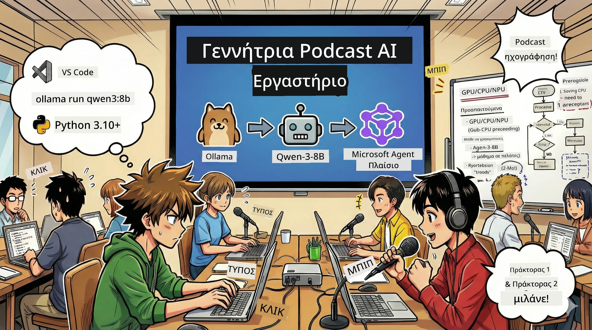

# 🎙️ AI Studio Podcast Workshop



## Η αποστολή σου

Καλώς ήρθες στο **AI Studio Podcast**! Είσαι έτοιμος να ξεκινήσεις το δικό σου τεχνολογικό podcast «Μελλοντικά Bytes» — αλλά με μια ανατροπή: θα δημιουργήσεις μια ομάδα παραγωγής με τεχνητή νοημοσύνη που θα σε βοηθήσει να το φτιάξεις. Δεν χρειάζεται πλέον ατελείωτη έρευνα, συγγραφή σεναρίων και επεξεργασία ήχου. Αντιθέτως, θα προγραμματίσεις τον εαυτό σου να γίνει ένας παραγωγός podcast με υπερδυνάμεις AI.

## Το σκηνικό της ιστορίας

Φαντάσου: εσύ και οι φίλοι σου θέλετε να ξεκινήσετε ένα podcast για τις πιο συναρπαστικές τεχνολογικές τάσεις, αλλά όλοι είναι απασχολημένοι με σπουδές, δουλειά ή ζωή. Τι θα γινόταν αν μπορούσες να φτιάξεις μια ομάδα ευφυών AI πρακτόρων που θα κάνουν την βαριά δουλειά; Ένας agent αναλαμβάνει την έρευνα, ένας γράφει συναρπαστικά σενάρια, ένας τρίτος μετατρέπει το κείμενο σε φυσική και ρέουσα συνομιλία. Ακούγεται σαν επιστημονική φαντασία; Ας την κάνουμε πραγματικότητα.

## Τι θα μάθεις

Στο τέλος αυτού του εργαστηρίου, θα γνωρίζεις πώς να:
- 🤖 Αναπτύσσεις τα δικά σου τοπικά μοντέλα AI (χωρίς χρεώσεις API, χωρίς εξάρτηση από το cloud!)
- 🔧 Δημιουργείς πραγματικά συνεργαζόμενους επαγγελματικούς AI πράκτορες
- 🎬 Φτιάχνεις μια πλήρη ροή παραγωγής podcast από την ιδέα μέχρι τον ήχο

## Το ταξίδι σου: Τρεις πράξεις

Όπως κάθε καλή ιστορία, έχουμε τρεις πράξεις. Κάθε πράξη χτίζει σταδιακά το AI Studio Podcast σου:

| Κεφάλαιο | Η αποστολή σου | Τι συμβαίνει | Δεξιότητες που ξεκλειδώνονται |
|---------|-----------|--------------|----------------|
| **Πράξη Πρώτη** | [Γνωρίστε τους βοηθούς σας AI](01.BuildAIAgentWithSLM.md) | Θα ανακαλύψεις πώς να δημιουργήσεις AI πράκτορες που μπορούν να συνομιλούν, να ψάχνουν στο διαδίκτυο, ακόμα και να λύνουν προβλήματα. Φαντάσου τους σαν ερευνητικούς ασκούμενους που δεν κοιμούνται ποτέ. | 🎯 Δημιουργία του πρώτου σου agent<br>🛠️ Εξοπλισμός του με υπερδυνάμεις (εργαλεία!)<br>🧠 Εκπαίδευσή του να σκέφτεται<br>🌐 Σύνδεση με το διαδίκτυο |
| **Πράξη Δεύτερη** | [Οργάνωσε την παραγωγική σου ομάδα](02.AIAgentOrchestrationAndWorkflows.md) | Τώρα αρχίζει το διασκεδαστικό! Θα συντονίσεις πολλούς AI πράκτορες να δουλεύουν μαζί όπως μια πραγματική ομάδα podcast. Ένας ερευνά, ένας γράφει, εσύ εγκρίνεις — συνεργασία που κάνει το όνειρο πραγματικότητα. | 🎭 Συντονισμός πολλαπλών agents<br>🔄 Δημιουργία ροών εργασίας έγκρισης<br>🖥️ Δοκιμές με το περιβάλλον DevUI<br>✋ Διατήρηση ανθρώπινης εποπτείας |
| **Πράξη Τρίτη** | [Ζωντάνεψε το podcast σου](03.Multi-SpeakerPodcastGenerationWithVibeVoice.md) | Το μεγάλο φινάλε! Μετατρέπεις το κείμενο σε πραγματικό ηχητικό podcast με ρεαλιστικές φωνές και φυσική συνομιλία. Το podcast «Μελλοντικά Bytes» είναι έτοιμο για κυκλοφορία! | 🎤 Μαγεία κειμένου σε ομιλία<br>👥 Φωνές πολλαπλών ομιλητών<br>⏱️ Μακράς διάρκειας ήχος<br>🚀 Πλήρης αυτοματοποίηση |

Κάθε πράξη ξεκλειδώνει νέες δεξιότητες. Αν είσαι τολμηρός, μπορείς να πηδήξεις μεταξύ τους, αλλά προτείνουμε να ακολουθήσεις τη σειρά!

## Απαιτήσεις Περιβάλλοντος

Αυτό το εργαστήριο υποστηρίζει διάφορα περιβάλλοντα υλικού:
- **CPU**: Κατάλληλο για δοκιμές και μικρή χρήση
- **GPU**: Συνιστάται για παραγωγικό περιβάλλον, σημαντική αύξηση ταχύτητας επεξεργασίας
- **NPU**: Υποστηρίζει επιτάχυνση με μονάδες νευρωνικών δικτύων επόμενης γενιάς

## Τι χρειάζεσαι

### Λίστα λογισμικού ✅
- **Python 3.10+** (η γλώσσα προγραμματισμού σου)
- **Ollama** (εκτελεί τα AI μοντέλα στη συσκευή σου)
- **VS Code** (ο κειμενογράφος κώδικα σου)
- **Επέκταση Python** (για να γίνει το VS Code πιο έξυπνο)
- **Git** (για να πάρεις τον κώδικα)

### Έλεγχος υλικού 💻
- **Μπορώ να τρέξω;**: 8GB μνήμη, 10GB ελεύθερος χώρος (λειτουργεί, αλλά ίσως αρκετά αργό)
- **Ιδανική διαμόρφωση**: 16GB+ μνήμη, μια αξιοπρεπής GPU (για ομαλή λειτουργία!)
- **Έχεις NPU;**: Τέλεια! Ξεκλείδωσε απόδοση επόμενης γενιάς 🚀

## Στήσε το στούντιό σου 🎬

### Βήμα 1: Αναβάθμιση Python

Βεβαιώσου ότι έχεις Python 3.10 ή νεότερη:

```bash
python --version
# Πρέπει να εμφανίζει Python 3.10.x ή νεότερη έκδοση
```

Δεν έχεις Python; Πάρε την από το [python.org](https://python.org) — είναι δωρεάν!

### Βήμα 2: Πάρε το Ollama (το πρόγραμμα εκτέλεσης AI μοντέλων)

Μεταβείτε στο [ollama.ai](https://ollama.ai) και κατέβασε το κατάλληλο για το λειτουργικό σου σύστημα Ollama. Σκέψου το σαν μηχανή AI μοντέλων που τρέχει τοπικά.

Έλεγξε αν είναι έτοιμο:

```bash
ollama --version
```

### Βήμα 3: Κατέβασε τον εγκέφαλο AI σου 🧠

Ήρθε η ώρα να πάρεις το μοντέλο Qwen-3-8B (σαν να προσλαμβάνεις τον πρώτο σου βοηθό AI):

```bash
ollama pull qwen3:8b
```

*Αυτό μπορεί να πάρει μερικά λεπτά. Τέλειος χρόνος για καφέ!☕*

### Βήμα 4: Ρύθμισε το VS Code

Αν δεν το έχεις ήδη, πάρε το [Visual Studio Code](https://code.visualstudio.com/). Είναι ο καλύτερος επεξεργαστής κώδικα (challenge accepted 😄).

### Βήμα 5: Επέκταση Python

Στο VS Code:
1. Πάτησε `Ctrl+Shift+X` (στο Mac `Cmd+Shift+X`)
2. Αναζήτησε "Python"
3. Εγκατέστησε την επίσημη επέκταση της Microsoft για Python

### Βήμα 6: Ολοκληρώσαμε! 🎉

Σοβαρά τώρα, είσαι έτοιμος. Ας φτιάξουμε λίγη μαγεία AI!

### Βήμα 7: Εγκατάσταση Microsoft Agent Framework και σχετικών πακέτων 📦

Εγκατέστησε όλες τις εξαρτήσεις που χρειάζεται το εργαστήριο:

```bash
pip install -r ./Installations/requirements.txt -U
```

*Αυτό θα εγκαταστήσει το Microsoft Agent Framework και όλα τα απαραίτητα πακέτα. Πάρε καφέ — η πρώτη εγκατάσταση μπορεί να κρατήσει λίγα λεπτά!☕*

## Οδηγίες εργαστηρίου

Η λεπτομερής δομή έργου, τα βήματα ρύθμισης και η εκτέλεση θα εξηγηθούν σταδιακά κατά τη διάρκεια του εργαστηρίου.

## Αντιμετώπιση προβλημάτων (όταν κάτι πάει στραβά) 🔧

### "Ωχ, η λήψη του μοντέλου είναι πολύ αργή!"
**Επίλυση**: Χρησιμοποίησε VPN ή ρύθμισε πηγές καθρεπτών για Ollama. Μερικές φορές το δίκτυο δεν βοηθά.

### "O υπολογιστής μου κοντεύει να κολλήσει! Δεν φτάνει η μνήμη!"
**Επίλυση**: Δοκίμασε μικρότερο μοντέλο ή μείωσε το `num_ctx` για λιγότερη χρήση μνήμης. Σκέψου το σαν δίαιτα για τον AI σου.

### "Μπορώ να το κάνω πιο γρήγορο με GPU;"
**Επίλυση**: Το Ollama ανιχνεύει αυτόματα την GPU! Απλώς βεβαιώσου ότι οι οδηγοί GPU είναι ενημερωμένοι. Δωρεάν επιτάχυνση! 🏎️

## Πρόσθετοι πόροι (για τους περίεργους) 📚

- [Τεκμηρίωση Ollama](https://github.com/ollama/ollama) — Βάθος γνώσης για τοπικά AI μοντέλα
- [Microsoft Agent Framework](https://microsoft.github.io/autogen/) — Μάθε περισσότερα για τη δημιουργία ομάδων πρακτόρων
- [Πληροφορίες μοντέλου Qwen](https://qwenlm.github.io/) — Γνώρισε τον εγκέφαλο του AI βοηθού σου

## Άδεια χρήσης

Άδεια MIT — Φτιάξε καταπληκτικά πράγματα, μοιράσου τα, κάνε τον κόσμο καλύτερο! 🌍

## Θέλεις να συνεισφέρεις;

Βρήκες bug; Έχεις ιδέες; Υποβάλε Issue ή PR! Μας αρέσει το πνεύμα της κοινότητας. ✨

---

<!-- CO-OP TRANSLATOR DISCLAIMER START -->
**Αποποίηση Ευθυνών**:  
Αυτό το έγγραφο έχει μεταφραστεί χρησιμοποιώντας την υπηρεσία αυτόματης μετάφρασης AI [Co-op Translator](https://github.com/Azure/co-op-translator). Αν και προσπαθούμε για ακρίβεια, να γνωρίζετε ότι οι αυτόματες μεταφράσεις ενδέχεται να περιέχουν λάθη ή ανακρίβειες. Το πρωτότυπο έγγραφο στη γλώσσα προέλευσής του πρέπει να θεωρείται η επίσημη πηγή. Για κρίσιμες πληροφορίες συνιστάται επαγγελματική μετάφραση από ανθρώπινο μεταφραστή. Δεν φέρουμε ευθύνη για τυχόν παρερμηνείες ή παρανοήσεις που προκύπτουν από τη χρήση αυτής της μετάφρασης.
<!-- CO-OP TRANSLATOR DISCLAIMER END -->