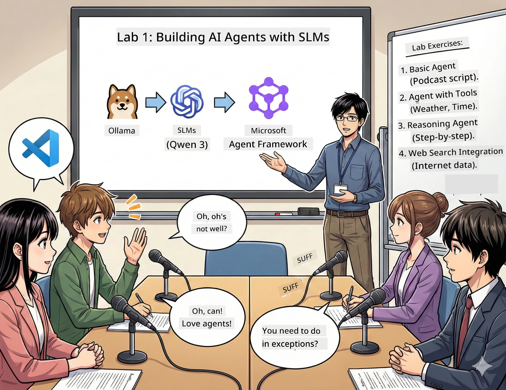

<!--
CO_OP_TRANSLATOR_METADATA:
{
  "original_hash": "7868fa418386aa7167bea3ff5ba8390b",
  "translation_date": "2026-01-05T12:37:34+00:00",
  "source_file": "WorkshopForAgentic/md/01.BuildAIAgentWithSLM.md",
  "language_code": "en"
}
-->
# Act 1: Meet Your AI Research Assistant 🤖

## The Challenge

You're launching "Future Bytes," your new tech podcast. Episode 1 is about the latest AI breakthroughs, but you've got 24 hours to:
1. Research the topic
2. Find credible sources
3. Write a compelling script
4. Make it sound natural

**Plot twist**: You don't have to do it alone. You're about to build your first AI assistant who can help with all of this. Let's call them Alex — your tireless research partner who never needs sleep.

## Why Small Language Models? (Spoiler: They're Awesome)

Think of Small Language Models (SLMs) as your personal AI that lives on *your* computer. No cloud, no monthly fees, no sketchy data sharing.

**Why SLMs are 🔥:**
- **🏠 Runs on Your Machine**: Laptop, desktop, even a beefy Raspberry Pi
- **💸 Zero Ongoing Costs**: No API fees eating your lunch money
- **🔒 Privacy First**: Your data never leaves your device
- **⚡ Lightning Fast**: No internet lag, instant responses
- **🪦 Lightweight**: 1B-10B parameters vs 100B+ for the big guys

**Popular SLMs**: Qwen 3, Phi-4, Gemma 3 (we're using Qwen for this workshop)

## Your Toolkit

### Ollama: Your AI Model Manager

[Ollama](https://ollama.com/) is like Steam for AI models. Download, run, and manage models with simple commands.

**What makes it cool:**
- One command to download and run any model
- Works on Mac, Windows, Linux
- Automatically uses your GPU if you have one
- Super memory-efficient

### Microsoft Agent Framework: Where the Magic Happens

[Microsoft Agent Framework](https://github.com/microsoft/agent-framework) is your playground for building AI agents that can:

- 💬 Chat and remember what you talked about
- 🛠️ Use custom tools (like searching the web or checking weather)
- 🧠 Think through complex problems step-by-step
- 🤝 Work with other agents as a team
- 🔌 Connect to different AI providers (OpenAI, Ollama, Azure)

**The Building Blocks:**
- **Agents**: Your AI assistants with specific jobs
- **Tools**: Special abilities you give them
- **Memory**: So they don't forget your conversation
- **Reasoning**: Teaching them to think, not just respond

## Your Training Montage: 4 Missions

### Mission 1: Create Your First Agent

📓 [Open Notebook](../code/01.BasicAgent/00.BasicAgent-agent.ipynb)

**The Quest**: Build Alex, your podcast scriptwriter AI. Alex needs to generate dialogue between two hosts discussing tech topics.

**What You'll Learn**:
- How to wake up an AI agent (it's easier than waking up on Monday)
- Give it personality and instructions
- Make it generate actual podcast scripts
- Understand what it's saying back to you

**Victory Condition**: Alex creates a script for your "Future Bytes" pilot episode about AI! 🎯

### Mission 2: Give Alex Superpowers (Tools!)

📓 [Open Notebook](../code/01.BasicAgent/01.BasicAgent-tools.ipynb)

**The Quest**: Alex is smart, but it doesn't know today's weather or what time it is. Let's fix that by giving it tools!

**What You'll Learn**:
- Create custom Python functions as "tools"
- Let Alex decide *when* to use which tool
- Watch it autonomously solve problems
- Combine multiple tools for complex tasks

**Victory Condition**: Ask "What's the weather in Tokyo?" and Alex figures it out on its own! ☁️

### Mission 3: Teach Alex to Think

📓 [Open Notebook](../code/01.BasicAgent/02.BasicAgent-reasoning.ipynb)

**The Quest**: Make Alex show its work. When solving problems, you want to see *how* it thinks, not just the answer.

**What You'll Learn**:
- Activate "reasoning mode" (it's like showing your work in math class)
- See Alex's step-by-step thought process
- Understand chain-of-thought prompting
- Debug when Alex gets confused

**Victory Condition**: Ask a tricky math problem and watch Alex think it through! 🧠

### Mission 4: Connect Alex to the Internet

📓 [Open Notebook](../code/01.BasicAgent/03.BasicAgent-websearch.ipynb)

**The Quest**: Alex's knowledge has a cutoff date. Let's connect it to the web for real-time info!

**What You'll Learn**:
- Build a custom web search tool
- Integrate external APIs
- Handle network errors gracefully
- Get info beyond Alex's training data

**Victory Condition**: Ask about today's tech news and get fresh results! 📰

## Before You Start 🚀

**Required Gear**:
- Python 3.10+ installed
- Ollama running (check with `ollama --version`)
- VS Code with Python extension
- At least 8GB RAM (16GB if you want smooth vibes)

## Mission Order

Follow the notebooks in sequence for the full story:

1. [00.BasicAgent-agent.ipynb](../code/01.BasicAgent/00.BasicAgent-agent.ipynb) — Meet Alex (your first agent)
2. [01.BasicAgent-tools.ipynb](../code/01.BasicAgent/01.BasicAgent-tools.ipynb) — Power-up time!
3. [02.BasicAgent-reasoning.ipynb](../code/01.BasicAgent/02.BasicAgent-reasoning.ipynb) — Teach Alex to think
4. [03.BasicAgent-websearch.ipynb](../code/01.BasicAgent/03.BasicAgent-websearch.ipynb) — Internet access unlocked!

## What You'll Master

After Act 1, you'll be able to:

- ✅ Run AI models on your own hardware (no cloud needed!)
- ✅ Build agents with custom personalities and skills
- ✅ Give agents tools to solve real-world problems
- ✅ Make agents show their reasoning process
- ✅ Connect agents to external data sources
- ✅ Debug when things go sideways

## When Things Break (And How to Fix Them) 🔧

### "Alex won't load! Out of memory!"
**The Fix**: Your computer's struggling. Try closing other apps, or switch to a smaller model. 8GB RAM is the bare minimum.

### "Alex is soooo slow"
**The Fix**: Enable GPU acceleration in Ollama settings. Or reduce the context window size. Speed demon mode activated! 🏎️

### "Tools aren't working!"
**The Fix**: Double-check your function signatures. Alex needs proper type hints to understand what the tool does. Think of it like giving clear instructions.

## Helpful Links 🔗

- [Agent Framework Docs](https://github.com/microsoft/agent-framework) — Official guides and examples
- [Ollama Model Library](https://ollama.com/library) — Browse all available models
- [Qwen Model](https://ollama.com/library/qwen3) — Meet your AI's brain
- [Code Examples](https://github.com/microsoft/agent-framework/tree/main/python/samples) — Steal ideas from here

## Next Up: Act 2 🎬

You've got one agent. But what if you had a *team* of agents working together? In Act 2, you'll build your full podcast production crew:
- **Researcher Agent**: Finds the best sources
- **Writer Agent**: Crafts the perfect script  
- **Editor (You!)**: Approves or requests changes

Let's orchestrate some AI magic! → [Act 2: Assemble Your Production Team](02.AIAgentOrchestrationAndWorkflows.md)

---

**Stuck?** Ask questions during the workshop. We're all learning together! 🙌

---

<!-- CO-OP TRANSLATOR DISCLAIMER START -->
**Disclaimer**:
This document has been translated using the AI translation service [Co-op Translator](https://github.com/Azure/co-op-translator). While we strive for accuracy, please be aware that automated translations may contain errors or inaccuracies. The original document in its native language should be considered the authoritative source. For critical information, professional human translation is recommended. We are not liable for any misunderstandings or misinterpretations arising from the use of this translation.
<!-- CO-OP TRANSLATOR DISCLAIMER END -->