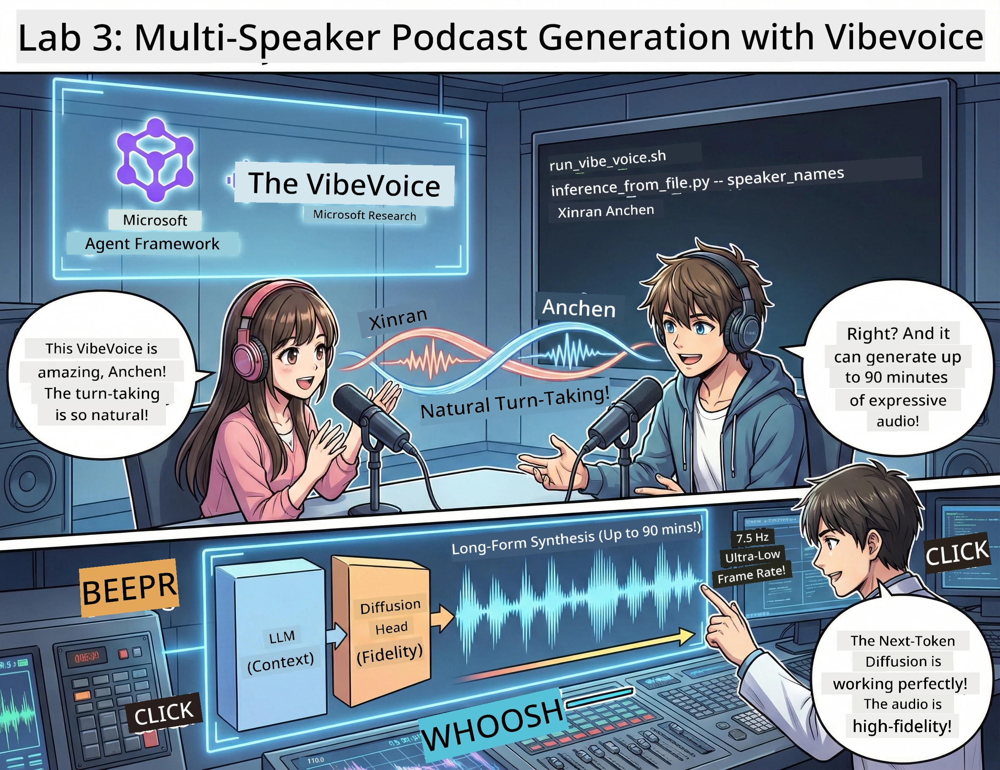

<!--
CO_OP_TRANSLATOR_METADATA:
{
  "original_hash": "bb2a3cf5ebd0ec8211af960a004fc23d",
  "translation_date": "2026-01-05T11:58:55+00:00",
  "source_file": "WorkshopForAgentic/md/03.Multi-SpeakerPodcastGenerationWithVibeVoice.md",
  "language_code": "en"
}
-->
# Act 3: Bring Your Podcast to Life 🎤



## The Grand Finale

You've researched topics. You've written scripts. Now for the cherry on top: turning your text into actual podcast audio with realistic voices!

Enter **VibeVoice** — Microsoft Research's open-source TTS (text-to-speech) magic that creates:
- 🎭 Natural-sounding conversations
- 👥 Multiple speakers (up to 4!)
- ⏱️ Long-form audio (up to 90 minutes!)
- 🎵 Expressive delivery (not robot voices!)

This is the tech behind synthetic podcasts. Let's make yours!

## What's VibeVoice? (The Cool Stuff)

VibeVoice is Microsoft Research's gift to the world. It's specifically designed for podcast-style conversational audio.

### Why It's Awesome 🔥

* **⏱️ Marathon Sessions**: Generates up to 90 minutes of continuous speech (that's a full podcast episode!)
* **👥 Multi-Speaker Magic**: Up to 4 different voices with consistent personalities
* **⚡ Crazy Efficient**: Uses ultra-low 7.5 Hz frame rate to save compute power
* **🧠 Smart Audio**: Combines an LLM (understands context) with a diffusion model (creates realistic audio)
* **🎭 Natural Flow**: Handles turn-taking, pauses, and conversational rhythm automatically

**Translation**: VibeVoice doesn't just read your script — it *performs* it like real people talking.

---

## Before You Start 🚀

**What You Need**:

* 🐍 **Python 3.10+** (you already have this from Acts 1 & 2)
* 🚀 **uv** (a fast Python package manager — we'll install it)
* 📝 **Your Script**: The `podcast.txt` file from Act 2 (in `../03.Application/`)

**Pro Tip**: This step requires a good internet connection for downloading the pre-trained model. Grab a coffee! ☕

---

## Let's Go! The Easy Way 🎬

We've made this stupid simple. One shell script does everything.

### The Process

1. **Make it executable**:
```bash
chmod +x run_vibe_voice.sh
```

2. **Run it**:
```bash
./run_vibe_voice.sh
```

3. **Wait for magic** (this might take a few minutes on first run)

### What Happens Behind the Scenes 🎭

The script is basically your automated sound engineer:

1. **📥 Downloads VibeVoice**: Clones the official repo from GitHub
2. **📦 Installs Dependencies**: Uses `uv pip` for lightning-fast package installation
3. **🎬 Generates Audio**: Runs the inference script with:
   * `--model_path`: The pre-trained VibeVoice-7B model
   * `--txt_path`: Your `podcast.txt` script
   * `--speaker_names`: Assigns voices (Xinran & Anchen by default)

**Result**: Your script becomes a real podcast episode! 🎉

---

## Your Mission 🎯

Let's make this interesting:

### Task 1: Create Content
Edit `../03.Application/podcast.txt` with a conversation between two people. Make it about tech, hobbies, whatever! Just make it conversational.

**Format Example**:
```
Speaker 1: Hey! Did you hear about the new AI model?
Speaker 2: No way! Tell me more!
Speaker 1: It's called...
```

### Task 2: Generate Audio
Run the script and watch the magic happen. First time will take longer (downloading the model).

### Task 3: Listen & Analyze
- Does it sound natural?
- Do the speakers have distinct voices?
- Is the turn-taking smooth?
- Any robotic moments?

### Task 4: Experiment (For the Brave)
Edit `run_vibe_voice.sh` and change `--speaker_names` to try different voice combinations. VibeVoice has multiple pre-trained voices!

**Bonus Challenge**: Try a 3-speaker conversation! 🎆

---

## Learn More 📚

* **🏠 Project Homepage**: [VibeVoice Official Site](https://microsoft.github.io/VibeVoice/)
* **🤗 Pre-trained Model**: [Hugging Face - VibeVoice-7B](https://huggingface.co/vibevoice/VibeVoice-7B)
* **📖 Research Paper**: Dive deep into the tech (if you're into that)

> **⚠️ Responsible AI Reminder**: VibeVoice is powerful. Use it ethically! Don't create deepfakes or misleading content. Create cool stuff that helps people. 🙏

---

## 🏆 Congratulations! You Did It!

You just completed the full pipeline:
1. ✅ **Act 1**: Built AI agents with custom tools
2. ✅ **Act 2**: Orchestrated a multi-agent workflow
3. ✅ **Act 3**: Generated real podcast audio

**You now have**:
- A working AI research assistant
- A full podcast production workflow
- An actual audio file you can share

### What's Next? 🚀

**Launch your podcast!**
- Upload to podcast platforms
- Share on social media
- Iterate and improve

**Keep building!**
- Try different topics
- Experiment with more speakers
- Add background music
- Build a web interface
- Automate the whole thing

**Share your work!**
Tag us! Show the world what you built. The AI podcast revolution starts with you. 🎙️

---

**Questions? Ideas? Success stories?** Drop them in the workshop chat! 

**Welcome to the future of content creation.** 🌟

---

<!-- CO-OP TRANSLATOR DISCLAIMER START -->
**Disclaimer**:
This document has been translated using the AI translation service [Co-op Translator](https://github.com/Azure/co-op-translator). While we strive for accuracy, please be aware that automated translations may contain errors or inaccuracies. The original document in its native language should be considered the authoritative source. For critical information, professional human translation is recommended. We are not liable for any misunderstandings or misinterpretations arising from the use of this translation.
<!-- CO-OP TRANSLATOR DISCLAIMER END -->