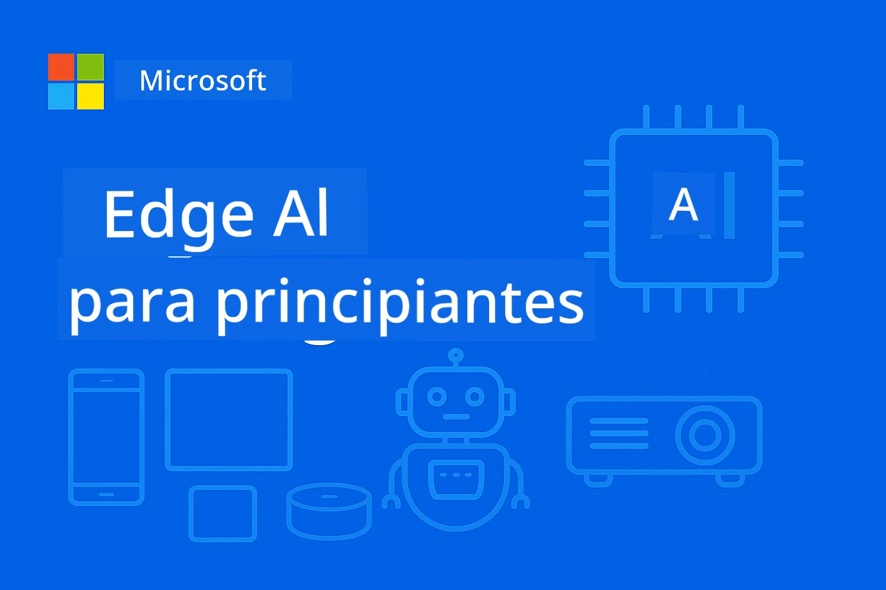

# EdgeAI para Principiantes 




[](https://GitHub.com/microsoft/edgeai-for-beginners/graphs/contributors)
[](https://GitHub.com/microsoft/edgeai-for-beginners/issues)
[](https://GitHub.com/microsoft/edgeai-for-beginners/pulls)
[](http://makeapullrequest.com)

[](https://GitHub.com/microsoft/edgeai-for-beginners/watchers)
[](https://GitHub.com/microsoft/edgeai-for-beginners/fork)
[](https://GitHub.com/microsoft/edgeai-for-beginners/stargazers)


[](https://discord.gg/nTYy5BXMWG)

Sigue estos pasos para comenzar a usar estos recursos:

1. **Haz un fork del repositorio**: Haz clic en [](https://GitHub.com/microsoft/edgeai-for-beginners/fork)
2. **Clona el repositorio**:   `git clone https://github.com/microsoft/edgeai-for-beginners.git`
3. [**Únete al Discord de Azure AI Foundry para conocer expertos y desarrolladores**](https://discord.com/invite/ByRwuEEgH4)


### 🌐 Soporte Multilingüe

#### Soportado vía GitHub Action (Automatizado y siempre actualizado)

<!-- CO-OP TRANSLATOR LANGUAGES TABLE START -->
[Árabe](../ar/README.md) | [Bengalí](../bn/README.md) | [Búlgaro](../bg/README.md) | [Birmano (Myanmar)](../my/README.md) | [Chino (Simplificado)](../zh-CN/README.md) | [Chino (Tradicional, Hong Kong)](../zh-HK/README.md) | [Chino (Tradicional, Macao)](../zh-MO/README.md) | [Chino (Tradicional, Taiwán)](../zh-TW/README.md) | [Croata](../hr/README.md) | [Checo](../cs/README.md) | [Danés](../da/README.md) | [Neerlandés](../nl/README.md) | [Estonio](../et/README.md) | [Finlandés](../fi/README.md) | [Francés](../fr/README.md) | [Alemán](../de/README.md) | [Griego](../el/README.md) | [Hebreo](../he/README.md) | [Hindi](../hi/README.md) | [Húngaro](../hu/README.md) | [Indonesio](../id/README.md) | [Italiano](../it/README.md) | [Japonés](../ja/README.md) | [Kannada](../kn/README.md) | [Coreano](../ko/README.md) | [Lituano](../lt/README.md) | [Malayo](../ms/README.md) | [Malayalam](../ml/README.md) | [Maratí](../mr/README.md) | [Nepalí](../ne/README.md) | [Pidgin Nigeriano](../pcm/README.md) | [Noruego](../no/README.md) | [Persa (Farsi)](../fa/README.md) | [Polaco](../pl/README.md) | [Portugués (Brasil)](../pt-BR/README.md) | [Portugués (Portugal)](../pt-PT/README.md) | [Punyabí (Gurmukhi)](../pa/README.md) | [Rumano](../ro/README.md) | [Ruso](../ru/README.md) | [Serbio (Cirílico)](../sr/README.md) | [Eslovaco](../sk/README.md) | [Esloveno](../sl/README.md) | [Español](./README.md) | [Swahili](../sw/README.md) | [Sueco](../sv/README.md) | [Tagalo (Filipino)](../tl/README.md) | [Tamil](../ta/README.md) | [Telugu](../te/README.md) | [Tailandés](../th/README.md) | [Turco](../tr/README.md) | [Ucraniano](../uk/README.md) | [Urdu](../ur/README.md) | [Vietnamita](../vi/README.md)

> **¿Prefieres clonar localmente?**

> Este repositorio incluye traducciones en más de 50 idiomas, lo cual aumenta significativamente el tamaño de la descarga. Para clonar sin traducciones, utiliza sparse checkout:
> ```bash
> git clone --filter=blob:none --sparse https://github.com/microsoft/edgeai-for-beginners.git
> cd edgeai-for-beginners
> git sparse-checkout set --no-cone '/*' '!translations' '!translated_images'
> ```
> Esto te da todo lo necesario para completar el curso con una descarga mucho más rápida.
<!-- CO-OP TRANSLATOR LANGUAGES TABLE END -->

**Si deseas que se incluyan idiomas de traducción adicionales, están listados [aquí](https://github.com/Azure/co-op-translator/blob/main/getting_started/supported-languages.md)**
## Introducción

Bienvenido a **EdgeAI para Principiantes** – tu recorrido completo hacia el mundo transformador de la Inteligencia Artificial en el borde (Edge). Este curso cierra la brecha entre capacidades potentes de IA y su despliegue práctico en dispositivos edge, permitiéndote aprovechar el potencial de la IA directamente donde se genera la data y donde se deben tomar decisiones.

### Lo que dominarás

Este curso te lleva desde conceptos fundamentales hasta implementaciones listas para producción, cubriendo:
- **Modelos Pequeños de Lenguaje (SLMs)** optimizados para despliegue en el borde
- **Optimización consciente del hardware** en diversas plataformas
- **Inferencia en tiempo real** con capacidades de preservación de privacidad
- **Estrategias de despliegue en producción** para aplicaciones empresariales

### Por qué EdgeAI es importante

Edge AI representa un cambio de paradigma que aborda desafíos modernos críticos:
- **Privacidad y Seguridad**: Procesa datos sensibles localmente sin exponerlos a la nube
- **Rendimiento en tiempo real**: Elimina latencias de red para aplicaciones sensibles al tiempo
- **Eficiencia en costos**: Reduce ancho de banda y gastos en computación en la nube
- **Operaciones resilientes**: Mantiene la funcionalidad durante cortes de red
- **Cumplimiento regulatorio**: Cumple requisitos de soberanía de datos

### Edge AI

Edge AI se refiere a ejecutar algoritmos de IA y modelos de lenguaje localmente en hardware, cerca del lugar donde se genera la data, sin depender de recursos en la nube para la inferencia. Reduce latencia, mejora la privacidad y permite la toma de decisiones en tiempo real.

### Principios básicos:
- **Inferencia en dispositivo**: Modelos de IA que se ejecutan en dispositivos edge (teléfonos, routers, microcontroladores, PCs industriales)
- **Capacidad offline**: Funciona sin conexión persistente a internet
- **Baja latencia**: Respuestas inmediatas apropiadas para sistemas en tiempo real
- **Soberanía de datos**: Mantiene los datos sensibles localmente, mejorando seguridad y cumplimiento

### Modelos Pequeños de Lenguaje (SLMs)

SLMs como Phi-4, Mistral-7B y Gemma son versiones optimizadas de LLMs más grandes — entrenados o destilados para:
- **Menor uso de memoria**: Uso eficiente de la memoria limitada en dispositivos edge
- **Menor demanda de cómputo**: Optimizado para CPUs y GPUs edge
- **Tiempos de inicio más rápidos**: Inicialización veloz para aplicaciones reactivas

Desbloquean capacidades poderosas de PLN mientras cumplen las limitaciones de:
- **Sistemas embebidos**: Dispositivos IoT y controladores industriales
- **Dispositivos móviles**: Smartphones y tabletas con capacidades offline
- **Dispositivos IoT**: Sensores y dispositivos inteligentes con recursos limitados
- **Servidores edge**: Unidades locales con recursos GPU limitados
- **Computadoras personales**: Escenarios de despliegue en escritorio y laptop

## Módulos del Curso y Navegación

| Módulo | Tema | Área de enfoque | Contenido clave | Nivel | Duración |
|--------|-------|------------|-------------|--------|----------|
| [📖 00 ](./introduction.md) | [Introducción a EdgeAI](./introduction.md) | Fundamentos y contexto | Visión general de EdgeAI • Aplicaciones industriales • Introducción a SLM • Objetivos de aprendizaje | Principiante | 1-2 hrs |
| [📚 01](../../Module01) | [Fundamentos de EdgeAI](./Module01/README.md) | Comparación Nube vs Edge AI | Fundamentos de EdgeAI • Casos reales • Guía de implementación • Despliegue en Edge | Principiante | 3-4 hrs |
| [🧠 02](../../Module02) | [Fundamentos de Modelo SLM](./Module02/README.md) | Familias y arquitectura | Familia Phi • Familia Qwen • Familia Gemma • BitNET • μModel • Phi-Silica | Principiante | 4-5 hrs |
| [🚀 03](../../Module03) | [Práctica de Despliegue SLM](./Module03/README.md) | Despliegue local y en la nube | Aprendizaje avanzado • Entorno local • Despliegue en nube | Intermedio | 4-5 hrs |
| [⚙️ 04](../../Module04) | [Kit de herramientas para Optimización de Modelos](./Module04/README.md) | Optimización multiplataforma | Introducción • Llama.cpp • Microsoft Olive • OpenVINO • Apple MLX • Síntesis de flujo de trabajo | Intermedio | 5-6 hrs |
| [🔧 05](../../Module05) | [SLMOps en Producción](./Module05/README.md) | Operaciones de producción | Introducción a SLMOps • Destilación de modelos • Ajuste fino • Despliegue en producción | Avanzado | 5-6 hrs |
| [🤖 06](../../Module06) | [Agentes de IA y llamadas a funciones](./Module06/README.md) | Frameworks de agentes y MCP | Introducción a agentes • Llamadas a funciones • Protocolo de contexto de modelos | Avanzado | 4-5 hrs |
| [💻 07](../../Module07) | [Implementación en plataformas](./Module07/README.md) | Muestras multiplataforma | Kit de herramientas AI • Foundry Local • Desarrollo en Windows | Avanzado | 3-4 hrs |
| [🏭 08](../../Module08) | [Kit de herramientas Foundry Local](./Module08/README.md) | Ejemplos listos para producción | Aplicaciones de muestra (ver detalles abajo) | Experto | 8-10 hrs |

### 🏭 **Módulo 08: Aplicaciones de muestra**

- [01: Inicio rápido con Chat REST](./Module08/samples/01/README.md)
- [02: Integración con SDK de OpenAI](./Module08/samples/02/README.md)
- [03: Descubrimiento y Benchmarking de modelos](./Module08/samples/03/README.md)
- [04: Aplicación Chainlit RAG](./Module08/samples/04/README.md)
- [05: Orquestación Multi-Agente](./Module08/samples/05/README.md)
- [06: Enrutador Modelos-como-Herramientas](./Module08/samples/06/README.md)
- [07: Cliente Directo API](./Module08/samples/07/README.md)
- [08: Aplicación Chat Windows 11](./Module08/samples/08/README.md)
- [09: Sistema Multi-Agente Avanzado](./Module08/samples/09/README.md)
- [10: Framework Foundry Tools](./Module08/samples/10/README.md)

### 🎓 **Taller: Ruta práctica de aprendizaje**

Materiales completos para talleres prácticos con implementaciones listas para producción:

- **[Guía del Taller](./Workshop/Readme.md)** - Objetivos de aprendizaje, resultados y navegación de recursos
- **Ejemplos en Python** (6 sesiones) - Actualizados con mejores prácticas, manejo de errores y documentación completa
- **Jupyter Notebooks** (8 interactivos) - Tutoriales paso a paso con benchmarks y monitoreo de rendimiento
- **Guías de sesión** - Guías detalladas en markdown para cada sesión del taller
- **Herramientas de Validación** - Scripts para verificar la calidad del código y realizar pruebas básicas

**Lo que construirás:**
- Aplicaciones de chat AI locales con soporte de streaming
- Pipelines RAG con evaluación de calidad (RAGAS)
- Herramientas de benchmarking y comparación multi-modelo
- Sistemas de orquestación multi-agente
- Enrutamiento inteligente de modelos con selección basada en tareas

### 🎙️ **Taller para Agentic: Práctico - El Estudio de Podcast de IA**

¡Construye una pipeline de producción de podcast impulsada por IA desde cero! Este taller inmersivo te enseña a crear un sistema multi-agente completo que transforma ideas en episodios profesionales de podcast.
**[🎬 Comienza el Taller de AI Podcast Studio](./WorkshopForAgentic/README.md)**

**Tu Misión**: Lanza "Future Bytes" — un podcast tecnológico impulsado totalmente por agentes de IA que construirás tú mismo. Sin dependencias en la nube, sin costos de API — todo se ejecuta localmente en tu máquina.

**Lo Que Lo Hace Único:**
- **🤖 Orquestación Real Multi-Agente** - Construye agentes de IA especializados que investigan, escriben y producen audio
- **🎯 Canal Completo de Producción** - Desde la selección del tema hasta la salida final del audio del podcast
- **💻 Despliegue 100% Local** - Usa Ollama y modelos locales (Qwen-3-8B) para total privacidad y control
- **🎤 Integración de Texto a Voz** - Transforma guiones en conversaciones naturales con múltiples voces
- **✋ Flujos de Trabajo con Intervención Humana** - Puertas de aprobación que aseguran calidad al mantener la automatización

**Viaje de Aprendizaje en Tres Actos:**

| Acto | Enfoque | Habilidades Clave | Duración |
|-----|-------|------------|----------|
| **[Acto 1: Conoce a Tus Asistentes de IA](./WorkshopForAgentic/md/01.BuildAIAgentWithSLM.md)** | Construye tu primer agente de IA | Integración de herramientas • Búsqueda web • Resolución de problemas • Razonamiento agente | 2-3 hrs |
| **[Acto 2: Arma Tu Equipo de Producción](./WorkshopForAgentic/md/02.AIAgentOrchestrationAndWorkflows.md)** | Orquesta múltiples agentes | Coordinación de equipo • Flujos de aprobación • Interfaz DevUI • Supervisión humana | 3-4 hrs |
| **[Acto 3: Da Vida a Tu Podcast](./WorkshopForAgentic/md/03.Multi-SpeakerPodcastGenerationWithVibeVoice.md)** | Genera audio para podcast | Texto a voz • Síntesis multivoz • Audio de formato largo • Automatización completa | 2-3 hrs |

**Tecnologías Utilizadas:**
- **Microsoft Agent Framework** - Orquestación y coordinación multi-agente
- **Ollama** - Entorno de ejecución de modelos AI locales (sin nube requerida)
- **Qwen-3-8B** - Modelo de lenguaje de código abierto optimizado para tareas de agente
- **APIs de Texto a Voz** - Síntesis de voz natural para generación de podcasts

**Soporte de Hardware:**
- ✅ **Modo CPU** - Funciona en cualquier computadora moderna (se recomienda 8GB+ RAM)
- 🚀 **Aceleración GPU** - Inferencia significativamente más rápida con GPUs NVIDIA/AMD
- ⚡ **Soporte NPU** - Aceleración con unidad de procesamiento neural de próxima generación

**Perfecto Para:**
- Desarrolladores que aprenden sistemas multi-agente de IA
- Cualquiera interesado en automatización de IA y flujos de trabajo
- Creadores de contenido explorando producción asistida por IA
- Estudiantes que estudian patrones prácticos de orquestación IA

**Comienza a Construir**: [🎙️ Taller AI Podcast Studio →](./WorkshopForAgentic/README.md)

### 📊 **Resumen del Camino de Aprendizaje**
- **Duración Total**: 36-45 horas
- **Camino para Principiantes**: Módulos 01-02 (7-9 horas)  
- **Camino Intermedio**: Módulos 03-04 (9-11 horas)
- **Camino Avanzado**: Módulos 05-07 (12-15 horas)
- **Camino Experto**: Módulo 08 (8-10 horas)

## Lo Que Construirás

### 🎯 Competencias Clave
- **Arquitectura Edge AI**: Diseñar sistemas IA primero locales con integración en la nube
- **Optimización de Modelos**: Cuantizar y comprimir modelos para despliegue en edge (mejora de velocidad del 85%, reducción de tamaño del 75%)
- **Despliegue Multi-Plataforma**: Windows, móvil, embebidos y sistemas híbridos nube-edge
- **Operaciones de Producción**: Monitoreo, escalado y mantenimiento de IA edge en producción

### 🏗️ Proyectos Prácticos
- **Apps Locales Foundry Chat**: Aplicación nativa para Windows 11 con cambio de modelos
- **Sistemas Multi-Agente**: Coordinador con agentes especialistas para flujos complejos  
- **Aplicaciones RAG**: Procesamiento local de documentos con búsqueda vectorial
- **Enrutadores de Modelos**: Selección inteligente entre modelos basada en análisis de tareas
- **Frameworks API**: Clientes listos para producción con streaming y monitoreo de salud
- **Herramientas Cross-Platform**: Patrones de integración LangChain/Semantic Kernel

### 🏢 Aplicaciones en la Industria
**Manufactura** • **Salud** • **Vehículos Autónomos** • **Ciudades Inteligentes** • **Apps Móviles**

## Inicio Rápido

**Camino de Aprendizaje Recomendado** (20-30 horas en total):

0. **📖 Introducción** ([Introduction.md](./introduction.md)): Fundamentos de EdgeAI + contexto industrial + marco de aprendizaje
1. **📚 Fundamentos** (Módulos 01-02): Conceptos de EdgeAI + familias de modelos SLM
2. **⚙️ Optimización** (Módulos 03-04): Despliegue + frameworks de cuantización  
3. **🚀 Producción** (Módulos 05-06): SLMOps + agentes IA + funciones de llamada
4. **💻 Implementación** (Módulos 07-08): Muestras de plataforma + toolkit Foundry Local

Cada módulo incluye teoría, ejercicios prácticos y ejemplos de código listos para producción.

## Impacto en la Carrera

**Roles Técnicos**: Arquitecto de Soluciones EdgeAI • Ingeniero ML (Edge) • Desarrollador AI IoT • Desarrollador AI Móvil

**Sectores Industriales**: Manufactura 4.0 • Tecnología de Salud • Sistemas Autónomos • FinTech • Electrónica de Consumo

**Proyectos en Portafolio**: Sistemas multi-agente • Apps RAG en producción • Despliegue multiplataforma • Optimización del rendimiento

## Estructura del Repositorio

```
edgeai-for-beginners/
├── 📖 introduction.md  # Foundation: EdgeAI Overview & Learning Framework
├── 📚 Module01-04/     # Fundamentals → SLMs → Deployment → Optimization  
├── 🔧 Module05-06/     # SLMOps → AI Agents → Function Calling
├── 💻 Module07/        # Platform Samples (VS Code, Windows, Jetson, Mobile)
├── 🏭 Module08/        # Foundry Local Toolkit + 10 Comprehensive Samples
│   ├── samples/01-06/  # Foundation: REST, SDK, RAG, Agents, Routing
│   └── samples/07-10/  # Advanced: API Client, Windows App, Enterprise Agents, Tools
├── 🌐 translations/    # Multi-language support (8+ languages)
└── 📋 STUDY_GUIDE.md   # Structured learning paths & time allocation
```

## Aspectos Destacados del Curso

✅ **Aprendizaje Progresivo**: Teoría → Práctica → Despliegue en producción  
✅ **Casos Reales**: Microsoft, Japan Airlines, implementaciones empresariales  
✅ **Ejemplos Prácticos**: Más de 50 ejemplos, 10 demos completas Foundry Local  
✅ **Enfoque en Rendimiento**: Mejoras del 85% en velocidad, reducción del 75% en tamaño  
✅ **Multi-Plataforma**: Windows, móvil, embebidos, híbrido nube-edge  
✅ **Listo para Producción**: Monitoreo, escalado, seguridad, marcos de cumplimiento

📖 **[Guía de Estudio Disponible](STUDY_GUIDE.md)**: Camino de aprendizaje estructurado de 20 horas con guía de tiempo y herramientas de autoevaluación.

---

**EdgeAI representa el futuro del despliegue de IA**: local primero, preservación de la privacidad y eficiencia. Domina estas habilidades para construir la próxima generación de aplicaciones inteligentes.

## Otros Cursos

¡Nuestro equipo produce otros cursos! Revisa:

<!-- CO-OP TRANSLATOR OTHER COURSES START -->
### LangChain
[](https://aka.ms/langchain4j-for-beginners)
[](https://aka.ms/langchainjs-for-beginners?WT.mc_id=m365-94501-dwahlin)
[](https://github.com/microsoft/langchain-for-beginners?WT.mc_id=m365-94501-dwahlin)
---

### Azure / Edge / MCP / Agentes
[](https://github.com/microsoft/AZD-for-beginners?WT.mc_id=academic-105485-koreyst)
[](https://github.com/microsoft/edgeai-for-beginners?WT.mc_id=academic-105485-koreyst)
[](https://github.com/microsoft/mcp-for-beginners?WT.mc_id=academic-105485-koreyst)
[](https://github.com/microsoft/ai-agents-for-beginners?WT.mc_id=academic-105485-koreyst)

---
 
### Serie de IA Generativa
[](https://github.com/microsoft/generative-ai-for-beginners?WT.mc_id=academic-105485-koreyst)
[-9333EA?style=for-the-badge&labelColor=E5E7EB&color=9333EA)](https://github.com/microsoft/Generative-AI-for-beginners-dotnet?WT.mc_id=academic-105485-koreyst)
[-C084FC?style=for-the-badge&labelColor=E5E7EB&color=C084FC)](https://github.com/microsoft/generative-ai-for-beginners-java?WT.mc_id=academic-105485-koreyst)
[-E879F9?style=for-the-badge&labelColor=E5E7EB&color=E879F9)](https://github.com/microsoft/generative-ai-with-javascript?WT.mc_id=academic-105485-koreyst)

---
 
### Aprendizaje Básico
[](https://aka.ms/ml-beginners?WT.mc_id=academic-105485-koreyst)
[](https://aka.ms/datascience-beginners?WT.mc_id=academic-105485-koreyst)
[](https://aka.ms/ai-beginners?WT.mc_id=academic-105485-koreyst)
[](https://github.com/microsoft/Security-101?WT.mc_id=academic-96948-sayoung)
[](https://aka.ms/webdev-beginners?WT.mc_id=academic-105485-koreyst)
[](https://aka.ms/iot-beginners?WT.mc_id=academic-105485-koreyst)
[](https://github.com/microsoft/xr-development-for-beginners?WT.mc_id=academic-105485-koreyst)

---
 
### Serie Copilot

[](https://aka.ms/GitHubCopilotAI?WT.mc_id=academic-105485-koreyst)
[](https://github.com/microsoft/mastering-github-copilot-for-dotnet-csharp-developers?WT.mc_id=academic-105485-koreyst)
[](https://github.com/microsoft/CopilotAdventures?WT.mc_id=academic-105485-koreyst)
<!-- CO-OP TRANSLATOR OTHER COURSES END -->

## Obtener ayuda

Si te quedas atascado o tienes alguna pregunta sobre cómo crear aplicaciones de IA, únete a:

[](https://discord.gg/nTYy5BXMWG)

Si tienes comentarios sobre el producto o errores mientras desarrollas, visita:

[](https://aka.ms/foundry/forum)

---

<!-- CO-OP TRANSLATOR DISCLAIMER START -->
**Aviso Legal**:
Este documento ha sido traducido utilizando el servicio de traducción automática [Co-op Translator](https://github.com/Azure/co-op-translator). Aunque nos esforzamos por la precisión, tenga en cuenta que las traducciones automáticas pueden contener errores o inexactitudes. El documento original en su idioma nativo debe considerarse la fuente autorizada. Para información crítica, se recomienda una traducción profesional realizada por un humano. No nos responsabilizamos por malentendidos o interpretaciones erróneas derivadas del uso de esta traducción.
<!-- CO-OP TRANSLATOR DISCLAIMER END -->