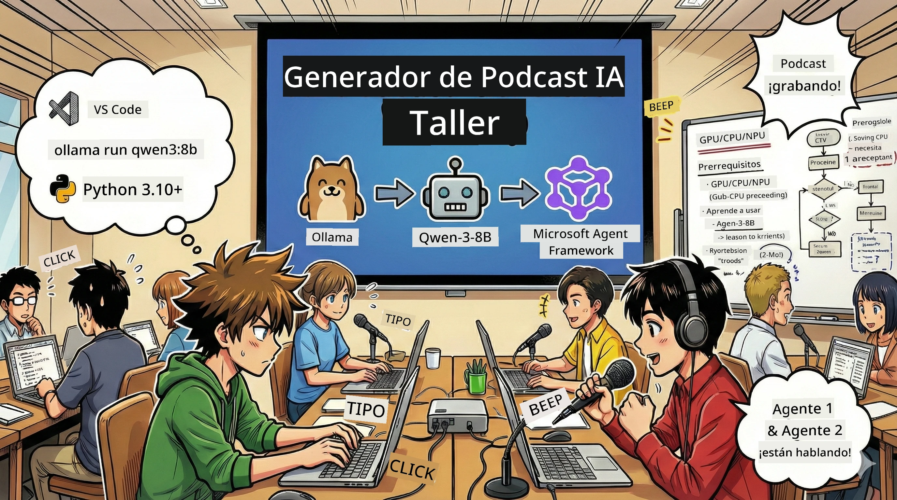
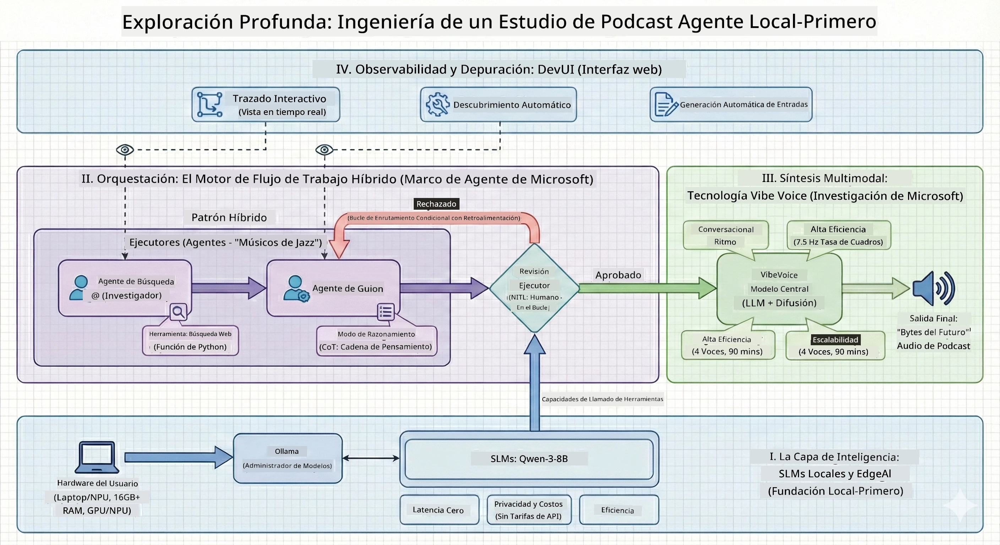

# 🎙️ El Taller de The AI Podcast Studio

> 🌏 [中文版 (Versión en chino)](translation/zh-cn/README.md)



## Tu Misión

¡Bienvenido a **The AI Podcast Studio**! Estás a punto de lanzar tu propio podcast tecnológico llamado "Future Bytes", pero aquí está el giro: construirás un equipo de producción impulsado por IA que te ayudará a crearlo. No más horas infinitas de investigación, redacción de guiones y edición de audio. En su lugar, programarás para convertirte en un productor de podcast con superpoderes de IA.

## La Historia

Imagina esto: Tú y tus amigos quieren empezar un podcast sobre las tendencias tecnológicas más geniales, pero todos están ocupados con la escuela, el trabajo o la vida en general. ¿Qué pasaría si pudieras construir un equipo de agentes de IA que hicieran el trabajo pesado? Un agente investiga temas, otro escribe guiones atractivos, y un tercero convierte texto en conversaciones de sonido natural. ¿Suena a ciencia ficción? Hagámoslo realidad.

## Lo que Aprenderás

Al final de este taller, sabrás cómo:
- 🤖 Desplegar tu propio modelo de IA local (¡sin costos de API, sin dependencia en la nube!)
- 🔧 Construir agentes de IA especializados que realmente trabajen en equipo
- 🎬 Crear una cadena completa de producción de podcast desde la idea hasta el audio

## Tu Viaje: Tres Actos



Como en toda buena historia, tenemos tres actos. Cada uno construye tu estudio de podcast de IA pieza por pieza:

| Episodio | Tu Misión | Qué Ocurre | Habilidades Desbloqueadas |
|---------|-----------|--------------|----------------|
| **Acto 1** | [Conoce a tus Asistentes de IA](md/01.BuildAIAgentWithSLM.md) | Descubres cómo crear agentes de IA que pueden chatear, buscar en la web e incluso resolver problemas. Piensa en ellos como tus pasantes de investigación que nunca duermen. | 🎯 Crea tu primer agente<br>🛠️ Dale superpoderes (¡herramientas!)<br>🧠 Enséñale a pensar<br>🌐 Conéctalo a internet |
| **Acto 2** | [Arma tu Equipo de Producción](md/02.AIAgentOrchestrationAndWorkflows.md) | ¡Ahora la cosa se pone interesante! Orquestarás múltiples agentes de IA para que trabajen juntos como un verdadero equipo de podcast. Uno investiga, otro escribe, tú apruebas — el trabajo en equipo hace el sueño realidad. | 🎭 Coordina múltiples agentes<br>🔄 Construye flujos de aprobación<br>🖥️ Prueba con la interfaz DevUI<br>✋ Mantén a los humanos en control |
| **Acto 3** | [Da Vida a tu Podcast](md/03.Multi-SpeakerPodcastGenerationWithVibeVoice.md) | ¡El gran final! Transforma tus guiones de texto en audio real de podcast con voces realistas y conversaciones naturales. ¡Tu podcast "Future Bytes" está listo para salir al aire! | 🎤 Magia de texto a voz<br>👥 Voces multihablantes<br>⏱️ Audio de formato largo<br>🚀 Automatización completa |

Cada acto desbloquea nuevas habilidades. Salta si eres valiente, pero recomendamos seguir la historia.

## Requisitos del Entorno

Este taller soporta varios entornos de hardware:
- **CPU**: Adecuado para pruebas y uso a pequeña escala
- **GPU**: Recomendado para entornos de producción, mejora significativamente la velocidad de inferencia
- **NPU**: Soporta aceleración con unidades de procesamiento neuronal de próxima generación

## Lo que Necesitarás

### Lista de Software ✅
- **Python 3.10+** (Tu lenguaje de programación)
- **Ollama** (Ejecuta modelos de IA en tu máquina)
- **VS Code** (Tu editor de código)
- **Extensión de Python** (Para que VS Code sea más inteligente)
- **Git** (Para obtener el código)

### Revisión de Hardware 💻
- **¿Puedo correr esto?**: 8GB RAM, 10GB de espacio libre (funciona, pero puede ser lento)
- **Configuración ideal**: 16GB+ RAM, una GPU decente (¡navegación fluida!)
- **¿Tienes un NPU?**: ¡Mucho mejor! Rendimiento de próxima generación desbloqueado 🚀

## Configura Tu Estudio 🎬

### Paso 1: Potencia Python

Asegúrate de tener Python 3.10 o superior:

```bash
python --version
# Debe mostrar Python 3.10.x o superior
```

¿No tienes Python? Descárgalo en [python.org](https://python.org) — ¡es gratis!

### Paso 2: Consigue Ollama (Tu motor para modelos de IA)

Ve a [ollama.ai](https://ollama.ai) y descarga Ollama para tu sistema operativo. Piénsalo como el motor que ejecuta tus modelos de IA localmente.

Verifica si está listo:

```bash
ollama --version
```

### Paso 3: Descarga tu Cerebro de IA 🧠

Hora de obtener el modelo Qwen-3-8B (es como contratar a tu primer asistente de IA):

```bash
ollama pull qwen3:8b
```

*Esto puede tardar algunos minutos. ¡Momento perfecto para un descanso con café! ☕*

### Paso 4: Configura VS Code

Instala [Visual Studio Code](https://code.visualstudio.com/) si no lo tienes. Es el mejor editor de código (discútelo si quieres 😄).

### Paso 5: Extensión de Python

En VS Code:
1. Presiona `Ctrl+Shift+X` (o `Cmd+Shift+X` en Mac)
2. Busca "Python"
3. Instala la extensión oficial de Python de Microsoft

### Paso 6: ¡Estás Listo! 🎉

En serio, ya estás listo para empezar. ¡Vamos a crear algo de magia con IA!

### Paso 7: Instala Microsoft Agent Framework y Paquetes Relacionados 📦

Instala todas las dependencias necesarias para el taller:

```bash
pip install -r ./Installations/requirements.txt -U
```

*Esto instalará Microsoft Agent Framework y todos los paquetes necesarios. Toma un café — ¡la primera configuración puede tomar algunos minutos! ☕*

## Instrucciones del Taller

La estructura detallada del proyecto, pasos de configuración y métodos de ejecución se explicarán paso a paso durante el taller.

## Solución de Problemas (Cuando Algo Va Mal) 🔧

### "¡Ugh, la descarga del modelo está tardando una eternidad!"
**Solución**: Usa una VPN o configura Ollama con una fuente espejo. A veces internet simplemente no coopera.

### "¡Mi computadora se está muriendo! ¡Sin memoria!"
**Solución**: Cambia a un modelo más pequeño o ajusta el parámetro `num_ctx` para usar menos memoria. Es como poner a tu IA a dieta.

### "¿Puedo acelerar esto con mi GPU?"
**Solución**: ¡Ollama detecta GPUs automáticamente! Solo asegúrate de que los controladores de tu GPU estén actualizados. ¡Boost de velocidad gratis! 🏎️

## Recursos Extra (Para los Curiosos) 📚

- [Documentación Ollama](https://github.com/ollama/ollama) — Profundiza en modelos de IA locales
- [Microsoft Agent Framework](https://microsoft.github.io/autogen/) — Aprende más sobre la construcción de equipos de agentes
- [Información del Modelo Qwen](https://qwenlm.github.io/) — Conoce el cerebro de tu asistente de IA

## Licencia

Licencia MIT — ¡Crea cosas geniales, compártelas, mejora el mundo! 🌍

## ¿Quieres Contribuir?

¿Encontraste un error? ¿Tienes una idea? ¡Deja un Issue o un PR! Nos encanta la vibra comunitaria. ✨

---

<!-- CO-OP TRANSLATOR DISCLAIMER START -->
**Aviso Legal**:
Este documento ha sido traducido utilizando el servicio de traducción automática [Co-op Translator](https://github.com/Azure/co-op-translator). Aunque nos esforzamos por la precisión, tenga en cuenta que las traducciones automatizadas pueden contener errores o inexactitudes. El documento original en su idioma nativo debe considerarse la fuente autorizada. Para información crítica, se recomienda la traducción profesional realizada por humanos. No nos hacemos responsables de ningún malentendido o interpretación errónea derivada del uso de esta traducción.
<!-- CO-OP TRANSLATOR DISCLAIMER END -->