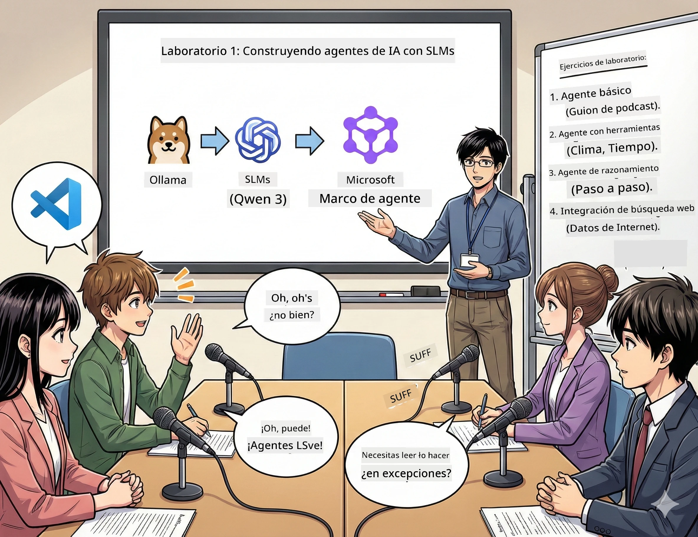

# Acto 1: Conoce a tu asistente de investigación AI 🤖

## Desafío

Estás lanzando "Bytes del Futuro", tu nuevo pódcast de tecnología. El primer episodio trata sobre los últimos avances en AI, pero solo tienes 24 horas para:
1. Investigar el tema
2. Encontrar fuentes confiables
3. Escribir un guion cautivador
4. Hacer que suene natural

**Giro inesperado**: No tienes que hacerlo solo. Estás a punto de crear tu primer asistente AI, que puede ayudarte con todo esto. Lo llamaremos Alex — tu compañero de investigación incansable, que nunca necesita dormir.

## ¿Por qué elegir modelos de lenguaje pequeños? (Spoiler: Son geniales)

Piensa en los modelos de lenguaje pequeños (SLM) como IA personal que corre *en tu* computadora. Sin nube, sin tarifas mensuales, sin compartir datos cuestionables.

**Por qué los SLM son tan 🔥:**
- **🏠 Corren en tu propia máquina**: portátil, escritorio, o incluso una Raspberry Pi potente
- **💸 Cero costos continuos**: sin tarifas de API comiendo tu presupuesto
- **🔒 Privacidad ante todo**: tus datos nunca salen de tu dispositivo
- **⚡ Velocidad relámpago**: sin latencia de red, respuesta instantánea
- **🪦 Livianos**: mil millones a diez mil millones de parámetros frente a cientos de miles de millones de los grandes modelos

**SLM populares**: Qwen 3, Phi-4, Gemma 3 (usaremos Qwen en este taller)

## Tu kit de herramientas

### Ollama: Tu gestor de modelos AI

[Ollama](https://ollama.com/) es como Steam para modelos AI. Descarga, ejecuta y administra modelos con comandos simples.

**Lo genial:**
- Un comando para descargar y ejecutar cualquier modelo
- Compatible con Mac, Windows, Linux
- Detecta y usa GPU si tienes una
- Súper eficiente con la memoria

### Microsoft Agent Framework: Donde ocurre la magia

[Microsoft Agent Framework](https://github.com/microsoft/agent-framework) es tu parque de diversiones para construir agentes AI que pueden:

- 💬 Chatear y recordar lo que han hablado contigo
- 🛠️ Usar herramientas personalizadas (buscar en la web o consultar el clima)
- 🧠 Pensar paso a paso en problemas complejos
- 🤝 Colaborar en equipo con otros agentes
- 🔌 Conectarse a distintos proveedores AI (OpenAI, Ollama, Azure)

**Componentes clave:**
- **Agentes (Agents)**: asistentes AI con tareas específicas
- **Herramientas (Tools)**: habilidades especiales que les das
- **Memoria (Memory)**: para que no olviden tus conversaciones
- **Razonamiento (Reasoning)**: para enseñarles a pensar, no sólo responder

## Tu montaje de entrenamiento: 4 tareas

### Tarea 1: Crea tu primer agente inteligente

📓 [Abre el Notebook](../../code/01.BasicAgent/00.BasicAgent-agent.ipynb)

**Tarea**: Construye a Alex, tu AI guionista de pódcast. Alex debe crear una conversación entre dos anfitriones discutiendo temas tecnológicos.

**Aprenderás:**
- Cómo activar un agente AI (más fácil que levantarte un lunes)
- Darle personalidad e instrucciones
- Generar un guion realista para tu pódcast
- Comprender sus respuestas

**Éxito**: Alex crea el guion para el piloto de tu "Bytes del Futuro" sobre AI! 🎯

### Tarea 2: Dale superpoderes a Alex (¡herramientas!)

📓 [Abre el Notebook](../../code/01.BasicAgent/01.BasicAgent-tools.ipynb)

**Tarea**: Alex es inteligente, pero no sabe el clima ni la hora actual. ¡Arreglemos eso dándole herramientas!

**Aprenderás:**
- Crear funciones Python personalizadas como "herramientas"
- Dejar que Alex decida *cuándo* usar cada herramienta
- Ver cómo resuelve problemas por sí mismo
- Combinar herramientas para tareas complejas

**Éxito**: Pregunta "¿Cómo está el tiempo en Tokio?" y Alex consigue la respuesta por su cuenta! ☁️

### Tarea 3: Enseña a Alex a pensar

📓 [Abre el Notebook](../../code/01.BasicAgent/02.BasicAgent-reasoning.ipynb)

**Tarea**: Haz que Alex muestre su proceso de pensamiento. Cuando resuelve problemas, quieres ver *cómo* piensa, no sólo la respuesta.

**Aprenderás:**
- Activar el "modo razonamiento" (como mostrar tu trabajo en matemáticas)
- Ver el proceso de pensamiento paso a paso de Alex
- Entender las cadenas de razonamiento
- Depurar cuando Alex se confunde

**Éxito**: Hazle una pregunta matemática difícil y observa cómo Alex la resuelve! 🧠

### Tarea 4: Conecta a Alex a internet

📓 [Abre el Notebook](../../code/01.BasicAgent/03.BasicAgent-websearch.ipynb)

**Tarea**: El conocimiento de Alex tiene fecha límite. Conectémoslo a la web para obtener información en tiempo real.

**Aprenderás:**
- Crear una herramienta de búsqueda web personalizada
- Integrar APIs externas
- Manejar elegantemente errores de red
- Obtener información fuera de los datos de entrenamiento de Alex

**Éxito**: Pregunta por las noticias tecnológicas de hoy y recibe resultados actualizados! 📰

## Antes de empezar 🚀

**Equipo necesario**:
- Python 3.10+ instalado
- Ollama corriendo (revisa con `ollama --version`)
- VS Code con extensión Python
- Al menos 8GB RAM (16GB recomendado para experiencia fluida)

## Orden de las tareas

Completa los notebooks en orden para la experiencia completa:

1. [00.BasicAgent-agent.ipynb](../../code/01.BasicAgent/00.BasicAgent-agent.ipynb) — Conoce a Alex (tu primer agente)
2. [01.BasicAgent-tools.ipynb](../../code/01.BasicAgent/01.BasicAgent-tools.ipynb) — ¡Hora de mejorar!
3. [02.BasicAgent-reasoning.ipynb](../../code/01.BasicAgent/02.BasicAgent-reasoning.ipynb) — Enseña a Alex a pensar
4. [03.BasicAgent-websearch.ipynb](../../code/01.BasicAgent/03.BasicAgent-websearch.ipynb) — ¡Desbloquea acceso a internet!

## Qué lograrás

Después de este primer acto, serás capaz de:

- ✅ Ejecutar modelos AI en tu propio hardware (¡sin nube!)
- ✅ Construir agentes con personalidad y habilidades personalizadas
- ✅ Dar herramientas a agentes para resolver problemas reales
- ✅ Hacer que los agentes muestren su razonamiento
- ✅ Conectar agentes a fuentes de datos externas
- ✅ Depurar cuando algo falla

## Cuando las cosas salen mal (y cómo arreglarlo) 🔧

### "¡Alex no carga! ¡Falta memoria!"
**Solución**: Tu computadora está luchando. Cierra otras apps o cambia a un modelo más pequeño. 8GB es el mínimo.

### "Alex es muy lento"
**Solución**: Activa aceleración GPU en la configuración de Ollama. O reduce el tamaño de la ventana de contexto. ¡Modo demonio de velocidad activado! 🏎️

### "¡Las herramientas no funcionan!"
**Solución**: Revisa bien las firmas de tus funciones. Alex necesita pistas de tipo correctas para entender las herramientas. Piensa en dar instrucciones claras.

## Enlaces útiles 🔗

- [Documentación de Agent Framework](https://github.com/microsoft/agent-framework) — Guía oficial y ejemplos
- [Biblioteca de modelos Ollama](https://ollama.com/library) — Explora todos los modelos disponibles
- [Modelo Qwen](https://ollama.com/library/qwen3) — Conoce el cerebro de tu asistente AI
- [Ejemplos de código](https://github.com/microsoft/agent-framework/tree/main/python/samples) — Inspírate aquí

## Próximo paso: Acto 2 🎬

Tienes un agente. Pero ¿y si tienes un *equipo* de agentes trabajando juntos? En el acto 2 construirás un equipo completo de producción de pódcast:
- **Agente investigador**: encontrar las mejores fuentes
- **Agente escritor**: crear el guion perfecto
- **Editor (tú!)**: aprobar o pedir revisiones

¡Vamos a orquestar un poco de magia AI!→ [Acto 2: Forma tu equipo de producción](02.AIAgentOrchestrationAndWorkflows.md)

---

**¿Atascado?** Pregunta durante el taller. ¡Aprendemos juntos! 🙌

---

<!-- CO-OP TRANSLATOR DISCLAIMER START -->
**Aviso Legal**:  
Este documento ha sido traducido utilizando el servicio de traducción automática [Co-op Translator](https://github.com/Azure/co-op-translator). Aunque nos esforzamos por la precisión, tenga en cuenta que las traducciones automatizadas pueden contener errores o inexactitudes. El documento original en su idioma nativo debe considerarse la fuente autorizada. Para información crítica, se recomienda una traducción profesional realizada por humanos. No nos hacemos responsables de malentendidos o interpretaciones erróneas derivadas del uso de esta traducción.
<!-- CO-OP TRANSLATOR DISCLAIMER END -->