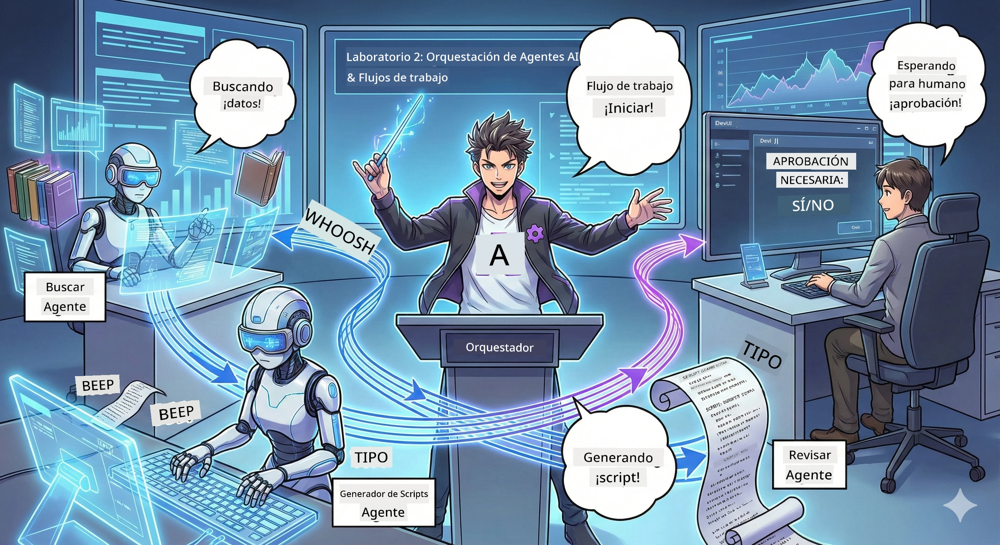

# Acto 2: Construye tu equipo de producción de podcast 🎬



## Intensificación del argumento

Alex (tu asistente de IA en el Acto 1) es genial, pero un solo agente no puede manejar todo un estudio de podcast. Necesitas un *equipo*:
- 🔍 **Agente de investigación**: busca información fresca en la web
- ✍️ **Agente de guion**: convierte la investigación en diálogos atractivos
- 👤 **Tú (editor)**: apruebas el guion o lo devuelves para reescribir

Bienvenido a **Orquestación de agentes de IA** — donde eres el director de tu propio equipo de IA. Piensa en Los Vengadores, pero para producción de podcasts.

## ¿Qué es la orquestación de agentes? (versión simple)

Imagina que diriges un restaurante. No haces todo tú solo, ¿verdad? Tienes:
- 🍳 Un chef que cocina
- 👨‍🍳 Un sous-chef que prepara ingredientes
- 👩‍🍳 Un camarero que sirve la comida

La orquestación de agentes es la misma idea, pero con IA. Cada agente es especialista y tú los coordinas para lograr un objetivo mayor. Ningún agente está sobrecargado y el trabajo se realiza más rápido.

### Analogía con una banda 🎸

Tus agentes de IA son como una banda:
- **Vocalista principal**: agente principal que maneja las tareas orientadas al cliente
- **Baterista**: mantiene el ritmo, maneja el procesamiento en segundo plano
- **Bajista**: apoya a todos, obtiene datos
- **Tú (gerente de la banda)**: coordinas todo

¿Sin coordinación? Solo ruido. ¿Con orquestación? Música hermosa.

### Por qué es importante

Un agente de IA intentando hacer todo = agotamiento. Agentes especializados trabajando juntos = eficiencia desbloqueada! 🚀

**Honestamente**: ¿Recuerdas intentar investigar, escribir y editar tu podcast tú solo? Sí, fue horrible. Con la orquestación, cada agente hace lo que mejor sabe hacer. Tú solo tomas la decisión final.

**Ejemplo del mundo real**: un chatbot que sabe cuándo manejar facturación vs problemas técnicos vs cuándo llamar a un humano. ¡Eso es orquestación!

## Agentes vs Flujos de trabajo: ¿Cuál es la diferencia?

Piensa así:

### 🤖 Agentes de IA = músicos de jazz
- **Decisiones improvisadas** basadas en lo que escuchan
- **Crean improvisadamente** soluciones con sus herramientas
- **Piensan** con cerebro LLM
- **Se adaptan** a lo que les lanzas

### 🎵 Flujos de trabajo = orquesta tocando música clásica
- **Siguen la partitura** (pasos predefinidos)
- **Ejecutan de manera predecible**
- **Coordinan** varios agentes, humanos y sistemas
- **Estructurados** como una receta

**La magia**: los flujos de trabajo *orquestan* agentes. Construyes un flujo que dice a los agentes cuándo entrar en acción. Lo mejor de ambos mundos. 🎭

## Tres maneras de coordinar tu equipo de IA

### 1. 🎯 Centralizado (tú eres el jefe)

Un agente maestro da órdenes. Piénsalo como si manejaras un equipo: tú decides quién hace qué y cuándo.

**Pros**:
- ✅ Liderazgo claro (sin confusión)
- ✅ Decisiones consistentes
- ✅ Fácil de depurar

**Ideal para**:
- Enrutamiento de soporte al cliente ("¿es facturación o soporte técnico?")
- Flujos de trabajo de aprobación de contenido ("¿aprobamos este guion?")
- Producción de podcast (justo lo que estamos construyendo)

### 2. 🤝 Descentralizado (agentes auto-organizados)

Los agentes se hablan directamente y resuelven problemas como grupo. Como un chat grupal con buena coordinación.

**Pros**:
- ✅ Fácil de escalar (agrega agentes a voluntad)
- ✅ Sin punto único de falla
- ✅ Colaboración natural entre agentes

**Ideal para**:
- Equipos de investigación (cada agente explora una fuente diferente)
- Sesiones de lluvia de ideas
- Resolución de problemas distribuida

### 3. 🔀 Híbrido (lo mejor de ambos)

Tú estableces la dirección general, pero los agentes se auto-organizan para las tareas. Como un CEO que confía en su equipo.

**Perfecto para**: proyectos complejos que necesitan control y flexibilidad.

## Microsoft Agent Framework: tu kit de orquestación 🧰

¡Es hora de empezar a construir! Esto es lo que usarás:

### Componentes constructores

#### 1. 🧱 Ejecutores (tus trabajadores)
- **Qué son**: unidades de procesamiento individuales — pueden ser agentes o lógica personalizada
- **Qué hacen**: reciben entrada, hacen el trabajo, producen salida
- **Piéntalos como**: estaciones de trabajo en una línea de ensamblaje

#### 2. ➡️ Bordes (conexiones)
- **Qué son**: caminos entre ejecutores
- **Qué hacen**: controlan el flujo de mensajes ("después de A, ir a B")
- **Piéntalos como**: flechas en un diagrama de flujo

#### 3. 🗺️ Flujos de trabajo (plan maestro)
- **Qué son**: gráfico completo de ejecutores + bordes
- **Qué hacen**: definen todo el proceso, desde inicio hasta fin
- **Piéntalos como**: el plano de tu proceso de producción

### Funciones geniales que te encantarán

**🛡️ Tipos seguros**: los mensajes entre agentes se chequean por tipo. Nada de "oops, tipo de dato incorrecto".

**🔀 Enrutamiento flexible**:
- Condiciones if-then ("si se aprueba, publica; si no, reescribe")
- Procesamiento paralelo (varios agentes trabajando al mismo tiempo)
- Rutas dinámicas (el flujo se ajusta según los resultados)

**🔌 Integraciones externas**:
- Conexión a APIs
- Añadir puntos de control con humanos (tú apruebas antes de publicar)
- Construir flujos de solicitudes/respuestas

**💾 Checkpoints**: ¡guarda el progreso! Si algo falla, continúa desde donde lo dejaste.

**🤝 Coordinación multi-agente**:
- Ejecutar agentes en secuencia (A → B → C)
- Ejecutarlos en paralelo (A + B + C simultáneamente)
- Transferencia entre agentes
- Trabajo colaborativo

## Mejores prácticas (tips profesionales) 🎯

### 1. Mantén la modularidad
Cada agente debe hacer bien solo una cosa. No crees un "superagente" que haga de todo — te arrepentirás cuando lo depures.

### 2. Planea para fallos
Los agentes fallarán. La red caerá. Construye manejo de errores y planes alternativos. Tu yo futuro te lo agradecerá.

### 3. Monitorea todo
Sigue lo que hacen tus agentes. Usa DevUI (te lo mostraremos) para ver los flujos en ejecución.

### 4. Optimiza el tamaño de mensajes
No pases archivos enormes entre agentes. Mantén los mensajes ligeros para mayor velocidad.

### 5. Escoge el patrón correcto
¿Necesitas control? Elige centralizado. ¿Necesitas escala? Elige descentralizado. ¿No sabes? Elige híbrido.

## DevUI: tu depurador de flujos 🔍

### ¿Qué es DevUI?

DevUI es como el parque de diversiones para probar tus agentes y flujos. Es una interfaz web donde puedes:
- 👀 Ver tus flujos en tiempo real
- 💬 Chatear directamente con los agentes
- 🔍 Depurar cuando algo falla
- 📊 Ver trazas y métricas de rendimiento

> **Importante**: DevUI es solo para desarrollo. No lo uses en producción. Piénsalo como tu entorno local de pruebas.

### Qué lo hace genial

- **🖥️ UI web interactiva**: clic, tecleo, prueba — sin línea de comandos
- **📁 Listo para arrastrar y soltar**: sube archivos, prueba con diferentes entradas
- **📂 Descubrimiento automático**: apunta a una carpeta y encuentra todos los agentes
- **📋 Sin necesidad de configurar estructura**: registra agentes en código, no necesitas orden de carpetas
- **🔌 Compatible con OpenAI**: funciona con OpenAI SDK (¡larga vida a la compatibilidad!)
- **👁️ Seguimiento incorporado**: mira exactamente qué hacen tus agentes

### Cómo funciona la entrada

DevUI es inteligente con la entrada:

- **¿Probando agentes?** Obtienes cajas de texto y botones para subir archivos
- **¿Probando flujos?** La UI genera campos de entrada automáticamente según lo que espera tu flujo

Es como magia, pero es solo buen código. ✨

## Tu misión: construir un estudio de podcast 🎬

### Misión 1: Crear un agente individual usando DevUI

📂 [01.AgentDevUI](../../../../../WorkshopForAgentic/code/02.Workflow/01.AgentDevUI)

**Desafío**: antes de construir el equipo completo, probemos DevUI con un solo agente: experto en búsqueda web.

**Qué construirás**: 
Un agente que pueda buscar temas para podcasts en internet. Lo probarás usando la interfaz web de DevUI en `http://localhost:8090`.

**Habilidades que aprenderás**:
- 🚀 Lanzar un agente en DevUI
- 🔍 Probar respuestas en tiempo real
- 🛠️ Construir herramientas personalizadas (búsqueda web)
- 📊 Activar seguimiento para depurar problemas
- 🖥️ Usar la UI web interactiva

**Código**:
- `agent.py`: tu SearchAgent con superpoderes de búsqueda web
- Conexión a Qwen vía OllamaChatClient
- Implementación de la función herramienta `web_search()`
- Iniciar con `serve()` — abre DevUI automáticamente

**Objetivo de victoria**: Pregúntale a tu agente "¿Cuáles son los temas candentes en IA?" y mira cómo busca en la web. 🎉

### Misión 2: Construir un flujo de trabajo multi-agente

📂 [02.WorkflowDevUI](../../../../../WorkshopForAgentic/code/02.Workflow/02.WorkflowDevUI)

**Desafío**: ¡ahora empieza la verdadera diversión! Construye un flujo completo para producción de podcast:
1. 🔍 **Agente de búsqueda** → investigue tu tema
2. ✍️ **Agente de guion** → escribe el diálogo para dos anfitriones (¡en chino!)
3. 👤 **Ejecutor de revisión** → te solicita aprobar o rechazar
4. 🔄 **Ciclo de retroceso** → si se rechaza, reescribe según tu feedback

**Habilidades que aprenderás**:
- 🧱 Crear agentes especializados para diferentes tareas
- 🔗 Conectar agentes con WorkflowBuilder
- 🔀 Implementar ciclo de aprobación (¡humano en el bucle!)
- 🚦 Enrutamiento condicional (si se aprueba vs si se rechaza)
- 🔧 Construir ejecutores personalizados para lógica de negocio

**Flujo de trabajo**:
```
SearchAgent → ScriptAgent → ReviewExecutor
                             ↑          ↓ (如果被拒绝)
                             ←─────────
```

**Código**:
- `search_agent/agent.py`: tu experto en investigación
- `generate_script_agent/agent.py`: tu escritor de guiones (¡escribe en chino!)
- `workflow/workflow.py`: donde ocurre la magia de la orquestación
- `main.py`: inicia todo en DevUI

**Objetivo de victoria**: da un tema, revisa el guion, rechaza una vez para probar el ciclo, luego aprueba. 🎉

### Misión 3: Construir una aplicación de consola

📂 [03.Application](../../../../../WorkshopForAgentic/code/02.Workflow/03.Application)

**Desafío**: transforma tu flujo de DevUI en una aplicación terminal elegante con salida en color, indicadores de carga y guardado de archivos. ¡Listo para producción!

**Habilidades que aprenderás**:
- ⚡ Ejecutar flujos programáticamente (sin DevUI)
- 📡 Usar arquitectura orientada a eventos con streaming
- 🎨 Crear UI terminal atractiva (color, spinner, barra de progreso)
- 💾 Guardar el guion final en archivo
- 🔄 Manejar asincronía con asyncio de Python

**Qué hace**:
1. Te pregunta tu tema de podcast
2. Muestra progreso en tiempo real ("Agente de búsqueda trabajando...")
3. Muestra el guion generado con colores
4. Solicita tu aprobación
5. Guarda el guion aprobado en `podcast.txt`

**Código**:
- `podcast_app.py`: tu app principal con manejo de eventos
- `workflow.py`: reutiliza el flujo del Paso 2
- Manejar eventos: `AgentRunUpdateEvent`, `RequestInfoEvent`, `WorkflowOutputEvent`
- Usar colores ANSI para estilos de terminal

**Condición de victoria**: ¡Ejecuta la aplicación, crea un guion para podcast y mira cómo se guarda! Has construido una herramienta real.🚀

## Lo que ya dominas 🏆

Después del segundo acto, puedes:

- ✅ Orquestar múltiples agentes de IA como un jefe
- ✅ Construir flujos de trabajo con lógica secuencial y condicional
- ✅ Agregar puntos de aprobación manual
- ✅ Probar y depurar flujos de trabajo con DevUI
- ✅ Crear aplicaciones de consola listas para producción
- ✅ Manejar errores elegantemente en sistemas complejos
- ✅ Elegir el patrón de orquestación correcto para cualquier proyecto

## Cuando las cosas salen mal 🔧

### "¡Mi flujo de trabajo es demasiado complejo!"
**Solución**: Divídelo en sub-flujos más pequeños. Cada flujo debe hacer bien una sola cosa. Si es necesario, enlázalos.

### "¡No puedo hacer seguimiento de lo que está pasando!"
**Solución**: Usa puntos de control en el flujo para guardar estado. Activa el seguimiento en DevUI para ver cada paso.

### "¡El error de un agente derrumba todo!"
**Solución**: Agrega límites de error. Cada agente debe manejar sus fallos y tener un comportamiento alternativo.

### "Esto es demasiado lento"
**Solución**: ¿Hay agentes que puedan correr en paralelo? Los flujos secuenciales son fáciles pero lentos. ¡Busca oportunidades de paralelización!

## Recursos útiles 🔗

- [Documentación de flujos de trabajo](https://learn.microsoft.com/en-us/agent-framework/user-guide/workflows/overview) — Guía oficial de Microsoft
- [Patrones de orquestación](https://www.ibm.com/think/topics/ai-agent-orchestration) — Perspectiva de IBM
- [Agent Framework GitHub](https://github.com/microsoft/agent-framework) — Explora el código fuente
- [Ejemplos de código](https://github.com/microsoft/agent-framework/tree/main/python/samples) — Toma patrones de aquí

---

**¿Listo para el acto final?** Ya tienes un guion. ¡Ahora hagamos que cobre vida en audio! → [Acto 3: Haz que tu podcast cobre vida](03.Multi-SpeakerPodcastGenerationWithVibeVoice.md) 🎤

---

**¿Atascado? ¿Confundido? ¿Emocionado?** ¡Comparte en el chat del taller! Aprendamos juntos.🚀

---

<!-- CO-OP TRANSLATOR DISCLAIMER START -->
**Aviso Legal**:  
Este documento ha sido traducido utilizando el servicio de traducción automática [Co-op Translator](https://github.com/Azure/co-op-translator). Aunque nos esforzamos por la precisión, tenga en cuenta que las traducciones automáticas pueden contener errores o inexactitudes. El documento original en su idioma nativo debe considerarse la fuente autorizada. Para información crítica, se recomienda la traducción profesional humana. No nos hacemos responsables de malentendidos o interpretaciones erróneas derivadas del uso de esta traducción.
<!-- CO-OP TRANSLATOR DISCLAIMER END -->