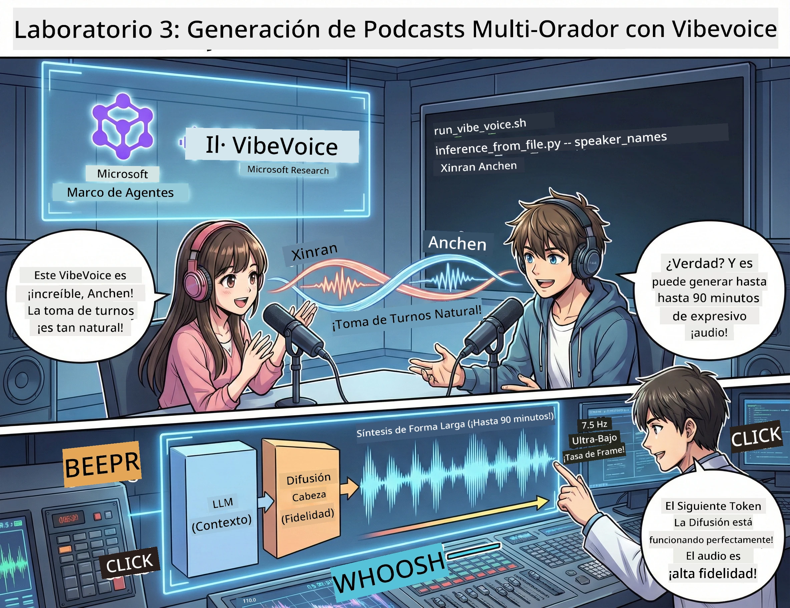

<!--
CO_OP_TRANSLATOR_METADATA:
{
  "original_hash": "d5c8bb53a007e77e7f8afe3067e64c55",
  "translation_date": "2026-01-05T15:44:48+00:00",
  "source_file": "WorkshopForAgentic/translation/zh-cn/03.Multi-SpeakerPodcastGenerationWithVibeVoice.md",
  "language_code": "es"
}
-->
# Acto Tres: Dale vida a tu podcast 🎤



## Gran Final

Ya investigaste el tema. Ya escribiste el guion. Ahora es momento de la cereza del pastel: ¡convierte tu texto en audio de podcast real con una voz auténtica!

Presentamos **VibeVoice** — la magia TTS (texto a voz) de código abierto del laboratorio de Microsoft Research, que crea:
- 🎭 Diálogos naturales y fluidos
- 👥 Múltiples hablantes (¡hasta 4!)
- ⏱️ Audio de formato largo (¡hasta 90 minutos!)
- 🎵 Entrega expresiva (¡nada de voz robótica!)

Esta es la tecnología detrás de la síntesis de podcasts. ¡Hagamos el tuyo!

## ¿Qué es VibeVoice? (Lo genial)

VibeVoice es el regalo del laboratorio de Microsoft Research al mundo. Está especialmente diseñado para audio de diálogo estilo podcast.

### Por qué es genial 🔥

* **⏱️ Conversaciones maratónicas**: Génesis de hasta 90 minutos de audio continuo (¡eso es un episodio completo de podcast!)
* **👥 Magia multihablante**: Hasta 4 voces diferentes con personalidades coherentes
* **⚡ Súper eficiente**: Usa una tasa de cuadros ultra baja de 7.5 Hz para ahorrar computación
* **🧠 Audio inteligente**: Combina LLMs (entendiendo contexto) y modelos de difusión (creando audio realista)
* **🎭 Natural y fluido**: Maneja automáticamente turnos de palabra, pausas y ritmo conversacional

**En resumen**: VibeVoice no solo lee tu guion — *lo interpreta* como una persona real.

---

## Antes de empezar 🚀

**Qué necesitas**:

* 🐍 **Python 3.10+** (ya lo tienes por los actos uno y dos)
* 🚀 **uv** (un gestor de paquetes Python rápido — lo instalaremos)
* 📝 **Tu guion**: Archivo `podcast.txt` del acto dos (en `../03.Application/`)

**Consejo experto**: Esta parte requiere una buena conexión a Internet para descargar los modelos preentrenados. ¡Tómate un café! ☕

---

## ¡Vamos! Método fácil 🎬

Lo hicimos súper sencillo. Un script shell hace todo por ti.

### Proceso

1. **Hazlo ejecutable**:
```bash
chmod +x run_vibe_voice.sh
```

2. **Ejecuta**:
```bash
./run_vibe_voice.sh
```

3. **Espera la magia** (la primera vez puede tardar unos minutos)

### Lo que pasa tras bambalinas 🎭

El script es básicamente tu ingeniero de sonido automatizado:

1. **📥 Descarga VibeVoice**: Clona el repositorio oficial de GitHub
2. **📦 Instala dependencias**: Usa `uv pip` para instalación ultrarrápida
3. **🎬 Genera audio**: Ejecuta el script de inferencia con:
   * `--model_path`: modelo preentrenado VibeVoice-7B
   * `--txt_path`: tu guion `podcast.txt`
   * `--speaker_names`: asigna voces (por defecto Xinran y Anchen)

**Resultado**: ¡tu guion se convierte en un episodio real de podcast! 🎉

---

## Tu desafío 🎯

Haz que esto sea divertido:

### Tarea 1: Crea contenido
Edita `../03.Application/podcast.txt` con un diálogo entre dos personas. Que sea sobre tecnología, hobbies, lo que sea. ¡Solo hazlo conversacional!

**Ejemplo de formato**:
```
说话人 1：嘿！你听说新的 AI 模型了吗？
说话人 2：不会吧！告诉我更多！
说话人 1：它叫...
```

### Tarea 2: Produce audio
Ejecuta el script y mira cómo sucede la magia. La primera vez tardará más (descarga de modelos).

### Tarea 3: Escucha y analiza
- ¿Suena natural?
- ¿Los hablantes tienen voces diferentes?
- ¿Fluye bien el turno de palabra?
- ¿Hay momentos robóticos?

### Tarea 4: Experimenta (para los valientes)
Edita `run_vibe_voice.sh` y cambia `--speaker_names` para probar diferentes combinaciones de voces. ¡VibeVoice tiene varias voces preentrenadas!

**Desafío extra**: ¡Prueba un diálogo entre 3 hablantes! 🎆

---

## Aprende más 📚

* **🏠 Página del proyecto**: [Sitio oficial de VibeVoice](https://microsoft.github.io/VibeVoice/)
* **🤗 Modelo preentrenado**: [Hugging Face - VibeVoice-7B](https://huggingface.co/vibevoice/VibeVoice-7B)
* **📖 Paper de investigación**: Profundiza en la tecnología (si te interesa)

> **⚠️ Recordatorio de IA responsable**: VibeVoice es poderoso. ¡Úsalo éticamente! No crees deepfakes o contenido engañoso. Crea cosas geniales que ayuden a las personas. 🙏

---

## 🏆 ¡Felicidades! Lo lograste

Acabas de completar el flujo completo:
1. ✅ **Acto 1**: Construir agentes inteligentes personalizados
2. ✅ **Acto 2**: Orquestar workflows multiagente
3. ✅ **Acto 3**: Generar audio real de podcast

**Ahora tienes**:
- Un asistente de investigación IA funcional
- Un workflow completo de producción de podcast
- Un archivo de audio real para compartir

### ¿Siguiente paso? 🚀

**¡Lanza tu podcast!**
- Súbelo a plataformas de podcasting
- Compártelo en redes sociales
- Itera y mejora

**Sigue construyendo!**
- Prueba temas diferentes
- Experimenta con más voces
- Añade música de fondo
- Construye una interfaz web
- Automatiza todo el flujo

**¡Comparte tu creación!**
Etiquétanos. Muestra al mundo lo que construiste. La revolución del podcast con IA empieza contigo. 🎙️

---

**¿Preguntas? ¿Ideas? ¿Historias de éxito?** ¡Compártelas en el chat del taller!

**Bienvenido al futuro de la creación de contenido.** 🌟

---

<!-- CO-OP TRANSLATOR DISCLAIMER START -->
**Aviso Legal**:
Este documento ha sido traducido utilizando el servicio de traducción automática [Co-op Translator](https://github.com/Azure/co-op-translator). Aunque nos esforzamos por la precisión, tenga en cuenta que las traducciones automatizadas pueden contener errores o inexactitudes. El documento original en su idioma nativo debe considerarse la fuente autorizada. Para información crítica, se recomienda la traducción profesional realizada por humanos. No nos hacemos responsables por malentendidos o interpretaciones erróneas derivadas del uso de esta traducción.
<!-- CO-OP TRANSLATOR DISCLAIMER END -->