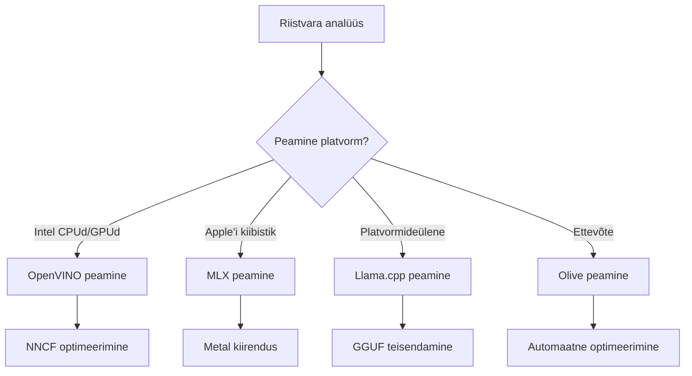
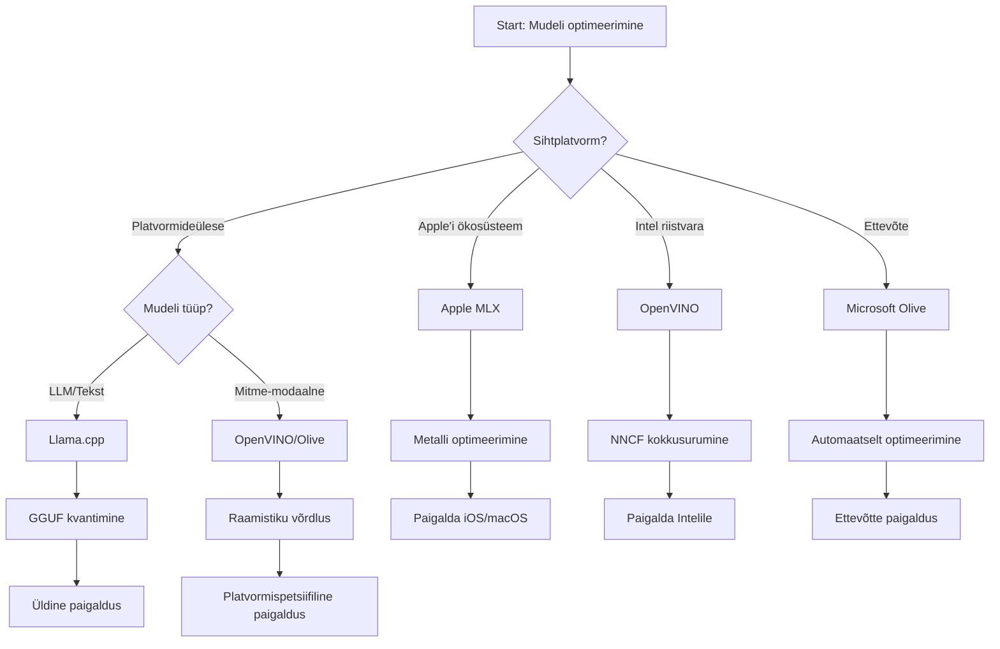
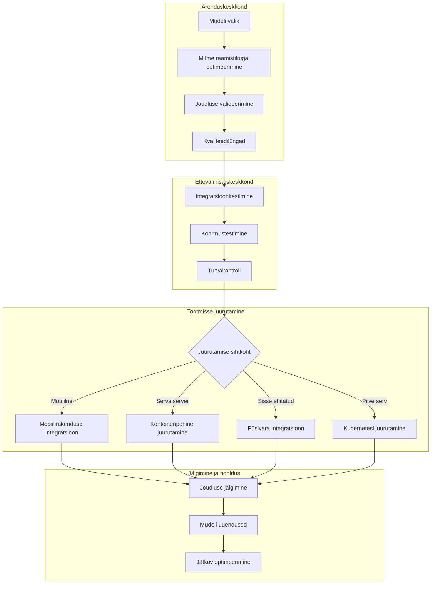

# 6. peatükk: Edge AI arenduse töövoo süntees

## Sisukord
1. [Sissejuhatus](#sissejuhatus)
2. [Õpieesmärgid](#õpieesmärgid)
3. [Ühtne töövoogude ülevaade](#ühtne-töövoo-ülevaade)
4. [Raamistiku valiku maatriks](#raamistiku-valiku-maatriks)
5. [Parimate tavade süntees](#parimate-tavade-süntees)
6. [Paigaldusstrateegia juhend](#paigaldusstrateegia-juhend)
7. [Tulemuste optimeerimise töövoog](#tulemuste-optimeerimise-töövoog)
8. [Tootmisvalmiduse kontrollnimekiri](#tootmisvalmiduse-kontrollnimekiri)
9. [Veaotsing ja jälgimine](#veaotsing-ja-jälgimine)
10. [Edge AI torujuhtme tulevikukindlus](#edge-ai-torujuhtme-tulevikukindlus)

## Sissejuhatus

Edge AI arendus nõuab põhjalikku arusaama mitmetest optimeerimisraamistikest, paigaldusstrateegiatest ja riistvaralistest kaalutlustest. See põhjalik süntees ühendab teadmised Llama.cpp-st, Microsoft Olive-ist, OpenVINO-st ja Apple MLX-ist, et luua ühtne töövoog, mis maksimeerib efektiivsust, säilitab kvaliteedi ja tagab edukalt tootmisse juurutamise.

Selle kursuse jooksul oleme uurinud individuaalseid optimeerimisraamistikke, millest igaühel on oma unikaalsed tugevused ja spetsialiseeritud kasutusjuhtumid. Kuid reaalsed Edge AI projektid nõuavad tihti mitme raamistiku tehnikate kombineerimist või strateegiliste otsuste tegemist selle kohta, milline lähenemine annab parimad tulemused konkreetsete piirangute ja nõuete puhul.

See peatükk sünteesib kogu raamistike kollektiivse tarkuse teostatavate töövoogude, otsustuspuude ja parimate tavade kaudu, mis võimaldavad teil tõhusalt ja tulemuslikult ehitada tootmisvalmis Edge AI lahendusi. Olenemata sellest, kas optimeerite mobiilseadmete, manussüsteemide või ääre serverite jaoks, annab see juhend strateegilise raamistiku teadlike otsuste tegemiseks kogu teie arendusprotsessi vältel.

## Õpieesmärgid

Selle peatüki lõpuks oskate:

### Strateegiline otsuste tegemine
- **Hinnata ja valida** optimaalne optimeerimisraamistik projekti nõuete, riistvara piirangute ja paigalduse stsenaariumite põhjal
- **Kavandada terviklikud töövood**, mis integreerivad mitme optimeerimistehnika maksimaalse efektiivsuse saavutamiseks
- **Hinnata kompromisse** mudeli täpsuse, järeldamiskiiruse, mälu kasutuse ja paigalduse keerukuse vahel erinevates raamistikudes

### Töövoogude integreerimine
- **Rakendada ühtseid arendustorujuhte**, mis kasutavad mitme optimeerimisraamistiku tugevusi
- **Luua reprodutseeritavad töövood** eesmärgiga tagada mudeli ühtne optimeerimine ja paigaldus erinevates keskkondades
- **Seadistada kvaliteedilülisid** ja valideerimisprotsesse, mis tagavad optimeeritud mudelite vastavuse tootmisnõuetele

### Tulemuste optimeerimine
- **Rakendada süsteemseid optimeerimisstrateegiaid** kasutades kvantiseerimist, kärpimist ja riistvaraspetsiifilist kiirendustehnikat
- **Jälgida ja mõõta** mudeli jõudlust erinevatel optimeerimistasemetel ja paigalduse sihtkohtadel
- **Optimeerida konkreetsete riistvaraplatvormide jaoks**, sealhulgas CPU, GPU, NPU ja spetsialiseeritud äärekiirendajad

### Tootmisele juurutamine
- **Kujundada skaleeritavad juurutusarkitektuurid**, mis toetavad mitu mudeliformaati ja järeldusmootorit
- **Rakendada jälgimist ja nähtavust** Edge AI rakendustele tootmiskeskkondades
- **Kehtestada hooldusprotsessid** mudelite värskendusteks, jõudluse jälgimiseks ja süsteemi optimeerimiseks

### Platvormideülene tipptase
- **Juurutada optimeeritud mudeleid** mitme erineva riistvaraplatvormi peale, säilitades järjepideva jõudluse
- **Käsitleda platvormispetsiifilisi optimeerimisi** Windows, macOS, Linux, mobiil- ja manussüsteemide jaoks
- **Luua abstraktsioonikihid**, mis võimaldavad sujuvat juurutust erinevates ääre keskkondades

## Ühtne töövoo ülevaade

### 1. etapp: nõuete analüüs ja raamistiku valik

Eduka Edge AI juurutuse alus algab põhjalikust nõuete analüüsist, mis suunab raamistiku valikut ja optimeerimisstrateegiat.

#### 1.1 Riistvara hindamine


**Olulised kaalutlused:**
- **CPU arhitektuur**: x86, ARM, Apple Siliconi võimekus
- **Kiirendi saadavus**: GPU, NPU, VPU, spetsialiseeritud tehisintellekti kiibid
- **Mälu piirangud**: RAM-i piirangud, salvestusmaht
- **Võimsuse eelarve**: Aku kestvus, termilised piirangud
- **Ühenduvus**: Võrguühenduseta nõuded, ribalaiuse piirangud

#### 1.2 Rakenduse nõuete maatriks

| Nõue | Llama.cpp | Microsoft Olive | OpenVINO | Apple MLX |
|-------------|-----------|-----------------|----------|-----------|
| Platvormideülene | ✅ Suurepärane | ⚡ Hea | ⚡ Hea | ❌ Ainult Apple |
| Ettevõtte integratsioon | ⚡ Põhiline | ✅ Suurepärane | ✅ Suurepärane | ⚡ Piiratud |
| Mobiilne juurutus | ✅ Suurepärane | ⚡ Hea | ⚡ Hea | ✅ iOS suurepärane |
| Reaalaegne järeldus | ✅ Suurepärane | ✅ Suurepärane | ✅ Suurepärane | ✅ Suurepärane |
| Mudeli mitmekesisus | ✅ Suurem keeleline mudel (LLM) | ✅ Kõik mudelid | ✅ Kõik mudelid | ✅ LLM fookus |
| Kasutuse lihtsus | ✅ Lihtne | ✅ Automatiseeritud | ⚡ Mõõdukas | ✅ Lihtne |

### 2. etapp: mudeli ettevalmistamine ja optimeerimine

#### 2.1 Üldine mudeli hindamise töövoog

```python
# Universaalne mudeli hindamise raamistik
class EdgeAIModelAssessment:
    def __init__(self, model_path, target_hardware):
        self.model_path = model_path
        self.target_hardware = target_hardware
        self.optimization_frameworks = []
        
    def assess_model_characteristics(self):
        """Analyze model size, architecture, and complexity"""
        return {
            'model_size': self.get_model_size(),
            'parameter_count': self.get_parameter_count(),
            'architecture_type': self.detect_architecture(),
            'quantization_compatibility': self.check_quantization_support()
        }
    
    def recommend_optimization_strategy(self):
        """Recommend optimal frameworks and techniques"""
        characteristics = self.assess_model_characteristics()
        
        if self.target_hardware.startswith('apple'):
            return self.mlx_optimization_strategy(characteristics)
        elif self.target_hardware.startswith('intel'):
            return self.openvino_optimization_strategy(characteristics)
        elif characteristics['model_size'] > 7_000_000_000:  # 7 miljardit+ parameetrit
            return self.enterprise_optimization_strategy(characteristics)
        else:
            return self.lightweight_optimization_strategy(characteristics)
```

#### 2.2 Mitme raamistiku optimeerimise töövoog

**Järjestikune optimeerimisprotsess:**
1. **Esialgne teisendus**: teisendamine vahevormi (eelistatult ONNX formaati)
2. **Raamistiku spetsiifiline optimeerimine**: rakendada spetsialiseeritud tehnikaid
3. **Ristvalideerimine**: jõudluse kontroll sihtplatvormidel
4. **Lõplik pakendamine**: ettevalmistamine juurutuseks

```bash
# Mitme raamistiku optimeerimise skript
#!/bin/bash

MODEL_NAME="phi-3-mini"
BASE_MODEL="microsoft/Phi-3-mini-4k-instruct"

# 1. faas: ONNX konverteerimine (universaalne)
python convert_to_onnx.py --model $BASE_MODEL --output models/onnx/

# 2. faas: platvormispetsiifiline optimeerimine
if [[ "$TARGET_PLATFORM" == "intel" ]]; then
    # OpenVINO optimeerimine
    python optimize_openvino.py --input models/onnx/ --output models/openvino/
elif [[ "$TARGET_PLATFORM" == "apple" ]]; then
    # MLX optimeerimine
    python optimize_mlx.py --input $BASE_MODEL --output models/mlx/
elif [[ "$TARGET_PLATFORM" == "cross" ]]; then
    # Llama.cpp optimeerimine
    python convert_to_gguf.py --input models/onnx/ --output models/gguf/
fi

# 3. faas: valideerimine
python validate_optimization.py --original $BASE_MODEL --optimized models/$TARGET_PLATFORM/
```

### 3. etapp: jõudluse valideerimine ja võrdlusmõõtmine

#### 3.1 Põhjapanev võrdlusmõõtmise raamistik

```python
class EdgeAIBenchmark:
    def __init__(self, optimized_models):
        self.models = optimized_models
        self.metrics = {
            'inference_time': [],
            'memory_usage': [],
            'accuracy_score': [],
            'throughput': [],
            'energy_consumption': []
        }
    
    def run_comprehensive_benchmark(self):
        """Execute standardized benchmarks across all optimized models"""
        test_inputs = self.generate_test_inputs()
        
        for model_framework, model_path in self.models.items():
            print(f"Benchmarking {model_framework}...")
            
            # Latentsuse testimine
            latency = self.measure_inference_latency(model_path, test_inputs)
            
            # Mälu profilseerimine
            memory = self.profile_memory_usage(model_path)
            
            # Täpsuse valideerimine
            accuracy = self.validate_model_accuracy(model_path, test_inputs)
            
            # Läbilaskevõime analüüs
            throughput = self.measure_throughput(model_path)
            
            self.record_metrics(model_framework, latency, memory, accuracy, throughput)
    
    def generate_optimization_report(self):
        """Create comprehensive comparison report"""
        report = {
            'recommendations': self.analyze_performance_trade_offs(),
            'deployment_guidance': self.generate_deployment_recommendations(),
            'monitoring_requirements': self.define_monitoring_metrics()
        }
        return report
```

## Raamistiku valiku maatriks

### Otsustuspuu raamistiku valikuks



### Kattuvad valikukriteeriumid

#### 1. Peamised kasutusjuhtumid

**Suured keelemudelid (LLM):**
- **Llama.cpp**: Parim CPU-kesksete, platvormideülese juurutuse jaoks
- **Apple MLX**: Optimaalne Apple Siliconi jaoks, ühtse mäluga
- **OpenVINO**: Suurepärane Intel riistvarale koos NNCF optimeerimisega
- **Microsoft Olive**: Sobiv ettevõttesisesteks töövoogudeks automatiseerimisega

**Mitme-modaliga mudelid:**
- **OpenVINO**: Ulatuslik tugi nägemise, heli ja teksti jaoks
- **Microsoft Olive**: Ettevõtte tasemel optimeerimine keerukatele torujuhtmetele
- **Llama.cpp**: Piiratud tekstipõhistele mudelitele
- **Apple MLX**: Kasvav tugi mitme-modalile rakendustele

#### 2. Riistvaraplatvormi maatriks

| Platvorm | Peamine raamistik | Teisene valik | Spetsialiseeritud omadused |
|----------|------------------|------------------|---------------------|
| Intel CPU/GPU | OpenVINO | Microsoft Olive | NNCF andmekompressioon, Intel optimeerimine |
| NVIDIA GPU | Microsoft Olive | OpenVINO | CUDA kiirendus, ettevõtte funktsioonid |
| Apple Silicon | Apple MLX | Llama.cpp | Metal šaderid, ühtne mälu haldus |
| ARM mobiil | Llama.cpp | OpenVINO | Platvormideülene, minimaalsed sõltuvused |
| Edge TPU | OpenVINO | Microsoft Olive | Spetsialiseeritud kiirenduse tugi |
| Manustatud ARM | Llama.cpp | OpenVINO | Väike jalajälg, tõhus järeldamine |

#### 3. Arenduse töövoo eelistused

**Kiire prototüüpimine:**
1. **Llama.cpp**: Kiireim käivitamine, kohesed tulemused
2. **Apple MLX**: Lihtne Python API, kiire iteratsioon
3. **Microsoft Olive**: Automaatne optimeerimine, minimaalne seadistus
4. **OpenVINO**: Rohkem keerukust, ulatuslikud funktsioonid

**Ettevõtte tootmine:**
1. **Microsoft Olive**: Ettevõtte funktsioonid, Azure integratsioon
2. **OpenVINO**: Intel ökosüsteem, põhjalikud tööriistad
3. **Apple MLX**: Apple spetsiifilised ettevõtte rakendused
4. **Llama.cpp**: Lihtne juurutus, piiratud ettevõtte funktsioonid

## Parimate tavade süntees

### Universaalsed optimeerimise põhimõtted

#### 1. Järk-järguline optimeerimisstrateegia

```python
class ProgressiveOptimization:
    def __init__(self, base_model):
        self.base_model = base_model
        self.optimization_stages = [
            'baseline_measurement',
            'format_conversion',
            'quantization_optimization',
            'hardware_acceleration',
            'production_validation'
        ]
    
    def execute_progressive_optimization(self):
        """Apply optimization techniques incrementally"""
        
        # Etapp 1: Põhimõõtmine
        baseline_metrics = self.measure_baseline_performance()
        
        # Etapp 2: Vormingu konverteerimine
        converted_model = self.convert_to_optimal_format()
        conversion_metrics = self.measure_performance(converted_model)
        
        # Etapp 3: Kvantimine
        quantized_model = self.apply_quantization(converted_model)
        quantization_metrics = self.measure_performance(quantized_model)
        
        # Etapp 4: Riistvarakiirendamine
        accelerated_model = self.enable_hardware_acceleration(quantized_model)
        acceleration_metrics = self.measure_performance(accelerated_model)
        
        # Etapp 5: Kinnitus
        production_ready = self.validate_for_production(accelerated_model)
        
        return self.compile_optimization_report(
            baseline_metrics, conversion_metrics, 
            quantization_metrics, acceleration_metrics
        )
```

#### 2. Kvaliteedilülide rakendamine

**Täpsuse säilitamise lülid:**
- Säilitada >95% algsest täpsusest
- Valideerida esinduslike testandmete komplektide vastu
- Rakendada A/B testimist tootmise valideerimiseks

**Jõudluse parendamise lülid:**
- Saavutada vähemalt 2x kiiruse paranemine
- Vähendada mälukasutust vähemalt 50% võrra
- Valideerida järeldamisaja järjepidevus

**Tootmisküpse valmisoleku lülid:**
- Läbida pingutustestid koormuse all
- Tõestada stabiilset jõudlust aja jooksul
- Valideerida turva- ja privaatsusnõuded

### Raamistikupõhiste parimate tavade integreerimine

#### 1. Kvantiseerimisstrateegia süntees

```python
# Ühtne kvantimise lähenemine
class UnifiedQuantizationStrategy:
    def __init__(self, model, target_platform):
        self.model = model
        self.platform = target_platform
        
    def select_optimal_quantization(self):
        """Choose best quantization based on platform and requirements"""
        
        if self.platform == 'apple_silicon':
            return self.mlx_quantization_strategy()
        elif self.platform == 'intel_hardware':
            return self.openvino_quantization_strategy()
        elif self.platform == 'cross_platform':
            return self.llamacpp_quantization_strategy()
        else:
            return self.olive_quantization_strategy()
    
    def mlx_quantization_strategy(self):
        """Apple MLX-specific quantization"""
        return {
            'method': 'mlx_quantize',
            'precision': 'int4',
            'group_size': 64,
            'optimization_target': 'unified_memory'
        }
    
    def openvino_quantization_strategy(self):
        """OpenVINO NNCF quantization"""
        return {
            'method': 'nncf_quantize',
            'precision': 'int8',
            'calibration_method': 'post_training',
            'optimization_target': 'intel_hardware'
        }
```

#### 2. Riistvarakiirenduse optimeerimine

**CPU optimeerimise süntees:**
- **SIMD käsud**: Kasutada optimeeritud kerneli eri raamistikes
- **Mälu läbilaskevõime**: Optimeerida andmete paigutust vahemälu tõhususe parandamiseks
- **Juhtimine**: Tasakaalustada paralleelsust ressursside piirangutega

**GPU kiirenduse parimad tavad:**
- **Pakkprotsessimine**: Maksimeerida läbilaskevõimet sobivate pakk-suurustega
- **Mälu haldus**: Optimeerida GPU mälu eraldust ja ülekandeid
- **Täpsus**: Kasutada FP16, kui toetatud, parema jõudluse saavutamiseks

**NPU/spetsialiseeritud kiirendaja optimeerimine:**
- **Mudeli arhitektuur**: Tagada ühilduvus kiirendaja võimetega
- **Andmevoog**: Optimeerida sisend/väljunditorujuhte kiirendaja efektiivsuse jaoks
- **Varundamisstrateegiad**: Rakendada CPU tagavaralahendusi toetamata toimingute jaoks

## Paigaldusstrateegia juhend

### Universaalne juurutusarkitektuur



### Platvormispetsiifilised juurutusmustrid

#### 1. Mobiilseadmete juurutusstrateegia

```yaml
# Mobile Deployment Configuration
mobile_deployment:
  ios:
    framework: apple_mlx
    optimization:
      quantization: int4
      memory_mapping: true
      background_execution: limited
    packaging:
      format: mlx
      bundle_size: <50MB
      
  android:
    framework: llama_cpp
    optimization:
      quantization: q4_k_m
      threading: android_optimized
      memory_management: conservative
    packaging:
      format: gguf
      apk_size: <100MB
      
  cross_platform:
    framework: onnx_runtime
    optimization:
      quantization: int8
      execution_provider: cpu
    packaging:
      format: onnx
      shared_libraries: minimal
```

#### 2. Edge serveri juurutus

```yaml
# Edge Server Deployment Configuration
edge_server:
  intel_based:
    framework: openvino
    optimization:
      quantization: int8
      acceleration: cpu_gpu_auto
      batch_processing: dynamic
    deployment:
      container: openvino_runtime
      orchestration: kubernetes
      scaling: horizontal
      
  nvidia_based:
    framework: microsoft_olive
    optimization:
      quantization: int4
      acceleration: cuda
      tensor_parallelism: true
    deployment:
      container: nvidia_triton
      orchestration: kubernetes
      scaling: gpu_aware
```

### Konteinerlahenduste parimad tavad

```dockerfile
# Multi-Framework Edge AI Container
FROM ubuntu:22.04 as base

# Install common dependencies
RUN apt-get update && apt-get install -y \
    python3 \
    python3-pip \
    build-essential \
    cmake \
    && rm -rf /var/lib/apt/lists/*

# Framework-specific stages
FROM base as openvino
RUN pip install openvino nncf optimum[intel]

FROM base as llamacpp
RUN git clone https://github.com/ggerganov/llama.cpp.git \
    && cd llama.cpp && make LLAMA_OPENBLAS=1

FROM base as olive
RUN pip install olive-ai[auto-opt] onnxruntime-genai

# Production stage with selected framework
FROM openvino as production
COPY models/ /app/models/
COPY src/ /app/src/
WORKDIR /app

EXPOSE 8080
CMD ["python3", "src/inference_server.py"]
```

## Tulemuste optimeerimise töövoog

### Süsteemne jõudluse häälestus

#### 1. Jõudluse profiilimise torujuhe

```python
class EdgeAIPerformanceProfiler:
    def __init__(self, model_path, framework):
        self.model_path = model_path
        self.framework = framework
        self.profiling_results = {}
    
    def comprehensive_profiling(self):
        """Execute comprehensive performance analysis"""
        
        # CPU profiilimine
        cpu_profile = self.profile_cpu_usage()
        
        # Mälu profiilimine
        memory_profile = self.profile_memory_usage()
        
        # Järelduste latentsus
        latency_profile = self.profile_inference_latency()
        
        # Läbilaskevõime analüüs
        throughput_profile = self.profile_throughput()
        
        # Energiatarbimine (kui saadaval)
        energy_profile = self.profile_energy_consumption()
        
        return self.compile_performance_report(
            cpu_profile, memory_profile, latency_profile,
            throughput_profile, energy_profile
        )
    
    def identify_bottlenecks(self):
        """Automatically identify performance bottlenecks"""
        bottlenecks = []
        
        if self.profiling_results['cpu_utilization'] > 80:
            bottlenecks.append('cpu_bound')
        
        if self.profiling_results['memory_usage'] > 90:
            bottlenecks.append('memory_bound')
        
        if self.profiling_results['inference_variance'] > 20:
            bottlenecks.append('inconsistent_performance')
        
        return self.generate_optimization_recommendations(bottlenecks)
```

#### 2. Automaatse optimeerimise torujuhe

```python
class AutomatedOptimizationPipeline:
    def __init__(self, base_model, target_constraints):
        self.base_model = base_model
        self.constraints = target_constraints
        self.optimization_history = []
    
    def execute_optimization_search(self):
        """Systematically search optimization space"""
        
        optimization_candidates = [
            {'quantization': 'int8', 'pruning': 0.1},
            {'quantization': 'int4', 'pruning': 0.2},
            {'quantization': 'int8', 'acceleration': 'gpu'},
            {'quantization': 'int4', 'acceleration': 'npu'}
        ]
        
        best_configuration = None
        best_score = 0
        
        for config in optimization_candidates:
            optimized_model = self.apply_optimization(config)
            score = self.evaluate_optimization(optimized_model)
            
            if score > best_score and self.meets_constraints(optimized_model):
                best_score = score
                best_configuration = config
            
            self.optimization_history.append({
                'config': config,
                'score': score,
                'model': optimized_model
            })
        
        return best_configuration, self.optimization_history
```

### Mitme eesmärgiga optimeerimine

#### 1. Pareto optimeerimine Edge AI jaoks

```python
class ParetoOptimization:
    def __init__(self, objectives=['speed', 'accuracy', 'memory']):
        self.objectives = objectives
        self.pareto_frontier = []
    
    def find_pareto_optimal_solutions(self, optimization_results):
        """Identify Pareto-optimal configurations"""
        
        for result in optimization_results:
            is_dominated = False
            
            for frontier_point in self.pareto_frontier:
                if self.dominates(frontier_point, result):
                    is_dominated = True
                    break
            
            if not is_dominated:
                # Eemalda piiri pealt domineeritud punktid
                self.pareto_frontier = [
                    point for point in self.pareto_frontier 
                    if not self.dominates(result, point)
                ]
                
                self.pareto_frontier.append(result)
        
        return self.pareto_frontier
    
    def recommend_configuration(self, user_preferences):
        """Recommend configuration based on user preferences"""
        
        weighted_scores = []
        for config in self.pareto_frontier:
            score = sum(
                user_preferences[obj] * config['metrics'][obj] 
                for obj in self.objectives
            )
            weighted_scores.append((score, config))
        
        return max(weighted_scores, key=lambda x: x[0])[1]
```

## Tootmisvalmiduse kontrollnimekiri

### Üldine tootmiskinnituse raamistik

#### 1. Mudeli kvaliteedi tagamine

```python
class ProductionReadinessValidator:
    def __init__(self, optimized_model, production_requirements):
        self.model = optimized_model
        self.requirements = production_requirements
        self.validation_results = {}
    
    def validate_model_quality(self):
        """Comprehensive model quality validation"""
        
        # Täpsuse valideerimine
        accuracy_result = self.validate_accuracy()
        
        # Jõudluse valideerimine
        performance_result = self.validate_performance()
        
        # Tugevuse testimine
        robustness_result = self.validate_robustness()
        
        # Turvalisuse hindamine
        security_result = self.validate_security()
        
        # Vastavuse kontrollimine
        compliance_result = self.validate_compliance()
        
        return self.compile_validation_report(
            accuracy_result, performance_result, robustness_result,
            security_result, compliance_result
        )
    
    def generate_certification_report(self):
        """Generate production certification report"""
        return {
            'model_signature': self.generate_model_signature(),
            'validation_timestamp': datetime.now(),
            'validation_results': self.validation_results,
            'deployment_approval': self.check_deployment_approval(),
            'monitoring_requirements': self.define_monitoring_requirements()
        }
```

#### 2. Tootmisele juurutamise kontrollnimekiri

**Eeljuurutuse valideerimine:**
- [ ] Mudeli täpsus vastab minimaalsetele nõuetele (>95% baastasemest)
- [ ] Tulemuse eesmärgid täidetud (latentsus, läbilaskevõime, mälu)
- [ ] Turvaprobleemid hinnatud ja leevendatud
- [ ] Koormustaluvuse testid tehtud oodatud koormuse all
- [ ] Veastsenaariumid testitud ja taastamismeetmed valideeritud
- [ ] Jälgimis- ja hoiatussüsteemid seadistatud
- [ ] Tagasikerimise protseduurid testitud ja dokumenteeritud

**Juurutamisprotsess:**
- [ ] Sinine-roheline juurutusstrateegia rakendatud
- [ ] Liiklusprotsentide järkjärguline suurendamine konfigureeritud
- [ ] Reaalaegse jälgimise armatuurlauad aktiivsed
- [ ] Tulemuslikkuse baasnäitajad määratletud
- [ ] Veamäära lävendid paika pandud
- [ ] Automaatse tagasikerimise päästikud seadistatud

**Järgneva juurutamise jälgimine:**
- [ ] Mudeli nihke tuvastamine aktiivne
- [ ] Jõudluse halvenemise hoiatused seadistatud
- [ ] Ressursside kasutuse jälgimine lubatud
- [ ] Kasutajakogemuse mõõdikud jälgitud
- [ ] Mudeli versioonide jälgimine ja pärilikkus säilitatud
- [ ] Regulaarsete mudeli tulemuste ülevaatuste ajakava koostatud

### Jätkuv integreerimine / jätkuv juurutamine (CI/CD)

```yaml
# Edge AI CI/CD Pipeline Configuration
edge_ai_pipeline:
  stages:
    - model_validation
    - optimization
    - testing
    - staging_deployment
    - production_deployment
    - monitoring
  
  model_validation:
    accuracy_threshold: 0.95
    performance_baseline: required
    security_scan: enabled
    
  optimization:
    frameworks:
      - llama_cpp
      - openvino
      - microsoft_olive
    validation:
      cross_validation: enabled
      performance_comparison: required
      
  testing:
    unit_tests: comprehensive
    integration_tests: full_pipeline
    load_tests: production_scale
    security_tests: comprehensive
    
  deployment:
    strategy: blue_green
    traffic_ramping: gradual
    rollback: automatic
    monitoring: real_time
```

## Veaotsing ja jälgimine

### Ühine veaotsingu raamistik

#### 1. Tavalised probleemid ja lahendused

**Jõudluse probleemid:**
```python
class PerformanceTroubleshooter:
    def __init__(self, model_metrics):
        self.metrics = model_metrics
        
    def diagnose_performance_issues(self):
        """Systematic performance issue diagnosis"""
        
        issues = []
        
        # Suure latentsuse diagnoosimine
        if self.metrics['avg_latency'] > self.metrics['target_latency']:
            issues.append(self.diagnose_latency_issues())
        
        # Mälu kasutamise diagnoosimine
        if self.metrics['memory_usage'] > self.metrics['memory_limit']:
            issues.append(self.diagnose_memory_issues())
        
        # Läbilaskevõime diagnoosimine
        if self.metrics['throughput'] < self.metrics['target_throughput']:
            issues.append(self.diagnose_throughput_issues())
        
        return self.generate_resolution_plan(issues)
    
    def diagnose_latency_issues(self):
        """Specific latency troubleshooting"""
        potential_causes = []
        
        if self.metrics['cpu_utilization'] > 80:
            potential_causes.append('cpu_bottleneck')
        
        if self.metrics['memory_bandwidth'] > 90:
            potential_causes.append('memory_bandwidth_limit')
        
        if self.metrics['model_size'] > self.metrics['optimal_size']:
            potential_causes.append('model_too_large')
        
        return {
            'issue': 'high_latency',
            'causes': potential_causes,
            'solutions': self.generate_latency_solutions(potential_causes)
        }
```

**Raamistikupõhine veaotsing:**

| Probleem | Llama.cpp | Microsoft Olive | OpenVINO | Apple MLX |
|-------|-----------|-----------------|----------|-----------|
| Mälu probleemid | Vähenda konteksti pikkust | Suurenda pakisuurust | Luba vahemälu | Kasuta mälukaardistust |
| Aeglane järeldus | Luba SIMD | Kontrolli kvantiseerimist | Optimeeri juhtimist | Luba Metal |
| Täpsuse kadu | Suurem kvantiseerimine | Treeni uuesti QAT-ga | Suurenda kalibreerimist | Täiusta peenseadistusega pärast kvant |
| Ühilduvus | Kontrolli mudeli formaati | Kontrolli raamistiku versiooni | Uuenda draivereid | Kontrolli macOS versiooni |

#### 2. Tootmisjälgimise strateegia

```python
class EdgeAIMonitoring:
    def __init__(self, deployment_config):
        self.config = deployment_config
        self.metrics_collectors = []
        self.alerting_rules = []
    
    def setup_comprehensive_monitoring(self):
        """Configure comprehensive monitoring for Edge AI deployment"""
        
        # Mudeli jõudluse jälgimine
        self.setup_model_performance_monitoring()
        
        # Infrastruktuuri jälgimine
        self.setup_infrastructure_monitoring()
        
        # Ärinäitajate jälgimine
        self.setup_business_metrics_monitoring()
        
        # Turvalisuse jälgimine
        self.setup_security_monitoring()
    
    def setup_model_performance_monitoring(self):
        """Model-specific performance monitoring"""
        metrics = [
            'inference_latency_p50',
            'inference_latency_p95',
            'inference_latency_p99',
            'model_accuracy_drift',
            'prediction_confidence_distribution',
            'error_rate',
            'throughput_requests_per_second'
        ]
        
        for metric in metrics:
            self.add_metric_collector(metric)
            self.add_alerting_rule(metric)
    
    def detect_model_drift(self):
        """Automated model drift detection"""
        drift_indicators = [
            self.statistical_drift_detection(),
            self.performance_drift_detection(),
            self.data_distribution_shift_detection()
        ]
        
        return self.aggregate_drift_signals(drift_indicators)
```

### Automaatne probleemide lahendamine

```python
class AutomatedIssueResolution:
    def __init__(self, monitoring_system):
        self.monitoring = monitoring_system
        self.resolution_strategies = {}
    
    def handle_performance_degradation(self, alert):
        """Automated performance issue resolution"""
        
        if alert['type'] == 'high_latency':
            return self.resolve_latency_issue(alert)
        elif alert['type'] == 'high_memory_usage':
            return self.resolve_memory_issue(alert)
        elif alert['type'] == 'accuracy_drift':
            return self.resolve_accuracy_issue(alert)
        
    def resolve_latency_issue(self, alert):
        """Automated latency issue resolution"""
        resolution_steps = [
            'increase_cpu_allocation',
            'enable_model_caching',
            'reduce_batch_size',
            'switch_to_quantized_model'
        ]
        
        for step in resolution_steps:
            if self.apply_resolution_step(step):
                return f"Resolved latency issue with: {step}"
        
        return "Escalating to human operator"
```

## Edge AI torujuhtme tulevikukindlus

### Uute tehnoloogiate integreerimine

#### 1. Järgmise põlvkonna riistvara tugi

```python
class FutureHardwareIntegration:
    def __init__(self):
        self.supported_accelerators = [
            'npu_next_gen',
            'quantum_processors',
            'neuromorphic_chips',
            'optical_processors'
        ]
    
    def design_adaptive_pipeline(self):
        """Create hardware-agnostic optimization pipeline"""
        
        pipeline = {
            'model_preparation': self.universal_model_preparation(),
            'hardware_detection': self.dynamic_hardware_detection(),
            'optimization_selection': self.adaptive_optimization_selection(),
            'performance_validation': self.hardware_agnostic_validation()
        }
        
        return pipeline
    
    def adaptive_optimization_selection(self):
        """Dynamically select optimization based on available hardware"""
        
        def optimize_for_hardware(model, available_hardware):
            if 'npu' in available_hardware:
                return self.npu_optimization(model)
            elif 'quantum' in available_hardware:
                return self.quantum_optimization(model)
            elif 'neuromorphic' in available_hardware:
                return self.neuromorphic_optimization(model)
            else:
                return self.fallback_optimization(model)
        
        return optimize_for_hardware
```

#### 2. Mudeli arhitektuuri areng

**Tugi uutele arhitektuuridele:**
- **Mixture of Experts (MoE)**: Harvaesinevad mudeli arhitektuurid efektiivsuse tõstmiseks
- **Retrieval-Augmented Generation**: Hübriidmudeli + teadmistebaasi süsteemid
- **Mitmemodaalsed mudelid**: Nägemine + keel + heli integratsioon
- **Federated Learning**: Hajutatud treening ja optimeerimine

```python
class NextGenModelSupport:
    def __init__(self):
        self.architecture_handlers = {
            'moe': self.handle_mixture_of_experts,
            'rag': self.handle_retrieval_augmented,
            'multimodal': self.handle_multimodal,
            'federated': self.handle_federated_learning
        }
    
    def handle_mixture_of_experts(self, model):
        """Optimize Mixture of Experts models for edge deployment"""
        optimization_strategy = {
            'expert_pruning': True,
            'routing_optimization': True,
            'expert_quantization': 'per_expert',
            'load_balancing': 'dynamic'
        }
        return self.apply_moe_optimization(model, optimization_strategy)
```

### Jätkuv õppimine ja kohanemine

#### 1. Veebipõhine õppimine

```python
class EdgeOnlineLearning:
    def __init__(self, base_model, learning_rate=0.001):
        self.base_model = base_model
        self.learning_rate = learning_rate
        self.adaptation_buffer = []
    
    def continuous_adaptation(self, new_data, feedback):
        """Continuously adapt model based on edge data"""
        
        # Privaatsust säilitav kohaliku kohandamine
        local_updates = self.compute_local_gradients(new_data, feedback)
        
        # Rakenda uuendused koos piirangutega
        adapted_model = self.apply_constrained_updates(
            self.base_model, local_updates
        )
        
        # Kontrolli kohandamise kvaliteeti
        if self.validate_adaptation(adapted_model):
            self.base_model = adapted_model
            return True
        
        return False
    
    def federated_learning_participation(self):
        """Participate in federated learning while preserving privacy"""
        
        # Arvuta kohaliku mudeli uuendused
        local_updates = self.compute_private_updates()
        
        # Diferentsiaalprivaatsuse kaitse
        private_updates = self.apply_differential_privacy(local_updates)
        
        # Jaga federatiivse õppe koordinaatoriga
        return self.share_updates(private_updates)
```

#### 2. Jätkusuutlikkus ja roheline AI

```python
class GreenEdgeAI:
    def __init__(self, sustainability_targets):
        self.targets = sustainability_targets
        self.energy_monitor = EnergyMonitor()
    
    def optimize_for_sustainability(self, model):
        """Optimize model for minimal environmental impact"""
        
        optimization_objectives = [
            'minimize_energy_consumption',
            'maximize_hardware_utilization',
            'reduce_model_training_cost',
            'extend_device_lifetime'
        ]
        
        return self.multi_objective_green_optimization(
            model, optimization_objectives
        )
    
    def carbon_aware_deployment(self):
        """Deploy models considering carbon footprint"""
        
        deployment_strategy = {
            'prefer_renewable_energy_regions': True,
            'optimize_for_energy_efficiency': True,
            'minimize_data_transfer': True,
            'lifecycle_carbon_accounting': True
        }
        
        return deployment_strategy
```

## Kokkuvõte

See põhjalik töövoo süntees tähistab Edge AI optimeerimise teadmiste tippu, koondades kõigi peamiste optimeerimisraamistike parimad tavad ühtseks, tootmisvalmis lähenemiseks. Järgides neid juhiseid, suudate:

**Saavutada optimaalne jõudlus**: Süsteemse raamistiku valiku, järkjärgulise optimeerimise ja põhjaliku valideerimise kaudu, tagades teie Edge AI rakendustele maksimaalse efektiivsuse.

**Tagada tootmisvalmidus**: Põhjalike testide, jälgimise ja kvaliteedilülide abil, mis garanteerivad usaldusväärse juurutuse ja toimimise reaalses keskkonnas.

**Hoida pikaajalist edu**: Jätkuva jälgimise, automatiseeritud probleemide lahenduse ja kohanemisstrateegiate kaudu, mis hoiavad teie Edge AI lahendusi jõudlike ja asjakohastena.

**Tulevikukindlustada oma investeeringut**: Kavandades paindlikke, riistvarast sõltumatuid torujuhtmeid, mis suudavad areneda koos tulevaste tehnoloogiate ja nõuetega.

Edge AI maastik areneb kiiresti, uued riistvaraplatvormid, optimeerimistehnikad ja paigaldusstrateegiad tulevad regulaarselt. See süntees annab aluse selle keerukuse navigeerimiseks, aidates ehitada tugevaid, tõhusaid ja hooldatavaid Edge AI lahendusi, mis pakuvad reaalset väärtust tootmiskeskkondades.

Pidage meeles, et parim optimeerimisstrateegia on see, mis vastab teie konkreetsetele nõuetele, säilitades samal ajal paindlikkuse kohaneda nende nõuete muutumisel. Kasutage seda juhendit raamistikuna teadlike otsuste tegemiseks, kuid kontrollige oma valikuid alati empiirilise testimise ja reaalse paigalduse kogemuse kaudu.

## ➡️ Mis järgmiseks


- [07: Qualcomm QNN Raamistiku Süvitsi](./07.QualcommQNN.md)

---

<!-- CO-OP TRANSLATOR DISCLAIMER START -->
**Lahtiütlus**:
See dokument on tõlgitud kasutades AI tõlketeenust [Co-op Translator](https://github.com/Azure/co-op-translator). Kuigi me püüdleme täpsuse poole, palun pange tähele, et automatiseeritud tõlgetes võib esineda vigu või ebatäpsusi. Originaaldokument selle emakeeles tuleks pidada autoriteetseks allikaks. Olulise teabe puhul soovitatakse kasutada professionaalset inimtõlget. Me ei vastuta selle tõlkega seotud eksimustest või valesti mõistmistest.
<!-- CO-OP TRANSLATOR DISCLAIMER END -->