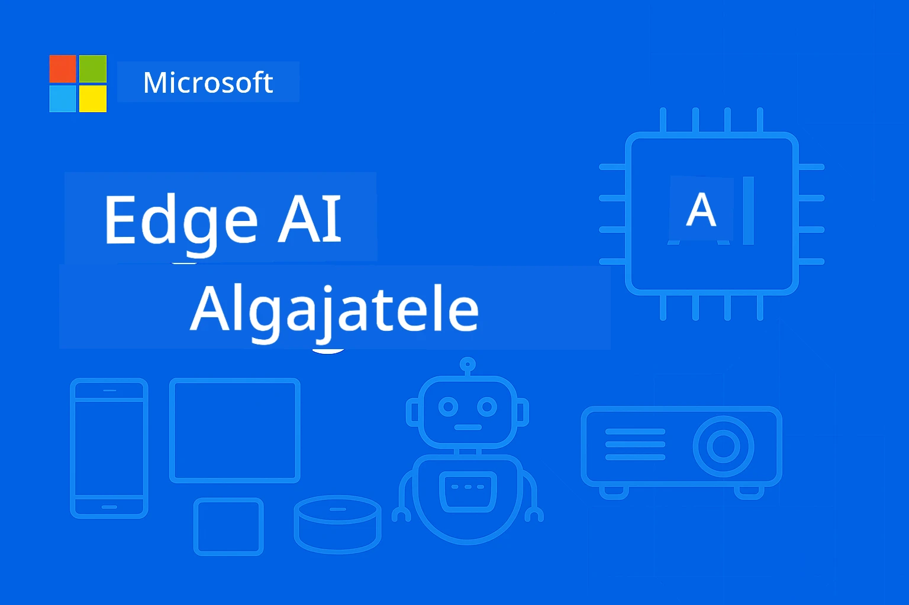

# EdgeAI Algajatele



[](https://GitHub.com/microsoft/edgeai-for-beginners/graphs/contributors)
[](https://GitHub.com/microsoft/edgeai-for-beginners/issues)
[](https://GitHub.com/microsoft/edgeai-for-beginners/pulls)
[](http://makeapullrequest.com)

[](https://GitHub.com/microsoft/edgeai-for-beginners/watchers)
[](https://GitHub.com/microsoft/edgeai-for-beginners/fork)
[](https://GitHub.com/microsoft/edgeai-for-beginners/stargazers)

[](https://discord.gg/nTYy5BXMWG)

Alustamiseks järgige neid samme, et kasutada neid ressursse:

1. **Harutage hoidla**: Klõpsake [](https://GitHub.com/microsoft/edgeai-for-beginners/fork)
2. **Kloonige hoidla**: `git clone https://github.com/microsoft/edgeai-for-beginners.git`
3. [**Liituge Azure AI Foundry Discordiga ja kohtuge ekspertide ning kaasarendajatega**](https://discord.com/invite/ByRwuEEgH4)

### 🌐 Mitmekeelne tugi

#### Toetatud GitHub Actioni kaudu (automaatne ja alati ajakohane)

<!-- CO-OP TRANSLATOR LANGUAGES TABLE START -->
[Araabia](../ar/README.md) | [Bengali](../bn/README.md) | [Bulgaaria](../bg/README.md) | [Birma (Myanmar)](../my/README.md) | [Hiina (lihtsustatud)](../zh-CN/README.md) | [Hiina (traditsiooniline, Hongkong)](../zh-HK/README.md) | [Hiina (traditsiooniline, Macau)](../zh-MO/README.md) | [Hiina (traditsiooniline, Taiwan)](../zh-TW/README.md) | [Horvaadi](../hr/README.md) | [Tšehhi](../cs/README.md) | [Taani](../da/README.md) | [Hollandi](../nl/README.md) | [Eesti](./README.md) | [Soome](../fi/README.md) | [Prantsuse](../fr/README.md) | [Saksa](../de/README.md) | [Kreeka](../el/README.md) | [Heebrea](../he/README.md) | [Hindi](../hi/README.md) | [Ungari](../hu/README.md) | [Indoneesia](../id/README.md) | [Itaalia](../it/README.md) | [Jaapani](../ja/README.md) | [Kannada](../kn/README.md) | [Korea](../ko/README.md) | [Leedu](../lt/README.md) | [Malai](../ms/README.md) | [Malajalami](../ml/README.md) | [Marathi](../mr/README.md) | [Nepali](../ne/README.md) | [Nigeeria pidžin](../pcm/README.md) | [Norra](../no/README.md) | [Pärsia (Farsi)](../fa/README.md) | [Poola](../pl/README.md) | [Portugali (Brasiilia)](../pt-BR/README.md) | [Portugali (Portugal)](../pt-PT/README.md) | [Pandžabi (Gurmukhi)](../pa/README.md) | [Rumeenia](../ro/README.md) | [Vene](../ru/README.md) | [Serbia (kirillitsa)](../sr/README.md) | [Slovakki](../sk/README.md) | [Sloveeni](../sl/README.md) | [Hispaania](../es/README.md) | [Suaheli](../sw/README.md) | [Rootsi](../sv/README.md) | [Tagalog (Filipino)](../tl/README.md) | [Tamil](../ta/README.md) | [Telugu](../te/README.md) | [Tai](../th/README.md) | [Türgi](../tr/README.md) | [Ukraina](../uk/README.md) | [Urdu](../ur/README.md) | [Vietnami](../vi/README.md)

> **Eelistate kloonimist kohaliku arvutisse?**

> See hoidla sisaldab üle 50 keele tõlkeid, mis suurendab oluliselt allalaaditavat mahtu. Tõlgeteta kloonimiseks kasutage haruldast checkouti:
> ```bash
> git clone --filter=blob:none --sparse https://github.com/microsoft/edgeai-for-beginners.git
> cd edgeai-for-beginners
> git sparse-checkout set --no-cone '/*' '!translations' '!translated_images'
> ```
> See annab teile kõik vajaliku kursuse läbimiseks palju kiirema allalaadimiskiirusega.
<!-- CO-OP TRANSLATOR LANGUAGES TABLE END -->

**Kui soovite, et toetataks lisatõlkelisi keeli, on need kirjas [siin](https://github.com/Azure/co-op-translator/blob/main/getting_started/supported-languages.md)**

## Sissejuhatus

Tere tulemast **EdgeAI algajatele** – teie põhjalikusse teekonda serva tehisintellekti muutvas maailmas. See kursus ühendab võimsad tehisintellekti võimalused praktilise ja reaalmaailma juurutusega servaseadmetel, võimaldades teil kasutada tehisintellekti potentsiaali otse seal, kus andmeid genereeritakse ja peab langetama otsuseid.

### Mida õpite

See kursus viib teid põhilistest mõistetest tootmiseklaarsesse rakendamisse, hõlmates:
- **Väikesed keelemudelid (SLM-id)**, mis on optimeeritud serva juurutuseks
- **Riistvarateadlik optimeerimine** erinevates platvormides
- **Reaalaegne järeldamine** privaatsust säilitavate võimalustega
- **Tootmise juurutamise strateegiad** ettevõtete rakendustele

### Miks EdgeAI on oluline

Edge AI tähistab paradigma muutust, mis lahendab kaasaegseid olulisi probleeme:
- **Privaatsus ja turvalisus**: Töötlege tundlikke andmeid kohapeal, ilma pilveteenust kasutamata
- **Reaalaegne jõudlus**: Vähendage võrgu latentsust ajakriitiliste rakenduste jaoks
- **Kuluefektiivsus**: vähendage läbilaskevõrgu ja pilvandmetöötluse kulusid
- **Vastupidav töö**: Säilitage funktsionaalsus võrguühenduse katkemise ajal
- **Regulatiivne vastavus**: Täitke andmete suveräänsuse nõuded

### Edge AI

Edge AI tähendab AI algoritmide ja keelemudelite käitamist kohalikult riistvaral, lähedal andmete tekkekohale, ilma pilvressursside järele sõltumata järelduste tegemisel. See vähendab latentsust, parandab privaatsust ja võimaldab reaalaegset otsustamist.

### Põhiprintsiibid:
- **Seadmes endas järeldamine**: AI mudelid töötavad servaseadmetel (telefonid, ruuterid, mikrojuhtplokid, tööstus-PC-d)
- **Võrguühenduseta võimalus**: Töötamine ilma pideva internetiühenduseta
- **Madal latentsus**: Kohesed vastused, sobivad reaalaegsetele süsteemidele
- **Andmete suveräänsus**: Tundlikud andmed jäävad kohapeale, parandades turvalisust ja vastavust

### Väikesed keelemudelid (SLMid)

SLMid nagu Phi-4, Mistral-7B ja Gemma on suuremate LLM-ide optimeeritud versioonid—treenitud või destilleeritud selleks, et saavutada:
- **Vähem mälu nõudlust**: Tõhus kasutus piiratud servaseadme mälus
- **Madalam arvutuskoormus**: Optimeeritud CPU ja serva GPU jõudluseks
- **Kiirem käivitusaeg**: Kiire initsialiseerimine reageerivate rakenduste jaoks

Need avavad võimsad NLP võimalused, samal ajal vastates piirangutele:
- **Sisse ehitatud süsteemid**: IoT seadmed ja tööstuslikud kontrollerid
- **Mobiilseadmed**: Nutitelefonid ja tahvelarvutid võrguühenduseta võimalustega
- **IoT-seadmed**: Andurid ja nutiseadmed piiratud ressurssidega
- **Serva serverid**: Kohalikud töötlemisseadmed piiratud GPU ressurssidega
- **Isiklikud arvutid**: Laua- ja sülearvutite juurutuse stsenaariumid

## Kursuse moodulid ja navigeerimine

| Moodul | Teema | Fookusala | Peamine sisu | Tase | Kestus |
|--------|-------|-----------|--------------|-------|---------|
| [📖 00 ](./introduction.md) | [Sissejuhatus EdgeAI-sse](./introduction.md) | Alused & kontekst | EdgeAI ülevaade • Tööstuse rakendused • SLM tutvustus • Õpieesmärgid | Algaja | 1-2 tundi |
| [📚 01](../../Module01) | [EdgeAI alused](./Module01/README.md) | Pilve ja serva AI võrdlus | EdgeAI alused • Reaalmaailma juhtumiuuringud • Rakendamise juhend • Serva juurutus | Algaja | 3-4 tundi |
| [🧠 02](../../Module02) | [SLMi mudelialused](./Module02/README.md) | Mudeliperekonnad ja arhitektuur | Phi perekond • Qwen perekond • Gemma perekond • BitNET • μModel • Phi-Silica | Algaja | 4-5 tundi |
| [🚀 03](../../Module03) | [SLMi juurutamise praktika](./Module03/README.md) | Kohalik ja pilve juurutus | Täiendõpe • Kohalik keskkond • Pilve juurutus | Kesktase | 4-5 tundi |
| [⚙️ 04](../../Module04) | [Mudeliteni optimeerimise tööriistakast](./Module04/README.md) | Platvormideülese optimeerimise tööriistad | Sissejuhatus • Llama.cpp • Microsoft Olive • OpenVINO • Apple MLX • Töövoo süntees | Kesktase | 5-6 tundi |
| [🔧 05](../../Module05) | [SLMOps tootmises](./Module05/README.md) | Tootmisoperatsioonid | SLMOps sissejuhatus • Mudeli destilleerimine • Peenhäälestus • Tootminejuurutus | Edasijõudnu | 5-6 tundi |
| [🤖 06](../../Module06) | [AI agendid ja funktsiooni kutsumine](./Module06/README.md) | Agendiraamistikud ja MCP | Agentide sissejuhatus • Funktsioonikutsumine • Mudeli konteksti protokoll | Edasijõudnu | 4-5 tundi |
| [💻 07](../../Module07) | [Platvormi rakendamine](./Module07/README.md) | Platvormideülesed näited | AI tööriistakast • Foundry Local • Windowsi arendus | Edasijõudnu | 3-4 tundi |
| [🏭 08](../../Module08) | [Foundry Local tööriistakast](./Module08/README.md) | Tootmiseks valmis näited | Näidisrakendused (vt allpool üksikasju) | Ekspert | 8-10 tundi |

### 🏭 **Moodul 08: Näidisrakendused**

- [01: REST Chat Quickstart](./Module08/samples/01/README.md)
- [02: OpenAI SDK integreerimine](./Module08/samples/02/README.md)
- [03: Mudeli avastamine ja võrdlus](./Module08/samples/03/README.md)
- [04: Chainlit RAG rakendus](./Module08/samples/04/README.md)
- [05: Mitmeagendi orkestreerimine](./Module08/samples/05/README.md)
- [06: Mudelitena tööriistade marsruuter](./Module08/samples/06/README.md)
- [07: Otsene API klient](./Module08/samples/07/README.md)
- [08: Windows 11 vestlusrakendus](./Module08/samples/08/README.md)
- [09: Täiustatud mitmeagendi süsteem](./Module08/samples/09/README.md)
- [10: Foundry tööriistade raamistik](./Module08/samples/10/README.md)

### 🎓 **Töötoa praktiline õppekava**

Põhjalikud praktilised töötoa materjalid tootmiseks valmis rakendustega:

- **[Töötoa juhend](./Workshop/Readme.md)** – Täielikud õpieesmärgid, tulemused ja ressursi navigeerimine
- **Python näited** (6 sessiooni) – Uuendatud parimate tavade, vigade käsitluse ja põhjaliku dokumentatsiooniga
- **Jupyter märkmikud** (8 interaktiivset) – Samm-sammult juhendid koos võrdluste ja jõudlust jälgivate tööriistadega
- **Sessioonide juhendid** – Üksikasjalikud markdown juhendid iga töötoa sessiooni jaoks
- **Kinnitusvahendid** – Skriptid koodi kvaliteedi kontrollimiseks ja suitsutestide läbiviimiseks

**Mida te ehitate:**
- Kohalikud AI vestlusrakendused voogedastuse toe ja
- RAG-liinid kvaliteedihinnanguga (RAGAS)
- Mitme mudeli võrdlus- ja hindamistööriistad
- Mitmeagendi orkestreerimissüsteemid
- Nutikas mudelite marsruutimine ülesandepõhise valikuga

### 🎙️ **Töötuba Agentic jaoks: Praktiline – AI podcast stuudio**

Ehitage AI-toega podcasti tootmisliin algusest peale! See kaasahaarav töötuba õpetab teid looma täieliku mitmeagendi süsteemi, mis muudab ideed professionaalseteks podcasti episoodideks.
**[🎬 Alusta AI Podcast Studio töötuba](./WorkshopForAgentic/README.md)**

**Sinu missioon**: Käivita "Future Bytes" — täiesti AI agentide poolt juhitav tehnoloogia podcast, mille ehitad ise. Ei mingit pilvevajadust, ei API-kulusid — kõik töötab lokaalselt sinu masinas.

**Mis teeb selle unikaalseks:**
- **🤖 Tõeline mitme agendi orkestreerimine** – Ehita spetsialiseerunud AI agente, kes teevad uurimistööd, kirjutavad ja toodavad audio
- **🎯 Täielik tootmisliin** – Alates teema valimisest kuni lõpliku podcasti helifailini
- **💻 100% lokaalne juurutus** – Kasutab Ollamat ja kohalikke mudeleid (Qwen-3-8B) täis privaatsuse ja kontrolli jaoks
- **🎤 Tekst kõneks integratsioon** – Muudab käsikirjad loomulikult kõlavateks mitme kõnelejaga vestlusteks
- **✋ Inimene protsessis** – Heakskiitmise väravad kindlustavad kvaliteedi ja säilitavad automatiseerimise

**Kolme vaatuse õppeprogramm:**

| Vaatus | Fookus | Peamised oskused | Kestus |
|-----|-------|------------|----------|
| **[Vaatus 1: Tutvu oma AI assistentidega](./WorkshopForAgentic/md/01.BuildAIAgentWithSLM.md)** | Ehita esimene AI agent | Tööriistade integratsioon • Veebipõhine otsing • Probleemide lahendamine • Agendi mõtlemine | 2-3 tundi |
| **[Vaatus 2: Koosta tootmismeeskond](./WorkshopForAgentic/md/02.AIAgentOrchestrationAndWorkflows.md)** | Orkestreeri mitut agenti | Meeskonna koordineerimine • Heakskiitmisprotsessid • DevUI liides • Inimese järelevalve | 3-4 tundi |
| **[Vaatus 3: Too oma podcast ellu](./WorkshopForAgentic/md/03.Multi-SpeakerPodcastGenerationWithVibeVoice.md)** | Genereeri podcasti heli | Tekst kõneks • Mitme kõnelejaga süntees • Pikk audio • Täielik automatiseerimine | 2-3 tundi |

**Kasutatavad tehnoloogiad:**
- **Microsoft Agent Framework** – Mitme agendi orkestreerimine ja koordineerimine
- **Ollama** – Kohalik AI mudelikeskkond (pilvi ei nõuta)
- **Qwen-3-8B** – Avatud lähtekoodiga keeltemudel, optimeeritud agentide ülesannetele
- **Tekst kõneks API-d** – Loomulik hääle süntees podcasti genereerimiseks

**Riistvara tugi:**
- ✅ **CPU režiim** – Töötab igas kaasaegses arvutis (soovitatav 8GB+ RAM)
- 🚀 **GPU kiirendus** – Märgatavalt kiirem töö NVIDIA/AMD GPU-dega
- ⚡ **NPU tugi** – Järgmise põlvkonna närvivõrgu töötlemise kiirendus

**Ideaalne:**
- Arendajatele, kes õpivad mitme-agendi AI süsteeme
- Kõikidele, keda huvitab AI automatiseerimine ja töövood
- Sisuloojatele, kes uurivad AI-toega tootmist
- Üliõpilastele, kes õpivad praktilisi AI orkestreerimise mustreid

**Alusta ehitamist**: [🎙️ AI Podcast Studio töötuba →](./WorkshopForAgentic/README.md)

### 📊 **Õpperaja kokkuvõte**
- **Kogu kestus**: 36-45 tundi
- **Algajate rada**: Moodulid 01-02 (7-9 tundi)  
- **Kesktasemele rada**: Moodulid 03-04 (9-11 tundi)
- **Edasijõudnute rada**: Moodulid 05-07 (12-15 tundi)
- **Eksperdi rada**: Moodul 08 (8-10 tundi)

## Mida sa ehitad

### 🎯 Põhioskused
- **Edge AI arhitektuur**: Kujunda lokaalseesmärgil AI süsteeme pilve integratsiooniga
- **Mudeliparandamine**: Kvantiseeri ja tihenda mudeleid Edge juurutuseks (85% kiirendus, 75% suuruse vähendus)
- **Mitmeplatvormiline juurutus**: Windows, mobiil, sisse ehitatud ja pilve-äärte hübriidsüsteemid
- **Tootmisoperatsioonid**: Monitooring, skaleerimine ja Edge AI tootmiskeskkonna hooldus

### 🏗️ Praktilised projektid
- **Foundry Local vestlusrakendused**: Windows 11 natiivrakendus mudelite vahetamisega
- **Mitme-agendi süsteemid**: Koordinaator spetsialistagentidega keerukate töövoogude jaoks  
- **RAG rakendused**: Kohalik dokumentide töötlemine ja vektorotsing
- **Mudelivalijad**: Intelligentne mudelite valik ülesande analüüsi põhjal
- **API raamistikud**: Tootmisvalmis kliendid voogedastuse ja tervisekontrolliga
- **Platvormideülene tööriistad**: LangChain/Semantic Kernel integratsioonimustrid

### 🏢 Tööstuse rakendused
**Tootmine** • **Tervishoid** • **Autonoomsed sõidukid** • **Nutilarinnad** • **Mobiilirakendused**

## Kiire algus

**Soovitatud õpperada** (kokku 20-30 tundi):

0. **📖 Sissejuhatus** ([Introduction.md](./introduction.md)): EdgeAI põhitõed + tööstuse kontekst + õpiraamistik
1. **📚 Alused** (moodulid 01-02): EdgeAI mõisted + SLM mudelite pered
2. **⚙️ Optimeerimine** (moodulid 03-04): Juurutus + kvantiseerimise raamistikud  
3. **🚀 Tootmine** (moodulid 05-06): SLMOps + AI agendid + funktsioonikõned
4. **💻 Rakendamine** (moodulid 07-08): Platvorminäited + Foundry Local tööriistakomplekt

Igas moodulis on teooria, praktilised harjutused ja tootmisvalmis koodinäited.

## Karjääri mõju

**Tehnilised rollid**: EdgeAI lahenduste arhitekt • ML insener (Edge) • IoT AI arendaja • Mobiilne AI arendaja

**Tööstusharud**: Tootmine 4.0 • Tervishoiutehnoloogia • Autonoomsed süsteemid • FinTech • Tarbekaupad

**Portfooliorakendused**: Mitme-agendi süsteemid • Tootmis-RAG rakendused • Platvormideülene juurutus • Jõudluse optimeerimine

## Repositsiooni struktuur

```
edgeai-for-beginners/
├── 📖 introduction.md  # Foundation: EdgeAI Overview & Learning Framework
├── 📚 Module01-04/     # Fundamentals → SLMs → Deployment → Optimization  
├── 🔧 Module05-06/     # SLMOps → AI Agents → Function Calling
├── 💻 Module07/        # Platform Samples (VS Code, Windows, Jetson, Mobile)
├── 🏭 Module08/        # Foundry Local Toolkit + 10 Comprehensive Samples
│   ├── samples/01-06/  # Foundation: REST, SDK, RAG, Agents, Routing
│   └── samples/07-10/  # Advanced: API Client, Windows App, Enterprise Agents, Tools
├── 🌐 translations/    # Multi-language support (8+ languages)
└── 📋 STUDY_GUIDE.md   # Structured learning paths & time allocation
```

## Kursuse olulised punktid

✅ **Järk-järguline õppimine**: teooria → praktika → tootmisjuurutus  
✅ **Tõelised juhtumiuuringud**: Microsoft, Japan Airlines, ettevõtete lahendused  
✅ **Praktilised näited**: 50+ näidet, 10 põhjalikku Foundry Local demo  
✅ **Jõudluse fookus**: 85% kiiruse paranemised, 75% suuruse vähendused  
✅ **Mitmeplatvormiline**: Windows, mobiil, sisse ehitatud, pilv-äär hübriid  
✅ **Tootmisvalmis**: monitooring, skaleerimine, turvalisus, nõuetele vastavus

📖 **[Õppejuhend saadaval](STUDY_GUIDE.md)**: Struktureeritud 20-tunnine õpperada aja planeerimise ja enesehindamise tööriistadega.

---

**EdgeAI on AI juurutamise tulevik**: lokaalseesmärk, privaatsust kaitsev ja tõhus. Oma osa nendes oskustes omandades ehitad järgmise põlvkonna nutikaid rakendusi.

## Teised kursused

Meie meeskond toodab teisigi kursuseid! Vaata:

<!-- CO-OP TRANSLATOR OTHER COURSES START -->
### LangChain
[](https://aka.ms/langchain4j-for-beginners)
[](https://aka.ms/langchainjs-for-beginners?WT.mc_id=m365-94501-dwahlin)
[](https://github.com/microsoft/langchain-for-beginners?WT.mc_id=m365-94501-dwahlin)
---

### Azure / Edge / MCP / Agentid
[](https://github.com/microsoft/AZD-for-beginners?WT.mc_id=academic-105485-koreyst)
[](https://github.com/microsoft/edgeai-for-beginners?WT.mc_id=academic-105485-koreyst)
[](https://github.com/microsoft/mcp-for-beginners?WT.mc_id=academic-105485-koreyst)
[](https://github.com/microsoft/ai-agents-for-beginners?WT.mc_id=academic-105485-koreyst)

---
 
### Generatiivne AI seeria
[](https://github.com/microsoft/generative-ai-for-beginners?WT.mc_id=academic-105485-koreyst)
[-9333EA?style=for-the-badge&labelColor=E5E7EB&color=9333EA)](https://github.com/microsoft/Generative-AI-for-beginners-dotnet?WT.mc_id=academic-105485-koreyst)
[-C084FC?style=for-the-badge&labelColor=E5E7EB&color=C084FC)](https://github.com/microsoft/generative-ai-for-beginners-java?WT.mc_id=academic-105485-koreyst)
[-E879F9?style=for-the-badge&labelColor=E5E7EB&color=E879F9)](https://github.com/microsoft/generative-ai-with-javascript?WT.mc_id=academic-105485-koreyst)

---
 
### Põhiõpe
[](https://aka.ms/ml-beginners?WT.mc_id=academic-105485-koreyst)
[](https://aka.ms/datascience-beginners?WT.mc_id=academic-105485-koreyst)
[](https://aka.ms/ai-beginners?WT.mc_id=academic-105485-koreyst)
[](https://github.com/microsoft/Security-101?WT.mc_id=academic-96948-sayoung)
[](https://aka.ms/webdev-beginners?WT.mc_id=academic-105485-koreyst)
[](https://aka.ms/iot-beginners?WT.mc_id=academic-105485-koreyst)
[](https://github.com/microsoft/xr-development-for-beginners?WT.mc_id=academic-105485-koreyst)

---
 
### Copilot seeria
[](https://aka.ms/GitHubCopilotAI?WT.mc_id=academic-105485-koreyst)
[](https://github.com/microsoft/mastering-github-copilot-for-dotnet-csharp-developers?WT.mc_id=academic-105485-koreyst)
[](https://github.com/microsoft/CopilotAdventures?WT.mc_id=academic-105485-koreyst)
<!-- CO-OP TRANSLATOR OTHER COURSES END -->

## Abi saamine

Kui jääd kinni või sul on küsimusi AI-rakenduste loomise kohta, liitu:

[](https://discord.gg/nTYy5BXMWG)

Kui sul on toote tagasisidet või ehitamisel esineb vigu, külastage:

[](https://aka.ms/foundry/forum)

---

<!-- CO-OP TRANSLATOR DISCLAIMER START -->
**Vastutusest loobumine**:
See dokument on tõlgitud kasutades tehisintellektil põhinevat tõlketeenust [Co-op Translator](https://github.com/Azure/co-op-translator). Kuigi püüame tagada täpsust, palun arvestage, et automaatsed tõlked võivad sisaldada vigu või ebatäpsusi. Originaaldokument selle emakeeles tuleks pidada autoriteetseks allikaks. Olulise teabe puhul soovitatakse kasutada professionaalset inimtõlget. Me ei vastuta selle tõlke kasutamisest tulenevate arusaamatuste või valesti mõistmiste eest.
<!-- CO-OP TRANSLATOR DISCLAIMER END -->