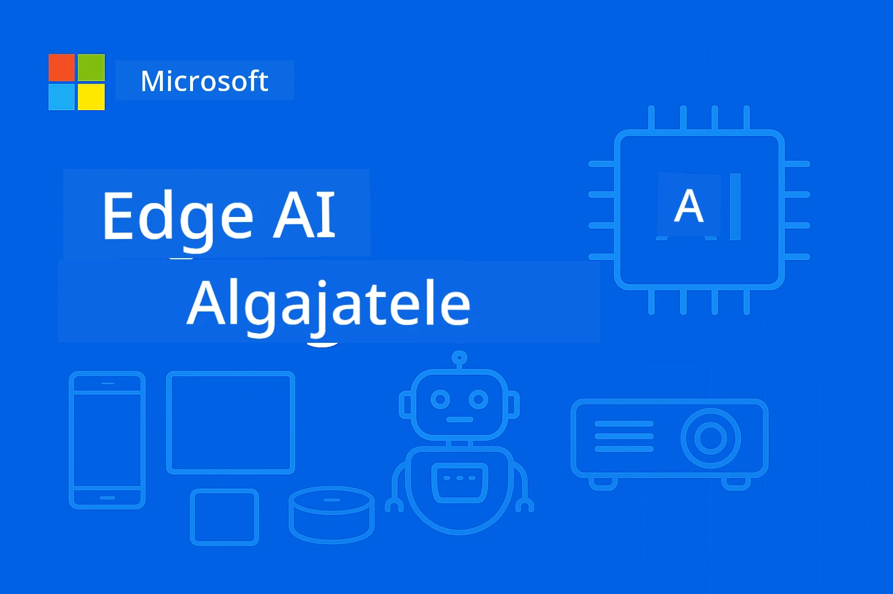

# EdgeAI algajatele




[](https://GitHub.com/microsoft/edgeai-for-beginners/graphs/contributors)
[](https://GitHub.com/microsoft/edgeai-for-beginners/issues)
[](https://GitHub.com/microsoft/edgeai-for-beginners/pulls)
[](http://makeapullrequest.com)

[](https://GitHub.com/microsoft/edgeai-for-beginners/watchers)
[](https://GitHub.com/microsoft/edgeai-for-beginners/fork)
[](https://GitHub.com/microsoft/edgeai-for-beginners/stargazers)


[](https://discord.gg/nTYy5BXMWG)

Järgige neid samme, et alustada nende ressursidega töötamist:

1. **Forkige hoidla**: Klõpsake [](https://GitHub.com/microsoft/edgeai-for-beginners/fork)
2. **Kloonige hoidla**: `git clone https://github.com/microsoft/edgeai-for-beginners.git`
3. [**Liituge Azure AI Foundry Discordiga ja kohtuge ekspertide ning kaasarendajatega**](https://discord.com/invite/ByRwuEEgH4)


### 🌐 Mitmekeelne tugi

#### Toetatud GitHub Actioni kaudu (automatiseeritud ja alati ajakohane)

<!-- CO-OP TRANSLATOR LANGUAGES TABLE START -->
[Araabia](../ar/README.md) | [Bengali](../bn/README.md) | [Bulgaaria](../bg/README.md) | [Burma (Myanmar)](../my/README.md) | [Hiina (lihtsustatud)](../zh-CN/README.md) | [Hiina (traditsiooniline, Hongkong)](../zh-HK/README.md) | [Hiina (traditsiooniline, Macau)](../zh-MO/README.md) | [Hiina (traditsiooniline, Taiwan)](../zh-TW/README.md) | [Horvaadi](../hr/README.md) | [Tšehhi](../cs/README.md) | [Taani](../da/README.md) | [Hollandi](../nl/README.md) | [Eesti](./README.md) | [Soome](../fi/README.md) | [Prantsuse](../fr/README.md) | [Saksa](../de/README.md) | [Kreeka](../el/README.md) | [Heebrea](../he/README.md) | [Hindi](../hi/README.md) | [Ungari](../hu/README.md) | [Indoneesia](../id/README.md) | [Itaalia](../it/README.md) | [Jaapani](../ja/README.md) | [Kannada](../kn/README.md) | [Khmeri](../km/README.md) | [Korea](../ko/README.md) | [Leedu](../lt/README.md) | [Malai](../ms/README.md) | [Malajalami](../ml/README.md) | [Marathi](../mr/README.md) | [Nepali](../ne/README.md) | [Nigeeria pidžin](../pcm/README.md) | [Norra](../no/README.md) | [Pärsia (Farsi)](../fa/README.md) | [Poola](../pl/README.md) | [Portugali (Brasiilia)](../pt-BR/README.md) | [Portugali (Portugal)](../pt-PT/README.md) | [Pandžabi (Gurmukhi)](../pa/README.md) | [Rumeenia](../ro/README.md) | [Vene](../ru/README.md) | [Serbia (kirilitsa)](../sr/README.md) | [Slovaki](../sk/README.md) | [Slaavi](../sl/README.md) | [Hispaania](../es/README.md) | [Suahiili](../sw/README.md) | [Rootsi](../sv/README.md) | [Tagalogi (filipino)](../tl/README.md) | [Tamili](../ta/README.md) | [Telugu](../te/README.md) | [Tai keel](../th/README.md) | [Türgi](../tr/README.md) | [Ukraina](../uk/README.md) | [Urdu](../ur/README.md) | [Vietnam](../vi/README.md)

> **Eelistate kohalikku kloonimist?**
>
> See hoidla sisaldab üle 50 keele tõlkeid, mis suurendab oluliselt allalaadimise mahtu. Kui soovite kloonida ilma tõlgeteta, kasutage harva kloonimist:
>
> **Bash / macOS / Linux:**
> ```bash
> git clone --filter=blob:none --sparse https://github.com/microsoft/edgeai-for-beginners.git
> cd edgeai-for-beginners
> git sparse-checkout set --no-cone '/*' '!translations' '!translated_images'
> ```
>
> **CMD (Windows):**
> ```cmd
> git clone --filter=blob:none --sparse https://github.com/microsoft/edgeai-for-beginners.git
> cd edgeai-for-beginners
> git sparse-checkout set --no-cone "/*" "!translations" "!translated_images"
> ```
>
> See annab teile kõik vajaliku kursuse läbimiseks palju kiirema allalaadimisega.
<!-- CO-OP TRANSLATOR LANGUAGES TABLE END -->

**Kui soovite lisada täiendavaid toetatavaid tõlkekeeli, on need loetletud [siin](https://github.com/Azure/co-op-translator/blob/main/getting_started/supported-languages.md)**
## Sissejuhatus

Tere tulemast **EdgeAI algajatele** – teie põhjalik teekond Edge tehisintellekti muutvasse maailma. See kursus ühendab võimsate AI võimete ja praktilise, reaalse maailma kasutuselevõtu servaseadmetel, võimaldades teil kasutusele võtta AI potentsiaali otse seal, kus andmeid genereeritakse ja otsuseid tuleb langetada.

### Mida te valdate

See kursus viib teid põhimõistetest tootmistasemel rakendusteni, hõlmates:
- **Väikesed keelmudelid (SLM-id)**, mis on optimeeritud servas kasutamiseks
- **Riistvarateadlik optimeerimine** erinevatel platvormidel
- **Reaalajas ennustamine** privaatsust kaitsvate võimekustega
- **Tootmisse juurutamise strateegiad** ettevõtete rakenduste jaoks

### Miks EdgeAI on oluline

Edge AI esindab paradigmat muutust, mis lahendab olulisi tänapäeva väljakutseid:
- **Privaatsus ja turvalisus**: Töötle tundlikke andmeid kohapeal pilvest sõltumata
- **Reaalajas jõudlus**: Vähenda võrgu latentsust aja-kriitiliste rakenduste puhul
- **Kulu efektiivsus**: Vähenda ribalaiust ja pilvteenuste kulusid
- **Vastupidavad toimingud**: Säilita funktsionaalsus võrguühenduse puudumisel
- **Õiguskaalutus**: Tolereeri andmevõimu nõudeid

### Edge AI

Edge AI tähendab AI algoritmide ja keelemudelite töötamist kohalikul riistvaral, otse seal kus andmed sünnivad, ilma pilvressurssideta ennustamiseks. See vähendab latentsust, parandab privaatsust ja lubab reaalajas otsuseid teha.

### Põhiprintsiibid:
- **Seadmesisesed ennustused**: AI mudelid töötavad servaseadmetes (telefonid, ruuterid, mikrokontrollerid, tööstuslikud arvutid)
- **Võrguvaba võimekus**: Töötamine ilma pideva internetiühenduseta
- **Madal latentsus**: Kohesed vastused, sobilik reaalajas süsteemidele
- **Andmete võimususe tagamine**: Tundlikud andmed jäävad kohalikuks, parandades turvalisust ja vastavust

### Väikesed keelmudelid (SLM-id)

SLM-id nagu Phi-4, Mistral-7B ja Gemma on suuremate LLM-ide optimeeritud versioonid — treenitud või destilleeritud:
- **Vähenenud mälukasutus**: Tõhusaid piiratud servaseadme mälu kasutamine
- **Väiksem arvutusnõudlus**: Optimeeritud CPU ja serva GPU jõudlusele
- **Kiirem käivitusaeg**: Kiire initsialiseerimine reageerivate rakenduste jaoks

Nad avavad võimsad NLP võimalused, vastates piirangutele:
- **Sisse ehitatud süsteemid**: IoT seadmed ja tööstuslikud kontrollerid
- **Mobiilsed seadmed**: Nutitelefonid ja tahvelarvutid võrguvaba võimekusega
- **IoT seadmed**: Andurid ja nutiseadmed piiratud ressurssidega
- **Serva serverid**: Kohalikud töötlusüksused piiratud GPU ressurssidega
- **Isiklikud arvutid**: Laua- ja sülearvuti juurutuse stsenaariumid

## Kursuse moodulid ja navigeerimine

| Moodul | Teema | Fookusala | Peamine sisu | Tase | Kestus |
|--------|-------|------------|-------------|--------|----------|
| [📖 00 ](./introduction.md) | [Sissejuhatus EdgeAI-sse](./introduction.md) | Alused ja kontekst | EdgeAI ülevaade • Tööstuse rakendused • SLM tutvustus • Õpieesmärgid | Algaja | 1-2 tundi |
| [📚 01](../../Module01) | [EdgeAI põhialused](./Module01/README.md) | Pilv vs serv AI võrdlus | EdgeAI põhialused • Reaalse maailma juhtumiuuringud • Rakendamisjuhend • Servas juurutamine | Algaja | 3-4 tundi |
| [🧠 02](../../Module02) | [SLM mudeli alused](./Module02/README.md) | Mudeliperekonnad ja arhitektuur | Phi perekond • Qwen perekond • Gemma perekond • BitNET • μModel • Phi-Silica | Algaja | 4-5 tundi |
| [🚀 03](../../Module03) | [SLM juurutamise praktika](./Module03/README.md) | Kohalik ja pilve juurutamine | Täiustatud õppimine • Kohalik keskkond • Pilve juurutamine | Kesktase | 4-5 tundi |
| [⚙️ 04](../../Module04) | [Mudeli optimeerimise tööriistakomplekt](./Module04/README.md) | Platvormideülene optimeerimine | Sissejuhatus • Llama.cpp • Microsoft Olive • OpenVINO • Apple MLX • Töövoo süntees | Kesktase | 5-6 tundi |
| [🔧 05](../../Module05) | [SLMOps tootmine](./Module05/README.md) | Tootmisoperatsioonid | SLMOps tutvustus • Mudeli destilleerimine • Täpsustamine • Tootmise juurutamine | Edasijõudnud | 5-6 tundi |
| [🤖 06](../../Module06) | [AI agendid ja funktsioonikõne](./Module06/README.md) | Agendiraamistikud ja MCP | Agendi tutvustus • Funktsioonikõne • Mudeli konteksti protokoll | Edasijõudnud | 4-5 tundi |
| [💻 07](../../Module07) | [Platvormi rakendus](./Module07/README.md) | Platvormideülene näidisd töö | AI tööriistakomplekt • Foundry Local • Windowsi arendus | Edasijõudnud | 3-4 tundi |
| [🏭 08](../../Module08) | [Foundry Local tööriistakomplekt](./Module08/README.md) | Tootmisvalmis näited | Näidisarendused (vt allpool üksikasju) | Ekspert | 8-10 tundi |

### 🏭 **Moodul 08: Näidisarendused**

- [01: REST Chat kiire algus](./Module08/samples/01/README.md)
- [02: OpenAI SDK integreerimine](./Module08/samples/02/README.md)
- [03: Mudeli avastamine ja võrdlustestimine](./Module08/samples/03/README.md)
- [04: Chainlit RAG rakendus](./Module08/samples/04/README.md)
- [05: Mitme-agendi orkestreerimine](./Module08/samples/05/README.md)
- [06: Mudelid tööriistadena ruuter](./Module08/samples/06/README.md)
- [07: Otsene API klient](./Module08/samples/07/README.md)
- [08: Windows 11 vestlusrakendus](./Module08/samples/08/README.md)
- [09: Täiustatud mitme-agendi süsteem](./Module08/samples/09/README.md)
- [10: Foundry tööriistade raamistik](./Module08/samples/10/README.md)

### 🎓 **Töötoa praktiline õpperada**

Põhjalikud praktilised töötoamaterjalid tootmisvalmis rakendustega:

- **[Töötoa juhend](./Workshop/Readme.md)** - Täielikud õpieesmärgid, tulemused ja ressursside navigeerimine
- **Python näited** (6 sessiooni) - Uuendatud parimate tavade, vigade käsitluse ja põhjaliku dokumentatsiooniga
- **Jupyter märkmikud** (8 interaktiivset) - Samm-sammult õpetused koos võrdlustulemuste ja jõudlusmonitooringuga
- **Sessiooni juhendid** - Üksikasjalikud markdown juhendid iga töötoa sessiooni jaoks
- **Valideerimise tööriistad** - Skriptid koodi kvaliteedi kontrollimiseks ja suitsutestimiseks

**Mida te ehitate:**
- Kohalikud AI vestlusrakendused voogedastuse toega
- RAG torujuhtmed kvaliteedi hindamisega (RAGAS)
- Mitme mudeli võrdlus- ja benchmark-tööriistad
- Mitme-agendi orkestreerimissüsteemid
- Tark mudeli marsruutimine ülesandepõhise valikuga

### 🎙️ **Agentile töötoa praktiline õpe - AI Podcast Stuudio**
Ehita algusest lõpuni tehisintellektil põhinev podcast'i tootmise torujuhe! See kaasahaarav töötuba õpetab sind looma terve mitmeagendi süsteemi, mis muudab ideed professionaalseteks podcast'i saadeteks.

**[🎬 Alusta AI Podcast Studio töötoaga](./WorkshopForAgentic/README.md)**

**Sinu ülesanne**: Käivita "Future Bytes" — tehnikapodcast, mida juhivad täielikult sinu enda loodud AI agendid. Ilma pilve sõltuvusteta, ilma API kuludeta — kõik jookseb lokaalselt sinu masinas.

**Mis teeb selle ainulaadseks:**
- **🤖 Reaalne mitmeagendi orkestreerimine** - ehita spetsialiseeritud AI agente, kes teevad uurimistööd, kirjutavad ja toodavad heli
- **🎯 Täielik tootmistorujuhe** - alates teema valikust kuni lõpliku podcast'i helifailini
- **💻 100% lokaalne juurutus** - kasutab Ollamat ja kohalikke mudeleid (Qwen-3-8B) täielikuks privaatsuseks ja kontrolliks
- **🎤 Tekst kõneks integreerimine** - muuda käsikirjad loomulikku kõlavateks mitmele esitusele tugevdavateks vestlusteks
- **✋ Inimene protsessis töövood** - kinnituspunktid tagavad kvaliteedi ja säilitavad automatiseerimise

**Kolme-vaatuseline õpirännak:**

| Vaatus | Fookus | Peamised oskused | Kestus |
|-----|-------|------------|----------|
| **[Vaatus 1: Kohtu oma AI assistentidega](./WorkshopForAgentic/md/01.BuildAIAgentWithSLM.md)** | Ehita oma esimene AI agent | Tööriista integratsioon • Veebiotsing • Probleemide lahendamine • Agendi mõtlemine | 2-3 tundi |
| **[Vaatus 2: Koosta oma tootmismeeskond](./WorkshopForAgentic/md/02.AIAgentOrchestrationAndWorkflows.md)** | Orkestreeri mitut agenti | Meeskonna koordineerimine • Kinnitustöövood • DevUI liides • Inimjärelevalve | 3-4 tundi |
| **[Vaatus 3: Too oma podcast ellu](./WorkshopForAgentic/md/03.Multi-SpeakerPodcastGenerationWithVibeVoice.md)** | Genereeri podcast'i heli | Tekst kõneks • Mitme esineja süntees • Pika vormi heli • Täielik automatiseerimine | 2-3 tundi |

**Kasutatud tehnoloogiad:**
- **Microsoft Agent Framework** - mitmeagendi orkestreerimine ja koordineerimine
- **Ollama** - lokaalne AI mudelite jooksutamiskeskkond (ilma pilveta)
- **Qwen-3-8B** - avatud lähtekoodiga keeltemudel, optimeeritud agentide ülesannete jaoks
- **Tekst kõneks API-d** - loomuliku hääle süntees podcast'i genereerimiseks

**Riistvara tugi:**
- ✅ **CPU režiim** - töötab igal kaasaegsel arvutil (soovitatav 8GB+ RAM)
- 🚀 **GPU kiirendus** - märgatavalt kiirem järeldamine NVIDIA/AMD graafikakaartidega
- ⚡ **NPU tugi** - järgmise põlvkonna närvivõrgu kiirendus

**Ideaalne:**
- Arendajatele, kes õpivad mitmeagendi AI süsteeme
- Kõigile, kes on huvitatud AI automatiseerimisest ja töövoogudest
- Sisu loojaile, kes uurivad AI abi tootmist
- Üliõpilastele, kes õpivad praktilisi AI orkestreerimise mustreid

**Alusta ehitamist**: [🎙️ AI Podcast Studio töötuba →](./WorkshopForAgentic/README.md)

### 📊 **Õpiteekonna kokkuvõte**
- **Kogukestus**: 36-45 tundi
- **Algaja tee**: Moodulid 01-02 (7-9 tundi)  
- **Kesktase**: Moodulid 03-04 (9-11 tundi)
- **Edasijõudnu tee**: Moodulid 05-07 (12-15 tundi)
- **Ekspertteekond**: Moodul 08 (8-10 tundi)

## Mida sa ehitad

### 🎯 Põhioskused
- **Edge AI arhitektuur**: disaini lokaalset-laadi AI süsteeme pilve integratsiooniga
- **Mudeli optimeerimine**: kvantiseeri ja suru mudeleid edge juurutuseks (85% kiirendust, 75% mahtude vähenemist)
- **Mitme platvormi juurutus**: Windows, mobiil, sissejäetavad ja pilve-edge hübriidsüsteemid
- **Tootmise operatsioonid**: edge AI jälgimine, skaleerimine ja hooldus

### 🏗️ Praktilised projektid
- **Foundry Local Chat rakendused**: Windows 11 natiivrakendus mudelite vahetamisega
- **Mitme-agendi süsteemid**: koordinaator koos spetsialistagentidega keerukate töövoogude jaoks  
- **RAG rakendused**: kohalik dokumentide töötlemine vektorotsinguga
- **Mudeli marsruuterid**: nutikas valik mudelite vahel ülesande analüüsi põhjal
- **API raamistikud**: tootmisvalmis kliendid voogedastuse ja tervisekontrolliga
- **Platvormideülene tööriistad**: LangChain/Semantic Kernel integratsioonimustrid

### 🏢 Tööstusharu rakendused
**Tootmine** • **Tervishoid** • **Autonoomsed sõidukid** • **Nutilised linnad** • **Mobiilirakendused**

## Kiire alustamine

**Soovitatav õpitee** (kokku 20-30 tundi):

0. **📖 Sissejuhatus** ([Introduction.md](./introduction.md)): EdgeAI alus + tööstuse kontekst + õpiraamistik
1. **📚 Alused** (Moodulid 01-02): EdgeAI mõisted + SLM mudeliperekonnad
2. **⚙️ Optimeerimine** (Moodulid 03-04): Juurutus + kvantimise raamistikud  
3. **🚀 Tootmine** (Moodulid 05-06): SLMOps + AI agendid + funktsioonide kutsumine
4. **💻 Teostus** (Moodulid 07-08): platvorminäited + Foundry Local tööriistakast

Igas moodulis on teooria, praktilised harjutused ja tootmisvalmis koodinäited.

## Karjääri mõju

**Tehnilised rollid**: EdgeAI lahenduste arhitekt • ML insener (Edge) • IoT AI arendaja • Mobiili AI arendaja

**Tööstusharud**: Tootmine 4.0 • Tervishoiutehnoloogia • Autonoomsed süsteemid • FinTech • Tarbeelektroonika

**Portfoolio projektid**: mitmeagendi süsteemid • tootmise RAG rakendused • platvormideülene juurutus • jõudluse optimeerimine

## Repositsiooni struktuur

```
edgeai-for-beginners/
├── 📖 introduction.md  # Foundation: EdgeAI Overview & Learning Framework
├── 📚 Module01-04/     # Fundamentals → SLMs → Deployment → Optimization  
├── 🔧 Module05-06/     # SLMOps → AI Agents → Function Calling
├── 💻 Module07/        # Platform Samples (VS Code, Windows, Jetson, Mobile)
├── 🏭 Module08/        # Foundry Local Toolkit + 10 Comprehensive Samples
│   ├── samples/01-06/  # Foundation: REST, SDK, RAG, Agents, Routing
│   └── samples/07-10/  # Advanced: API Client, Windows App, Enterprise Agents, Tools
├── 🌐 translations/    # Multi-language support (8+ languages)
└── 📋 STUDY_GUIDE.md   # Structured learning paths & time allocation
```

## Kursuse silmapaistvad punktid

✅ **Järkjärguline õppimine**: teooria → praktika → tootmise juurutus  
✅ **Reaalsed juhtumiuuringud**: Microsoft, Japan Airlines, ettevõtete rakendused  
✅ **Praktilised näited**: 50+ näidet, 10 põhjalikku Foundry Local demo  
✅ **Jõudlusele orienteeritud**: 85% kiirendused, 75% mahu vähendused  
✅ **Mitme platvormi tugi**: Windows, mobiil, sissejäetavad, pilve-edge hübriid  
✅ **Tootmisvalmis**: jälgimine, skaleerimine, turvalisus, nõuetele vastavus

📖 **[Õpi juhend saadaval](STUDY_GUIDE.md)**: struktureeritud 20-tunnine õpitee koos ajajaotuse ja enesehindamise tööriistadega.

---

**EdgeAI kujutab endast tehisintellekti tulevikku**: lokaalset-eelistavat, privaatsust kaitsvat ja tõhusat. Omandage need oskused, et luua järgmise põlvkonna nutikaid rakendusi.

## Teised kursused

Meie meeskond toodab ka teisi kursusi! Tutvu:

<!-- CO-OP TRANSLATOR OTHER COURSES START -->
### LangChain
[](https://aka.ms/langchain4j-for-beginners)
[](https://aka.ms/langchainjs-for-beginners?WT.mc_id=m365-94501-dwahlin)
[](https://github.com/microsoft/langchain-for-beginners?WT.mc_id=m365-94501-dwahlin)
---

### Azure / Edge / MCP / Agendid
[](https://github.com/microsoft/AZD-for-beginners?WT.mc_id=academic-105485-koreyst)
[](https://github.com/microsoft/edgeai-for-beginners?WT.mc_id=academic-105485-koreyst)
[](https://github.com/microsoft/mcp-for-beginners?WT.mc_id=academic-105485-koreyst)
[](https://github.com/microsoft/ai-agents-for-beginners?WT.mc_id=academic-105485-koreyst)

---
 
### Generatiivne AI sari
[](https://github.com/microsoft/generative-ai-for-beginners?WT.mc_id=academic-105485-koreyst)
[-9333EA?style=for-the-badge&labelColor=E5E7EB&color=9333EA)](https://github.com/microsoft/Generative-AI-for-beginners-dotnet?WT.mc_id=academic-105485-koreyst)
[-C084FC?style=for-the-badge&labelColor=E5E7EB&color=C084FC)](https://github.com/microsoft/generative-ai-for-beginners-java?WT.mc_id=academic-105485-koreyst)
[-E879F9?style=for-the-badge&labelColor=E5E7EB&color=E879F9)](https://github.com/microsoft/generative-ai-with-javascript?WT.mc_id=academic-105485-koreyst)

---
 
### Põhiõpe
[](https://aka.ms/ml-beginners?WT.mc_id=academic-105485-koreyst)
[](https://aka.ms/datascience-beginners?WT.mc_id=academic-105485-koreyst)
[](https://aka.ms/ai-beginners?WT.mc_id=academic-105485-koreyst)
[](https://github.com/microsoft/Security-101?WT.mc_id=academic-96948-sayoung)
[](https://aka.ms/webdev-beginners?WT.mc_id=academic-105485-koreyst)
[](https://aka.ms/iot-beginners?WT.mc_id=academic-105485-koreyst)
[](https://github.com/microsoft/xr-development-for-beginners?WT.mc_id=academic-105485-koreyst)

---
 
### Copilot sari
[](https://aka.ms/GitHubCopilotAI?WT.mc_id=academic-105485-koreyst)
[](https://github.com/microsoft/mastering-github-copilot-for-dotnet-csharp-developers?WT.mc_id=academic-105485-koreyst)
[](https://github.com/microsoft/CopilotAdventures?WT.mc_id=academic-105485-koreyst)
<!-- CO-OP TRANSLATOR OTHER COURSES END -->

## Abi saamiseks

Kui jääd kinni või sul on küsimusi AI-rakenduste loomise kohta, liitu:

[](https://discord.gg/nTYy5BXMWG)

Kui sul on toote kohta tagasisidet või tõrkeid ehitamise ajal, külasta:

[](https://aka.ms/foundry/forum)

---

<!-- CO-OP TRANSLATOR DISCLAIMER START -->
**Vastutusest loobumine**:
See dokument on tõlgitud kasutades AI tõlketeenust [Co-op Translator](https://github.com/Azure/co-op-translator). Kuigi me püüame täpsust, olge teadlik, et automatiseeritud tõlked võivad sisaldada vigu või ebatäpsusi. Originaaldokument selle algkeeles tuleks lugeda autoriteetse allikana. Kriitilise teabe puhul on soovitatav kasutada professionaalset inimtõlget. Me ei vastuta selle tõlke kasutamisest tekkivate arusaamatuste või valesti mõistmiste eest.
<!-- CO-OP TRANSLATOR DISCLAIMER END -->