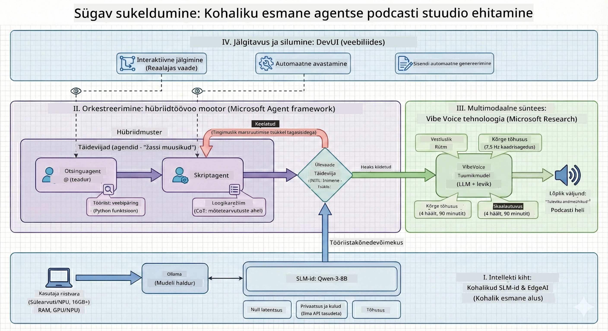

<!--
CO_OP_TRANSLATOR_METADATA:
{
  "original_hash": "f94e745264597bc5d8df967ead2eff97",
  "translation_date": "2026-01-05T11:00:44+00:00",
  "source_file": "WorkshopForAgentic/README.md",
  "language_code": "et"
}
-->
# 🎙️ AI Podcast Stuudio Töötuba

> 🌏 [中文版 (Hiina versioon)](translation/zh-cn/README.md)


## Sinu Missioon

Tere tulemast **The AI Podcast Studio'sse**! Sa oled teel käivitama oma tehnoloogiast rääkivat taskuhäälingut "Future Bytes" — aga siin on vike keerutus: sa ehitad tehisintellektil põhineva tootmismeeskonna, mis sind aitab. Ei mingit lõputut uurimistööd, stsenaariumikirjutamist ega heliredigeerimist. Selle asemel kodeerid end teekonnale, et saada AI-võimetega taskuhäälingu tootjaks.

## Lugu

Kujuta ette: sina ja su sõbrad tahate alustada taskuhäälingut kõige ägedamatest tehnoloogiatrendidest, aga kõik on hõivatud kooli, töö või elu muude asjadega. Mis oleks, kui saaksid ehitada AI-agentide meeskonna, kes teeks raske töö sinu eest? Üks agent teeb uurimistööd, teine kirjutab köitvaid stsenaariume ja kolmas muudab teksti loomulikku kõlavaiks vestlusteks. Kõlab ulmena? Teeme selle reaalsuseks.

## Mida Sa Õpid

Selle töötuba lõpuks tead, kuidas:
- 🤖 Käivitada oma kohalik AI mudel (ei mingeid API kulusid, pilve sõltuvust!)
- 🔧 Ehita spetsialiseeritud AI agente, kes oskavad tõesti koos töötada
- 🎬 Loo terve taskuhäälingu tootmisahel ideest kuni helini

## Sinu Teekond: Kolm vaatus



Nagu igas heas loos, on meil kolm vaatust. Igaüks ehitab sinu AI taskuhäälingustuudiot samm-sammult:

| Episood | Sinu Otsing | Mis Juhtub | Omandatud Oskused |
|---------|-------------|------------|-------------------|
| **Vaat. 1** | [Tutvu oma AI abimeestega](md/01.BuildAIAgentWithSLM.md) | Avastad, kuidas luua AI agente, kes saavad vestelda, veebis otsida ja isegi probleeme lahendada. Mõtle neile kui oma uurimispraktikantidele, kes ei maga kunagi. | 🎯 Ehitada oma esimene agent<br>🛠️ Anda talle supervõimed (tööriistad!)<br>🧠 Õpetada mõtlema<br>🌐 Ühenduda internetiga |
| **Vaat. 2** | [Kogu oma tootmismeeskond](md/02.AIAgentOrchestrationAndWorkflows.md) | Nüüd läheb huvitavaks! Korraldad mitut AI agenti, kes töötavad koos nagu tõeline taskuhäälingumeeskond. Üks teeb uurimist, teine kirjutab, sina heaks kiidad — meeskonnatöö teeb unistused teoks. | 🎭 Koordineeri mitut agenti<br>🔄 Ehita heakskiiduvoolud<br>🖥️ Testi DevUI liideses<br>✋ Hoia inimesed kontrollis |
| **Vaat. 3** | [Too oma podcast ellu](md/03.Multi-SpeakerPodcastGenerationWithVibeVoice.md) | Finaal! Muuda oma tekstist stsenaariumid päriseks podcast-heliks realistlike häälte ja loomulike vestlustega. Sinu "Future Bytes" taskuhääling on valmis saatmiseks! | 🎤 Tekst kõneks võlu<br>👥 Mitme esineja hääled<br>⏱️ Pikad formaadid<br>🚀 Täisautomaatika |

Iga vaatusega avanevad uued oskused. Julged hüpata ettepoole, aga soovitame järgida lugu!

## Keskkonna Nõuded

See töötuba toetab erinevaid riistvarakeskkondi:
- **CPU**: Sobib testimiseks ja väikeseks kasutuseks
- **GPU**: Soovitatav tootmiskeskkondadele, parandab oluliselt töötluskiirust
- **NPU**: Toetab järgmise põlvkonna närviüksuse kiirendust

## Mida Sa Vaja Läheb

### Tarkvara Kontrollnimekiri ✅
- **Python 3.10+** (Sinu programmeerimiskeel)
- **Ollama** (Käivita AI mudeleid oma masinas)
- **VS Code** (Sinu koodiredaktor)
- **Python laiendus** (Muudab VS Code targemaks)
- **Git** (Koodi hankimiseks)

### Riistvara Kontroll 💻
- **Kas ma saan seda käivitada?**: 8GB RAM, 10GB vaba ruumi (töötab, aga võib olla aeglane)
- **Ideaalne seadistus**: 16GB+ RAM, korralik GPU (mugav kasutus!)
- **NPU saadaval?**: Veel parem! Järgmise taseme jõudlus saadaval 🚀

## Stuudio Seadistus 🎬

### Samm 1: Pythoni jõudmine

Veendu, et sul on Python 3.10 või uuem:

```bash
python --version
# Peaks näitama Python 3.10.x või uuemat versiooni
```

Pole Pythoni? Võta see kätte [python.org](https://python.org) — tasuta!

### Samm 2: Laadi alla Ollama (Sinu AI mudelite käitaja)

Mine lehele [ollama.ai](https://ollama.ai) ja lae oma OS-ile Ollama alla. Mõtle sellele kui mootorile, mis käivitab sinu AI mudelid lokaalselt.

Kontrolli, kas valmis:

```bash
ollama --version
```

### Samm 3: Laadi alla oma AI aju 🧠

On aeg hankida Qwen-3-8B mudel (see on nagu oma esimese AI assistendi palkamine):

```bash
ollama pull qwen3:8b
```

*See võib võtta paar minutit. Täiuslik aeg kohvipausiks! ☕*

### Samm 4: Sea üles VS Code

Kui sul pole veel Visual Studio Code’i, võta see [siit](https://code.visualstudio.com/). Parim koodiredaktor üldse (võid vastu vaielda 😄).

### Samm 5: Python laiendus

VS Codes:
1. Vajuta `Ctrl+Shift+X` (või `Cmd+Shift+X` Macil)
2. Otsi "Python"
3. Paigalda Microsofti ametlik Python laiendus

### Samm 6: Sa oled valmis! 🎉

Tõsiselt, oled valmis. Alustame AI-võluga!

### Samm 7: Paigalda Microsoft Agent Framework ja seotud paketid 📦

Paigalda kõik vajaminevad sõltuvused töötoa jaoks:

```bash
pip install -r ./Installations/requirements.txt -U
```

*See paigaldab Microsoft Agent Frameworki ja kõik vajalikud paketid. Võta kohvikruus — esmakordsel seadistamisel võib natuke aega võtta! ☕*

## Töötoa Juhised

Põhjalik projekti ülesehitus, konfiguratsiooni sammud ja käivitamise meetodid selgitatakse samm-sammult töötoa käigus.

## Veaparandused (Kui asi veab välja) 🔧

### "Oi, mudeli allalaadimine venib lõpmatuseni!"
**Lahendus**: Kasuta VPN-i või sea Ollama peegelpakk alla. Mõnikord vihkab internet meid.

### "Minu arvuti sureb! Mälu puudus!"
**Lahendus**: Kasuta väiksemat mudelit või kohanda `num_ctx` seadet, et vähem mälu kasutada. Mõtle sellele kui AI dieedile panekule.

### "Kas ma saan seda kiiremaks teha oma GPU-ga?"
**Lahendus**: Ollama tunneb automaatselt GPU-d ära! Veendu, et su GPU draiverid on värsked. Tasuta kiirendus! 🏎️

## Lisamaterjalid (Uudishimulikele) 📚

- [Ollama dokumentatsioon](https://github.com/ollama/ollama) — süvitsi kohalikud AI mudelid
- [Microsoft Agent Framework](https://microsoft.github.io/autogen/) — rohkem agentmeeskondade ehitamisest
- [Qwen mudeli info](https://qwenlm.github.io/) — tutvu oma AI assistendi ajuga

## Litsents

MIT litsents — ehita lahedaid asju, jaga neid, muuda maailma paremaks! 🌍

## Tahad Panustada?

Leidsid vea? On idee? Lisa Issue või PR! Me armastame kogukondlikku vaimu. ✨

---

<!-- CO-OP TRANSLATOR DISCLAIMER START -->
**Vastutusest loobumine**:
See dokument on tõlgitud kasutades AI tõlketeenust [Co-op Translator](https://github.com/Azure/co-op-translator). Kuigi püüame täpsust, palun arvestage, et automaatsed tõlked võivad sisaldada vigu või ebatäpsusi. Originaaldokument selle esialgses keeles tuleks pidada autoriteetseks allikaks. Olulise teabe puhul soovitatakse kasutada professionaalset inimtõlget. Me ei vastuta selle tõlke kasutamisest tingitud arusaamatuste ega väärtõlgenduste eest.
<!-- CO-OP TRANSLATOR DISCLAIMER END -->