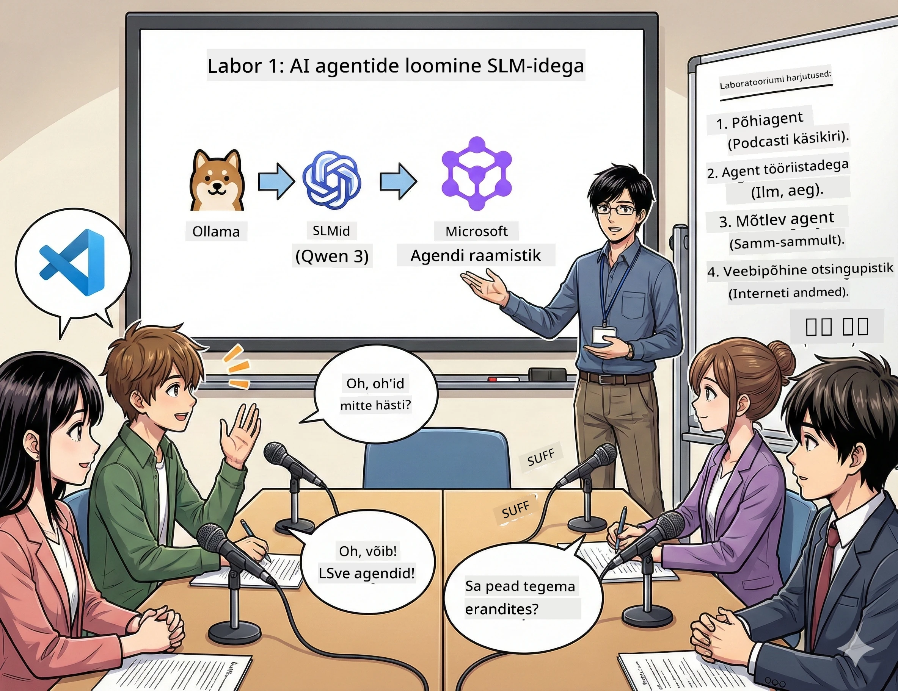

# 1. vaatus: Tutvu oma tehisintellekti uurimisabiga 🤖

## Väljakutse

Sa alustad uut tehnoloogiapodcast'i "Future Bytes". Esimene saade räägib viimastest tehisintellekti läbimurretest, kuid sul on aega vaid 24 tundi, et:
1. Teemat uurida
2. Leida usaldusväärseid allikaid
3. Kirjutada kaasahaarav stsenaarium
4. Teha see kõlav loomulikult

**Pöördepunkt**: Sa ei pea seda tegema üksi. Sa hakkad looma oma esimest tehisintellekti assistenti, kes saab sind kõiges aidata. Nimetame teda Alex — sinu väsimatuks uurimispartneriks, kes ei maga kunagi.

## Miks väikesed keelemudelid? (Spoiler: Need on ägedad)

Väikesi keelemudeleid (SLMid) võid vaadelda kui oma isiklikku tehisintellekti, mis elab *sinu* arvutis. Ühtegi pilve, igakuiseid tasusid ega kahtlast andmete jagamist.

**Miks SLM-id on 🔥:**
- **🏠 Töötab sinu masinas**: sülearvuti, lauaarvuti või isegi võimas Raspberry Pi
- **💸 Pole jooksvaid kulusid**: ei mingit API tasusid, mis su lõunasöögi ära sööks
- **🔒 Esikohal privaatsus**: su andmed ei lahku su seadmest
- **⚡ Välkkiire**: ühenduse viivitust ei ole, vastused kohe olemas
- **🪦 Kergekaaluline**: 1B–10B parameetrit võrreldes üle 100B suuremate mudelitega

**Populaarsed SLM-id**: Qwen 3, Phi-4, Gemma 3 (me kasutame siin töötoas Qweni)

## Sinu tööriistad

### Ollama: Sinu tehisintellekti mudelite haldaja

[Ollama](https://ollama.com/) on nagu Steam tehisintellekti mudelite jaoks. Laadi alla, käivita ja halda mudeleid lihtsate käskudega.

**Miks see on lahe:**
- Üks käsk misiganes mudeli allalaadimiseks ja käivitamiseks
- Töötab Maci, Windowsi ja Linuxiga
- Kasutab automaatselt sinu GPU-d, kui sul see on
- Väga mälu-tõhus

### Microsoft Agent Framework: Seal, kus toimub võlu

[Microsoft Agent Framework](https://github.com/microsoft/agent-framework) on sinu mänguväli tehisintellekti agentide ehitamiseks, kes saavad:

- 💬 Vestelda ja meeles pidada, millest olete rääkinud
- 🛠️ Kasutada kohandatud tööriistu (nt veebis otsimine või ilma kontrollimine)
- 🧠 Läbimõelda keerulisi probleeme samm-sammult
- 🤝 Töötada koos teiste agentidega meeskonnana
- 🔌 Ühenduda erinevate tehisintellekti pakkujatega (OpenAI, Ollama, Azure)

**Ehitusplokid:**
- **Agentid**: Sinu tehisintellekti assistendid konkreetsete ülesannetega
- **Tööriistad**: Eri võimed, mille sa neile annad
- **Mälu**: Et nad ei unustaks teie vestlust
- **Järeldamine**: Õpetamine mõtlema, mitte ainult vastamist

## Sinu treeningmontaaž: 4 missiooni

### Missioon 1: Loo oma esimene agent

📓 [Ava märkmik](../code/01.BasicAgent/00.BasicAgent-agent.ipynb)

**Eesmärk**: Ehita Alex, sinu podcast'i stsenaariumite kirjutaja AI. Alex peab genereerima dialoogi kahe saatejuhi vahel, kes arutlevad tehnikateemadel.

**Mida sa õpid**:
- Kuidas agenti äratada (see on lihtsam kui esmaspäeval ärkamine)
- Anda talle isikupära ja juhiseid
- Panna teda kirjutama tegelikke podcast'i tekstisid
- Mõista, mida ta sulle tagasisidena ütleb

**Võidutingimus**: Alex kirjutab stsenaariumi "Future Bytes" piloodi saatele tehisintellektist! 🎯

### Missioon 2: Anna Alexile supervõimed (Tööriistad!)

📓 [Ava märkmik](../code/01.BasicAgent/01.BasicAgent-tools.ipynb)

**Eesmärk**: Alex on tark, aga ei tea tänast ilma ega kellaega. Parandame selle, andes talle tööriistad!

**Mida sa õpid**:
- Luua kohandatud Python funktsioonid kui "tööriistad"
- Lasta Alexil otsustada, *millal* millist tööriista kasutada
- Vaadata, kuidas ta iseseisvalt probleeme lahendab
- Ühendada mitu tööriista keerukamate ülesannete lahendamiseks

**Võidutingimus**: Küsi "Milline ilm on Tokyos?" ja Alex leiab vastuse ise! ☁️

### Missioon 3: Õpeta Alex mõtlema

📓 [Ava märkmik](../code/01.BasicAgent/02.BasicAgent-reasoning.ipynb)

**Eesmärk**: Pane Alex näitama, kuidas ta probleeme lahendab. Sa tahad näha, *kuidas* ta mõtleb, mitte ainult lõpptulemust.

**Mida sa õpid**:
- Lülitada sisse "mõtlemise režiimi" (see on nagu koolis lahenduste näitamine matemaatikas)
- Vaadata Alexi samm-sammult järeldamisprotsessi
- Mõista mõttekäigu juhiseid
- Siluda vigu, kui Alex eksib

**Võidutingimus**: Esita keeruline matemaatiline ülesanne ja vaata, kuidas Alex seda lahendab! 🧠

### Missioon 4: Ühenda Alex internetiga

📓 [Ava märkmik](../code/01.BasicAgent/03.BasicAgent-websearch.ipynb)

**Eesmärk**: Alexi teadmus lõppes treeningandmetega. Ühenda teda veebiga, et saada reaalajas infot!

**Mida sa õpid**:
- Luua kohandatud veebipõhine otsingutööriist
- Integreerida väliseid API-sid
- Käsitleda võrguvigu elegantsemalt
- Hankida infot väljaspool Alexi treeningandmeid

**Võidutingimus**: Küsi tänased tehnoloogiauudised ja saa värskeid tulemusi! 📰

## Enne alustamist 🚀

**Vajalikud vahendid**:
- Paigaldatud Python 3.10 või uuem
- Ollama tööle pandud (kontrolli käsuga `ollama --version`)
- VS Code koos Python laiendusega
- Vähemalt 8 GB RAMi (sujuvaks tööks 16 GB)

## Missioonide järjekord

Järgi märkmikke kronoloogiliselt, et saada täielik lugu:

1. [00.BasicAgent-agent.ipynb](../code/01.BasicAgent/00.BasicAgent-agent.ipynb) — Tutvu Alexiga (sinu esimene agent)
2. [01.BasicAgent-tools.ipynb](../code/01.BasicAgent/01.BasicAgent-tools.ipynb) — Võimendamise aeg!
3. [02.BasicAgent-reasoning.ipynb](../code/01.BasicAgent/02.BasicAgent-reasoning.ipynb) — Õpeta Alex mõtlema
4. [03.BasicAgent-websearch.ipynb](../code/01.BasicAgent/03.BasicAgent-websearch.ipynb) — Internetiühendus valla!

## Mida sa valdad

1. vaatuse järel oskad:
- ✅ Käivitada tehisintellekti mudeleid oma riistvaral (ilma pilveta!)
- ✅ Luua agente kohandatud isikupära ja oskustega
- ✅ Anda agentidele tööriistad reaalsete probleemide lahendamiseks
- ✅ Panna agentidele näitama oma loogikaprotsessi
- ✅ Ühenduda agentidega väliste andmeallikate kaudu
- ✅ Siluda vigu, kui midagi läheb viltu

## Kui midagi läheb viltu (ja kuidas parandada) 🔧

### "Alex ei käivitu! Mälu puudub!"
**Parandus**: Sinu arvuti on koormatud. Proovi sulgeda teisi rakendusi või kasuta väiksemat mudelit. 8 GB RAM on absoluutne miinimum.

### "Alex on iiiiiiii aeglane"
**Parandus**: Lülita Ollama seadetes sisse GPU kiirendus. Või vähenda konteksti akna suurust. Kiiruserežiim aktiveeritud! 🏎️

### "Tööriistad ei tööta!"
**Parandus**: Kontrolli oma funktsioonide signatuure üle. Alex vajab õigeid tüübi vihjeid, et mõista, mida tööriist teeb. Mõtle sellele kui selgetele juhistele.

## Kasulikud lingid 🔗

- [Agent Framework Docs](https://github.com/microsoft/agent-framework) — ametlikud juhendid ja näited
- [Ollama Model Library](https://ollama.com/library) — sirvi kõiki saadaval olevaid mudeleid
- [Qwen Model](https://ollama.com/library/qwen3) — tutvu oma AI mõistusega
- [Koodi näited](https://github.com/microsoft/agent-framework/tree/main/python/samples) — varasta ideid siit

## Järgmine: 2. vaatus 🎬

Sul on üks agent. Aga mis siis, kui sul oleks *meeskond* agente, kes töötavad koos? 2. vaatuses ehitad oma täieliku podcast'i tootmismeeskonna:
- **Uurimisagent**: Leiab parimad allikad
- **Kirjutamisagent**: Koostab ideaalse stsenaariumi  
- **Toimetaja (Sina!)**: Kinnitab või nõuab parandusi

Teeme natuke tehisintellekti võlu! → [2. vaatus: Koosta oma tootmismeeskond](02.AIAgentOrchestrationAndWorkflows.md)

---

**Jääd hätta?** Küsi küsimusi töötoa ajal. Õpime kõrvuti! 🙌

---

<!-- CO-OP TRANSLATOR DISCLAIMER START -->
**Vastutusest loobumine**:
See dokument on tõlgitud kasutades tehisintellektil põhinevat tõlketeenust [Co-op Translator](https://github.com/Azure/co-op-translator). Kuigi püüame tagada täpsust, palun arvestage, et automaatsed tõlked võivad sisaldada vigu või ebatäpsusi. Originaaldokument selle emakeeles on autoriteetne allikas. Olulise teabe puhul soovitatakse kasutada professionaalset inimtõlget. Me ei vastuta selle tõlke kasutamisest tulenevate arusaamatuste või valesti mõistmiste eest.
<!-- CO-OP TRANSLATOR DISCLAIMER END -->