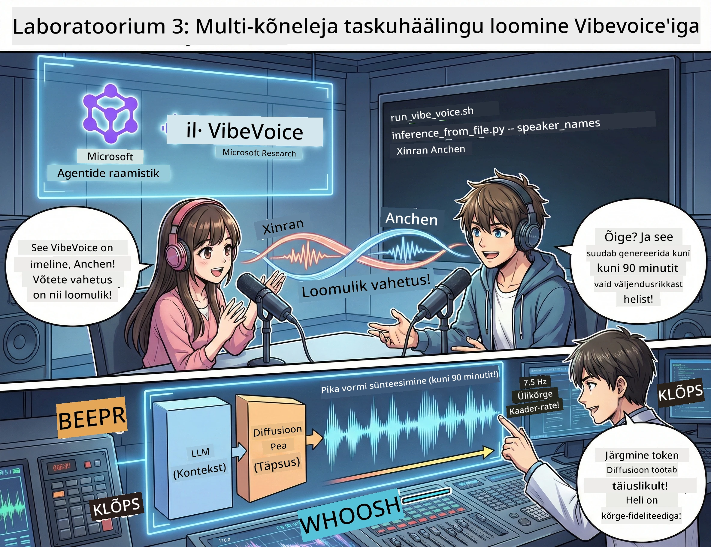

# Teine vaat: Too oma taskuhääling ellu 🎤



## Suur finaal

Sa oled uurinud teemasid. Sa oled kirjutanud stsenaariumid. Nüüd järgmine samm: muuda oma tekst päris taskuhäälingu heliks realistlike häältega!

Tutvu **VibeVoice'iga** — Microsoft Researchi avatud lähtekoodiga TTS (tekst kõneks) imeloominguga, mis loob:
- 🎭 Loomuliku kõlaga vestlusi
- 👥 Mitme esineja hääli (kuni 4!)
- ⏱️ Pikki helisalvestusi (kuni 90 minutit!)
- 🎵 Väljendusrikka esituse (mitte robotihääled!)

See on tehnoloogia sünteetiliste taskuhäälingute taga. Loome sinu oma!

## Mis on VibeVoice? (Lahedad asjad)

VibeVoice on Microsoft Researchi kingitus maailmale. See on spetsiaalselt loodud podcast-tüüpi vestluste heliks.

### Miks see on äge 🔥

* **⏱️ Maratonistseenid**: Genereerib kuni 90 minutit järjest kõnet (see on terve taskuhäälingu episood!)
* **👥 Mitme hääle maagia**: Kuni 4 erinevat häält järjepidevate isiksustega
* **⚡ Vägagi tõhus**: Kasutab ülalahjat 7.5 Hz kaadritihedusega, et säästa arvutusressursse
* **🧠 Tark heli**: Kombineerib LLM-i (mõistab konteksti) ja diffusioonimudeli (tekitab realistlikku heli)
* **🎭 Loomulik vool**: Haldab korrajärjekorda, pause ja vestlusrythmi automaatselt

**Tõlge**: VibeVoice ei loe lihtsalt su skripti ette — ta *esitab* selle nagu päris inimesed räägiksid.

---

## Enne alustamist 🚀

**Mida vajad**:

* 🐍 **Python 3.10+** (see sul juba olemas näidenditest 1 ja 2)
* 🚀 **uv** (kiire Python pakihaldur — installeerime selle)
* 📝 **Sinu skript**: `podcast.txt` fail näidendist 2 (asub `../03.Application/`)

**Pro nõuanne**: Selle sammu tegemiseks on vaja head internetiühendust eeltreenitud mudeli allalaadimiseks. Võta kohv! ☕

---

## Läheme! Lihtne viis 🎬

Me tegime selle imeluku lihtsaks. Üks shell skript teeb kõik ära.

### Protsess

1. **Muuda see täidetavaks**:
```bash
chmod +x run_vibe_voice.sh
```

2. **Käivita see**:
```bash
./run_vibe_voice.sh
```

3. **Oota imet** (esmakordsel käivitamisel võib veidi aega võtta)

### Mis toimub lava taga 🎭

Skript on sinu automatiseeritud helitehnik:

1. **📥 Laeb alla VibeVoice'i**: kloonib ametliku repode GitHubist
2. **📦 Paigaldab sõltuvusi**: kasutab `uv pip` kiireks paketipaigalduseks
3. **🎬 Genereerib heli**: käivitab inference skripti koos:
   * `--model_path`: Eeltreenitud VibeVoice-7B mudel
   * `--txt_path`: Su `podcast.txt` skript
   * `--speaker_names`: Määrab hääled (vaikimisi Xinran & Anchen)

**Tulemus**: Su skript muutub päris taskuhäälingu episoodiks! 🎉

---

## Sinu ülesanne 🎯

Hakkame korda saatma asju:

### Ülesanne 1: Loo sisu
Muuda faili `../03.Application/podcast.txt` kahe inimese vaheline vestlus. Teema võib olla tehnika, hobid või muu! Lihtsalt tee see vestluslikuks.

**Näite formaat**:
```
Speaker 1: Hey! Did you hear about the new AI model?
Speaker 2: No way! Tell me more!
Speaker 1: It's called...
```

### Ülesanne 2: Genereeri heli
Käivita skript ja vaata, kuidas ime sünnib. Esimene kord võtab kauem aega (mudeli allalaadimine).

### Ülesanne 3: Kuula & analüüsi
- Kas kõlab loomulikult?
- Kas esinejatel on erinevad hääled?
- Kas kordade vahetus toimub sujuvalt?
- Kas on roboti hetki?

### Ülesanne 4: Eksperimenteeri (julgetele)
Muuda faili `run_vibe_voice.sh` ja muuda `--speaker_names`, et proovida erinevaid häälte kombinatsioone. VibeVoice'il on palju eeltreenitud hääli!

**Boonus väljakutse**: Proovi 3-häälelist vestlust! 🎆

---

## Õpi veel 📚

* **🏠 Projekti koduleht**: [VibeVoice ametlik sait](https://microsoft.github.io/VibeVoice/)
* **🤗 Eeltreenitud mudel**: [Hugging Face - VibeVoice-7B](https://huggingface.co/vibevoice/VibeVoice-7B)
* **📖 Uurimuspaber**: Süvene tehnoloogiasse (kui see huvitab)

> **⚠️ Vastutustundliku tehisintellekti meeldetuletus**: VibeVoice on võimas. Kasuta eetiliselt! Ära loo süvavahendeid ega eksitavat sisu. Loo lahedaid asju, mis aitavad inimesi. 🙏

---

## 🏆 Palju õnne! Sa tegid selle ära!

Sa just lõpetasid kogu protsessi:
1. ✅ **Näidend 1**: Ehitad AI agente spetsiaalsete tööriistadega
2. ✅ **Näidend 2**: Orkestreerisid mitme agendi töövoo
3. ✅ **Näidend 3**: Genereerisid päris taskuhäälingu heli

**Sul on nüüd**:
- Töötav AI uurimisassistent
- Täielik taskuhäälingu tootmise töövoog
- Tõeline helifail, mida jagada

### Mis nüüd? 🚀

**Käivita oma taskuhääling!**
- Laadi üles taskuhäälingu platvormidele
- Jaga sotsiaalmeedias
- Paranda ja täiusta

**Jätka ehitamist!**
- Proovi erinevaid teemasid
- Eksperimenteeri rohkemate esinejatega
- Lisa taustamuusika
- Ehita veebiliides
- Automatiseeri kogu protsess

**Jaga oma tööd!**
Tägista meid! Näita maailmale, mida tegid. Tehisintellekti taskuhäälingu revolutsioon algab sinust. 🎙️

---

**Küsimused? Ideed? Edulood?** Kirjuta need töötoa vestlusesse!

**Tere tulemast sisuloome tulevikku.** 🌟

---

<!-- CO-OP TRANSLATOR DISCLAIMER START -->
**Vastutusest loobumine**:
See dokument on tõlgitud tehisintellektil põhineva tõlketeenuse [Co-op Translator](https://github.com/Azure/co-op-translator) abil. Kuigi püüame tagada täpsust, palun pidage meeles, et automaatsed tõlked võivad sisaldada vigu või ebatäpsusi. Originaaldokumendi keelne versioon on autoriteetne allikas. Tähtsas teabes soovitatakse kasutada professionaalset inimtõlget. Me ei vastuta selle tõlke kasutamisest tekkida võivate arusaamatuste või valesti mõistmiste eest.
<!-- CO-OP TRANSLATOR DISCLAIMER END -->